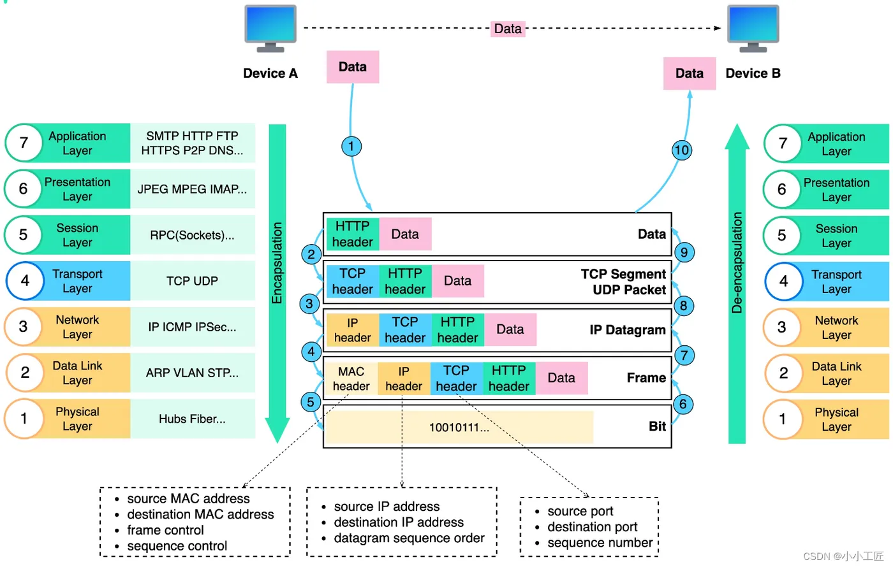
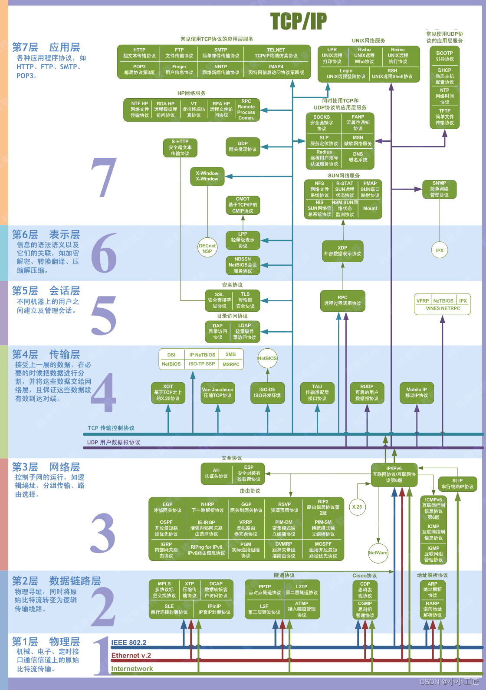
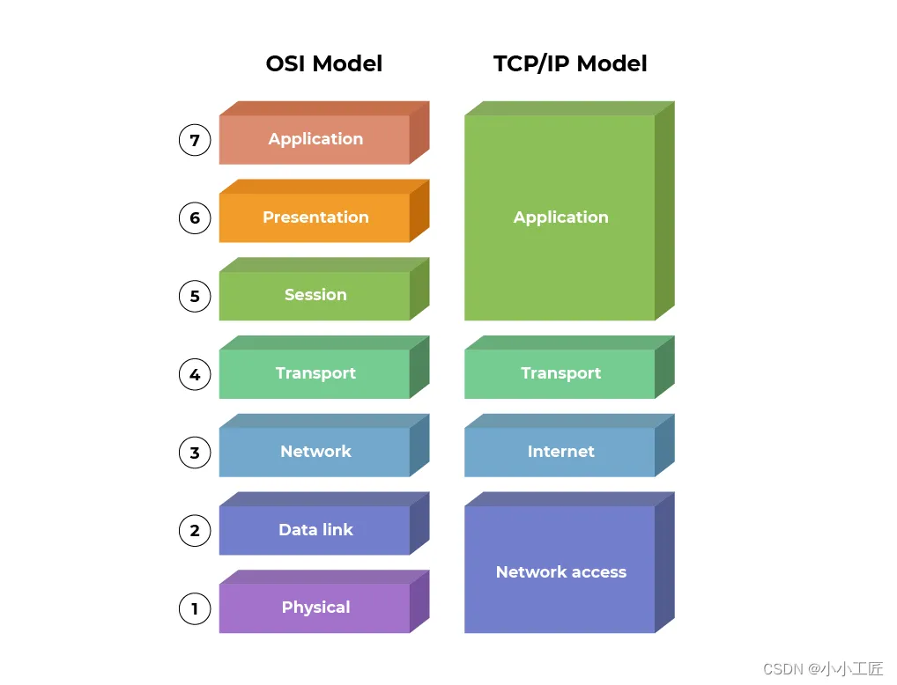
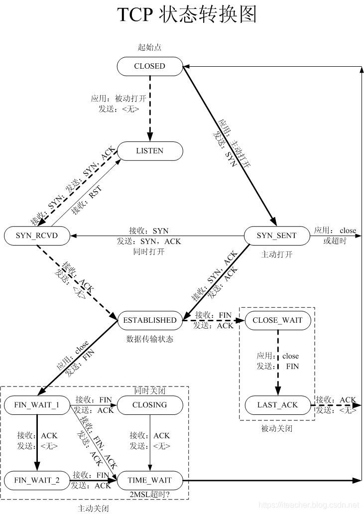

# Linux网络

## 概述

### 网络分层结构
 
#### OSI七层模型 vs TCP/IP四层模型

+ 表格

  + [table]

    | layer  | OSI                    | TCP/IP                      | note 1 | note 2 |
    | :----: | :--------------------- | :-------------------------- | :----- | :----- |
    | 7      | **Application Layer**  | **Application Layer**       |        |        |
    | 6      | **Presentation Layer** |   Application Layer         |        |        |
    | 5      | **Session Layer**      |   Application Layer         |        |        |
    | 4      | **Transport Layer**    | **Transport Layer**         |        |        |
    | 3      | **Network Layer**      | **Internet Layer**          |        |        |
    | 2      | **Data Link Layer**    | **Network Interface Layer** |        |        |
    | 1      | **Physical Layer**     |   Network Interface Layer   |        |        |


  + [diagram]  
      
      
    

  + 说明

    + OSI模型，理想模型
      + Application Layer -- 应用层
        + 应用层是最高层，为最终用户提供应用程序和网络服务。
        + 这包括诸如Web浏览器、电子邮件客户端、文件传输协议（FTP）等应用。
        + 与用户界面和应用程序通信的所有应用层协议都属于此层。

      + Presentation Layer -- 表示层
        + 表示层主要关注数据的格式化和编解码，以确保不同系统间的数据交换。
        + 它可以处理数据的加密、压缩和数据格式转换。

      + Session Layer -- 会话层
        + 会话层负责建立、管理和终止会话（会话是指两个设备之间的通信会话）。
        + 它还可以处理会话中的同步和恢复问题。

      + Transport Layer -- 传输层
        + 传输层提供端到端的数据传输服务，确保数据的可靠性和完整性。
        + 常见的传输层协议包括TCP（传输控制协议）和UDP（用户数据报协议）。

      + Network Layer -- 网络层
        + 网络层的主要任务是路由数据包，决定数据包的最佳路径从源到目的地。
        + IP（Internet Protocol）是网络层最著名的协议，负责地址分配和数据包转发。

      + Data Linker Layer -- 数据链路层
        + 数据链路层负责将原始比特流组织成数据帧，并在物理介质上进行可靠的传输。
        + 这一层还负责物理地址（MAC地址）的识别和帧的错误检测与校正。
        + 常见的数据链路协议包括以太网（Ethernet）和Wi-Fi。

      + Physical Layer -- 物理层
        + 物理层是网络通信的最底层，主要关注物理媒介和传输数据的硬件特性。
        + 它定义了数据传输的物理介质，如电缆、光纤、无线电波等。
        + 主要任务包括数据的编码、传输速率、电压水平等。

    + TCP/IP模型，实际模型
      + Application Layer
      + Transport Layer
      + Internet Layer
      + Network Interface Layer

### TCP/IP网络状态

#### 简述

+ [diagram]  
  

#### 网络状态

+ LISTEN

+ SYN_SENT

+ SYN_RECEIVED

+ ESTABLISHED

+ FIN_WAIT_1

+ FIN_WAIT_2

+ CLOSE_WAIT

+ CLOSING

+ LAST_ACK

+ TIME_WAIT

+ CLOSED

#### 连接和断开

+ 三次握手: three-way handshaking

+ 四次挥手: four-way wavehanding

#### 协议、服务和端口

##### 简表

+ [table]

  | Abbreviations | Protocol | Service | Description                         | Comments                                  |
  | :------------ | :------- | :------ | :---------------------------------- | :---------------------------------------- |
  | ARP           | [X]      |         | Address Resolution Protocol         |                                           |
  | DHCP          | [X]      |         | Dynamic Host Configuration Protocol |                                           |
  | DNS           |          | [X]     | Domain Naming Service               |                                           |
  | FINGER        |          | [X]     |                                     | Port:79                                   |
  | FTP           | [X]      | [X]     | File Transfer Protocol              | Port:20 (for Data); Port:21 (for Service) |
  | HTTP          | [X]      | [X]     | Hype Text Transfer Protocol         | Port:80                                   |
  | IAMP          | [X]      | [X]     |                                     | Port:993                                  |
  | ICMP          | [X]      |         | Internet Control Message Protocol   |                                           |
  | IP            | [X]      |         | Internet Protocol                   |                                           |
  | NAMESERVER    |          | [X]     |                                     | Port:42                                   |
  | NAT           |          |         |                                     |                                           |
  | NETBIOS       |          |         |                                     | Port:137, 138                             |
  | POP3          | [X]      | [X]     | Post Office Protocol - Version 3    | Port:110                                  |
  | RARP          | [X]      |         | Reverse ARP                         |                                           |
  | RPC           |          |         | Remote Procedure Call               | Port:135                                  |
  | SFTP          | [X]      | [X]     | Security FTP                        | Port:22                                   |
  | SSH           |          |         | Security Shell Protocol             | Port:22                                   |
  | SMTP          | [X]      | [X]     | Simple Mail Transfer Protocol       | Port:25, 465                              |
  | SNMP          | [X]      |         |                                     | Port:161                                  |
  | TCP           | [X]      |         | Transport Control Protocol          |                                           |
  | Telnet        |          | [X]     |                                     | Port:23                                   |
  | UDP           | [X]      |         | User Datagram Protocol              |                                           |

##### 端口 ports

+ Well-Known Ports, 0 ~ 1023, 公认端口;  
+ Dynamic Ports,    1024 ~ 65535, 动态端口;  
  + Registered Ports, 1024 ~ 49151, 注册端口;  
  + Private Ports, 49152 ~ 65535, 私有端口;  

## 常用命令

## Kali Tools

# Linux-Network学习笔记 附录

## 参考

## Kali 相关软件包

### 工具分类 (Kali Menu)

[Kali Menu Tools](kali-Tools.md)

### 工具分类(1)

+ 信息收集

  + 网络扫描
    + Nmap
    + Masscan
    + Unicornscan

  + 协议分析工具
    + Wireshark
    + Tcpdump

  + 开放端口与资源探测工具
    + _Nmap_
    + Zenmap, nmap的图形终端

+ 漏洞分析 & 渗透测试

  + 漏洞利用框架
    + Metasploit Framework

  + Web应用安全测试工具
    + Burp Suite

+ 无线攻击

  + 无线网络破解工具
    + Aircrack-ng
    + Fern Wifi Cracker

  + 信号监听与流量捕获工具
    + Kismet
    + wifite

+ Web应用程序

+ 密码破解

  + 离线破解工具
    + John the Ripper

  + 在线暴力破解工具
    + Hydra

+ 维持访问

+ 逆向工程

+ 报告工具

+ 嗅探和欺骗

+ 取证和安全分析
  + 流量捕获与分析
  + 活动日志与攻击路径映射
    + Bloodhound
      + azurehound
      + sharphound
+ 压力测试

+ 硬件破解

+ 社会工程学和其他工具
  + 社会工程工具
    + Social-Engineer Toolkit (SET)
  + 网络管理与通用工具
    + Netcat
    + Sqlmap
    + CrackMapExec
    + Nikto

+ 其他

  + binwalk3
  + crlfuzz
  + donut-shellcode
  + gitxray
  + ldeep
  + ligolo-ng
  + rubeus

  + tinja


### 工具列表

+ dmitry
  + 类型: 信息收集
  + 使用模式:
  + 功能
    + whois查询
    + 子域名收集
    + 端口扫描

+ dnmap

+ fping
  + Version

    + [operating]

      ```sh
      ┌──(edgar㉿ThinkPadT14P-23)-[/mnt/c/Workspace]
      └─$ fping --version
      fping: Version 5.1
      
      ┌──(edgar㉿ThinkPadT14P-23)-[/mnt/c/Workspace]
      └─$
      ```

  + Help

    + [operating]

      ```sh
      ┌──(edgar㉿ThinkPadT14P-23)-[/mnt/c/Workspace]
      └─$ fping --help
      Usage: fping [options] [targets...]
      
      Probing options:
         -4, --ipv4         only ping IPv4 addresses
         -6, --ipv6         only ping IPv6 addresses
         -b, --size=BYTES   amount of ping data to send, in bytes (default: 56)
         -B, --backoff=N    set exponential backoff factor to N (default: 1.5)
         -c, --count=N      count mode: send N pings to each target
         -f, --file=FILE    read list of targets from a file ( - means stdin)
         -g, --generate     generate target list (only if no -f specified)
                            (give start and end IP in the target list, or a CIDR address)
                            (ex. fping -g 192.168.1.0 192.168.1.255 or fping -g 192.168.1.0/24)
         -H, --ttl=N        set the IP TTL value (Time To Live hops)
         -I, --iface=IFACE  bind to a particular interface
         -l, --loop         loop mode: send pings forever
         -m, --all          use all IPs of provided hostnames (e.g. IPv4 and IPv6), use with -A
         -M, --dontfrag     set the Don't Fragment flag
         -O, --tos=N        set the type of service (tos) flag on the ICMP packets
         -p, --period=MSEC  interval between ping packets to one target (in ms)
                            (in loop and count modes, default: 1000 ms)
         -r, --retry=N      number of retries (default: 3)
         -R, --random       random packet data (to foil link data compression)
         -S, --src=IP       set source address
         -t, --timeout=MSEC individual target initial timeout (default: 500 ms,
                            except with -l/-c/-C, where it's the -p period up to 2000 ms)
      
      Output options:
         -a, --alive        show targets that are alive
         -A, --addr         show targets by address
         -C, --vcount=N     same as -c, report results in verbose format
         -d, --rdns         show targets by name (force reverse-DNS lookup)
         -D, --timestamp    print timestamp before each output line
         -e, --elapsed      show elapsed time on return packets
         -i, --interval=MSEC  interval between sending ping packets (default: 10 ms)
         -n, --name         show targets by name (reverse-DNS lookup for target IPs)
         -N, --netdata      output compatible for netdata (-l -Q are required)
         -o, --outage       show the accumulated outage time (lost packets * packet interval)
         -q, --quiet        quiet (don't show per-target/per-ping results)
         -Q, --squiet=SECS  same as -q, but add interval summary every SECS seconds
         -s, --stats        print final stats
         -u, --unreach      show targets that are unreachable
         -v, --version      show version
         -x, --reachable=N  shows if >=N hosts are reachable or not
      
      ┌──(edgar㉿ThinkPadT14P-23)-[/mnt/c/Workspace]
      └─$
      ```

  + 参数 和 选项
    + "-4" / "--ipv4",
    + "-6" / "--ipv6",
    + "-b" / "--size",
    + "-f" / "--file", 指定主机文件, 只接受IP地址
    + "-g" / "--generate", 指定ping主机范围

  + 示例

    + [operating]

+ Masscan

  + 类型: 网络扫描

  + 版本

    + [operating]

      ```sh
      ┌──(edgar㉿ThinkPadT14P-23)-[/mnt/c/Workspace]
      └─$ masscan --version
      
      Masscan version 1.3.2 ( https://github.com/robertdavidgraham/masscan )
      Compiled on: Jul 25 2024 16:44:22
      Compiler: gcc 14.1.0
      OS: Linux
      CPU: unknown (64 bits)
      GIT version: unknown
      
      ┌──(edgar㉿ThinkPadT14P-23)-[/mnt/c/Workspace]
      └─$
      ```

+ Nmap

  + 类型: 信息收集, 网络扫描

  + 版本

    + [operating]

      ```sh
      ┌──(edgar㉿ThinkPadT14P-23)-[/mnt/c/Workspace]
      └─$ nmap --version
      Nmap version 7.98 ( https://nmap.org )
      Platform: x86_64-pc-linux-gnu
      Compiled with: liblua-5.4.8 openssl-3.5.5 libssh2-1.11.1 libz-1.3.1 libpcre2-10.46 libpcap-1.10.6 nmap-libdnet-1.18.0 ipv6
      Compiled without:
      Available nsock engines: epoll poll select
      
      ┌──(edgar㉿ThinkPadT14P-23)-[/mnt/c/Workspace]
      └─$
      ```

## 操作

### wsl

####　KaliLinux

##### 常用命令

+ 系统软件包升级

  + `sudo apt update`

  + `sudo apt upgrade`

+ 安装软件包

  + `sudo apt install 软件包名`

  + `sudo apt install 文件名`

+ 卸载软件包
  + `sudo apt autoremove`

  + `sudo apt remove --purge 软件包名`

+ 清理软件安装缓存
  + `sudo apt autoclean`

##### 维护历史

+ op on 20260502

  + 安装

    + [operating]

      ```cmd
      C:\Workspace>wsl --install kali-linux
      Downloading: Kali Linux Rolling
      Installing: Kali Linux Rolling
      Distribution successfully installed. It can be launched via 'wsl.exe -d kali-linux'
      Launching kali-linux...
      Waiting for systemd to start...
      running
      Please create a default Kali WSL user. The username does not need to match your       Windows username.
      For more information visit: https://aka.ms/wslusers
      Enter new UNIX username: edgar
      New password:
      Retype new password: LiHaobo#1119
      passwd: password updated successfully
      usermod: no changes
      ┌──(edgar㉿ThinkPadT14P-23)-[/mnt/c/Workspace]
      └─$ sudo shutdown -h 3
      ```

  + 导出、清除、导入

    + [operating]

      ```cmd
      C:\Workspace>wsl --export kali-linux C:\Workspace\VirtualMachine\KaliLinux26_260502_0000.tar
      Export in progress, this may take a few minutes. (724 MB)
      
      The operation completed successfully.
      
      C:\Workspace>wsl --unregister kali-linux
      Unregistering.
      The operation completed successfully.
      
      
      C:\Workspace>wsl --import KaliLinux26 C:\Workspace\VirtualMachine\Kali\KaliLinux26 C:\Workspace\VirtualMachine\KaliLinux26_260502_0000.tar
      The operation completed successfully.
      
      C:\Workspace>      
      ```

  + 升级

    + [operating]

      ```sh
      C:\Workspace>wsl -d KaliLinux26 -u edgar
      ┏━(Message from Kali developers)
      ┃
      ┃ This is a minimal installation of Kali Linux, you likely
      ┃ want to install supplementary tools. Learn how:
      ┃ ⇒ https://www.kali.org/docs/troubleshooting/common-minimum-setup/
      ┃
      ┗━(Run: “touch ~/.hushlogin” to hide this message)
      ┌──(edgar㉿ThinkPadT14P-23)-[/mnt/c/Workspace]
      └─$ sudo apt update
      [sudo] password for edgar: 
      Get:1 http://mirrors.ustc.edu.cn/kali kali-last-snapshot InRelease [34.0 kB]
      Get:2 http://mirrors.ustc.edu.cn/kali kali-last-snapshot/main amd64 Packages [20.9 MB]
      Get:3 http://mirrors.ustc.edu.cn/kali kali-last-snapshot/main amd64 Contents (deb) [52.7 MB]
      Get:4 http://mirrors.ustc.edu.cn/kali kali-last-snapshot/contrib amd64 Packages [117 kB]
      Get:5 http://mirrors.ustc.edu.cn/kali kali-last-snapshot/contrib amd64 Contents (deb) [275 kB]
      Get:6 http://mirrors.ustc.edu.cn/kali kali-last-snapshot/non-free amd64 Packages [184 kB]
      Get:7 http://mirrors.ustc.edu.cn/kali kali-last-snapshot/non-free amd64 Contents (deb) [880 kB]
      Get:8 http://mirrors.ustc.edu.cn/kali kali-last-snapshot/non-free-firmware amd64 Packages [14.3 kB]
      Get:9 http://mirrors.ustc.edu.cn/kali kali-last-snapshot/non-free-firmware amd64 Contents (deb) [33.8 kB]
      Fetched 75.1 MB in 11s (6,872 kB/s)
      All packages are up to date.
      
      ┌──(edgar㉿ThinkPadT14P-23)-[/mnt/c/Workspace]
      └─$
      ```

  + 安装 "kali linux everything"

    + [operating]

      ```sh
      ┌──(edgar㉿ThinkPadT14P-23)-[/mnt/c/Workspace]
      └─$ sudo apt install -y kali-linux-everything
      ```

      + installation options

        + [operating]

          ```sh
          ┌─────────────────┤ Configuring keyboard-configuration ├──────────────────┐
          │ Please select the layout matching the keyboard for this machine.        │
          │                                                                         │
          │ Keyboard layout:                                                        │
          │                                                                         │
          │     English (US)                                                        │
          │     English (US) - Cherokee                                             │
          │     English (US) - English (classic Dvorak)                             │
          │     English (US) - English (Colemak)                                    │
          │     English (US) - English (Colemak-DH)                                 │
          │     English (US) - English (Colemak-DH ISO)                             │
          │     English (US) - English (Colemak-DH Ortholinear)                     │
          │     English (US) - English (Colemak-DH Wide)                            │
          │     English (US) - English (Colemak-DH Wide ISO)                        │
          │     English (US) - English (Dvorak)                                     │
          │     English (US) - English (Dvorak, alt. intl.)                         │
          │     English (US) - English (Dvorak, intl., with dead keys)              │
          │     English (US) - English (Dvorak, Macintosh, ANSI)                    │
          │     English (US) - English (Dvorak, Macintosh, ISO)                     │
          │     English (US) - English (Dvorak, one-handed, left)                   │
          │     English (US) - English (Dvorak, one-handed, right)                  │
          │     English (US) - English (intl., with AltGr dead keys)                │
          │     English (US) - English (Macintosh, ABC, ANSI)                       │
          │     English (US) - English (Macintosh, ABC, ISO)                        │
          │     English (US) - English (Norman)                                     │
          │     English (US) - English (programmer Dvorak)                          │
          │     English (US) - English (the divide/multiply toggle the layout)      │
          │     English (US) - English (US, alt. intl.)                             │
          │     English (US) - English (US, euro on 5)                              │
          │     English (US) - English (US, intl., with dead keys)                  │
          │     English (US) - English (US, Symbolic)                               │
          │     English (US) - English (Workman)                                    │
          │     English (US) - English (Workman, intl., with dead keys)             │
          │     English (US) - Hawaiian                                             │
          │     English (US) - Russian (US, phonetic)                               │
          │     English (US) - Serbo-Croatian (US)                                  │
          │     Other                                                               │
          │                                                                         │
          │                                                                         │
          │                   <Ok>                       <Cancel>                   │
          │                                                                         │
          └─────────────────────────────────────────────────────────────────────────┘
          ```

          input: `English (US)` `<OK>`

        + [operating]

          ```sh
          ┌────────────────────────────────────────────────────────────────┤ Tripwire Configuration ├─────────────────────────────────────────────────────────────────┐
          │                                                                                                                                                           │
          │ Tripwire uses a pair of keys to sign various files, thus ensuring their unaltered state.  By accepting here, you will be prompted for the passphrase for  │
          │ the first of those keys, the site key, during the installation.  You are also agreeing to create a site key if one doesn't exist already.  Tripwire uses  │
          │ the site key to sign files that may be common to multiple systems, e.g. the configuration & policy files.  See twfiles(5) for more information.           │
          │                                                                                                                                                           │
          │ Unfortunately, due to the Debian installation process, there is a period of time where this passphrase exists in a unencrypted format. Were an attacker   │
          │ to have access to your machine during this period, he could possibly retrieve your passphrase and use it at some later point.                             │
          │                                                                                                                                                           │
          │ If you would rather not have this exposure, decline here.  You will then need to create a site key, configuration file & policy file by hand.  See        │
          │ twadmin(8) for more information.                                                                                                                          │
          │                                                                                                                                                           │
          │ Do you wish to create/use your site key passphrase during installation?                                                                                   │
          │                                                                                                                                                           │
          │                                               <Yes>                                                  <No>                                                 │
          │                                                                                                                                                           │
          └───────────────────────────────────────────────────────────────────────────────────────────────────────────────────────────────────────────────────────────┘
          ```

          input: `<Yes>`

        + [operating]

          ```sh
          ┌────────────────────────────────────────────────────────────────┤ Tripwire Configuration ├─────────────────────────────────────────────────────────────────┐
          │                                                                                                                                                           │
          │ Tripwire uses a pair of keys to sign various files, thus ensuring their unaltered state.  By accepting here, you will be prompted for the passphrase for  │
          │ the second of those keys, the local key, during the installation.  You are also agreeing to create a local key if one doesn't exist already.  Tripwire    │
          │ uses the local key to sign files that are specific to this system, e.g. the tripwire database. See twfiles(5) for more information.                       │
          │                                                                                                                                                           │
          │ Unfortunately, due to the Debian installation process, there is a period of time where this passphrase exists in a unencrypted format. Were an attacker   │
          │ to have access to your machine during this period, he could possibly retrieve your passphrase and use it at some later point.                             │
          │                                                                                                                                                           │
          │ If you would rather not have this exposure, decline here.  You will then need to create a local key file by hand.  See twadmin(8) for more information.   │
          │                                                                                                                                                           │
          │ Do you wish to create/use your local key passphrase during installation?                                                                                  │
          │                                                                                                                                                           │
          │                                               <Yes>                                                  <No>                                                 │
          │                                                                                                                                                           │
          └───────────────────────────────────────────────────────────────────────────────────────────────────────────────────────────────────────────────────────────┘
          ```

          input: `<Yes>`

        + [operating]

          ```sh
           ┌────────────────────────────────────────────────────────────────┤ Tripwire Configuration ├─────────────────────────────────────────────────────────────────┐
           │                                                                                                                                                           │
           │ Tripwire keeps its configuration in a encrypted database that is generated, by default, from /etc/tripwire/twcfg.txt                                      │
           │                                                                                                                                                           │
           │ Any changes to /etc/tripwire/twcfg.txt, either as a result of a change in this package or due to administrator activity, require the regeneration of the  │
           │ encrypted database before they will take effect.                                                                                                          │
           │                                                                                                                                                           │
           │ Selecting this action will result in your being prompted for the site key passphrase during the post-installation process of this package.                │
           │                                                                                                                                                           │
           │ Rebuild Tripwire configuration file?                                                                                                                      │
           │                                                                                                                                                           │
           │                                               <Yes>                                                  <No>                                                 │
           │                                                                                                                                                           │
           └───────────────────────────────────────────────────────────────────────────────────────────────────────────────────────────────────────────────────────────┘
           ```

           input: `<Yes>`

        + [operating]

          ```sh
          ┌────────────────────────────────────────────────────────────────┤ Tripwire Configuration ├─────────────────────────────────────────────────────────────────┐
          │                                                                                                                                                           │
          │ Tripwire keeps its policies on what attributes of which files should be monitored in a encrypted database that is generated, by default, from             │
          │ /etc/tripwire/twpol.txt                                                                                                                                   │
          │                                                                                                                                                           │
          │ Any changes to /etc/tripwire/twpol.txt, either as a result of a change in this package or due to administrator activity, require the regeneration of the  │
          │ encrypted database before they will take effect.                                                                                                          │
          │                                                                                                                                                           │
          │ Selecting this action will result in your being prompted for the site key passphrase during the post-installation process of this package.                │
          │                                                                                                                                                           │
          │ Rebuild Tripwire policy file?                                                                                                                             │
          │                                                                                                                                                           │
          │                                               <Yes>                                                  <No>                                                 │
          │                                                                                                                                                           │
          └───────────────────────────────────────────────────────────────────────────────────────────────────────────────────────────────────────────────────────────┘
          ```

          input: `<Yes>`

        + [operating]

          ```sh
          ┌────────────────────────────────────────────────────────────┤ Configuring wireshark-common ├─────────────────────────────────────────────────────────────┐
          │                                                                                                                                                         │
          │ Dumpcap can be installed in a way that allows members of the "wireshark" system group to capture packets. This is recommended over the alternative of   │
          │ running Wireshark/Tshark directly as root, because less of the code will run with elevated privileges.                                                  │
          │                                                                                                                                                         │
          │ For more detailed information please see /usr/share/doc/wireshark-common/README.Debian.gz once the package is installed.                                │
          │                                                                                                                                                         │
          │ Enabling this feature may be a security risk, so it is disabled by default. If in doubt, it is suggested to leave it disabled.                          │
          │                                                                                                                                                         │
          │ Should non-superusers be able to capture packets?                                                                                                       │
          │                                                                                                                                                         │
          │                                              <Yes>                                                 <No>                                                 │
          │                                                                                                                                                         │
          └─────────────────────────────────────────────────────────────────────────────────────────────────────────────────────────────────────────────────────────┘
          ```

          input: `<No>`

        + [operating]

          ```sh
          ┌────────────────────────────────────────────────────────────────┤ Configuring macchanger ├─────────────────────────────────────────────────────────────────┐
          │                                                                                                                                                           │
          │ Please specify whether macchanger should be set up to run automatically every time a network device is brought up or down. This gives a new MAC address   │
          │ whenever you attach an ethernet cable or reenable wifi.                                                                                                   │
          │                                                                                                                                                           │
          │ Change MAC automatically?                                                                                                                                 │
          │                                                                                                                                                           │
          │                                               <Yes>                                                  <No>                                                 │
          │                                                                                                                                                           │
          └───────────────────────────────────────────────────────────────────────────────────────────────────────────────────────────────────────────────────────────┘
          ```

          input: `<No>`

        + [operating]

          ```sh
          ┌───────────────────────────────────────────────────────────┤ Configuring kismet-capture-common ├───────────────────────────────────────────────────────────┐
          │                                                                                                                                                           │
          │ Kismet needs root privileges for some of its functions. However, running it as root ("sudo kismet") is not recommended, since running all of the code     │
          │ with elevated privileges increases the risk of bugs doing system-wide damage. Instead Kismet can be installed with the "setuid" bit set, which will       │
          │ allow it to grant these privileges automatically to the processes that need them, excluding the user interface and packet decoding parts.                 │
          │                                                                                                                                                           │
          │ Enabling this feature allows users in the "kismet" group to run Kismet (and capture packets, change wireless card state, etc), so only thoroughly         │
          │ trusted users should be granted membership of the group.                                                                                                  │
          │                                                                                                                                                           │
          │ For more detailed information, see the Kismet 010-suid.md, which can be found at "/usr/share/doc/kismet-doc/readme/010-suid.md" in kismet-doc package or  │
          │ "https://www.kismetwireless.net/docs/readme/suid/".                                                                                                       │
          │                                                                                                                                                           │
          │ Install Kismet "setuid root"?                                                                                                                             │
          │                                                                                                                                                           │
          │                                               <Yes>                                                  <No>                                                 │
          │                                                                                                                                                           │
          └───────────────────────────────────────────────────────────────────────────────────────────────────────────────────────────────────────────────────────────┘
          ```

          input: `<Yes>`

        + [operating]

          ```sh
          ┌─────────────────────────────────────────────────┤ Configuring kismet-capture-common ├──────────────────────────────────────────────────┐
          │ Only users in the kismet group are able to use kismet under the setuid model.                                                          │
          │                                                                                                                                        │
          │ Please specify the users to be added to the group, as a space-separated list.                                                          │
          │                                                                                                                                        │
          │ Note that currently logged-in users who are added to a group will typically need to log out and log in again before it is recognized.  │
          │                                                                                                                                        │
          │ Users to add to the kismet group:                                                                                                      │
          │                                                                                                                                        │
          │ edgar ________________________________________________________________________________________________________________________________ │
          │                                                                                                                                        │
          │                                                                 <Ok>                                                                   │
          │                                                                                                                                        │
          └────────────────────────────────────────────────────────────────────────────────────────────────────────────────────────────────────────┘
          ```

          input: `<Ok>` for "user":"edgar"

        + [operating]

          ```sh
          ┌──────────────────────────────────────────────────────────────────┤ sslh configuration ├──────────────────────────────────────────────────────────────────┐
          │ sslh can be run either as a service from inetd, or as a standalone server. Each choice has its own benefits. With only a few connection per day, it is   │
          │ probably better to run sslh from inetd in order to save resources.                                                                                       │
          │                                                                                                                                                          │
          │ On the other hand, with many connections, sslh should run as a standalone server to avoid spawning a new process for each incoming connection.           │
          │                                                                                                                                                          │
          │ Run sslh:                                                                                                                                                │
          │                                                                                                                                                          │
          │                                                                       from inetd                                                                         │
          │                                                                       standalone                                                                         │
          │                                                                                                                                                          │
          │                                                                                                                                                          │
          │                                                                          <Ok>                                                                            │
          │                                                                                                                                                          │
          └──────────────────────────────────────────────────────────────────────────────────────────────────────────────────────────────────────────────────────────┘
          ```

          choice: `standalone`
          input:  `<Ok>`

          inetd，仅在有连接请求时启动进程，无请求时保持休眠状态，节省系统资源。需在SSLH配置文件中设置 Run=no，并依赖 inetd/xinetd管理服务启动。
          standalone，常驻进程可快速响应请求，避免为每个连接生成新进程的开销，适合高并发场景。

        + [operating]

          ```sh
          ┌──────────────────────────────────────────────────────────┤ Configuring Kerberos Authentication ├──────────────────────────────────────────────────────────┐
          │ When users attempt to use Kerberos and specify a principal or user name without specifying what administrative Kerberos realm that principal belongs to,  │
          │ the system appends the default realm.  The default realm may also be used as the realm of a Kerberos service running on the local machine.  Often, the    │
          │ default realm is the uppercase version of the local DNS domain.                                                                                           │
          │                                                                                                                                                           │
          │ Default Kerberos version 5 realm:                                                                                                                         │
          │                                                                                                                                                           │
          │ LOCALDOMAIN _____________________________________________________________________________________________________________________________________________ │
          │                                                                                                                                                           │
          │                                                                          <Ok>                                                                             │
          │                                                                                                                                                           │
          └───────────────────────────────────────────────────────────────────────────────────────────────────────────────────────────────────────────────────────────┘
          ```

          input: `<Ok>`

        + [operating]

          ```sh
          ┌─────────────────────────────┤ Configuring Kerberos Authentication ├─────────────────────────────┐
          │ Enter the hostnames of Kerberos servers in the LOCALDOMAIN Kerberos realm separated by spaces.  │
          │                                                                                                 │
          │ Kerberos servers for your realm:                                                                │
          │                                                                                                 │
          │ LocalAdmin2 ___________________________________________________________________________________ │
          │                                                                                                 │
          │                                             <Ok>                                                │
          │                                                                                                 │
          └─────────────────────────────────────────────────────────────────────────────────────────────────┘
          ```

          input: `<Ok>`

        + [operating]

          ```sh
          ┌─────────────────────────────────┤ Configuring Kerberos Authentication ├──────────────────────────────────┐
          │ Enter the hostname of the administrative (password changing) server for the LOCALDOMAIN Kerberos realm.  │
          │                                                                                                          │
          │ Administrative server for your Kerberos realm:                                                           │
          │                                                                                                          │
          │ LOCALADMSERV ___________________________________________________________________________________________ │
          │                                                                                                          │
          │                                                  <Ok>                                                    │
          │                                                                                                          │
          └──────────────────────────────────────────────────────────────────────────────────────────────────────────┘
          ```

          input: `<Ok>`

        + [operating]

          ```sh
          ┌──────────────────────────────────────────────────────────────────┤ Get site passphrase ├──────────────────────────────────────────────────────────────────┐
          │ Tripwire uses two different keys for authentication and encryption of files.  The site key is used to protect files that could be used across several     │
          │ systems.  This includes the policy and configuration files.                                                                                               │
          │                                                                                                                                                           │
          │ You are being prompted for this passphrase either because no site key exists at this time or because you have requested the rebuilding of the policy or   │
          │ configuration files.                                                                                                                                      │
          │                                                                                                                                                           │
          │ Remember this passphrase; it is not stored anywhere!                                                                                                      │
          │                                                                                                                                                           │
          │ Enter site-key passphrase:                                                                                                                                │
          │                                                                                                                                                           │
          │ lihaobo#1119 ____________________________________________________________________________________________________________________________________________ │
          │                                                                                                                                                           │
          │                                                                          <Ok>                                                                             │
          │                                                                                                                                                           │
          └───────────────────────────────────────────────────────────────────────────────────────────────────────────────────────────────────────────────────────────┘
          ```

        + [operating]

          ```sh
          ┌─────────────────────────────────────────────────────────────────┤ Get local passphrase ├──────────────────────────────────────────────────────────────────┐
          │ Tripwire uses two different keys for authentication and encryption of files.  The local key is used to protect files specific to the local machine, such  │
          │ as the Tripwire database.  The local key may also be used for signing integrity check reports.                                                            │
          │                                                                                                                                                           │
          │ You are being prompted for this passphrase because no local key file currently exists.                                                                    │
          │                                                                                                                                                           │
          │ Remember this passphrase; it is not stored anywhere!                                                                                                      │
          │                                                                                                                                                           │
          │ Enter local key passphrase:                                                                                                                               │
          │                                                                                                                                                           │
          │ LiHaobo#1119 ____________________________________________________________________________________________________________________________________________ │
          │                                                                                                                                                           │
          │                                                                          <Ok>                                                                             │
          │                                                                                                                                                           │
          └───────────────────────────────────────────────────────────────────────────────────────────────────────────────────────────────────────────────────────────┘
          ```

        + [operating]

          ```sh
          ┌─────────────────────────────────────────────────────────────────┤ Get local passphrase ├─────────────────────────────────────────────────────────────────┐
          │                                                                                                                                                          │
          │ Tripwire has been installed                                                                                                                              │
          │                                                                                                                                                          │
          │ The Tripwire binaries are located in /usr/sbin and the database is located in /var/lib/tripwire. It is strongly advised that these locations be stored   │
          │ on write-protected media (e.g. mounted RO floppy). See /usr/share/doc/tripwire/README.Debian for details.                                                │
          │                                                                                                                                                          │
          │                                                                          <Ok>                                                                            │
          │                                                                                                                                                          │
          └──────────────────────────────────────────────────────────────────────────────────────────────────────────────────────────────────────────────────────────┘
          ```

    + [operating]

      ```sh
      ┌──(edgar㉿ThinkPadT14P-23)-[/mnt/c/Workspace]
      └─$ python --version
      Python 3.13.12
      
      ┌──(edgar㉿ThinkPadT14P-23)-[/mnt/c/Workspace]
      └─$ g++ --version
      g++ (Debian 15.2.0-14) 15.2.0
      Copyright (C) 2025 Free Software Foundation, Inc.
      This is free software; see the source for copying conditions.  There is NO
      warranty; not even for MERCHANTABILITY or FITNESS FOR A PARTICULAR PURPOSE.
      
      
      ┌──(edgar㉿ThinkPadT14P-23)-[/mnt/c/Workspace]
      └─$
      ```

    + [operating]

      ```sh
      ┌──(edgar㉿ThinkPadT14P-23)-[/mnt/c/Workspace]
      └─$ ll /etc/tripwire/
      total 36
      -rw------- 1 root root  931 May  2 19:53 site.key
      -rw------- 1 root root  931 May  2 19:54 ThinkPadT14P-23-local.key
      -rw-r--r-- 1 root root 4586 May  2 19:54 tw.cfg
      -rw-r--r-- 1 root root  510 Mar  8 23:58 twcfg.txt
      -rw-r--r-- 1 root root 4159 May  2 19:54 tw.pol
      -rw-r--r-- 1 root root 6057 Mar  8 23:58 twpol.txt
      ```

  + 安装 "btop"

    + [operating]

      ```sh
      ┌──(edgar㉿ThinkPadT14P-23)-[/mnt/c/Workspace]
      └─$ sudo apt install btop
      Installing:
        btop
      
      Summary:
        Upgrading: 0, Installing: 1, Removing: 0, Not Upgrading: 0
        Download size: 631 kB
        Space needed: 2,003 kB / 973 GB available
      
      Get:1 http://kali.download/kali kali-last-snapshot/main amd64 btop amd64 1.4.6-2 [631 kB]
      Fetched 631 kB in 4s (142 kB/s)
      Selecting previously unselected package btop.
      (Reading database… 674836 files and directories currently installed.)
      Preparing to unpack …/btop_1.4.6-2_amd64.deb…
      Unpacking btop (1.4.6-2)…
      Setting up btop (1.4.6-2)…
      Processing triggers for mailcap (3.75)…
      Processing triggers for desktop-file-utils (0.28-1)…
      Processing triggers for hicolor-icon-theme (0.18-2)…
      Processing triggers for man-db (2.13.1-1)…
      Scanning processes...
      
      No services need to be restarted.
      
      No containers need to be restarted.
      
      No user sessions are running outdated binaries.
      
      No VM guests are running outdated hypervisor (qemu) binaries on this host.
      
      ┌──(edgar㉿ThinkPadT14P-23)-[/mnt/c/Workspace]
      └─$ 
      ```

  + 安装工具 {"ncal","gedit","info","cmake"}

    + [operating]

      ```sh
      ┌──(edgar㉿ThinkPadT14P-23)-[~]
      └─$ sudo apt install ncal gedit info cmake
      Installing:
        cmake  gedit  info  ncal
      
      Installing dependencies:
        cmake-data     gir1.2-gtksource-300  libgedit-amtk-5-0             libgedit-gfls-common               libgedit-tepl-6-3     libpeas-common        zenity-common
        gedit-common   gir1.2-tepl-6         libgedit-amtk-5-common        libgedit-gtksourceview-300-3       libgedit-tepl-common  librhash1
        gir1.2-amtk-5  install-info          libgedit-gfls-1-0             libgedit-gtksourceview-300-common  libpeas-1.0-1         zenity
      
      Suggested packages:
        cmake-doc  cmake-format  elpa-cmake-mode  ninja-build  gedit-plugins
      
      Summary:
        Upgrading: 0, Installing: 23, Removing: 0, Not Upgrading: 0
        Download size: 22.2 kB / 21.0 MB
        Space needed: 83.6 MB / 973 GB available
      
      Continue? [Y/n] y
      ...
      ```

  + 导出

    + [operating]

      ```cmd
      C:\Workspace>wsl --export KaliLinux26 C:\Workspace\VirtualMachine\KaliLinux26_260502_0001.tar
      Export in progress, this may take a few minutes. (49345 MB)
      
      The operation completed successfully.
      
      C:\Workspace>
      ```

  + 配置 "NetworkManager.Service"

    + [operating]

      ```sh
      ┌──(edgar㉿ThinkPadT14P-23)-[/mnt/c/Workspace]
      └─$ sudo systemctl status NetworkManager.service
      [sudo] password for edgar:
      ○ NetworkManager.service
           Loaded: masked (Reason: Unit NetworkManager.service is masked.)
           Active: inactive (dead)
      
      ┌──(edgar㉿ThinkPadT14P-23)-[/mnt/c/Workspace]
      └─$ sudo systemctl start NetworkManager.service
      Failed to start NetworkManager.service: Unit NetworkManager.service is masked.
      
      ┌──(edgar㉿ThinkPadT14P-23)-[/mnt/c/Workspace]
      └─$ sudo apt install network-manager-gnome
      Installing:
        network-manager-gnome
      
      Installing dependencies:
        accountsservice               gir1.2-keybinder-3.0         libcinnamon-menu-3-0        libmuffin0t64                   network-manager-l10n
        acl                           gir1.2-meta-muffin-0.0       libcjs0                     libndp0                         nm-connection-editor
        alsa-utils                    gir1.2-nemo-3.0              libcolorhug2                libnemo-extension1              numlockx
        anacron                       gir1.2-nm-1.0                libconfig++11               libnma-common                   p11-kit
        blueman                       gir1.2-nma-1.0               libcrack2                   libnma0                         p11-kit-modules
        bluez-obexd                   gir1.2-soup-3.0              libcvc0t64                  libopenfec1                     pinentry-gnome3
        catdoc                        gir1.2-timezonemap-1.0       libdbusmenu-glib4           libpam-gnome-keyring            pipewire
        cinnamon                      gir1.2-upowerglib-1.0        libdbusmenu-gtk3-4          libphonenumber8                 pipewire-bin
        cinnamon-common               gir1.2-xapp-1.0              libdrm-nouveau2             libpipewire-0.3-modules         pipewire-pulse
        cinnamon-control-center       gir1.2-xkl-1.0               libdrm-radeon1              libplymouth5                    plymouth
        cinnamon-control-center-data  gir1.2-xmlb-2.0              libebackend-1.2-11t64       libpoppler-glib8t64             plymouth-label
        cinnamon-core                 gkbd-capplet                 libebook-1.2-21t64          libpulse-mainloop-glib0         pnp.ids
        cinnamon-desktop-data         gnome-accessibility-themes   libebook-contacts-1.2-4t64  libpulsedsp                     poppler-utils
        cinnamon-l10n                 gnome-backgrounds            libecal-2.0-3               libpwquality-common             ppp
        cinnamon-screensaver          gnome-disk-utility           libedata-book-1.2-27t64     libpwquality1                   pulseaudio
        cinnamon-session              gnome-icon-theme             libedata-cal-2.0-2t64       librest-1.0-0                   pulseaudio-module-bluetooth
        cinnamon-session-common       gnome-keyring                libedataserver-1.2-27t64    libroc0.4                       pulseaudio-utils
        cinnamon-settings-daemon      gnome-keyring-pkcs11         libedataserverui-1.2-4t64   libsane-common                  python3-pampy
        cjs                           gnome-online-accounts        libexempi8                  libsane1                        python3-xapp
        colord                        gnome-online-accounts-gtk    libffado2                   libstartup-notification0        rtkit
        colord-data                   gnome-themes-extra           libgail-3-0t64              libteamdctl0                    sane-airscan
        cracklib-runtime              gtk2-engines-pixbuf          libgck-1-0                  libtimezonemap-data             sane-utils
        desktop-base                  gvfs-backends                libgcr-base-3-1             libtimezonemap1                 slick-greeter
        evolution-data-server         gvfs-fuse                    libgcr-ui-3-1               libwebkit2gtk-4.1-0             untex
        evolution-data-server-common  html2text                    libgee-0.8-2                libwireplumber-0.5-0            usb.ids
        evolution-ews-core            hwdata                       libgeocode-glib-2-0         libxapp-gtk3-module             wamerican
        file-roller                   id3                          libgirepository-1.0-1       libxapp1                        wireplumber
        fonts-quicksand               inxi                         libglib2.0-bin              libxcb-dri2-0                   xapp-sn-watcher
        gcr                           ipp-usb                      libgnomekbd-common          libxcb-res0                     xapp-symbolic-icons
        gcr4                          iso-flags-png-320x240        libgnomekbd8                libxcvt0                        xapps-common
        geocode-glib-common           kali-desktop-base            libgoa-1.0-0b               libxdo3                         xcvt
        gettext                       kali-themes-common           libgoa-1.0-common           libxklavier16                   xdg-desktop-portal-xapp
        gir1.2-accountsservice-1.0    libaccountsservice0          libgoa-backend-1.0-2        libxvmc1                        xserver-xorg
        gir1.2-camel-1.2              libatopology2t64             libgsound0t64               lightdm                         xserver-xorg-core
        gir1.2-caribou-1.0            libayatana-appindicator3-1   libgusb2a                   lightdm-settings                xserver-xorg-input-all
        gir1.2-cinnamondesktop-3.0    libayatana-ido3-0.4-0        libgweather-4-0t64          lm-sensors                      xserver-xorg-input-libinput
        gir1.2-cmenu-3.0              libayatana-indicator3-7      libgweather-4-common        mate-icon-theme                 xserver-xorg-input-wacom
        gir1.2-cvc-1.0                libcamel-1.2-64t64           libicu76                    mesa-utils                      xserver-xorg-legacy
        gir1.2-ecal-2.0               libcanberra-gtk3-0           libieee1284-3t64            mesa-utils-bin                  xserver-xorg-video-all
        gir1.2-edataserver-1.2        libcanberra-gtk3-module      libjavascriptcoregtk-4.1-0  metacity-common                 xserver-xorg-video-amdgpu
        gir1.2-gck-1                  libcanberra-pulse            libjxl-gdk-pixbuf           mobile-broadband-provider-info  xserver-xorg-video-ati
        gir1.2-gcr-3                  libcaribou-common            libkeybinder-3.0-0          muffin                          xserver-xorg-video-fbdev
        gir1.2-girepository-2.0       libcaribou0                  liblightdm-gobject-1-0      muffin-common                   xserver-xorg-video-intel
        gir1.2-gkbd-3.0               libcdio-cdda2t64             libmozjs-128-0              nemo                            xserver-xorg-video-nouveau
        gir1.2-graphene-1.0           libcdio-paranoia2t64         libmsgraph-1-1              nemo-data                       xserver-xorg-video-qxl
        gir1.2-gsound-1.0             libcdio19t64                 libmtp-common               nemo-fileroller                 xserver-xorg-video-radeon
        gir1.2-ical-3.0               libcinnamon-control-center1  libmtp-runtime              network-manager                 xserver-xorg-video-vesa
        gir1.2-json-1.0               libcinnamon-desktop4t64      libmtp9t64                  network-manager-applet
      
      Suggested packages:
        gnome-control-center          lzip                kali-wallpapers-2021.4             network-manager-openvpn-gnome  mate-xapp-status-applet
        dialog                        rzip                hplip                              network-manager-vpnc-gnome     xfonts-100dpi
        cinnamon-desktop-environment  sharutils           gstreamer1.0-alsa                  network-manager-pptp-gnome     | xfonts-75dpi
        cinnamon-doc                  unace               onboard                            pinentry-doc                   xfonts-scalable
        python3-opencv                unalz               fancontrol                         libspa-0.2-bluetooth           xinput
        colord-sensor-argyll          autopoint           eog                                plymouth-themes                firmware-amd-graphics
        gnome                         gettext-doc         evince                             pavumeter                      xserver-xorg-video-r128
        | kde-standard                libasprintf-dev     | pdf-viewer                       pavucontrol                    xserver-xorg-video-mach64
        | xfce4                       libgettextpo-dev    totem                              paprefs                        firmware-misc-nonfree
        | wmaker                      gnulib-l10n         | mp3-decoder                      unpaper
        evolution                     wsdd                libteam-utils                      libspa-0.2-libcamera
        lha                           libxml-dumper-perl  network-manager-openconnect-gnome  wireplumber-doc
      
      Recommended packages:
        touchegg
      
      Summary:
        Upgrading: 0, Installing: 240, Removing: 0, Not Upgrading: 0
        Download size: 205 MB
        Space needed: 703 MB / 973 GB available
      
      Continue? [Y/n] y
      ...
      ┌──(edgar㉿ThinkPadT14P-23)-[/mnt/c/Workspace]
      └─$ sudo systemctl unmask NetworkManager.service
      Removed '/etc/systemd/system/NetworkManager.service'.
      
      ┌──(edgar㉿ThinkPadT14P-23)-[/mnt/c/Workspace]
      └─$ sudo systemctl start NetworkManager.service

      ┌──(edgar㉿ThinkPadT14P-23)-[/mnt/c/Workspace]
      └─$ sudo systemctl status NetworkManager.service
      ● NetworkManager.service - Network Manager
           Loaded: loaded (/usr/lib/systemd/system/NetworkManager.service; disabled; preset: enabled)
           Active: active (running) since Sat 2026-05-02 23:48:13 CST; 10s ago
       Invocation: 33814fec724c43d8a7025ac9356ca5d0
             Docs: man:NetworkManager(8)
         Main PID: 14296 (NetworkManager)
            Tasks: 5 (limit: 18973)
           Memory: 6.5M (peak: 7M)
              CPU: 36ms
           CGroup: /system.slice/NetworkManager.service
                   └─14296 /usr/sbin/NetworkManager --no-daemon
      ... 
      ┌──(edgar㉿ThinkPadT14P-23)-[/mnt/c/Workspace]
      └─$            
      ```

  + 安装图形界面 kali-win-kex -- Kail Desktop Experience for Windows

    + [operating]

      ```sh
      ┌──(edgar㉿ThinkPadT14P-23)-[/mnt/c/Workspace]
      └─$ sudo apt install kali-win-kex
      Installing:
        kali-win-kex
      
      Installing dependencies:
        atril                            liblouis-data                   mate-polkit                        xbrlapi
        atril-common                     liblouis20                      mate-polkit-common                 xcape
        catfish                          libmate-desktop-2-17t64         mousepad                           xdg-user-dirs-gtk
        dbus-x11                         libmousepad0                    network-manager-l2tp               xdotool
        dconf-cli                        libnma-gtk4-0                   network-manager-l2tp-gnome         xfce4
        engrampa                         libnotify-bin                   network-manager-openconnect        xfce4-appfinder
        engrampa-common                  liboobs-1-5                     network-manager-openconnect-gnome  xfce4-battery-plugin
        espeak-ng-data                   libopenconnect5                 network-manager-openvpn            xfce4-clipman
        exo-utils                        libpangomm-2.48-1t64            network-manager-openvpn-gnome      xfce4-clipman-plugin
        fonts-cantarell                  libpcaudio0                     network-manager-pptp               xfce4-cpufreq-plugin
        fonts-firacode                   libpipewire-0.3-modules-xrdp    network-manager-pptp-gnome         xfce4-cpugraph-plugin
        fonts-hack                       libpskc0t64                     network-manager-vpnc               xfce4-datetime-plugin
        gir1.2-atspi-2.0                 libqtermwidget6-2               network-manager-vpnc-gnome         xfce4-diskperf-plugin
        gir1.2-ayatanaappindicator3-0.1  libsigc++-3.0-0                 onboard                            xfce4-eyes-plugin
        gir1.2-gstreamer-1.0             libspa-0.2-bluetooth            onboard-common                     xfce4-fsguard-plugin
        gir1.2-libxfce4ui-2.0            libspectre1                     onboard-data                       xfce4-genmon-plugin
        gir1.2-libxfce4util-1.0          libspeechd-module0              openconnect                        xfce4-helpers
        gir1.2-wnck-3.0                  libspeechd2                     orca                               xfce4-netload-plugin
        gir1.2-xfconf-0                  libstoken1t64                   parole                             xfce4-notifyd
        gnome-system-tools               libstrongswan                   pavucontrol                        xfce4-panel
        go-l2tp                          libstrongswan-standard-plugins  pipewire-module-xrdp               xfce4-panel-profiles
        kali-defaults-desktop            libtag-c2                       pptp-linux                         xfce4-places-plugin
        kali-desktop-core                libthunarx-3-0                  pulseaudio-module-xrdp             xfce4-power-manager
        kali-desktop-xfce                libtomcrypt1                    python3-brlapi                     xfce4-power-manager-data
        kali-grant-root                  libtss2-esys-3.0.2-0t64         python3-dasbus                     xfce4-power-manager-plugins
        kali-hidpi-mode                  libtss2-mu-4.0.1-0t64           python3-louis                      xfce4-pulseaudio-plugin
        kali-menu                        libtss2-sys1t64                 python3-speechd                    xfce4-screensaver
        kali-themes                      libtss2-tcti-cmd0t64            qt5ct                              xfce4-screenshooter
        kali-undercover                  libtss2-tcti-device0t64         qt6ct                              xfce4-sensors-plugin
        layer-shell-qt                   libtss2-tcti-libtpms0t64        qterminal                          xfce4-session
        libao-common                     libtss2-tcti-mssim0t64          qterminal-l10n                     xfce4-settings
        libao4                           libtss2-tcti-spi-helper0t64     qtermwidget-data                   xfce4-systemload-plugin
        libatrildocument3t64             libtss2-tcti-swtpm0t64          ristretto                          xfce4-taskmanager
        libatrilview3t64                 libtss2-tctildr0t64             sound-icons                        xfce4-timer-plugin
        libcairomm-1.16-1                libtumbler-1-0t64               speech-dispatcher                  xfce4-verve-plugin
        libcaja-extension1               libwnck-3-0                     speech-dispatcher-audio-plugins    xfce4-wavelan-plugin
        libcharon-extauth-plugins        libwnck-3-common                speech-dispatcher-espeak-ng        xfce4-whiskermenu-plugin
        libdbus-glib-1-2                 libxfce4panel-2.0-4             strongswan-charon                  xfce4-xkb-plugin
        libdotconf0                      libxfce4ui-2-0                  strongswan-libcharon               xfconf
        libespeak-ng1                    libxfce4ui-common               strongswan-starter                 xfdesktop4
        libexo-2-0                       libxfce4ui-utils                system-tools-backends              xfdesktop4-data
        libexo-common                    libxfce4util-bin                tango-icon-theme                   xfonts-100dpi
        libfile-readbackwards-perl       libxfce4util-common             thunar                             xfonts-75dpi
        libfuse2t64                      libxfce4util7                   thunar-archive-plugin              xfonts-scalable
        libgarcon-1-0                    libxfce4windowing-0-0           thunar-data                        xfwm4
        libgarcon-common                 libxfce4windowing-common        thunar-gtkhash                     xiccd
        libgarcon-gtk3-1-0               libxfconf-0-3                   thunar-volman                      xinit
        libglibmm-2.68-1t64              libxmlsec1-1                    tigervnc-common                    xkbset
        libgtk-layer-shell0              libxmlsec1-openssl1             tigervnc-standalone-server         xorg
        libgtkmm-4.0-0                   libxpresent1                    tigervnc-tools                     xorg-docs-core
        libgtop-2.0-11                   libxres1                        tpm-udev                           xorgxrdp
        libgtop2-common                  lightdm-gtk-greeter             tumbler                            xrdp
        libgxps2t64                      lightdm-gtk-greeter-settings    tumbler-common
        liblayershellqtinterface6        mate-calc                       x11-session-utils
        libldacbt-abr2                   mate-calc-common                xautoresize
      
      Suggested packages:
        caja                  unalz                        gstreamer1.0-plugins-ugly  speech-dispatcher-festival  xsensors
        gir1.2-zeitgeist-2.0  ntp                          qt5-style-plugins          speech-dispatcher-cicero    fortune-mod
        lha                   kali-root-login              heif-gdk-pixbuf            speech-dispatcher-flite     mugshot
        lzip                  gtk2-engines-murrine         libavif-gdk-pixbuf         speech-dispatcher-espeak    xfconf-gsettings-backend
        rar                   libsndio6.1                  webp-pixbuf-loader         libcharon-extra-plugins     xorg-docs
        rzip                  libstrongswan-extra-plugins  libttspico-utils           thunar-media-tags-plugin    x11-xfs-utils
        sharutils             devhelp                      mbrola                     tumbler-plugins-extra       guacamole
        unace                 brltty                       speech-dispatcher-doc-cs   xfce4-goodies
      
      Recommended packages:
        network-manager-fortisslvpn-gnome
      
      Summary:
        Upgrading: 0, Installing: 218, Removing: 0, Not Upgrading: 0
        Download size: 141 MB
        Space needed: 499 MB / 972 GB available
      
      Continue? [Y/n] y
      ...
      ```

    + [operating]

      ```sh
      ┌──(edgar㉿ThinkPadT14P-23)-[~]
      └─$ kex --win -s
      Starting Win-KeX server (Win)
      Password:
      Password should not be greater than 8 characters
      Because only 8 valid characters are used - try again
      Password: lihaobo
      Verify: lihaobo
      Would you like to enter a view-only password (y/n)? n
      A view-only password is not used
              Win-KeX server (Win) is running
      
      
      Win-KeX server sessions:
      
      X DISPLAY #     RFB PORT #      RFB UNIX PATH   PROCESS ID #    SERVER
      1               5901                            652607          Xtigervnc
      
      You can use the Win-KeX client (Win) to connect to any of these displays
      
      
      Starting Win-KeX client (Win)
      
      ┌──(edgar㉿ThinkPadT14P-23)-[~]
      └─$
      ```

    + [operating]

      ```sh
      ┌──(edgar㉿ThinkPadT14P-23)-[~]
      └─$ kex --esm --ip -s
      Starting Win-KeX server (ESM)
              Win-KeX server (ESM) is stopped
      Starting Win-KeX client (ESM)
      
      ┌──(edgar㉿ThinkPadT14P-23)-[~]
      └─$
      ```

  + 配置 wireshark

    + [operating]

      ```sh
      $sudo dpkg-reconfigure wireshark-common
      ```

      + installation options

        ```sh
        ┌────────────────────────────────────────────────────────────┤ Configuring wireshark-common ├─────────────────────────────────────────────────────────────┐
        │                                                                                                                                                         │
        │ Dumpcap can be installed in a way that allows members of the "wireshark" system group to capture packets. This is recommended over the alternative of   │
        │ running Wireshark/Tshark directly as root, because less of the code will run with elevated privileges.                                                  │
        │                                                                                                                                                         │
        │ For more detailed information please see /usr/share/doc/wireshark-common/README.Debian.gz once the package is installed.                                │
        │                                                                                                                                                         │
        │ Enabling this feature may be a security risk, so it is disabled by default. If in doubt, it is suggested to leave it disabled.                          │
        │                                                                                                                                                         │
        │ Should non-superusers be able to capture packets?                                                                                                       │
        │                                                                                                                                                         │
        │                                              <Yes>                                                 <No>                                                 │
        │                                                                                                                                                         │
        └─────────────────────────────────────────────────────────────────────────────────────────────────────────────────────────────────────────────────────────┘
        ```

        input: `<Yes>`

    + [operating]

      ```sh
      ┌──(edgar㉿ThinkPadT14P-23)-[~]
      └─$ sudo usermod -a -G wireshark edgar
      
      ┌──(edgar㉿ThinkPadT14P-23)-[~]
      └─$
      ```

    + Notes
    
      + 执行 `sudo wireshark` 时，尽量不带 ` &`
      + NIC: "eth0"

  + 导出

    + [operating]

      ```cmd
      C:\Workspace>wsl --export KaliLinux26 C:\Workspace\VirtualMachine\KaliLinux26_260503_0002.tar
      ```

+ op on 20260504

  + 配置 MariaDB

    + [operating]
  
      ```sh
      ┌──(edgar㉿ThinkPadT14P-23)-[/mnt/c/Workspace]
      └─$ sudo mkdir -p /run/mysqld/
      
      ┌──(edgar㉿ThinkPadT14P-23)-[/mnt/c/Workspace]
      └─$ sudo chown mysql:mysql /run/mysqld
      
      ┌──(edgar㉿ThinkPadT14P-23)-[/mnt/c/Workspace]
      └─$ sudo systemctl start mariadb
      
      ┌──(edgar㉿ThinkPadT14P-23)-[~/workspaces]
      └─$ sudo mysql --version
      [sudo] password for edgar:
      mysql from 11.8.6-MariaDB, client 15.2 for debian-linux-gnu (x86_64) using  EditLine wrapper
      
      ┌──(edgar㉿ThinkPadT14P-23)-[~/workspaces]
      └─$
            
      ┌──(edgar㉿ThinkPadT14P-23)-[/mnt/c/Workspace]
      └─$ sudo mysqladmin --version
      [sudo] password for edgar:
      mysqladmin from 11.8.6-MariaDB, client 10.0 for debian-linux-gnu (x86_64)
      
      ┌──(edgar㉿ThinkPadT14P-23)-[/mnt/c/Workspace]
      └─$
      
      ┌──(edgar㉿ThinkPadT14P-23)-[/mnt/c/Workspace]
      └─$ sudo mysql -u root
      Welcome to the MariaDB monitor.  Commands end with ; or \g.
      Your MariaDB connection id is 31
      Server version: 11.8.6-MariaDB-2 from Debian -- Please help get to 10k stars at https://github.com/MariaDB/Server
      
      Copyright (c) 2000, 2018, Oracle, MariaDB Corporation Ab and others.
      
      Type 'help;' or '\h' for help. Type '\c' to clear the current input statement.
      
      MariaDB [(none)]> CREATE USER 'admin'@'%' IDENTIFIED BY 'lihaobo#2007';;
      Query OK, 0 rows affected (0.005 sec)
      
      MariaDB [(none)]> CREATE USER 'admin2'@'%' IDENTIFIED BY 'lihaobo#2007';
      Query OK, 0 rows affected (0.005 sec)
      
      MariaDB [(none)]> SELECT user, host, Insert_priv, Delete_priv, Update_priv, Select_priv from mysql.user;
      +-------------+-----------+-------------+-------------+-------------+-------------+
      | User        | Host      | Insert_priv | Delete_priv | Update_priv | Select_priv |
      +-------------+-----------+-------------+-------------+-------------+-------------+
      | mariadb.sys | localhost | N           | N           | N           | N           |
      | root        | localhost | Y           | Y           | Y           | Y           |
      | mysql       | localhost | Y           | Y           | Y           | Y           |
      | admin       | %         | N           | N           | N           | N           |
      | admin2      | %         | N           | N           | N           | N           |
      +-------------+-----------+-------------+-------------+-------------+-------------+
      5 rows in set (0.001 sec)
      
      MariaDB [(none)]>
      MariaDB [(none)]> quit
      Bye
      
      ┌──(edgar㉿ThinkPadT14P-23)-[/mnt/c/Workspace]
      └─$
      ```

+ op on 20260511

  + 导出

    + [operating]

      ```cmd
      C:\Workspace>wsl --export KaliLinux26 C:\Workspace\VirtualMachine\KaliLinux26_260511_0003.tar
      ```

  + 安装 Anaconda

    + [operating]

      ```sh
      ┌──(edgar㉿ThinkPadT14P-23)-[~]
      └─$ cd Downloads
      
      ┌──(edgar㉿ThinkPadT14P-23)-[~/Downloads]
      └─$ ll
      total 1392236
      -rw-r--r-- 1 root root 1277826351 May  7 11:42 Anaconda3-2025.12-2-Linux-x86_64.sh
      -rw-r--r-- 1 root root  147816438 May 11 01:58 code_1.119.0-1778006717_amd64.deb
      
      ┌──(edgar㉿ThinkPadT14P-23)-[~/Downloads]
      └─$ sudo chown edgar:edgar *.*
      [sudo] password for edgar:
      
      ┌──(edgar㉿ThinkPadT14P-23)-[~/Downloads]
      └─$ ll
      total 1392236
      -rw-r--r-- 1 edgar edgar 1277826351 May  7 11:42 Anaconda3-2025.12-2-Linux-x86_64.sh
      -rw-r--r-- 1 edgar edgar  147816438 May 11 01:58 code_1.119.0-1778006717_amd64.deb
      
      ┌──(edgar㉿ThinkPadT14P-23)-[~/Downloads]
      └─$ chmod +x Anaconda3-2025.12-2-Linux-x86_64.sh
      
      ┌──(edgar㉿ThinkPadT14P-23)-[~/Downloads]
      └─$ ll
      total 1392236
      -rwxr-xr-x 1 edgar edgar 1277826351 May  7 11:42 Anaconda3-2025.12-2-Linux-x86_64.sh
      -rw-r--r-- 1 edgar edgar  147816438 May 11 01:58 code_1.119.0-1778006717_amd64.deb
      
      ┌──(edgar㉿ThinkPadT14P-23)-[~/Downloads]
      └─$
      ```

    + [operating]

      ```sh
      ┌──(edgar㉿ThinkPadT14P-23)-[~]
      └─$ cd workspaces
      
      ┌──(edgar㉿ThinkPadT14P-23)-[~/workspaces]
      └─$ ../Downloads/Anaconda3-2025.12-2-Linux-x86_64.sh
      
      Welcome to Anaconda3 2025.12-2
      
      In order to continue the installation process, please review the license
      agreement.
      Please, press ENTER to continue
      >>>
      By continuing installation, you hereby consent to the Anaconda Terms of Service available at https://anaconda.com/legal.
      
      
      Do you accept the license terms? [yes|no]
      >>> yes
      
      Anaconda3 will now be installed into this location:
      /home/edgar/anaconda3
      
        - Press ENTER to confirm the location
        - Press CTRL-C to abort the installation
        - Or specify a different location below
      
      [/home/edgar/anaconda3] >>> /home/edgar/workspaces/anaconda3
      PREFIX=/home/edgar/workspaces/anaconda3
      Unpacking bootstrapper...
      Unpacking payload...
      
      Installing base environment...
      
      
      Downloading and Extracting Packages:
      
      
      ## Package Plan ##
      
        environment location: /home/edgar/workspaces/anaconda3
      
        added / updated specs:
      
      ... ...
      
      Downloading and Extracting Packages:
      
      Preparing transaction: done
      Executing transaction: done
      installation finished.
      Do you wish to update your shell profile to automatically initialize conda?
      This will activate conda on startup and change the command prompt when activated.
      If you'd prefer that conda's base environment not be activated on startup,
         run the following command when conda is activated:
      
      conda config --set auto_activate_base false
      
      Note: You can undo this later by running `conda init --reverse $SHELL`
      
      Proceed with initialization? [yes|no]
      [no] >>> yes
      no change     /home/edgar/workspaces/anaconda3/condabin/conda
      no change     /home/edgar/workspaces/anaconda3/bin/conda
      no change     /home/edgar/workspaces/anaconda3/bin/conda-env
      no change     /home/edgar/workspaces/anaconda3/bin/activate
      no change     /home/edgar/workspaces/anaconda3/bin/deactivate
      no change     /home/edgar/workspaces/anaconda3/etc/profile.d/conda.sh
      no change     /home/edgar/workspaces/anaconda3/etc/fish/conf.d/conda.fish
      no change     /home/edgar/workspaces/anaconda3/shell/condabin/Conda.psm1
      no change     /home/edgar/workspaces/anaconda3/shell/condabin/conda-hook.ps1
      no change     /home/edgar/workspaces/anaconda3/lib/python3.13/site-packages/xontrib/conda.xsh
      no change     /home/edgar/workspaces/anaconda3/etc/profile.d/conda.csh
      modified      /home/edgar/.bashrc
      
      ==> For changes to take effect, close and re-open your current shell. <==
      
      Thank you for installing Anaconda3!
      
      ┌──(edgar㉿ThinkPadT14P-23)-[~/workspaces]
      └─$
      ```

    + [code]

      ```sh
      cd 
      ls -al
      cp .bashrc .bashrc.bk260511
      vim .bashrc
      ```

      + Notes
        + 增加命令

          + [code]

            ```sh
            conda deactivate
            ```

    + [operating]

      ```sh
      ┌──(edgar㉿ThinkPadT14P-23)-[/mnt/c/Workspace]
      └─$ conda --version
      conda 25.11.1
      
      ┌──(edgar㉿ThinkPadT14P-23)-[/mnt/c/Workspace]
      └─$ conda env list
      
      # conda environments:
      #
      # * -> active
      # + -> frozen
      base                     /home/edgar/workspaces/anaconda3
      
      
      ┌──(edgar㉿ThinkPadT14P-23)-[/mnt/c/Workspace]
      └─$
      ```

  + 导出

    + [operating]

      ```cmd
      C:\Workspace>wsl --export KaliLinux26 C:\Workspace\VirtualMachine\KaliLinux26_260511_0004.tar
      ```

  + ~~创建Python虚拟环境~~

    + [operating]

      ```sh
      ┌──(edgar㉿ThinkPadT14P-23)-[~/workspaces/PythonWrkspces]
      └─$ conda env list
      
      # conda environments:
      #
      # * -> active
      # + -> frozen
      base                     /home/edgar/workspaces/anaconda3
      
      
      ┌──(edgar㉿ThinkPadT14P-23)-[~/workspaces/PythonWrkspces]
      └─$ conda create --prefix /home/edgar/workspaces/PythonWrkspces/Exercise26A/PythonDatatype python=3.13
      2 channel Terms of Service accepted
      Retrieving notices: done
      Channels:
       - defaults
      Platform: linux-64
      Collecting package metadata (repodata.json): done
      Solving environment: done
      
      
      ==> WARNING: A newer version of conda exists. <==
          current version: 25.11.1
          latest version: 26.3.2
      
      Please update conda by running
      
          $ conda update -n base -c defaults conda
      
      
      
      ## Package Plan ##
      
        environment location: /home/edgar/workspaces/PythonWrkspces/Exercise26A/PythonDatatype
      
        added / updated specs:
          - python=3.13
      
      
      The following packages will be downloaded:
      
          package                    |            build
          ---------------------------|-----------------
          ca-certificates-2026.3.19  |       h06a4308_0         126 KB
          ld_impl_linux-64-2.44      |       h9e0c5a2_3         725 KB
          libexpat-2.8.0             |       h7354ed3_0         123 KB
          libffi-3.4.8               |       hc5d346e_2         136 KB
          libzlib-1.3.1              |       h47b2149_1          59 KB
          openssl-3.5.6              |       h1b28b03_0         5.6 MB
          packaging-26.0             |  py313h06a4308_0         196 KB
          pip-26.0.1                 |     pyhc872135_1         1.1 MB
          python-3.13.13             |hb7b561f_100_cp313        31.6 MB
          python_abi-3.13            |          3_cp313           6 KB
          setuptools-82.0.1          |  py313h06a4308_0         1.6 MB
          sqlite-3.51.2              |       h3e8d24a_0         1.2 MB
          tzdata-2026a               |       he532380_0         117 KB
          wheel-0.46.3               |  py313h06a4308_0          69 KB
          xz-5.8.2                   |       h448239c_0         621 KB
          zlib-1.3.1                 |       h47b2149_1          89 KB
          ------------------------------------------------------------
                                                 Total:        43.4 MB
      
      The following NEW packages will be INSTALLED:
      
        _libgcc_mutex      pkgs/main/linux-64::_libgcc_mutex-0.1-main
        _openmp_mutex      pkgs/main/linux-64::_openmp_mutex-5.1-1_gnu
        bzip2              pkgs/main/linux-64::bzip2-1.0.8-h5eee18b_6
        ca-certificates    pkgs/main/linux-64::ca-certificates-2026.3.19-h06a4308_0
        ld_impl_linux-64   pkgs/main/linux-64::ld_impl_linux-64-2.44-h9e0c5a2_3
        libexpat           pkgs/main/linux-64::libexpat-2.8.0-h7354ed3_0
        libffi             pkgs/main/linux-64::libffi-3.4.8-hc5d346e_2
        libgcc             pkgs/main/linux-64::libgcc-15.2.0-h69a1729_7
        libgcc-ng          pkgs/main/linux-64::libgcc-ng-15.2.0-h166f726_7
        libgomp            pkgs/main/linux-64::libgomp-15.2.0-h4751f2c_7
        libmpdec           pkgs/main/linux-64::libmpdec-4.0.0-h5eee18b_0
        libstdcxx          pkgs/main/linux-64::libstdcxx-15.2.0-h39759b7_7
        libuuid            pkgs/main/linux-64::libuuid-1.41.5-h5eee18b_0
        libxcb             pkgs/main/linux-64::libxcb-1.17.0-h9b100fa_0
        libzlib            pkgs/main/linux-64::libzlib-1.3.1-h47b2149_1
        ncurses            pkgs/main/linux-64::ncurses-6.5-h7934f7d_0
        openssl            pkgs/main/linux-64::openssl-3.5.6-h1b28b03_0
        packaging          pkgs/main/linux-64::packaging-26.0-py313h06a4308_0
        pip                pkgs/main/noarch::pip-26.0.1-pyhc872135_1
        pthread-stubs      pkgs/main/linux-64::pthread-stubs-0.3-h0ce48e5_1
        python             pkgs/main/linux-64::python-3.13.13-hb7b561f_100_cp313
        python_abi         pkgs/main/linux-64::python_abi-3.13-3_cp313
        readline           pkgs/main/linux-64::readline-8.3-hc2a1206_0
        setuptools         pkgs/main/linux-64::setuptools-82.0.1-py313h06a4308_0
        sqlite             pkgs/main/linux-64::sqlite-3.51.2-h3e8d24a_0
        tk                 pkgs/main/linux-64::tk-8.6.15-h54e0aa7_0
        tzdata             pkgs/main/noarch::tzdata-2026a-he532380_0
        wheel              pkgs/main/linux-64::wheel-0.46.3-py313h06a4308_0
        xorg-libx11        pkgs/main/linux-64::xorg-libx11-1.8.12-h9b100fa_1
        xorg-libxau        pkgs/main/linux-64::xorg-libxau-1.0.12-h9b100fa_0
        xorg-libxdmcp      pkgs/main/linux-64::xorg-libxdmcp-1.1.5-h9b100fa_0
        xorg-xorgproto     pkgs/main/linux-64::xorg-xorgproto-2024.1-h5eee18b_1
        xz                 pkgs/main/linux-64::xz-5.8.2-h448239c_0
        zlib               pkgs/main/linux-64::zlib-1.3.1-h47b2149_1
      
      
      Proceed ([y]/n)? y
      Downloading and Extracting Packages:
      
      Preparing transaction: done
      Verifying transaction: done
      Executing transaction: done
      #
      # To activate this environment, use
      #
      #     $ conda activate /home/edgar/workspaces/PythonWrkspces/Exercise26A/PythonDatatype
      #
      # To deactivate an active environment, use
      #
      #     $ conda deactivate
      
      
      ┌──(edgar㉿ThinkPadT14P-23)-[~/workspaces/PythonWrkspces]
      └─$
      
      ┌──(edgar㉿ThinkPadT14P-23)-[~/workspaces/PythonWrkspces]
      └─$ conda env list
      
      # conda environments:
      #
      # * -> active
      # + -> frozen
                               /home/edgar/workspaces/PythonWrkspces/Exercise26A/PythonDatatype
      base                     /home/edgar/workspaces/anaconda3
      
      
      ┌──(edgar㉿ThinkPadT14P-23)-[~/workspaces/PythonWrkspces]
      └─$ 
      ```

    + [operating]

      ```sh
      ┌──(edgar㉿ThinkPadT14P-23)-[~/workspaces/PythonWrkspces]
      └─$ conda activate /home/edgar/workspaces/PythonWrkspces/Exercise26A/PythonDatatype
      
      (/home/edgar/workspaces/PythonWrkspces/Exercise26A/PythonDatatype) ┌──(edgar㉿ThinkPadT14P-23)-[~/workspaces/PythonWrkspces]
      └─$

      (/home/edgar/workspaces/PythonWrkspces/Exercise26A/PythonDatatype) ┌──(edgar㉿ThinkPadT14P-23)-[~/workspaces/PythonWrkspces]
      └─$ conda deactivate

      ┌──(edgar㉿ThinkPadT14P-23)-[~/workspaces/PythonWrkspces]
      └─$
      ```

  + ~~安装vscode (wsl默认已安装)~~

    + [operating]

      ```sh
      ┌──(edgar㉿ThinkPadT14P-23)-[~/Downloads]
      └─$ sudo apt update
      Hit:1 http://http.kali.org/kali kali-last-snapshot InRelease
      All packages are up to date.
      
      ┌──(edgar㉿ThinkPadT14P-23)-[~/Downloads]
      └─$ sudo apt install curl gpg software-properties-common apt-transport-https
      curl is already the newest version (8.18.0-2).
      curl set to manually installed.
      gpg is already the newest version (2.4.9-4).
      gpg set to manually installed.
      Installing:
        apt-transport-https  software-properties-common
      
      Installing dependencies:
        appstream  packagekit  python3-lazr.restfulclient  python3-lazr.uri  python3-software-properties  python3-wadllib
      
      Suggested packages:
        apt-config-icons
      
      Summary:
        Upgrading: 0, Installing: 8, Removing: 0, Not Upgrading: 0
        Download size: 1,810 kB
        Space needed: 10.7 MB / 961 GB available
      
      Continue? [Y/n] y
      Get:1 http://mirrors.ustc.edu.cn/kali kali-last-snapshot/main amd64 appstream amd64 1.1.2-1 [566 kB]
      Get:4 http://mirrors.tuna.tsinghua.edu.cn/kali kali-last-snapshot/main amd64 python3-lazr.uri all 1.0.6-7 [14.0 kB]
      Get:8 http://mirrors.tuna.tsinghua.edu.cn/kali kali-last-snapshot/main amd64 software-properties-common all 0.111-1 [323 kB]
      Get:2 http://http.kali.org/kali kali-last-snapshot/main amd64 apt-transport-https all 3.1.16+kali1 [26.4 kB]
      Get:3 http://kali.download/kali kali-last-snapshot/main amd64 packagekit amd64 1.3.4-3 [762 kB]
      Get:5 http://kali.download/kali kali-last-snapshot/main amd64 python3-wadllib all 2.0.0-3 [37.6 kB]
      Get:6 http://kali.download/kali kali-last-snapshot/main amd64 python3-lazr.restfulclient all 0.14.6-3 [50.8 kB]
      Get:7 http://kali.download/kali kali-last-snapshot/main amd64 python3-software-properties all 0.111-1 [30.2 kB]
      Fetched 1,810 kB in 4s (480 kB/s)
      Selecting previously unselected package appstream.
      (Reading database… 793309 files and directories currently installed.)
      Preparing to unpack …/0-appstream_1.1.2-1_amd64.deb…
      Unpacking appstream (1.1.2-1)…
      Selecting previously unselected package apt-transport-https.
      Preparing to unpack …/1-apt-transport-https_3.1.16+kali1_all.deb…
      Unpacking apt-transport-https (3.1.16+kali1)…
      Selecting previously unselected package packagekit.
      Preparing to unpack …/2-packagekit_1.3.4-3_amd64.deb…
      Unpacking packagekit (1.3.4-3)…
      Selecting previously unselected package python3-lazr.uri.
      Preparing to unpack …/3-python3-lazr.uri_1.0.6-7_all.deb…
      Unpacking python3-lazr.uri (1.0.6-7)…
      Selecting previously unselected package python3-wadllib.
      Preparing to unpack …/4-python3-wadllib_2.0.0-3_all.deb…
      Unpacking python3-wadllib (2.0.0-3)…
      Selecting previously unselected package python3-lazr.restfulclient.
      Preparing to unpack …/5-python3-lazr.restfulclient_0.14.6-3_all.deb…
      Unpacking python3-lazr.restfulclient (0.14.6-3)…
      Selecting previously unselected package python3-software-properties.
      Preparing to unpack …/6-python3-software-properties_0.111-1_all.deb…
      Unpacking python3-software-properties (0.111-1)…
      Selecting previously unselected package software-properties-common.
      Preparing to unpack …/7-software-properties-common_0.111-1_all.deb…
      Unpacking software-properties-common (0.111-1)…
      Setting up apt-transport-https (3.1.16+kali1)…
      Setting up python3-lazr.uri (1.0.6-7)…
      Setting up appstream (1.1.2-1)…
      ✔ Metadata cache was updated successfully.
      Setting up python3-wadllib (2.0.0-3)…
      Setting up packagekit (1.3.4-3)…
      Created symlink '/etc/systemd/user/sockets.target.wants/pk-debconf-helper.socket' → '/usr/lib/systemd/user/pk-debconf-helper.socket'.
      Setting up python3-lazr.restfulclient (0.14.6-3)…
      Setting up python3-software-properties (0.111-1)…
      Setting up software-properties-common (0.111-1)…
      Processing triggers for kali-menu (2026.1.5)…
      Processing triggers for man-db (2.13.1-1)…
      Processing triggers for dbus (1.16.2-4)…
      needrestart is being skipped since dpkg has failed
      

      ┌──(edgar㉿ThinkPadT14P-23)-[~/Downloads]
      └─$ sudo apt-get install wget ca-certificates
      Reading package lists... Done
      Building dependency tree... Done
      Reading state information... Done
      wget is already the newest version (1.25.0-2).
      wget set to manually installed.
      ca-certificates is already the newest version (20250419).
      ca-certificates set to manually installed.
      Solving dependencies... Done
      0 upgraded, 0 newly installed, 0 to remove and 0 not upgraded.
      
      ┌──(edgar㉿ThinkPadT14P-23)-[~/Downloads]
      └─$
      ```

    + [operating]

      ```sh
      ┌──(edgar㉿ThinkPadT14P-23)-[~/workspaces]
      └─$ sudo apt install nodejs npm
      [sudo] password for edgar:
      nodejs is already the newest version (22.22.0+dfsg+~cs22.19.13-2+b1).
      nodejs set to manually installed.
      Installing:
        npm
      
      Installing dependencies:
        eslint                                      node-core-util-is               node-http-proxy-agent          node-nopt                             node-shebang-command
        gyp                                         node-coveralls                  node-https-proxy-agent         node-normalize-package-data           node-shebang-regex
        handlebars                                  node-css-loader                 node-iconv-lite                node-normalize-path                   node-shell-quote
        libjs-events                                node-css-selector-tokenizer     node-icss-utils                node-npm-bundled                      node-signal-exit
        libjs-inherits                              node-data-uri-to-buffer         node-ieee754                   node-npm-package-arg                  node-slash
        libjs-is-typedarray                         node-debbundle-es-to-primitive  node-iferr                     node-npm-run-path                     node-slice-ansi
        libjs-regenerate                            node-decamelize                 node-ignore                    node-npmlog                           node-source-list-map
        libjs-source-map                            node-decompress-response        node-imurmurhash               node-object-assign                    node-source-map
        libjs-sprintf-js                            node-deep-equal                 node-indent-string             node-object-inspect                   node-source-map-support
        libjs-typedarray-to-buffer                  node-deep-is                    node-inherits                  node-object-visit                     node-spdx-correct
        libjs-util                                  node-defaults                   node-ini                       node-once                             node-spdx-exceptions
        libnode-dev                                 node-define-properties          node-interpret                 node-opener                           node-spdx-expression-parse
        libssl-dev                                  node-define-property            node-ip                        node-optimist                         node-spdx-license-ids
        node-abbrev                                 node-defined                    node-ip-regex                  node-optionator                       node-sprintf-js
        node-agent-base                             node-del                        node-is-arrayish               node-osenv                            node-ssri
        node-ajv                                    node-delegates                  node-is-binary-path            node-p-cancelable                     node-stack-utils
        node-ajv-keywords                           node-depd                       node-is-buffer                 node-p-limit                          node-string-decoder
        node-ampproject-remapping                   node-diff                       node-is-descriptor             node-p-locate                         node-string-width
        node-ansi-escapes                           node-doctrine                   node-is-extendable             node-p-map                            node-strip-ansi
        node-ansi-regex                             node-electron-to-chromium       node-is-extglob                node-parse-json                       node-strip-bom
        node-ansi-styles                            node-encoding                   node-is-glob                   node-pascalcase                       node-strip-eof
        node-anymatch                               node-enhanced-resolve           node-is-number                 node-path-dirname                     node-strip-json-comments
        node-aproba                                 node-envinfo                    node-is-path-cwd               node-path-exists                      node-supports-color
        node-archy                                  node-err-code                   node-is-path-inside            node-path-is-absolute                 node-tap
        node-are-we-there-yet                       node-errno                      node-is-plain-obj              node-path-is-inside                   node-tap-mocha-reporter
        node-argparse                               node-error-ex                   node-is-plain-object           node-path-scurry                      node-tap-parser
        node-arrify                                 node-es-abstract                node-is-primitive              node-path-type                        node-tapable
        node-assert                                 node-es-module-lexer            node-is-stream                 node-picocolors                       node-tape
        node-async                                  node-es6-error                  node-is-typedarray             node-pify                             node-tar
        node-async-each                             node-escape-string-regexp       node-is-windows                node-pkg-dir                          node-terser
        node-auto-bind                              node-escodegen                  node-isarray                   node-postcss                          node-text-table
        node-babel-helper-define-polyfill-provider  node-eslint-scope               node-isexe                     node-postcss-modules-extract-imports  node-through
        node-babel-plugin-add-module-exports        node-eslint-utils               node-isobject                  node-postcss-modules-values           node-time-stamp
        node-babel-plugin-lodash                    node-eslint-visitor-keys        node-istanbul                  node-postcss-value-parser             node-to-fast-properties
        node-babel-plugin-polyfill-corejs2          node-espree                     node-jest-debbundle            node-prelude-ls                       node-to-regex-range
        node-babel-plugin-polyfill-corejs3          node-esprima                    node-jest-worker               node-process-nextick-args             node-tslib
        node-babel-plugin-polyfill-regenerator      node-esquery                    node-js-tokens                 node-progress                         node-type-check
        node-babel7                                 node-esrecurse                  node-js-yaml                   node-promise-inflight                 node-typedarray
        node-babel7-runtime                         node-estraverse                 node-jsesc                     node-promise-retry                    node-typedarray-to-buffer
        node-base                                   node-esutils                    node-json-buffer               node-promzard                         node-unicode-canonical-property-names-ecmascript
        node-base64-js                              node-events                     node-json-parse-better-errors  node-prr                              node-unicode-match-property-ecmascript
        node-binary-extensions                      node-execa                      node-json-schema               node-punycode                         node-unicode-match-property-value-ecmascript
        node-braces                                 node-fancy-log                  node-json-schema-traverse      node-quick-lru                        node-unicode-property-aliases-ecmascript
        node-browserslist                           node-fast-deep-equal            node-json-stable-stringify     node-randombytes                      node-union-value
        node-builtins                               node-fast-levenshtein           node-json5                     node-re2                              node-unique-filename
        node-cacache                                node-fetch                      node-jsonify                   node-read                             node-unset-value
        node-cache-base                             node-file-entry-cache           node-jsonparse                 node-read-package-json                node-util
        node-camelcase                              node-fill-range                 node-kind-of                   node-read-pkg                         node-util-deprecate
        node-caniuse-lite                           node-find-cache-dir             node-lcov-parse                node-readable-stream                  node-uuid
        node-chalk                                  node-find-up                    node-levn                      node-readdirp                         node-v8-compile-cache
        node-chokidar                               node-flat-cache                 node-loader-runner             node-rechoir                          node-v8flags
        node-chownr                                 node-flatted                    node-locate-path               node-regenerate                       node-validate-npm-package-license
        node-chrome-trace-event                     node-for-in                     node-lodash                    node-regenerate-unicode-properties    node-validate-npm-package-name
        node-ci-info                                node-for-own                    node-lodash-packages           node-regenerator-runtime              node-watchpack
        node-cli-boxes                              node-foreground-child           node-log-driver                node-regenerator-transform            node-wcwidth.js
        node-cli-cursor                             node-fs-readdir-recursive       node-long                      node-regexpp                          node-webassemblyjs
        node-cli-table                              node-fs-write-stream-atomic     node-lowercase-keys            node-regexpu-core                     node-webpack-sources
        node-cli-truncate                           node-function-bind              node-make-dir                  node-regjsgen                         node-which
        node-cliui                                  node-functional-red-black-tree  node-map-visit                 node-regjsparser                      node-wide-align
        node-clone                                  node-gauge                      node-memfs                     node-repeat-string                    node-widest-line
        node-clone-deep                             node-get-caller-file            node-memory-fs                 node-require-directory                node-wordwrap
        node-collection-visit                       node-get-stream                 node-merge-stream              node-require-from-string              node-wrap-ansi
        node-color-convert                          node-get-value                  node-micromatch                node-resolve                          node-wrappy
        node-color-name                             node-glob                       node-mime                      node-resolve-cwd                      node-write
        node-colors                                 node-glob-parent                node-mime-types                node-resolve-from                     node-write-file-atomic
        node-columnify                              node-globals                    node-mimic-fn                  node-restore-cursor                   node-ws
        node-commander                              node-globby                     node-mimic-response            node-resumer                          node-y18n
        node-commondir                              node-got                        node-minimist                  node-retry                            node-yallist
        node-component-emitter                      node-graceful-fs                node-minipass                  node-rimraf                           node-yaml
        node-concat-stream                          node-growl                      node-mixin-deep                node-run-queue                        node-yargs
        node-console-control-strings                node-gyp                        node-mkdirp                    node-safe-buffer                      node-yargs-parser
        node-convert-source-map                     node-has-flag                   node-move-concurrently         node-schema-utils                     terser
        node-copy-concurrently                      node-has-unicode                node-mute-stream               node-serialize-javascript             wabt
        node-core-js                                node-has-value                  node-n3                        node-set-blocking                     webpack
        node-core-js-compat                         node-has-values                 node-negotiator                node-set-immediate-shim
        node-core-js-pure                           node-hosted-git-info            node-neo-async                 node-set-value
      
      Suggested packages:
        node-babel-eslint  node-esprima-fb  node-inquirer  libjs-angularjs  libssl-doc  node-babel-plugin-polyfill-es-shims  node-babel7-debug  livescript  chai  node-jest-diff
      
      Summary:
        Upgrading: 0, Installing: 379, Removing: 0, Not Upgrading: 0
        Download size: 17.6 MB
        Space needed: 145 MB / 961 GB available
      
      Continue? [Y/n] y
      
      ...
      
      Processing triggers for kali-menu (2026.1.5)…
      Processing triggers for man-db (2.13.1-1)…
      Scanning processes...
      
      No services need to be restarted.
      
      No containers need to be restarted.
      
      No user sessions are running outdated binaries.
      
      No VM guests are running outdated hypervisor (qemu) binaries on this host.
      
      ┌──(edgar㉿ThinkPadT14P-23)-[~/workspaces]
      └─$ 
      ```

  + 安装 PyCharm 

    + [operating]

      ```sh
      ┌──(edgar㉿ThinkPadT14P-23)-[~]
      └─$ cd workspaces

      ┌──(edgar㉿ThinkPadT14P-23)-[~/workspaces]
      └─$ tar -zxvf ~/Downloads/pycharm-2026.1.1.tar.gz

      ┌──(edgar㉿ThinkPadT14P-23)-[~/workspaces]
      └─$ ll
      total 20
      drwxr-xr-x 30 edgar edgar 4096 May 11 02:17 anaconda3
      drwxr-xr-x 10 edgar edgar 4096 Jan 21  1970 pycharm-2026.1.1
      drwxr-xr-x  4 edgar edgar 4096 May 11 16:47 PythonWrkspces
      -rwxr-xr-x  1 edgar edgar  105 May 11 01:46 startMariaDB.sh
      
      ┌──(edgar㉿ThinkPadT14P-23)-[~/workspaces]
      └─$ cd pycharm-2026.1.1/bin/
      
      ┌──(edgar㉿ThinkPadT14P-23)-[~/workspaces/pycharm-2026.1.1/bin]
      └─$ ./pycharm.sh
      ```

      + JETBRAINS USER AGREEMENT
        [X] I confirm that I have read and accept the terms of this User Agreement
      + DATA SHARING
        [X] Don't Send
        [ ] Send Anonymous Statistics

+ op on 20260514

  + 导出
    + [operating]

      ```cmd
      C:\Workspace>wsl --export KaliLinux26 C:\Workspace\VirtualMachine\KaliLinux26_260514_0005.tar
      ```

  + 安装 npm

    + [operating]

      ```sh
      ┌──(edgar㉿ThinkPadT14P-23)-[~]
      └─$ sudo apt install npm -y
      Installing:
        npm
      
      Installing dependencies:
        eslint                                      node-flat-cache                 node-path-is-inside
        gyp                                         node-flatted                    node-path-scurry
        handlebars                                  node-for-in                     node-path-type
        libjs-events                                node-for-own                    node-picocolors
        libjs-inherits                              node-foreground-child           node-pify
        libjs-is-typedarray                         node-fs-readdir-recursive       node-pkg-dir
        libjs-regenerate                            node-fs-write-stream-atomic     node-postcss
        libjs-source-map                            node-function-bind              node-postcss-modules-extract-imports
        libjs-sprintf-js                            node-functional-red-black-tree  node-postcss-modules-values
        libjs-typedarray-to-buffer                  node-gauge                      node-postcss-value-parser
        libjs-util                                  node-get-caller-file            node-prelude-ls
        libnode-dev                                 node-get-stream                 node-process-nextick-args
        libssl-dev                                  node-get-value                  node-progress
        node-abbrev                                 node-glob                       node-promise-inflight
        node-agent-base                             node-glob-parent                node-promise-retry
        node-ajv                                    node-globals                    node-promzard
        node-ajv-keywords                           node-globby                     node-prr
        node-ampproject-remapping                   node-got                        node-punycode
        node-ansi-escapes                           node-graceful-fs                node-quick-lru
        node-ansi-regex                             node-growl                      node-randombytes
        node-ansi-styles                            node-gyp                        node-re2
        node-anymatch                               node-has-flag                   node-read
        node-aproba                                 node-has-unicode                node-read-package-json
        node-archy                                  node-has-value                  node-read-pkg
        node-are-we-there-yet                       node-has-values                 node-readable-stream
        node-argparse                               node-hosted-git-info            node-readdirp
        node-arrify                                 node-http-proxy-agent           node-rechoir
        node-assert                                 node-https-proxy-agent          node-regenerate
        node-async                                  node-iconv-lite                 node-regenerate-unicode-properties
        node-async-each                             node-icss-utils                 node-regenerator-runtime
        node-auto-bind                              node-ieee754                    node-regenerator-transform
        node-babel-helper-define-polyfill-provider  node-iferr                      node-regexpp
        node-babel-plugin-add-module-exports        node-ignore                     node-regexpu-core
        node-babel-plugin-lodash                    node-imurmurhash                node-regjsgen
        node-babel-plugin-polyfill-corejs2          node-indent-string              node-regjsparser
        node-babel-plugin-polyfill-corejs3          node-inherits                   node-repeat-string
        node-babel-plugin-polyfill-regenerator      node-ini                        node-require-directory
        node-babel7                                 node-interpret                  node-require-from-string
        node-babel7-runtime                         node-ip                         node-resolve
        node-base                                   node-ip-regex                   node-resolve-cwd
        node-base64-js                              node-is-arrayish                node-resolve-from
        node-binary-extensions                      node-is-binary-path             node-restore-cursor
        node-braces                                 node-is-buffer                  node-resumer
        node-browserslist                           node-is-descriptor              node-retry
        node-builtins                               node-is-extendable              node-rimraf
        node-cacache                                node-is-extglob                 node-run-queue
        node-cache-base                             node-is-glob                    node-safe-buffer
        node-camelcase                              node-is-number                  node-schema-utils
        node-caniuse-lite                           node-is-path-cwd                node-serialize-javascript
        node-chalk                                  node-is-path-inside             node-set-blocking
        node-chokidar                               node-is-plain-obj               node-set-immediate-shim
        node-chownr                                 node-is-plain-object            node-set-value
        node-chrome-trace-event                     node-is-primitive               node-shebang-command
        node-ci-info                                node-is-stream                  node-shebang-regex
        node-cli-boxes                              node-is-typedarray              node-shell-quote
        node-cli-cursor                             node-is-windows                 node-signal-exit
        node-cli-table                              node-isarray                    node-slash
        node-cli-truncate                           node-isexe                      node-slice-ansi
        node-cliui                                  node-isobject                   node-source-list-map
        node-clone                                  node-istanbul                   node-source-map
        node-clone-deep                             node-jest-debbundle             node-source-map-support
        node-collection-visit                       node-jest-worker                node-spdx-correct
        node-color-convert                          node-js-tokens                  node-spdx-exceptions
        node-color-name                             node-js-yaml                    node-spdx-expression-parse
        node-colors                                 node-jsesc                      node-spdx-license-ids
        node-columnify                              node-json-buffer                node-sprintf-js
        node-commander                              node-json-parse-better-errors   node-ssri
        node-commondir                              node-json-schema                node-stack-utils
        node-component-emitter                      node-json-schema-traverse       node-string-decoder
        node-concat-stream                          node-json-stable-stringify      node-string-width
        node-console-control-strings                node-json5                      node-strip-ansi
        node-convert-source-map                     node-jsonify                    node-strip-bom
        node-copy-concurrently                      node-jsonparse                  node-strip-eof
        node-core-js                                node-kind-of                    node-strip-json-comments
        node-core-js-compat                         node-lcov-parse                 node-supports-color
        node-core-js-pure                           node-levn                       node-tap
        node-core-util-is                           node-loader-runner              node-tap-mocha-reporter
        node-coveralls                              node-locate-path                node-tap-parser
        node-css-loader                             node-lodash                     node-tapable
        node-css-selector-tokenizer                 node-lodash-packages            node-tape
        node-data-uri-to-buffer                     node-log-driver                 node-tar
        node-debbundle-es-to-primitive              node-long                       node-terser
        node-decamelize                             node-lowercase-keys             node-text-table
        node-decompress-response                    node-make-dir                   node-through
        node-deep-equal                             node-map-visit                  node-time-stamp
        node-deep-is                                node-memfs                      node-to-fast-properties
        node-defaults                               node-memory-fs                  node-to-regex-range
        node-define-properties                      node-merge-stream               node-tslib
        node-define-property                        node-micromatch                 node-type-check
        node-defined                                node-mime                       node-typedarray
        node-del                                    node-mime-types                 node-typedarray-to-buffer
        node-delegates                              node-mimic-fn                   node-unicode-canonical-property-names-ecmascript
        node-depd                                   node-mimic-response             node-unicode-match-property-ecmascript
        node-diff                                   node-minimist                   node-unicode-match-property-value-ecmascript
        node-doctrine                               node-minipass                   node-unicode-property-aliases-ecmascript
        node-electron-to-chromium                   node-mixin-deep                 node-union-value
        node-encoding                               node-mkdirp                     node-unique-filename
        node-enhanced-resolve                       node-move-concurrently          node-unset-value
        node-envinfo                                node-mute-stream                node-util
        node-err-code                               node-n3                         node-util-deprecate
        node-errno                                  node-negotiator                 node-uuid
        node-error-ex                               node-neo-async                  node-v8-compile-cache
        node-es-abstract                            node-nopt                       node-v8flags
        node-es-module-lexer                        node-normalize-package-data     node-validate-npm-package-license
        node-es6-error                              node-normalize-path             node-validate-npm-package-name
        node-escape-string-regexp                   node-npm-bundled                node-watchpack
        node-escodegen                              node-npm-package-arg            node-wcwidth.js
        node-eslint-scope                           node-npm-run-path               node-webassemblyjs
        node-eslint-utils                           node-npmlog                     node-webpack-sources
        node-eslint-visitor-keys                    node-object-assign              node-which
        node-espree                                 node-object-inspect             node-wide-align
        node-esprima                                node-object-visit               node-widest-line
        node-esquery                                node-once                       node-wordwrap
        node-esrecurse                              node-opener                     node-wrap-ansi
        node-estraverse                             node-optimist                   node-wrappy
        node-esutils                                node-optionator                 node-write
        node-events                                 node-osenv                      node-write-file-atomic
        node-execa                                  node-p-cancelable               node-ws
        node-fancy-log                              node-p-limit                    node-y18n
        node-fast-deep-equal                        node-p-locate                   node-yallist
        node-fast-levenshtein                       node-p-map                      node-yaml
        node-fetch                                  node-parse-json                 node-yargs
        node-file-entry-cache                       node-pascalcase                 node-yargs-parser
        node-fill-range                             node-path-dirname               terser
        node-find-cache-dir                         node-path-exists                wabt
        node-find-up                                node-path-is-absolute           webpack
      
      Suggested packages:
        node-babel-eslint  node-inquirer    libssl-doc                           node-babel7-debug  chai
        node-esprima-fb    libjs-angularjs  node-babel-plugin-polyfill-es-shims  livescript         node-jest-diff
      
      Summary:
        Upgrading: 0, Installing: 379, Removing: 0, Not Upgrading: 0
        Download size: 83.8 kB / 17.6 MB
        Space needed: 145 MB / 956 GB available
      
      ... ...
      
      Processing triggers for kali-menu (2026.1.5)…
      Processing triggers for man-db (2.13.1-1)…
      Scanning processes...
      
      No services need to be restarted.
      
      No containers need to be restarted.
      
      No user sessions are running outdated binaries.
      
      No VM guests are running outdated hypervisor (qemu) binaries on this host.
      
      ┌──(edgar㉿ThinkPadT14P-23)-[~]
      └─$
      ```

+ op on 20260515

  + 升级 PyCharm 至 2026.1.2

    + [operating]

      ```sh
      ┌──(edgar㉿ThinkPadT14P-23)-[~/Downloads]
      └─$ wget https://download.jetbrains.com/python/pycharm-2026.1.2.tar.gz
  
      ┌──(edgar㉿ThinkPadT14P-23)-[~/workspaces]
      └─$ tar -zxvf ~/Downloads/pycharm-2026.1.2.tar.gz

      ┌──(edgar㉿ThinkPadT14P-23)-[~/workspaces]
      └─$ rm -rf pycharm-2026.1.1
      ```

+ op on 20260602

  + 安装蓝牙

    + [code]

      ```sh
      apt install bluetooth
      ```

  + 添加更新源

    + [operating]

      ```sh
      mkdir -p /home/edgar/workspaces/ToolsWrkspces/backup
      cd /home/edgar/workspaces/ToolsWrkspces/backup
      
      cp /etc/apt/sources.list ./sources.list.bk260602
      cp -r /etc/apt/sources.list.d ./sources.list.d.bk260602
      
      vim /etc/apt/sources.list    # added kali-rolling into deb-part
      ```

  + update
    + [code]

      ```sh
      sudo apt update
      sudo apt full-upgrade -y
      sudo apt autoremove
      ```

    + [operating]

      ```sh
      ┌──(edgar㉿ThinkPadT14P-23)-[~]
      └─$ sudo apt upgrade -y
      Not upgrading:
        libgnuradio-qtgui3.10.12  node-ansi-regex  node-ci-info  node-jest-debbundle  node-jest-worker  node-strip-ansi
      
      Summary:
        Upgrading: 0, Installing: 0, Removing: 0, Not Upgrading: 6
      
      ┌──(edgar㉿ThinkPadT14P-23)-[~]
      └─$ sudo apt --fix-broken install libgnuradio-qtgui3.10.12
      Upgrading:
        libgnuradio-qtgui3.10.12
      
      Installing dependencies:
        libqwt-qt5-6.3
      
      REMOVING:
        libqwt-qt5-6  python3-pyqt5.qwt
      
      Summary:
        Upgrading: 1, Installing: 1, Removing: 2, Not Upgrading: 5
        Download size: 1,002 kB
        Freed space: 3,305 kB
      
      Continue? [Y/n]
      Get:1 http://http.kali.org/kali kali-rolling/main amd64 libgnuradio-qtgui3.10.12 amd64 3.10.12.0-6+b2 [466 kB]
      Get:2 http://mirrors.qlu.edu.cn/kali kali-rolling/main amd64 libqwt-qt5-6.3 amd64 6.3.0-3 [537 kB]
      Fetched 1,002 kB in 3s (394 kB/s)
      (Reading database… 886908 files and directories currently installed.)
      Removing python3-pyqt5.qwt (1.02.02-2+b10)…
      (Reading database… 886829 files and directories currently installed.)
      Preparing to unpack …/libgnuradio-qtgui3.10.12_3.10.12.0-6+b2_amd64.deb…
      Unpacking libgnuradio-qtgui3.10.12:amd64 (3.10.12.0-6+b2) over (3.10.12.0-5.1+b1)…
      (Reading database… 886828 files and directories currently installed.)
      Removing libqwt-qt5-6 (6.1.4-2+b1)…
      Selecting previously unselected package libqwt-qt5-6.3:amd64.
      (Reading database… 886821 files and directories currently installed.)
      Preparing to unpack …/libqwt-qt5-6.3_6.3.0-3_amd64.deb…
      Unpacking libqwt-qt5-6.3:amd64 (6.3.0-3)…
      Setting up libqwt-qt5-6.3:amd64 (6.3.0-3)…
      Setting up libgnuradio-qtgui3.10.12:amd64 (3.10.12.0-6+b2)…
      Processing triggers for libc-bin (2.42-16)…
      Scanning processes...
      
      No services need to be restarted.
      
      No containers need to be restarted.
      
      No user sessions are running outdated binaries.
      
      No VM guests are running outdated hypervisor (qemu) binaries on this host.
      
      ┌──(edgar㉿ThinkPadT14P-23)-[~]
      └─$ sudo apt --fix-broken install node-ansi-regex node-ci-info node-jest-debbundle node-jest-worker node-strip-ansi
      Upgrading:
        node-ansi-regex  node-ci-info  node-jest-debbundle  node-jest-worker  node-strip-ansi
      
      Installing dependencies:
        node-import-local
      
      Summary:
        Upgrading: 5, Installing: 1, Removing: 0, Not Upgrading: 0
        Download size: 266 kB
        Freed space: 14.3 kB
      
      Continue? [Y/n] Y
      Get:2 http://http.kali.org/kali kali-rolling/main amd64 node-strip-ansi all 7.2.0+~cs7.0.1-1 [5,636 B]
      Get:5 http://http.kali.org/kali kali-rolling/main amd64 node-ci-info all 4.4.0+~cs8.2.0-3 [15.1 kB]
      Get:1 http://http.kali.org/kali kali-rolling/main amd64 node-jest-worker all 29.6.2~ds6+~cs73.45.28-1 [112 kB]
      Get:3 http://http.kali.org/kali kali-rolling/main amd64 node-jest-debbundle all 29.6.2~ds6+~cs73.45.28-1 [114 kB]
      Get:4 http://http.kali.org/kali kali-rolling/main amd64 node-ansi-regex all 6.2.2+~cs4.0.2-1 [7,648 B]
      Get:6 http://http.kali.org/kali kali-rolling/main amd64 node-import-local all 3.2.0+~cs2.0.3-3 [11.9 kB]
      Fetched 266 kB in 3s (98.9 kB/s)
      (Reading database… 886827 files and directories currently installed.)
      Preparing to unpack …/0-node-jest-worker_29.6.2~ds6+~cs73.45.28-1_all.deb…
      Unpacking node-jest-worker (29.6.2~ds6+~cs73.45.28-1) over (29.6.2~ds1+~cs73.45.28-11)…
      dpkg: considering deconfiguration of node-jest-debbundle, which would be broken by installation of node-ansi-regex…
      dpkg: yes, will deconfigure node-jest-debbundle (broken by node-ansi-regex)
      Preparing to unpack …/1-node-ansi-regex_6.2.2+~cs4.0.2-1_all.deb…
      De-configuring node-jest-debbundle (29.6.2~ds1+~cs73.45.28-11), to allow installation of node-ansi-regex (6.2.2+~cs4.0.2-1)…
      Unpacking node-ansi-regex (6.2.2+~cs4.0.2-1) over (6.2.2-2)…
      Replacing files in old package node-jest-debbundle (29.6.2~ds1+~cs73.45.28-11)…
      dpkg: considering deconfiguration of node-strip-ansi, which would be broken by installation of node-jest-debbundle…
      dpkg: yes, will deconfigure node-strip-ansi (broken by node-jest-debbundle)
      Preparing to unpack …/2-node-jest-debbundle_29.6.2~ds6+~cs73.45.28-1_all.deb…
      De-configuring node-strip-ansi (7.1.2-1), to allow installation of node-jest-debbundle (29.6.2~ds6+~cs73.45.28-1)…
      Unpacking node-jest-debbundle (29.6.2~ds6+~cs73.45.28-1) over (29.6.2~ds1+~cs73.45.28-11)…
      Preparing to unpack …/3-node-strip-ansi_7.2.0+~cs7.0.1-1_all.deb…
      Unpacking node-strip-ansi (7.2.0+~cs7.0.1-1) over (7.1.2-1)…
      Preparing to unpack …/4-node-ci-info_4.4.0+~cs8.2.0-3_all.deb…
      Unpacking node-ci-info (4.4.0+~cs8.2.0-3) over (4.0.0+~cs1.1.0-1)…
      Selecting previously unselected package node-import-local.
      Preparing to unpack …/5-node-import-local_3.2.0+~cs2.0.3-3_all.deb…
      Unpacking node-import-local (3.2.0+~cs2.0.3-3)…
      Setting up node-ansi-regex (6.2.2+~cs4.0.2-1)…
      Setting up node-ci-info (4.4.0+~cs8.2.0-3)…
      Setting up node-strip-ansi (7.2.0+~cs7.0.1-1)…
      Setting up node-import-local (3.2.0+~cs2.0.3-3)…
      Setting up node-jest-worker (29.6.2~ds6+~cs73.45.28-1)…
      Setting up node-jest-debbundle (29.6.2~ds6+~cs73.45.28-1)…
      Scanning processes...
      
      No services need to be restarted.
      
      No containers need to be restarted.
      
      No user sessions are running outdated binaries.
      
      No VM guests are running outdated hypervisor (qemu) binaries on this host.
      
      ┌──(edgar㉿ThinkPadT14P-23)-[~]
      └─$ sudo apt upgrade -y
      Summary:
        Upgrading: 0, Installing: 0, Removing: 0, Not Upgrading: 0
      
      ┌──(edgar㉿ThinkPadT14P-23)-[~]
      └─$      
      ```

+ op on 20260610

  + update

    + [code]

      ```sh
      sudo apt upgrade
      ```

      + Restart Service

        ```sh
        ┌────┤ Daemons using outdated libraries ├─────┐
        │                                             │
        │                                             │
        │ Which services should be restarted?         │
        │                                             │
        │  [*] dbus.service                           │
        │  [*] docker.service                         │
        │  [*] rtkit-daemon.service                   │
        │                                             │
        │                                             │
        │          <Ok>              <Cancel>         │
        │                                             │
        └─────────────────────────────────────────────┘
        ```

      + summary

        ```sh
        Upgrading:
          alsa-utils                            kali-tools-gpu                    libnode-dev               python3-asyncssh
          android-udev-rules                    kali-tools-hardware               libnode137                python3-cairocffi
          arpwatch                              kali-tools-identify               libnsl2                   python3-discovery
          bloodhound                            kali-tools-information-gathering  libnss3                   python3-distributed
          btop                                  kali-tools-passwords              libopenal-data            python3-elastic-transport
          dbus                                  kali-tools-post-exploitation      libopenal1                python3-fakeredis
          dbus-bin                              kali-tools-protect                libopenjph0.27            python3-googleapi
          dbus-daemon                           kali-tools-recover                libpcsclite1              python3-joserfc
          dbus-session-bus-common               kali-tools-reporting              libpicohttpparser1        python3-ldb
          dbus-system-bus-common                kali-tools-respond                libpolkit-agent-1-0       python3-louis
          dbus-user-session                     kali-tools-reverse-engineering    libpolkit-gobject-1-0     python3-markdown-it
          dbus-x11                              kali-tools-rfid                   libqt6multimedia6         python3-matplotlib
          docker-cli                            kali-tools-sdr                    libqt6positioning6        python3-mdit-py-plugins
          docker.io                             kali-tools-sniffing-spoofing      libqt6waylandcompositor6  python3-myst-parser
          exim4-base                            kali-tools-social-engineering     libqt6webengine6-data     python3-opentelemetry-api
          exim4-config                          kali-tools-top10                  libqt6webenginecore6      python3-opentelemetry-exporter-prometheus
          exim4-daemon-light                    kali-tools-voip                   libqt6webenginecore6-bin  python3-opentelemetry-sdk
          exploitdb                             kali-tools-vulnerability          libqt6webenginewidgets6   python3-opentelemetry-semantic-conventions
          finalrecon                            kali-tools-web                    librist4                  python3-pathable
          ghidra                                kali-tools-windows-resources      libskia146                python3-platformdirs
          gir1.2-ayatanaappindicator3-0.1       kali-tools-wireless               libslirp0                 python3-pyelftools
          gir1.2-polkit-1.0                     ldeep                             libsmbclient0             python3-pygame
          gnome-backgrounds                     legba                             libspeexdsp1              python3-pymysql
          golang-1.26-doc                       libada-url0-3                     libtalloc2                python3-python-multipart
          golang-1.26-go                        libadns1t64                       libtdb1                   python3-rich
          golang-1.26-src                       libayatana-appindicator3-1        libtevent0t64             python3-rich-argparse
          golang-github-klauspost-compress-dev  libayatana-ido3-0.4-0             libuv1-dev                python3-samba
          golang-golang-x-crypto-dev            libayatana-indicator3-7           libuv1t64                 python3-slowapi
          golang-uber-goleak-dev                libbsd0                           libwbclient0              python3-sphinx
          goshs                                 libcaca0                          libwtmpdb0                python3-starlette
          gvfs                                  libccid                           libxfce4windowing-0-0     python3-talloc
          gvfs-backends                         libdbus-1-3                       libxfce4windowing-common  python3-tdb
          gvfs-common                           libdbus-1-dev                     libyara10                 python3-unicrypto
          gvfs-daemons                          libdebconfclient0                 linkedin2username         python3-virtualenv
          gvfs-fuse                             libdeflate0                       metasploit-framework      python3-zope.interface
          gvfs-libs                             libdotconf0                       mssqlpwner                python3-zopfli
          imagemagick                           libfluidsynth3                    node-llhttp               qt6-translations-l10n
          imagemagick-7-common                  libgif7                           node-npm-run-path         qt6-wayland
          imagemagick-7.q16                     libgit2-1.9                       node-read                 rpcsvc-proto
          kali-defaults                         libgpgmepp7                       node-unique-filename      ruby-http
          kali-defaults-desktop                 libgraphite2-3                    nodejs                    ruby-http-cookie
          kali-desktop-core                     libgweather-4-0t64                npm                       ruby-oj
          kali-desktop-xfce                     libgweather-4-common              onboard                   samba
          kali-linux-core                       libhashkit2t64                    onboard-common            samba-common
          kali-linux-default                    libhttp-daemon-perl               onboard-data              samba-common-bin
          kali-linux-everything                 libhydrasdr1                      openssh-client            samba-libs
          kali-linux-headless                   libinput-bin                      openssh-client-gssapi     sharphound
          kali-linux-large                      libinput10                        openssh-server            smbclient
          kali-linux-wsl                        libjq1                            openssh-sftp-server       sphinx-common
          kali-menu                             libjs-sphinxdoc                   orca                      ssldump
          kali-system-cli                       libksba8                          pci.ids                   sslsniff
          kali-system-core                      liblcms2-2                        pcscd                     sslsplit
          kali-system-gui                       libldb2                           peass                     sudo
          kali-tools-802-11                     liblouis-data                     penelope                  tasksel
          kali-tools-bluetooth                  liblouis20                        pgcli                     tasksel-data
          kali-tools-crypto-stego               libmagickcore-7.q16-10            pipx                      tdb-tools
          kali-tools-database                   libmagickcore-7.q16-10-extra      pkexec                    tripwire
          kali-tools-detect                     libmagickwand-7.q16-10            polkitd                   yara
          kali-tools-exploitation               libmd0                            proxytunnel
          kali-tools-forensics                  libmd4c0                          python-asyncssh-doc
          kali-tools-fuzzing                    libmemcached11t64                 python-matplotlib-data
        
        Installing dependencies:
          libllhttp9.4  node-resolve-import
        
        Summary:
          Upgrading: 241, Installing: 2, Removing: 0, Not Upgrading: 0
          Download size: 1,321 MB
          Space needed: 28.6 MB / 963 GB available
        ```

  + 清理
    + [operating]

      ```sh
      ┌──(edgar㉿ThinkPadT14P-23)-[~]
      └─$ sudo apt autoremove
      REMOVING:
        libllhttp9.3
      
      Summary:
        Upgrading: 0, Installing: 0, Removing: 1, Not Upgrading: 0
        Freed space: 94.2 kB
      
      Continue? [Y/n] y
      (Reading database… 888259 files and directories currently installed.)
      Removing libllhttp9.3 (9.3.3~really9.3.0+~cs12.11.8-4)…
      Processing triggers for libc-bin (2.42-16)…
      
      ┌──(edgar㉿ThinkPadT14P-23)-[~]
      └─$
      ```
  + 安装 sublime_text

    + [operating]

      ```sh
      ┌──(edgar㉿ThinkPadT14P-23)-[~]
      └─$cd Downloads

      ┌──(edgar㉿ThinkPadT14P-23)-[~/Downloads]
      └─$ sudo dpkg -i /home/edgar/Downloads/sublime-text_build-4200_amd64.deb
      [sudo] password for edgar:
      Selecting previously unselected package sublime-text.
      (Reading database… 888254 files and directories currently installed.)
      Preparing to unpack …/sublime-text_build-4200_amd64.deb…
      Unpacking sublime-text (4200)…
      Setting up sublime-text (4200)…
      Processing triggers for kali-menu (2026.2.6)…
      Processing triggers for mailcap (3.76)…
      Processing triggers for desktop-file-utils (0.28-1)…
      Processing triggers for hicolor-icon-theme (0.18-2)…
      
      ┌──(edgar㉿ThinkPadT14P-23)-[~/Downloads]
      └─$
      ```

    + [operating]

      ```sh
      ┌──(edgar㉿ThinkPadT14P-23)-[~]
      └─$ cd workspaces/
      
      ┌──(edgar㉿ThinkPadT14P-23)-[~/workspaces]
      └─$ ln -s /opt/sublime_text/sublime_text sublime
      
      ```
