# Database系统学习

## 数据系统 DBS

### 数据库系统概述

+ 图示
  + [diagram]
    

### 硬件平台

### OS 及 软件平台

### DBMS

#### 数据库管理系统概述

+ 图示

  + [diagram]

    

+ 非数据库系统的问题
  + 数据保存问题
  + 数据冗余和不一致性 -- data redundancy and inconsistency
  + 数据访问困难 -- difficulty in accessing data
  + 数据孤立 -- data isolation
  + 完整性 和 一致性 -- integrity & consistency constraint
  + 原子性 -- atomicity
  + 并发访问异常 -- concurrent-access anomaly
  + 安全性 -- security  

+ 主要功能
  + 数据定义(definition)功能
  + 数据组织、存储和管理功能
  + 数据操纵(manipulation)功能
  + 数据库的事务管理和运行管理功能
  + 数据库建立和维护功能
  + 其他功能

+ 数据库特点
  + 整体数据结构化

  + 数据共享性强、冗余度低、易于扩充

  + 数据独立性强
    + 数据物理独立性 -- physical data independence
      + 应用程序不受数据库存储结构(如文件组织方式、索引技术)改变的影响。
      + 当数据库的内模式(存储模式)发生变化时，通过**模式/内模式映像**保证应用程序不变
    + 数据逻辑独立性 -- logical data independence
      + 应用程序不受数据库逻辑结构(如表格结构调整)改变的影响
      + 当数据库的概念模式发生变化时，通过**外模式/模式映像**保证应用程序不变

  + 数据由数据库管理系统统一管理和控制
    + 数据安全性(security)
    + 数据完整性(integrity)
    + 数据并发(concurrency)控制
    + 数据恢复(recovery)

+ 数据库应用方式
  + 联机事务处理 online transaction processing
  + 数据分析 data analytics
    + 预测模型 predictive model
    + 数据挖掘 data mining

#### 数据 Data

+ 说明
  + 对客观事物进行记录并可以鉴别的符号，是对客观事务的性质、状态以及相关关系等进行记者的的物理符号或这些物理符号的组合。
    + 描述事物的符号记录
    + 语义，数据的含义

#### 数据库 Database

##### 数据库引擎

###### 查询处理器

+ query processor
  + DDL解释器 DDL interpreter
  + DML编译器 DML compiler
    + 查询优化 -- query optimization
  + 查询执行引擎 query evaluation engine

###### 存储管理器

+ storage manager
  + 权限及完整性管理器 authorization and integrity manager
  + 事务管理器 transaction manager
  + 文件管理器 file manager
  + 缓冲区管理器 buffer manager

+ 数据结构
  + 数据文件 data file， 数据库自身
  + 数据字典 data dictionary, 数据库结构的元数据，尤其是数据模式
  + 索引 index

###### 事务管理器

+ 说明
  + 事务，原子性和一致性的单元，即一组操作要么全部执行，要么全部不执行  
  + 数据库应用中完成单一**逻辑功能**的**操作集合**  

+ 事务管理要求
  + 原子性
  + 一致性
  + 持久性

+ 事务管理器组成

  + 恢复管理器 recovery manager
    + 原子性
    + 持久性
  + 并发控制器 concurrency-control manager
    + 一致性

### Application

### 用户

+ 业务用户

+ 开发用户

+ 数据库设计员和分析员

+ DBA

  + 职责

    + 模式定义 schema definition / database definition
    + 存储结构和访问方式定义 storage structure and access-method definition
    + 模式及物理组织定义 schema and physical-organization modification
    + 数据访问授权 granting of authorization for data access
    + 日常维护 routine maintenance

## 模式 和 实例

### 概念说明

+ instance
  + 特定时刻存储在数据库中的信息的集合

+ schema 模式/逻辑模式
  + 数据库的总体设计
  + 数据结构及其联系
  + 三级模式
    + 内模式
    + 模式
    + 外模式
  + 商用数据库
    + [table]

      | Database Product | Schema & Database           | Notes  |
      | :--------------- | :-------------------------- | :----- |
      | PostgreSQL       | $Schema \subseteq Database$ | 一个 Database 可有多个 Schema；默认有 public Schema；跨 Schema 查询需指定 schema.table |
      | MySql            | $Schema \approx Database$   | 在 MySQL 中，SCHEMA 和 DATABASE 是同义词，可互换使用；CREATE SCHEMA mydb 等同于 CREATE DATABASE mydb。`SHOW DATABASES;` & `SHOW SCHEMA` 可见"information_schema"和”performance_schema" |
      |                  | $Schema \neq DataTable$     | ~~在 MySQL 中，SCHEMA 和 Table 是同义词，可互换使用；CREATE SCHEMA mytable 等同于 CREATE TABLE mytable。~~ 参考 DBSC7 |
      | Oracle           | $Schema \approx User$       | 每个用户拥有一个同名 Schema；Schema 是用户拥有的所有对象的集合；创建用户即隐式创建 Schema |
      | SQL Server‌       | $Schema \subset Database$   | Schema 独立于用户，可由多个用户共享；需显式创建（CREATE SCHEMA）‌|

    + MySQL简示

      + [operating]

        ```sql
        [edgar@ThinkPadT14P-23 Workspace]$ mysql -uadmin -pLiHaobo#1119
        mysql: [Warning] Using a password on the command line interface can be insecure.
        Welcome to the MySQL monitor.  Commands end with ; or \g.
        Your MySQL connection id is 8
        Server version: 8.4.9 MySQL Community Server - GPL
        
        Copyright (c) 2000, 2026, Oracle and/or its affiliates.
        
        Oracle is a registered trademark of Oracle Corporation and/or its
        affiliates. Other names may be trademarks of their respective
        owners.
        
        Type 'help;' or '\h' for help. Type '\c' to clear the current input statement.
        
        mysql> SHOW databases;
        +--------------------+
        | Database           |
        +--------------------+
        | dbsc7              |
        | douma              |
        | information_schema |
        | mysql              |
        | performance_schema |
        | rucedu             |
        | sys                |
        +--------------------+
        7 rows in set (0.00 sec)
        
        mysql> SHOW schemas;
        +--------------------+
        | Database           |
        +--------------------+
        | desc7              |
        | douma              |
        | information_schema |
        | mysql              |
        | performance_schema |
        | rucedu             |
        | sys                |
        +--------------------+
        7 rows in set (0.00 sec)
        
        mysql>
        ```

### 抽象层次

+ 内模式/物理模式/存储模式
  + internal schema / physical schema / storage schema  
  + 物理层描述数据库的设计，物理结构和存储方式
  + 数据库内部的组织方式

+ 模式/逻辑模式
  + schema / logical schema
  + **模式是数据库的核心和关键**
  + **设计数据库，应首先确定数据库的逻辑模式**
  + 逻辑层描述数据库的设计，定义了全局逻辑结构与存储结构之间的对应关系
  + 全局逻辑结构，所有用户的公共数据视图

+ 外模式/子模式
  + external schema / subschema
  + 局部逻辑结构
  + 视图层描述
  + 应用程序时依据数据的外模式编写的

## 数据视图

### 数据抽象概述

+ 数据模型是现实世界数据特征的抽象。  
+ 数据模型是数据库系统的核心和基础。  

### 数据抽象

+ 图示

  + [diagram]  

    

  + 视图层 view level
    + 描述了数据库的某个部分
    + 逻辑独立性 logical data independence

  + 逻辑层 logical level
    + 描述了数据库中存储了什么数据以及数据间的联系
    + 物理独立性 physical data independence

  + 物理层 physical level
    + 描述数据如何存储的
    + 索引

### 数据模型

+ 说明  
  + 一个描述数据、数据联系、数据语义以及一致性约束的概念工具的集合  

+ 模型
  + 层次模型 
    + ghierarchical model  
    + 基本层次联系， 两个记录及其之间的一对N(>=0)关系  
    + 每个节点表示一个记录类型，记录类型之间的联系用节点之间的连线(有向边)表示，这种联系是"双亲节点"与"子女节点"之间的一对多联系  
    + 图示 基本层次
      + [diagram]
        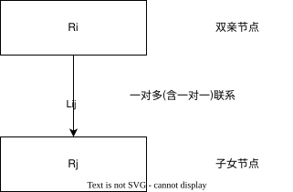  

    + 图示 普通层次  
      + [diagram]  
        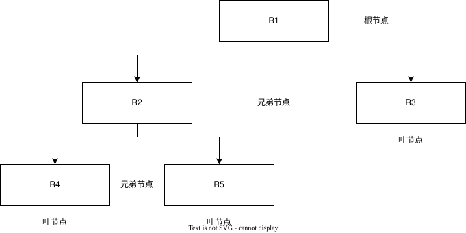

    + 层次模型的优点  
      + 数据结构比较简单清晰
      + 查询效率高
      + 良好的完整性约束支持

    + 层次模型的缺点
      + 现实世界的联系多为非层次的
      + 多个"双亲节点"，层次模型表示笨拙
        + 需引入冗余数据和虚拟节点
        + 插入和删除的限制多
      + "子女节点"查询须通过"双亲节点"
      + 结构严密，层次命令趋于程序化

  + 网状模型  
    + network model
    + 网状模型条件
      + 允许一个以上的节点无"双亲节点"
      + 一个节点可以有多个"双亲节点"
    + 网状模型的优点
      + 直接描述现实世界
      + 具有良好性能，存取效率较高
    + 网状模型的缺点
      + 结构复杂
      + "数据定义语言"和"数据操纵语言"复杂
      + 记录类型之间的联系是通过存取路径实现的，所以应用程序在访问数据时必须选择适当的存取路径，用户须了解系统结构的细节

  + 关系模型  
    + relational model
  + 实体-联系模型  
    + entity-relationship model
  + 半结构化XML数据模型 
    + semi-structured eXtensible Markup Language data model 
    + $\in$ 半结构化数据模型 semi-structured data model 
  + 半结构化JSON数据模型 
    + semi-structured JSON data model
    + $\in$ 半结构化数据模型 semi-structured data model
  + 面向对象数据模型
    + object-oriented data model
    + $\in$ 基于对象的数据模型 object-based data model  
  + 对象关系数据模型  
    + object-relational data model
    + $\in$ 基于对象的数据模型 object-based data model  
  + _键值对数据模型_
    + KV(key-value) data model
  + _文档数据模型_
  + _图数据模型_  
    + graph data model
  + _时序数据模型_
  + _时空数据模型_
  + _流数据模型_
  + _多媒体数据模型_

+ 数据模型三要素
  + 数据结构
  + 数据操纵
  + 完整性约束

### 数据建模

#### 数据设计概述

+ 图示

  + [diagram]
    

  + [diagram]
    

#### 范式 和 规范化理论

##### 说明

+ 示意图
  + [diagram]
    

+ 规范化过程
  + 确定一个给定的关系表(数据表)是否为**良构的**，即范式
  + 将一个非良构的关系表分解为多个良构的

+ 码 key, 以区分实体(记录)的属性或属性集/组。
  一个元组(行)的所有属性必须能唯一标识元组。即，不能出现两个元组的属性完全相同。

  + 超码 superkey
    + 一个或多个属性的集合，这些属性组合在一起可以在一个关系中唯一标识一个元组

  + 候选码 candidate key
    + 如果 K 是一个超码，那么 K 的任意超集也是超码
    + 一个超码的任意真子集都不是超码，则为**候选码**

  + 主码 primary key / 主码约束 primary key constraint
    + 被设计者挑选出的候选码
    + primary key <==> primary key constraint

  + 外码 foreign key/ 外码约束 foreign key constraint / 被引用关系 referenced relation
    + 引用完整性 referential integrity constraint

+ 符号惯例
  + $\alpha$, 属性集
  + $r(R)$, 模式$R$对于关系$r$而言
  + $K$, 属性集的一个超码, $K$是$R$的一个超码

+ 函数依赖
  + 给定一个$r(R)$的一个实例，如果对于该实例中的所有元组对$t_1$和$t_2$,  
    使得若$t_1[\alpha] = t_2[\alpha]$,  
    则$t_1[\beta] = t_2[\beta]$。  
    称该实例满足(satisfy)函数依赖(functional dependency), 即 $\alpha\longrightarrow\beta$  
  + 如果$r(R)$的每个合法实例都满足函数$\alpha\longrightarrow\beta$,  
    则我们称该函数依赖模式$r(R)$上成立(**hold**)
    + 成立条件
      + 测试关系的实例，看它们是否_满足_一个给定的函数依赖集$F$
      + 声明合法关系集上的约束。因此，我们将_只_关注满足给定函数依赖集的那些关系实例。  
        如果我们希望把注意力放到模式$r(R)$上满足函数依赖集$F$的关系，  
        称其为 $F$ 在 $r(R)$ 上成立
  
  + 平凡(trivial)的函数依赖
    + 被所有关系被满足的函数依赖
      + 示例  
        例如 $A \longrightarrow A$ 被包含属性 $A$ 的所有关系满足。  
        从字面上理解函数依赖的定义, 我们知道, 对于所有满足 $t_1[A] = t_2[A]$ 的元组 $t_1$ 和 $t_2$, $t_1[A] = t_2[A]$ 成立。  
        类似地, $AB \longrightarrow A$也被包含属性 $A$ 的所有关系满足。  
        一般的，如果 $\beta \subseteq \alpha$，则形如 $\alpha \longrightarrow \beta$ 的函数依赖是平凡的。  

    + 认知 1，一个关系的实例可能满足的某些函数依赖并不需要在该关系的模式上成立。  
      + 示例

        + table

          | building | room_number | capacity |
          | :------- | :---------: | -------: |
          | Packard  | 101         | 500      |
          | Painter  | 514         | 10       |
          | Taylor   | 3128        | 70       |
          | Watson   | 100         | 30       |
          | Watson   | 120         | 50       |

        + 上表中，$room\_number \longrightarrow capacity$ 满足函数依赖。  
          现实中， 不同教学楼的两个教室可以具有相同的房间号，但可以有不同的空间容量。  
          因此可能存在某个时刻存在classroom关系的一个实例，其中并不满足 $room\_number \longrightarrow capacity$  
          所以， 不应该将 $room\_number \longrightarrow capacity$ 包含在 classroom 关系模式上成立的 _函数依赖集_ 中

    + 认知 2，假设属性名在数据库模式中只有一种含义，  
      如果我们声明一个函数依赖$\alpha \longrightarrow \beta$作为数据库上的约束成立，  
      那么对于任何模式R，只要 $\alpha \subseteq R$ 且 $\beta \subseteq R$，  
      则 $\alpha \longrightarrow \beta$ 必然成立  

    + $F ^ +$表示集合F的闭包(closure)，即，能够从给定的集合$F$推导出的所有函数依赖的集合。  
      $F ^ +$包含$F$中所有的函数依赖。  

    + 函数依赖理论
      + 函数依赖集的闭包
        + 逻辑蕴涵 logically imply  
          给定一个关系模式 $r(R)$，如果关系 $r(R)$ 的每一个满足 $F$ 的实例也满足 $f$，  
          则 $R$ 上的函数依赖 $f$ 被 $R$ 上的函数集 $F$ 所 逻辑蕴涵  

        + 令 $F$ 为一个函数依赖集。 $F$ 的闭包是被 $F$ 所逻辑蕴涵的所有函数依赖的集合，记作 $F ^ +$。  
          给定 $F$，我们可以由函数依赖的形式化定义直接计算出 $F ^ +$ 。  

        + 公理(axiom)  
          + 阿姆斯特朗公理 (Armstrong's axiom)  
            + 自反律 reflexivity rule  
              若 $\alpha$ 为一个属性集，且 $\beta \subseteq \alpha$，  
              则 $\alpha \longrightarrow \beta$ 成立。  
            + 增补律 augmentation rule  
              若 $\alpha \longrightarrow \beta$，且 $\gamma$ 为一个属性集，   
              则 $\gamma\alpha \longrightarrow \gamma\beta$ 成立。  
            + 传递律 transitivity rule  
              若 $\alpha \longrightarrow \beta$，且 $\beta \longrightarrow \gamma$，  
              则 $\alpha \longrightarrow \gamma$ 成立。  
            + 合并律 union rule  
              若 $\alpha \longrightarrow \beta$ 且 $\alpha \longrightarrow \gamma$，  
              则 $\alpha \longrightarrow \beta\gamma$ 成立。  
            + 分解律 decomposition  
              若 $\alpha \longrightarrow \beta\gamma$，  
              则 $\alpha \longrightarrow \beta$ 且 $\alpha \longrightarrow \gamma$ 成立。  
            + 伪传递律 pseudo transitivity rule  
              若 $\alpha \longrightarrow \beta$ 成立，且 $\gamma\beta \longrightarrow \delta$，  
              则 $\alpha\gamma \longrightarrow \delta$ 成立。  

      + 属性集闭包  

        + 函数决定 functionally determine  
          如果 $\alpha \longrightarrow B$，则称 属性 $B$ 被 $\alpha$ 函数决定。  

        + 算法

          + 计算 $F ^ +$ 过程  

            $$
            \begin{equation}
            \begin{aligned}
            & F^+ = F \\
            & 应用自反律 /*生成所有的平凡依赖*/ \\
            & repeat \\
            & \:\:\:\: for\:each\: F^+中的函数依赖f \\
            & \:\:\:\:\:\:\:\: 在f上应用增补律 \\
            & \:\:\:\:\:\:\:\: 将函数依赖的结果加入到F^+中 \\
            & \:\:\:\: for\:each\: F^+中的一对函数依赖f_1和f_2 \\
            & \:\:\:\:\:\:\:\:if\: f_1和f_2可以使用传递律进行结合 \\
            & \:\:\:\:\:\:\:\:\:\:\:\: 将函数依赖的结构加入到F^+中 \\
            & until F^+不再发生改变
            \end{aligned}
            \end{equation}
            $$

          + 计算 $F$ 下 $\alpha$ 的闭包 $\alpha^+$ 的算法

            $$
            \begin{equation}
            \begin{aligned}
            & result := \alpha \\
            & repeat \\
            & \:\:\:\: for\:each\:函数依赖 \beta \longrightarrow \gamma\:in\:F\:do \\
            & \:\:\:\:\:\:\:\:begin \\
            & \:\:\:\:\:\:\:\:\:\:\:\:if \beta \subseteq result\:then\:result:=result \cup \gamma \\
            & \:\:\:\:\:\:\:\:end \\
            & until (result不发生改变)
            \end{aligned}
            \end{equation}
            $$

        + 属性闭包算法的用途  
          + 为了测试 $\alpha$ 是否为超码，我们计算 $\alpha ^ +$，并检查 $\alpha ^ +$ 是否包含 $R$ 中的所有属性。  
          + 通过检查是否 $\beta \subseteq \alpha ^ +$，可以检查一个函数依赖 $\alpha \longrightarrow \beta$ 是否成立，即是否属于 $F ^ +$  
            用属性闭包计算 $\alpha ^ +$，然后检查它是否包含 $\beta$。
          + 计算 $F ^ +$ 的替代方法：  
            对于任意的 $\gamma \subseteq R$，我们找出闭包 $\gamma ^ +$  
            对于任意 $S \subseteq \gamma ^ +$，我们输出一个函数依赖 $\gamma \longrightarrow S$

    + 正则覆盖

      + 无关属性(extraneous attribute)
        + 说明
          考虑一个函数依赖集$F$以及$F$中的函数依赖 $\alpha \longrightarrow \beta$
        + 从一个函数依赖的左侧删除一个属性可以使其成为更**强**的约束  
          如果 $A \in \alpha$ 并且 $F$ 逻辑蕴涵 $(F - \{\alpha \longrightarrow \beta\}) \: \cup \: \{(\alpha - A) \longrightarrow \beta\}$  
          则属性 $A$ 在 $\alpha$ 中是无关的。  
        + 从一个函数依赖的右侧删除一个属性可以使其成为更**弱**的约束  
          如果 $A \in \alpha$ 并且 函数依赖集 $(F - \{\alpha \longrightarrow \beta\}) \: \cup \: \{\alpha \longrightarrow （\beta - A)\}$ 逻辑蕴涵 $F$  
          则属性 $A$ 在 $\beta$ 中是无关的。  

      + 正则覆盖(canonical cover)  
        依赖集 $F_c$ , $F$ 逻辑蕴涵 $F_c$ 中的所有依赖，并且 $F_c$ 逻辑蕴涵 $F$ 中的所有依赖。  
        + $F_c$ 中任何函数依赖都不包含无关属性。  
        + $F_c$ 中每个函数依赖的左侧都是唯一的。
          即，$F_c$ 中不存在两个依赖 $\alpha_1 \longrightarrow \beta_1$ 和 $\alpha_2 \longrightarrow \beta_2$，满足 $\alpha_1 = \alpha_2$ 。  

      + 正则覆盖计算

        $$
        \begin{equation}
        \begin{aligned}
        & F_c\:=F \\
        & repeat \\
        & \:\:\:\: 使用合并律将F_c中任何形如 \alpha_1 \longrightarrow \beta_1 和 \alpha_1 \longrightarrow \beta_2 的依赖替换为 \alpha_1 \longrightarrow \beta_1\beta_2 \\
        & \:\:\:\: 在 F_c 中寻找一个函数依赖 \alpha \longrightarrow \beta，它要么在 \alpha 中要么在 \beta 中具有一个无关属性 \\
        & \:\:\:\: /*请注意，使用 F_c 而非 F 来检验无关属性*/ \\
        & \:\:\:\: 如果找到一个无关属性，则将它从 F_c 中的 \alpha \longrightarrow \beta$ 中删除 \\
        & until\:(F_c不再改变)
        \end{aligned}
        \end{equation}
        $$

    + 保持依赖

      + 说明

        限定 $F_1$, $F_2$, ..., $F_n$ 的集合是能被 _高效_ 检查的依赖集。  
        令 $F' = F_1\:\cup\:F_2 \:\cup\:...\:\cup\:F_n$  
        $F'$ 是模式 $R$ 上的的一个函数依赖集，通常 $F' \neq F$ 。  
        但是，即使 $F' \neq F$，也有可能 ${F'}^+ = F^+$ 。  
        如果 ${F'}^+ = F^+$，则 $F$ 中的每个依赖都被 $F'$ 逻辑蕴涵，并且，如果我们证明了 $F'$ 是被满足的，就证明了 $F$ 是被满足的。  
        称 具有性质 ${F'}^+ = F^+$ 的分解为 **保持依赖的分解** (dependency-preserving decomposition)。

      + 保持依赖测试

        + 常规测试

          $$
          \begin{equation}
          \begin{aligned}
          & 计算 F^+; \\
          & for\:each\:D中的模式 R_i \:do \\
          & \:\:\:\:begin \\
          & \:\:\:\:\:\:\:\:F_i := F^+对R_i的限定 \\
          & \:\:\:\:end \\
          & \:\: \\
          & F' = \emptyset \\
          & for\:each\:限定 F_i \:do \\
          & \:\:\:\:begin \\
          & \:\:\:\:\:\:\:\:F' = F'\:\cup\:F_i \\
          & \:\:\:\:end \\
          & \: \\
          & 计算 {F'}^+; \\
          & if ({F'}^+ = F^+) \\
          & then \\
          & \:\:\:\:return\:(true) \\
          & else \\
          & \:\:\:\:return\:(false); \\
          \end{aligned}
          \end{equation}
          $$

        + 替代方案 1

          + 如果 $F$ 中的每一个函数依赖都可以再分解后的一个关系上得到验证，那么这个分解就是保持以来的。是简单的验证保持依赖的方式。  
          + 并非总是有效，存在特例。 验证方式只能被用作易于检查的一个充分条件，即，验证失败也不能判断这个分解就不是保持依赖。  

        + 替代方案 2
          + 验证方式对$F$中的每个$\alpha \longrightarrow \beta$使用下述过程  
            $$
            \begin{equation}
            \begin{aligned}
            & result = \alpha \\
            & repeat \\
            & \:\:\:\: for \: each \: 分解后的 R_i \\
            & \:\:\:\:\:\:\:\: t = {(result\:\cap\:R_i)}^+ \: \cap \: R_i \\
            & \:\:\:\:\:\:\:\: result = result \: \cup \: t \\
            & until \: (result未发生变化)
            \end{aligned}
            \end{equation}
            $$

            + 属性闭包是在函数依赖集$F$下的  
              如果 result 包含了 $\beta$ 的所有属性，则函数依赖 $\alpha \longrightarrow \beta$ 被保持。  

          + 关键思想 1  
            验证 $F$ 中的每个函数依赖 $\alpha \longrightarrow \beta$，看是否在 $F'$ 中被保持。  
            计算 $F'$ 下 $\alpha$ 闭包；当该闭包包含 $\beta$ 时，该依赖一定得以保持。  
            当且仅当 $F$ 中的所有依赖都被证明时保持的，该分解时保持以来的。  
          + 关键思想 2  
            使用修改后的属性闭包算法计算 $F'$ 下的闭包，而不用先真正计算出 $F'$，避免 $F'$ 计算开销过大。  
            $F'$ 是所有 $F_i$ 的并集，其中 $F_i$ 是 $F$ 在 $R_i$ 上的限定。  
            算法 $(result \cap R_i)$ 关于 $F$ 的属性闭包，并将此闭包与 $R_i$ 求交集，然后将结果属性集加入 $result$。  
            上述一系列步骤等价于计算 $F_i$ 下的 $result$ 闭包。  
            在 `while` 循环中对每个 $i$ 重复步骤就得到 $F'$ 下的 $result$ 闭包。  

            对于任意$\gamma \subseteq R_i$, $\gamma \longrightarrow \gamma^+$ 是 $F^+$ 中的一个函数依赖，  
            且 $\gamma \longrightarrow \gamma^+ \: \cap \: R_i$ 是 $F^i$ 对于 $R_i$ 的限定 $F_i$ 中的一个函数依赖。  
            反之，如果 $\gamma \longrightarrow \delta$ 出现在 $F_i$ 中，则 $\delta$ 将是 $\delta^+ \: \cap \: R_i$ 的一个子集。  

            时间花费是多项式的花费，而非 $F^+$ 所需的指数时间的代价。  

+ 分解

  + 避免数据表信息重复问题的唯一方式是将其分解为多个数据表

  + 有损分解 lossy decomposition

  + 无损分解 lossless decomposition  
    + 令 $R$, $R_1$, $R_2$ 和 $F$ 如上所述。  
      $R_1$ 和 $R_2$ 构成 $R$ 的一个无损分解的条件是，以下函数依赖中至少有一个是在 $F ^ +$ 中：  
      $R_1 \cap R_2 \longrightarrow R_1$  
      $R_1 \cap R_2 \longrightarrow R_2$  
      i.e. $R_1 \cap R_2$ 要么构成 $R_1$ 的超码，要么构成 $R_2$ 的超码，则 $R$ 的分解就是一个无码分解。  

##### 1NF - 第一范式

+ 定义: 所有域都是原子性的，即数据库表的每一列都是不可分割的原子数据项
+ 示例
  + 错误
    + [Table]

      | reader_id | name  | Dept_id | Book  | Borrowing_Date | Return_date |
      | :-------- | :---- | :------ | :---- | :------------: | :---------: |
      | 001       | Bob   | 100     | 101 DB Conceptions  | 2021/08/20 |  |
      | 002       | Auth  | 200     | 102 C++ Programming | 2021/08/21 |  |

    + 说明
      Book字段可以拆分为 Book_ID 和 Book_Name
  + 纠正
    + [Table]

      | reader_id | name  | Dept_id | Book_ID | Book_Name | Borrowing_Date | Return_date |
      | :-------- | :---- | :------ | :------ | :-------- | :------------: | :---------: |
      | 001       | Bob   | 100     | 101     | DB Conceptions  | 2021/08/20 |  |
      | 002       | Auth  | 200     | 102     | C++ Programming | 2021/08/21 |  |

##### 2NF - 第二范式

+ 定义: 在1NF的基础上，非码属性必须完全依赖于候选码（在1NF基础上消除非主属性对主码的部分函依赖）
+ 要求: 数据库表中的每个实例或记录必须可以被唯一地区分。选取一个能区分每个实体的**属性**或*属性组**，作为实体的唯一标识
+ 示例
  + 错误
  + 纠正
+ Problems
  + 数据冗余
  + 操作(更新、插入、删除)异常

##### 3NF - 第三范式

+ 定义: 在2NF基础上，任何非主属性不依赖于其它非主属性（在2NF基础上消除传递依赖）
+ 要求:  
  + 一个关系中不包含已在其它关系已包含的非主关键字信息。  
  + 关系模式$R$是关于函数依赖集$F$的第三范式的条件是，  
    对于$F ^ +$中所有形如 $\alpha \longrightarrow \beta$ 的函数依赖  
    (其中 $\alpha \subseteq R$ 且 $\beta \subseteq R$)，以下至少有一项成立：
    + $\alpha \longrightarrow \beta$ 是一个平凡的函数依赖。  
    + $\alpha$ 是 $R$ 的一个超码。  
    + $\beta - \alpha$ 中的每个属性 $A$ 都被包含于 $R$ 的一个候选码中。  
      并 **非** 单个候选码必须包含 $\beta - \alpha$ 中的所有属性；$\beta - \alpha$ 中的每个属性 $A$ 可能被包含于 _不同_ 的候选码中。  
+ 示例
  + 错误
  + 纠正

##### BCNF

Boyce-Codd Normal Form -- 巴斯-科德范式 / 修正第三方式

+ 定义: 
  + 在3NF基础上，任何主属性不能对主键子集依赖（在3NF基础上消除主属性对主码子集的依赖）  
  + 关于函数依赖集$F$的关系模式$R$属于BCNF的条件  
    对于$F ^ +$中所有形如$\alpha \longrightarrow \beta$的函数依赖(其中 $\alpha \subseteq R$ 且 $\beta \subseteq R$)，下面至少有一项成立:  
    + $\alpha \longrightarrow \beta$是平凡的函数依赖(即$\beta \subseteq \alpha$) **同3NF条件**  
    + $\alpha$ 是模式 $R$ 的一个超码 **同3NF条件**  

+ 说明:  
  + 任何决定因素都是超键。  
  + 一个数据库设计属于BCNF的条件是，构成该设计的关系模式集中的每个模式都属于BCNF。  

+ 保持依赖

  + 主码约束
  + 函数依赖
  + check约束
  + 断言
  + 触发器

+ 示例
  + 错误
  + 纠正

##### 4NF - 第四范式

+ 定义
+ 示例
  + 错误
  + 纠正

##### 5NF - 第五范式

+ 定义
+ 示例
  + 错误
  + 纠正

#### 概念设计

#### 逻辑设计

#### 物理设计

## 关系数据库语言

### 关系数据库的说明

+ 表 / 关系(基本关系)
  + (data)table / relation

+ 行 / 元组
  + row / tuple

+ 关系实例
  + relation instance
  + 元组集合 set

+ 列 / 属性
  + col(column) / attribute

+ _表头_
  + _table header_

+ _域_
  + _domain_
  + 属性的取值范围/集合

+ **空值**
  + **null value**

### 关系完整性

#### 关系完整性约束

##### 实体完整性 

+ entity integrity (关系不变性，自动支持)
+ 每个元组应该是可区分的、唯一的
  + 实体完整性约束时针对基本关系。一个基本关系(数据表)是一个实体集合
  + 实体是可区分的
  + 关系模型以主码作为唯一性标识
  + 主码属性不能取空值

###### **规则**，实体完整性约束

+ 若属性(一个或一组)A是基本关系R的主属性，则A不能取空值(null value)

##### 参照完整性  

+ referential integrity (关系不变性，自动支持)

###### **定义**，外码、参照关系、等

+ 如果$F$是基本关系$R$的一个或一组属性，但**不**是关系R的码
+ $K_s$是基本关系S的主码
+ 如果$F$与$K_s$相对应，则$F$是$R$的**外码**(foreign key)
+ 基本关系$R$为**参照关系**(referenc**ing** relation)
+ 基本关系$S$为***被* 参照关系**(referenc**ed** relation)或**目标关系**(target relation)
+ $R$与$S$可以是同一关系，也可是不同关系

###### **规则**，参照完整性约束

+ 若属性/属性组$F$是基本关系$R$的外码，它与基本关系$S$的主码$K_s$相对应(基本关系$R$和$S$不一定是不同关系)，则对于$R$中每个元组在$F$上的值必须：
  + 或者取空值
  + 或者等于$S$中某个元组的主码值

##### 用户定义的完整性 user-defined integrity

### 数据库语言概述

+ 关系操作  
  + 查询
    + query
      + select
      + project
      + join
      + divide
      + union
      + difference

  + 更新
    + insert
    + delete
    + update

+ 关系操作 vs {层次 + 网状}
  + 关系操作
    + 集合操作 / 成组数据处理(set-at-a-time processing)
    + {层次 + 网状} / 单记录数据处理(record-at-a-time processing)

+ 关系数据语言
  + 关系数据语言概述

    ```mermaid
    graph LR
    A[关系数据语言] --> B[关系代数,如ISBL]
    A --> C[关系演算]
    A --> D[SQL]
    C --> E[元组关系演算语言，如ALPHA, QUEL]
    C --> F[域关系演算语言，如QBE]
    ```

  + 关系代数 relation algebra
    + 关系运算

      + 传统的集合运算

        + 并
          + $R \cup S = \{ t | t \in R \vee t \in S \}$
          + [code]

            ```sql
            (select course_id
               from section
              where semester = 'Fall' and year = 2017)
            union
            (select course_id
               from section
              where semester = 'Spring' and year = 2018)
            ```

        + 差
          + $R - S = \{ t | t \in R \wedge t \notin S \}$
          + [code]

            ```sql
            (select course_id
               from section
              where semester = 'Fall' and year = 2017)
            except
            (select course_id
               from section
              where semester = 'Spring' and year = 2018)
            ```

        + 交
          + $R \cap S = \{ t | t \in R \wedge t \in S \}$
          + [code]

            ```sql
            (select course_id
               from section
              where semester = 'Fall' and year = 2017)
            intersect [all]
            (select course_id
               from section
              where semester = 'Spring' and year = 2018)
            ```

        + 笛卡尔积 Cartesian-product
          + $ R \times S = \{ \stackrel\frown{t_r t_s} | t_r \in R \wedge t_s \in S \}$

      + 专门的关系运算

        + 选择 select / 限制 restriction
          + $\sigma_{F}{R} = \{ t | t \in R \wedge F(t) = 'True'\}$
          + $F$ 的基本形式 $X_i \theta Y_i$
            + $\theta$为运算符
              + 比较运算符
                + $>$, 大于
                + $\leq$, 大于等于
                + $<$, 小于
                + $\geq$, 小于等于
                + $=$, 等于
                + $<>$ 或 $\neq$, 不等于
              + 逻辑运算符
                + $\neg$, 非
                + $\wedge$, 与
                + $\vee$, 或
          + 示例
            + $\sigma_{Smajor = '信息安全'}{(Student)}$

        + 投影 project
          + $\prod_{A}{(R)} = \{ t[A] | t \in R \}$
            + $A$为$R$中的属性列
            + 投影操作是从列的角度进行的运算
          + 示例
            + $\prod_{Sno,Smajor}(Student)$
            + `select Sno, Smajor from Student;`

        + 连接 join / $\Join$
          + 从两个关系的笛卡尔积中选取其属性间满足一定条件的元组
          + $R \Join_{A \theta B} S = \{ \stackrel\frown{t_r t_s} | t_r \in R \wedge t_s \in S \wedge t_r[A] \theta t_s[B]\}$
            + $\theta$为运算符
          + 等值连接(equijoin) & 自然连接(natural join)
            + 等值连接
              + $R \Join_{A \theta B} S = \{ \stackrel\frown{t_r t_s} | t_r \in R \wedge t_s \in S \wedge t_r[A] = t_s[B]\}$
            + 自然连接
              + $R \Join S = \{ \stackrel\frown{t_r t_s}[U - B] | t_r \in R \wedge t_s \in S \wedge t_r[B] = t_s[B]\}$

        + 除 division
          + **象集**定义除法
            + 给定关系 $R(X,Y)$和$S(Y,Z)$
            + $X$,$Y$,$Z$为属性列
            + $R$中的$Y$和$S$中的$Y$可以有不同的属性名，但必须出自相同的域
            + $R$与$S$的除运算得到一个新的关系$P(X)$,$P$是$R$中满足下列条件的元组在$X$属性列上的投影  
              元组在$X$上分量值$x$的象集$Y_x$包含$S$在$Y$上投影的集合
            + $R \div S = \{ t_r[X] | t_r \in R \wedge \prod_{Y}{(S)} \subseteq Y_x\}$
            + $Y_x$为$x$在$R$中的象集, $x = t_r[X]$
            + 除操作是同时从行与列角度进行运算
          + 示例
            + 关系$R$
              + [table]

                | A      | B      | C      |
                | :----: | :----: | :----: |
                | $a_1$  | $b_1$  | $c_2$  |
                | $a_2$  | $b_3$  | $c_7$  |
                | $a_3$  | $b_4$  | $c_6$  |
                | $a_1$  | $b_2$  | $c_3$  |
                | $a_4$  | $b_6$  | $c_6$  |
                | $a_2$  | $b_2$  | $c_3$  |
                | $a_1$  | $b_2$  | $c_1$  |

            + 关系$R$中，$A$可以取4个值$\{ a_1, a_2, a_3, a_4 \}$。其中
              + $a_1$的象集为$\{(b_1,c_2),(b_2,c_3),(b_2,c_1)\}$
              + $a_2$的象集为$\{(b_3,c_7),(b_2,c_3)\}$
              + $a_3$的象集为$\{(b_4,c_6)\}$
              + $a_4$的象集为$\{(b_6,c_6)\}$

            + 关系$S$
              + [table]

                | B      | C      | D       |
                | :----: | :----: | :-----: |
                | $b_1$  | $c_2$  | $d_1$   |
                | $b_2$  | $c_1$  | $d_1$   |
                | $b_2$  | $c_3$  | $d_2$   |

            + $S$在$(B,C)$上的投影为$\{(b_1,c_2),(b_2,c_1),(b_2,c_3)\}$

            + 只有$a_1$的象集$(B,C)_{a_1}$包含了$S$在$(B,C)$属性列上的投影，所以  
              + $R \div S = \{ a_1 \}$

              + [table]

                | A      |
                | :----: |
                | $a_1$  |

            + 运算过程

              + [diagram]  
                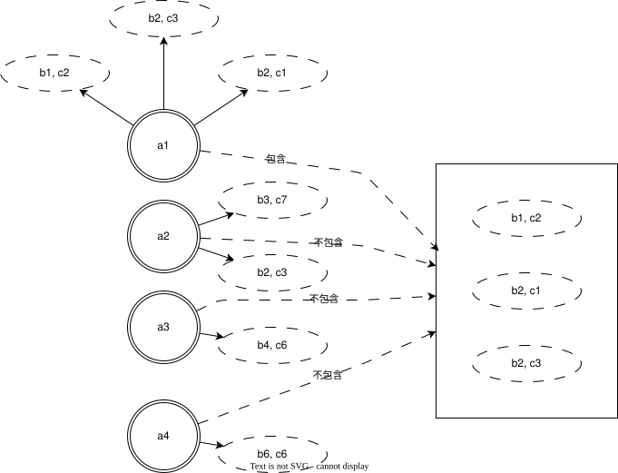

              + 不包含，是指不全部包含，  
                $a_2$的象集之一$(b_2,c_3)$在$a_1$象集中，但$(b_3,c_7)$不在，故不包含

        + 赋值

        + 更名 rename / $\rho$

  + 关系演算 relation calculus
    + 关系谓词
      + 元组关系演算
        + ALPHA
          + GET
          + PUT
          + HOLD
          + UPDATE
          + DELETE
          + DROP
      + 域关系演算
        + QBE
          + ...

  + 关系完备性
    + 关系代数 <==> 元组关系演算 <==> 域关系演算

+ SQL(structure query language)简述
  + 分类
    + DQL -- data query language
    + DML -- data manipulation language
    + DDL -- data definition language
    + DCL -- data control language
  + SQL特点
    + 功能综合且风格统一
      + 创建和删除数据库模式
      + 创建基本表、临时表、视图
      + 使用数据库，如增删改查、事务处理
      + 数据库控制, {安全、完整、并发}
      + 数据库维护、重建
    + 数据操纵高度非过程化
    + 面向集合的操作方式
    + 以统一的语法结构提供多种使用方式
    + 语法简洁且易于掌握
  + 基本概念
    + [diagram]  
      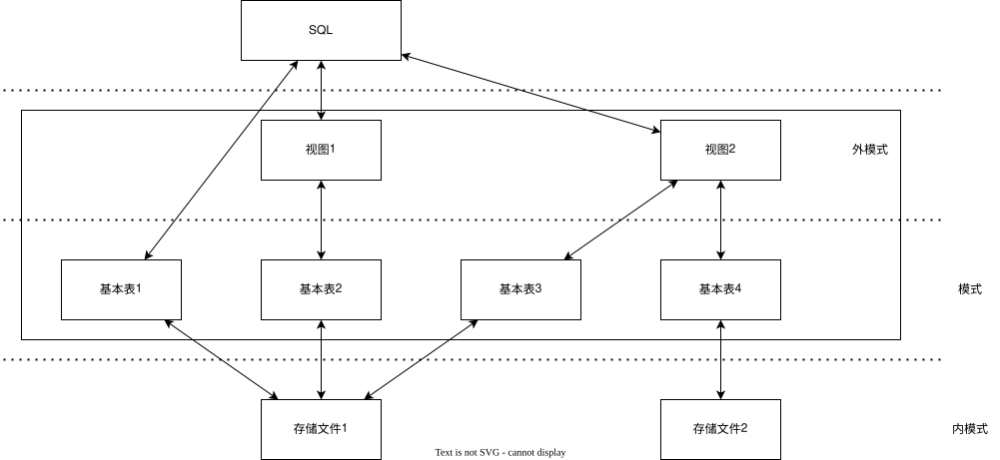

  + SQL组成
    + DDL -- Data-Definition Language
      + 定义数据库模式
      + 数据存储和定义 data storage and definition
        + SQL数据类型
          + 参考各数据库产品
      + 一致性约束 谓词
        + 域约束 domain constraint
        + 引用完整性 referential integrity
        + 授权 authorization
          + read authorization
          + insert authorization
            + **不**允许修改
          + update authorization
            + 允许修改
            + **不**允许删除
          + delete authorization
            + 允许删除
      + DDL输出
        + 数据字典 data dictionary
          + 元数据 metadata  
    + DML -- Data-Manipulation Language
      + 数据库的查询和更新
      + DML类型
        + 过程化DML, procedural DML  
          + 要求用户指定需要什么数据
          + 如何获取数据
        + 声明式DML, declarative DML
          + 只要求用户指定需要什么数据
    + 完整性 integrity
    + 视图定义 view definition
    + 事务控制 transaction control
    + 嵌入式SQL embedded SQL
    + 授权 authorization

#### 关系模式图示例 of DBSC7

+ 图示
  + [diagram]
    

## 数据库体系结构

### 集中式数据库

### 客户-服务器数据库系统

### 并行数据库系统

### 分布式数据库系统

### 云数据库系统

## 数据库物理系统

### 存储系统

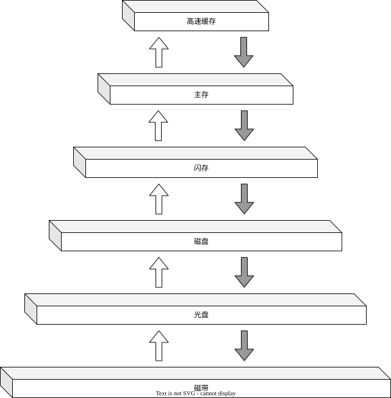

#### 物理体系

+ 主存储器 primary storage  

  + 高速缓存 cache  

  + 主存 main memory

+ 辅助存储器 secondary storage / 在线存储器 online storage  

  + 闪存 flash memory

    + NOR FLASH, Not OR Flash Memory, 或非逻辑门阵列结构闪存

    + NAND FLASH, Not AND Flash Memory, 与非逻辑门阵列结构闪存

    + [table]

      | features | NOR Flash | NAND Flash |
      | :------- | :-------- | :--------- |
      | 结构 | 并行连接，随机访问 | 串联连接，页/块访问 |
      | 读取速度 | 快(随机) | 较慢(连续读取快) |
      | 写/擦速度 | 慢(字节写入,块擦除) | 快(页写入,快擦除) |
      | 容量 | 小(Mb ~ Gb级) | 大(Gb ~ Tb级) |
      | 成本 | 高(每比特) | 低(每比特) |
      | 寿命 | 约10万次擦写 | SLC:约10万次；MLC/TLC:更低 |
      | 接口 | 独立地址/数据总线 | 复用I/O接口，需控制器 |
      | 典型应用 | 代码存储、XIP | 大容量数据存储(SSD、U盘) |

  + 磁盘存储器 magnetic-disk storage / 硬盘驱动器 Hard Disk Drive,HDD

+ 三级存储器 tertiary storage / 离线存储器 offline storage  

  + 光学存储器 optical storage  

  + 磁带存储器 tape storage

#### RAID

RAID, Redundant Array of Independent Disk

##### 特性

+ 冗余

+ 并行

  + 数据拆分

    + 比特级拆分

    + 块级拆分

##### 级别

+ RAID 0
  + 块级拆分
  + **无**冗余

+ RAID 1

+ RAID 5

+ RAID 6

+ RAID 10

### 数据库存储架构

#### 文件组织

+ 一个数据库被映射为多个不同的文件  
  这些文件由底层的操作系统来维护  
  文件永久驻留在磁盘上  

+ 一个文件在逻辑上被组织为记录的一个序列，一个文件相当于一个数据表？  
  块，每个文件从逻辑上被分成定长的存储单元  
  记录被映射到磁盘块上  
  块在逻辑上是定长的存储单元，是存储分配和数据传输的单位  
  块规模默认 4K 或 8K  

+ **每条记录被完全包含在单个块中**

+ 定长记录  

+ 变长记录  

+ 大对象存储  

  + blob

  + clob  

#### 记录组织

+ 堆文件组织, $heap \: file \: organization$  

+ 顺序文件组织, $sequential \: file \: organization$  

+ 多表聚簇文件组织, $multi-table \: clustering \: file \: organization$  

+ $B^+\:Tree$文件组织, $B^+-tree \: file \: organization$  

+ 散列文件组织, $hashing \: file \: organization$  

#### 数据表组织

#### 数据字典

+ 元数据，数据的数据

+ 关系模式和关于关系的其他元数据存储在数据字典(Data Dictionary)/系统文件(system catalog)的结构  
  + 必须存储的信息类型
    + 关系的名称
    + 每个关系中属性的名称
    + 属性的域和长度
    + 在数据库上定义的视图的名称，以及这些视图的定义
    + 完整性约束

  + 系统用户信息
    + 用户名称、用户缺省模式、用户密码(认证信息)、其他信息
    + 用户授权信息

  + 关系/数据表的存储组织
    + 如果关系被存储在操作系统中，数据字典将会记录包含每个关系的单个文件的名称  
    + 如果数据库把所有关系存储在单个文件中，数据字典可能将包含每个关系的记录的块'记在诸如链表那样的数据结构中  

  + 每个关系的每个索引信息
    + 索引的名称  
    + 被索引的关系的名称  
    + 在其上定义索引的属性  
    + 构造的索引的类型  

#### 数据库缓冲区

+ 缓冲区
  + 原因
    + 数据库的内存量小于数据的规模。  

+ 缓冲区管理器
  + 块移出, evicted  
  + 钉住, pin
  + 锁
  + 块写出 & 块强制写出
  + 缓冲区替换策略  
    + LRU, Least Recently Used, 最近最少使用
    + toss-immediate, 立即丢弃
    + MRU, Most Recently Used, 最近最常使用
  + 写操作的重排序与恢复

#### 面向列的存储

+ 面向列的存储 column-oriented storage / 柱状存储 columnar storage  
  + 关系/数据表的每个属性都被单独存储  
  + 来自相邻元组的属性值存储在文件中相邻的位置上  

+ 面向列的存储适合数据分析查询  
  + 减少I/O
  + 提高CPU缓存性能
  + 提高压缩效率
  + 向量处理

+ 面向列的存储的缺点，不适用于事务处理  
  + 元组重构的代价大
    获取单个元组的多个属性需要多次I/O操作
  + 元组删除和更新的代价大
  + 解压的代价大  

### 索引

#### 技术评价

+ 访问类型, access type
+ 访问时间, access time
+ 插入时间, insertion time
+ 删除时间, deletion time
+ 空间开销, space overhead

#### 顺序索引, ordered index

+ 搜索码
+ 非唯一性搜索码 non-unique search key  
  一种关系可以有不止一条包含相同搜索码值的记录(即，两条或多条记录对于索引属性可以具有相同的值)，则搜索码称为**非唯一性搜索码**

+ 每个索引结构与一个特定的搜索码相关联
+ 按照 排好的顺序 存储 搜索码 的值，并将每个 搜索码 与 包含该 搜索码 的记录 关联起来
+ 被索引的文件中的记录本身也可以按照某种排序顺序存储  
+ 一个文件可以有多个索引，分别基于不同的搜索码

+ 索引项 index entry / 索引记录 index record
  + 由 搜索码值 和 指针 构成  
  + 指针 指向具有该搜索码值的一条或多条记录  
    指向一条记录的 指针 由磁盘块的标识 和 标识出块内记录的磁盘块内偏移量 组成  

+ 稠密索引 dense index / 稀疏索引 sparse index  

  + 稠密索引 v.s. 稀疏索引  

    + 稠密索引更快  
    + 稀疏索引更省空间，插入、删除开销小  

  + 稠密索引

    + 稠密索引中，对于文件中的每个搜索码值都有有一个索引项  
      + 稠密**聚集**索引中，索引记录包括搜索码值以及指向具有该搜索码值得第一条数据记录的指针。  
        具有相同搜索码值的其余记录会顺序存储在第一条记录后，由于该索引是聚集索引，因此记录是根据相同的搜索码值排序的。  
      + 稠密**非聚集**索引中，索引必须存储指向具有相同搜索码值的索引记录的指针列表。  

    + [diagram]

      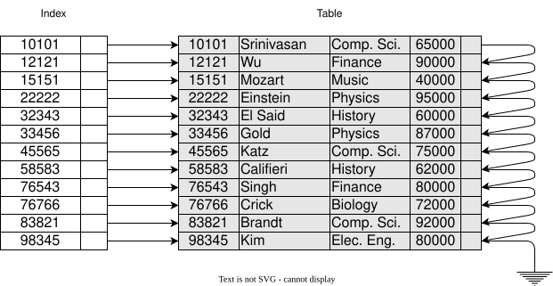  
      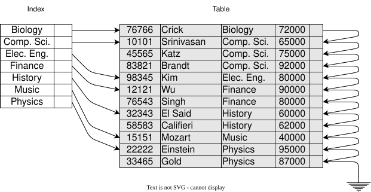  

    + 插入

      + 如果该搜素码值并未出现在索引中，系统就在索引中适当的位置插入带有该搜索码值的索引项。  
      + 否则，执行如下操作  
        + 如果索引项存储的是指向具有相同搜索码值的所有记录的指针，那么系统就在索引项中增加一个指向新记录的指针  
        + 否则，索引项存储一个仅指向具有相同搜索码值的第一条记录的指针，系统把待插入的记录放到具有相同搜索码值的其他记录之后。  

    + 删除

      + 如果待删除的记录是具有这个特定搜索码值的唯一一条记录，则系统就从索引中删除相应的索引项。  
      + 否则，执行如下操作  
        + 如果索引项存储的是指向具有相同搜索码值的所有记录的指针，那么系统就从索引项中删除指向待删除记录的指针。  
        + 否则，索引项存储一个仅指向具有该搜索码值的第一条记录的指针。  
          在这种情况下，如果待删除的记录是具有该搜索码值的第一条记录，系统就更新索引项，使其指向下一条记录。

  + 稀疏索引
    + 只有当关系按搜素吗排列次序存储时才能使用稀疏索引。(只有索引时聚集索引时才使用稀疏索引)  
      每个索引项包括 一个搜索码值 和 指向具有该搜索码值的第一条数据记录的指针  
      为了定位一条记录，找到所具有的最大搜索码值小于或等于我们所找记录的搜索码值的索引项。从该索引项指向的记录开始，沿着文件中的指针查找，直到找到所需记录为止。  

    + [diagram]

      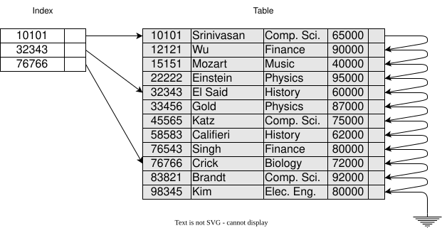  

    + 插入
      假设索引为每个块保存一个索引项。  
      如果系统创建了一个新的块，它会将出现在新块中的第一个搜索码值(按照搜索码的次序)插入索引中。  
      另一方面，如果这条新插的记录具有它在块中的最小搜索码值，那么系统就更新指向该块的索引项；否则，系统对索引不做任何改动。  

    + 删除

      + 如果索引中并不包含具有待删除记录搜索码值的索引项，则索引不必左任何改动
      + 否则，执行如下操作  
        + 如果待删除记录时具有该搜索码值的唯一记录，则系统用下一个搜索码值(按搜索码次序)的索引记录来替换相应的索引记录。  
          如果下一个搜索码值已经有了一个索引项，则删除而不是替换该索引项。  
        + 否则，如果该搜索码值的索引项指向待删除的记录，系统就更新索引项，使其指向具有相同搜索码值的下一条记录。  

  + 多级索引

+ 聚簇索引 / 主索引
  + clustering index, clustered index, primary index
  + 搜索码定理了文件的次序
  + 主索引，通常是建立在主码上的索引，但并非必须，可以建立在任何搜索码上
  + 聚集索引可以是稀疏的  

+ 非聚簇索引 / 辅助索引
  + non-clustering, non-clustered, secondary index
  + 辅助索引必须是稠密索引
  + 辅助索引必须包含指向所有记录的指针  
  + 在**非唯一性搜索码**上实现辅助索引的方式:  
    + 与主索引的情况不同，这种辅助索引中的指针并不直接指向记录。  
      相反，索引中的每个指针都指向一个桶(bucket)，该桶继而又包含指向文件的指针。  

      + [diagram]

        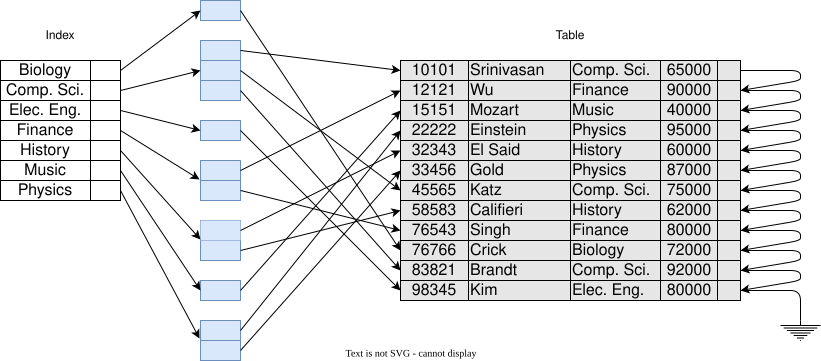

      + 缺点  
        + 由于附加的间接指针层可能需要随机I/O操作，索引访问需要花费更长的时间  
        + 如果一个码很少或没有重复，那么将整个块分配给其关联的桶会浪费大量的空间  

#### $B^+ Tree \: Index$

+ $B^+ Tree \: Index$ 采用 平衡树(balanced tree) 结构

  + 从 树根 到 树叶 的每条路径的长度都是相同的  

  + 树中每个非叶节点(除根节点外)有 $[n/2]$ 到 $n$ 个孩子，  
    其中 $n$ 对于特定的树是固定的；  
    根节点有 $2$ 到 $n$ 个孩子。  

  + 叶节点 leaf node

  + [diagram]

    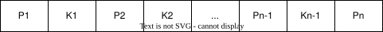  
    $B^+$树典型结构  

    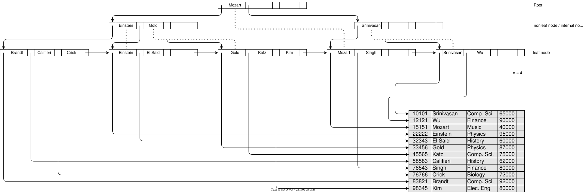  
    $B^+$树示例全图 (n=4)  

    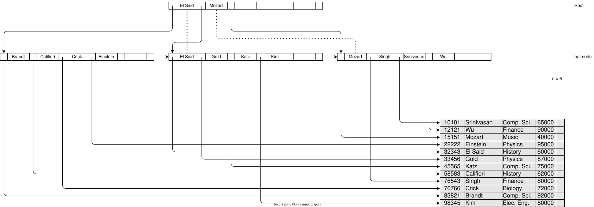
    $B^+$树示例全图 (n=6)

+ 查询

  + 搜索码查询

    $$
    \begin{equation}
    \begin{aligned}
    & \textbf{function} \: find(v) \\
    & /* 假设没有重复码，并且如果存在这样一条搜索码值为v的记录 */ \\
    & /* 则返回指向该记录的指针，否则返回空 */ \\
    & \:\:\:\: 置 C = 根节点 \\
    & \:\:\:\: \textbf{while} \: (C不是叶节点) \: \textbf{begin} \\
    & \:\:\:\:\:\:\:\: 令 i = (满足 v <= C.K) \\
    & \:\:\:\:\:\:\:\: \textbf{if} \: 无满足条件的i \: \textbf{then} \: \\
    & \:\:\:\:\:\:\:\:\:\:\:\: \textbf{begin} \\
    & \:\:\:\:\:\:\:\:\:\:\:\:\:\:\:\: 令P_m=该节点中最后一个非空指针 \\
    & \:\:\:\:\:\:\:\:\:\:\:\:\:\:\:\: 置C=C.P_m \\  
    & \:\:\:\:\:\:\:\:\:\:\:\: \textbf{end} \\
    & \:\:\:\:\:\:\:\: \textbf{else if} \: (v == C.P_{i+1}) \: \textbf{then} \\
    & \:\:\:\:\:\:\:\:\:\:\:\: 置C = C.P_{i+1} \\
    & \:\:\:\:\:\:\:\: \textbf{else} \: \\
    & \:\:\:\:\:\:\:\:\:\:\:\: 置C = C.P_i \:\:\:\: /* \: v < C.K_i \: */ \\  
    & \:\:\:\: \textbf{end} \\
    & \:\:\:\: \\
    & \:\:\:\: /* C是叶节点 */ \\
    & \:\:\:\: \textbf{if} \: 有某个i, 满足K_i = v \: \textbf{then} \\
    & \:\:\:\:\:\:\:\: 返回P_i \\
    & \:\:\:\: \textbf{else} \\
    & \:\:\:\:\:\:\:\: 返回空； /* 不存在码值等于v的记录 */ \\
    \end{aligned}
    \end{equation}
    $$

  + 范围查询

    $$
    \begin{equation}
    \begin{aligned}
    & \textbf{function} \: findRange(lb,ub) \\
    & /* 返回具有搜索码值V且满足 lb \leq V \leq ub 的所有记录 */ \\
    & \:\:\:\: 置resultSet=\{\}; \\
    & \:\:\:\: 置C=根节点 \\
    & \:\:\:\: \textbf{while} \: (C不是叶节点) \: \textbf{begin} \\
    & \:\:\:\:\:\:\:\: 令 \: i=满足lb \leq C.K_i的最小值 \\
    & \:\:\:\:\:\:\:\: \textbf{if} \: 无满足条件的i \: \textbf{then} \\
    & \:\:\:\:\:\:\:\:\:\:\:\: \textbf{begin} \\
    & \:\:\:\:\:\:\:\:\:\:\:\:\:\:\:\: 令 \: P_m = 节点中最后一个非空指针 \\
    & \:\:\:\:\:\:\:\:\:\:\:\:\:\:\:\: 置 \: C = C.P_m \\
    & \:\:\:\:\:\:\:\:\:\:\:\: \textbf{end} \\
    & \:\:\:\:\:\:\:\: \textbf{else if} \: (lb=C.K_i) \: \textbf{then} \\
    & \:\:\:\:\:\:\:\:\:\:\:\: 置 \: C=C.P_{i+1} \\
    & \:\:\:\:\:\:\:\: \textbf{else} \\
    & \:\:\:\:\:\:\:\:\:\:\:\: 置 \: C=C.P_i \:\:\:\: /* \: lb \leq C.K_i \: */ \\
    & \:\:\:\: \textbf{end} \\
    & \:\:\:\: \\
    & \:\:\:\: /* \: C是叶节点 \: */ \\
    & \:\:\:\: 令 \: i是满足K_i \geq lb的最小值 \\
    & \:\:\:\: \textbf{if} \: 无满足条件的i \: \textbf{then} \\
    & \:\:\:\:\:\:\:\: 置 \: i=1+C中码的数量 \:\:\:\: /* \: 强制移动至下一个叶节点 \: */ \\
    & \:\:\:\: \\
    & \:\:\:\: 置 done = \textbf{false} \\
    & \:\:\:\: \textbf{while} \: (\textbf{not} \: done) \: \textbf{begin} \\
    & \:\:\:\:\:\:\:\: 令 \: n=C中码的数量 \\
    & \:\:\:\:\:\:\:\: \textbf{if} \: (i \leq n) \: \textbf{and} \: (C.K_i \leq ub) \: \textbf{then} \\
    & \:\:\:\:\:\:\:\:\:\:\:\: \textbf{begin} \\
    & \:\:\:\:\:\:\:\:\:\:\:\:\:\:\:\: 把C.P_i加入resultSet \\
    & \:\:\:\:\:\:\:\:\:\:\:\:\:\:\:\: 置i = i + 1 \\
    & \:\:\:\:\:\:\:\:\:\:\:\: \textbf{end} \\
    & \:\:\:\:\:\:\:\: \textbf{else if} ( i \leq n) \: \textbf{and} \: (C.K_i) \geq ub ) \: \textbf{then}  \\
    & \:\:\:\:\:\:\:\:\:\:\:\: 置done=\textbf{true}; \\
    & \:\:\:\:\:\:\:\: \textbf{else if} ( i \geq n) \: \textbf{and} \: (C.K_i不为空) \: \textbf{then} \\
    & \:\:\:\:\:\:\:\:\:\:\:\: 置C=C.P_{n+1}; \\
    & \:\:\:\:\:\:\:\:\:\:\:\: 置i = 1; \:\:\:\: /* \: 移至下一个叶节点 \: /* \\
    & \:\:\:\:\:\:\:\: \textbf{else} \\
    & \:\:\:\:\:\:\:\:\:\:\:\: 置done=\textbf{true}; \:\:\:\: /* \: 右侧没有更多的叶节点 \: */\\
    & \:\:\:\: \textbf{end} \\
    & \:\:\:\: \textbf{return} \: resultSet; \\
    \end{aligned}
    \end{equation}
    $$

  + 说明  
    + 查询代价  
      + 在处理一个查询的过程中，需要遍历树中从跟到某个叶节点的一条路径。  
        如果文件中有$N$个搜索码值，则$B^+$树路径长度不超过 $[log_{[n/2]}{(N)}]$  
      + $B^+$树结构与内存中树结构(二叉树)之间的一个重要区别在于节点的规模及其导致的树的高度的不同  
        如果文件中有$N$个搜索码值，则二叉树的路径长度不超过 $[log_{2}{(N)}]$

+ 更新

  + 说明
    + 拆分 split
    + 合并 coalesce
    + 重新分配 redistribute  

  + 插入

    + 说明

      使用查找函数找到搜索码值将出现的叶节点，  
      在叶节点中插入一项，搜索码和指针对，  
      使得插入后搜索码仍然有序。  

    + 过程

      + [diagram]  
        + 原始$B^+$树  
          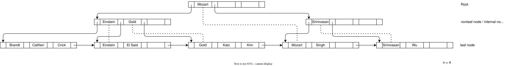  

        + 插入Adams及结果$B^+$树  

          + 按照查找算法，发现 $Adams$ 应出现在 $Brandt$, $Califieri$ 和 $Crick$ 的 **叶节点** 中
          + 该 **叶节点** 中已没有插入搜索码 $Adams$ 所需的空间  
          + 新节点 Admas 以 Califieri 作为 最小搜索码值  
            + Admas 小于 根节点 的 第一个$K_1$(=$| \: | Mozart | \: | \:\:\:\:\: | \: | \:\:\:\:\: | \: | \longrightarrow $) 第一元素  
            + 按 $P_1$ 查找至内部节点$K_{1.1}$(=$| \: | Einstein | \: | Gold | \: | \:\:\:\:\: | \: | \longrightarrow $)
            + Admas 小于 内部节点$K_{1.1}$(=$| \: | Einstein | \: | Gold | \: | \:\:\:\:\: | \: | \longrightarrow $) 第一元素
            + 按 $P_{1.1}$ 查找至 叶节点$K_{1.1.1}$(=$| \: | Brandt | \: | Califieri | \: | Crick | \: | \longrightarrow $)
          + 该 **叶节点** 被拆分为两个 **叶节点**  
            + $| \: | Brandt | \: | Califieri | \: | Crick | \: | \longrightarrow $ 拆分为
              $| \: | Adams  | \: | Brandt    | \: | \:\:\:\:\: | \: | \longrightarrow | \: | Califieri | \: | Crick | \: | \:\:\:\:\: | \: | \longrightarrow$  
            + 一般说，将这n个搜索码值(叶节点中原有的n-a个值再加上待插入的值)分为两组，  
              将前[n/2]个值放在原来的节点中，  
              并将剩下的值放在一个新创建的节点中  
          + 需要将具有此搜索码值以及指向新节点的指针的项插入被拆分的叶节点的父节(即，内部节点$| \: | Einstein | \: | Gold | \: | \:\:\:\:\: | \: | \longrightarrow $)点中
            无需拆分，因其有空间类容纳新项  

          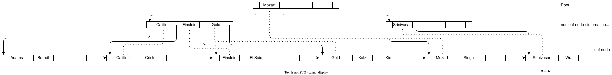  

        + 插入Lamport及结果$B^+$树  

          + Lamport 应插入 $| \: | Gold | \: | Katz | \: | Kim | \: | \longrightarrow $ 叶节点中  
            该叶节点已被充满空间，须拆分  
            原节点变形为$| \: | Gold | \: | Katz | \: | \:\:\:\:\: | \: | \longrightarrow $  
            产生新的叶节点为 $| \: | Kim | \: | Lamport | \: | \:\:\:\:\: | \: | \longrightarrow $  
          + 必须把一个$(Kim, n1)$ (即，$| \: | Kim | \: | \:\:\:\:\: | \: | \:\:\:\:\: | \: | $)项添加至中层节点中，
            并变形原节点($| \: | Califieri | \: | Einstein | \: | Gold | \: | $)为  
            $| \: | Califieri | \: | Einstein | \: | \:\:\:\:\: | \: | $, 即删除了 $Gold$  
            修改相关指针  
          + 修改根节点  

          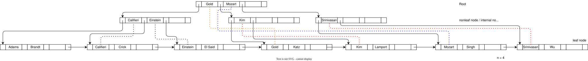  

    + 伪代码

      + 在$B^+$树中插入项  
        $$
        \begin{equation}
        \begin{aligned}
        & \textbf{procedure} \: insert( \textbf{value} \: K, \textbf{pointer} \: P ) \\
        & \:\:\:\: \textbf{if} \: (树为空) \: \textbf{then} \\
        & \:\:\:\:\:\:\:\: 创建一个空的叶节点L, 同时也是叶节点 \\
        & \:\:\:\: \textbf{else} \\
        & \:\:\:\:\:\:\:\: 找到应该包含码值K的叶节点L \\
        & \:\:\:\: \\
        & \:\:\:\: \textbf{if} \: (L具有不到n-1码值) \: \textbf{then} \\  
        & \:\:\:\:\:\:\:\: insert\_in\_leaf(L, K, P) \\
        & \:\:\:\: \textbf{else} \\
        & \:\:\:\:\:\:\:\: \textbf{begin} \:\:\:\: /* \: L已经具有n-1个码值了，需拆分L \: */\\
        & \:\:\:\:\:\:\:\:\:\:\:\: 创建节点L' \\
        & \:\:\:\:\:\:\:\:\:\:\:\: 把 \: L.P_1, ..., L.K_{n-1} \: 复制到可以容纳n个 \: (指针, 码值)对 \: 的 \: 内存块T \\
        & \:\:\:\:\:\:\:\:\:\:\:\: insert\_in\_leaf(T, K, P) \\
        & \:\:\:\:\:\:\:\:\:\:\:\: 令 L'.P_n=L.P_n \\
        & \:\:\:\:\:\:\:\:\:\:\:\: 令 L.P_n=L' \\
        & \:\:\:\:\:\:\:\:\:\:\:\: 从L中删除L.P_1到L.K_{n-1} \\
        & \:\:\:\:\:\:\:\:\:\:\:\: 把T.P_1到T.K_{[n/2]}从T复制到L中， L以L.P_1作为开始 \\
        & \:\:\:\:\:\:\:\:\:\:\:\: 把T.P_{[n/2]+1}到T.K_n从T复制到L'中， L'以L'.P_1作为开始 \\
        & \:\:\:\:\:\:\:\:\:\:\:\: 令K'为L'中的最小码值 \\
        & \:\:\:\:\:\:\:\:\:\:\:\: insert\_in\_parent(L,K',L') \\  
        & \:\:\:\:\:\:\:\: \textbf{end} \\
        \end{aligned}
        \end{equation}
        $$

      + 辅助过程

        $$
        \begin{equation}
        \begin{aligned}
        & \textbf{procedure} \: insert\_in\_leaf(node \: L, \textbf{value} \: K, \textbf{pointer} \: P) \\
        & \:\:\:\: \textbf{if} \: (K比L.K_1小) \: \textbf{then} \\
        & \:\:\:\:\:\:\:\: 把P、K插入L中，紧接在L.P_1前面 \\
        & \:\:\:\: \textbf{else} \\
        & \:\:\:\:\:\:\:\: \textbf{begin} \\
        & \:\:\:\:\:\:\:\:\:\:\:\: 创建K_i表示L中小于或等于K的最大值 \\
        & \:\:\:\:\:\:\:\:\:\:\:\: 把P、K插入L中，紧跟在L.K_i后面 \\
        & \:\:\:\:\:\:\:\: \textbf{end} \\
        & \:\:\:\: \\
        & \:\:\:\: \\
        & \textbf{procedure} \: insert\_in\_parent(node \: N, \textbf{value} \: K', node \: N') \\
        & \:\:\:\: \textbf{if} \: (N是树的根节点) \: \textbf{then} \\
        & \:\:\:\:\:\:\:\: \textbf{begin} \\
        & \:\:\:\:\:\:\:\:\:\:\:\: 创建一个新的节点R(包含N、K'、N') \:\:\:\: /* \: N 和 N' 都是指针 \: /* \\  
        & \:\:\:\:\:\:\:\:\:\:\:\: 令R为树的根节点 \\
        & \:\:\:\:\:\:\:\:\:\:\:\: \textbf{return} \\
        & \:\:\:\:\:\:\:\: \textbf{end} \\
        & \:\:\:\: \\
        & \:\:\:\: 令P=parent(N) \\
        & \:\:\:\: \textbf{if} \: (P有不到n个指针) \: \textbf{then} \\
        & \:\:\:\:\:\:\:\: 将(K', N')插入P中，紧跟在N后面 \\
        & \:\:\:\: \textbf{else} \\
        & \:\:\:\:\:\:\:\: /* \: 拆分 \: */ \\
        & \:\:\:\:\:\:\:\: \textbf{begin} \\
        & \:\:\:\:\:\:\:\:\:\:\:\: 将P复制到可以容纳P和(K',N')的内存块T中 \\
        & \:\:\:\:\:\:\:\:\:\:\:\: 将(K', N')插入T中，紧跟在N后面 \\
        & \:\:\:\:\:\:\:\:\:\:\:\: 删除P中所有项 \\
        & \:\:\:\:\:\:\:\:\:\:\:\: 创建节点P' \\
        & \:\:\:\:\:\:\:\:\:\:\:\: 把T.P_1, ..., T.P_{[(n+1)/2]}复制到P \\
        & \:\:\:\:\:\:\:\:\:\:\:\: 令K''=T.K_{[(n+1)/2]} \\
        & \:\:\:\:\:\:\:\:\:\:\:\: 把T.P_{[(n+1)/2]+1}, ..., T.P_{n+1}复制到P' \\
        & \:\:\:\:\:\:\:\:\:\:\:\: insert\_in\_parent(P, K'', P') \\
        & \:\:\:\:\:\:\:\: \textbf{end} \\
        & \:\:\:\: \\
        & \:\:\:\: \\
        & \textbf{procedure} \: insert\_into\_index(......) \\
        \end{aligned}
        \end{equation}
        $$

  + 删除

    + 说明

      通过待删除记录的搜索码使用查找函数找到包含待删除项的叶节点；  
      如果存在具有相同搜索码值的多个项，就遍历所有这些具有相同搜索码值的项，直到找到指向待删除记录的项。  
      从叶节点中移除该项。  
      将 该叶节点中位于 待删除项 右边 的所有项 都左移一个位置，以便在删除该项后不会留下空隙。  

    + 过程

      + [diagram]

        + 原始$B^+$树  
            

        + 删除Srinivasan及结果$B^+$树  

          + 查找并定位 Srinivasan 叶节点($ | \: | Srinivasan | \: | Wu\:\:\: | \: | \:\:\:\:\:\: | \: |$)  
          + 删除 Srinivasan 后，该叶节点只剩 Wu，此时 $ n =4, and \: 1 < [(n-1)/2] $  
            + 或将该节点和一个兄弟节点合并  
            + 或在节点间重新分配项  
          + 修改父节点中相关搜索值项  

            

        + 删除Singh和Wu及结果$B^+$树  

          + ...  

          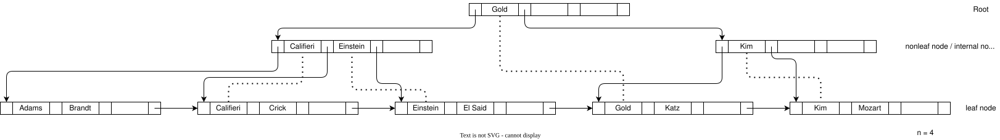  

    + 伪代码

      $$
      \begin{equation}
      \begin{aligned}
      & \textbf{procedure} \: delete(\textbf{value} \: K,\textbf{pointer} \: P) \\
      & \:\:\:\: 找到包含(K,P)的叶节点L \\
      & \:\:\:\: delete\_entry(L, K, P) \\
      & \\
      & \\
      & \textbf{procedure} \: delete_entry(node \: N, \textbf{value} \: K, \textbf{pointer} \: P) \\
      & \:\:\:\: 从N中删除(K,P) \\
      & \:\:\:\: \textbf{if} \: (N是根节点 \: \textbf{and} \: N只剩一个子节点) \: \textbf{then} \\
      & \:\:\:\:\:\:\:\: 使N的子结点称为该树的新节点并删除N \\
      & \:\:\:\: \textbf{else if} \: (N有太少的值或指针) \: \textbf{then} \\
      & \:\:\:\:\:\:\:\: \textbf{begin} \:\:\:\: /* \: block\_1 \: */ \\
      & \:\:\:\:\:\:\:\:\:\:\:\: 令N'为parent(N)的前一个或后一个孩子节点 \\
      & \:\:\:\:\:\:\:\:\:\:\:\: 令K'为parent(N)中指针N和N'之间的值 \\
      & \:\:\:\:\:\:\:\:\:\:\:\: \textbf{if} \: (N和N'中的项能放入单个节点中) \: \textbf{then} \\
      & \:\:\:\:\:\:\:\:\:\:\:\:\:\:\:\: \textbf{begin} \:\:\:\: /* \: block\_2 \: */ \\
      & \:\:\:\:\:\:\:\:\:\:\:\:\:\:\:\:\:\:\:\: /* \: 合并节点 \: */ \\
      & \:\:\:\:\:\:\:\:\:\:\:\:\:\:\:\:\:\:\:\: \textbf{if} \: (N是N'的前一个节点) \: \textbf{then} \\
      & \:\:\:\:\:\:\:\:\:\:\:\:\:\:\:\:\:\:\:\:\:\:\:\: swap\_variables(N, N') \\
      & \:\:\:\:\:\:\:\:\:\:\:\:\:\:\:\:\:\:\:\: \textbf{else} \\
      & \:\:\:\:\:\:\:\:\:\:\:\:\:\:\:\:\:\:\:\:\:\:\:\: \textbf{begin} \\
      & \:\:\:\:\:\:\:\:\:\:\:\:\:\:\:\:\:\:\:\:\:\:\:\:\:\:\:\: 将N中所有\:(K_i, P_i)对\:附加到N'中 \\
      & \:\:\:\:\:\:\:\:\:\:\:\:\:\:\:\:\:\:\:\:\:\:\:\:\:\:\:\: 令N'.P_n=N.P_n \\
      & \:\:\:\:\:\:\:\:\:\:\:\:\:\:\:\:\:\:\:\:\:\:\:\: \textbf{end} \\
      & \:\:\:\:\:\:\:\:\:\:\:\:\:\:\:\:\:\:\:\: delete\_entry(parent(N), K', N) \:\:\:\: /* \: 删除N的父节点 \: */ \\
      & \:\:\:\:\:\:\:\:\:\:\:\:\:\:\:\:\:\:\:\: 删除节点N \\
      & \:\:\:\:\:\:\:\:\:\:\:\:\:\:\:\: \textbf{end} \:\:\:\: /* \: block\_2 \: */ \\
      & \:\:\:\:\:\:\:\:\:\:\:\: \textbf{else} \\
      & \:\:\:\:\:\:\:\:\:\:\:\:\:\:\:\: /* \: 重新分配，从N'借来一个项 \: */ \\
      & \:\:\:\:\:\:\:\:\:\:\:\:\:\:\:\: \textbf{begin} \:\:\:\: /* \: block\_3 \: */ \\
      & \:\:\:\:\:\:\:\:\:\:\:\:\:\:\:\:\:\:\:\: \textbf{if} \: (N'是N的前一个节点) \: \textbf{then} \\
      & \:\:\:\:\:\:\:\:\:\:\:\:\:\:\:\:\:\:\:\:\:\:\:\: \textbf{begin} \:\:\:\: /* \: block\_4 \: */ \\
      & \:\:\:\:\:\:\:\:\:\:\:\:\:\:\:\:\:\:\:\:\:\:\:\:\:\:\:\: \textbf{if} \: (N是非叶节点) \: \textbf{then} \\
      & \:\:\:\:\:\:\:\:\:\:\:\:\:\:\:\:\:\:\:\:\:\:\:\:\:\:\:\:\:\:\:\: \textbf{begin} \:\:\:\: /* \: block\_5 \: */ \\
      & \:\:\:\:\:\:\:\:\:\:\:\:\:\:\:\:\:\:\:\:\:\:\:\:\:\:\:\:\:\:\:\:\:\:\:\: 令m满足:N'.P_m是N'中的最后一个指针 \\
      & \:\:\:\:\:\:\:\:\:\:\:\:\:\:\:\:\:\:\:\:\:\:\:\:\:\:\:\:\:\:\:\:\:\:\:\: 从N'中去除(N'.K_{m-1}, N'.K_{m}) \\
      & \:\:\:\:\:\:\:\:\:\:\:\:\:\:\:\:\:\:\:\:\:\:\:\:\:\:\:\:\:\:\:\:\:\:\:\: 插入(N'.P_m, K')，并通过将其他指针和值右移使之成为N中的第一个指针和值 \\
      & \:\:\:\:\:\:\:\:\:\:\:\:\:\:\:\:\:\:\:\:\:\:\:\:\:\:\:\:\:\:\:\:\:\:\:\: 用N'.K_{m-1}替换parent(N)中的K'  \\
      & \:\:\:\:\:\:\:\:\:\:\:\:\:\:\:\:\:\:\:\:\:\:\:\:\:\:\:\:\:\:\:\: \textbf{end} \:\:\:\: /* \: block\_5 \: */ \\
      & \:\:\:\:\:\:\:\:\:\:\:\:\:\:\:\:\:\:\:\:\:\:\:\:\:\:\:\: \textbf{else} \\
      & \:\:\:\:\:\:\:\:\:\:\:\:\:\:\:\:\:\:\:\:\:\:\:\:\:\:\:\:\:\:\:\: \textbf{begin} \:\:\:\: /* \: block\_6 \: */ \\
      & \:\:\:\:\:\:\:\:\:\:\:\:\:\:\:\:\:\:\:\:\:\:\:\:\:\:\:\:\:\:\:\:\:\:\:\: 令m满足:(N'.P_m, N'.K_m)是N'中的最后一个"指针,值"对  \\
      & \:\:\:\:\:\:\:\:\:\:\:\:\:\:\:\:\:\:\:\:\:\:\:\:\:\:\:\:\:\:\:\:\:\:\:\: 从N'中去除(N'.P_m, N'K_m)  \\
      & \:\:\:\:\:\:\:\:\:\:\:\:\:\:\:\:\:\:\:\:\:\:\:\:\:\:\:\:\:\:\:\:\:\:\:\: 插入(N'.P_m, N'.K_m)，并通过将其他指针和值右移使之成为N中的第一个指针和值 \\
      & \:\:\:\:\:\:\:\:\:\:\:\:\:\:\:\:\:\:\:\:\:\:\:\:\:\:\:\:\:\:\:\:\:\:\:\: 用N'.K_m替换parent(N)中的K' \\
      & \:\:\:\:\:\:\:\:\:\:\:\:\:\:\:\:\:\:\:\:\:\:\:\:\:\:\:\:\:\:\:\: \textbf{end} \:\:\:\: /* \: block\_6 \: */ \\
      & \:\:\:\:\:\:\:\:\:\:\:\:\:\:\:\:\:\:\:\:\:\:\:\: \textbf{end} \:\:\:\: /* \: block\_4 \: */ \\
      & \:\:\:\:\:\:\:\:\:\:\:\:\:\:\:\:\:\:\:\: \textbf{else} \\
      & \:\:\:\:\:\:\:\:\:\:\:\:\:\:\:\:\:\:\:\:\:\:\:\: ...与then情况对称... \\
      & \:\:\:\:\:\:\:\:\:\:\:\:\:\:\:\: \textbf{end} \:\:\:\: /* \: block\_3 \: */ \\
      & \:\:\:\:\:\:\:\: \textbf{end} \:\:\:\: /* \: block\_1 \: */ \\
      \end{aligned}
      \end{equation}
      $$

  + 更新复杂度

  + $B^+$扩展树

#### 散列索引, hash index

+ 说明

  + 桶 bucket
    + 桶溢出(bucket overflow) vs 溢出桶(overflow bucket)
  + 散列文件组织 hash file organization
  + 散列函数 hash function
  + 溢出链 overflow chaining
  + 闭寻址(closed addressing) _和_ 闭散列(closed hashing)
  + 偏斜(skew)
  + 静态散列(static hashing)  
  + 动态散列(dynamic hashing)  
    + 线性散列(linear hashing)  
    + 可扩展散列(extendable hashing)  

#### 多码访问

##### 多个单码访问

##### 多码索引

##### 覆盖索引 covering index

## 附录

### 参考书籍

#### 《数据库系统概念 第7版, ..., 机械工业出版社, 978-7-111-68181-6》

+ 目录
  + 译者序
  + 前言
  + 关于作者
  + 第1章 引言
    + 1.1, 数据库系统应用
    + 1.2, 数据库系统的目标
    + 1.3, 数据视图
      + 1.3.1, 数据模型
      + 1.3.2, 关系数据库模型
      + 1.3.3, 数据抽象
      + 1.3.4, 实例和模型
    + 1.4, 数据库语言
      + ...
        + _DDL_ -- _Data Definition Language_  
          + _domain constraint_  
          + _referential integrity_  
          + _authorization_  
            + _read_  
            + _insert_  
            + _update_  
            + _delete_  
          + _data dictionary_ & _metadata_
        + _DML_ -- _Data Manipulation Language_
      + 1.4.1, 数据定义语言
      + 1.4.2, SQL数据定义语言
      + 1.4.3, 数据操纵语言
      + 1.4.4, SQL数据操纵语言
      + 1.4.5, 从应用程序访问数据库
    + 1.5, 数据库设计
    + 1.6, 数据库引擎
      + 1.6.1, 存储管理器
      + 1.6.2, 查询处理器
      + 1.6.3, 事务管理
    + 1.7, 数据库和应用体系结构
    + 1.8, 数据库用户和管理员
      + 1.8.1, 数据库用户和用户界面
      + 1.8.2, 数据库管理员
    + 1.9, 数据系统的历史
    + 1.10, 总结
    + 术语回顾
    + 实践习题
    + 习题
    + 工具
    + 延申阅读
    + 参考文献

  + 第2章 关系模型介绍
    + 2.1, 关系数据库的结构
    + 2.2, 数据库模式
    + 2.3, 码
    + 2.4, 模式图
    + 2.5, 关系查询语言  
      _命令式查询语言_  
      _函数式查询语言_
    + 2.6, 关系代数
      + 2.6.1, 选择运算
      + 2.6.2, 投影运算
      + 2.6.3, 关系运算的复合
      + 2.6.4, 笛卡尔积运算
      + 2.6.5, 连接运算
      + 2.6.6, 集合运算
      + 2.6.7, 赋值运算
      + 2.6.8, 更名运算
      + 2.6.9, 等价查询
    + 2.7, 总结
    + 术语回顾
    + 实践习题
    + 习题
    + 延申阅读
    + 参考文献

  + 第3章 SQL介绍
    + 3.1, SQL查询语言概览
    + 3.2, SQL数据定义
      + 3.2.1, 基本类型
      + 3.2.2, 基本模式定义
    + 3.3, SQL查询的基本结构
      + 3.3.1, 单关系查询
      + 3.3.1, 多关系查询
    + 3.4, 附加的基本运算
      + 3.4.1, 更名运算
      + 3.4.2, 字符串运算
      + 3.4.3, select子句中的属性说明
      + 3.4.4, 排列元组的显示次序
      + 3.4.5, where子句谓词
    + 3.5, 集合运算
      + 3.5.1, 并运算
      + 3.5.2, 交运算
      + 3.5.3, 差运算
    + 3.6, 空值
    + 3.7, 聚集函数
      + 3.7.1, 基本聚集
      + 3.7.2, 分组聚集
      + 3.7.3, having子句
      + 3.7.4, 对空值和布尔值的聚集
    + 3.8, 嵌套子查询
      + 3.8.1, 集合成员资格
      + 3.8.2, 集合比较
      + 3.8.3, 空关系测试
      + 3.8.4, 重复元组存在性测试
      + 3.8.5, from子句里的子查询
      + 3.8.6, with子句
      + 3.8.7, 标量子查询
      + 3.8.8, 不带from子句的标量
    + 3.9, 数据库的修改
      + 3.9.1, 删除
      + 3.9.2, 插入
      + 3.9.3, 更新
    + 3.10, 总结
    + 术语回顾
    + 实践习题
    + 习题
    + 工具
    + 延申阅读
    + 参考文献

  + 第4章 中级SQL
    + 4.1, 连接表达式
      + 4.1.1, 自然连接
      + 4.1.2, 连接条件
      + 4.1.3, 外连接
      + 4.1.4, 连接类型和条件
    + 4.2, 视图
      + 4.2.1, 视图定义
      + 4.2.2, 在SQL查询中使用视图
      + 4.2.3, 物化视图
      + 4.2.4, 视图更新
    + 4.3, 事务
    + 4.4, 完整性约束
      + 4.4.1, 单个关系上的约束
      + 4.4.2, 非空约束
      + 4.4.3, 唯一性约束
      + 4.4.4, check子句
      + 4.4.5, 引用完整性
      + 4.4.6, 给约束赋名
      + 4.4.7, 事务中对完整性约束的违反
      + 4.4.8, 复杂check条件与断言
    + 4.5, SQL的数据类型与模式
      + 4.5.1, SQL中的日期和时间类型
      + 4.5.2, 类型转换和格式化函数
      + 4.5.3, 缺省值
      + 4.5.4, 大对象类型
      + 4.5.5, 用户自定义类型
      + 4.5.6, 生成唯一码值
      + 4.5.7, create table的扩展
      + 4.5.8, 模式、目录与环境
    + 4.6, SQL中的索引定义
    + 4.7, 授权
      + 4.7.1, 权限的授予与收回
      + 4.7.2, 角色
      + 4.7.3, 视图的授权
      + 4.7.4, 模式的授权
      + 4.7.5, 权限的转移
      + 4.7.6, 权限的收回
      + 4.7.7, 行级授权
    + 4.8, 总结
    + 术语回顾
    + 实践习题
    + 习题
    + 延申阅读
    + 参考文献

  + 第5章 高级SQL
    + 5.1, 使用程序设计语言访问SQL
      + 5.1.1, JDBC
      + 5.1.2, 从Python访问数据库
      + 5.1.3, ODBC
      + 5.1.4, 嵌入式SQL
    + 5.2, 函数和过程
      + 5.2.1, 声明及调用SQL函数和过程
      + 5.2.2, 用于过程和函数的语言结构
      + 5.2.3, 外部语言例程
    + 5.3, 触发器
      + 5.3.1, 对触发器的需求
      + 5.3.2, SQL中的触发器
      + 5.3.3, 何时不用触发器
    + 5.4, 递归查询
      + 5.4.1, 使用迭代的传递闭包
      + 5.4.2, SQL中的递归
    + 5.5, 高级聚集特性
      + 5.5.1, 排名
      + 5.5.2, 分窗
      + 5.5.3, 旋转
      + 5.5.4, 上卷和立方体
    + 5.6, 总结
    + 术语回顾
    + 实践习题
    + 习题
    + 工具
    + 延申阅读

  + 第6章 使用E-R模型的数据库设计
    + 6.1, 设计过程概览
      + 6.1.1, 设计阶段
      + 6.1.2, 设计选择
    + 6.2, 实体-联系模型
      + 6.2.1, 实体集
      + 6.2.2, 联系集
    + 6.3, 复杂属性
    + 6.4, 映射基数
    + 6.5, 主码
      + 6.5.1, 实体集
      + 6.5.2, 联系集
      + 6.5.3, 弱实体集
        + ...
          + 弱实体集(weak entity set)的存在依赖于另一实体集(标识性实体集, identifying entity set)
          + 弱实体集 依赖于 标识性实体集
          + 标识性实体集 拥有 弱实体集
    + 6.6, 从实体集中删除冗余属性
    + 6.7, 将E-R图转换为关系模型
      + 6.7.1, 强实体集的表示
      + 6.7.2, 具有复杂属性的强实体集的表示
      + 6.7.3, 弱实体集的表示
      + 6.7.4, 联系集的表示
      + 6.7.5, 模式的冗余
      + 6.7.6, 模式的合并
    + 6.8, 扩展的E-R特性
      + 6.8.1, 特化
      + 6.8.2, 概化
      + 6.8.3, 属性继承
      + 6.8.4, 特化上的约束
      + 6.8.5, 聚集
      + 6.8.6, 转换为关系模式
    + 6.9, 实体-联系设计问题
      + 6.9.1, E-R图中的常见错误
      + 6.9.2, 使用实体集还是属性
      + 6.9.3, 使用实体集还是联系集
      + 6.9.4, 二元还是n元联系集
    + 6.10, 数据建模的可选表示法
      + 6.10.1, 可选的E-R表示法
      + 6.10.2, 统一建模语言
    + 6.11, 数据库设计的其他方面
      + 6.11.1, 功能要求
      + 6.11.2, 数据流、工作流
      + 6.11.3, 模式演化
    + 6.12, 总结
    + 术语回顾
    + 实践习题
    + 习题
    + 工具
    + 延申阅读
    + 参考文献

  + 第7章 关系数据库设计
    + 7.1, 好的关系设计的特定
      + 7,1,1, 分解
      + 7.1.2, 无损分解
      + 7,1.3, 规范化理论
    + 7.2, 使用函数依赖进行分解
      + 7.2.1, 符号惯例
      + 7.2.2, 码和函数依赖
      + 7.2.3, 无损分解和函数依赖
    + 7.3, 范式
      + 7.3.1, Boyce-Coddd范式
      + 7.3.2, 第三范式
      + 7.3.3, BCNF和3NF的比较
      + 7.3.4, 更高级的范式
    + 7.4, 函数依赖理论
      + 7.4.1, 函数依赖集的闭包
      + 7.4.2, 属性集的闭包
      + 7.4.3, 正则覆盖
      + 7.4.4, 保持依赖
    + 7.5, 使用函数依赖的分解算法
      + 7.5.1, BCNF分解
      + 7.5.2, 3NF分解
      + 7.5.3, 3NF算法的正确性
    + 7.6, 使用多值依赖的分解
      + 7.6.1, 多值依赖
      + 7.6.2, 第四范式
      + 7.6.3, 4NF分解
    + 7.7, 更多的范式
    + 7.8, 原子和第一范式
    + 7.9, 数据库设计过程
      + 7.9.1, E-R模型和规范化
      + 7.9.2, 属性和联系的命名
      + 7.9.3, 为了性能去规范化
      + 7.9.4, 其他设计问题
    + 7.10, 时态数据建模
    + 7.11, 总结
    + 术语回顾
    + 实践习题
    + 习题
    + 延申阅读
    + 参考文献

  + 第8章 复杂数据类型
    + 8.1, 半结构化数据模型概述
      + 8.1.1, 半结构化数据模型概述
      + 8.1.2, JSON
      + 8.1.3, XML
      + 8.1.4, RDF和知识图谱
    + 8.2, 面向对象
      + 8.2.1, 对象 - 关系数据库系统
      + 8.2.2, 对象 - 关系映射
    + 8.3， 文本数据
      + 8.3.1, 关键字查询
      + 8.3.2, 相关性排名
      + 8.3.3, 检索有效性的度量
      + 8.3.4, 结构化数据和知识图谱上关键字查询
    + 8.4, 空间数据
      + 8.4.1, 几何信息表示
      + 8.4.2, 设计数据库
      + 8.4.3, 地理数据
      + 8.4.4, 空间查询
    + 8.5, 总结
    + 术语回顾
    + 实践习题
    + 习题
    + 延申阅读
    + 参考文献

  + 第9章 应用程序开发
    + 9.1, 应用程序和用户界面
    + 9.2, Web基础
      + 9.2.1, 统一资源定位符
      + 9.2.2, 超文本标记语言
      + 9.2.3, Web服务器和会话
    + 9.3, servlet
      + 9.3.1, servlet示例
      + 9.3.2, servlet会话
      + 9.3.3, servlet的生命周期
      + 9.3.4, 应用服务器
    + 9.4, 可选择的服务器端框架
      + 9.4.1, 服务器端脚本
      + 9.4.2, Web应用框架
      + 9.4.3, Django框架
    + 9.5, 客户端代码和Web服务
      + 9.5.1, JavaScript
      + 9.5.2, Web服务
      + 9.5.3, 断连操作
      + 9.5.4, 移动应用平台
    + 9.6, 应用程序体系结构
      + 9.6.1, 业务逻辑层
      + 9.6.2, 数据访问层和对象-关系映射
    + 9.7, 应用程序性能
      + 9.7.1, 通过高速缓存减少开销
      + 9.7.2, 并行处理
    + 9.8, 应用程序安全性
      + 9.8.1, SQL注入
      + 9.8.2, 跨站点脚本和请求伪造
      + 9.8.3, 密码泄露
      + 9.8.4, 应用级认证
      + 9.8.5, 应用级授权
      + 9.8.6, 审计追踪
      + 9.8.7, 隐私
    + 9.9, 加密及其应用
      + 9.9.1, 加密技术
      + 9.9.2, 数据库中的加密支持
      + 9.9.3, 加密和认证
    + 术语回顾
    + 实践习题
    + 习题
    + 项目建议
    + 工具
    + 延申阅读
    + 参考文献

  + 第10章 大数据
    + 10.1, 动机
      + 10.1.1, 大数据的来源和使用
      + 10.1.2, 大数据查询
    + 10.2, 大数据存储系统
      + 10.2.1, 分布式文件系统
      + 10.2.2, 分片
      + 10.2.3, 键值存储系统
      + 10.2.4, 并行和分布式数据库
      + 10.2.5, 复制和一致性
    + 10.3, MapReduce范式
      + 10.3.1, 为什么要使用MapReduce
      + 10.3.2, MapReduce示例1：词汇统计
      + 10.3.3, MapReduce示例2：日志处理
      + 10.3.4, MapReduce任务的并行处理
      + 10.3.5, Hadoop中的MapReduce
      + 10.3.6, MapReduce上的SQL
    + 10.4, 超越MapReduce：代数运算
      + 10.4.1, 代数运算的动机
      + 10.4.2, Spark中代数运算
    + 10.5, 流数据
      + 10.5.1, 流数据的应用
      + 10.5.2, 流数据查询
      + 10.5.3, 流上的代数运算
    + 10.6, 图数据库
    + 10.7, 总结
    + 术语回顾
    + 实践习题
    + 习题
    + 工具
    + 延申阅读
    + 参考文献

  + 第11章 数据分析
    + 11.1, 分析概述
    + 11.2, 数据仓库
      + 11.2.1, 数据仓库成分
      + 11.2.2, 多维数据与数据仓库模式
      + 11.2.3, 数据仓库的数据库支持
      + 11.2.4, 数据湖
    + 11.3, 联机分析处理
      + 11.3.1, 多维数据上的聚集
      + 11.3.2, 交叉表的关系表示
      + 11.3.3, SQL中的OLAP
      + 11.3.4, 报表和可视化工具
    + 11.4, 数据挖掘
      + 11.4.1, 数据挖掘任务的类型
      + 11.4.2, 分类
      + 11.4.3, 回归
      + 11.4.4, 关联规则
      + 11.4.5, 聚类
      + 11.4.6, 文本挖掘
    + 11.5, 总结
    + 术语回顾
    + 实践习题
    + 习题
    + 工具
    + 延申阅读
    + 参考文献

  + 第12章 物理存储系统
    + 12.1, 物理存储介质概述
    + 12.2, 存储器接口
    + 12.3, 磁盘
      + 12.3.1, 磁盘的物理特性
      + 12.3.2, 磁盘的性能度量
    + 12.4, 闪存
    + 12.5, RAID
      + 12.5.1, 通过冗余提高可靠性
      + 12.5.2, 通过并行提高性能
      + 12.5.3, RAID级别
      + 12.5.4, 硬件问题
      + 12.5.5, RAID级别的选择
      + 12.5.6, 其他的RAID应用
    + 12.6, 磁盘块访问
    + 12.7, 总结
    + 术语回顾
    + 实践习题
    + 习题
    + 延申阅读
    + 参考文献

  + 第13章 数据存储结构
    + 13.1, 数据库存储架构
    + 13.2, 文件组织
      + 13.2.1, 定长记录
      + 13.2.2, 变长记录
      + 13.2.3, 大对象存储
    + 13.3, 文件中记录的组织
      + 13.3.1, 堆文件组织
      + 13.3.2, 顺序文件组织
      + 13.3.3, 多表聚簇文件组织
      + 13.3.4, 划分
    + 13.4, 数据字典存储
    + 13.5, 数据库缓冲区
      + 13.5.1, 缓冲区管理器
      + 13.5.2, 缓冲区替换策略
      + 13.5.3, 写操作的重排序与恢复
    + 13.6, 面向列的存储
    + 13.7, 主存数据库的存储组织
    + 13.8, 总结
    + 术语回顾
    + 实践习题
    + 习题
    + 延申阅读
    + 参考文献

  + 第14章 索引
    + 14.1, 基本概念
    + 14.2, 顺序索引
      + 14.2.1, 稠密索引和系数索引
      + 14.2.2, 多级索引
      + 14.2.3, 索引更新
      + 14.2.4, 辅助索引
      + 14.2.5, 多码索引
    + 14.3, B+树索引
      + 14.3.1, B+树结构
      + 14.3.2, B+树查询
      + 14.3.3, B+树更新
      + 14.3.4, B+树更新的复杂度
      + 14.3.5, 非唯一性搜索码
    + 14.4, B+树扩展
      + 14.4.1, B+树文件组织
      + 14.4.2, 辅助索引和记录重分配
      + 14.4.3, 对字符串的索引
      + 14.4.4, B+树索引的批量加载
      + 14.4.5, B树索引文件
      + 14.4.6, 闪存上的索引
      + 14.4.7, 主存上的索引
    + 14.5, 散列索引
    + 14.6, 多码访问
      + 14.6.1, 使用多个单码索引
      + 14.6.2, 多码索引
      + 14.6.3, 覆盖索引
    + 14.7, 索引的创建
    + 14.8, 写优化索引结构
      + 14.8.1, LSM树
      + 14.8.2, 缓冲树
    + 14.9, 位图索引
    + 14.10, 时空数据索引
      + 14.10.1, 空间数据索引
      + 14.10.2, 时态数据索引
    + 14.11, 总结
    + 术语回顾
    + 实践习题
    + 习题
    + 延申阅读
    + 参考文献

  + 第15章 查询处理
    + 15.1, 概述
    + 15.2, 查询代价的度量
    + 15.3, 选择运算
      + 15.3.1, 文件扫描的使用和索引的选择
      + 15.3.2, 涉及比较的选择
      + 15.3.3, 复杂选择的实现
    + 15.4, 排序
      + 15.4.1, 外排序 - 归并算法
      + 15.4.2, 外排序 - 归并的代价分析
    + 15.5, 连接运算
      + 15.5.1, 嵌套 - 循环连接
      + 15.5.2, 块嵌套 - 循环连接
      + 15.5.3, 索引嵌套 - 循环连接
      + 15.5.4, 归并 - 连接
      + 15.5.5, 散列 - 连接
      + 15.5.6, 复杂连接
      + 15.5.7, 空间数据上的连接
    + 15.6, 其他运算
      + 15.6.1, 去重
      + 15.6.2, 投影
      + 15.6.3, 集合运算
      + 15.6.4, 外连接
      + 15.6.5, 聚集
    + 15.7, 表达式执行
      + 15.7.1, 物化
      + 15.7.2, 流水线
      + 15.7.3, 对于连续流数据的流数据
    + 15.8, 内存中的查询处理
      + 15.8.1, 高速缓存感知算法
      + 15.8.2, 查询编译
      + 15.8.3, 面向列的存储
    + 15.9, 总结 
    + 术语回顾
    + 实践习题
    + 习题
    + 延申阅读
    + 参考文献

  + 第16章 查询优化
    + 16.1, 概述
    + 16.2, 关系表达式的转换
      + 16.2.1, 等价规则
      + 16.2.2, 转换示例
      + 16.2.3, 连接次序
      + 16.2.4, 等价表达式的枚举
    + 16.3, 表达式结果的统计信息估计
      + 16.3.1, 目录信息
      + 16.3.2, 选择规模选择
      + 16.3.3, 连接规模选择
      + 16.3.4, 其他运算的规模估计
      + 16.3.5, 不同取值个数的估计
    + 16.4, 执行计划的选择
      + 16.4.1, 基于代价的连接次序选择
      + 16.4.2, 采用等价规则的基于代价的优化
      + 16.4.3, 优化中的启发式方法
      + 16.4.4, 嵌套子查询的优化
    + 16.5, 物化视图
      + 16.5.1, 视图维护
      + 16.5.2, 增量的视图维护
      + 16.5.3, 查询优化和物化视图
      + 16.5.4, 物化视图和索引选择
    + 16.6, 查询优化中的高级主题
      + 16.6.1, top-K优化
      + 16.6.2, 连接最小化
      + 16.6.3, 更新的优化
      + 16.6.4, 多查询优化和共享式扫描
      + 16.6.5, 参数化查询优化
      + 16.6.6, 自适应查询处理
    + 16.7, 总结
    + 术语回顾
    + 实践习题
    + 习题
    + 延申阅读
    + 参考文献

  + 第17章 事务
    + 17.1, 事务的概念
    + 17.2, 一个简单的事务模型
    + 17.3, 存储器结构
    + 17.4, 事务的原子性和持久性
    + 17.5, 事务的隔离性
    + 17.6, 可串行化
    + 17.7, 事务的隔离性和原子性
      + 17,7.1, 可恢复调度
      + 17.7.2, 无级联调度
    + 17.8, 事务的隔离性级别
    + 17.9, 隔离性级别的实现
      + 17.9.1, 锁
      + 17.9.2, 时间戳
      + 17.9.3, 多版本和快照隔离
    + 17.10, 事务的SQL语句表示
    + 17.11, 总结 
    + 术语回顾
    + 实践习题
    + 习题
    + 延申阅读
    + 参考文献

  + 第18章 并发控制
    + 18.1, 基于锁的协议
      + 18.1.1, 锁
      + 18.1.2, 锁的授予
      + 18.1.3, 两阶段封锁协议
      + 18.1.4, 封锁的实现
      + 18.1.5, 基于图的协议
    + 18.2, 死锁处理
      + 18.2.1, 死锁预防
      + 18.2.2, 死锁检测与恢复
    + 18.3, 多粒度
    + 18.4, 插入操作、删除操作与谓词读
      + 18.4.1, 删除
      + 18.4.2, 插入
      + 18.4.3, 谓词读和幻象现象
    + 18.5, 基于时间戳的协议
      + 18.5.1, 时间戳
      + 18.5.2, 时间戳排序协议
      + 18.5.3, Thomas写规则
    + 18.6, 基于有效性检查的协议
    + 18.7, 多版本机制
      + 18.7.1, 多版本时间戳排序
      + 18.7.2, 多版本两阶段封锁
    + 18.8, 快照隔离
      + 18.8.1, 快照隔离中的多版本
      + 18.8.2, 更新事务的有效性检查步骤
      + 18.8.3, 串行化问题和解决方案
    + 18.9, 实践中的弱一致性级别
      + 18.9.1, 二级一致性
      + 18.9.2, 游标稳定性
      + 18.9.3, 跨用户交互的并发控制
    + 18.10, 并发控制的高级主题
      + 18.10.1, 在线索引创建
      + 18.10.2, 索引结构中的并发
      + 18.10.3, 主存数据库中的并发控制
      + 18.10.4, 长事务
      + 18.10.5, 利用操作的并发控制
      + 18.10.6, 实时事务系统
    + 18.11, 总结
    + 术语回顾
    + 实践习题
    + 习题
    + 延申阅读
    + 参考文献

  + 第19章 恢复系统
    + 19.1, 故障分类
    + 19.2, 存储器
      + 19.2.1, 稳定存储器的实现
      + 19.2.2, 数据访问
    + 19.3, 恢复与原子性
      + 19.3.1, 日志记录
      + 19.3.2, 数据库修改
      + 19.3.3, 并发控制与恢复
      + 19.3.4, 事务提交
      + 19.3.5, 使用日志来重做和撤销事务
      + 19.3.6, 检查点
    + 19.4, 恢复算法
      + 19.4.1, 事务回滚
      + 19.4.2, 系统崩溃后的恢复
      + 19.4.3, 提交处理的优化
    + 19.5, 缓冲区管理
      + 19.5.1, 日志记录缓冲
      + 19.5.2, 数据库缓冲
      + 19.5.3, 操作系统在缓冲区管理中的作用
      + 19.5.4, 模糊检查点
    + 19.6, 非易失性存储器上数据丢失的故障
    + 19.7, 使用远程备份系统的高可用性
    + 19.8, 锁的提前释放与逻辑撤销操作
      + 19.8.1, 逻辑操作
      + 19.8.2, 逻辑撤销日志记录
      + 19.8.3, 有逻辑撤销的事务回滚
      + 19.8.4, 逻辑撤销中的并发问题
    + 19.9, ARIES
      + 19.9.1, 数据结构
      + 19.9.2, 恢复算法
      + 19.9.3, 其他特性
    + 19.10, 主存数据库的恢复
    + 19.11, 总结
    + 术语回顾
    + 实践习题
    + 习题
    + 延申阅读
    + 参考文献

  + 第20章 数据库系统体系结构
    + 20.1, 概述
    + 20.2, 集中式数据库系统
    + 20.3，服务器系统体系结构
      + 20.3.1, 事务服务器体系结构
      + 20.3.2, 数据服务器与数据存储系统
      + 20.3.3, 客户端高速系统
    + 20.4, 并行系统
      + 20.4.1, 并行数据库的动机
      + 20.4.2, 并行系统中性能度量
      + 20.4.3, 互连网络
      + 20.4.4, 并行数据库体系结构
      + 20.4.5, 共享内存
      + 20.4.6, 共享磁盘
      + 20.4.7, 无共享
      + 20.4.8, 层次
    + 20.5, 分布式系统
    + 20.6, 并行和分布式系统中的事务处理
    + 20.7, 基于云的服务
      + 20.7.1, 云服务模型
      + 20.7.2, 云服务的优缺点
    + 20.8, 总结
    + 术语回顾
    + 实践习题
    + 习题
    + 延申阅读
    + 参考文献

  + 第21章 并行和分布式存储
    + 21.1, 概述
    + 21.2, 数据分区
    + 21.3, 分区中的偏斜处理
    + 21.4, 复制
    + 21.5, 并行索引
    + 21.6, 分布式文件系统
    + 21.7, 并行的键值存储
    + 21.8, 总结
    + 术语回顾
    + 实践习题
    + 习题
    + 工具
    + 延申阅读
    + 参考文献

  + 第22章 并行和分布式查询处理
    + 22.1, 概述
    + 22.2, 并行排序
      + 22.2.1, 范围分区排序
      + 22.2.2, 并行的外排序 - 归并
    + 22.3, 并行连接
      + 22.3.1, 分区连接
      + 22.3.2, 分片 - 复制连接
      + 22.3.3, 处理并行连接中的偏斜
    + 22.4, 其他运算
      + 22.4.1, 其他关系运算
      + 22.4.2, map 和 reduce 操作
    + 22.5, 查询计划的平行执行
      + 22.5.1, 操作间并行
      + 22.5.2, 交换算子模型
      + 22.5.3, 情况汇总
      + 22.5.4, 查询计划中的容错
    + 22.6, 共享内存体系结构上查询处理
    + 22.7, 并行执行的查询优化
      + 22.7.1, 并行查询计划空间
      + 22.7.2, 并行查询计算的代价
      + 22.7.3, 选择并行查询计划
      + 22.7.4, 数据托管
      + 22.7.5, 物化视图的并行维护
    + 22.8, 流数据的并行处理
      + 22.8.1, 元组的路由
      + 22.8.2, 流运算的并行处理
      + 22.8.3, 流数据的容错
    + 22.9, 分布式查询处理
      + 22.9.1, 来自多个数据源的数据集成
      + 22.9.2, 模式和数据集成
      + 22.9.3, 跨多个数据源的查询处理
      + 22.9.4, 分布式目录系统
    + 22.10, 总结
    + 术语回顾
    + 实践习题
    + 习题
    + 工具
    + 延申阅读
    + 参考文献

  + 第23章 并行和分布式事务处理
    + 23.1, 分布式事务
      + 23.1.1, 系统结构
      + 23.1.2, 系统故障模式
    + 23.2, 提交协议
      + 23.2.1, 两阶段提交
      + 23.2.2, 提交期间的阻塞避免
      + 23.2.3, 事务处理的可选模型
    + 23.3, 分布式数据库中的并发控制
      + 23.3.1, 封锁协议
      + 23.3.2, 死锁处理
      + 23.3.3, 租赁
      + 23.3.4, 基于时间戳的分布式协议
      + 23.3.5, 时间戳的产生
      + 23.3.6, 分布式时间戳排序
      + 23.3.7, 分布式有效性检查
    + 23.4, 复制
      + 23.4.1, 副本一致性
      + 23.4.2, 使用副本的并发控制
      + 23.4.3, 故障处理
      + 23.4.4, 重构和重组
    + 23.5, 扩展的并发控制协议
      + 23.5.1, 多版本2PL和全局一致性时间戳
      + 23.5.2, 分布式快照隔离
      + 23.5.3, 联邦数据库中的并发控制
    + 23.6, 具有弱一致性级别的复制
      + 23.6.1, 用一致性换取可用性
      + 23.6.2, 异步复制
      + 23.6.3, 异步视图维护
      + 23.6.4, 检测不一致性更新
      + 23.6.5, 解决冲突的更新
      + 23.6.6, 使用默克尔树来检测集合之间的差异
    + 23.7, 协调器的选择
      + 23.7.1, 备份协调器
      + 23.7.2, 选举协调器
    + 23.8, 分布式系统中的共识
      + 23.8.1, 问题概述
      + 23.8.2, Paxos共识协议
      + 23.8.3, Raft共识协议
      + 23.8.4, 使用复制状态机的容错服务
      + 23.8.5, 使用共识的两阶段提交
    + 23.9, 总结
    + 术语回顾
    + 实践习题
    + 习题
    + 延申阅读
    + 参考文献
    + 附录

  + 第24章 高级索引技术

  + 第25章 高级应用开发

  + 第26章 区块链数据库

  + 第27章 形式关系查询语言

  + 第28章 高级关系数据库设计

  + 第29章 基于对象的数据库

  + 第30章 XML

  + 第31章 信息检索

  + 第32章 PostgreSQL

+ 学习库

  + dbsc7

    + info:
      + host: wsl / AlmaLinux8
      + database:dbsc7
      + users
        + user1: dbsc7admin / !QAZ2wsx

    + ER图例 1

      + [diagram]
        

    + 数据表

      + "advisor" 师生指导
        + **s_ID**
          + 学生ID
          + `--> student.ID`
        + i_ID 
          + 导师ID
          + `--> instructor.ID`

      + "classroom" 教室 (**实体集**/**Entity-Set**)
        + **building**
          + 建筑物名称
        + **room_number**
          + 房间编号
        + capacity
          + 教室容纳人数

      + "course" (**实体集**/**Entity-Set**)
        + **course_id** 课程
          + 课程编号
        + title
          + 课程名称
        + dept_name
          + 主讲院系名称
          + `--> department.dept_name`
        + credits

      + "department" 院系
        + **dept_name**
          + 院系名称
          + `<-- course.dept_name`
        + building
          + 院系主楼
        + budget
          + 预算

      + "instructor" 导师/教师 (**实体集**/**Entity-Set**)
        + **ID**
          + 导师ID
        + name
          + 导师姓名
        + dept_name
          + 所属院系
          + `--> department.dept_name`
        + salary
          + 薪水

      + "prereq" 前提/前置课程
        + **course_id**
          + 课程ID
          + `--> course.course_id`
        + **prereq_id**
          + 前直课程ID
          + `--> course.course_id`

      + "section" 课程安排 (**实体集**/**Entity-Set**)
        + **course_id**
          + 课程ID
          + `--> course.course_id`
        + **sec_id**
        + **semester**
        + **year**
        + building 
          + 授课主楼
          + `classroom.building`
        + room_number 
          + 授课教室
          + `classroom.room_number`
        + time_slot_id
          + 时间安排

      + "student" (**实体集**/**Entity-Set**)
        + **ID**
          + 学生ID
        + name
          + 学生姓名
        + dept_name
          + 所属院系
          + `--> department.dept_name`
        + tot_cred
          + 累计学分

      + "takes"
        + **ID**
        + **course_id**
        + **sec_id**
        + **semester**
        + **year**
        + grade

      + "teaches" 排课计划
        + **ID**  
          + 
          + `--> instructor.ID`
        + **course_id**
          + 课程ID
          + `--> section.course_id`
        + **sec_id**
          + 
          + `--> section.sec_id`
        + **semester**
          + 
          + `--> section.semester`
        + **year**
          + 
          + `--> section.year`

      + "time_slot" 课时安排
        + **time_slot_id**
        + **day**
        + **start_hr**
        + **start_min**
        + end_hr
        + end_min

#### 《数据库系统概论, 史嘉权, 清华大学出版社, 978-7-302-10267-0》

+ 目录

  + 第1章 数据库系统概述 .... 1 / 15
    + 1.1, 数据库管理技术的发展 .... 1
      + 1.1.1, 人工管理阶段 .... 1
      + 1.1.2, 文件系统阶段 (缺失) .... 2
      + 1.1.3, 数据库系统阶段 (缺失) .... 2
    + 1.2, 有关数据库的基本术语 .... 4 / 16
      + 1.2.1, 数据 .... 4
      + 1.2.2, 数据模型 .... 5 / 17
        + ...
          + 数据模型三要素
            + 数据结构
            + 数据操作
            + 完整性约束
      + 1.2.3, 数据库 .... 5
      + 1.2.4, 数据库管理系统 .... 5
      + 1.2.5, 数据库系统 .... 5
    + 1.3, 关系数据库系统 .... 6
      + 1.3.1, 什么是关系 .... 6
      + 1.3.2, 关系模型 .... 7
      + 1.3.3, 关系数据库系统 .... 7
    + 1.4, 数据库系统的体系结构 .... 7
      + 1.4.1, 三层模式结构 .... 7 / 19
        + 1, 外模式 .... _ / 19
          外模式(external schema) / 用户模式 / view layer
        + 2, 模式 .... 8 / 20
          模式(schema) / 概念模式(conceptual schema) + 逻辑模式(logical schema) 
        + 3, 内模式 .... 8 /20
          内模式(internal schema) / 存储模式(storage schema)
      + 1.4.2, 两层映像功能 .... 8 / 20
        + 1, 外模式/模式映像
        + 2，模式/内模式映像
    + 1.5, DBMS的体系结构 .... 9
      + 1.5.1, DBMS的组成概述 .... 9
      + 1.5.2, 查询处理程序 .... 10
      + 1.5.3, 存储管理程序 .... 10 / 22
        + ...
          + 文件管理程序
          + 缓冲区管理程序
      + 1.5.4, 事务管理程序 .... 11 / 23
      + 1.5.5, 客户程序/服务程序体系结构 .... 12
    + 1.6, 数据库系统运行过程 .... 12
    + 1.7, 本书导读 .... 13
      + 1.7.1, 设计 .... 14
      + 1.7.2, 编程 .... 14
      + 1.7.3, 实现 .... 15
    + 小节 .... 15
    + 习题 .... 16

  + 第2章 数据库建模 .... 17
    + 2.1, 对象定义语言 .... 18
      + 2.1.1, 面向对象的设计 .... 18
      + 2.1.2, 类的说明 .... 18
      + 2.1.3, ODL中的属性 .... 18
      + 2.1.4, ODL中的联系和反向联系 .... 20  
      + 2.1.5, 联系的三种类型 .... 22
    + 2.2, 实体-联系模型(E-R图) .... 23
      + 2.2.1, E-R图中联系的三种类型 .... 25
      + 2.2.2, 联系中的角色 .... 25
      + 2.2.3, 联系的多向性 .... 25
    + 2.3, 设计原则 .... 26
      + 2.3.1, 真实性 .... 26
      + 2.3.2, 避免冗余 .... 27
      + 2.3.3, 简单性 .... 27
      + 2.3.4, 合理选择元素类型 .... 27
    + 2.4, 子类 .... 28
      + 2.4.1, ODL中的子类 .... 28
      + 2.4.2, ODL中的多重继承 .... 29
      + 2.4.3, E-R图中的子类 .... 30
      + 2.4.4, E-R图中的继承 .... 31
    + 2.5, 对约束的建模 .... 32
      + 2.5.1, 键码 .... 33
      + 2.5.2, 单值约束 .... 34
      + 2.5.3, 应用完整性 .... 35
      + 2.5.4, 其他类型的约束 .... 36
    + 小结 .... 36 / 48
      + database modeling
      + object definition language, ODL
      + E-R Mode / E-R Diagram
      + 联系的类型
      + 设计原则
      + subclass
      + modeling of constraint
      + key
      + reference integrity
    + 习题 .... 37

  + 第3章 关系模型和关系运算 .... 39 / 51
    + 3.1, 关系模型的基本概念 .... 39
      + 3.1.1, 属性 .... 40
      + 3.1.2, 模式 .... 40
      + 3.1.3, 元组 .... 40 / 52
        + ...
          + 分量
          + 元组 vs 对象
      + 3.1.4, 域 .... 41
      + 3.1.5, 关系的等价表示法 .... 41
      + 3.1.6, 关系的实例 .... 41
    + 3.2, 从ODL设计到关系设计 .... 42
      + 3.2.1, 从ODL属性到关系属性 .... 42
      + 3.2.2, 非原子属性的表示 .... 42
      + 3.2.3，单值联系的表示 .... 44
      + 3.2.4, 多值联系的表示 .... 45
      + 3.2.5, 联系域反向联系的表示 .... 45
      + 3.2.6, ODL子类的表示 .... 46
    + 3.3, 从E—R图到关系设计 .... 46
      + 3.3.1, 实体集到关系的转换 .... 46
      + 3.3.2, E-R联系到关系的转换 .... 47
      + 3.3.3, "术语"联系到关系的转换 .... 48
    + 3.4, 关系代数 .... 48 / 60
      + 3.4.1, 关系的集合运算 .... 49
      + 3.4.2, 投影 .... 50
        + ...
          + 投影运行 pi -- 删除某些列
      + 3.4.3, 选择 .... 50
        + ...
          + 选择运算 sigma -- 删除某些行
      + 3.4.4, 笛卡尔积 .... 51
      + 3.4.5, 自然连接 .... 52
      + 3.4.6, theta连接 .... 53
      + 3.4.7, 改名 .... 53
      + 3.4.8, 复合运算 .... 54
      + 3.4.9, 基本运算和导出运算 .... 55
    + 3.5, 关系演算 .... 56
      + 3.5.1, 元组关系演算 .... 56
      + 3.5.2, 域关系演算 .... 59
    + 3.6, 关系逻辑 .... 61
      + 3.6.1, 谓词和原子 .... 61
      + 3.6.2, 规则和查询 .... 61
      + 3.6.3, 从关系代数到数据逻辑 .... 62
    + 小结 .... 66
    + 习题 .... 67
  
  + 第4章 数据库语言SQL .... 70 / 82
    + 4.1, SQL的特点 .... 70
      + ...
        + data query
        + data manipulation
        + data definition
        + data control
      + ...
        + 高度非过程化
        + 面向集合的操作方式
        + etc.

    + 4.2, 简单查询 .... 71
      + 4.2.1, 选择条件的构成 .... 73 / 85
        + ...
          + 空的处理，`is null` 或 `is not null`
      + 4.2.2, 字符串的比较 .... 74
      + 4.2.3, 日期和时间的比较 .... 75
      + 4.2.4, 输出的排序 .... 75
      + 4.2.5, 聚合运算符 .... 76 / 88
        + ...
          + SUM
          + AVG
          + MIN
          + MAX
          + COUNT
      + 4.2.6, 分组 .... 76 / 88
        + ...
          + GROUP BY
          + HAVING
    + 4.3, 连接查询 .... 77
      + 4.3.1, 查询的并、交、差 .... 77 / 89
        + ...
          + UNION
          + INTERSECT
          + EXCEPT
      + 4.3.2, 自然连接和笛卡尔积 .... 78
      + 4.3.3, 元组变量 .... 79
    + 4.4, SQL2中的连接查询 .... 79
      + 4.4.1, 笛卡尔积 .... 80
      + 4.4.2, 自然连接 .... 80
      + 4.4.3, 等值连接 .... 81
      + 4.4.4, 外部连接 .... 82
    + 4.5, 嵌套查询 .... 85
      + 4.5.1, 产生单值的子查询 .... 85
      + 4.5.2, 涉及到关系的选择条件 .... 86 / 98
        + ...
          + EXISTS
          + IN
          + ALL
          + ANY
          + SOME
      + 4.5.3, 涉及到元组的选择条件 .... 87
      + 4.5.4, 相关子查询 .... 88
      + 4.5.5, 例题详解 .... 91
      + 4.5.6, 查询语句格式小结 .... 94
    + 4.6, 数据库更新 .... 95
      + 4.6.1, 插入 .... 95
      + 4.6.2, 删除 .... 97
      + 4.6.3, 修改 .... 97
    + 4.7, 定义关系模式
      + 4.7.1, 属性的数据类型 .... 98
      + 4.7.2, 定义表 .... 99
      + 4.7.3, 撤销表 .... 100
      + 4.7.4, 更改关系模式 .... 100
      + 4.7.5, 建立和撤销索引 .... 102
    + 4.8, 视图的定义和查询 .... 103
      + 4.8.1, 定义视图 .... 103
      + 4.8.2, 查询视图 .... 105
      + 4.8.3, 更新视图 .... 106
      + 4.8.4, 撤销视图 .... 107
    + 小结 .... 107
    + 习题 .... 109

  + 第5章 查询优化和并发控制 .... 111
    + 5.1, 查询优化的一般策略 .... 111
    + 5.2, 关系代数的等价变化 .... 113
      + 5.2.1, 变化规则 .... 113 / 125
        + ...
          + 连接的交换律
          + 连接的结合律
          + 投影的串接律
          + 选择的 交换律/串接律
          + 选择和投影的交换/串接律
          + 选择对连接的分配律
          + 投影对连接的分配律
          + 选择对并的分配律
          + 投影对并的分配律
          + 选择对差的分配律
      + 5.2.2, 应用举例 .... 115
    + 5.3, 查询优化步骤 .... 117
    + 5.4, 并发调度 .... 118
      + 5.4.1, 事务 .... 119
      + 5.4.2, 数据不一致性 .... 119 / 131
        + ...
          + 丢失修改
          + 读'脏'数据
          + 不可重复读
      + 5.4.3, 可串行化调度 .... 120
    + 5.5, 封锁管理 .... 121
      + 5.5.1, 封锁机制中的主要概念 .... 121 / 133
        + ...
          + 排他锁 'exclusive lock' / 'X lock'
          + 共享锁 'share lock' / 'S lock'
        + ...
          + 封锁的颗粒度 granularity
      + 5.5.2, 封锁协议 .... 122 / 134
        + ...
          + 三级封锁协议
          + 两段封锁协议
    + 小结 .... 124
    + 习题 .... 125 / 137

  + 第6章 关系数据库设计理论 .... 127
    + 6.1, 函数依赖 .... 127
      + 6.1.1, 函数依赖的定义 .... 127
      + 6.1.2, 关系的键码 .... 129
      + 6.1.3, 超键码 .... 129
      + 6.1.4, 函数依赖规则 .... 129
        + ...
          + 分解/合并规则
          + 分享依赖规则
          + 传递规则
      + 6.1.5, 计算属性的封闭集 .... 131
    + 6.2, 模式设计 .... 132
      + 6.2.1, 问题的提出 .... 132
      + 6.2.2, 问题的根源 .... 133 / 145
        + ...
          + 完全依赖 和 部分依赖
          + 传递依赖
      + 6.2.3, 解决的途径 .... 135
        + ...
          + 规范化/范式
      + 6.2.4, 分解的原则 .... 139 / 151
        + ...
          + 无损连接
          + 保持依赖
      + 6.2.5, 分解的方法 .... 141 / 153
        + ...
          + 公共属性共享
          + 相关属性合一
        + ...
          + 部分依赖归子集；完全依赖随键码
          + 基本依赖为基础，中间属性作桥梁
          + 找违例自成一体，舍其右全集归一；再现违例，重新处理
      + 6.2.6, 关系模式规范化小结 .... 144
    + 6.3, 多值依赖 .... 145
      + 6.3.1, 属性独立性带来的冗余 .... 145
      + 6.3.2, 多值依赖的定义 .... 146
      + 6.3.3, 第4范式 .... 146
      + 6.3.4, 分解成第4范式 .... 147
    + 小结 .... 148
    + 习题 .... 149

  + 第7章 数据库设计 .... 151
    + 7.1, 概述 .... 151
      + 7.1.1, 数据库设计的任务 .... 151
        + ...
          + 方法 .... / 164
            + 面向数据的设计方式 data-oriented approach
            + 面向过程的设计方式 process-oriented approach
      + 7.1.2, 数据库设计的特点 .... 153 / 165
        + ...
          + 反复性 iterative
          + 试探性 tentative
          + 分步进行 multistage
      + 7.1.3, 数据库设计的步骤 .... 153
    + 7.2, 需求分析 .... 155
      + 7.2.1, 应用领域的调查 .... 156
      + 7.2.2, 定义信息与应用 .... 157
      + 7.2.3, 定义操作任务 .... 158
      + 7.2.4, 定义数据项 .... 158
      + 7.2.5, 预测未来的改变 .... 160
    + 7.3, 概念设计 .... 161
      + 7.3.1, 概念设计的基本方法 .... 161
      + 7.3.2, 视图设计的基本策略 .... 162
      + 7.3.3, 视图综合设计方法 .... 162
    + 7.4, 逻辑设计 .... 164
      + 7.4.1, E-R图到关系模式的转换 .... 164
      + 7.4.2, 逻辑模式的规范化页优化 .... 168
    + 7.5, 物理设计 .... 170
      + 7.5.1, 影响物理设计的因素 .... 170
      + 7.5.2, 选择存取方法 .... 171
      + 7.5.3, 设计存储结构 .... 172
    + 7.6, 数据库的实施、运行和维护 .... 173
      + 7.6.1, 数据库的实施 .... 173
      + 7.6.2, 数据库的运行和维护 .... 173
    + 小结 .... 174
    + 习题 .... 175

  + 第8章 SQL系统环境 .... 176
    + 8.1, 嵌入式SQL .... 176
      + 8.1.1, 什么是嵌入式SQL .... 176
      + 8.1.2, 如何实现嵌入式SQL .... 176
      + 8.1.3, 使用游标的SQL编程 .... 179
      + 8.1.4, 嵌入式SQL的处理过程 .... 180
    + 8.2, 有关事务的嵌入式SQL .... 181
    + 8.3, SQL环境 .... 184
      + 8.3.1, 数据库元素的层次结构 .... 184
      + 8.3.2, 客户程序和服务程序系统 .... 186
      + 8.3.3, Client/Server体系结构 .... 188
    + 8.4, 数据库的完整性 .... 189
      + 8.4.1, 说明键码约束 .... 189
      + 8.4.2, 说明外键码约束 .... 191
      + 8.4.3, 说明检验约束 .... 192
      + 8.4.4, 更改约束 .... 193
      + 8.4.5, 触发和触发程序 .... 194
    + 8.5, SQL中的安全和用户权限 .... 197
      + 8.5.1, 数据库的安全 .... 197
      + 8.5.2, 数据库的访问控制 .... 197
      + 8.5.3, 权限 .... 198 / 210
        + ...
          + SELECT
          + INSERT
          + DELETE
          + UPDATE
          + REFERENCES
          + USAGE
      + 8.5.4, 用户的标识与鉴别 .... 201
    + 小结 .... 202
    + 习题 .... 203

  + 第9章 面向对象查询语言 .... 205
    + 9.1, 对象查询语言OQL .... 205
      + 9.1.1, ODL的方法和范围 .... 205
      + 9.1.2, OQL中的类型 .... 208
      + 9.1.3, -个OQL的实例 .... 208
    + 9.2, OQL表达式 .... 209
      + 9.2.1, 路径表达式 .... 210
      + 9.2.2, 基本表达式 .... 210
      + 9.2.3, 表达式的附加格式 .... 212
    + 9.3, OQL及其宿主语言编程 .... 216
      + 9.3.1, 从宿主语言变量赋值 .... 216
      + 9.3.2, 从聚集中提取元素 .... 217
      + 9.3.3, 访问聚集中的每个元素 .... 217
    + 9.4, SQL3中的元组对象 .... 218
      + 9.4.1, 行类型及其说明 .... 219
      + 9.4.2, 引用及其适用 .... 220
      + 9.4.3, 作为值的对象标识 .... 222
    + 9.5, SQL3中的抽象数据类型 .... 223
      + 9.5.1, ADT的定义 .... 224
      + 9.5.2, ADT方法的定义 .... 225
    + 9.6, ODL/OQL 和 SQL3 的比较 .... 226
    + 小结 .... 227
    + 习题 .... 228

  + 第10章 数据库技术发展动态 .... 231
    + 10.1, 分布式数据库 .... 231
      + 10.1.1, 分布式数据库系统简介 .... 231 / 243
        + ...
          + 特性
            + 逻辑独立性
            + 物理独立性
            + 网络透明性
            + 数据冗余和冗余透明性
            + 数据片段透明性
            + 局部自治性
            + 数据库安全性和一致性
          + 优点
            + 分布控制
            + 增强数据共享
            + 系统可靠
            + 提高系统性能
            + 可扩充性好
          + 缺点
            + 系统实现复杂
            + 开销增大
      + 10.1.2, 分布式数据库系统举例 .... 232
    + 10.2, 并行数据库 .... 233
      + 10.2.1, 并行数据库简介 .... 233
        + ...
          + 特性
            + I/O瓶颈
            + 数据划分
      + 10.2.2, 并行数据库系统结构 .... 235
        + ...
          + 结构
            + 全共享并行结构
            + 共享磁盘并行结构、
            + 无共享并行结构
            + 分层并行结构
    + 10.3, 多媒体数据库 .... 235
      + 10.3.1, 多媒体数据及其特点 .... 236
      + 10.3.2, 多媒体数据库简介 .... 237
    + 10.4, 主动数据库 .... 238
    + 10.5, 数据仓库 .... 239
      + 10.5.1, 数据仓库简介 .... 239
      + 10.5.2, 数据仓库的结构 .... 240
    + 小结 .... 241
    + 习题 .... 241

  + 附录A MS SQL Server介绍 .... 242
    + A.1, SQL Server简介 .... 242
    + A.2, SQL Server管理工具和实用程序

  + 附录B MS SQL 2000 -- Transact-SQL .... 245
    + B.1, 简单说明 .... 245
      + B.1.1, 语法约定 .... 245
      + B.1.2, 表达式 .... 245
      + B.1.3, 搜索条件 .... 245
    + B.2, 建立、更改和撤销基本表 .... 246
      + B.2.1, 建表 .... 246
      + B.2.2, 更改表 .... 249
      + B.2.3, 撤销表 .... 249
    + B.3, 更新数据 .... 250
      + B.3.1, 插入数据 .... 250
      + B.3.2, 删除数据 .... 251
      + B.3.3, 修改数据 .... 251
    + B.4, 查询 .... 252

  + 参考文献 .... 254

#### 《数据库系统概论 第6版，王珊等，高等教育出版社，978-7-04-059125-5》

+ 目录

  + 第1章 绪论 .... 3 / 29
    + 1.1, 数据库系统概述 .... 4
      + 1.1.1, 数据库的4个基本概念 .... 4
      + 1.1.2, 数据管理技术的产生和发展 .... 6
    + 1.2, 数据模型 .... 12
      + 1.2.1, 数据建模 .... 12
      + 1.2.2, 概念模型 .... 12
      + 1.2.3, 数据模型三要素 .... 14
      + 1.2.4, 层次模型 .... 15
      + 1.2.5, 网状模型 .... 18
      + 1.2.6, 关系模型 .... 20
      + 1.2.7, 数据库领域中不断涌现的数据模型 .... 23
    + 1.3, 数据库系统的三级模式结构 .... 23
      + 1.3.1, 数据库系统中模式的概念 .... 24
      + 1.3.2, 数据库系统中的三级模式结构 .... 24
      + 1.3.3, 数据库的两级映像与数据独立性 .... 25
    + 1.4, 数据库系统的组成 .... 27
    + 1.5, 数据库系统的体系结构 .... 28
    + 本章小结 .... 30
    + 习题 1 .... 30
    + 第1章实验 实验准备 .... 31
    + 参考文献 1 .... 31

  + 第2章 关系模型 .... 33
    + 2.1, 关系模型的数据结构即形式化定义 .... 34
      + 2.1.1, 关系 .... 34
      + 2.1.2, 关系模式 .... 37
      + 2.1.3, 关系数据库 .... 39
      + 2.1.4, 关系模型的存储结构 .... 39
    + 2.2, 关系操作 .... 40
      + 2.2.1, 基本的关系操作 .... 41
      + 2.2.2, 关系数据语言的分类 .... 41
    + 2.3, 关系的完整性 .... 42
      + 2.3.1, 实体完整性 .... 42
      + 2.3.2, 参照完整性 .... 43
      + 2.3.3, 用户定义的完整性 .... 45
    + 2.4, 关系代数 .... 45
      + 2.4.1, 传统的集合运算 .... 46
      + 2.4.2, 专门的关系运算 .... 46
    + 2.5, 关系演算 .... 53
      + 2.5.1, 元组关系演算语言 ALPHA .... 53
      + 2.5.2, 域关系演算语言 QBE .... 58
    + 本章小结 .... 64
    + 习题 2 .... 64
    + 参考文献 2 .... 66

  + 第3章 关系数据库标准语言SQL .... 67
    + 3.1, SQL概述 .... 67
      + 3.1.1, SQL的产生与发展 .... 67
      + 3.1.2, SQL的特点 .... 68
      + 3.1.3, SQL的基本概念 .... 70
    + 3.2, 数据定义 .... 71
      + 3.2.1, 模式的定义和删除 .... 72
      + 3.2.2, 基本表的定义、删除与修改 .... 73
      + 3.2.3, 索引的建立与删除 .... 78
      + 3.2.4, 数据字典 .... 80
    + 3.3, 数据查询 .... 80
      + 3.3.1, 单表查询 .... 81
      + 3.3.2, 连接查询 .... 91
      + 3.3.3, 嵌套查询 .... 96
      + 3.3.4, 集合查询 .... 105
      + 3.3.5, 基于派生表的查询 .... 107
    + 3.4, 数据更新 .... 108
      + 3.4.1, 插入数据 .... 108
      + 3.4.2, 修改数据 .... 109
      + 3.4.3, 删除数据 .... 110
    + 3.5, 空值的处理 .... 111
    + 3.6, 视图 .... 114
      + 3.6.1, 定义视图 .... 114
      + 3.6.2, 查询视图 .... 117
      + 3.6.3, 更新视图 .... 119
      + 3.6.4, 视图的作用 .... 121
    + 本章小结 .... 122
    + 习题 3 .... 123
    + 第 3 章实验 SQL查询与操纵 .... 124
    + 参考文献 3 .... 124

  + 第4章 数据库安全性 .... 127
    + 4.1, 数据库安全性概述 .... 127
      + 4.1.1, 数据库的不安全因素 .... 127
      + 4.1.2, 安全标准简介 .... 128
    + 4.2, 数据库安全性控制 .... 131
      + 4.2.1, 用户身份鉴别 .... 132
      + 4.2.2, 存取控制 .... 133
      + 4.2.3, 自主存取控制方法 .... 134
      + 4.2.4, 授予与收回对数据的操纵权限 .... 135
      + 4.2.5, 数据库角色 .... 139
      + 4.2.6, 强制存取控制方法 .... 141
    + 4.3, 视图机制 .... 142
    + 4.4, 审计 .... 143
    + 4.5, 数据加密 .... 145
    + 4.6, 其他安全性包含 .... 147
    + 本章小结 .... 148
    + 习题 4 .... 148
    + 第 4 章实验 安全性控制 .... 149
    + 参考文献 4 .... 149

  + 第5章 数据库完整性 .... 151
    + 5.1, 数据库完整性概述 .... 151
    + 5.2, 实体完整性 .... 152
      + 5.2.1, 定义实体完整性 .... 152
      + 5.2.2, 实体完整性检查和违约处理 .... 153
    + 5.3, 参照完整性 .... 155
      + 5.3.1, 定义参照完整性 .... 155
      + 5.3.2, 参照完整性检查和违约处理 .... 155
    + 5.4, 用户定义的完整性 .... 157
      + 5.4.1, 属性上的约束 .... 158
      + 5.4.2, 元组上的约束 .... 159
    + 5.5, 完整性约束命名子句 .... 160
    + 5.6, 域的完整性限制 .... 161
    + 5.7, 触发器 .... 162
      + 5.7.1, 定义触发器 .... 162
      + 5.7.2, 执行触发器 .... 165
      + 5.7.3, 删除触发器 .... 165
    + 本章小结 .... 166
    + 习题 5 .... 166
    + 第 5 章实验 完整性控制 .... 166
    + 参考文献 5 .... 167

  + 第6章 关系数据理论 .... 171
    + 6.1, 问题的提出 .... 171
    + 6.2, 规范化 .... 174
      + 6.2.1, 函数依赖 .... 174
      + 6.2.2, 码 .... 176
      + 6.2.3, 范式 .... 176
      + 6.2.4, 2NF .... 177
      + 6.2.5, 3NF .... 178
      + 6.2.6, BCNF .... 179
      + 6.2.7, 多值依赖 .... 180
      + 6.2.8, 4NF .... 183
    + 6.3, 数据依赖的公理系统 .... 185
    + 6.4, 保持函数依赖的模式分解 .... 189
    + 6.5, 无损连接的模式分解 .... 191
      + 6.5.1, 无损连接的模式分解定义 .... 191
      + 6.5.2, 无损连接的模式分解 与 保持函数依赖的模式分解 之间的关系 .... 193
      + 6.5.3, 既无损连接又保持函数依赖的模式分解算法 .... 193
      + 6.5.4, 无损连接的模式分解算法 .... 194
    + 本章小结 .... 195/221
    + 习题 6 .... 196/222
    + 参考文献 6 .... 197/224

  + 第7章 数据库设计 .... 201/227
    + 7.1, 数据库设计概述 .... 201
      + 7.1.1, 数据库设计的特点 .... 202/228
      + 7.1.2, 数据库设计的方法 .... 203/229
      + 7.1.3, 数据库设计的基本步骤 .... 204
      + 7.1.4, 数据库设计过程中的各种模式 .... 207
    + 7.2, 需求分析 .... 207
      + 7.2.1, 需求分析的任务 .... 207/223
      + 7.2.2, 需求分析的方法 .... 208
      + 7.2.3, 数据字典 .... 209
    + 7.3, 概念结构设计 .... 211/237
      + 7.3.1, 概念模型 .... 211
      + 7.3.2, E-R模型 .... 211
      + 7.3.3, 扩展的E-R模型 .... 215/241
      + 7.3.4, 用UML中的类图表示E-R图 .... 218/244
      + 7.3.5, 用E-R图进行概念结构设计 .... 220/246
    + 7.4, 逻辑结构设计 .... 228
      + 7.4.1, E-R图向关系模型的转换 .... 229
      + 7.4.2, 数据模型的优化 .... 230
      + 7.4.3, 设计用户外模式 .... 231
    + 7.5, 物理结构设计 .... 232/258
      + 7.5.1, 数据库物理结构设计的内容和方法 .... 232
      + 7.5.2, 选择关系模式存取方法 .... 233
      + 7.5.3, 确定数据库的存储结构 .... 235
      + 7.5.4, 评价数据库的物理结构 .... 235
    + 7.6, 数据库的实施和维护 .... 236/262
      + 7.6.1, 数据的载入和应用程序的编码与调试 .... 236
      + 7.6.2, 数据库的试运行 .... 235
      + 7.6.3, 数据库的运行和维护 .... 237
    + 本章小结 .... 238/264
    + 习题 7 .... 238/264
    + 第 7 章实验 数据库设计 .... 239/265
    + 参考文献 7 .... 240/266

  + 第8章 数据库编程 .... 241/267
    + 8.1, 概述 .... 241
      + 8.1.1, SQL表达能力的限制 .... 241
      + 8.1.2, 扩展SQL的功能 .... 244
      + 8.1.3, 通过高级语言实现复杂应用 .... 248
    + 8.2, 过程化SQL .... 250/276
      + 8.2.1, 过程化SQL的块结构 .... 250
      + 8.2.2, 变量和常量的定义 .... 251
      + 8.2.3, 流程控制 .... 251
      + 8.2.4, 游标的定义与使用 .... 253
      + 8.2.5, 存储过程 .... 254
      + 8.2.6, 存储函数 .... 256
    + 8.3, JDBC编程 .... 257
      + 8.3.1, JDBC工作原理概述 .... 257
      + 8.3.2, JDBC APIs基础 .... 259
      + 8.3.3, 使用JDBC操纵数据库的工作流程 .... 259
    + 8.4, 基于MVC框架的数据库应用开发 .... 266
    + 本章小结 .... 270
    + 习题 8 .... 270
    + 第 8 章实验 数据库编程与大作业 .... 271
    + 参考文献 8 .... 271

  + 第9章 数据组织 .... 275/301
    + 9.1, 数据组织 .... 275
      + 9.1.1, 数据库的逻辑组织方式与物理组织方式 .... 276
      + 9.1.2, 记录表示 .... 277
      + 9.1.3, 块的组织 .... 279
      + 9.1.4, 关系表的组织 .... 281
    + 9.2, 索引结构 .... 283
      + 9.2.1, 顺序表索引 .... 283
      + 9.2.2, 辅助索引 .... 286
      + 9.2.3, B+树索引 .... 288
      + 9.2.4, 哈希索引 .... 291
      + 9.2.5, 位图索引 .... 294
    + 本章小结 .... 297
    + 习题 9 .... 297
    + 参考文献 9 .... 298

  + 第10章 关系查询处理和查询优化 .... 301
    + 10.1, 关系数据库管理系统的查询处理 .... 301
      + 10.1.1, 查询处理步骤 .... 301
      + 10.1.2, 实现查询操作的算法 .... 302
    + 10.2, 关系数据库管理系统的查询优化 .... 306
      + 10.2.1, 查询优化概述 .... 306
      + 10.2.2, 一个实例 .... 307
    + 10.3, 代数优化 .... 309
      + 10.3.1, 关系代数表达式等价变换规则 .... 309
      + 10.3.2, 语法树的启发优化 .... 310
    + 10.4, 物理优化 .... 312
      + 10.4.1, 基于启发式规则的优化 .... 312
      + 10.4.2, 基于代价估算的优化 .... 313
    + 10.5, 查询计划的执行 .... 315
    + 本章小结 .... 315
    + 习题 10 .... 316
    + 第 10 章实验 性能监视与调优 .... 317
    + 参考文献 10 .... 317

  + 第11章 数据库恢复技术 .... 319
    + 11.1, 事务的基本概念 .... 319
    + 11.2, 数据库恢复概述 .... 321
    + 11.3, 故障的种类 .... 321
    + 11.4, 恢复的实现技术 .... 323
      + 11.4.1, 数据转储 .... 323
      + 11.4.2, 登记日志文件 .... 324
    + 11.5, 恢复策略 .... 326
    + 11.6, 具有检查点的恢复技术 .... 327
    + 11.7, 数据库镜像 .... 329
    + 本章小结 .... 330
    + 习题 11 .... 330
    + 第 11 章实验 数据库备份与恢复 .... 331
    + 参考文献 11 .... 331

  + 第12章 并发控制 .... 333
    + 12.1, 并发控制概述 .... 334
    + 12.2, 事务的隔离级别 .... 336
    + 12.3, 封锁 .... 337
    + 12.4, 封锁协议 .... 338
    + 12.5, 活锁和死锁 .... 340
      + 12.5.1, 活锁 .... 340
      + 12.5.2, 死锁 .... 340
    + 12.6, 并发调度的可串行性 .... 342
      + 12.6.1, 可串行化调度 .... 343
      + 12.6.2, 冲突可串行化调度 .... 343
    + 12.7, 两段锁协议 .... 344
    + 12.8, 封锁的粒度 .... 346
      + 12.8.1, 多粒度封锁 .... 346
      + 12.8.2, 意向锁 .... 347
    + 12.9, 其他并发控制机制 .... 348
      + 12.9.1, 多版本并发控制方法 .... 349
      + 12.9.2, 改进的多版本并发控制方法 .... 350
    + 本章小结 .... 351
    + 习题 12 .... 351
    + 第 12 章实验 并发控制 .... 352
    + 参考文献 12 .... 353

  + 第13章 数据库管理系统概述 .... 355
    + 13.1, 数据库管理系统的基本功能 .... 355
    + 13.2, 数据库管理系统的系统结构 .... 356
      + 13.2.1, 数据库管理系统的层次结构 .... 356
      + 13.2.2, 关系数据库管理系统的运行过程示例 .... 357
    + 13.3, 语言处理层 .... 359
    + 13.4, 数据存取层 .... 361
      + 13.4.1, 数据存取层的系统结构 .... 361
      + 13.4.2, 数据存取层的功能子系统 .... 362
    + 13.5, 缓冲区管理 .... 365
    + 13.6, 数据库的物理组织 .... 366
    + 本章小结 .... 368
    + 习题 13 .... 368
    + 参考文献 13 .... 369

  + 第14章 数据库发展概述 .... 373
    + 14.1, 数据库系统发展概述 .... 373
    + 14.2, 数据库系统发展简史 .... 375
      + 14.2.1, 第一代数据库系统 .... 375
      + 14.2.2, 第二代数据库系统 .... 376
      + 14.2.3, 关系数据库系统的扩展 .... 377
      + 14.2.4, 大数据时代的数据库系统 .... 379
    + 14.3, 计算机技术对数据库系统发展的支撑作用 .... 381
      + 14.3.1, 高速网络与分布式数据库 .... 381
      + 14.3.2, 支持混合事务分析处理型应用 .... 383
      + 14.3.3, 人工智能与数据库技术 .... 384
    + 14.4, 数据库发展展望 .... 385
      + 14.4.1, 多数据模型共存 .... 385
      + 14.4.2, 新硬件驱动 .... 386
      + 14.4.3, 云原生数据库 .... 386
      + 14.4.4, 支持混合事务分析处理型应用 .... 387
      + 14.4.5, 面向人工智能的数据管理技术 .... 387
    + 本章小结 .... 387
    + 习题 14 .... 388
    + 参考文献 14 .... 388

  + 第15章 大数据管理系统 .... 391
    + 15.1, 大数据概述 .... 391
      + 15.1.1, 什么是大数据 .... 391
      + 15.1.2, 大数据的特征 .... 392
    + 15.2, 大数据管理系统 .... 395
      + 15.2.1, 键值对数据库 .... 396
      + 15.2.2, 文档数据库 .... 398
      + 15.2.3, 图数据库 .... 401
      + 15.2.4, 时序数据库 .... 405
    + 本章小结 .... 408
    + 习题 15 .... 408
    + 参考文献 15 .... 409

  + 第16章 数据仓库与联机分析处理 .... 411
    + 16.1, 数据库仓库技术 .... 411
    + 16.2, 联机分析处理技术 .... 414
    + 16.3, 混合事务分析处理技术 .... 416
    + 16.4, 大数据时代的新型数据仓库 .... 418
    + 本章小结 .... 421
    + 习题 16 .... 422
    + 参考文献 16 .... 422

  + 第17章 内存数据库系统 .... 425
    + 17.1, 内存数据库概述 .... 425
    + 17.2, 新硬件技术推动内存数据库技术发展 .... 427
      + 17.2.1, 多核处理器 .... 427
      + 17.2.2, 图形处理器 .... 428
      + 17.2.3, 新型非易失性内存 .... 429
    + 17.3, 内存数据库的若干关键实现技术 .... 429
      + 17.3.1, 数据存储 .... 430
      + 17.3.2, 查询处理及优化 .... 431
      + 17.3.3, 并发与恢复 .... 434
    + 17.4, 内存数据库的几种实现方法 .... 435
      + 17.4.1, 混合的内存加速引擎 .... 435
      + 17.4.2, 独立的内存数据库系统 .... 437
      + 17.4.3, GPU数据库 .... 437
    + 17.5, 内存数据库前沿技术与展望 .... 438
    + 本章小结 .... 440
    + 习题 17 .... 441
    + 参考文献 17 .... 441

  + 第18章 区块链与数据库 .... 443
    + 18.1, 区块链的概念与工作原理 .... 443
      + 18.1.1, 区块链的定义 .... 444
      + 18.1.2, 区块的数据结构 .... 445
      + 18.1.3, 区块链的工作机制 .... 447
      + 18.1.4, 区块链适用的应用场景 .... 449
    + 18.2, 区块链的发展进程 .... 450
      + 18.2.1, 区块链发展的三个阶段 .... 450
      + 18.2.2, 公有链、联盟链及私有链 .... 451
    + 18.3, 区块链系统的技术架构与关键技术 .... 453
      + 18.3.1, 区块链系统的技术架构 .... 453
      + 18.3.2, 区块链技术的难点 .... 455
    + 18.4, 区块链与数据库 .... 456
      + 18.4.1, 区块链与数据库的对比 .... 456
      + 18.4.2, 区块链与数据库的融合 .... 458
    + 本章小结 .... 459
    + 习题 18 .... 460
    + 参考文献 18 .... 460

  + 附录 "高校本科教务管理"信息系统的E-R图和关系模式 .... 461

+ 学习库

  + rucedu

    + info:  
      + host: wsl / AlmaLinux8
      + database: rucedu
      + users
        + user1:


### 参考网站

+ [bilibili](https://www.bilibili.com/index.html)

  + [数据库系统概论 / 中国人民大学 / 王珊]

    + [Ed5 / 哈工大 / 战德臣 (23讲, 31小时)](https://www.bilibili.com/video/BV1HY4y1b72A/?spm_id_from=333.1387.favlist.content.click&vd_source=38fc599412349dcfe60484e3ff320c66)

    + [Ed5 / 人民大学 / 王珊 (33小时)](https://www.bilibili.com/video/BV1pW411W7Do/?spm_id_from=333.1387.favlist.content.click&vd_source=38fc599412349dcfe60484e3ff320c66)

    + [Ed6 / 人民大学 / 王珊 (12小时)](https://www.bilibili.com/video/BV1p1NoeTE89/?spm_id_from=333.1387.favlist.content.click&vd_source=38fc599412349dcfe60484e3ff320c66)

    + [Ed5 / 圣才教育 / 赵亮 (45小时)](https://www.bilibili.com/video/BV1W3411y7dw/?spm_id_from=333.788.recommend_more_video.3&trackid=web_related_0.router-related-2589621-dpmnd.1779438553872.242&vd_source=38fc599412349dcfe60484e3ff320c66)

+ [tencent.com]()

  + [MySQL]

    + [硬核万字图解 MySQL 表空间、Tables、Index、双写缓冲、Redo Log、Undo Log 原理 / 码哥字节](https://cloud.tencent.com/developer/article/2554064)
    + [一文搞懂 MySQL InnoDB架构 Buffer Pool、Change Buffer、自适应哈希索引、Log Buffer / 码哥跳动](https://mp.weixin.qq.com/s?__biz=MzkzMDI1NjcyOQ==&mid=2247505446&idx=1&sn=472f40d23fd19bbb16ad8e60077e3114&scene=21&poc_token=HGKGMWqjUO-FF8WTsn6qlSaSQ8Km4wa3E7Nv9_FU)

### 数据库及厂商

#### 综述

+ 数据库类型
  + 层次数据库
  + 网状数据库
  + 关系数据库
    + 产品
      MySQL, Oracle, DB2, MS SQLServer, SyBase, etc.
  + 非关系型数据库， NOSql (**N**ot **O**nly **SQL**)
    + 产品
      Redis, MongoDB, Memcached, HBase, etc.

#### 产品说明

+ OracleDB
  + Oracle

+ MySQL
  + Oracle

+ PostgreSQL

+ KINGBASE, 金仓数据库
  + 人民大学

+ 达梦数据库

+ GBASE

+ 神州通用

+ OceanBase
  + 蚂蚁集团

+ TDSQL
  + 腾讯集团

+ PolarDB
  + 阿里集团

+ GaussDB
  + 华为集团

+ TiDB
  + PingCAP
