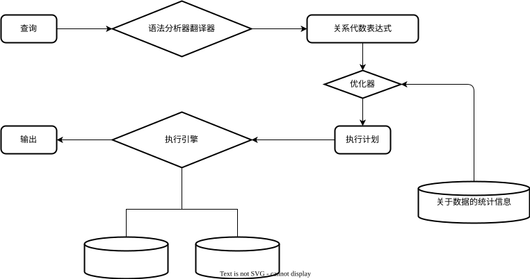
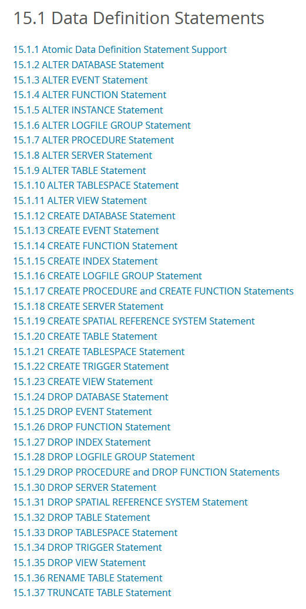
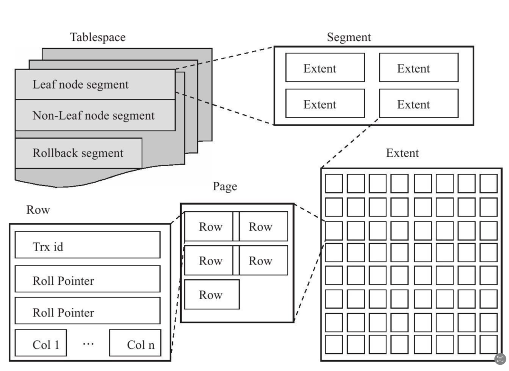

## SQL -- Structure Query Language

### 查询处理

Query Processing  

#### 概述

+ 基本步骤

  + [diagram]

    

  + 语法分析与翻译  
    + 把查询语句翻译成系统的内部表示形式  
    + 语法分析器检查用户查询的语法  
    + 验证出现在查询中的关系名就是数据库中的关系名  
    + 系统构造该查询的语法分析树表示形式，然后将之翻译成关系代数表达式  
    + 示例
      + SQL 

        ```sql
        select salary
        from instructor
        where salary < 75000;
        ```

      + 关系代数
        1. $\sigma_{salary<75000}{(\prod_{salary}{(instructor)})}$
        2. $\prod_{salary}{(\sigma_{salary<75000}{(instructor)})}$

      + 执行原语(evaluation primitive)  
        带有执行注释的关系代数  
        用于执行一个查询的原语操作序列称为**查询执行计划**  

  + 优化

    + 构造具有最小查询执行代价的查询执行计划的工作，称为**查询优化**(query optimization)  
    + 查询优化器必须知晓每种运算的代价  
      + 流水线(pipeline)  
        每种运算都在其输入元组上开始工作，  
        即使这些元组是由另一种运算所产生的  
      + 种类
        + I/O  
        + CPU  
        + 通信  
        + ...  
      + 总和
        + 一个查询执行计划的**响应时间**(response time)，执行该计划所需的壁钟时间  
        + 代价估值的困难
          + 响应时间依赖于当查询开始执行时缓冲区的内容；  
            对查询进行优化时，相关信息无法获取，即便获取也难以计算  
          + 在具有多个磁盘的系统中，响应时间依赖于访问在磁盘之间的分布情况；如无详细数据则很难估计  

  + 选择运算
    **文件扫描**(file scan)是数据访问的最低级别的运算。  
    文件扫描是用于定位和检索满足选择条件的记录的搜索算法。  
    在关系系统中，若关系保存在一个单独的专用文件中，则采用文件扫描就可以读取整个关系。  

    + [table]

      |       | 算法                        | 代价   | 原因   |
      | :---- | :------------------------- | :---- | :---- |
      |  A1   | 线性搜索                     | $t_s + b_r \times t_T$                        | 一次初始搜索加上$b_r$次块传输，其中$b_r$表示文件中的块数量 |
      |  A1   | 线性搜素，码上等值比较         | 评价情形: $t_s + ({b_r}/2) \times t_T$         | 因最多有一条记录满足条件，故一旦找到所需的记录，扫描即可终止；<br/>但在最坏情况下，仍需$b_r$次块传输 |
      |  A2   | $B^+$树聚集索引，码上等值比较   | $(h_i + 1) \times (t_T + t_s)$                | (其中$h_i$表示索引树的高度)<br/>索引搜索遍历树的高度，加上一次I/O来获取记录，每次类似I/O操作需要一次寻址和一次块传输 |
      |  A3   | $B^+$树聚集索引，非码上等值比较 | $h_i \times (t_T + t_s) + t_s + b \times t_T$ | 树的每一层有一次寻道，第一块有一次寻道。b是包含具有指定搜索码记录的块数，所有这些记录都要读取。<br/>假定这些块是顺序存储(聚集索引)的叶子块且无需额外寻道 |
      |  A4   | $B^+$树辅助索引，码上等值比较   | $(h_i + 1) \times (t_T + t_s)$                | 情形和聚集索引类似 |
      |  A4   | $B^+$树辅助索引，非码上等值比较 | $(h_i + n) \times (t_T + t_s)$                | (其中n是所获取记录的数量)<br/>索引遍历的代价和A3一样，但每条记录可能存储在不同的块上，需要对每条记录进行一次寻道。<br/>若n大，代价昂贵。 |
      |  A5   | $B^+$树聚集索引，比较         | $h_i \times (t_T + t_s) + t_s + b \times t_T$ | 和"A3、非码上等值比较"的情形一样 |
      |  A6   | $B^+$树辅助索引，比较         | $(h_i + n) \times (t_T + t_s)$                | 和"A4、非码上等值比较"的情形一样 |

    + $A1$, 线性搜索

  + 执行

## SQL of MySQL

### MySQL组件

+ "DATABASE" / "SCHEMA"

+ "TABLESPACE"

  + "InnnoDB Tablespace"

  + "NDB Cluster"

+ "TABLE"

+ "VIEW"

+ "INDEX"

+ "TRIGGER"

+ "EVENT"

+ "FUNCTION"

+ "PROCEDURE"

+ "LOGFILE" / "LOGFILE GROUP"

+ "SERVER" / "FEDERATED storage engine"

+ "SPATIAL REFERENCE SYSTEM"

### DDL

#### MySQL DDL概述

+ 简述

  + [Diagram]  
      
    [mysql.com 参考](https://dev.mysql.com/doc/refman/8.4/en/sql-data-definition-statements.html)

#### Atomic DDL

+ 原子性数据定义语言
+ Atomic DDL‌ 将 DDL 操作重构为一个‌单一的原子事务‌，确保操作要么‌完全成功‌，要么‌完全回滚‌，不存在“中间状态”。

+ Atomic DDL 主要依赖以下两个关键机制：

  + ‌集成数据字典 (Integrated Data Dictionary)‌

    + MySQL 8.0 废弃了 .frm 文件，将所有元数据（表结构、索引、用户信息等）统一存储在基于 ‌InnoDB‌ 引擎的系统表中。  
    + 这使得元数据的修改可以像普通 DML 一样支持事务 ACID 特性。  

  + ‌DDL 日志 (DDL Log)‌

    + InnoDB 使用隐藏表 mysql.innodb_ddl_log 记录物理文件操作（如创建/删除 .ibd 文件、重命名等）的‌逆向操作‌。  
    + ‌执行流程‌：  
      + Prepare‌: 准备阶段，写入 DDL 日志（记录如何回滚）。  
      + Perform‌: 执行实际的数据变更。  
      + Commit‌: 提交数据字典事务。  
      + Post-DDL‌: 提交后，根据 DDL 日志执行物理文件操作（如重命名、删除），并清理日志。若在此阶段前崩溃，重启后可通过日志重放进行恢复或回滚。  

#### 数据库

+ Database, Schema
  + 在MySQL中，SCHEMA和DATABASE是同义词

+ 创建
  + [mysql.com 参考](https://dev.mysql.com/doc/refman/8.4/en/create-database.html)  
    > CREATE DATABASE creates a database with the given name. To use this statement, you need the CREATE privilege for the database. CREATE SCHEMA is a synonym for CREATE DATABASE.  
    > 创建数据库 创建一个带有名字的数据库。要使用这个语句，你需要数据库的CREATE权限。CREATE SCHEMA 是 CREATE DATABASE 的同义词。  

  + [code]

    ```sql
    CREATE {DATABASE | SCHEMA} [IF NOT EXISTS] db_name
        [create_option] ...
    
    create_option: [DEFAULT] {
        CHARACTER SET [=] charset_name
      | COLLATE [=] collation_name
      | ENCRYPTION [=] {'Y' | 'N'}
    }
    ```

    + CHARACTER SET & COLLATE
      + [mysql.com 参考](https://dev.mysql.com/doc/refman/8.4/en/charset-mysql.html)  

        > The CHARACTER SET option specifies the default database character set. The COLLATE option specifies the default database collation.  
        > CHARACTER SET 选项指定了默认的数据库字符集。COLLATE 选项指定了默认的数据库整合。  

      + [operating]

        ```sql
        mysql> SHOW CHARACTER SET;
        +----------+---------------------------------+---------------------+--------+
        | Charset  | Description                     | Default collation   | Maxlen |
        +----------+---------------------------------+---------------------+--------+
        | armscii8 | ARMSCII-8 Armenian              | armscii8_general_ci |      1 |
        | ascii    | US ASCII                        | ascii_general_ci    |      1 |
        | big5     | Big5 Traditional Chinese        | big5_chinese_ci     |      2 |
        | binary   | Binary pseudo charset           | binary              |      1 |
        | cp1250   | Windows Central European        | cp1250_general_ci   |      1 |
        | cp1251   | Windows Cyrillic                | cp1251_general_ci   |      1 |
        | cp1256   | Windows Arabic                  | cp1256_general_ci   |      1 |
        | cp1257   | Windows Baltic                  | cp1257_general_ci   |      1 |
        | cp850    | DOS West European               | cp850_general_ci    |      1 |
        | cp852    | DOS Central European            | cp852_general_ci    |      1 |
        | cp866    | DOS Russian                     | cp866_general_ci    |      1 |
        | cp932    | SJIS for Windows Japanese       | cp932_japanese_ci   |      2 |
        | dec8     | DEC West European               | dec8_swedish_ci     |      1 |
        | eucjpms  | UJIS for Windows Japanese       | eucjpms_japanese_ci |      3 |
        | euckr    | EUC-KR Korean                   | euckr_korean_ci     |      2 |
        | gb18030  | China National Standard GB18030 | gb18030_chinese_ci  |      4 |
        | gb2312   | GB2312 Simplified Chinese       | gb2312_chinese_ci   |      2 |
        | gbk      | GBK Simplified Chinese          | gbk_chinese_ci      |      2 |
        | geostd8  | GEOSTD8 Georgian                | geostd8_general_ci  |      1 |
        | greek    | ISO 8859-7 Greek                | greek_general_ci    |      1 |
        | hebrew   | ISO 8859-8 Hebrew               | hebrew_general_ci   |      1 |
        | hp8      | HP West European                | hp8_english_ci      |      1 |
        | keybcs2  | DOS Kamenicky Czech-Slovak      | keybcs2_general_ci  |      1 |
        | koi8r    | KOI8-R Relcom Russian           | koi8r_general_ci    |      1 |
        | koi8u    | KOI8-U Ukrainian                | koi8u_general_ci    |      1 |
        | latin1   | cp1252 West European            | latin1_swedish_ci   |      1 |
        | latin2   | ISO 8859-2 Central European     | latin2_general_ci   |      1 |
        | latin5   | ISO 8859-9 Turkish              | latin5_turkish_ci   |      1 |
        | latin7   | ISO 8859-13 Baltic              | latin7_general_ci   |      1 |
        | macce    | Mac Central European            | macce_general_ci    |      1 |
        | macroman | Mac West European               | macroman_general_ci |      1 |
        | sjis     | Shift-JIS Japanese              | sjis_japanese_ci    |      2 |
        | swe7     | 7bit Swedish                    | swe7_swedish_ci     |      1 |
        | tis620   | TIS620 Thai                     | tis620_thai_ci      |      1 |
        | ucs2     | UCS-2 Unicode                   | ucs2_general_ci     |      2 |
        | ujis     | EUC-JP Japanese                 | ujis_japanese_ci    |      3 |
        | utf16    | UTF-16 Unicode                  | utf16_general_ci    |      4 |
        | utf16le  | UTF-16LE Unicode                | utf16le_general_ci  |      4 |
        | utf32    | UTF-32 Unicode                  | utf32_general_ci    |      4 |
        | utf8mb3  | UTF-8 Unicode                   | utf8mb3_general_ci  |      3 |
        | utf8mb4  | UTF-8 Unicode                   | utf8mb4_0900_ai_ci  |      4 |
        +----------+---------------------------------+---------------------+--------+
        41 rows in set (0.00 sec)
        
        mysql>
        ```

      + [code]

        ```sql
        SHOW CHARACTER SET LIKE 'utf%';
        ```

      + [code]

        ```sql
        SHOW COLLATION WHERE Charset = 'utf8mb4';
        ```

    + ENCRYPTION

      + [mysql.com 参考](https://dev.mysql.com/doc/refman/8.4/en/charset-mysql.html)  

        > The ENCRYPTION option defines the default database encryption, which is inherited by tables created in the database.  
        > The permitted values are 'Y' (encryption enabled) and 'N' (encryption disabled).  
        > If the ENCRYPTION option is not specified, the value of the default_table_encryption system variable defines the default database encryption.  
        > If the table_encryption_privilege_check system variable is enabled, the TABLE_ENCRYPTION_ADMIN privilege is required to specify a default encryption setting that differs from the default_table_encryption setting.  
        > ENCRYPTION 选项定义了默认的数据库加密，该加密由数据库中创建的表继承。  
        > 允许的值为“Y”（加密启用）和“N”（加密禁用）。  
        > 如果未指定ENCRYPTION选项，default_table_encryption系统变量的值定义了默认数据库加密。  
        > 如果启用table_encryption_privilege_check系统变量，则需要TABLE_ENCRYPTION_ADMIN权限来指定与default_table_encryption设置不同的默认加密设置。  

+ 删除
  + [mysql.com 参考](https://dev.mysql.com/doc/refman/8.4/en/drop-database.html)

    > DROP DATABASE drops all tables in the database and deletes the database. Be very careful with this statement! To use DROP DATABASE, you need the DROP privilege on the database.  
    > DROP DATABASE 会丢弃数据库中的所有表并删除数据库。这句话要非常小心！要使用DROP DATABASE，你需要数据库上的DROP权限。  

  + 涉及目录和文件
    + 文件
      + .BAK
      + .DAT
      + .HSH
      + .MRG
      + .MYD
      + .MYI
      + .cfg
      + .db
      + .ibd
      + .ndb

+ 修改

#### 数据表

+ Data table, Relation

+ 创建

+ 删除(Drop)

+ 修改

+ 重命名

+ 删除(Truncate)

  + 示例
    + [operating]

      ```sql
      mysql> TRUNCATE TABLE t_course;
      Query OK, 0 rows affected (0.06 sec)
      
      mysql>
      ```

#### 视图

#### 函数

#### 存储过程

### DCL

#### 概述

#### GRANT

#### REVOKE

#### COMMIT

#### ROLLBACK

### DQL

+ FROM

+ SELECT

+ WHERE

+ JOIN

+ 集合运算

+ "like"
  + 通配符
    + `%`
    + `_`
    + 示例
      + [operating]

        ```sql
        mysql> select distinct(dept_name) from student s;
        +-------------+
        | dept_name   |
        +-------------+
        | Accounting  |
        | Astronomy   |
        | Athletics   |
        | Biology     |
        | Civil Eng.  |
        | Comp. Sci.  |
        | Cybernetics |
        | Elec. Eng.  |
        | English     |
        | Finance     |
        | Geology     |
        | History     |
        | Languages   |
        | Marketing   |
        | Math        |
        | Mech. Eng.  |
        | Physics     |
        | Pol. Sci.   |
        | Psychology  |
        | Statistics  |
        +-------------+
        20 rows in set (0.00 sec)

        mysql> select count(*) from student s;
        +----------+
        | count(*) |
        +----------+
        |     2000 |
        +----------+
        1 row in set (0.00 sec)
        
        mysql> select count(*) from student s where s.dept_name like '%Eng.';
        +----------+
        | count(*) |
        +----------+
        |      323 |
        +----------+
        1 row in set (0.00 sec)
        
        mysql> select count(*) from student s where s.dept_name like '%E__.';
        +----------+
        | count(*) |
        +----------+
        |      323 |
        +----------+
        1 row in set (0.01 sec)
        
        mysql>
        ```

  + 转义符
    + "\"
    + "escape"
    + 示例
      + [operating]

        ```sql
        ```

  + PostgreSQL

    + "similar to"

+ "order by asc|desc"

### DML

#### INSERT

#### DELETE

#### UPDATE

## MySQL特性

### MySQL内置特性

#### MySQL数据类型

[MySQL数据类型](./MySql-data_type.md)

#### 系统表

+ 罗列数据表

  + [operating]

    ```sql
    mysql> USE mysql;
    mysql> SHOW TABLES;
    +------------------------------------------------------+
    | Tables_in_mysql                                      |
    +------------------------------------------------------+
    | columns_priv                                         |
    | component                                            |
    | db                                                   |
    | default_roles                                        |
    | engine_cost                                          |
    | func                                                 |
    | general_log                                          |
    | global_grants                                        |
    | gtid_executed                                        |
    | help_category                                        |
    | help_keyword                                         |
    | help_relation                                        |
    | help_topic                                           |
    | innodb_index_stats                                   |
    | innodb_table_stats                                   |
    | ndb_binlog_index                                     |
    | password_history                                     |
    | plugin                                               |
    | procs_priv                                           |
    | proxies_priv                                         |
    | replication_asynchronous_connection_failover         |
    | replication_asynchronous_connection_failover_managed |
    | replication_group_configuration_version              |
    | replication_group_member_actions                     |
    | role_edges                                           |
    | server_cost                                          |
    | servers                                              |
    | slave_master_info                                    |
    | slave_relay_log_info                                 |
    | slave_worker_info                                    |
    | slow_log                                             |
    | tables_priv                                          |
    | time_zone                                            |
    | time_zone_leap_second                                |
    | time_zone_name                                       |
    | time_zone_transition                                 |
    | time_zone_transition_type                            |
    | user                                                 |
    +------------------------------------------------------+
    38 rows in set (0.00 sec)
    
    mysql>
    ```

+ "mysql.db"

+ "mysql.user"

#### 内置函数 与 计算

##### 标量函数 / 单行函数

+ 说明
  + 不会改变返回的行数，但会某些指定的行进行计算/变化
  + 可以使用也可以不使用 虚拟表dual
+ 字符串函数
  + 说明

    + 在默认情况下，**MySQL对大小写不敏感**，包括字段名和字段值

      + 示例，注意 字段名ename 和 字段值 Smith

        + [operating]

          ```sql
          mysql> SELECT * FROm emp WHERE ENAME = 'smith';
          +-------+-------+-------+------+------------+--------+------+--------+
          | empno | ename | job   | mgr  | hiredate   | sal    | comm | deptno |
          +-------+-------+-------+------+------------+--------+------+--------+
          |  7369 | Smith | CLERK | 7902 | 1980-12-17 | 800.00 | NULL |     20 |
          +-------+-------+-------+------+------------+--------+------+--------+
          1 row in set (0.00 sec)
          
          mysql>          
          ```

  + CONCAT()
  + INSTR()
    + 说明
      返回子字符串(第二字符串)在父字符串(第一字符串)中首次首次出现的位置

    + 示例
      + [operating]

        ```sql
        mysql> SELECT  INSTR('douma, shake you code', 'ou') FROM dual;
        +--------------------------------------+
        | INSTR('douma, shake you code', 'ou') |
        +--------------------------------------+
        |                                    2 |
        +--------------------------------------+
        1 row in set (0.00 sec)
        
        mysql>
        ```

      + [operating]

        ```sql
        mysql> SELECT
            ->  INSTR('douma, shake you code', 'shake') find1,
            ->  INSTR('douma, shake you code', 'douma') find2,
            ->  INSTR('douma, shake you code', 'mysql') find3
            -> FROM dual;
        +-------+-------+-------+
        | find1 | find2 | find3 |
        +-------+-------+-------+
        |     8 |     1 |     0 |
        +-------+-------+-------+
        1 row in set (0.00 sec)
        
        mysql>
        ```

  + LENGTH()
    + 示例
      + [operating]

        ```sql
        mysql> SELECT ename, LENGTH(ename) FROM emp WHERE LENGTH(ename) = 5;
        +-------+---------------+
        | ename | LENGTH(ename) |
        +-------+---------------+
        | Smith |             5 |
        | Allen |             5 |
        | Jones |             5 |
        | Blake |             5 |
        | Clark |             5 |
        | Scott |             5 |
        | Adams |             5 |
        | James |             5 |
        +-------+---------------+
        8 rows in set (0.00 sec)
        

        mysql> SELECT ename, LENGTH(ename) FROM emp WHERE ename like '_____';
        +-------+---------------+
        | ename | LENGTH(ename) |
        +-------+---------------+
        | Smith |             5 |
        | Allen |             5 |
        | Jones |             5 |
        | Blake |             5 |
        | Clark |             5 |
        | Scott |             5 |
        | Adams |             5 |
        | James |             5 |
        +-------+---------------+
        8 rows in set (0.00 sec)
        
        mysql>
        ```

      + [operating]

        ```sql
        mysql> SELECT ename, LENGTH(ename) FROM emp WHERE LENGTH(ename) <> 5;
        +--------+---------------+
        | ename  | LENGTH(ename) |
        +--------+---------------+
        | Ward   |             4 |
        | Martin |             6 |
        | King   |             4 |
        | Turner |             6 |
        | Ford   |             4 |
        | Miller |             6 |
        +--------+---------------+
        6 rows in set (0.00 sec)
        
        mysql>
        ```

  + LPAD()

  + LOWER()
    + 说明
    + 示例
      + [operating]

        ```sql
        mysql> SELECT LOWER('HELLO, THE WORLD');
        +---------------------------+
        | LOWER('HELLO, THE WORLD') |
        +---------------------------+
        | hello, the world          |
        +---------------------------+
        1 row in set (0.00 sec)
        
        mysql>        
        ```

      + [operating]

        ```sql
        mysql> SELECT d.deptno, d.dname, e.ename FROM dept d JOIN emp e on e.deptno = d.deptno;
        +--------+------------+--------+
        | deptno | dname      | ename  |
        +--------+------------+--------+
        |     10 | ACCOUNTING | Clark  |
        |     10 | ACCOUNTING | King   |
        |     10 | ACCOUNTING | Miller |
        |     20 | RESEARCH   | Smith  |
        |     20 | RESEARCH   | Jones  |
        |     20 | RESEARCH   | Scott  |
        |     20 | RESEARCH   | Adams  |
        |     20 | RESEARCH   | Ford   |
        |     30 | SALES      | Allen  |
        |     30 | SALES      | Ward   |
        |     30 | SALES      | Martin |
        |     30 | SALES      | Blake  |
        |     30 | SALES      | Turner |
        |     30 | SALES      | James  |
        +--------+------------+--------+
        14 rows in set (0.00 sec)
        
        mysql> SELECT d.deptno, LOWER(d.dname), UPPER(e.ename) FROM dept d JOIN emp e on e.deptno = d.deptno;
        +--------+----------------+----------------+
        | deptno | LOWER(d.dname) | UPPER(e.ename) |
        +--------+----------------+----------------+
        |     10 | accounting     | CLARK          |
        |     10 | accounting     | KING           |
        |     10 | accounting     | MILLER         |
        |     20 | research       | SMITH          |
        |     20 | research       | JONES          |
        |     20 | research       | SCOTT          |
        |     20 | research       | ADAMS          |
        |     20 | research       | FORD           |
        |     30 | sales          | ALLEN          |
        |     30 | sales          | WARD           |
        |     30 | sales          | MARTIN         |
        |     30 | sales          | BLAKE          |
        |     30 | sales          | TURNER         |
        |     30 | sales          | JAMES          |
        +--------+----------------+----------------+
        14 rows in set (0.01 sec)
        
        mysql>
        ```

      + [operating]

        ```sql
        mysql> SELECT * FROm emp WHERE ename = 'smith';
        +-------+-------+-------+------+------------+--------+------+--------+
        | empno | ename | job   | mgr  | hiredate   | sal    | comm | deptno |
        +-------+-------+-------+------+------------+--------+------+--------+
        |  7369 | Smith | CLERK | 7902 | 1980-12-17 | 800.00 | NULL |     20 |
        +-------+-------+-------+------+------------+--------+------+--------+
        1 row in set (0.00 sec)
        
        mysql>
        ```

  + LTRIM()

  + REPLACE()

    + 示例

      + [operating]

        ```sql
        mysql> SELECT ename , REPLACE(ename, 'a', 'A') FROM emp;
        +--------+--------------------------+
        | ename  | REPLACE(ename, 'a', 'A') |
        +--------+--------------------------+
        | Smith  | Smith                    |
        | Allen  | Allen                    |
        | Ward   | WArd                     |  *
        | Jones  | Jones                    |
        | Martin | MArtin                   |  *
        | Blake  | BlAke                    |  *
        | Clark  | ClArk                    |
        | Scott  | Scott                    |
        | King   | King                     |
        | Turner | Turner                   |
        | Adams  | AdAms                    |  *
        | James  | JAmes                    |  *
        | Ford   | Ford                     |
        | Miller | Miller                   |
        +--------+--------------------------+
        14 rows in set (0.01 sec)
        
        mysql>
        ```

  + RPAD()
    + 说明
      右补位

    + 示例
      + [operating]

        ```sql
        mysql> SELECT LPAD(RPAD(ename, 8, '*'), 10, '$') FROM emp;
        +------------------------------------+
        | LPAD(RPAD(ename, 8, '*'), 10, '$') |
        +------------------------------------+
        | $$Smith***                         |
        | $$Allen***                         |
        | $$Ward****                         |
        | $$Jones***                         |
        | $$Martin**                         |
        | $$Blake***                         |
        | $$Clark***                         |
        | $$Scott***                         |
        | $$King****                         |
        | $$Turner**                         |
        | $$Adams***                         |
        | $$James***                         |
        | $$Ford****                         |
        | $$Miller**                         |
        +------------------------------------+
        14 rows in set (0.00 sec)
        
        mysql>
        ```

  + RTRIM()
    + 示例
      + [operating]

        ```sql
        mysql> SELECT RTRIM('    HELLLO    ');
        +-------------------------+
        | RTRIM('    HELLLO    ') |
        +-------------------------+
        |     HELLLO              |
        +-------------------------+
        1 row in set (0.00 sec)
        
        mysql>
        ```

  + STUFF()

  + SUBSTR()
    + 说明
      字符串截取
      截取长度不指定，则默认截取到字符串尾

    + 示例

      + [operating]

        ```sql
        mysql> SELECT ename, SUBSTR(ename, 1, 3) FROM emp;
        +--------+---------------------+
        | ename  | SUBSTR(ename, 1, 3) |
        +--------+---------------------+
        | Smith  | Smi                 |
        | Allen  | All                 |
        | Ward   | War                 |
        | Jones  | Jon                 |
        | Martin | Mar                 |
        | Blake  | Bla                 |
        | Clark  | Cla                 |
        | Scott  | Sco                 |
        | King   | Kin                 |
        | Turner | Tur                 |
        | Adams  | Ada                 |
        | James  | Jam                 |
        | Ford   | For                 |
        | Miller | Mil                 |
        +--------+---------------------+
        14 rows in set (0.00 sec)
        
        mysql>        
        ```

      + [operating]

        ```sql
        mysql> SELECT ename, SUBSTR(ename, -3,2) FROM emp;
        +--------+---------------------+
        | ename  | SUBSTR(ename, -3,2) |
        +--------+---------------------+
        | Smith  | it                  |
        | Allen  | le                  |
        | Ward   | ar                  |
        | Jones  | ne                  |
        | Martin | ti                  |
        | Blake  | ak                  |
        | Clark  | ar                  |
        | Scott  | ot                  |
        | King   | in                  |
        | Turner | ne                  |
        | Adams  | am                  |
        | James  | me                  |
        | Ford   | or                  |
        | Miller | le                  |
        +--------+---------------------+
        14 rows in set (0.00 sec)
        
        mysql>
        ```

      + [operating]

        ```sql
        mysql> SELECT ename, CONCAT('***', SUBSTR(ename, 4)) FROM emp;
        +--------+---------------------------------+
        | ename  | CONCAT('***', SUBSTR(ename, 4)) |
        +--------+---------------------------------+
        | Smith  | ***th                           |
        | Allen  | ***en                           |
        | Ward   | ***d                            |
        | Jones  | ***es                           |
        | Martin | ***tin                          |
        | Blake  | ***ke                           |
        | Clark  | ***rk                           |
        | Scott  | ***tt                           |
        | King   | ***g                            |
        | Turner | ***ner                          |
        | Adams  | ***ms                           |
        | James  | ***es                           |
        | Ford   | ***d                            |
        | Miller | ***ler                          |
        +--------+---------------------------------+
        14 rows in set (0.00 sec)
        
        mysql>
        ```

  + TRIM()
    + 说明
      去空格

      + [operating]

        ```sql
        mysql> SELECT TRIM('    HELLLO    ');
        +------------------------+
        | TRIM('    HELLLO    ') |
        +------------------------+
        | HELLLO                 |
        +------------------------+
        1 row in set (0.00 sec)
        
        mysql>
        ```

  + UPPER()
    + 示例

      + [operating]

        ```sql
        mysql> SELECT UPPER('hello, the world');
        +---------------------------+
        | UPPER('hello, the world') |
        +---------------------------+
        | HELLO, THE WORLD          |
        +---------------------------+
        1 row in set (0.00 sec)
        
        mysql>
        ```

+ 数值函数
  + ABS(字段)
    + 说明
      取绝对值

  + CEIL()

  + CEILING()

  + FLOOR()

  + MOD()
    + 说明
      求余

  + RAND(x)
    + 说明
      + x，随机种子，相同的的x值会产生相同的随机数，**缺省无**

  + ROUND(字段,n)
    + 说明
      合入取整
      + n 为保留小数位，**缺省0**
      + n 可以为负数

    + 示例

      + [opeating]

        ```sql
        mysql> SELECT e.empno, e.ename, (e.sal + 200) * 112 + 5000 as  year_sal, e.sal / 30 as day_sal         FROM emp as e;
        +-------+--------+-----------+------------+
        | empno | ename  | year_sal  | day_sal    |
        +-------+--------+-----------+------------+
        |  7369 | Smith  | 117000.00 |  26.666667 |
        |  7499 | Allen  | 206600.00 |  53.333333 |
        |  7521 | Ward   | 167400.00 |  41.666667 |
        |  7566 | Jones  | 360600.00 |  99.166667 |
        |  7654 | Martin | 167400.00 |  41.666667 |
        |  7698 | Blake  | 346600.00 |  95.000000 |
        |  7782 | Clark  | 301800.00 |  81.666667 |
        |  7788 | Scott  | 363400.00 | 100.000000 |
        |  7839 | King   | 587400.00 | 166.666667 |
        |  7844 | Turner | 195400.00 |  50.000000 |
        |  7876 | Adams  | 150600.00 |  36.666667 |
        |  7900 | James  | 133800.00 |  31.666667 |
        |  7902 | Ford   | 363400.00 | 100.000000 |
        |  7934 | Miller | 173000.00 |  43.333333 |
        +-------+--------+-----------+------------+
        14 rows in set (0.01 sec)
        
        mysql> SELECT e.empno, e.ename, (e.sal + 200) * 112 + 5000 as  year_sal, ROUND(e.sal / 30, 2) as day_sal FROM emp as e;
        +-------+--------+-----------+---------+
        | empno | ename  | year_sal  | day_sal |
        +-------+--------+-----------+---------+
        |  7369 | Smith  | 117000.00 |   26.67 |
        |  7499 | Allen  | 206600.00 |   53.33 |
        |  7521 | Ward   | 167400.00 |   41.67 |
        |  7566 | Jones  | 360600.00 |   99.17 |
        |  7654 | Martin | 167400.00 |   41.67 |
        |  7698 | Blake  | 346600.00 |   95.00 |
        |  7782 | Clark  | 301800.00 |   81.67 |
        |  7788 | Scott  | 363400.00 |  100.00 |
        |  7839 | King   | 587400.00 |  166.67 |
        |  7844 | Turner | 195400.00 |   50.00 |
        |  7876 | Adams  | 150600.00 |   36.67 |
        |  7900 | James  | 133800.00 |   31.67 |
        |  7902 | Ford   | 363400.00 |  100.00 |
        |  7934 | Miller | 173000.00 |   43.33 |
        +-------+--------+-----------+---------+
        14 rows in set (0.01 sec)
        
        mysql> SELECT e.empno, e.ename, ROUND(((e.sal + 200) * 112 + 5000), -3) as  year_sal, ROUND(e.sal / 30, 2) as day_sal FROM emp as e;
        +-------+--------+----------+---------+
        | empno | ename  | year_sal | day_sal |
        +-------+--------+----------+---------+
        |  7369 | Smith  |   117000 |   26.67 |
        |  7499 | Allen  |   207000 |   53.33 |
        |  7521 | Ward   |   167000 |   41.67 |
        |  7566 | Jones  |   361000 |   99.17 |
        |  7654 | Martin |   167000 |   41.67 |
        |  7698 | Blake  |   347000 |   95.00 |
        |  7782 | Clark  |   302000 |   81.67 |
        |  7788 | Scott  |   363000 |  100.00 |
        |  7839 | King   |   587000 |  166.67 |
        |  7844 | Turner |   195000 |   50.00 |
        |  7876 | Adams  |   151000 |   36.67 |
        |  7900 | James  |   134000 |   31.67 |
        |  7902 | Ford   |   363000 |  100.00 |
        |  7934 | Miller |   173000 |   43.33 |
        +-------+--------+----------+---------+
        14 rows in set (0.00 sec)
        
        mysql>
        ```

  + SQRT()
    + 说明
      平方根

  + TRUNCATE()
    + 说明
      阶段取整

    + 示例
      + [operating]

        ```sql
        mysql> SELECT e.empno, e.ename, ROUND(((e.sal + 200) * 112 + 5000), -3) as  year_sal, ROUND(e.sal / 30, 2) as day_sal FROM emp as e;
        +-------+--------+----------+---------+
        | empno | ename  | year_sal | day_sal |
        +-------+--------+----------+---------+
        |  7369 | Smith  |   117000 |   26.67 |
        |  7499 | Allen  |   207000 |   53.33 |
        |  7521 | Ward   |   167000 |   41.67 |
        |  7566 | Jones  |   361000 |   99.17 |
        |  7654 | Martin |   167000 |   41.67 |
        |  7698 | Blake  |   347000 |   95.00 |
        |  7782 | Clark  |   302000 |   81.67 |
        |  7788 | Scott  |   363000 |  100.00 |
        |  7839 | King   |   587000 |  166.67 |
        |  7844 | Turner |   195000 |   50.00 |
        |  7876 | Adams  |   151000 |   36.67 |
        |  7900 | James  |   134000 |   31.67 |
        |  7902 | Ford   |   363000 |  100.00 |
        |  7934 | Miller |   173000 |   43.33 |
        +-------+--------+----------+---------+
        14 rows in set (0.00 sec)
        
        mysql> SELECT e.empno, e.ename, ROUND(((e.sal + 200) * 112 + 5000), -3) as  year_sal, TRUNCATE(e.sal / 30, 2) as day_sal FROM emp as e;
        +-------+--------+----------+---------+
        | empno | ename  | year_sal | day_sal |
        +-------+--------+----------+---------+
        |  7369 | Smith  |   117000 |   26.66 |
        |  7499 | Allen  |   207000 |   53.33 |
        |  7521 | Ward   |   167000 |   41.66 |
        |  7566 | Jones  |   361000 |   99.16 |
        |  7654 | Martin |   167000 |   41.66 |
        |  7698 | Blake  |   347000 |   95.00 |
        |  7782 | Clark  |   302000 |   81.66 |
        |  7788 | Scott  |   363000 |  100.00 |
        |  7839 | King   |   587000 |  166.66 |
        |  7844 | Turner |   195000 |   50.00 |
        |  7876 | Adams  |   151000 |   36.66 |
        |  7900 | James  |   134000 |   31.66 |
        |  7902 | Ford   |   363000 |  100.00 |
        |  7934 | Miller |   173000 |   43.33 |
        +-------+--------+----------+---------+
        14 rows in set (0.00 sec)
        
        mysql>
        ```

+ 日期函数
  + 关键词(1)
    + CURRENT_DATE
    + CURRENT_TIME
    + CURRENT_TIMESTAMP
  + 关键词(2)
    + INTERVAL
  + 关键词(3)，时间单位
    + SECOND
    + MINUTE
    + HOUR
    + DAY
    + MONTH
    + YEAR

  + ~~ADD_MONTHS()~~
    + 说明
      未在官方文档中找到该函数

  + ADDDATE()
    + 说明

      + [operating]  

        ```sql
        mysql> HELP ADDDATE
        Name: 'ADDDATE'
        Description:
        Syntax:
        ADDDATE(date,INTERVAL expr unit), ADDDATE(date,days)
        
        When invoked with the INTERVAL form of the second argument, ADDDATE()
        is a synonym for DATE_ADD(). The related function SUBDATE() is a
        synonym for DATE_SUB(). For information on the INTERVAL unit argument,
        see
        https://dev.mysql.com/doc/refman/8.4/en/expressions.html#temporal-inter
        vals.
        
        mysql> SELECT DATE_ADD('2008-01-02', INTERVAL 31 DAY);
                -> '2008-02-02'
        mysql> SELECT ADDDATE('2008-01-02', INTERVAL 31 DAY);
                -> '2008-02-02'
        
        When invoked with the days form of the second argument, MySQL treats it
        as an integer number of days to be added to expr.
        
        URL: https://dev.mysql.com/doc/refman/8.4/en/date-and-time-functions.html
        
        Examples:
        mysql> SELECT ADDDATE('2008-01-02', 31);
                -> '2008-02-02'
        
        mysql>
        ```

  + ADDTIME()

  + DATE_ADD()
    + 说明
    + 示例
      + [operating]

        ```sql
        mysql> SELECT DATE_ADD(CURRENT_DATE, INTERVAL 3 DAY);
        +----------------------------------------+
        | DATE_ADD(CURRENT_DATE, INTERVAL 3 DAY) |
        +----------------------------------------+
        | 2026-05-18                             |
        +----------------------------------------+
        1 row in set (0.01 sec)
        
        mysql> SELECT DATE_ADD(CURRENT_DATE, INTERVAL 3 MONTH);
        +------------------------------------------+
        | DATE_ADD(CURRENT_DATE, INTERVAL 3 MONTH) |
        +------------------------------------------+
        | 2026-08-15                               |
        +------------------------------------------+
        1 row in set (0.00 sec)
        
        mysql> SELECT DATE_ADD(CURRENT_DATE, INTERVAL 3 YEAR);
        +-----------------------------------------+
        | DATE_ADD(CURRENT_DATE, INTERVAL 3 YEAR) |
        +-----------------------------------------+
        | 2029-05-15                              |
        +-----------------------------------------+
        1 row in set (0.00 sec)
        
        mysql>
        ```  

      + [operating]

        ```sql
        mysql> SELECT DATE_ADD('2020-12-31 23:59:59', INTERVAL 1 SECOND);
        +----------------------------------------------------+
        | DATE_ADD('2020-12-31 23:59:59', INTERVAL 1 SECOND) |
        +----------------------------------------------------+
        | 2021-01-01 00:00:00                                |
        +----------------------------------------------------+
        1 row in set (0.01 sec)
        
        mysql>
        ```

      + [operating]

        ```sql
        mysql> SELECT DATE_ADD('2020-12-31 23:59:59', INTERVAL '1:1' MINUTE_SECOND);
        +---------------------------------------------------------------+
        | DATE_ADD('2020-12-31 23:59:59', INTERVAL '1:1' MINUTE_SECOND) |
        +---------------------------------------------------------------+
        | 2021-01-01 00:01:00                                           |
        +---------------------------------------------------------------+
        1 row in set (0.00 sec)
        
        mysql> SELECT DATE_ADD('2020-12-31 23:59:59', INTERVAL '2:1:10' HOUR_SECOND);
        +----------------------------------------------------------------+
        | DATE_ADD('2020-12-31 23:59:59', INTERVAL '2:1:10' HOUR_SECOND) |
        +----------------------------------------------------------------+
        | 2021-01-01 02:01:09                                            |
        +----------------------------------------------------------------+
        1 row in set (0.00 sec)
        
        mysql>
        mysql>
        ```

  + DATE_SUB()
    + 说明

    + 示例

      + [operating]

        ```sql
        mysql> SELECT DATE_SUB(CURRENT_DATE, INTERVAL 3 DAY) 3_days_later;
        +--------------+
        | 3_days_later |
        +--------------+
        | 2026-05-11   |
        +--------------+
        1 row in set (0.00 sec)
        
        mysql>
        ```

  + DATEDIFF()

    + 说明

    + [operating]

      ```sql
      mysql> USE douma;
      ... ...
      mysql> SELECT ename, hiredate, DATEDIFF(CURRENT_DATE, hiredate) as hireddays FROM emp;
      +--------+------------+----------+
      | ename  | hiredate   | hireddays |
      +--------+------------+----------+
      | Smith  | 1980-12-17 |    16585 |
      | Allen  | 1981-02-20 |    16520 |
      | Ward   | 1981-02-22 |    16518 |
      | Jones  | 1981-04-02 |    16479 |
      | Martin | 1981-09-28 |    16300 |
      | Blake  | 1981-05-01 |    16450 |
      | Clark  | 1981-06-09 |    16411 |
      | Scott  | 1987-04-19 |    14271 |
      | King   | 1981-11-17 |    16250 |
      | Turner | 1981-09-08 |    16320 |
      | Adams  | 1987-05-23 |    14237 |
      | James  | 1981-12-03 |    16234 |
      | Ford   | 1981-12-03 |    16234 |
      | Miller | 1982-01-23 |    16183 |
      +--------+------------+----------+
      14 rows in set (0.00 sec)
      
      mysql>
      ```

  + DAY()

  + EXZTRACT()

  + LAST_DAY()
    + 说明
    + 示例  
      + [operating]

        ```sql
        mysql> SELECT * FROM emp WHERE hiredate = DATE_SUB(LAST_DAY(hiredate), INTERVAL 2 DAY);
        +-------+--------+----------+------+------------+---------+---------+--------+
        | empno | ename  | job      | mgr  | hiredate   | sal     | comm    | deptno |
        +-------+--------+----------+------+------------+---------+---------+--------+
        |  7654 | Martin | SALESMAN | 7698 | 1981-09-28 | 1250.00 | 1400.00 |     30 |
        +-------+--------+----------+------+------------+---------+---------+--------+
        1 row in set (0.01 sec)
        
        mysql>
        ```

  + MONTH()

  + NOW()
    + 说明

    + 示例
      + [oerating]

        ```sql
        mysql> SELECT NOW();
        +---------------------+
        | NOW()               |
        +---------------------+
        | 2026-05-14 16:34:36 |
        +---------------------+
        1 row in set (0.00 sec)
        
        mysql> SELECT CURRENT_TIMESTAMP;
        +---------------------+
        | CURRENT_TIMESTAMP   |
        +---------------------+
        | 2026-05-14 16:35:56 |
        +---------------------+
        1 row in set (0.00 sec)

        mysql>
        ```

  + SYSDATE()
    + 说明
    + 示例
      + [operating]

        ```sql
        mysql> SELECT SYSDATE();
        +---------------------+
        | SYSDATE()           |
        +---------------------+
        | 2026-05-14 19:04:23 |
        +---------------------+
        1 row in set (0.01 sec)
        
        mysql>
        ```

  + TIMESTAMPDIFF()

    + 说明

    + [operating]

      ```sql
      mysql> USE douma;
      ...
      mysql> SELECT ename, hiredate, TIMESTAMPDIFF(MONTH, hiredate, CURRENT_DATE) as hiredmonths FROM emp;
      +--------+------------+-------------+
      | ename  | hiredate   | hiredmonths |
      +--------+------------+-------------+
      | Smith  | 1980-12-17 |         544 |
      | Allen  | 1981-02-20 |         542 |
      | Ward   | 1981-02-22 |         542 |
      | Jones  | 1981-04-02 |         541 |
      | Martin | 1981-09-28 |         535 |
      | Blake  | 1981-05-01 |         540 |
      | Clark  | 1981-06-09 |         539 |
      | Scott  | 1987-04-19 |         468 |
      | King   | 1981-11-17 |         533 |
      | Turner | 1981-09-08 |         536 |
      | Adams  | 1987-05-23 |         467 |
      | James  | 1981-12-03 |         533 |
      | Ford   | 1981-12-03 |         533 |
      | Miller | 1982-01-23 |         531 |
      +--------+------------+-------------+
      14 rows in set (0.00 sec)
      
      mysql>
      ```

  + TO_DAYS()
    + 说明
      + 转换为距离 "1970-01-01" 间的天数

    + 示例

      + [operating]

        ```sql
        mysql> USE douma;
        ... ...
        mysql> SELECT TO_DAYS(CURRENT_DATE);
        +-----------------------+
        | TO_DAYS(CURRENT_DATE) |
        +-----------------------+
        |                740116 |
        +-----------------------+
        1 row in set (0.00 sec)
        
        mysql> 
        mysql> SELECT ename, hiredate, TO_DAYS(CURRENT_DATE) - TO_DAYS(hiredate) as hiredays FROM emp;
        +--------+------------+----------+
        | ename  | hiredate   | hiredays |
        +--------+------------+----------+
        | Smith  | 1980-12-17 |    16585 |
        | Allen  | 1981-02-20 |    16520 |
        | Ward   | 1981-02-22 |    16518 |
        | Jones  | 1981-04-02 |    16479 |
        | Martin | 1981-09-28 |    16300 |
        | Blake  | 1981-05-01 |    16450 |
        | Clark  | 1981-06-09 |    16411 |
        | Scott  | 1987-04-19 |    14271 |
        | King   | 1981-11-17 |    16250 |
        | Turner | 1981-09-08 |    16320 |
        | Adams  | 1987-05-23 |    14237 |
        | James  | 1981-12-03 |    16234 |
        | Ford   | 1981-12-03 |    16234 |
        | Miller | 1982-01-23 |    16183 |
        +--------+------------+----------+
        14 rows in set (0.02 sec)
        
        mysql>
        ```

  + YEAR()

    + 示例

      + [operating]

        ```sql
        mysql> SELECT ename, hiredate, YEAR(hiredate) FROM emp;
        +--------+------------+----------------+
        | ename  | hiredate   | YEAR(hiredate) |
        +--------+------------+----------------+
        | Smith  | 1980-12-17 |           1980 |
        | Allen  | 1981-02-20 |           1981 |
        | Ward   | 1981-02-22 |           1981 |
        | Jones  | 1981-04-02 |           1981 |
        | Martin | 1981-09-28 |           1981 |
        | Blake  | 1981-05-01 |           1981 |
        | Clark  | 1981-06-09 |           1981 |
        | Scott  | 1987-04-19 |           1987 |
        | King   | 1981-11-17 |           1981 |
        | Turner | 1981-09-08 |           1981 |
        | Adams  | 1987-05-23 |           1987 |
        | James  | 1981-12-03 |           1981 |
        | Ford   | 1981-12-03 |           1981 |
        | Miller | 1982-01-23 |           1982 |
        +--------+------------+----------------+
        14 rows in set (0.01 sec)
        
        mysql>
        ```

      + [operating]

        ```sql
        mysql> SELECT CURRENT_TIMESTAMP,
            ->        YEAR(CURRENT_TIMESTAMP),
            ->        MONTH(CURRENT_TIMESTAMP),
            ->        DAY(CURRENT_TIMESTAMP),
            ->        HOUR(CURRENT_TIMESTAMP),
            ->        MINUTE(CURRENT_TIMESTAMP),
            ->        SECOND(CURRENT_TIMESTAMP),
            ->        WEEK(CURRENT_TIMESTAMP),
            ->        WEEKDAY(CURRENT_TIMESTAMP)
            -> FROM dual\G;
        *************************** 1. row ***************************
                 CURRENT_TIMESTAMP: 2026-05-16 14:56:29
           YEAR(CURRENT_TIMESTAMP): 2026
          MONTH(CURRENT_TIMESTAMP): 5
            DAY(CURRENT_TIMESTAMP): 16
           HOUR(CURRENT_TIMESTAMP): 14
         MINUTE(CURRENT_TIMESTAMP): 56
         SECOND(CURRENT_TIMESTAMP): 29
           WEEK(CURRENT_TIMESTAMP): 19
        WEEKDAY(CURRENT_TIMESTAMP): 5
        1 row in set (0.00 sec)
        
        ERROR:
        No query specified
        
        mysql>
        ```

      + [operating]

        ```sql
        mysql> SELECT YEAR(hiredate), count(1)
            -> FROM emp
            -> GROUP BY YEAR(hiredate);
        +----------------+----------+
        | YEAR(hiredate) | count(1) |
        +----------------+----------+
        |           1980 |        1 |
        |           1981 |       10 |
        |           1987 |        2 |
        |           1982 |        1 |
        +----------------+----------+
        4 rows in set (0.01 sec)
        
        mysql>
        ```

+ 转换函数
  + 说明
    在 字符串、数值、日期 间互相转换

  + CAST()
    + 说明

    + 示例

      + [operating]

        ```sql
        mysql> SELECT CAST(150 AS CHAR);
        +-------------------+
        | CAST(150 AS CHAR) |
        +-------------------+
        | 150               |
        +-------------------+
        1 row in set (0.00 sec)
        
        mysql>      
        ```

      + [operating]

        ```sql
        mysql> SELECT CAST('2020/10/01' AS DATE);
        +----------------------------+
        | CAST('2020/10/01' AS DATE) |
        +----------------------------+
        | 2020-10-01                 |
        +----------------------------+
        1 row in set, 1 warning (0.00 sec)
        
        mysql> SELECT CAST('2020-10-01' AS DATE);
        +----------------------------+
        | CAST('2020-10-01' AS DATE) |
        +----------------------------+
        | 2020-10-01                 |
        +----------------------------+
        1 row in set (0.00 sec)
        
        mysql> SELECT CAST('20201001' AS DATE);
        +--------------------------+
        | CAST('20201001' AS DATE) |
        +--------------------------+
        | 2020-10-01               |
        +--------------------------+
        1 row in set (0.00 sec)
        
        mysql>
        ```

  + DATE_FORMAT
    + 说明
      + Specifier
        + `%a` -- Abbreviated weekday name (Sun..Sat)
        + `%b` -- Abbreviated month name (Jan..Dec)
        + `%c` -- Month, numeric (0..12)
        + `%D` -- Day of the month with English suffix (0th, 1st, 2nd, 3rd, …)
        + `%d` -- Day of the month, numeric (00..31)
        + `%e` -- Day of the month, numeric (0..31)
        + `%f` -- Microseconds (000000..999999)
        + `%H` -- Hour (00..23)
        + `%h` -- Hour (01..12)
        + `%I` -- Hour (01..12)
        + `%i` -- Minutes, numeric (00..59)
        + `%j` -- Day of year (001..366)
        + `%k` -- Hour (0..23)
        + `%l` -- Hour (1..12)
        + `%M` -- Month name (January..December)
        + `%m` -- Month, numeric (00..12)
        + `%p` -- AM or PM
        + `%r` -- Time, 12-hour (hh:mm:ss followed by AM or PM)
        + `%S` -- Seconds (00..59)
        + `%s` -- Seconds (00..59)
        + `%T` -- Time, 24-hour (hh:mm:ss)
        + `%U` -- Week (00..53), where Sunday is the first day of the week; WEEK() mode 0
        + `%u` -- Week (00..53), where Monday is the first day of the week; WEEK() mode 1
        + `%V` -- Week (01..53), where Sunday is the first day of the week; WEEK() mode 2; used with %X
        + `%v` -- Week (01..53), where Monday is the first day of the week; WEEK() mode 3; used with %x
        + `%W` -- Weekday name (Sunday..Saturday)
        + `%w` -- Day of the week (0=Sunday..6=Saturday)
        + `%X` -- Year for the week where Sunday is the first day of the week, numeric, four digits; used with %V
        + `%x` -- Year for the week, where Monday is the first day of the week, numeric, four digits; used with %v
        + `%Y` -- Year, numeric, four digits
        + `%y` -- Year, numeric (two digits)
        + `%%` -- A literal % character
        + `%x` -- x, for any “x” not listed above

    + 示例

      + [operating]

        ```sql
        mysql> SELECT CURRENT_TIMESTAMP, DATE_FORMAT(CURRENT_TIMESTAMP, '%Y-%m-%d %H:%i:%s') FROM dual;
        +---------------------+-----------------------------------------------------+
        | CURRENT_TIMESTAMP   | DATE_FORMAT(CURRENT_TIMESTAMP, '%Y-%m-%d %H:%i:%s') |
        +---------------------+-----------------------------------------------------+
        | 2026-05-16 15:55:08 | 2026-05-16 15:55:08                                 |
        +---------------------+-----------------------------------------------------+
        1 row in set (0.00 sec)
        
        mysql>
        ```

  + FROM_UNIXTIME()
    + 说明
    + 示例，见函数 UNIT_TIMESTAMP()

  + STR_TO_DATE

    + 说明

      + [operating]

        ```sql
        mysql> SELECT STR_TO_DATE('2029-08-15 12:23:34', '%Y-%m-%d %H:%i:%s');
        +---------------------------------------------------------+
        | STR_TO_DATE('2029-08-15 12:23:34', '%Y-%m-%d %H:%i:%s') |
        +---------------------------------------------------------+
        | 2029-08-15 12:23:34                                     |
        +---------------------------------------------------------+
        1 row in set (0.00 sec)
        
        mysql>
        ```

  + TO_CHAR()

  + TO_DATE()
  
  + TO_NUMBER()

  + UNIX_TIMESTAMP()

    + 说明
      + 距 1970-01-01 00:00:00 的秒数

      + [quote]

        > it returns a Unix timestamp representing seconds since '1970-01-01 00:00:00' UTC. 

    + 示例

      + [operating]

        ```sql
        mysql> SELECT UNIX_TIMESTAMP('2029-08-15 12:23:34');
        +---------------------------------------+
        | UNIX_TIMESTAMP('2029-08-15 12:23:34') |
        +---------------------------------------+
        |                            1881462214 |
        +---------------------------------------+
        1 row in set (0.01 sec)
        
        mysql> SELECT UNIX_TIMESTAMP('2029-08-15');
        +------------------------------+
        | UNIX_TIMESTAMP('2029-08-15') |
        +------------------------------+
        |                   1881417600 |
        +------------------------------+
        1 row in set (0.00 sec)
        
        mysql> SELECT UNIX_TIMESTAMP('2029-08-15 00:00:00');
        +---------------------------------------+
        | UNIX_TIMESTAMP('2029-08-15 00:00:00') |
        +---------------------------------------+
        |                            1881417600 |
        +---------------------------------------+
        1 row in set (0.00 sec)
        
        mysql> SELECT CURRENT_TIMESTAMP,UNIX_TIMESTAMP(CURRENT_TIMESTAMP);
        +---------------------+-----------------------------------+
        | CURRENT_TIMESTAMP   | UNIX_TIMESTAMP(CURRENT_TIMESTAMP) |
        +---------------------+-----------------------------------+
        | 2026-05-16 20:23:43 |                        1778934223 |
        +---------------------+-----------------------------------+
        1 row in set (0.00 sec)
        
        mysql> SELECT CURRENT_TIMESTAMP,UNIX_TIMESTAMP();
        +---------------------+------------------+
        | CURRENT_TIMESTAMP   | UNIX_TIMESTAMP() |
        +---------------------+------------------+
        | 2026-05-16 20:23:51 |       1778934231 |
        +---------------------+------------------+
        1 row in set (0.00 sec)
        
        mysql> SELECT FROM_UNIXTIME(1778934231);
        +---------------------------+
        | FROM_UNIXTIME(1778934231) |
        +---------------------------+
        | 2026-05-16 20:23:51       |
        +---------------------------+
        1 row in set (0.00 sec)
        
        mysql>        
        ```

+ 通用函数

  + 说明

    + 不限于处理特定类型的数据

  + CASE ... WHEN ... ELSE ... END
    + 说明

    + 示例

      + [operating]

        ```sql
        mysql> SELECT empno, ename, job,
            ->        CASE job WHEN 'CLERK' THEN '业务员'
            ->                 WHEN 'SALESMAN' THEN '销售'
            ->                 WHEN 'MANAGER' THEN '经理'
            ->                 WHEN 'ANALYST' THEN '分析员'
            ->                 WHEN 'PRESIDENT' THEN '总裁'
            ->        ELSE '职员'
            ->        END job_cn,
            ->        sal, comm
            -> FROM emp;
        +-------+--------+-----------+-----------+---------+---------+
        | empno | ename  | job       | job_cn    | sal     | comm    |
        +-------+--------+-----------+-----------+---------+---------+
        |  7369 | Smith  | CLERK     | 业务员     |  800.00 |    NULL |
        |  7499 | Allen  | SALESMAN  | 销售      | 1600.00 |  300.00 |
        |  7521 | Ward   | SALESMAN  | 销售      | 1250.00 |  500.00 |
        |  7566 | Jones  | MANAGER   | 经理      | 2975.00 |    NULL |
        |  7654 | Martin | SALESMAN  | 销售      | 1250.00 | 1400.00 |
        |  7698 | Blake  | MANAGER   | 经理      | 2850.00 |    NULL |
        |  7782 | Clark  | MANAGER   | 经理      | 2450.00 |    NULL |
        |  7788 | Scott  | ANALYST   | 分析员    | 3000.00 |    NULL |
        |  7839 | King   | PRESIDENT | 总裁      | 5000.00 |    NULL |
        |  7844 | Turner | SALESMAN  | 销售      | 1500.00 |    0.00 |
        |  7876 | Adams  | CLERK     | 业务员    | 1100.00 |    NULL |
        |  7900 | James  | CLERK     | 业务员    |  950.00 |    NULL |
        |  7902 | Ford   | ANALYST   | 分析员    | 3000.00 |    NULL |
        |  7934 | Miller | CLERK     | 业务员    | 1300.00 |    NULL |
        +-------+--------+-----------+-----------+---------+---------+
        14 rows in set (0.00 sec)
        
        mysql>
        ```

      + [operating]

        ```sql
        mysql> SELECT empno, ename, job, sal,
            ->        CASE job WHEN 'CLERK' THEN sal * 1.1
            ->                 WHEN 'SALESMAN' THEN sal * 1.2
            ->                 WHEN 'MANAGER' THEN sal * 1.3
            ->                 ELSE sal * 1.5
            ->        END sale_new
            -> FROM emp;
        +-------+--------+-----------+---------+----------+
        | empno | ename  | job       | sal     | sale_new |
        +-------+--------+-----------+---------+----------+
        |  7369 | Smith  | CLERK     |  800.00 |  880.000 |
        |  7499 | Allen  | SALESMAN  | 1600.00 | 1920.000 |
        |  7521 | Ward   | SALESMAN  | 1250.00 | 1500.000 |
        |  7566 | Jones  | MANAGER   | 2975.00 | 3867.500 |
        |  7654 | Martin | SALESMAN  | 1250.00 | 1500.000 |
        |  7698 | Blake  | MANAGER   | 2850.00 | 3705.000 |
        |  7782 | Clark  | MANAGER   | 2450.00 | 3185.000 |
        |  7788 | Scott  | ANALYST   | 3000.00 | 4500.000 |
        |  7839 | King   | PRESIDENT | 5000.00 | 7500.000 |
        |  7844 | Turner | SALESMAN  | 1500.00 | 1800.000 |
        |  7876 | Adams  | CLERK     | 1100.00 | 1210.000 |
        |  7900 | James  | CLERK     |  950.00 | 1045.000 |
        |  7902 | Ford   | ANALYST   | 3000.00 | 4500.000 |
        |  7934 | Miller | CLERK     | 1300.00 | 1430.000 |
        +-------+--------+-----------+---------+----------+
        14 rows in set (0.00 sec)
        
        mysql>
        ```

      + [operating]

        ```sql
        mysql> SELECT empno, ename, sal,
            ->        CASE WHEN sal > 0 and sal <= 1500 THEN 'level 1'
            ->             WHEN sal > 1500 and sal <= 2500 THEN 'level 2'
            ->             WHEN sal > 2500 and sal <= 4500 THEN 'level 3'
            ->             ELSE 'level 4'
            ->        END sal_level
            -> FROM emp;
        +-------+--------+---------+-----------+
        | empno | ename  | sal     | sal_level |
        +-------+--------+---------+-----------+
        |  7369 | Smith  |  800.00 | level 1   |
        |  7499 | Allen  | 1600.00 | level 2   |
        |  7521 | Ward   | 1250.00 | level 1   |
        |  7566 | Jones  | 2975.00 | level 3   |
        |  7654 | Martin | 1250.00 | level 1   |
        |  7698 | Blake  | 2850.00 | level 3   |
        |  7782 | Clark  | 2450.00 | level 2   |
        |  7788 | Scott  | 3000.00 | level 3   |
        |  7839 | King   | 5000.00 | level 4   |
        |  7844 | Turner | 1500.00 | level 1   |
        |  7876 | Adams  | 1100.00 | level 1   |
        |  7900 | James  |  950.00 | level 1   |
        |  7902 | Ford   | 3000.00 | level 3   |
        |  7934 | Miller | 1300.00 | level 1   |
        +-------+--------+---------+-----------+
        14 rows in set (0.00 sec)
        
        mysql>
        ```

  + COALESCE()

  + DATABASE()

    + [operating]

      ```sql
      mysql> USE douma;
      ... ...
      mysql> SELECT DATABASE();
      +------------+
      | DATABASE() |
      +------------+
      | douma      |
      +------------+
      1 row in set (0.00 sec)
      
      mysql>
      ```

  + GREATEEST()

  + IF()

    + 说明
      + IF(表达式1, 表达式2, 表达式3)  
        如果 表达式1 为 true，返回 表达式2 的值  
        否则返回 表达式3 的值  

  + IFNULL()

    + 说明
      + IFNULL(表达式, 默认值)  
        如果表达式不为 null，返回表达式的值  
        否则，返回默认值  

      + [quote]

        > IFNULL(expr1,expr2)  
        > If expr1 is not NULL, IFNULL() returns expr1;  
        > otherwise it returns expr2.  

    + 示例
      + [operating]

        ```sql
        mysql> SELECT IFNULL(4, 1);
        +--------------+
        | IFNULL(4, 1) |
        +--------------+
        |            4 |
        +--------------+
        1 row in set (0.00 sec)
        
        mysql> SELECT IFNULL(NULL, 1);
        +-----------------+
        | IFNULL(NULL, 1) |
        +-----------------+
        |               1 |
        +-----------------+
        1 row in set (0.00 sec)
        
        mysql>
        ```

      + [operating]

        ```sql
        mysql> SELECT empno, ename, job, hiredate, sal, comm, sal * 12 + comm  as YearSale FROM emp;
        +-------+--------+-----------+------------+---------+---------+----------+
        | empno | ename  | job       | hiredate   | sal     | comm    | YearSale |
        +-------+--------+-----------+------------+---------+---------+----------+
        |  7369 | Smith  | CLERK     | 1980-12-17 |  800.00 |    NULL |     NULL |
        |  7499 | Allen  | SALESMAN  | 1981-02-20 | 1600.00 |  300.00 | 19500.00 |
        |  7521 | Ward   | SALESMAN  | 1981-02-22 | 1250.00 |  500.00 | 15500.00 |
        |  7566 | Jones  | MANAGER   | 1981-04-02 | 2975.00 |    NULL |     NULL |
        |  7654 | Martin | SALESMAN  | 1981-09-28 | 1250.00 | 1400.00 | 16400.00 |
        |  7698 | Blake  | MANAGER   | 1981-05-01 | 2850.00 |    NULL |     NULL |
        |  7782 | Clark  | MANAGER   | 1981-06-09 | 2450.00 |    NULL |     NULL |
        |  7788 | Scott  | ANALYST   | 1987-04-19 | 3000.00 |    NULL |     NULL |
        |  7839 | King   | PRESIDENT | 1981-11-17 | 5000.00 |    NULL |     NULL |
        |  7844 | Turner | SALESMAN  | 1981-09-08 | 1500.00 |    0.00 | 18000.00 |
        |  7876 | Adams  | CLERK     | 1987-05-23 | 1100.00 |    NULL |     NULL |
        |  7900 | James  | CLERK     | 1981-12-03 |  950.00 |    NULL |     NULL |
        |  7902 | Ford   | ANALYST   | 1981-12-03 | 3000.00 |    NULL |     NULL |
        |  7934 | Miller | CLERK     | 1982-01-23 | 1300.00 |    NULL |     NULL |
        +-------+--------+-----------+------------+---------+---------+----------+
        14 rows in set (0.00 sec)

        mysql> SELECT empno, ename, job, hiredate, sal, comm, sal * 12 + NULLIF(comm,0)  as YearSale FROM emp;
        +-------+--------+-----------+------------+---------+---------+----------+
        | empno | ename  | job       | hiredate   | sal     | comm    | YearSale |
        +-------+--------+-----------+------------+---------+---------+----------+
        |  7369 | Smith  | CLERK     | 1980-12-17 |  800.00 |    NULL |     NULL |
        |  7499 | Allen  | SALESMAN  | 1981-02-20 | 1600.00 |  300.00 | 19500.00 |
        |  7521 | Ward   | SALESMAN  | 1981-02-22 | 1250.00 |  500.00 | 15500.00 |
        |  7566 | Jones  | MANAGER   | 1981-04-02 | 2975.00 |    NULL |     NULL |
        |  7654 | Martin | SALESMAN  | 1981-09-28 | 1250.00 | 1400.00 | 16400.00 |
        |  7698 | Blake  | MANAGER   | 1981-05-01 | 2850.00 |    NULL |     NULL |
        |  7782 | Clark  | MANAGER   | 1981-06-09 | 2450.00 |    NULL |     NULL |
        |  7788 | Scott  | ANALYST   | 1987-04-19 | 3000.00 |    NULL |     NULL |
        |  7839 | King   | PRESIDENT | 1981-11-17 | 5000.00 |    NULL |     NULL |
        |  7844 | Turner | SALESMAN  | 1981-09-08 | 1500.00 |    0.00 |     NULL |
        |  7876 | Adams  | CLERK     | 1987-05-23 | 1100.00 |    NULL |     NULL |
        |  7900 | James  | CLERK     | 1981-12-03 |  950.00 |    NULL |     NULL |
        |  7902 | Ford   | ANALYST   | 1981-12-03 | 3000.00 |    NULL |     NULL |
        |  7934 | Miller | CLERK     | 1982-01-23 | 1300.00 |    NULL |     NULL |
        +-------+--------+-----------+------------+---------+---------+----------+
        14 rows in set (0.00 sec)
        
        mysql> SELECT empno, ename, job, hiredate, sal, comm, sal * 12 + IFNULL(comm,0)  as YearSale FROM emp;
        +-------+--------+-----------+------------+---------+---------+----------+
        | empno | ename  | job       | hiredate   | sal     | comm    | YearSale |
        +-------+--------+-----------+------------+---------+---------+----------+
        |  7369 | Smith  | CLERK     | 1980-12-17 |  800.00 |    NULL |  9600.00 |
        |  7499 | Allen  | SALESMAN  | 1981-02-20 | 1600.00 |  300.00 | 19500.00 |
        |  7521 | Ward   | SALESMAN  | 1981-02-22 | 1250.00 |  500.00 | 15500.00 |
        |  7566 | Jones  | MANAGER   | 1981-04-02 | 2975.00 |    NULL | 35700.00 |
        |  7654 | Martin | SALESMAN  | 1981-09-28 | 1250.00 | 1400.00 | 16400.00 |
        |  7698 | Blake  | MANAGER   | 1981-05-01 | 2850.00 |    NULL | 34200.00 |
        |  7782 | Clark  | MANAGER   | 1981-06-09 | 2450.00 |    NULL | 29400.00 |
        |  7788 | Scott  | ANALYST   | 1987-04-19 | 3000.00 |    NULL | 36000.00 |
        |  7839 | King   | PRESIDENT | 1981-11-17 | 5000.00 |    NULL | 60000.00 |
        |  7844 | Turner | SALESMAN  | 1981-09-08 | 1500.00 |    0.00 | 18000.00 |
        |  7876 | Adams  | CLERK     | 1987-05-23 | 1100.00 |    NULL | 13200.00 |
        |  7900 | James  | CLERK     | 1981-12-03 |  950.00 |    NULL | 11400.00 |
        |  7902 | Ford   | ANALYST   | 1981-12-03 | 3000.00 |    NULL | 36000.00 |
        |  7934 | Miller | CLERK     | 1982-01-23 | 1300.00 |    NULL | 15600.00 |
        +-------+--------+-----------+------------+---------+---------+----------+
        14 rows in set (0.00 sec)
        
        mysql>
        ```

  + LEAST()
  + NULLIF()

    + 说明
      + NULLIF(表达式1,表达式2)  
        如果 表达式1 == 表达式2，返回 NULL
        否则返回 表达式1

      + [quote]

        > NULLIF(expr1,expr2)  
        > Returns NULL if expr1 = expr2 is true, otherwise returns expr1.   
        > This is the same as CASE WHEN > expr1 = expr2 THEN NULL ELSE expr1 END. 

    + 示例

      + [operating]

        ```sql
        mysql> SELECT NULLIF(4, 1);
        +--------------+
        | NULLIF(4, 1) |
        +--------------+
        |            4 |
        +--------------+
        1 row in set (0.00 sec)
        
        mysql> SELECT NULLIF(1, 1);
        +--------------+
        | NULLIF(1, 1) |
        +--------------+
        |         NULL |
        +--------------+
        1 row in set (0.01 sec)
        
        mysql> SELECT NULLIF(NULL, 4);
        +-----------------+
        | NULLIF(NULL, 4) |
        +-----------------+
        |            NULL |
        +-----------------+
        1 row in set (0.01 sec)
        
        msysql>
        ```

##### 计算

+ 数学计算

+ 字符串

+ 其他

##### 聚合函数 / 聚集函数 / 分组函数 / 统计函数

+ 说明

+ 聚合函数
  + 加总 sum()
  + 求平均 avg()
  + 求最大 max()
  + 求最小 min()
  + 计数 count()

    + COUNT(*) vs. COUNT(1) vs. COUNT(主键) vs. COUNT(非主键))

      + 性能，依次降低

    + COUNT(*) vs. COUNT(非主键)

      + [operating]

        ```sql
        mysql> SELECT COUNT(*) FROM emp;
        +----------+
        | COUNT(*) |
        +----------+
        |       15 |
        +----------+
        1 row in set (0.00 sec)
        
        mysql> SELECT COUNT(comm) FROM emp;
        +-------------+
        | COUNT(comm) |
        +-------------+
        |           4 |
        +-------------+
        1 row in set (0.00 sec)
        
        mysql>
        ```

  + 示例

    + [operating]

      ```sql
      mysql> SELECT deptno, COUNT(*), SUM(sal), MAX(sal), MIN(sal), AVG(sal) FROM emp GROUP BY deptno;
      +--------+----------+----------+----------+----------+-------------+
      | deptno | COUNT(*) | SUM(sal) | MAX(sal) | MIN(sal) | AVG(sal)    |
      +--------+----------+----------+----------+----------+-------------+
      |     10 |        3 |  8750.00 |  5000.00 |  1300.00 | 2916.666667 |
      |     20 |        5 | 10875.00 |  3000.00 |   800.00 | 2175.000000 |
      |     30 |        6 |  9400.00 |  2850.00 |   950.00 | 1566.666667 |
      |     50 |        1 |  2000.00 |  2000.00 |  2000.00 | 2000.000000 |
      +--------+----------+----------+----------+----------+-------------+
      4 rows in set (0.00 sec)
      
      mysql>
      ```

+ 使用方法

  + 单独使用

  + GROUP BY 子句

    + 说明

      对查询结果集进行分组

    + 示例

      + [operating]

        要求，获取各部门、各工种的最高月薪、最低月薪和平均月薪

        ```sql
        mysql> SELECT d.dname, e.job, MAX(sal),  MIN(sal), AVG(sal) 
            -> FROM emp e JOIN  dept2 d USING(deptno) 
            -> GROUP BY d.dname, e.job 
            -> ORDER BY d.dname, e.job;
        +------------+-----------+----------+----------+-------------+
        | dname      | job       | MAX(sal) | MIN(sal) | AVG(sal)    |
        +------------+-----------+----------+----------+-------------+
        | ACCOUNTING | CLERK     |  1300.00 |  1300.00 | 1300.000000 |
        | ACCOUNTING | MANAGER   |  2450.00 |  2450.00 | 2450.000000 |
        | ACCOUNTING | PRESIDENT |  5000.00 |  5000.00 | 5000.000000 |
        | RESEARCH   | ANALYST   |  3000.00 |  3000.00 | 3000.000000 |
        | RESEARCH   | CLERK     |  1100.00 |   800.00 |  950.000000 |
        | RESEARCH   | MANAGER   |  2975.00 |  2975.00 | 2975.000000 |
        | SALES      | CLERK     |   950.00 |   950.00 |  950.000000 |
        | SALES      | MANAGER   |  2850.00 |  2850.00 | 2850.000000 |
        | SALES      | SALESMAN  |  1600.00 |  1250.00 | 1400.000000 |
        +------------+-----------+----------+----------+-------------+
        9 rows in set (0.00 sec)
        
        mysql>
        ```

      + [operating]

        要求，获取各部门的员工数、平均月薪、服务天数和服务年数

        ```sql
        mysql> SELECT d.dname, COUNT(e.empno), ROUND(AVG(SAL),0),
            ->        ROUND(AVG(DATEDIFF(CURRENT_DATE, e.hiredate)),0) avg_hired_days,
            ->        ROUND(AVG(TIMESTAMPDIFF(YEAR, e.hiredate, CURRENT_DATE)),0) avg_hired_years 
            -> FROM dept d LEFT JOIN emp e USING(deptno) 
            -> GROUP BY d.deptno;
        +------------+----------------+-------------------+----------------+-----------------+
        | dname      | COUNT(e.empno) | ROUND(AVG(SAL),0) | avg_hired_days | avg_hired_years |
        +------------+----------------+-------------------+----------------+-----------------+
        | ACCOUNTING |              3 |              2917 |          16284 |              44 |
        | RESEARCH   |              5 |              2175 |          15564 |              42 |
        | SALES      |              6 |              1567 |          16393 |              45 |
        | OPERATIONS |              0 |              NULL |           NULL |            NULL |
        | None       |              1 |              2000 |           9717 |              26 |
        +------------+----------------+-------------------+----------------+-----------------+
        5 rows in set (0.01 sec)
        
        mysql>        
        ```

      + [operating]

        要求, 获取各薪酬等级的员工数和平均月薪

        ```sql
        mysql> SELECT s.grade, COUNT(e.ename), ROUND(AVG(e.sal),2)
            -> FROM emp e JOIN salgrade s ON e.sal BETWEEN s.losal AND s.hisal
            -> GROUP BY s.grade
            -> ORDER BY s.grade ;
        +-------+----------------+---------------------+
        | grade | COUNT(e.ename) | ROUND(AVG(e.sal),2) |
        +-------+----------------+---------------------+
        |     1 |              3 |              950.00 |
        |     2 |              3 |             1266.67 |
        |     3 |              3 |             1700.00 |
        |     4 |              5 |             2855.00 |
        |     5 |              1 |             5000.00 |
        +-------+----------------+---------------------+
        5 rows in set (0.00 sec)
        
        mysql>
        ```

      + [operating]

  + HAVING 子句

    + 说明
      + 用来对分组之后的数据进行过滤的子句

    + 示例

      + [operating]

        要求，员工数超过4人的部门

        ```sql
        mysql> SELECT deptno, COUNT(*)
            -> FROM emp
            -> GROUP BY deptno
            -> HAVING COUNT(*) >= 5;
        +--------+----------+
        | deptno | COUNT(*) |
        +--------+----------+
        |     20 |        5 |
        |     30 |        6 |
        +--------+----------+
        2 rows in set (0.00 sec)
        
        mysql>
        ```

      + [operating]

        要求，查询所有平均月薪大于2000的职位信息，平均工资、雇佣人数

        ```sql
        mysql> SELECT e.job, ROUND(AVG(sal),2), COUNT(*)
            -> FROM emp e
            -> GROUP BY e.job
            -> HAVING AVG(e.sal) > 2000 ;
        +-----------+-------------------+----------+
        | job       | ROUND(AVG(sal),2) | COUNT(*) |
        +-----------+-------------------+----------+
        | MANAGER   |           2758.33 |        3 |
        | ANALYST   |           3000.00 |        2 |
        | PRESIDENT |           5000.00 |        1 |
        +-----------+-------------------+----------+
        3 rows in set (0.00 sec)
        
        mysql>
        ```

      + [operating]

        要求， 查询各部门中员工月薪高于全公司平均水平的人数和平均月薪

        ```sql
        mysql> SELECT e.deptno, COUNT(*), AVG(sal) 
            -> FROM emp e
            -> GROUP BY e.deptno
            -> HAVING AVG(sal) > (SELECT AVG(sal) FROM emp) ;
        +--------+----------+-------------+
        | deptno | COUNT(*) | AVG(sal)    |
        +--------+----------+-------------+
        |     10 |        3 | 2916.666667 |
        |     20 |        6 | 2029.166667 |
        +--------+----------+-------------+
        2 rows in set (0.01 sec)
        
        mysql>        
        ```

##### 窗口函数

+ 说明
  针对范围进行计算

+ 函数
  + ROW_NUMBER
  + RANK
  + DENSE_RANK
  + FIRST_VALUE, 返回每个窗口的首个值
  + NTH_VALUE, 返回每个窗口的第n个值
  + LEAD, 返回每个窗口的下一行
  + LAG, 返回每个窗口的下一行
  + AVG
  + PERCENT_RANK
  + CUME_DIST
  + NTILE
  + PERCENTILE_CONT
  + PERCENTILE_DISC

+ OVER

+ 窗口
  + ORDER BY
  + PARTITION BY

+ 示例

  + [operating]

    ```sql
    mysql> SELECT * FROM baby_names;
    +--------+----------+--------+
    | Gender | Name     | Total  |
    +--------+----------+--------+
    | Girl   | Ava      | 95     |
    | Girl   | Emma     | 106    |
    | Boy    | Ethan    | 115    |
    | Girl   | Isabella | 100    |
    | Boy    | Jacob    | 101    |
    | Boy    | Liam     | 84     |
    | Boy    | Logan    | 73     |
    | Boy    | Noah     | 120    |
    | Girl   | Olivia   | 100    |
    | Girl   | Sophia   | 88     |
    +--------+----------+--------+
    
    mysql> SELECT * FROM baby_name ORDER BY Total DESC
    +--------+----------+--------+
    | Gender | Name     | Total  |
    +--------+----------+--------+
    | Boy    | Noah     | 120    |
    | Boy    | Ethan    | 115    |
    | Girl   | Emma     | 106    |
    | Boy    | Jacob    | 101    |
    | Girl   | Isabella | 100    |
    | Girl   | Olivia   | 100    |
    | Girl   | Ava      | 95     |
    | Girl   | Sophia   | 88     |
    | Boy    | Liam     | 84     |
    | Boy    | Logan    | 73     |
    +--------+----------+--------+

    mysql> SELECT Gender, Name, Total,
        -> ROW_NUMBER() OVER(ORDER BY Total DESC) AS Popularity
        -> FROM baby_names;
    +--------+----------+--------+------------+
    | Gender | Name     | Total  | Popularity |
    +--------+----------+--------+------------+
    | Boy    | Noah     | 120    | 1          |
    | Boy    | Ethan    | 115    | 2          |
    | Girl   | Emma     | 106    | 3          |
    | Boy    | Jacob    | 101    | 4          |
    | Girl   | Isabella | 100    | 5          |
    | Girl   | Olivia   | 100    | 6          |
    | Girl   | Ava      | 95     | 7          |
    | Girl   | Sophia   | 88     | 8          |
    | Boy    | Liam     | 84     | 9          |
    | Boy    | Logan    | 73     | 10         |
    +--------+----------+--------+------------+

    mysql> SELECT Gender, Name, Total,
        ->        ROW_NUMBER() OVER(ORDER BY Total DESC) AS Popularity，
        ->        RANK() OVER(ORDER BY Total DESC) AS Popularity_R，
        ->        DENSE_RANK() OVER(ORDER BY Total DESC) AS Popularity_D
        -> FROM baby_names;
    +--------+----------+--------+------------+--------------+---------------+
    | Gender | Name     | Total  | Popularity | Popularity_R | Poppularity_D |
    +--------+----------+--------+------------+--------------+---------------+
    | Boy    | Noah     | 120    | 1          | 1            | 1             |  
    | Boy    | Ethan    | 115    | 2          | 2            | 2             |
    | Girl   | Emma     | 106    | 3          | 3            | 3             |
    | Boy    | Jacob    | 101    | 4          | 4            | 4             |
    | Girl   | Isabella | 100    | 5          | 5            | 5             |  *
    | Girl   | Olivia   | 100    | 6          | 5            | 5             |  *
    | Girl   | Ava      | 95     | 7          | 7            | 6             |  *
    | Girl   | Sophia   | 88     | 8          | 8            | 7             |
    | Boy    | Liam     | 84     | 9          | 9            | 8             |
    | Boy    | Logan    | 73     | 10         | 10           | 9             |
    +--------+----------+--------+------------+--------------+---------------+

    mysql> SELECT Gender, Name, Total,
        ->        ROW_NUMBER() OVER(PARTITION BY Gender ORDER BY Total DESC) AS Popularity
        -> FROM baby_names;
    +--------+----------+--------+------------+
    | Gender | Name     | Total  | Popularity |
    +--------+----------+--------+------------+
    | Boy    | Noah     | 120    | 1          |
    | Boy    | Ethan    | 115    | 2          |
    | Boy    | Jacob    | 101    | 3          |
    | Boy    | Liam     | 84     | 4          |
    | Boy    | Logan    | 73     | 5          |
    | Girl   | Emma     | 106    | 1          |
    | Girl   | Isabella | 100    | 2          |
    | Girl   | Olivia   | 100    | 3          |
    | Girl   | Ava      | 95     | 4          |
    | Girl   | Sophia   | 88     | 5          |
    +--------+----------+--------+------------+

    mysql> SELECT * FROM (
        ->   SELECT Gender, Name, Total,
        ->          ROW_NUMBER() OVER(PARTITION BY Gender ORDER BY Total DESC) AS Popularity
        ->   FROM baby_names ) AS pop
        -> WHERE Popularity <= 3;
    +--------+----------+--------+------------+
    | Gender | Name     | Total  | Popularity |
    +--------+----------+--------+------------+
    | Boy    | Noah     | 120    | 1          |
    | Boy    | Ethan    | 115    | 2          |
    | Boy    | Jacob    | 101    | 3          |
    | Girl   | Emma     | 106    | 1          |
    | Girl   | Isabella | 100    | 2          |
    | Girl   | Olivia   | 100    | 3          |
    +--------+----------+--------+------------+
    
    mysql>
    ```

+ 示例

  + [operating]

    ```sql
    mysql> USE douma;
    Reading table information for completion of table and column names
    You can turn off this feature to get a quicker startup with -A
    
    Database changed
    mysql> SELECT * FROM emp;
    +-------+--------+-----------+------+------------+---------+---------+--------+
    | empno | ename  | job       | mgr  | hiredate   | sal     | comm    | deptno |
    +-------+--------+-----------+------+------------+---------+---------+--------+
    |  7369 | Smith  | CLERK     | 7902 | 1980-12-17 |  800.00 |    NULL |     20 |
    |  7499 | Allen  | SALESMAN  | 7698 | 1981-02-20 | 1600.00 |  300.00 |     30 |
    |  7521 | Ward   | SALESMAN  | 7698 | 1981-02-22 | 1250.00 |  500.00 |     30 |
    |  7566 | Jones  | MANAGER   | 7839 | 1981-04-02 | 2975.00 |    NULL |     20 |
    |  7654 | Martin | SALESMAN  | 7698 | 1981-09-28 | 1250.00 | 1400.00 |     30 |
    |  7698 | Blake  | MANAGER   | 7839 | 1981-05-01 | 2850.00 |    NULL |     30 |
    |  7782 | Clark  | MANAGER   | 7839 | 1981-06-09 | 2450.00 |    NULL |     10 |
    |  7788 | Scott  | ANALYST   | 7566 | 1987-04-19 | 3000.00 |    NULL |     20 |
    |  7839 | King   | PRESIDENT | NULL | 1981-11-17 | 5000.00 |    NULL |     10 |
    |  7844 | Turner | SALESMAN  | 7698 | 1981-09-08 | 1500.00 |    0.00 |     30 |
    |  7876 | Adams  | CLERK     | 7788 | 1987-05-23 | 1100.00 |    NULL |     20 |
    |  7900 | James  | CLERK     | 7698 | 1981-12-03 |  950.00 |    NULL |     30 |
    |  7902 | Ford   | ANALYST   | 7566 | 1981-12-03 | 3000.00 |    NULL |     20 |
    |  7934 | Miller | CLERK     | 7782 | 1982-01-23 | 1300.00 |    NULL |     10 |
    |  8888 | Tang   | CLERK     | 7902 | 1999-10-10 | 2000.00 |    NULL |     50 |
    |  8889 | Liao   | CLERK     | 7902 | 1981-12-17 | 1300.00 |    NULL |     20 |
    +-------+--------+-----------+------+------------+---------+---------+--------+
    16 rows in set (0.01 sec)
    
    mysql> SELECT * FROM emp ORDER BY sal DESC;
    +-------+--------+-----------+------+------------+---------+---------+--------+
    | empno | ename  | job       | mgr  | hiredate   | sal     | comm    | deptno |
    +-------+--------+-----------+------+------------+---------+---------+--------+
    |  7839 | King   | PRESIDENT | NULL | 1981-11-17 | 5000.00 |    NULL |     10 |
    |  7788 | Scott  | ANALYST   | 7566 | 1987-04-19 | 3000.00 |    NULL |     20 |
    |  7902 | Ford   | ANALYST   | 7566 | 1981-12-03 | 3000.00 |    NULL |     20 |
    |  7566 | Jones  | MANAGER   | 7839 | 1981-04-02 | 2975.00 |    NULL |     20 |
    |  7698 | Blake  | MANAGER   | 7839 | 1981-05-01 | 2850.00 |    NULL |     30 |
    |  7782 | Clark  | MANAGER   | 7839 | 1981-06-09 | 2450.00 |    NULL |     10 |
    |  8888 | Tang   | CLERK     | 7902 | 1999-10-10 | 2000.00 |    NULL |     50 |
    |  7499 | Allen  | SALESMAN  | 7698 | 1981-02-20 | 1600.00 |  300.00 |     30 |
    |  7844 | Turner | SALESMAN  | 7698 | 1981-09-08 | 1500.00 |    0.00 |     30 |
    |  7934 | Miller | CLERK     | 7782 | 1982-01-23 | 1300.00 |    NULL |     10 |
    |  8889 | Liao   | CLERK     | 7902 | 1981-12-17 | 1300.00 |    NULL |     20 |
    |  7521 | Ward   | SALESMAN  | 7698 | 1981-02-22 | 1250.00 |  500.00 |     30 |
    |  7654 | Martin | SALESMAN  | 7698 | 1981-09-28 | 1250.00 | 1400.00 |     30 |
    |  7876 | Adams  | CLERK     | 7788 | 1987-05-23 | 1100.00 |    NULL |     20 |
    |  7900 | James  | CLERK     | 7698 | 1981-12-03 |  950.00 |    NULL |     30 |
    |  7369 | Smith  | CLERK     | 7902 | 1980-12-17 |  800.00 |    NULL |     20 |
    +-------+--------+-----------+------+------------+---------+---------+--------+
    16 rows in set (0.01 sec)
    
    mysql> SELECT empno, ename, job, mgr, hiredate, sal, comm, deptno,
        ->        ROW_NUMBER() OVER (ORDER BY sal DESC) AS Popularity
        -> FROM emp;
    +-------+--------+-----------+------+------------+---------+---------+--------+------------+
    | empno | ename  | job       | mgr  | hiredate   | sal     | comm    | deptno | Popularity |
    +-------+--------+-----------+------+------------+---------+---------+--------+------------+
    |  7839 | King   | PRESIDENT | NULL | 1981-11-17 | 5000.00 |    NULL |     10 |          1 |
    |  7788 | Scott  | ANALYST   | 7566 | 1987-04-19 | 3000.00 |    NULL |     20 |          2 |
    |  7902 | Ford   | ANALYST   | 7566 | 1981-12-03 | 3000.00 |    NULL |     20 |          3 |
    |  7566 | Jones  | MANAGER   | 7839 | 1981-04-02 | 2975.00 |    NULL |     20 |          4 |
    |  7698 | Blake  | MANAGER   | 7839 | 1981-05-01 | 2850.00 |    NULL |     30 |          5 |
    |  7782 | Clark  | MANAGER   | 7839 | 1981-06-09 | 2450.00 |    NULL |     10 |          6 |
    |  8888 | Tang   | CLERK     | 7902 | 1999-10-10 | 2000.00 |    NULL |     50 |          7 |
    |  7499 | Allen  | SALESMAN  | 7698 | 1981-02-20 | 1600.00 |  300.00 |     30 |          8 |
    |  7844 | Turner | SALESMAN  | 7698 | 1981-09-08 | 1500.00 |    0.00 |     30 |          9 |
    |  7934 | Miller | CLERK     | 7782 | 1982-01-23 | 1300.00 |    NULL |     10 |         10 |
    |  8889 | Liao   | CLERK     | 7902 | 1981-12-17 | 1300.00 |    NULL |     20 |         11 |
    |  7521 | Ward   | SALESMAN  | 7698 | 1981-02-22 | 1250.00 |  500.00 |     30 |         12 |
    |  7654 | Martin | SALESMAN  | 7698 | 1981-09-28 | 1250.00 | 1400.00 |     30 |         13 |
    |  7876 | Adams  | CLERK     | 7788 | 1987-05-23 | 1100.00 |    NULL |     20 |         14 |
    |  7900 | James  | CLERK     | 7698 | 1981-12-03 |  950.00 |    NULL |     30 |         15 |
    |  7369 | Smith  | CLERK     | 7902 | 1980-12-17 |  800.00 |    NULL |     20 |         16 |
    +-------+--------+-----------+------+------------+---------+---------+--------+------------+
    16 rows in set (0.01 sec)
    
    mysql> SELECT empno, ename, job, mgr, hiredate, sal, comm, deptno,
        ->        ROW_NUMBER() OVER (PARTITION BY deptno ORDER BY sal DESC) AS Popularity
        -> FROM emp;
    +-------+--------+-----------+------+------------+---------+---------+--------+------------+
    | empno | ename  | job       | mgr  | hiredate   | sal     | comm    | deptno | Popularity |
    +-------+--------+-----------+------+------------+---------+---------+--------+------------+
    |  7839 | King   | PRESIDENT | NULL | 1981-11-17 | 5000.00 |    NULL |     10 |          1 |
    |  7782 | Clark  | MANAGER   | 7839 | 1981-06-09 | 2450.00 |    NULL |     10 |          2 |
    |  7934 | Miller | CLERK     | 7782 | 1982-01-23 | 1300.00 |    NULL |     10 |          3 |
    |  7788 | Scott  | ANALYST   | 7566 | 1987-04-19 | 3000.00 |    NULL |     20 |          1 |
    |  7902 | Ford   | ANALYST   | 7566 | 1981-12-03 | 3000.00 |    NULL |     20 |          2 |
    |  7566 | Jones  | MANAGER   | 7839 | 1981-04-02 | 2975.00 |    NULL |     20 |          3 |
    |  8889 | Liao   | CLERK     | 7902 | 1981-12-17 | 1300.00 |    NULL |     20 |          4 |
    |  7876 | Adams  | CLERK     | 7788 | 1987-05-23 | 1100.00 |    NULL |     20 |          5 |
    |  7369 | Smith  | CLERK     | 7902 | 1980-12-17 |  800.00 |    NULL |     20 |          6 |
    |  7698 | Blake  | MANAGER   | 7839 | 1981-05-01 | 2850.00 |    NULL |     30 |          1 |
    |  7499 | Allen  | SALESMAN  | 7698 | 1981-02-20 | 1600.00 |  300.00 |     30 |          2 |
    |  7844 | Turner | SALESMAN  | 7698 | 1981-09-08 | 1500.00 |    0.00 |     30 |          3 |
    |  7521 | Ward   | SALESMAN  | 7698 | 1981-02-22 | 1250.00 |  500.00 |     30 |          4 |
    |  7654 | Martin | SALESMAN  | 7698 | 1981-09-28 | 1250.00 | 1400.00 |     30 |          5 |
    |  7900 | James  | CLERK     | 7698 | 1981-12-03 |  950.00 |    NULL |     30 |          6 |
    |  8888 | Tang   | CLERK     | 7902 | 1999-10-10 | 2000.00 |    NULL |     50 |          1 |
    +-------+--------+-----------+------+------------+---------+---------+--------+------------+
    16 rows in set (0.01 sec)
    
    mysql>
    ```

### MySql体系结构

+ 简图

  + [diagram]  
    
  + [diagram]  
    

+ 引擎架构 (Memory & Disk)
  + 架构简图
    + [diagram]
      


  + In-Memory Structures

  + On-Disk Structure

    + 表空间 Tablespace  

      + 表空间逻辑架构简图
        + [diagram]  
          
      + 系统表空间 System Tablespace  
        + Change Buffer的存储空间
        + 用户表及其索引数据
      + 独立表空间 File-Per-Table Tablespace  
        + 用户表 表空间
      + 通用表空间 General Tablespace  
        + 可通过"CREATE TABLESPACE"创建
      + 撤销表空间 Undo Tablespace  

        >  Undo Tablespaces（撤销表空间）是磁盘架构设计中用于管理事务回滚日志（Undo Log）的核心组件。  

        + 撤销日志 Undo Log

          > Undo 日志（Undo Log）主要用于**事务**异常时的数据回滚，在磁盘上 undo 日志保存在 Undo Tablespaces 中。  

          + Undo Log 在 V5.7- 时，位于系统表空间
          + 事务回滚 & MVCC
            + 记录事务对数据修改前的镜像
            + 事务回滚时恢复数据原状
            + 实现多版本并发控制(MVCC)，支持非锁定一致性

          + 说明

            + undo空间创建
              + MySQL8默认创建2个Undo表空间"undo_001"和"undo_002"  
              + 通过 **"innodb_undo_tablespaces"** 可调整最多127个  
  
              ```mermaid
              graph LR
  
                r[Data Directory/Folder] --> undo1[undo_001]
                r --> undo2[undo_002]
                r --> undo_n[...]
                r --> undo127[undo_127]
                undo1 --> n1initsize[16MB Initial Size]
                undo1 --> n1autoextend[Auto-extend]
                undo1 --> n1truncatable[Truncatable]
                undo2 --> n2initsize[16MB Initial Size]
                undo2 --> n2autoextend[Auto-extend]
                undo2 --> n2truncatable[Truncatable]
              ```

            + Rollback segments，回滚段
              + 每个undo表空间包含128个回滚段，由 **"innodb_rollback_segments"** 控制
              + 每个回滚段管理1024个undo段(Undo segments)
              + undo段由多个16KB的页组成
                + Insert Undo段，用于回滚，提交后立即释放
                + Update Undo段，用于MVCC，等待无活跃读视图时清除
                + 百万级并发事务 $128(tablespace) \times 128(rollback\_segments) \times 1024 (undo\_segments) $

                  ```mermaid
                  graph TD

                    undo_tbspc[Undo Tablespce] --> rlbk_segm_1[Rollback Segment 1]
                    undo_tbspc --> rlbk_segm_2[Rollback Segment 2]
                    undo_tbspc[Undo Tablespce] --> rlbk_segm_n[...]
                    undo_tbspc[Undo Tablespce] --> rlbk_segm_128[Rollback Segment 128]
                    rlbk_segm_1 --> r1_undo_segm_1[Undo Segment 1]
                    rlbk_segm_1 --> r1_undo_segm_2[Undo Segment 2]
                    rlbk_segm_1 --> r1_undo_segm_n[...]
                    rlbk_segm_1 --> r1_undo_segm_1024[Undo Segment 1024]
                    r1_undo_segm_1 --> r1_u1_undo_page_1[Undo Page 1]
                    r1_undo_segm_1 --> r1_u1_undo_page_2[Undo Page 2]
                    r1_undo_segm_1 --> r1_u1_undo_page_n[...]
                    r1_undo_segm_1 --> r1_u1_undo_page_N[Undo Page N]
                  ```

                + Undo Log 与 MVCC 协作

                  ```mermaid
                  sequenceDiagram

                    Transaction_A(Update) ->> Undo_Log:修改数据前写入Undo记录
                    Transaction_B(ReadView) ->> Undo_Log:根据ReadView查找可见版本
                    Undo_Log -->> Transaction_B(ReadView):返回事务开始前的数据镜像
                  ```

      + 临时表空间 Temporary Tablespace  

        + 物理结构简图

          + [diagram]

            ```mermaid
            graph LR

              DD[数据目录] --> GlobalTempTbspc[ibtmp1]
              DD --> SessionTempTbspc[#innodb_temp/]
              SessionTempTbspc --> TempFile1[temp_1.ibt]
              SessionTempTbspc --> TempFile2[temp_2.ibt]
              SessionTempTbspc --> TempFilen[...]
              SessionTempTbspc --> TempFile10[temp_10.ibt]
            ```

        + 会话临时表空间 Session Temporary Tablespace
          + 用途  
            存储用户显式创建的临时表（CREATE TEMPORARY TABLE）以及优化器生成的内部临时表（如排序、分组操作）。
          + 生命周期  
            会话断开时自动截断并释放回池，文件扩展名为 .ibt，默认位于 #innodb_temp 目录。
          + 分配机制  
            首次需要创建磁盘临时表时，从预分配的池中分配（默认池包含 10 个表空间文件），  
            每个会话**最多分配 2 个表空间**（用户临时表与优化器内部临时表各一）。  
          + 简图

            ```mermaid
            sequenceDiagram
            
              客户端会话 ->> 磁盘临时表:执行需要磁盘临时表的操作  
              磁盘临时表 ->> 临时表空间池:请求分配临时表空间
              临时表空间池 ->> 客户端会话:分配temp_1.ibt
              客户端会话 ->> 磁盘临时表:写入临时数据
              客户端会话 ->> 临时表空间池:会话结束，释放空间
            ```

        + 全局临时表空间 Global Temporary Tablespace
          + 用途  
            存储用户临时表的回滚段（Rollback Segments），支持事务回滚操作。
          + 生命周期  
            默认文件名为 ibtmp1，初始大小 12MB，支持自动扩展，
            由参数 **innodb_temp_data_file_path** 控制路径与属性。
          + 分配机制  
            服务器重启时自动删除并重建，意外崩溃时需手动清理。

        + 临时表空间使用查询流程

          ```mermaid
          stateDiagram-v2

          state 内存是否足够 <<choice>>
          [*] --> 执行复杂查询
          执行复杂查询 --> 内存是否足够
          内存是否足够 --> 使用MEMORY引擎临时表:内存足够
          内存是否足够 --> 切换为磁盘临时表:内存不够
          切换为磁盘临时表 --> 会话临时表空间
          会话临时表空间 --> 存储用户临时表数据 
          切换为磁盘临时表 --> 全局临时表空间
          全局临时表空间 --> 存储回滚段
          使用MEMORY引擎临时表 --> [*]
          存储用户临时表数据 --> [*]
          存储回滚段 --> [*]
          ```

    + 重做日志 Redo Log

+ 执行流程

## 认证考试

### 题库

#### GDCA认证考试核心知识点 2025-12-29

ref [百度文库:GDCA认证考试核心知识点精粹 / 2025-12-29](https://wenku.baidu.com/view/40db11235327a5e9856a561252d380eb629423e2.html?fr=aladdin266&ind=1&aigcsid=0&qtype=0&lcid=1&queryKey=GDCA%E8%AE%A4%E8%AF%81%E8%80%83%E8%AF%95&verifyType=undefined&_wkts_=1778151197679&bdQuery=GDCA%E8%AE%A4%E8%AF%81%E8%80%83%E8%AF%95&chatType=chat)

+ 数据库基础理论

  + 日志恢复技术主要保障事务的哪项特性？
    + [ ] 一致性
    + [ ] 隔离性
    + [ ] 原子性
    + [X] 持久性

  + 数据独立性概念解析
    + 当数据的物理存储改变而应用程序无需修改的特性称为
      + [ ] 物理独立性
      + [ ] 数据独立性
      + [ ] 应用程序独立性
      + [X] 逻辑独立性
      === ===
       应该是物理独立性

    **解答**，
    数据独立性，应用程序与数据之间的分离程度
    + 物理独立性:
      + 应用程序不受数据库存储结构(如文件组织方式、索引技术)改变的影响。
      + 当数据库的内模式(存储模式)发生变化时，通过模式/内模式映像保证应用程序不变

    + 逻辑独立性:
      + 应用程序不受数据库逻辑结构(如表格结构调整)改变的影响
      + 当数据库的概念模式发生变化时，通过外模式/模式映像保证应用程序不变

  + 传统集中式架构数据库的局限性，不正确的描述是:
    + [ ] 方便简单
    + [ ] 系统成熟稳定
    + [ ] 管理成本低
    + [X] 灵活性大

+ GoldenDB专项知识
  + 发展历程里程碑
    + 金融产业分布式数据库立项年份
      + [ ] 2002年
      + [ ] 2011年
      + [X] 2014年
      + [ ] 2019年

    + 高可用性指标
      + 同城RTO可达
        + [ ] 0秒
        + [X] < 30秒
        + [ ] < 3分钟
        + [ ] < 30分钟

    + 事务异常处理机制
      + 针对部分节点事务失败的解决方案
        + [ ] 引入多个计算节点快同步机制
        + [X] 引入全局回滚机制
        + [ ] 引入一主多备机制

+ 技术实现细节
  + 分片路由功能由哪个组件实现
    + [ ] 管理节点
    + [ ] 数据节点
    + [X] 计算节点
    + [ ] GTM节点

  + 安装配置文件规范
    + 标准安装使用的ini文件是
      + [ ] install_senior.ini
      + [X] install_fast.ini
      + [ ] install_advance.ini
      + [ ] install_triple.ini

  + 分片水位配置逻辑
    + 当有效team数量低于低水位时，系统将：
      + [ ] 正常读写
      + [X] 触发告警转为只读
      + [ ] 自动切换主节点
      + [ ] 停止服务

+ 分布式特性验证
  + 分布式数据库具有物理分布性及逻辑整体性
    + [X] True
    + [ ] False

  + 行业地位确认
    + 国内首家在大型银行核心系统投产的国产数据库
      + [X] True
      + [ ] False
  + 技术限制说明
    + 安装管理节点机器内存 >= 1G
      + [ ] True
      + [ ] False

#### GDCA认证考试 2025-11-21

+ 单选题
  + GDCA认证的主要目的
    + [ ] 提高个人计算机水平
    + [X] 评估企业信息安全管理能力
    + [ ] 促进电子商务发展
    + [ ] 推广网络技术

    **解答**，
    *GDCA认证(国际数据管理认证)主要目的是 评估和认证企业的信息安全管理能力，确保企业数据安全*

  + 以下哪项不是GDCA认证的五个关键控制领域之一
    + [ ] 访问控制
    + [X] 安全意识培训
    + [ ] 物理安全
    + [ ] 网路安全

    **解答**，
    *GDCA认证的五个关键控制领域*
    + *物理安全*
    + *网络安全  {访问控制，}*
    + *系统安全*
    + *数据安全*
    + *组织安全*

  + GDCA认证的认证等级分为几个级别
    + [ ] 一级
    + [ ] 二级
    + [X] 三级
    + [ ] 四级


    **解答**，
    *GDCA认证三个级别*
    + *一级，基础级*
    + *二级，中级*
    + *三级，高级*

  + 在GDCA认证过程中，以下哪个不是认证机构审查的重点
    + [ ] 组织政策与程序
    + [ ] 员工培训与意识
    + [X] 客户服务流程
    + [ ] 系统审计与监控

    **解答**，
    *GDCA认证的审查重点包括组织政策与程序、员工培训与意识、系统设计与监控等方面，客户服务流程不是直接审查的内容*

  + GDCA认证的周期时多长时间
    + [ ] 一年
    + [ ] 两年
    + [X] 三年
    + [ ] 四年

  + 以下哪个不是GDCA认证的基本原则之一
    + [ ] 透明度
    + [X] 可持续性
    + [ ] 公平性
    + [ ] 可靠性

    **解答**
    *GDCA认证的基本原则包括透明度、公平性、可靠性和可审计性，可持续性不是基本原则之一*

  + 在GDCA认证过程中，以下哪个不是认证机构需要审查的文件类型
    + [ ] 政策与程序文件
    + [ ] 审计报告
    + [X] 法律文件
    + [ ] 员工培训记录

    **解答**
    *GDCA认证过程中，认证机构需要审查政策、程序文件、审计报告和员工培训记录等，法律文件不是直接审查的文件类型*

  + GDCA认证适用于哪种类型企业
    + [ ] 金融机构
    + [ ] 制造业企业
    + [ ] 医疗机构
    + [X] 以上都是

    **解答**
    *GDCA认证适用于各类型企业，包括金融机构、制造业企业和医疗机构等，只要企业需要保障信息安全管理*

  + 以下哪个不是GDCA认证的认证周期审查内容
    + [ ] 安全策略的有效性
    + [ ] 系统漏洞的修复
    + [ ] 法律法规的遵守
    + [X] 员工离职流程

    **解答**
    *GDCA认证周期中审查内容包括安全策略的有效性、系统漏洞的修复和法律法规的遵守等。员工离职流程不是直接审查的内容*

  + GDCA认证的最终目标是实现什么
    + [ ] 数据安全保护
    + [ ] 信息技术合规
    + [ ] 信息安全治理
    + [X] 以上都是

    **解答**
    *GDCA认证的最终目标是实现数据安全包含、信息技术合规和信息安全治理等多方面的目标*

+ 多选题

  + GDCA认证过程中，以下哪些因素会影响企业的认证结果
    + [X] 企业的组织结构
    + [X] 员工的信息安全意识
    + [X] 系统的物理安全措施
    + [X] 管理层的支持和承诺
    + [X] 法律法规的遵守

  + 在GDCA认证中，以下哪些是组织必须建立的策略与程序
    + [X] 信息安全策略
    + [X] 风险评估程序
    + [X] 内部审计程序
    + [X] 员工培训与意识提升计划
    + [X] 紧急响应程序

  + 以下哪些是GDCA认证评估的五个关键控制领域
    + [X] 访问控制
    + [X] 系统安全
    + [X] 物理安全
    + [X] 数据安全
    + [X] 组织安全

  + 企业在准备GDCA认证时，以下哪些步骤时必要的
    + [X] 进行内部审计和风险评估
    + [X] 建立信息安全策略和程序
    + [X] 对员工进行信息安全培训
    + [X] 准备认证所需文件和记录
    + [X] 选择合适的认证机构

  + GDCA认证对企业的信息安全管理有哪些积极影响
    + [X] 提高客户对企业的信任度
    + [X] 降低信息安全风险和损失
    + [X] 提升企业的市场竞争力
    + [X] 符合行业规范和法律法规要求
    + [X] 增强员工的信息安全意识

+ 填空题

  + GDCA认证的全称时国际数据管理认证(International Data Management Certification)，简称 IDMC
  + GDCA认证的五个关键控制领域分别为 物理安全，网络安全，系统安全， 数据安全，组织安全
  + GDCA认证的有限期为三年，企业需要在认证到期前进行复评
  + GDCA认证要求企业建立信息安全策略和程序、包括风险评估、内部审计和紧急响应等
  + GDCA认证旨在帮助企业提高信息安全管理水平，降低信息泄露风险

+ 判断题

  + GDCA认证针对个人，而非企业
    + [ ] True
    + [X] False

    **解答**
    *GDCA认证是针对企业的信息安全管理能力进行的认证，指针提高企业的信息安全水平*

  + GDCA认证的五个关键控制领域不包括物理安全
    + [ ] True
    + [X] False

    **解答**，
    *GDCA认证的五个关键控制领域*
    + **_物理安全_**
    + *网络安全 {访问控制，}*
    + *系统安全*
    + *数据安全*
    + *组织安全*

  + 获得GDCA认证的企业可以永久免除信息安全审查
    + [ ] True
    + [X] False

    **解答**
    *即使企业获得了GDCA认证，也需要定期进行复评以维持认证状态，确保信息安全持续符合标准*

  + GDCA认证只适用于大型企业
    + [ ] True
    + [X] False

    **解答**
    *GDCA认证适用于所有类型和规模的企业，无论大小，只要需要进行信息安全管理的都可以申请*
  
  + GDCA认证目的时为了提高企业的经济效益
    + [ ] True
    + [X] False

    **解答**
    *GDCA认证的主要目的是提高企业的信息安全管理水平，确保信息安全，而非直接提高经济效益*
  
+ 简答题

  + 什么是GDCA认证中的风险评估过程

    **解答**
    *风险评估过程是GDCA认证中的一个重要环节，它涉及识别、分析和评估企业面临的信息安全风险，以确定哪些风险需要采取控制措施*
    *风险评估是信息安全管理体系的重要组成部分，通过这个过程，企业可以系统地识别和分析潜在的安全风险，评估它们可能对企业造成的影响，并据此制定响应的风险管理策略*

  + GDCA认证中，如何确保员工的信息安全意识得到提升

    **解答**
    *确保员工信息安全意识提升的方法包括定期进行信息安全培训、制定明确的信息安全策略和程序、以及通过内部沟通和宣传来强化员工的安全意识*
    *员工是信息安全的第一道防线，通过培训、政策和内部沟通，可以提高员工对信息安全重要性的认识，使其在日常工作中学会识别和防范安全风险*

  + GDCA认证对于企业的合规性有何意义

    **解答**
    *GDCA认证有助于企业满足相关法律法规和行业标准的要求，增强企业的合规性，降低法律风险，同时也有利于提升企业在市场上的竞争力和信誉*
    *合规性是企业运营的重要方面，通过GDCA认证，企业可以确保其信息安全实践符合国家法律法规和国际标准，这对于企业的长期发展和市场竞争力至关重要*

  + 在GDCA认证过程中，如何进行内部审计

    **解答**
    *内部审计是GDCA认证的一部分，它涉及对企业信息安全管理体系的有效性进行独立的、系统的和规范化的检查和评价，以确保体系的有效运行*
    *内部审计是评估信息安全挂了体系是否按照既定政策和程序有效运行的重要手段，它有助于发现潜在的问题和不足，并提出改进建议*

  + GDCA认证对于提升企业品牌形象有何作用

    **解答**，
    *GDCA认证可以作为企业品牌形象的一部分，展示企业在信息安全方面的专业性和承诺，增强客户和合作伙伴的信任，从而提升企业的品牌形象和竞争力*
    *品牌形象是企业竞争力的重要组成部分，通过获得GDCA认证，企业可以向外界传递出其在信息安全方面的专业性和可靠性，对于建立和维护良好的品牌形象具有积极影响*

#### GDCA认证考试 2024-06-05

ref [百度文库:GDCA认证考试 / 2024-06-05](https://wenku.baidu.com/view/4966b6d932b765ce0508763231126edb6e1a7646.html?_wkts_=1777294564100&bdQuery=goldendb%E8%AE%A4%E8%AF%81%E8%80%83%E8%AF%95&chatType=chat)

+ 日志恢复技术保证了事务
  + [X] 一致性
  + [ ] 隔离性
  + [ ] 原子性
  + [ ] 持久性

+ 下来不属于字符串类型的是
  + [ ] CHAR
  + [ ] VARCHAR
  + [ ] MEDIUMTEXT
  + [X] TINYINT

+ (  )是MySql的物理日志，也叫重做日志，记录存储引擎InnoDB的事务日志
  + [ ] errorlog
  + [X] redolog
  + [ ] binglog
  + [ ] warnninglog

+ (  )指用户的应用程序与数据库中数据的物理存储是相互独立的。当数据的物理存储改变了，应用程序不用改变
  + [X] 物理独立性
  + [ ] 数据独立性
  + [ ] 应用程序独立性
  + [ ] 逻辑独立性

+ 关于 _传统集中式架构数据库_，那种说法 **不准确** （*mark_0005*)
  + [ ] 方便简单
  + [ ] 系统成熟稳定
  + [X] 管理成本低
  + [ ] 灵活性大

+ GoldenDB金融分布式数据库在哪一年立项
  + [ ] 2002
  + [ ] 2011
  + [X] 2014
  + [ ] 2019

+ GoldenDB同城RTO可到达
  + [ ] 0 秒
  + [X] 小于 30 秒
  + [ ] 小于 3 分钟
  + [ ] 小于 30 分钟

+ 针对部分节点事务失败的问题，GoldenDB的解决方案是
  + [ ] 引入多个计算节点
  + [X] 引入全局回滚机制
  + [ ] 引入一主多备机制
  + [ ] 引入快同步机制

+ GoldenDB数据备份如何实现全局一致状性
  + [X] 支持同步备份全局状态信息
  + [ ] 支持全量备份和增量备份
  + [ ] 支持任务可视
  + [ ] 支持备份策略灵活可配

+ 以下哪条命令可以查看端口是否占用 (*mark_0010*)
  + [ ] `df -h` 
  + [ ] `free -h`
  + [X] `lsof -i:80`
  + [ ] `pkill -9 -uzxdb1`

+ 一键安装标准安装的ini配置文件
  + [X] install_senior.ini
  + [ ] install_fast.ini
  + [ ] install_advance.ini
  + [ ] install_triple.ini

+ 以下关于一键安装说法正确的是
  + [ ] C模块组件均支持容器化安装
  + [ ] 一键安装时可选择同步创建MPP集群
  + [ ] License未更新为企业版，仍可以一键安装多分片集群
  + [X] 若一键安装互信步骤未完成，则无法登录insight界面使用Golden产品服务

+ 修改哪个文件回到特定步骤开始执行
  + [ ] install.txt
  + [ ] install_fast.ini
  + [X] install_step_000000.txt
  + [ ] install_senior.ini

+ 混合部署需要提前执行的命令
  + [ ] shsetup.sh -u
  + [ ] shsetup.sh -c
  + [ ] shsetup.sh -a
  + [ ] shsetup.sh -m

+ 下列选项, 对于表分布规则的描述正确的是 (*mark_0015*)
  + [ ] GoldenDB仅支持以下分片规则: hash, range, list, duplicate
  + [ ] GoldenDB支持横向分片，**不**支持纵向分区
  + [X] GoldenDB采用 **一致性hash算法**
  + [ ] GoldenDB分片规则只能基于一个表字段

+ 下列选项**不**属于多级分区表优点的是
  + [ ] 精确控制数据分布形态
  + [X] 操作简单
  + [ ] 提升批处理访问性能
  + [ ] 数据物理隔离

+ 分片路由功能是下列哪个组件实现的
  + [ ] 管理节点
  + [ ] 数据节点
  + [X] 计算节点
  + [ ] GTM节点

+ 关于GoldenDB分布式数据库备份说法**错误**的是
  + [ ] 支持实时和定时备份
  + [ ] 支持备份指定机房
  + [ ] 选择备份节点后，系统无法自动选择备份其他节点
  + [X] 定时备份任务调整后，当天的备份计划不生效
  
+ **不**属于GoldenDB分布式数据库租户扩缩容的是
  + [ ] CN节点扩缩容
  + [X] 管理节点扩缩容
  + [ ] DN节点扩缩容
  + [ ] GTM节点扩缩容

+ 某集群有一个分片，
  该分片有3个Team，
  每个Team包含3个DB，
  主DB在Team2中，该分片水位配置为高水位3、低水位2、主数据节点数
  Team内DN响应数设置为2.
  此时，Team1中有2个DB异常，Team2中有1个DB异常，Team3中无DB异常，
  此时，该分片处于 (*mark_0020*)
  + [ ] 高于高水位
  + [ ] 高低水位之间
  + [ ] 低于低水位
  + [ ] 以上都不是

+ 分布式数据库具有哪些优势
  + [X] 低成本
  + [X] 灵活、扩展性好
  + [X] 系统的可用性强
  + [X] 系统的可靠性强

+ 并发操作带来的不一致性包括
  + [ ] 重复性
  + [X] 丢失更新
  + [X] 不可重复读
  + [X] 脏读

+ Golden的下列说法是正确的
  + [X] 多数据节点方案
  + [ ] 分布式存储方案
  + [ ] 默认隔离级别ReadUncommited
  + [X] 默认隔离级别ReadCommited

+ 目前一键安装常用的ini配置文件
  + [X] install_senior.ini
  + [X] install_fast.ini
  + [X] install_advance.ini
  + [ ] install_triple.ini

+ 一键安装环境必须进行环境清理的是 (*mark_25*)
  + [X] 端口占用情况
  + [X] 用户名使用情况
  + [ ] 目录使用情况
  + [ ] /etc/rc.local中开机启动项

+ 一键安装install_senior.ini配置文件中的install_tenancy配置项的含义
  + [X] 0 代表正常安装
  + [X] 1 代表只安装管理节点、GTM节点 和 LDS节点，(不安装DB，proxy，不组建集群，不配置互信)
  + [ ] 2 代表只安装管理节点，(不安装DB, proxy, LDS, GTM, 不组建集群, 不配置互信)
  + [ ] 3 代表安装ZK

+ 一键安装install_senior.ini配置文件中的install_type配置项的含义
  + [X] 0 代表管理节点
  + [ ] 1 代表只安装管理节点、GTM节点和LDS节点，(不安装DB, proxy, 不组建集群, 不配置互信)
  + [X] 2 代表ZK高可用
  + [ ] 3 代表只安装管理节点，(不安装DB, proxy, LDS, GTM, 不组建集群, 不配置互信)

+ 以下哪些组件，在通用重分布(非hash桶重分布)中会用到
  + [ ] CM
  + [ ] DBAgent
  + [ ] MDS
  + [ ] insight

+ GoldenDB目前支持的分片规则有哪些
  + [X] HASH分片
  + [X] RANGE分片
  + [X] LIST分片和复制表
  + [X] 多级分片

+ GoldenDB目前支持的重分布任务类型有哪些 (*mark_0030*)
  + [X] 通用方式重方式
  + [ ] list重分布
  + [X] range重分布
  + [X] hash桶迁移重分布

+ 哪些重分布流程可以不创建临时表
  + [ ] 通用方式
  + [ ] range重分布
  + [ ] hash桶迁移重分布
  + [ ] 都不需要

+ GoldenDB分布式数据库管理节点有几个操作系统用户
  + [ ] xxmanager用户
  + [ ] insight用户
  + [ ] xxgtmX用户
  + [ ] xxomm用户

+ 关于GoldenDB分布式数据库租户的服务端口说法**错误**的是
  + [ ] 一个CN节点可以绑定多个服务端口
  + [ ] 可以通过直接解绑服务端口，停止CN节点对外提供服务
  + [ ] 服务端口号可以自定义配置
  + [ ] 一个端口的读写分离策略支持本地同域异地同时设置

+ 新增租户包括以下哪些动作
  + [ ] 计算节点配置
  + [ ] 数据节点配置
  + [ ] GTM配置
  + [ ] loadserver配置

+ 关于高低水位配置，下列说法正确的是 (*mark_0035*)
  + [ ] 对分片水位进行配置，配置的高水位必须大于低水位
  + [ ] 当有效team数量在高低水位之间是，系统告警
  + [ ] 当有效team数量低于低水位时，系统告警，此时分片为"只读"状态，不支持写业务
  + [ ] Team内只要有一个DN响应时，则认为该Team同步关系正常

+ 分布式数据库具有物理分不行以及逻辑整体性的特点
  + **正确**
  + 错误

+ GoldenDB是国内首家在大型银行核心业务系统投产的国产数据库
  + **正确**
  + 错误

+ 并发情况下的一致性靠原子性保证
  + **正确**
  + 错误

+ GoldenDB分布式部署模式可以应对不同场景
  + **正确**
  + 错误

+ 安装管理节点机器可用内存可以小于1G (*mark_0040*)
  + 正确
  + **错误**

+ 安装过程中的日志可以查看log目录下onekey_install.log/error.log，以及install_log目录下组件详细安装日志等
  + **正确**
  + 错误

+ 安装涉及的nodes必须安装insightAgent
  + **正确**
  + 错误

+ 机器未配置yum源，且缺少一键安装需要的系统包，也可以安装成功
  + 正确
  + **错误**

+ 现有如下表:
  create table t1 (id int primary key, name varchar(10), gdb int) distributed by hash(gdb)(g1, g2, g3, g4)。
  请问 select * from t1 where gdb in (1,2) 语句是否会群发所有分片
  + 正确
  + **错误**

+ RANGE分片适用于含有一系列限定性值的场景 (*mark_0045*)
  + **正确**
  + 错误

+ GoldenDB重分布任务执行过程只能停机运行，否则无法保证数据的一致性
  + 正确
  + **错误**

+ GoldenDB分布式数据库的租户内任意Team都可以直接删除
  + 正确
  + **错误**

+ GoldenDB分布式数据库的租户内组件删除后，对应的数据一并会被删除
  + **正确**
  + 错误

+ CN节点扩容，只能选择全新安装的方式新增CN节点
  + 正确
  + **错误**

+ GoldenDB数据算法管理，支持客户自定义算法 (*mark_0050*)
  + **正确**
  + 错误

#### GDCA认证考试 2024-01-19 A

ref: [百度文库:goldendb gdca考试题库](https://wenku.baidu.com/view/658eff87b868a98271fe910ef12d2af90342a851.html?fr=aladdin664466&ind=4&word=goldendb&hitsid=1&target=%E5%B8%AE%E6%88%91%E5%86%99%E4%B8%80%E7%AF%87%E2%80%9Cgoldendb%E2%80%9D&aigcsid=0&qtype=0&lcid=4&queryKey=goldendb&verifyType=&_wkts_=1777639949679&bdQuery=goldendb&chatType=chat)

+ 关于GoldenDB的特点，以下哪项描述是**错误**的
  + [ ] 高性能的数据处理能力
  + [ ] 易于使用的图形用户界面
  + [ ] 不支持跨平台适用
  + [ ] 具有强大的数据安全保障机制

+ GDCA考试的主要目的
  + [ ] 评估考生对数据库技术的掌握成都
  + [ ] 测试考生的编程能力
  + [ ] 检测考生的团队协作能力
  + [ ] 衡量考生对网络技术的了解程度

+ 在GoldenDB中，要实现数据的完整性，以下哪种方法是**错误**的
  + [ ] 使用主键约束
  + [ ] 使用外键约束
  + [ ] 使用唯一性约束
  + [ ] 不对数据进行任何约束

+ GDCA认证考试主要考察哪些方面的知识
  + [ ] 数据库设计和实现
  + [ ] 网络配置和管理
  + [ ] 操作系统管理和维护
  + [ ] 信息安全和风险控制

+ 关于GoldenDB的索引技术，以下哪种说法是**错误**的 (*mark_0005*)
  + [ ] GoldenDB支持多种索引类型
  + [ ] 使用索引可以加快数据检索速度
  + [X] 索引的建立和维护对系统性能没有影响
  + [ ] 合理使用索引可以有效提供数据库查询效率

+ GDCA认证的有效期为多少
  + [ ] 1 年
  + [ ] 2 年
  + [ ] 3 年
  + [ ] 永久有效

+ 关于GoldenDB的存储过程，以下哪种说法是**错误**的
  + [ ] 存储过程是一组为了完成特定功能的SQL语句集合
  + [ ] 存储过程可以接受参数并返回结果值
  + [X] 存储过程只能被创建它的用户所访问和使用
  + [ ] 存储过程可以提高数据库操作的效率和安全性

+ GDCA考试采用哪种计分制度
  + [ ] 分数累加制
  + [X] 及格线判定制
  + [ ] 通过率判定制
  + [ ] 等级判定制

+ 关于GoldenDB的安全性，以下哪种说法是**错误**的
  + [ ] GoldenDB支持多种身份验证方式
  + [ ] GoldenDB提供了数据加密功能来包含数据安全
  + [ ] GoldenDB没有提供防止SQL注入攻击的机制
  + [ ] GoldenDB支持行级安全性来控制数据访问权限

+ GDCA认证考试对于考生有何意义
  + [ ] 提高个人业务技能和知识水平
  + [ ] 获得一份高薪的工作岗位
  + [ ] 提供自己在行业内的知名度
  + [ ] 以上都是

#### GDCA认证考试 2024-01-19 B

+ 通信基础知识

  + 解释OSI参考模型的7层结构，并列举每一层的功能

  + 什么是TCP/IP协议族？简述TCP/IP协议族的4个层次

  + IP地址的分类有哪些？各分类的特点是社么

+ 数据通信和网络技术

  + 什么是数据通信协议？列举常用是的数据通信协议并简述其功能

  + 什么是网络拓扑结构？列举常见的网络拓扑结构并简述其特点

  + 什么是网络地址转换(NAT)，简述NAT的作用及实现原理

  + 解释子网掩码的作用并举例说明如何适用子网掩码分隔网络地址

+ 无线网络技术

  + 什么是WALN？简述WLAN的工作原理

  + 什么是Wi-Fi？列举常见的Wi-Fi频段及其传输速率

  + 问什么在无线局域网中使用频率分配技术？简述频率分配技术的原理及其优势

+ 计算机网络安全

  + 什么是防火墙？简述防火墙的工作原理及其主要功能

  + 什么是VPN？简述VPN的作用及其实现原理

  + 列举并简述常见的网络攻击手段，如ARP欺骗、DDos攻击等

  + 什么是入侵检测系统(IDS)？简述其工作原理及其主要分类

+ 网络管理与维护

  + 什么是SNMP？简述SNMP的作用及其工作原理

  + 什么是远程管理协议(RMON)？简述RMON的工作原理及其应用场景

  + 解释网络故障排除的基本步骤并列举常见的网络故障类型

+ 广域网与异地备份技术

  + 什么是广域网(WAN)？简述WAN的特点及其应用场景

  + 什么是虚拟专用网(VPN)？简述VPN的作用及其实现方式

  + 什么是异地备份技术？列举常见的异地备份技术及其优势

+ 网络设备与服务器技术

  + 什么是路由器？简述路由器的功能及其工作原理

  + 什么是交换机？简述交换机的功能及其工作原理

  + 什么是负载均衡技术？简述负载均衡技术的原理及其应用场景

+ 云计算与大数据技术

  + 什么是云计算？列举云计算的优势及其应用场景

  + 什么是大数据？简述大数据的特点及其应用领域

  + 什么是云数据库？简述云数据的特点及其优势

## 附录

### 标签

+ [table] 表格

+ [diagram] 图片

+ [operating] 操作
  
+ [code] 代码

  + 与 [operating] 的区别

    + [table]

      | Example  | operating                               | code                      |
      | :------- | :-------------------------------------- | :------------------------ |
      | 01       | `C:\Workspace>wsl --import AlmaLinux8`  | `wsl --import AlmaLinux8` |
      |          | 附带屏幕输出                              | 不附带屏幕输出               |
      | 02       | `[root@ThinkPadT14P-23 Workspace]# rpm --upgrade` | `rpm --upgrade` |
      |          | 屏幕输出: "rpm: no packages given for install "     |                 |

+ [quote] 引文

### 客户端连接

+ host: wsl / AlmaLinux8

  + [table]

    | user       |  host     | password     | Notes                         |
    | :--------- | :-------- | :----------- | :---------------------------- |
    | admin      | %         | LiHaobo#1119 | `mysql -uadmin -pLiHaobo#1119` |
    | dbsc7admin | %         | !QAZ2wsx     |                               |
    | douma      | %         | !QAZ2wsx     |                               |
    | douma2     | %         | !QAZ2wsx     |                               |
    | root       | localhost | LiHaobo#1119 | `mysql -uroot -pLiHaobo#1119` |

### 自定义数据库

+ host: wsl / AlmaLinux8
  + dbsc7
  + douma

## 操作记录

### wsl

#### AlmaLinux 8

+ 步骤
  
  + 在线安装
    + [operating]

      ```cmd
      C:\Workspace>wsl --list --online
      The following is a list of valid distributions that can be installed.
      Install using 'wsl.exe --install <Distro>'.
      
      NAME                            FRIENDLY NAME
      AlmaLinux-8                     AlmaLinux OS 8
      AlmaLinux-9                     AlmaLinux OS 9
      AlmaLinux-Kitten-10             AlmaLinux OS Kitten 10
      AlmaLinux-10                    AlmaLinux OS 10
      Debian                          Debian GNU/Linux
      FedoraLinux-43                  Fedora Linux 43
      FedoraLinux-42                  Fedora Linux 42
      SUSE-Linux-Enterprise-15-SP7    SUSE Linux Enterprise 15 SP7
      SUSE-Linux-Enterprise-16.0      SUSE Linux Enterprise 16.0
      Ubuntu                          Ubuntu
      Ubuntu-24.04                    Ubuntu 24.04 LTS
      Ubuntu-22.04                    Ubuntu 22.04 LTS
      Ubuntu-20.04                    Ubuntu 20.04 LTS
      archlinux                       Arch Linux
      eLxr                            eLxr 12.12.0.0 GNU/Linux
      kali-linux                      Kali Linux Rolling
      openSUSE-Tumbleweed             openSUSE Tumbleweed
      openSUSE-Leap-16.0              openSUSE Leap 16.0
      OracleLinux_7_9                 Oracle Linux 7.9
      OracleLinux_8_10                Oracle Linux 8.10
      OracleLinux_9_5                 Oracle Linux 9.5
      openSUSE-Leap-15.6              openSUSE Leap 15.6
      SUSE-Linux-Enterprise-15-SP6    SUSE Linux Enterprise 15 SP6
      
      C:\Workspace>wsl --install AlmaLinux-8
      Downloading: AlmaLinux OS 8
      Installing: AlmaLinux OS 8
      Distribution successfully installed. It can be launched via 'wsl.exe -d AlmaLinux-8'
      Launching AlmaLinux-8...
      Please create a default UNIX user account. The username does not need to match your       Windows username.
      For more information visit: https://aka.ms/wslusers
      Enter new UNIX username: edgar
      Changing password for user edgar.
      New password:
      Retype new password:
      passwd: all authentication tokens updated successfully.
      [edgar@ThinkPadT14P-23 ~]$ sudo  shutdown -h 3
      
      We trust you have received the usual lecture from the local System
      Administrator. It usually boils down to these three things:
      
          #1) Respect the privacy of others.
          #2) Think before you type.
          #3) With great power comes great responsibility.
      
      [sudo] password for edgar:
      Shutdown scheduled for Wed 2026-04-22 18:01:35 CST, use 'shutdown -c' to cancel.
      [edgar@ThinkPadT14P-23 ~]$
      ```

  + 导出，注销，切换目录导入

    + [operating]

      ```cmd
      C:\Workspace>wsl  -l -v
        NAME           STATE           VERSION
      * AlmaLinux-8    Stopped         2
      
      C:\Workspace>wsl --unregister AlmaLinux-8
      Unregistering.
      The operation completed successfully.
      
      
      C:\Workspace>wsl --import AlmaLinux8 C:\Workspace\VirtualMachine\Alamlinux\AlamLinux8 C:\Workspace\VirtualMachine\AlmaLinux8_260422_0000.tar
      The operation completed successfully.
      
      C:\Workspace>dir  C:\Workspace\VirtualMachine\Alamlinux\AlamLinux8
       Volume in drive C has no label.
       Volume Serial Number is A60C-E80B
      
       Directory of C:\Workspace\VirtualMachine\Alamlinux\AlamLinux8
      
      04/22/2026  06:14 PM    <DIR>          .
      04/22/2026  05:39 PM    <DIR>          ..
      04/22/2026  06:14 PM       448,790,528 ext4.vhdx
      04/22/2026  06:14 PM           169,435 shortcut.ico
                     2 File(s)    448,959,963 bytes
                     2 Dir(s)  222,712,008,704 bytes free
      
      C:\Workspace>
      ```

  + 维护
    + 20260422
      + 升级
        + [operating]

          ```sh
          [root@ThinkPadT14P-23 Workspace]# dnf update
          Last metadata expiration check: 0:18:27 ago on Wed 22 Apr 2026 07:01:39 PM CST.
          Dependencies resolved.
          ================================================================================================================================================================
           Package                                   Architecture                 Version                                           Repository                       Size
          ================================================================================================================================================================
          Upgrading:
           coreutils                                 x86_64                       8.30-17.el8_10                                    baseos                          1.2 M
           coreutils-common                          x86_64                       8.30-17.el8_10                                    baseos                          2.0 M
           curl                                      x86_64                       7.61.1-34.el8_10.11                               baseos                          354 k
           glibc                                     x86_64                       2.28-251.el8_10.31                                baseos                          2.2 M
           glibc-common                              x86_64                       2.28-251.el8_10.31                                baseos                          1.0 M
           glibc-gconv-extra                         x86_64                       2.28-251.el8_10.31                                baseos                          1.6 M
           glibc-langpack-en                         x86_64                       2.28-251.el8_10.31                                baseos                          833 k
           gnutls                                    x86_64                       3.6.16-8.el8_10.5                                 baseos                          1.0 M
           grub2-common                              noarch                       1:2.02-170.el8_10.1.alma.1                        baseos                          897 k
           grub2-tools                               x86_64                       1:2.02-170.el8_10.1.alma.1                        baseos                          2.0 M
           grub2-tools-minimal                       x86_64                       1:2.02-170.el8_10.1.alma.1                        baseos                          216 k
           kpartx                                    x86_64                       0.8.4-43.el8_10                                   baseos                          119 k
           libarchive                                x86_64                       3.3.3-7.el8_10                                    baseos                          359 k
           libcurl                                   x86_64                       7.61.1-34.el8_10.11                               baseos                          307 k
           libnghttp2                                x86_64                       1.33.0-6.el8_10.2                                 baseos                           77 k
           openssh                                   x86_64                       8.0p1-28.el8_10                                   baseos                          525 k
           openssh-clients                           x86_64                       8.0p1-28.el8_10                                   baseos                          646 k
           platform-python                           x86_64                       3.6.8-75.el8_10.alma.1                            baseos                           88 k
           python3-libs                              x86_64                       3.6.8-75.el8_10.alma.1                            baseos                          7.9 M
           sed                                       x86_64                       4.5-5.el8_10                                      baseos                          298 k
           tzdata                                    noarch                       2026a-1.el8                                       baseos                          549 k
           vim-common                                x86_64                       2:8.0.1763-22.el8_10.1                            appstream                       6.3 M
           vim-enhanced                              x86_64                       2:8.0.1763-22.el8_10.1                            appstream                       1.4 M
           vim-filesystem                            noarch                       2:8.0.1763-22.el8_10.1                            appstream                        50 k
           vim-minimal                               x86_64                       2:8.0.1763-22.el8_10.1                            baseos                          575 k
          Installing dependencies:
           freetype                                  x86_64                       2.9.1-10.el8_10                                   baseos                          393 k
           grub2-tools-efi                           x86_64                       1:2.02-170.el8_10.1.alma.1                        baseos                          487 k
           grub2-tools-extra                         x86_64                       1:2.02-170.el8_10.1.alma.1                        baseos                          1.1 M
           libpng                                    x86_64                       2:1.6.34-10.el8_10                                baseos                          126 k
          
          Transaction Summary
          ================================================================================================================================================================
          Install   4 Packages
          Upgrade  25 Packages
          
          Total download size: 34 M
          Is this ok [y/N]: y
          ...
          Upgraded:
            coreutils-8.30-17.el8_10.x86_64                   coreutils-common-8.30-17.el8_10.x86_64                    curl-7.61.1-34.el8_10.11.x86_64
            glibc-2.28-251.el8_10.31.x86_64                   glibc-common-2.28-251.el8_10.31.x86_64                    glibc-gconv-extra-2.28-251.el8_10.31.x86_64
            glibc-langpack-en-2.28-251.el8_10.31.x86_64       gnutls-3.6.16-8.el8_10.5.x86_64                           grub2-common-1:2.02-170.el8_10.1.alma.1.noarch
            grub2-tools-1:2.02-170.el8_10.1.alma.1.x86_64     grub2-tools-minimal-1:2.02-170.el8_10.1.alma.1.x86_64     kpartx-0.8.4-43.el8_10.x86_64
            libarchive-3.3.3-7.el8_10.x86_64                  libcurl-7.61.1-34.el8_10.11.x86_64                        libnghttp2-1.33.0-6.el8_10.2.x86_64
            openssh-8.0p1-28.el8_10.x86_64                    openssh-clients-8.0p1-28.el8_10.x86_64                    platform-python-3.6.8-75.el8_10.alma.1.x86_64
            python3-libs-3.6.8-75.el8_10.alma.1.x86_64        sed-4.5-5.el8_10.x86_64                                   tzdata-2026a-1.el8.noarch
            vim-common-2:8.0.1763-22.el8_10.1.x86_64          vim-enhanced-2:8.0.1763-22.el8_10.1.x86_64                vim-filesystem-2:8.0.1763-22.el8_10.1.noarch
            vim-minimal-2:8.0.1763-22.el8_10.1.x86_64
          Installed:
            freetype-2.9.1-10.el8_10.x86_64          grub2-tools-efi-1:2.02-170.el8_10.1.alma.1.x86_64         grub2-tools-extra-1:2.02-170.el8_10.1.alma.1.x86_64
            libpng-2:1.6.34-10.el8_10.x86_64
          
          Complete!
          [root@ThinkPadT14P-23 Workspace]#

          C:\Workspace>wsl --export AlmaLinux8 C:\Workspace\VirtualMachine\AlmaLinux8_260423_0001.tar
          Export in progress, this may take a few minutes. (510 MB)
          
          The operation completed successfully.
          
          C:\Workspace>
          ```

      + 检查是否安装 MySql

        + rpm

          + [operating]

            ```sh
            [root@ThinkPadT14P-23 Workspace]# rpm -qa | grep mysql
            [root@ThinkPadT14P-23 Workspace]# 
            ```

        + dnf

          + [operating]

            ```sh
            [root@ThinkPadT14P-23 Workspace]# dnf list installed | grep mysql
            [root@ThinkPadT14P-23 Workspace]#
            ```

      + 安装 MySql

        + ~~安装MySql仓库~~

          + [operating]

            ```sh
            [root@ThinkPadT14P-23 Workspace]# ll /home/edgar/Downloads/
            total 20
            -rw-r--r-- 1 root root    15292 Apr 22 22:02 mysql84-community-release-el8-3.noarch.rpm
            -rw-r--r-- 1 root root       25 Apr 22 22:04 mysql84-community-release-el8-3.noarch.rpm:Zone.Identifier
            -rw-r--r-- 1 root root 13399940 Apr 22 22:30 mysql-community-client-8.4.9-1.el8.x86_64.rpm
            -rw-r--r-- 1 root root       25 Apr 22 22:30 mysql-community-client-8.4.9-1.el8.x86_64.rpm:Zone.Identifier
            -rw-r--r-- 1 root root  2693072 Apr 22 22:34 mysql-community-client-plugins-8.4.9-1.el8.x86_64.rpm
            -rw-r--r-- 1 root root       25 Apr 22 22:39 mysql-community-client-plugins-8.4.9-1.el8.x86_64.rpm:Zone.Identifier            -rw-r--r-- 1 root root   712024 Apr 22 22:24 mysql-community-common-8.4.9-1.el8.x86_64.rpm
            -rw-r--r-- 1 root root       25 Apr 22 22:25 mysql-community-common-8.4.9-1.el8.x86_64.rpm:Zone.Identifier
            -rw-r--r-- 1 root root  2371172 Apr 22 22:25 mysql-community-icu-data-files-8.4.9-1.el8.x86_64.rpm
            -rw-r--r-- 1 root root       25 Apr 22 22:25 mysql-community-icu-data-files-8.4.9-1.el8.x86_64.rpm:Zone.Identifier
            -rw-r--r-- 1 root root  1530620 Apr 22 22:46 mysql-community-libs-8.4.9-1.el8.x86_64.rpm
            -rw-r--r-- 1 root root       25 Apr 22 22:46 mysql-community-libs-8.4.9-1.el8.x86_64.rpm:Zone.Identifier
            -rw-r--r-- 1 root root  1556620 Apr 22 22:43 mysql-community-libs-compat-8.4.9-1.el8.x86_64.rpm
            -rw-r--r-- 1 root root       25 Apr 22 22:43 mysql-community-libs-compat-8.4.9-1.el8.x86_64.rpm:Zone.Identifier
            -rw-r--r-- 1 root root 59300752 Apr 22 22:19 mysql-community-server-8.4.9-1.el8.x86_64.rpm
            -rw-r--r-- 1 root root       25 Apr 22 22:20 mysql-community-server-8.4.9-1.el8.x86_64.rpm:Zone.Identifier
            [root@ThinkPadT14P-23 Workspace]# dnf install /home/edgar/Downloads/mysql84-community-release-el8-3.noarch.rpm
            Last metadata expiration check: 3:05:58 ago on Wed 22 Apr 2026 07:01:39 PM CST.
            Dependencies resolved.
            ================================================================================================================================================================
             Package                                            Architecture                    Version                         Repository                             Size
            ================================================================================================================================================================
            Installing:
             mysql84-community-release                          noarch                          el8-3                           @commandline                           15 k
            
            Transaction Summary
            ================================================================================================================================================================
            Install  1 Package
            
            Total size: 15 k
            Installed size: 20 k
            Is this ok [y/N]: y
            Downloading Packages:
            Running transaction check
            Transaction check succeeded.
            Running transaction test
            Transaction test succeeded.
            Running transaction
              Preparing        :                                                                                                                                        1/1
              Installing       : mysql84-community-release-el8-3.noarch                                                                                                 1/1
              Running scriptlet: mysql84-community-release-el8-3.noarch                                                                                                 1/1
               Warning: native mysql package from platform vendor seems to be enabled.
                Please consider to disable this before installing packages from repo.mysql.com.
                Run: yum module -y disable mysql
            
              Verifying        : mysql84-community-release-el8-3.noarch                                                                                                 1/1
            
            Installed:
              mysql84-community-release-el8-3.noarch
            
            Complete!
            [root@ThinkPadT14P-23 Workspace]#
            ```

        + 安装 MySql
          + installation package list
            1. "mysql-community-common-8.4.9-1.el8.x86_64.rpm"
            2. "mysql-community-icu-data-files-8.4.9-1.el8.x86_64.rpm"
            3. "mysql-community-client-plugins-8.4.9-1.el8.x86_64.rpm"
            4. "mysql-community-libs-8.4.9-1.el8.x86_64.rpm"
            5. "mysql-community-client-8.4.9-1.el8.x86_64.rpm"
            6. "mysql-community-server-8.4.9-1.el8.x86_64.rpm"

          + common package

            + [operating]

              ```sh
              [root@ThinkPadT14P-23 Workspace]# dnf install /home/edgar/Downloads/mysql-community-common-8.4.9-1.el8.x86_64.rpm 
              
              Last metadata expiration check: 0:15:25 ago on Wed 22 Apr 2026 10:11:03 PM CST.
              Dependencies resolved.
              ================================================================================================================================================================
               Package                                        Architecture                   Version                               Repository                            Size
              ================================================================================================================================================================
              Installing:
               mysql-community-common                         x86_64                         8.4.9-1.el8                           @commandline                         695 k
              
              Transaction Summary
              ================================================================================================================================================================
              Install  1 Package
              
              Total size: 695 k
              Installed size: 11 M
              Is this ok [y/N]: y
              Downloading Packages:
              Running transaction check
              Transaction check succeeded.
              Running transaction test
              Transaction test succeeded.
              Running transaction
                Preparing        :                                                                                                                                        1/1
                Installing       : mysql-community-common-8.4.9-1.el8.x86_64                                                                                              1/1
                Verifying        : mysql-community-common-8.4.9-1.el8.x86_64                                                                                              1/1
              
              Installed:
                mysql-community-common-8.4.9-1.el8.x86_64
              
              Complete!
              [root@ThinkPadT14P-23 Workspace]#
              ```

          + ICU-Data Package
            + [operating]

              ```sh
              [root@ThinkPadT14P-23 Workspace]# dnf install /home/edgar/Downloads/mysql-community-icu-data-files-8.4.9-1.el8.x86_64.rpm
              Last metadata expiration check: 0:17:18 ago on Wed 22 Apr 2026 10:11:03 PM CST.
              Dependencies resolved.
              ================================================================================================================================================================
               Package                                              Architecture                 Version                             Repository                          Size
              ================================================================================================================================================================
              Installing:
               mysql-community-icu-data-files                       x86_64                       8.4.9-1.el8                         @commandline                       2.3 M
              
              Transaction Summary
              ================================================================================================================================================================
              Install  1 Package
              
              Total size: 2.3 M
              Installed size: 4.3 M
              Is this ok [y/N]: y
              Downloading Packages:
              Running transaction check
              Transaction check succeeded.
              Running transaction test
              Transaction test succeeded.
              Running transaction
                Preparing        :                                                                                                                                        1/1
                Installing       : mysql-community-icu-data-files-8.4.9-1.el8.x86_64                                                                                      1/1
                Running scriptlet: mysql-community-icu-data-files-8.4.9-1.el8.x86_64                                                                                      1/1
                Verifying        : mysql-community-icu-data-files-8.4.9-1.el8.x86_64                                                                                      1/1
              
              Installed:
                mysql-community-icu-data-files-8.4.9-1.el8.x86_64
              
              Complete!
              [root@ThinkPadT14P-23 Workspace]#
              ```

          + client-plus & lib & client

            + [operating]

              ```sh
              [root@ThinkPadT14P-23 Workspace]# dnf install /home/edgar/Downloads/mysql-community-client-plugins-8.4.9-1.el8.x86_64.rpm
              Last metadata expiration check: 0:29:49 ago on Wed 22 Apr 2026 10:11:03 PM CST.
              Dependencies resolved.
              ================================================================================================================================================================
               Package                                              Architecture                 Version                             Repository                          Size
              ================================================================================================================================================================
              Installing:
               mysql-community-client-plugins                       x86_64                       8.4.9-1.el8                         @commandline                       2.6 M
              
              Transaction Summary
              ================================================================================================================================================================
              Install  1 Package
              
              Total size: 2.6 M
              Installed size: 14 M
              Is this ok [y/N]: y
              Downloading Packages:
              Running transaction check
              Transaction check succeeded.
              Running transaction test
              Transaction test succeeded.
              Running transaction
                Preparing        :                                                                                                                                        1/1
                Installing       : mysql-community-client-plugins-8.4.9-1.el8.x86_64                                                                                      1/1
                Running scriptlet: mysql-community-client-plugins-8.4.9-1.el8.x86_64                                                                                      1/1
                Verifying        : mysql-community-client-plugins-8.4.9-1.el8.x86_64                                                                                      1/1
              
              Installed:
                mysql-community-client-plugins-8.4.9-1.el8.x86_64
              
              Complete!
              [root@ThinkPadT14P-23 Workspace]# dnf install /home/edgar/Downloads/mysql-community-libs-8.4.9-1.el8.x86_64.rpm
              Last metadata expiration check: 0:36:32 ago on Wed 22 Apr 2026 10:11:03 PM CST.
              Dependencies resolved.
              ================================================================================================================================================================
               Package                                       Architecture                    Version                              Repository                             Size
              ================================================================================================================================================================
              Installing:
               mysql-community-libs                          x86_64                          8.4.9-1.el8                          @commandline                          1.5 M
              
              Transaction Summary
              ================================================================================================================================================================
              Install  1 Package
              
              Total size: 1.5 M
              Installed size: 7.5 M
              Is this ok [y/N]: y
              Downloading Packages:
              Running transaction check
              Transaction check succeeded.
              Running transaction test
              Transaction test succeeded.
              Running transaction
                Preparing        :                                                                                                                                        1/1
                Installing       : mysql-community-libs-8.4.9-1.el8.x86_64                                                                                                1/1
                Running scriptlet: mysql-community-libs-8.4.9-1.el8.x86_64                                                                                                1/1
                Verifying        : mysql-community-libs-8.4.9-1.el8.x86_64                                                                                                1/1
              
              Installed:
                mysql-community-libs-8.4.9-1.el8.x86_64
              
              Complete!
              [root@ThinkPadT14P-23 Workspace]# dnf install /home/edgar/Downloads/mysql-community-client-8.4.9-1.el8.x86_64.rpm
              Last metadata expiration check: 0:40:00 ago on Wed 22 Apr 2026 10:11:03 PM CST.
              Dependencies resolved.
              ================================================================================================================================================================
               Package                                        Architecture                   Version                               Repository                            Size
              ================================================================================================================================================================
              Installing:
               mysql-community-client                         x86_64                         8.4.9-1.el8                           @commandline                          13 M
              
              Transaction Summary
              ================================================================================================================================================================
              Install  1 Package
              
              Total size: 13 M
              Installed size: 65 M
              Is this ok [y/N]: y
              Downloading Packages:
              Running transaction check
              Transaction check succeeded.
              Running transaction test
              Transaction test succeeded.
              Running transaction
                Preparing        :                                                                                                                                        1/1
                Installing       : mysql-community-client-8.4.9-1.el8.x86_64                                                                                              1/1
                Running scriptlet: mysql-community-client-8.4.9-1.el8.x86_64                                                                                              1/1
                Verifying        : mysql-community-client-8.4.9-1.el8.x86_64                                                                                              1/1
              
              Installed:
                mysql-community-client-8.4.9-1.el8.x86_64
              
              Complete!
              [root@ThinkPadT14P-23 Workspace]#
              ```

          + Server

            + [operating]

              ```sh
              [root@ThinkPadT14P-23 Workspace]# dnf install /home/edgar/Downloads/mysql-community-server-8.4.9-1.el8.x86_64.rpm
              Last metadata expiration check: 0:41:19 ago on Wed 22 Apr 2026 10:11:03 PM CST.
              Dependencies resolved.
              ================================================================================================================================================================
               Package                                 Architecture            Version                                                    Repository                     Size
              ================================================================================================================================================================
              Installing:
               mysql-community-server                  x86_64                  8.4.9-1.el8                                                @commandline                   57 M
              Installing dependencies:
               libaio                                  x86_64                  0.3.112-1.el8                                              baseos                         32 k
               net-tools                               x86_64                  2.0-0.52.20160912git.el8                                   baseos                        321 k
               numactl-libs                            x86_64                  2.0.16-4.el8                                               baseos                         36 k
               perl-Carp                               noarch                  1.42-396.el8                                               baseos                         30 k
               perl-Data-Dumper                        x86_64                  2.167-399.el8                                              baseos                         58 k
               perl-Digest                             noarch                  1.17-395.el8                                               baseos                         27 k
               perl-Digest-MD5                         x86_64                  2.55-396.el8                                               baseos                         37 k
               perl-Encode                             x86_64                  4:2.97-3.el8                                               baseos                        1.5 M
               perl-Errno                              x86_64                  1.28-423.el8_10                                            baseos                         76 k
               perl-Exporter                           noarch                  5.72-396.el8                                               baseos                         34 k
               perl-File-Path                          noarch                  2.15-2.el8                                                 baseos                         38 k
               perl-File-Temp                          noarch                  0.230.600-1.el8                                            baseos                         62 k
               perl-Getopt-Long                        noarch                  1:2.50-4.el8                                               baseos                         63 k
               perl-HTTP-Tiny                          noarch                  0.074-3.el8                                                baseos                         58 k
               perl-IO                                 x86_64                  1.38-423.el8_10                                            baseos                        141 k
               perl-IO-Socket-IP                       noarch                  0.39-5.el8                                                 baseos                         47 k
               perl-IO-Socket-SSL                      noarch                  2.066-4.module_el8.6.0+2811+fe6c84b0                       appstream                     297 k
               perl-MIME-Base64                        x86_64                  3.15-396.el8                                               baseos                         30 k
               perl-Mozilla-CA                         noarch                  20160104-7.module_el8.5.0+2812+ed912d05                    appstream                      14 k
               perl-Net-SSLeay                         x86_64                  1.88-2.module_el8.6.0+2811+fe6c84b0                        appstream                     378 k
               perl-PathTools                          x86_64                  3.74-1.el8                                                 baseos                         90 k
               perl-Pod-Escapes                        noarch                  1:1.07-395.el8                                             baseos                         20 k
               perl-Pod-Perldoc                        noarch                  3.28-396.el8                                               baseos                         86 k
               perl-Pod-Simple                         noarch                  1:3.35-395.el8                                             baseos                        213 k
               perl-Pod-Usage                          noarch                  4:1.69-395.el8                                             baseos                         34 k
               perl-Scalar-List-Utils                  x86_64                  3:1.49-2.el8                                               baseos                         68 k
               perl-Socket                             x86_64                  4:2.027-3.el8                                              baseos                         59 k
               perl-Storable                           x86_64                  1:3.11-3.el8                                               baseos                         98 k
               perl-Term-ANSIColor                     noarch                  4.06-396.el8                                               baseos                         46 k
               perl-Term-Cap                           noarch                  1.17-395.el8                                               baseos                         23 k
               perl-Text-ParseWords                    noarch                  3.30-395.el8                                               baseos                         18 k
               perl-Text-Tabs+Wrap                     noarch                  2013.0523-395.el8                                          baseos                         24 k
               perl-Time-Local                         noarch                  1:1.280-1.el8                                              baseos                         33 k
               perl-URI                                noarch                  1.73-3.el8                                                 baseos                        116 k
               perl-Unicode-Normalize                  x86_64                  1.25-396.el8                                               baseos                         82 k
               perl-constant                           noarch                  1.33-396.el8                                               baseos                         25 k
               perl-interpreter                        x86_64                  4:5.26.3-423.el8_10                                        baseos                        6.3 M
               perl-libnet                             noarch                  3.11-3.el8                                                 baseos                        121 k
               perl-libs                               x86_64                  4:5.26.3-423.el8_10                                        baseos                        1.6 M
               perl-macros                             x86_64                  4:5.26.3-423.el8_10                                        baseos                         72 k
               perl-parent                             noarch                  1:0.237-1.el8                                              baseos                         20 k
               perl-podlators                          noarch                  4.11-1.el8                                                 baseos                        118 k
               perl-threads                            x86_64                  1:2.21-2.el8                                               baseos                         61 k
               perl-threads-shared                     x86_64                  1.58-2.el8                                                 baseos                         47 k
              Enabling module streams:
               perl                                                            5.26
               perl-IO-Socket-SSL                                              2.066
               perl-libwww-perl                                                6.34
              
              Transaction Summary
              ================================================================================================================================================================
              Install  45 Packages
              
              Total size: 69 M
              Total download size: 13 M
              Installed size: 276 M
              Is this ok [y/N]: y
              Downloading Packages:
              ...
              Installed:
                libaio-0.3.112-1.el8.x86_64                                                  mysql-community-server-8.4.9-1.el8.x86_64
                net-tools-2.0-0.52.20160912git.el8.x86_64                                    numactl-libs-2.0.16-4.el8.x86_64
                perl-Carp-1.42-396.el8.noarch                                                perl-Data-Dumper-2.167-399.el8.x86_64
                perl-Digest-1.17-395.el8.noarch                                              perl-Digest-MD5-2.55-396.el8.x86_64
                perl-Encode-4:2.97-3.el8.x86_64                                              perl-Errno-1.28-423.el8_10.x86_64
                perl-Exporter-5.72-396.el8.noarch                                            perl-File-Path-2.15-2.el8.noarch
                perl-File-Temp-0.230.600-1.el8.noarch                                        perl-Getopt-Long-1:2.50-4.el8.noarch
                perl-HTTP-Tiny-0.074-3.el8.noarch                                            perl-IO-1.38-423.el8_10.x86_64
                perl-IO-Socket-IP-0.39-5.el8.noarch                                          perl-IO-Socket-SSL-2.066-4.module_el8.6.0+2811+fe6c84b0.noarch
                perl-MIME-Base64-3.15-396.el8.x86_64                                         perl-Mozilla-CA-20160104-7.module_el8.5.0+2812+ed912d05.noarch
                perl-Net-SSLeay-1.88-2.module_el8.6.0+2811+fe6c84b0.x86_64                   perl-PathTools-3.74-1.el8.x86_64
                perl-Pod-Escapes-1:1.07-395.el8.noarch                                       perl-Pod-Perldoc-3.28-396.el8.noarch
                perl-Pod-Simple-1:3.35-395.el8.noarch                                        perl-Pod-Usage-4:1.69-395.el8.noarch
                perl-Scalar-List-Utils-3:1.49-2.el8.x86_64                                   perl-Socket-4:2.027-3.el8.x86_64
                perl-Storable-1:3.11-3.el8.x86_64                                            perl-Term-ANSIColor-4.06-396.el8.noarch
                perl-Term-Cap-1.17-395.el8.noarch                                            perl-Text-ParseWords-3.30-395.el8.noarch
                perl-Text-Tabs+Wrap-2013.0523-395.el8.noarch                                 perl-Time-Local-1:1.280-1.el8.noarch
                perl-URI-1.73-3.el8.noarch                                                   perl-Unicode-Normalize-1.25-396.el8.x86_64
                perl-constant-1.33-396.el8.noarch                                            perl-interpreter-4:5.26.3-423.el8_10.x86_64
                perl-libnet-3.11-3.el8.noarch                                                perl-libs-4:5.26.3-423.el8_10.x86_64
                perl-macros-4:5.26.3-423.el8_10.x86_64                                       perl-parent-1:0.237-1.el8.noarch
                perl-podlators-4.11-1.el8.noarch                                             perl-threads-1:2.21-2.el8.x86_64
                perl-threads-shared-1.58-2.el8.x86_64
              
              Complete!
              [root@ThinkPadT14P-23 Workspace]#

              C:\Workspace>wsl --export AlmaLinux8 C:\Workspace\VirtualMachine\AlmaLinux8_260423_0002.tar
              Export in progress, this may take a few minutes. (972 MB)
              
              The operation completed successfully.
              
              C:\Workspace>
              ```

        + 初次运行

          + 启动服务

            + [operating]

              ```sh
              [root@ThinkPadT14P-23 Workspace]# systemctl status mysqld
              ● mysqld.service - MySQL Server
                 Loaded: loaded (/usr/lib/systemd/system/mysqld.service; enabled; vendor preset: disabled)
                 Active: inactive (dead)
                   Docs: man:mysqld(8)
                         http://dev.mysql.com/doc/refman/en/using-systemd.html
              [root@ThinkPadT14P-23 Workspace]# systemctl start mysqld
              [root@ThinkPadT14P-23 Workspace]# systemctl status mysqld
              ● mysqld.service - MySQL Server
                 Loaded: loaded (/usr/lib/systemd/system/mysqld.service; enabled; vendor preset: disabled)
                 Active: active (running) since Wed 2026-04-22 23:10:26 CST; 14s ago
                   Docs: man:mysqld(8)
                         http://dev.mysql.com/doc/refman/en/using-systemd.html
                Process: 5597 ExecStartPre=/usr/bin/mysqld_pre_systemd (code=exited, status=0/SUCCESS)
               Main PID: 5671 (mysqld)
                 Status: "Server is operational"
                  Tasks: 44 (limit: 101192)
                 Memory: 474.8M
                 CGroup: /system.slice/mysqld.service
                         └─5671 /usr/sbin/mysqld
              
              Apr 22 23:10:20 ThinkPadT14P-23 systemd[1]: Starting MySQL Server...
              Apr 22 23:10:26 ThinkPadT14P-23 systemd[1]: Started MySQL Server.
              [root@ThinkPadT14P-23 Workspace]#
              ```

          + 获取初始密码

            + [operating]

              ```sh
              [root@ThinkPadT14P-23 Workspace]# grep 'temporary password' /var/log/mysqld.log
              2026-04-22T15:10:22.894790Z 6 [Note] [MY-010454] [Server] A temporary password is generated for root@localhost: HrEdKjq1_erP
              [root@ThinkPadT14P-23 Workspace]# mysql -h localhost -P 3306 -u root -p
              Enter password:
              Welcome to the MySQL monitor.  Commands end with ; or \g.
              Your MySQL connection id is 10
              Server version: 8.4.9
              
              Copyright (c) 2000, 2026, Oracle and/or its affiliates.
              
              Oracle is a registered trademark of Oracle Corporation and/or its
              affiliates. Other names may be trademarks of their respective
              owners.
              
              Type 'help;' or '\h' for help. Type '\c' to clear the current input statement.
              
              mysql> quit
              [root@ThinkPadT14P-23 Workspace]# 
              ```

          + 修改密码

            + [operating]

              ```sh
              [root@ThinkPadT14P-23 Workspace]# mysql -u root -p
              ...
              mysql> ALTER USER 'root'@'localhost' IDENTIFIED BY 'LiHaobo#1119';
              Query OK, 0 rows affected (0.02 sec)
              
              mysql>quit
              [root@ThinkPadT14P-23 Workspace]# 
              ```

          + 密码策略降级

            + [operating]

              ```sh
              [root@ThinkPadT14P-23 Workspace]# mysql -h localhost -P 3306 -u root -p
              Enter password:
              ...
              mysql> SET GLOBAL validate_password.policy = LOW;
              Query OK, 0 rows affected (0.00 sec)
              
              mysql> SET GLOBAL validate_password.length = 1;
              Query OK, 0 rows affected (0.00 sec)
              
              mysql> quit
              [root@ThinkPadT14P-23 Workspace]#
              ```

        + ~~设置为开机启动~~

          + [operating]

            ```sh
            [root@ThinkPadT14P-23 Workspace]# systemctl enable mysqld
            [root@ThinkPadT14P-23 Workspace]#
            ```

        + 备份WSL

          + [operating]

            ```cmd
            C:\Workspace>wsl --export AlmaLinux8 C:\Workspace\VirtualMachine\AlmaLinux8_260423_0003.tar
            Export in progress, this may take a few minutes. (1064 MB)
            
            The operation completed successfully.
            
            C:\Workspace>
            ```

      + 升级

        + [operating]

          ```sh
          [root@ThinkPadT14P-23 Workspace]# dnf update
          Last metadata expiration check: 0:28:13 ago on Thu 23 Apr 2026 12:32:06 AM CST.
          Dependencies resolved.
          Nothing to do.
          Complete!
          [root@ThinkPadT14P-23 Workspace]#
          ```

    + 20260423

      + MySql创建练习库
        + ref: [【MySQL】十小时吃透MySQL全面知识体系，SQL基础+简单查询+复杂查询，从原理到实操一套全搞定！](https://www.bilibili.com/video/BV1C2QjB2EVg/?spm_id_from=333.788.videopod.episodes&vd_source=38fc599412349dcfe60484e3ff320c66&p=7)

        + 创建数据库

          + [code]

            ```sql
            CREATE DATABASE douma;
            ```

        + 创建数据表

          + 切换数据库

            + [code]

              ```sql
              USE douma;
              ```

          + 创建数据表

            + [code]

              ```sql
              CREATE TABLE person (
                id_card VARCHAR(20),
                name    VARCHAR(20),
                year_birth  INT,
                month_birth INT,
                day_birth   INT,
                gender  VARCHAR(6),
                email   VARCHAR(60)
              );
              ```

          + 插入数据

            + [code]

              ```sql
              INSERT INTO person (id_card, name, year_birth, month_birth, day_birth, gender, email) VALUES ('362329198006201234', 'Douma', 1980, 6, 20, 'MALE', 'douma_twq@163.com');
              ```

            + [code]

              ```sql
              INSERT INTO person (id_card, name, year_birth, month_birth, day_birth, gender, email) VALUES ('362329198003201234', 'Jane', 1980, 3, 20, 'MALE', 'Jane_twq@163.com');
              INSERT INTO person (id_card, name, year_birth, month_birth, day_birth, gender, email) VALUES ('362329198007203573', 'George', 1980, 7, 20, 'MALE', 'George_twq@163.com');
              INSERT INTO person (id_card, name, year_birth, month_birth, day_birth, gender, email) VALUES ('362329198008202664', 'Bob', 1980, 8, 20, 'MALE', 'Bob_twq@163.com');
              INSERT INTO person (id_card, name, year_birth, month_birth, day_birth, gender, email) VALUES ('362329198009203215', 'Tom', 1980, 9, 20, 'MALE', 'Tom_twq@163.com');
              INSERT INTO person (id_card, name, year_birth, month_birth, day_birth, gender, email) VALUES ('362329198010201234', 'Jeffy', 1980,10, 20, 'MALE', 'Jeffy_twq@163.com');
              INSERT INTO person (id_card, name, year_birth, month_birth, day_birth, gender, email) VALUES ('362329198011201234', 'Kathy', 1980,11, 20, 'MALE', 'Kathy_twq@163.com');
              INSERT INTO person (id_card, name, year_birth, month_birth, day_birth, gender, email) VALUES ('362329198012201234', 'Echo', 1980,12, 20, 'MALE', 'Echo_twq@163.com');
              INSERT INTO person (id_card, name, year_birth, month_birth, day_birth, gender, email) VALUES ('362329198001201234', 'LiLei', 1980, 1, 20, 'MALE', 'LiLei_twq@163.com');
              INSERT INTO person (id_card, name, year_birth, month_birth, day_birth, gender, email) VALUES ('362329198002201234', 'WangMeimei', 1980, 2, 20, 'MALE', 'WangMeimei_twq@163.com');
              ```

          + 创建数据表

            + [code]

              ```sql
              CREATE TABLE person2 (
                id_card CHAR(18),
                name    VARCHAR(20),
                year_birth  SMALLINT,
                month_birth TINYINT,
                day_birth   TINYINT,
                gender  VARCHAR(6),
                email   VARCHAR(60),
                price   DECIMAL(15,2)
              );
              ```

          + 插入数据

            + [code]

              ```sql
              INSERT INTO person2 (id_card, name, year_birth, month_birth, day_birth, gender, email) VALUES ('362329198006201234', 'Douma', 1980, 6, 20, 'MALE', 'douma_twq@163.com');
              INSERT INTO person2 (id_card, name, year_birth, month_birth, day_birth, gender, email) VALUES ('362329198003201234', 'Jane', 1980, 3, 20, 'MALE', 'Jane_twq@163.com');
              INSERT INTO person2 (id_card, name, year_birth, month_birth, day_birth, gender, email) VALUES ('362329198007203573', 'George', 1980, 7, 20, 'MALE', 'George_twq@163.com');
              INSERT INTO person2 (id_card, name, year_birth, month_birth, day_birth, gender, email) VALUES ('362329198008202664', 'Bob', 1980, 8, 20, 'MALE', 'Bob_twq@163.com');
              INSERT INTO person2 (id_card, name, year_birth, month_birth, day_birth, gender, email) VALUES ('362329198009203215', 'Tom', 1980, 9, 20, 'MALE', 'Tom_twq@163.com');
              INSERT INTO person2 (id_card, name, year_birth, month_birth, day_birth, gender, email) VALUES ('362329198010201234', 'Jeffy', 1980,10, 20, 'MALE', 'Jeffy_twq@163.com');
              INSERT INTO person2 (id_card, name, year_birth, month_birth, day_birth, gender, email) VALUES ('362329198011201234', 'Kathy', 1980,11, 20, 'MALE', 'Kathy_twq@163.com');
              INSERT INTO person2 (id_card, name, year_birth, month_birth, day_birth, gender, email) VALUES ('362329198012201234', 'Echo', 1980,12, 20, 'MALE', 'Echo_twq@163.com');
              INSERT INTO person2 (id_card, name, year_birth, month_birth, day_birth, gender, email) VALUES ('362329198001201234', 'LiLei', 1980, 1, 20, 'MALE', 'LiLei_twq@163.com');
              INSERT INTO person2 (id_card, name, year_birth, month_birth, day_birth, gender, email) VALUES ('362329198002201234', 'WangMeimei', 1980, 2, 20, 'MALE', 'WangMeimei_twq@163.com');
              ```

              ```sql
              update person2 set price = 150000 where id_card = '362329198006201234';
              update person2 set price = 150000 where id_card = '362329198003201234';
              update person2 set price = 150000 where id_card = '362329198007203573';
              update person2 set price = 150000 where id_card = '362329198008202664';
              update person2 set price = 150000 where id_card = '362329198009203215';
              update person2 set price = 150000 where id_card = '362329198010201234';
              update person2 set price = 150000 where id_card = '362329198011201234';
              update person2 set price = 150000 where id_card = '362329198012201234';
              update person2 set price = 150000 where id_card = '362329198001201234';
              update person2 set price = 150000 where id_card = '362329198002201234';
              ```

          + 创建数据表

            + [code]

              ```sql
              CREATE TABLE person3 (
                id_card CHAR(18),
                name    VARCHAR(20),
                birthday DATE,
                gender  VARCHAR(6),
                email   VARCHAR(60),
                price   DECIMAL(15,2)
              );
              ```

          + 插入数据

            + [code]

              ```sql
              INSERT INTO person3 (id_card, name, birthday, gender, email, price) VALUES ('362329198006201234', 'Douma', '1980-06-20', 'MALE', 'douma_twq@163.com',200000.56);
              ```

          + 切换到系统库 并创建 dbsc7 数据库 (i.e. database of book named 'Database System Conceptions Editio 7th')

            + [code]

              ```sql
              SELECT database();

              USE mysql

              mysql> CREATE database dbsc7;

              mysql>
              ```

          + 创建 DataTable of DBSC7，并插入数据

            + [code]

              ```sql
              SELECT database();

              USE dbsc7;

              SHOW tables;

              source /mnt/c/Workspace/Data/MySQL/scripts/MySQL8/DBSC7/DDL+drop.sql;
              source /mnt/c/Workspace/Data/MySQL/scripts/MySQL8/DBSC7/largeRelationsInsertFile.sql;
              ```

            + 检查

              + [operating]

                ```sql
                mysql> select database();
                +------------+
                | database() |
                +------------+
                | dbsc7      |
                +------------+
                1 row in set (0.00 sec)
                
                mysql> SHOW tables;
                +-----------------+
                | Tables_in_dbsc7 |
                +-----------------+
                | advisor         |
                | classroom       |
                | course          |
                | department      |
                | instructor      |
                | prereq          |
                | section         |
                | student         |
                | takes           |
                | teaches         |
                | time_slot       |
                +-----------------+
                11 rows in set (0.00 sec)
                
                mysql> select count(*) from advisor;
                +----------+
                | count(*) |
                +----------+
                |     2000 |
                +----------+
                1 row in set (0.00 sec)
                
                mysql> select count(*) from classroom;
                +----------+
                | count(*) |
                +----------+
                |       30 |
                +----------+
                1 row in set (0.01 sec)
                
                mysql> select count(*) from course;
                +----------+
                | count(*) |
                +----------+
                |      200 |
                +----------+
                1 row in set (0.01 sec)
                
                mysql> select count(*) from department;
                +----------+
                | count(*) |
                +----------+
                |       20 |
                +----------+
                1 row in set (0.00 sec)
                
                mysql> select count(*) from instructor;
                +----------+
                | count(*) |
                +----------+
                |       50 |
                +----------+
                1 row in set (0.00 sec)
                
                mysql> select count(*) from prereq;
                +----------+
                | count(*) |
                +----------+
                |      100 |
                +----------+
                1 row in set (0.00 sec)
                
                mysql> select count(*) from section;
                +----------+
                | count(*) |
                +----------+
                |      100 |
                +----------+
                1 row in set (0.00 sec)
                
                mysql> select count(*) from student;
                +----------+
                | count(*) |
                +----------+
                |     2000 |
                +----------+
                1 row in set (0.00 sec)
                
                mysql> select count(*) from takes;
                +----------+
                | count(*) |
                +----------+
                |    30000 |
                +----------+
                1 row in set (0.01 sec)
                
                mysql> select count(*) from teaches;
                +----------+
                | count(*) |
                +----------+
                |      100 |
                +----------+
                1 row in set (0.00 sec)
                
                mysql> select count(*) from time_slot;
                +----------+
                | count(*) |
                +----------+
                |       20 |
                +----------+
                1 row in set (0.00 sec)
                
                mysql>
                ```

    + 20260424

      + 备份WSL

        + [operating]

          ```cmd
          C:\Workspace>wsl --export AlmaLinux8 C:\Workspace\VirtualMachine\AlmaLinux8_260424_0004.tar
          Export in progress, this may take a few minutes. (1083 MB)
          
          The operation completed successfully.
          
          C:\Workspace>
          ```

    + 20260425

      + 创建用户

        + [code]

          ```sql
          CREATE USER 'dbsc7admin'@'localhost' IDENTIFIED BY 'P@ssw0rd';
          GRANT ALL PRIVILEGES ON dbsc7.* TO 'dbsc7admin'@'localhost';
          FLUSH PRIVILEGES;
          ```

    + 20260426

      + 安装Python

        + 下载安装包并检查

          + [code]

            ```sh
            mkdir -p /home/edgar/Downloads
            mkdir -p /home/edgar/SoftwarePackages
            cd /home/edgar/Downloads
            wget https://www.python.org/ftp/python/3.13.13/Python-3.13.13.tar.xz
            wget https://www.python.org/ftp/python/3.14.4/Python-3.14.4.tar.xz
            tar -tJvf Python-3.13.13.tar.xz
            tar -tJvf Python-3.14.4.tar.xz
            ```

        + 环境准备

          + [operating]

            ```sh
            [root@ThinkPadT14P-23 Workspace]# dnf update -y
            Last metadata expiration check: 18:09:29 ago on Sat 25 Apr 2026 11:04:11 PM CST.
            Dependencies resolved.
            Nothing to do.
            Complete!
            [root@ThinkPadT14P-23 Workspace]# dnf groupinstall "Development Tools" -y
            Last metadata expiration check: 18:09:57 ago on Sat 25 Apr 2026 11:04:11 PM CST.
            Dependencies resolved.
            =======================================================================================================            =========================================================
             Package                                             Architecture                      Version                                               Repository                Size
            =======================================================================================================            =========================================================
            Installing group/module packages:
             asciidoc                                            noarch                8.6.10-0.5.            20180627gitf7c2274.el8                     appstream                216 k
             autoconf                                            noarch                2.69-29.el8_10.            1                                      appstream                710 k
             automake                                            noarch                1.16.1-8.            el8                                          appstream                713 k
             binutils                                            x86_64                2.30-128.            el8_10                                       baseos                   5.8 M
             bison                                               x86_64                3.0.4-10.            el8                                          appstream                688 k
             byacc                                               x86_64                1.9.20170709-4.            el8                                    appstream                 91 k
             ctags                                               x86_64                5.8-23.            el8                                            appstream                169 k
             diffstat                                            x86_64                1.61-7.            el8                                            appstream                 44 k
             elfutils-libelf-devel                               x86_64                0.190-2.el8.alma.            1                                    baseos                    61 k
             flex                                                x86_64                2.6.1-9.            el8                                           appstream                319 k
             gcc                                                 x86_64                8.5.0-28.el8_10.alma.            1                                baseos                    23 M
             gcc-c++                                             x86_64                8.5.0-28.el8_10.alma.            1                                appstream                 12 M
             gdb                                                 x86_64                8.2-20.            el8                                            appstream                298 k
             git                                                 x86_64                2.43.7-1.            el8_10                                       appstream                 92 k
             glibc-devel                                         x86_64                2.28-251.el8_10.            31                                    baseos                    90 k
             intltool                                            noarch                0.51.0-11.            el8                                         appstream                 66 k
             jna                                                 x86_64                4.5.1-5.            el8                                           appstream                242 k
             libtool                                             x86_64                2.4.6-25.            el8                                          appstream                708 k
             ltrace                                              x86_64                0.7.91-28.            el8                                         appstream                160 k
             make                                                x86_64                1:4.2.1-11.            el8                                        baseos                   497 k
             patchutils                                          x86_64                0.3.4-10.            el8                                          appstream                115 k
             perl-Fedora-VSP                                     noarch                0.001-9.            el8                                           appstream                 24 k
             perl-Sys-Syslog                                     x86_64                0.35-397.            el8                                          appstream                 50 k
             perl-generators                                     noarch                1.10-9.            el8                                            appstream                 18 k
             pesign                                              x86_64                0.112-27.            el8_7                                        appstream                179 k
             redhat-rpm-config                                   noarch                131-1.el8.            alma                                        appstream                 90 k
             rpm-build                                           x86_64                4.14.3-32.            el8_10                                      appstream                174 k
             rpm-sign                                            x86_64                4.14.3-32.            el8_10                                      baseos                    81 k
             source-highlight                                    x86_64                3.1.8-18.            el8_10                                       baseos                   659 k
             strace                                              x86_64                5.18-2.1.            el8_10                                       baseos                   1.4 M
             systemtap                                           x86_64                4.9-3.            el8                                             appstream                 20 k
             valgrind                                            x86_64                1:3.22.0-3.            el8_10                                     appstream                9.3 M
             valgrind-devel                                      x86_64                1:3.22.0-3.            el8_10                                     appstream                 95 k
            Installing dependencies:
             adobe-mappings-cmap                                 noarch                20171205-3.            el8                                        appstream                2.1 M
             adobe-mappings-cmap-deprecated                      noarch                20171205-3.            el8                                        appstream                118 k
             adobe-mappings-pdf                                  noarch                20180407-1.            el8                                        appstream                706 k
             annobin                                             x86_64                11.13-2.            el8                                           appstream                971 k
             atk                                                 x86_64                2.28.1-1.            el8                                          appstream                271 k
             avahi-libs                                          x86_64                0.7-27.el8_10.            1                                       baseos                    61 k
             boost-atomic                                        x86_64                1.66.0-13.            el8                                         appstream                 13 k
             boost-chrono                                        x86_64                1.66.0-13.            el8                                         appstream                 22 k
             boost-date-time                                     x86_64                1.66.0-13.            el8                                         appstream                 29 k
             boost-filesystem                                    x86_64                1.66.0-13.            el8                                         appstream                 48 k
             boost-regex                                         x86_64                1.66.0-13.            el8                                         appstream                280 k
             boost-system                                        x86_64                1.66.0-13.            el8                                         appstream                 17 k
             boost-thread                                        x86_64                1.66.0-13.            el8                                         appstream                 58 k
             boost-timer                                         x86_64                1.66.0-13.            el8                                         appstream                 20 k
             cairo                                               x86_64                1.15.12-6.            el8                                         appstream                718 k
             copy-jdk-configs                                    noarch                4.0-2.            el8                                             appstream                 29 k
             cpp                                                 x86_64                8.5.0-28.el8_10.alma.            1                                baseos                    10 M
             cups-libs                                           x86_64                1:2.2.6-67.            el8_10                                     baseos                   437 k
             docbook-dtds                                        noarch                1.0-69.            el8                                            appstream                377 k
             docbook-style-xsl                                   noarch                1.79.2-9.            el8                                          appstream                1.6 M
             dwz                                                 x86_64                0.12-10.            el8                                           appstream                108 k
             dyninst                                             x86_64                12.1.0-1.            el8                                          appstream                4.1 M
             efi-srpm-macros                                     noarch                3-3.            el8                                               appstream                 21 k
             efivar-libs                                         x86_64                37-4.            el8                                              baseos                   107 k
             elfutils                                            x86_64                0.190-2.el8.alma.            1                                    baseos                   570 k
             elfutils-devel                                      x86_64                0.190-2.el8.alma.            1                                    baseos                    89 k
             emacs-filesystem                                    noarch                1:26.1-15.            el8_10                                      baseos                    70 k
             fontconfig                                          x86_64                2.13.1-4.            el8                                          baseos                   273 k
             fontpackages-filesystem                             noarch                1.44-22.            el8                                           baseos                    16 k
             fribidi                                             x86_64                1.0.4-9.            el8                                           appstream                 88 k
             gc                                                  x86_64                7.6.4-3.            el8                                           appstream                109 k
             gcc-plugin-annobin                                  x86_64                8.5.0-28.el8_10.alma.            1                                baseos                    36 k
             gd                                                  x86_64                2.2.5-7.            el8                                           appstream                143 k
             gdb-headless                                        x86_64                8.2-20.            el8                                            appstream                3.7 M
             gdk-pixbuf2                                         x86_64                2.36.12-7.            el8_10                                      baseos                   465 k
             gdk-pixbuf2-modules                                 x86_64                2.36.12-7.            el8_10                                      appstream                108 k
             gettext-common-devel                                noarch                0.19.8.1-17.            el8                                       baseos                   419 k
             gettext-devel                                       x86_64                0.19.8.1-17.            el8                                       baseos                   331 k
             ghc-srpm-macros                                     noarch                1.4.2-7.            el8                                           appstream                9.2 k
             git-core                                            x86_64                2.43.7-1.            el8_10                                       appstream                 11 M
             git-core-doc                                        noarch                2.43.7-1.            el8_10                                       appstream                3.1 M
             glibc-headers                                       x86_64                2.28-251.el8_10.            31                                    baseos                   495 k
             go-srpm-macros                                      noarch                2-17.            el8                                              appstream                 12 k
             google-droid-sans-fonts                             noarch                20120715-13.            el8                                       appstream                2.5 M
             graphite2                                           x86_64                1.3.10-10.            el8                                         appstream                121 k
             graphviz                                            x86_64                2.40.1-45.            el8                                         appstream                1.8 M
             gtk-update-icon-cache                               x86_64                3.22.30-12.            el8_10                                     appstream                 31 k
             gtk2                                                x86_64                2.24.32-5.            el8                                         appstream                3.4 M
             guile                                               x86_64                5:2.0.14-7.            el8                                        appstream                3.5 M
             harfbuzz                                            x86_64                1.7.5-4.            el8                                           appstream                295 k
             hicolor-icon-theme                                  noarch                0.17-2.            el8                                            appstream                 48 k
             isl                                                 x86_64                0.16.1-6.            el8                                          appstream                841 k
             jasper-libs                                         x86_64                2.0.14-6.            el8_10                                       appstream                166 k
             java-1.8.0-openjdk-headless                         x86_64                1:1.8.0.482.b08-1.            el8                                 appstream                 35 M
             javapackages-filesystem                             noarch                5.3.0-2.module_el8.0.0+6004            +2fc32706                  appstream                 30 k
             jbig2dec-libs                                       x86_64                0.16-1.            el8                                            appstream                 70 k
             jbigkit-libs                                        x86_64                2.1-14.            el8                                            appstream                 54 k
             kernel-headers                                      x86_64                4.18.0-553.120.1.            el8_10                               baseos                    12 M
             lcms2                                               x86_64                2.9-2.            el8                                             appstream                164 k
             libICE                                              x86_64                1.0.9-15.            el8                                          appstream                 73 k
             libSM                                               x86_64                1.2.3-1.            el8                                           appstream                 47 k
             libX11                                              x86_64                1.6.8-9.            el8_10                                        appstream                611 k
             libX11-common                                       noarch                1.6.8-9.            el8_10                                        appstream                157 k
             libXau                                              x86_64                1.0.9-3.            el8                                           appstream                 37 k
             libXaw                                              x86_64                1.0.13-10.            el8                                         appstream                194 k
             libXcomposite                                       x86_64                0.4.4-14.            el8                                          appstream                 28 k
             libXcursor                                          x86_64                1.1.15-3.            el8                                          appstream                 36 k
             libXdamage                                          x86_64                1.1.4-14.            el8                                          appstream                 26 k
             libXext                                             x86_64                1.3.4-1.            el8                                           appstream                 45 k
             libXfixes                                           x86_64                5.0.3-7.            el8                                           appstream                 25 k
             libXft                                              x86_64                2.3.3-1.            el8                                           appstream                 66 k
             libXi                                               x86_64                1.7.10-1.            el8                                          appstream                 48 k
             libXinerama                                         x86_64                1.1.4-1.            el8                                           appstream                 15 k
             libXmu                                              x86_64                1.1.3-1.            el8                                           appstream                 75 k
             libXpm                                              x86_64                3.5.12-11.            el8                                         appstream                 58 k
             libXrandr                                           x86_64                1.5.2-1.            el8                                           appstream                 33 k
             libXrender                                          x86_64                0.9.10-7.            el8                                          appstream                 33 k
             libXt                                               x86_64                1.1.5-12.            el8                                          appstream                185 k
             libXxf86misc                                        x86_64                1.0.4-1.            el8                                           appstream                 23 k
             libXxf86vm                                          x86_64                1.1.4-9.            el8                                           appstream                 19 k
             libatomic_ops                                       x86_64                7.6.2-3.            el8                                           appstream                 38 k
             libbabeltrace                                       x86_64                1.5.4-4.            el8                                           baseos                   199 k
             libdatrie                                           x86_64                0.2.9-7.            el8                                           appstream                 33 k
             libfontenc                                          x86_64                1.1.3-8.            el8                                           appstream                 37 k
             libgs                                               x86_64                9.27-17.            el8_10                                        appstream                3.1 M
             libicu                                              x86_64                60.3-2.            el8_1                                          baseos                   8.8 M
             libidn                                              x86_64                1.34-5.            el8                                            appstream                238 k
             libijs                                              x86_64                0.35-5.            el8                                            appstream                 29 k
             libipt                                              x86_64                1.6.1-8.            el8                                           appstream                 50 k
             libjpeg-turbo                                       x86_64                1.5.3-14.            el8_10                                       appstream                156 k
             libmcpp                                             x86_64                2.7.2-20.            el8                                          appstream                 81 k
             libmpc                                              x86_64                1.1.0-9.1.            el8                                         appstream                 60 k
             libpaper                                            x86_64                1.1.24-22.            el8                                         appstream                 44 k
             librsvg2                                            x86_64                2.42.7-5.            el8                                          appstream                569 k
             libstdc++-devel                                     x86_64                8.5.0-28.el8_10.alma.            1                                appstream                2.1 M
             libthai                                             x86_64                0.1.27-2.            el8                                          appstream                203 k
             libtiff                                             x86_64                4.0.9-36.            el8_10                                       appstream                190 k
             libtool-ltdl                                        x86_64                2.4.6-25.            el8                                          baseos                    58 k
             libwebp                                             x86_64                1.0.0-11.            el8_10                                       appstream                273 k
             libxcb                                              x86_64                1.13.1-1.            el8                                          appstream                231 k
             libxcrypt-devel                                     x86_64                4.1.1-6.            el8                                           baseos                    24 k
             libxslt                                             x86_64                1.1.32-6.3.            el8_10                                     baseos                   249 k
             libzstd-devel                                       x86_64                1.4.4-1.            el8                                           baseos                    43 k
             lksctp-tools                                        x86_64                1.0.18-3.            el8                                          baseos                    99 k
             lua                                                 x86_64                5.3.4-12.            el8                                          appstream                191 k
             m4                                                  x86_64                1.4.18-7.            el8                                          baseos                   222 k
             mcpp                                                x86_64                2.7.2-20.            el8                                          appstream                 31 k
             mokutil                                             x86_64                1:0.3.0-12.            el8                                        baseos                    44 k
             mpdecimal                                           x86_64                2.5.1-3.            el8                                           appstream                 92 k
             nspr                                                x86_64                4.36.0-2.            el8_10                                       appstream                142 k
             nss                                                 x86_64                3.112.0-8.            el8_10                                      appstream                772 k
             nss-softokn                                         x86_64                3.112.0-8.            el8_10                                      appstream                543 k
             nss-softokn-freebl                                  x86_64                3.112.0-8.            el8_10                                      appstream                481 k
             nss-sysinit                                         x86_64                3.112.0-8.            el8_10                                      appstream                 77 k
             nss-tools                                           x86_64                3.112.0-8.            el8_10                                      appstream                600 k
             nss-util                                            x86_64                3.112.0-8.            el8_10                                      appstream                143 k
             ocaml-srpm-macros                                   noarch                5-4.            el8                                               appstream                9.2 k
             openblas-srpm-macros                                noarch                2-2.            el8                                               appstream                7.8 k
             openjpeg2                                           x86_64                2.4.0-5.            el8                                           appstream                164 k
             pango                                               x86_64                1.42.4-8.            el8                                          appstream                296 k
             patch                                               x86_64                2.7.6-11.            el8                                          baseos                   138 k
             perl-Error                                          noarch                1:0.17025-2.            el8                                       appstream                 46 k
             perl-Git                                            noarch                2.43.7-1.            el8_10                                       appstream                 78 k
             perl-TermReadKey                                    x86_64                2.37-7.            el8                                            appstream                 40 k
             perl-Thread-Queue                                   noarch                3.13-1.            el8                                            appstream                 24 k
             perl-XML-Parser                                     x86_64                2.44-12.            el8_10                                        appstream                226 k
             perl-srpm-macros                                    noarch                1-25.            el8                                              appstream                 11 k
             pixman                                              x86_64                0.38.4-4.            el8                                          appstream                257 k
             python-rpm-macros                                   noarch                3-45.            el8                                              appstream                 15 k
             python-srpm-macros                                  noarch                3-45.            el8                                              appstream                 15 k
             python3-rpm-macros                                  noarch                3-45.            el8                                              appstream                 14 k
             python3.11                                          x86_64                3.11.13-6.            el8_10                                      appstream                 31 k
             python3.11-libs                                     x86_64                3.11.13-6.            el8_10                                      appstream                 10 M
             python3.11-pip-wheel                                noarch                22.3.1-5.            el8                                          appstream                1.4 M
             python3.11-setuptools-wheel                         noarch                65.5.1-4.            el8_10                                       appstream                721 k
             qt5-srpm-macros                                     noarch                5.15.3-1.            el8                                          appstream                9.6 k
             rust-srpm-macros                                    noarch                5-2.            el8                                               appstream                9.1 k
             sgml-common                                         noarch                0.6.3-50.            el8                                          baseos                    62 k
             systemtap-client                                    x86_64                4.9-3.            el8                                             appstream                3.9 M
             systemtap-devel                                     x86_64                4.9-3.            el8                                             appstream                2.4 M
             systemtap-runtime                                   x86_64                4.9-3.            el8                                             appstream                545 k
             tbb                                                 x86_64                2018.2-10.el8_10.            1                                    appstream                158 k
             tzdata-java                                         noarch                2026a-1.            el8                                           appstream                186 k
             urw-base35-bookman-fonts                            noarch                20170801-10.            el8                                       appstream                857 k
             urw-base35-c059-fonts                               noarch                20170801-10.            el8                                       appstream                884 k
             urw-base35-d050000l-fonts                           noarch                20170801-10.            el8                                       appstream                 79 k
             urw-base35-fonts                                    noarch                20170801-10.            el8                                       appstream                 12 k
             urw-base35-fonts-common                             noarch                20170801-10.            el8                                       appstream                 23 k
             urw-base35-gothic-fonts                             noarch                20170801-10.            el8                                       appstream                654 k
             urw-base35-nimbus-mono-ps-fonts                     noarch                20170801-10.            el8                                       appstream                801 k
             urw-base35-nimbus-roman-fonts                       noarch                20170801-10.            el8                                       appstream                865 k
             urw-base35-nimbus-sans-fonts                        noarch                20170801-10.            el8                                       appstream                1.3 M
             urw-base35-p052-fonts                               noarch                20170801-10.            el8                                       appstream                982 k
             urw-base35-standard-symbols-ps-fonts                noarch                20170801-10.            el8                                       appstream                 44 k
             urw-base35-z003-fonts                               noarch                20170801-10.            el8                                       appstream                279 k
             xml-common                                          noarch                0.6.3-50.            el8                                          baseos                    39 k
             xorg-x11-font-utils                                 x86_64                1:7.5-41.            el8                                          appstream                102 k
             xorg-x11-fonts-ISO8859-1-100dpi                     noarch                7.5-19.            el8                                            appstream                1.1 M
             xorg-x11-server-utils                               x86_64                7.7-27.            el8                                            appstream                198 k
             xz-devel                                            x86_64                5.2.4-4.            el8_6                                         baseos                    62 k
             zlib-devel                                          x86_64                1.2.11-25.            el8                                         baseos                    57 k
            Installing weak dependencies:
             elfutils-debuginfod-client-devel                    x86_64                0.190-2.el8.alma.            1                                    baseos                    59 k
             gcc-gdb-plugin                                      x86_64                8.5.0-28.el8_10.alma.            1                                appstream                120 k
             valgrind-docs                                       x86_64                1:3.22.0-3.            el8_10                                     appstream                1.7 M
             valgrind-gdb                                        x86_64                1:3.22.0-3.            el8_10                                     appstream                133 k
             valgrind-scripts                                    x86_64                1:3.22.0-3.            el8_10                                     appstream                109 k
            Enabling module streams:
             javapackages-runtime                                                      201801
            Installing Groups:
             Development Tools
            
            Transaction Summary
            =======================================================================================================            =========================================================
            Install  199 Packages
            
            Total download size: 215 M
            Installed size: 668 M
            Downloading Packages:
            ... ...
            Installed:
              adobe-mappings-cmap-20171205-3.el8.noarch                                                       adobe-mappings-cmap-deprecated-20171205-3.el8.noarch
              adobe-mappings-pdf-20180407-1.el8.noarch                                            annobin-11.13-2.            el8.x86_64
              asciidoc-8.6.10-0.5.20180627gitf7c2274.el8.noarch                                   atk-2.28.1-1.el8.            x86_64
              autoconf-2.69-29.el8_10.1.noarch                                                    automake-1.16.            1-8.el8.noarch
              avahi-libs-0.7-27.el8_10.1.x86_64                                                   binutils-2.            30-128.el8_10.x86_64
              bison-3.0.4-10.el8.x86_64                                                           boost-atomic-1.            66.0-13.el8.x86_64
              boost-chrono-1.66.0-13.el8.x86_64                                                               boost-date-time-1.66.0-13.el8.x86_64
              boost-filesystem-1.66.0-13.el8.x86_64                                               boost-regex-1.66.            0-13.el8.x86_64
              boost-system-1.66.0-13.el8.x86_64                                                   boost-thread-1.            66.0-13.el8.x86_64
              boost-timer-1.66.0-13.el8.x86_64                                                    byacc-1.9.            20170709-4.el8.x86_64
              cairo-1.15.12-6.el8.x86_64                                                                      copy-jdk-configs-4.0-2.el8.noarch
              cpp-8.5.0-28.el8_10.alma.1.x86_64                                                   ctags-5.8-23.el8.            x86_64
              cups-libs-1:2.2.6-67.el8_10.x86_64                                                  diffstat-1.61-7.            el8.x86_64
              docbook-dtds-1.0-69.el8.noarch                                                                  docbook-style-xsl-1.79.2-9.el8.noarch
              dwz-0.12-10.el8.x86_64                                                              dyninst-12.1.0-1.            el8.x86_64
              efi-srpm-macros-3-3.el8.noarch                                                      efivar-libs-37-4.            el8.x86_64
              elfutils-0.190-2.el8.alma.1.x86_64                                                              elfutils-debuginfod-client-devel-0.190-2.el8.alma.1.x86_64
              elfutils-devel-0.190-2.el8.alma.1.x86_64                                                        elfutils-libelf-devel-0.190-2.el8.alma.1.x86_64
              emacs-filesystem-1:26.1-15.el8_10.noarch                                            flex-2.6.1-9.el8.            x86_64
              fontconfig-2.13.1-4.el8.x86_64                                                                  fontpackages-filesystem-1.44-22.el8.noarch
              fribidi-1.0.4-9.el8.x86_64                                                          gc-7.6.4-3.el8.            x86_64
              gcc-8.5.0-28.el8_10.alma.1.x86_64                                                   gcc-c++-8.5.0-28.            el8_10.alma.1.x86_64
              gcc-gdb-plugin-8.5.0-28.el8_10.alma.1.x86_64                                                    gcc-plugin-annobin-8.5.0-28.el8_10.alma.1.x86_64
              gd-2.2.5-7.el8.x86_64                                                               gdb-8.2-20.el8.            x86_64
              gdb-headless-8.2-20.el8.x86_64                                                      gdk-pixbuf2-2.36.            12-7.el8_10.x86_64
              gdk-pixbuf2-modules-2.36.12-7.el8_10.x86_64                                                     gettext-common-devel-0.19.8.1-17.el8.noarch
              gettext-devel-0.19.8.1-17.el8.x86_64                                                            ghc-srpm-macros-1.4.2-7.el8.noarch
              git-2.43.7-1.el8_10.x86_64                                                          git-core-2.43.            7-1.el8_10.x86_64
              git-core-doc-2.43.7-1.el8_10.noarch                                                 glibc-devel-2.            28-251.el8_10.31.x86_64
              glibc-headers-2.28-251.el8_10.31.x86_64                                                         go-srpm-macros-2-17.el8.noarch
              google-droid-sans-fonts-20120715-13.el8.noarch                                      graphite2-1.3.            10-10.el8.x86_64
              graphviz-2.40.1-45.el8.x86_64                                                                   gtk-update-icon-cache-3.22.30-12.el8_10.x86_64
              gtk2-2.24.32-5.el8.x86_64                                                           guile-5:2.0.14-7.            el8.x86_64
              harfbuzz-1.7.5-4.el8.x86_64                                                                     hicolor-icon-theme-0.17-2.el8.noarch
              intltool-0.51.0-11.el8.noarch                                                       isl-0.16.1-6.el8.            x86_64
              jasper-libs-2.0.14-6.el8_10.x86_64                                                  java-1.8.            0-openjdk-headless-1:1.8.0.482.b08-1.el8.x86_64
              javapackages-filesystem-5.3.0-2.module_el8.0.0+6004+2fc32706.noarch                 jbig2dec-libs-0.            16-1.el8.x86_64
              jbigkit-libs-2.1-14.el8.x86_64                                                      jna-4.5.1-5.el8.            x86_64
              kernel-headers-4.18.0-553.120.1.el8_10.x86_64                                       lcms2-2.9-2.el8.            x86_64
              libICE-1.0.9-15.el8.x86_64                                                          libSM-1.2.3-1.            el8.x86_64
              libX11-1.6.8-9.el8_10.x86_64                                                        libX11-common-1.            6.8-9.el8_10.noarch
              libXau-1.0.9-3.el8.x86_64                                                           libXaw-1.0.13-10.            el8.x86_64
              libXcomposite-0.4.4-14.el8.x86_64                                                   libXcursor-1.1.            15-3.el8.x86_64
              libXdamage-1.1.4-14.el8.x86_64                                                      libXext-1.3.4-1.            el8.x86_64
              libXfixes-5.0.3-7.el8.x86_64                                                        libXft-2.3.3-1.            el8.x86_64
              libXi-1.7.10-1.el8.x86_64                                                           libXinerama-1.1.            4-1.el8.x86_64
              libXmu-1.1.3-1.el8.x86_64                                                           libXpm-3.5.12-11.            el8.x86_64
              libXrandr-1.5.2-1.el8.x86_64                                                        libXrender-0.9.            10-7.el8.x86_64
              libXt-1.1.5-12.el8.x86_64                                                           libXxf86misc-1.0.            4-1.el8.x86_64
              libXxf86vm-1.1.4-9.el8.x86_64                                                       libatomic_ops-7.            6.2-3.el8.x86_64
              libbabeltrace-1.5.4-4.el8.x86_64                                                    libdatrie-0.2.            9-7.el8.x86_64
              libfontenc-1.1.3-8.el8.x86_64                                                       libgs-9.27-17.            el8_10.x86_64
              libicu-60.3-2.el8_1.x86_64                                                          libidn-1.34-5.            el8.x86_64
              libijs-0.35-5.el8.x86_64                                                            libipt-1.6.1-8.            el8.x86_64
              libjpeg-turbo-1.5.3-14.el8_10.x86_64                                                libmcpp-2.7.2-20.            el8.x86_64
              libmpc-1.1.0-9.1.el8.x86_64                                                         libpaper-1.1.            24-22.el8.x86_64
              librsvg2-2.42.7-5.el8.x86_64                                                        libstdc            ++-devel-8.5.0-28.el8_10.alma.1.x86_64
              libthai-0.1.27-2.el8.x86_64                                                         libtiff-4.0.9-36.            el8_10.x86_64
              libtool-2.4.6-25.el8.x86_64                                                         libtool-ltdl-2.4.            6-25.el8.x86_64
              libwebp-1.0.0-11.el8_10.x86_64                                                      libxcb-1.13.1-1.            el8.x86_64
              libxcrypt-devel-4.1.1-6.el8.x86_64                                                  libxslt-1.1.32-6.            3.el8_10.x86_64
              libzstd-devel-1.4.4-1.el8.x86_64                                                    lksctp-tools-1.0.            18-3.el8.x86_64
              ltrace-0.7.91-28.el8.x86_64                                                         lua-5.3.4-12.el8.            x86_64
              m4-1.4.18-7.el8.x86_64                                                              make-1:4.2.1-11.            el8.x86_64
              mcpp-2.7.2-20.el8.x86_64                                                            mokutil-1:0.3.            0-12.el8.x86_64
              mpdecimal-2.5.1-3.el8.x86_64                                                        nspr-4.36.0-2.            el8_10.x86_64
              nss-3.112.0-8.el8_10.x86_64                                                         nss-softokn-3.            112.0-8.el8_10.x86_64
              nss-softokn-freebl-3.112.0-8.el8_10.x86_64                                          nss-sysinit-3.            112.0-8.el8_10.x86_64
              nss-tools-3.112.0-8.el8_10.x86_64                                                   nss-util-3.112.            0-8.el8_10.x86_64
              ocaml-srpm-macros-5-4.el8.noarch                                                                openblas-srpm-macros-2-2.el8.noarch
              openjpeg2-2.4.0-5.el8.x86_64                                                        pango-1.42.4-8.            el8.x86_64
              patch-2.7.6-11.el8.x86_64                                                           patchutils-0.3.            4-10.el8.x86_64
              perl-Error-1:0.17025-2.el8.noarch                                                               perl-Fedora-VSP-0.001-9.el8.noarch
              perl-Git-2.43.7-1.el8_10.noarch                                                                 perl-Sys-Syslog-0.35-397.el8.x86_64
              perl-TermReadKey-2.37-7.el8.x86_64                                                              perl-Thread-Queue-3.13-1.el8.noarch
              perl-XML-Parser-2.44-12.el8_10.x86_64                                                           perl-generators-1.10-9.el8.noarch
              perl-srpm-macros-1-25.el8.noarch                                                    pesign-0.112-27.            el8_7.x86_64
              pixman-0.38.4-4.el8.x86_64                                                                      python-rpm-macros-3-45.el8.noarch
              python-srpm-macros-3-45.el8.noarch                                                              python3-rpm-macros-3-45.el8.noarch
              python3.11-3.11.13-6.el8_10.x86_64                                                  python3.            11-libs-3.11.13-6.el8_10.x86_64
              python3.11-pip-wheel-22.3.1-5.el8.noarch                                            python3.            11-setuptools-wheel-65.5.1-4.el8_10.noarch
              qt5-srpm-macros-5.15.3-1.el8.noarch                                                             redhat-rpm-config-131-1.el8.alma.noarch
              rpm-build-4.14.3-32.el8_10.x86_64                                                   rpm-sign-4.14.            3-32.el8_10.x86_64
              rust-srpm-macros-5-2.el8.noarch                                                     sgml-common-0.6.            3-50.el8.noarch
              source-highlight-3.1.8-18.el8_10.x86_64                                             strace-5.18-2.1.            el8_10.x86_64
              systemtap-4.9-3.el8.x86_64                                                                      systemtap-client-4.9-3.el8.x86_64
              systemtap-devel-4.9-3.el8.x86_64                                                                systemtap-runtime-4.9-3.el8.x86_64
              tbb-2018.2-10.el8_10.1.x86_64                                                                   tzdata-java-2026a-1.el8.noarch
              urw-base35-bookman-fonts-20170801-10.el8.noarch                                                 urw-base35-c059-fonts-20170801-10.el8.noarch
              urw-base35-d050000l-fonts-20170801-10.el8.noarch                                                urw-base35-fonts-20170801-10.el8.noarch
              urw-base35-fonts-common-20170801-10.el8.noarch                                                  urw-base35-gothic-fonts-20170801-10.el8.noarch
              urw-base35-nimbus-mono-ps-fonts-20170801-10.el8.noarch                                          urw-base35-nimbus-roman-fonts-20170801-10.el8.noarch
              urw-base35-nimbus-sans-fonts-20170801-10.el8.noarch                                             urw-base35-p052-fonts-20170801-10.el8.noarch
              urw-base35-standard-symbols-ps-fonts-20170801-10.el8.noarch                                     urw-base35-z003-fonts-20170801-10.el8.noarch
              valgrind-1:3.22.0-3.el8_10.x86_64                                                               valgrind-devel-1:3.22.0-3.el8_10.x86_64
              valgrind-docs-1:3.22.0-3.el8_10.x86_64                                              valgrind-gdb-1:3.            22.0-3.el8_10.x86_64
              valgrind-scripts-1:3.22.0-3.el8_10.x86_64                                           xml-common-0.6.            3-50.el8.noarch
              xorg-x11-font-utils-1:7.5-41.el8.x86_64                                                         xorg-x11-fonts-ISO8859-1-100dpi-7.5-19.el8.noarch
              xorg-x11-server-utils-7.7-27.el8.x86_64                                             xz-devel-5.2.4-4.            el8_6.x86_64
              zlib-devel-1.2.11-25.el8.x86_64
            
            Complete!
            [root@ThinkPadT14P-23 Workspace]#
            [root@ThinkPadT14P-23 Workspace]# dnf install openssl-devel bzip2-devel libffi-devel xz-devel -y
            Last metadata expiration check: 0:04:49 ago on Sun 26 Apr 2026 05:14:56 PM CST.
            Package xz-devel-5.2.4-4.el8_6.x86_64 is already installed.
            Dependencies resolved.
            ================================================================================================================================================================
             Package                                      Architecture                    Version                                     Repository                       Size
            ================================================================================================================================================================
            Installing:
             bzip2-devel                                  x86_64                          1.0.6-28.el8_10                             baseos                          224 k
             libffi-devel                                 x86_64                          3.1-24.el8                                  baseos                           28 k
             openssl-devel                                x86_64                          1:1.1.1k-15.el8_6                           baseos                          2.3 M
            Installing dependencies:
             keyutils-libs-devel                          x86_64                          1.5.10-9.el8                                baseos                           47 k
             krb5-devel                                   x86_64                          1.18.2-32.el8_10                            baseos                          562 k
             libcom_err-devel                             x86_64                          1.45.6-7.el8_10                             baseos                           38 k
             libkadm5                                     x86_64                          1.18.2-32.el8_10                            baseos                          188 k
             libselinux-devel                             x86_64                          2.9-11.el8_10                               baseos                          199 k
             libsepol-devel                               x86_64                          2.9-3.el8                                   baseos                           86 k
             libverto-devel                               x86_64                          0.3.2-2.el8                                 baseos                           17 k
             pcre2-devel                                  x86_64                          10.32-3.el8_6                               baseos                          604 k
             pcre2-utf16                                  x86_64                          10.32-3.el8_6                               baseos                          228 k
             pcre2-utf32                                  x86_64                          10.32-3.el8_6                               baseos                          219 k
            
            Transaction Summary
            ================================================================================================================================================================
            Install  13 Packages
            
            Total download size: 4.7 M
            Installed size: 8.4 M
            Downloading Packages:
            ...
            Installed:
              bzip2-devel-1.0.6-28.el8_10.x86_64  keyutils-libs-devel-1.5.10-9.el8.x86_64  krb5-devel-1.18.2-32.el8_10.x86_64     libcom_err-devel-1.45.6-7.el8_10.x86_64
              libffi-devel-3.1-24.el8.x86_64      libkadm5-1.18.2-32.el8_10.x86_64         libselinux-devel-2.9-11.el8_10.x86_64  libsepol-devel-2.9-3.el8.x86_64
              libverto-devel-0.3.2-2.el8.x86_64   openssl-devel-1:1.1.1k-15.el8_6.x86_64   pcre2-devel-10.32-3.el8_6.x86_64       pcre2-utf16-10.32-3.el8_6.x86_64
              pcre2-utf32-10.32-3.el8_6.x86_64
            
            Complete!
            [root@ThinkPadT14P-23 Workspace]#
            [root@ThinkPadT14P-23 Workspace]# dnf install epel-release
            Last metadata expiration check: 1:36:50 ago on Sun 26 Apr 2026 05:14:56 PM CST.
            Dependencies resolved.
            ================================================================================================================================================================
             Package                                   Architecture                        Version                                Repository                           Size
            ================================================================================================================================================================
            Installing:
             epel-release                              noarch                              8-21.el8                               extras                               24 k
            
            Transaction Summary
            ================================================================================================================================================================
            Install  1 Package
            
            Total download size: 24 k
            Installed size: 34 k
            Is this ok [y/N]: y
            Downloading Packages:
            epel-release-8-21.el8.noarch.rpm                                                                                                204 kB/s |  24 kB     00:00
            ----------------------------------------------------------------------------------------------------------------------------------------------------------------
            Total                                                                                                                            26 kB/s |  24 kB     00:00
            Running transaction check
            Transaction check succeeded.
            Running transaction test
            Transaction test succeeded.
            Running transaction
              Preparing        :                                                                                                                                        1/1
              Installing       : epel-release-8-21.el8.noarch                                                                                                           1/1
              Running scriptlet: epel-release-8-21.el8.noarch                                                                                                           1/1
            Many EPEL packages require the CodeReady Builder (CRB) repository.
            It is recommended that you run /usr/bin/crb enable to enable the CRB repository.
            
              Verifying        : epel-release-8-21.el8.noarch                                                                                                           1/1
            
            Installed:
              epel-release-8-21.el8.noarch
            
            Complete!
            [root@ThinkPadT14P-23 Workspace]#
            ```

        + 查看

          + [operating]

            ```sh
            [root@ThinkPadT14P-23 Workspace]# gcc -v
            Using built-in specs.
            COLLECT_GCC=gcc
            COLLECT_LTO_WRAPPER=/usr/libexec/gcc/x86_64-redhat-linux/8/lto-wrapper
            OFFLOAD_TARGET_NAMES=nvptx-none
            OFFLOAD_TARGET_DEFAULT=1
            Target: x86_64-redhat-linux
            Configured with: ../configure --enable-bootstrap --enable-languages=c,c++,fortran,lto --prefix=/usr --mandir=/usr/share/man --infodir=/usr/share/info --with-bugurl=http://bugs.almalinux.org/ --enable-shared --enable-threads=posix --enable-checking=release --enable-multilib --with-system-zlib --enable-__cxa_atexit --disable-libunwind-exceptions --enable-gnu-unique-object --enable-linker-build-id --with-gcc-major-version-only --with-linker-hash-style=gnu --enable-plugin --enable-initfini-array --with-isl --disable-libmpx --enable-offload-targets=nvptx-none --without-cuda-driver --enable-gnu-indirect-function --enable-cet --with-tune=generic --with-arch_32=x86-64 --build=x86_64-redhat-linux
            Thread model: posix
            gcc version 8.5.0 20210514 (Red Hat 8.5.0-28) (GCC)
            [root@ThinkPadT14P-23 Workspace]# g++ -v
            Using built-in specs.
            COLLECT_GCC=g++
            COLLECT_LTO_WRAPPER=/usr/libexec/gcc/x86_64-redhat-linux/8/lto-wrapper
            OFFLOAD_TARGET_NAMES=nvptx-none
            OFFLOAD_TARGET_DEFAULT=1
            Target: x86_64-redhat-linux
            Configured with: ../configure --enable-bootstrap --enable-languages=c,c++,fortran,lto --prefix=/usr --mandir=/usr/share/man --infodir=/usr/share/info --with-bugurl=http://bugs.almalinux.org/ --enable-shared --enable-threads=posix --enable-checking=release --enable-multilib --with-system-zlib --enable-__cxa_atexit --disable-libunwind-exceptions --enable-gnu-unique-object --enable-linker-build-id --with-gcc-major-version-only --with-linker-hash-style=gnu --enable-plugin --enable-initfini-array --with-isl --disable-libmpx --enable-offload-targets=nvptx-none --without-cuda-driver --enable-gnu-indirect-function --enable-cet --with-tune=generic --with-arch_32=x86-64 --build=x86_64-redhat-linux
            Thread model: posix
            gcc version 8.5.0 20210514 (Red Hat 8.5.0-28) (GCC)
            [root@ThinkPadT14P-23 Workspace]#
            [root@ThinkPadT14P-23 Workspace]# make -v
            GNU Make 4.2.1
            Built for x86_64-redhat-linux-gnu
            Copyright (C) 1988-2016 Free Software Foundation, Inc.
            License GPLv3+: GNU GPL version 3 or later <http://gnu.org/licenses/gpl.html>
            This is free software: you are free to change and redistribute it.
            There is NO WARRANTY, to the extent permitted by law.
            [root@ThinkPadT14P-23 Workspace]#
            ```

        + 安装Python3

          + [code]

            ```sh
            cd /home/edgar
            tar -xf Downloads/Python-3.13.13.tar.xz -C SoftwarePackages/
            ```

          + [operating]

            ```sh
            [root@ThinkPadT14P-23 Workspace]# cd /home/edgar/SoftwarePackages/
            [root@ThinkPadT14P-23 SoftwarePackages]# cd Python-3.13.13/
            [root@ThinkPadT14P-23 Python-3.13.13]# ./configure –enable-optimizations
            configure: WARNING: you should use --build, --host, --target
            configure: WARNING: invalid host type: –enable-optimizations
            checking build system type... Invalid configuration '–enable-optimizations': machine '–enable-unknown' not recognized
            configure: error: /bin/sh ./config.sub –enable-optimizations failed
            [root@ThinkPadT14P-23 Python-3.13.13]# ./configure –-enable-optimizations
            configure: WARNING: you should use --build, --host, --target
            configure: WARNING: invalid host type: –-enable-optimizations
            checking build system type... Invalid configuration '–-enable-optimizations': machine '–-enable' not recognized
            configure: error: /bin/sh ./config.sub –-enable-optimizations failed
            [root@ThinkPadT14P-23 Python-3.13.13]# ./configure --enable-optimizations
            checking build system type... x86_64-pc-linux-gnu
            checking host system type... x86_64-pc-linux-gnu
            checking for Python interpreter freezing... ./_bootstrap_python
            checking for python3.13... no
            checking for python3.15... no
            checking for python... no
            checking for 3.14... no
            checking for python3.13... no
            checking for python3.12... no
            checking for python3.11... python3.11
            checking Python for regen version... Python 3.11.13
            checking for pkg-config... /usr/bin/pkg-config
            checking pkg-config is at least version 0.9.0... yes
            checking MACHDEP... "linux"
            checking for --enable-universalsdk... no
            checking for --with-universal-archs... no
            checking for --with-app-store-compliance... not patching for app store compliance
            checking for gcc... gcc
            checking whether the C compiler works... yes
            checking for C compiler default output file name... a.out
            checking for suffix of executables...
            checking whether we are cross compiling... no
            checking for suffix of object files... o
            checking whether the compiler supports GNU C... yes
            checking whether gcc accepts -g... yes
            checking for gcc option to enable C11 features... none needed
            checking how to run the C preprocessor... gcc -E
            checking for grep that handles long lines and -e... /usr/bin/grep
            checking for a sed that does not truncate output... /usr/bin/sed
            checking for egrep... /usr/bin/grep -E
            checking for CC compiler name... gcc
            checking for stdio.h... yes
            checking for stdlib.h... yes
            checking for string.h... yes
            checking for inttypes.h... yes
            checking for stdint.h... yes
            checking for strings.h... yes
            checking for sys/stat.h... yes
            checking for sys/types.h... yes
            checking for unistd.h... yes
            checking for wchar.h... yes
            checking for minix/config.h... no
            checking whether it is safe to define __EXTENSIONS__... yes
            checking whether _XOPEN_SOURCE should be defined... no
            checking for GCC compatible compiler... yes
            checking for g++... no
            configure:
            
              By default, distutils will build C++ extension modules with "g++".
              If this is not intended, then set CXX on the configure command line.
            
            checking for the platform triplet based on compiler characteristics... x86_64-linux-gnu
            checking for multiarch... x86_64-linux-gnu
            checking for PEP 11 support tier... x86_64-pc-linux-gnu/gcc has tier 1 (supported)
            checking for -Wl,--no-as-needed... yes
            checking for the Android API level... not Android
            checking for --with-emscripten-target...
            checking for --enable-wasm-dynamic-linking... missing
            checking for --enable-wasm-pthreads... missing
            checking for --with-suffix...
            checking for case-insensitive build directory... no
            checking LIBRARY... libpython$(VERSION)$(ABIFLAGS).a
            checking LINKCC... $(PURIFY) $(CC)
            checking EXPORTSYMS...
            checking for GNU ld... yes
            checking for --enable-shared... no
            checking for --with-static-libpython... yes
            checking for --enable-profiling... no
            checking LDLIBRARY... libpython$(VERSION)$(ABIFLAGS).a
            checking HOSTRUNNER...
            checking for ar... ar
            checking for a BSD-compatible install... /usr/bin/install -c
            checking for a race-free mkdir -p... /usr/bin/mkdir -p
            checking for --disable-gil... no
            checking for --with-pydebug... no
            checking for --with-trace-refs... no
            checking for --enable-pystats... no
            checking for --with-assertions... no
            checking for --enable-experimental-jit...
            checking for --enable-optimizations... yes
            checking whether C compiler accepts -fno-semantic-interposition... yes
            checking PROFILE_TASK... -m test --pgo --timeout=$(TESTTIMEOUT)
            checking for --with-lto... no
            checking for llvm-profdata... no
            checking whether C compiler accepts -fprofile-update=atomic... yes
            checking for --enable-bolt... no
            checking BOLT_COMMON_FLAGS... checking BOLT_INSTRUMENT_FLAGS...  -update-debug-sections -skip-funcs=_PyEval_EvalFrameDefault,sre_ucs1_match/1,sre_ucs2_match/1,sre_ucs4_match/1
            checking BOLT_APPLY_FLAGS...   -update-debug-sections -skip-funcs=_PyEval_EvalFrameDefault,sre_ucs1_match/1,sre_ucs2_match/1,sre_ucs4_match/1  -reorder-blocks=ext-tsp -reorder-functions=cdsort -split-functions -icf=1 -inline-all -split-eh -reorder-functions-use-hot-size -peepholes=none -jump-tables=aggressive -inline-ap -indirect-call-promotion=all -dyno-stats -use-gnu-stack -frame-opt=hot
            checking if gcc supports -fstrict-overflow and -fno-strict-overflow... yes
            checking for --with-strict-overflow... no
            checking if gcc supports -Og optimization level... yes
            checking if we can add -Wextra... yes
            checking whether gcc -fno-strict-aliasing accepts and needs -fno-strict-aliasing... no
            checking if we can disable gcc unused-parameter warning... yes
            checking if we can disable gcc int-conversion warning... yes
            checking if we can disable gcc missing-field-initializers warning... yes
            checking if we can enable gcc sign-compare warning... yes
            checking if we can enable gcc unreachable-code warning... yes
            checking if we can enable gcc strict-prototypes warning... yes
            checking if we can make implicit function declaration an error in gcc -Werror=implicit-function-declaration... yes
            checking if we can use visibility in gcc -fvisibility=hidden... yes
            checking whether pthreads are available without options... no
            checking whether gcc accepts -Kpthread... no
            checking whether gcc accepts -Kthread... no
            checking whether gcc accepts -pthread... yes
            checking whether g++ also accepts flags for thread support... yes
            checking for alloca.h... yes
            checking for asm/types.h... yes
            checking for bluetooth.h... no
            checking for conio.h... no
            checking for direct.h... no
            checking for dlfcn.h... yes
            checking for endian.h... yes
            checking for errno.h... yes
            checking for fcntl.h... yes
            checking for grp.h... yes
            checking for io.h... no
            checking for langinfo.h... yes
            checking for libintl.h... yes
            checking for libutil.h... no
            checking for linux/auxvec.h... yes
            checking for sys/auxv.h... yes
            checking for linux/fs.h... yes
            checking for linux/limits.h... yes
            checking for linux/memfd.h... yes
            checking for linux/random.h... yes
            checking for linux/soundcard.h... yes
            checking for linux/tipc.h... yes
            checking for linux/wait.h... yes
            checking for netdb.h... yes
            checking for net/ethernet.h... yes
            checking for netinet/in.h... yes
            checking for netpacket/packet.h... yes
            checking for poll.h... yes
            checking for process.h... no
            checking for pthread.h... yes
            checking for pty.h... yes
            checking for sched.h... yes
            checking for setjmp.h... yes
            checking for shadow.h... yes
            checking for signal.h... yes
            checking for spawn.h... yes
            checking for stropts.h... no
            checking for sys/audioio.h... no
            checking for sys/bsdtty.h... no
            checking for sys/devpoll.h... no
            checking for sys/endian.h... no
            checking for sys/epoll.h... yes
            checking for sys/event.h... no
            checking for sys/eventfd.h... yes
            checking for sys/file.h... yes
            checking for sys/ioctl.h... yes
            checking for sys/kern_control.h... no
            checking for sys/loadavg.h... no
            checking for sys/lock.h... no
            checking for sys/memfd.h... no
            checking for sys/mkdev.h... no
            checking for sys/mman.h... yes
            checking for sys/modem.h... no
            checking for sys/param.h... yes
            checking for sys/pidfd.h... no
            checking for sys/poll.h... yes
            checking for sys/random.h... yes
            checking for sys/resource.h... yes
            checking for sys/select.h... yes
            checking for sys/sendfile.h... yes
            checking for sys/socket.h... yes
            checking for sys/soundcard.h... yes
            checking for sys/stat.h... (cached) yes
            checking for sys/statvfs.h... yes
            checking for sys/sys_domain.h... no
            checking for sys/syscall.h... yes
            checking for sys/sysmacros.h... yes
            checking for sys/termio.h... no
            checking for sys/time.h... yes
            checking for sys/times.h... yes
            checking for sys/timerfd.h... yes
            checking for sys/types.h... (cached) yes
            checking for sys/uio.h... yes
            checking for sys/un.h... yes
            checking for sys/utsname.h... yes
            checking for sys/wait.h... yes
            checking for sys/xattr.h... yes
            checking for sysexits.h... yes
            checking for syslog.h... yes
            checking for termios.h... yes
            checking for util.h... no
            checking for utime.h... yes
            checking for utmp.h... yes
            checking for dirent.h that defines DIR... yes
            checking for library containing opendir... none required
            checking for sys/mkdev.h... (cached) no
            checking for sys/sysmacros.h... (cached) yes
            checking for bluetooth/bluetooth.h... no
            checking for net/if.h... yes
            checking for linux/netlink.h... yes
            checking for netlink/netlink.h... no
            checking for linux/qrtr.h... yes
            checking for linux/vm_sockets.h... yes
            checking for linux/can.h... yes
            checking for linux/can/bcm.h... yes
            checking for linux/can/j1939.h... no
            checking for linux/can/raw.h... yes
            checking for netcan/can.h... no
            checking for clock_t... yes
            checking for makedev... yes
            checking for le64toh... yes
            checking for mode_t... yes
            checking for off_t... yes
            checking for pid_t... yes
            checking for size_t... yes
            checking for uid_t in sys/types.h... yes
            checking for ssize_t... yes
            checking for __uint128_t... yes
            checking size of int... 4
            checking size of long... 8
            checking alignment of long... 8
            checking size of long long... 8
            checking size of void *... 8
            checking size of short... 2
            checking size of float... 4
            checking size of double... 8
            checking size of fpos_t... 16
            checking size of size_t... 8
            checking alignment of size_t... 8
            checking size of pid_t... 4
            checking size of uintptr_t... 8
            checking alignment of max_align_t... 16
            checking for long double... yes
            checking size of long double... 16
            checking size of _Bool... 1
            checking size of off_t... 8
            checking whether to enable large file support... no
            checking size of time_t... 8
            checking for pthread_t... yes
            checking size of pthread_t... 8
            checking size of pthread_key_t... 4
            checking whether pthread_key_t is compatible with int... yes
            checking for --enable-framework... no
            checking for --with-dsymutil... no
            checking for dyld... no
            checking for --with-address-sanitizer... no
            checking for --with-memory-sanitizer... no
            checking for --with-undefined-behavior-sanitizer... no
            checking for --with-thread-sanitizer... no
            checking the extension of shared libraries... .so
            checking LDSHARED... $(CC) -shared
            checking BLDSHARED flags... $(CC) -shared
            checking CCSHARED... -fPIC
            checking LINKFORSHARED... -Xlinker -export-dynamic
            checking CFLAGSFORSHARED...
            checking SHLIBS... $(LIBS)
            checking perf trampoline... yes
            checking for sendfile in -lsendfile... no
            checking for dlopen in -ldl... yes
            checking for shl_load in -ldld... no
            checking for uuid.h... no
            checking for uuid >= 2.20... no
            checking for uuid/uuid.h... no
            checking for uuid/uuid.h... (cached) no
            checking for library containing sem_init... -lpthread
            checking for textdomain in -lintl... no
            checking aligned memory access is required... no
            checking for --with-hash-algorithm... default
            checking for --with-tzpath... "/usr/share/zoneinfo:/usr/lib/zoneinfo:/usr/share/lib/zoneinfo:/etc/zoneinfo"
            checking for t_open in -lnsl... no
            checking for socket in -lsocket... no
            checking for --with-libs... no
            checking for --with-system-expat... no
            checking for libffi... yes
            checking for ffi_prep_cif_var... yes
            checking for ffi_prep_closure_loc... yes
            checking for ffi_closure_alloc... yes
            checking for --with-system-libmpdec... yes
            checking for libmpdec >= 2.5.0... no
            configure: WARNING: no system libmpdec found; falling back to bundled libmpdec (deprecated and scheduled for removal in Python 3.16)
            checking for --with-decimal-contextvar... yes
            checking for decimal libmpdec machine... uint128
            checking for sqlite3 >= 3.15.2... no
            checking for sqlite3.h... no
            checking for --enable-loadable-sqlite-extensions... no
            checking for gdbm.h... no
            checking for ndbm.h... no
            checking for ndbm presence and linker args...  ()
            checking for gdbm/ndbm.h... no
            checking for gdbm-ndbm.h... no
            checking for db.h... no
            checking for --with-dbmliborder... gdbm:ndbm:bdb
            checking for _dbm module CFLAGS and LIBS...
            checking if PTHREAD_SCOPE_SYSTEM is supported... yes
            checking for pthread_sigmask... yes
            checking for pthread_getcpuclockid... yes
            checking if --enable-ipv6 is specified... yes
            checking if RFC2553 API is available... yes
            checking for IPV6_INRIA_VERSION defined in netinet/in.h... no
            checking for __KAME__ defined in netinet/in.h... no
            checking for __GLIBC__ defined in features.h... yes
            checking ipv6 stack type... linux-glibc
            checking CAN_RAW_FD_FRAMES... yes
            checking for CAN_RAW_JOIN_FILTERS... yes
            checking for --with-doc-strings... yes
            checking for stdatomic.h... yes
            checking for builtin __atomic_load_n and __atomic_store_n functions... yes
            checking for --with-mimalloc... yes
            checking for --with-pymalloc... yes
            checking for --with-freelists... yes
            checking for --with-c-locale-coercion... yes
            checking for --with-valgrind... no
            checking for --with-dtrace... no
            checking for dlopen... yes
            checking DYNLOADFILE... dynload_shlib.o
            checking MACHDEP_OBJS... none
            checking for accept4... yes
            checking for alarm... yes
            checking for bind_textdomain_codeset... yes
            checking for chmod... yes
            checking for chown... yes
            checking for clock... yes
            checking for closefrom... no
            checking for close_range... no
            checking for confstr... yes
            checking for copy_file_range... yes
            checking for ctermid... yes
            checking for dup... yes
            checking for dup3... yes
            checking for execv... yes
            checking for explicit_bzero... yes
            checking for explicit_memset... no
            checking for faccessat... yes
            checking for fchmod... yes
            checking for fchmodat... yes
            checking for fchown... yes
            checking for fchownat... yes
            checking for fdopendir... yes
            checking for fdwalk... no
            checking for fexecve... yes
            checking for fork... yes
            checking for fork1... no
            checking for fpathconf... yes
            checking for fstatat... yes
            checking for ftime... yes
            checking for ftruncate... yes
            checking for futimens... yes
            checking for futimes... yes
            checking for futimesat... yes
            checking for gai_strerror... yes
            checking for getegid... yes
            checking for geteuid... yes
            checking for getgid... yes
            checking for getgrent... yes
            checking for getgrgid... yes
            checking for getgrgid_r... yes
            checking for getgrnam_r... yes
            checking for getgrouplist... yes
            checking for gethostname... yes
            checking for getitimer... yes
            checking for getloadavg... yes
            checking for getlogin... yes
            checking for getlogin_r... yes
            checking for getpeername... yes
            checking for getpgid... yes
            checking for getpid... yes
            checking for getppid... yes
            checking for getpriority... yes
            checking for _getpty... no
            checking for getpwent... yes
            checking for getpwnam_r... yes
            checking for getpwuid... yes
            checking for getpwuid_r... yes
            checking for getresgid... yes
            checking for getresuid... yes
            checking for getrusage... yes
            checking for getsid... yes
            checking for getspent... yes
            checking for getspnam... yes
            checking for getuid... yes
            checking for getwd... yes
            checking for grantpt... yes
            checking for if_nameindex... yes
            checking for initgroups... yes
            checking for kill... yes
            checking for killpg... yes
            checking for lchown... yes
            checking for linkat... yes
            checking for lockf... yes
            checking for lstat... yes
            checking for lutimes... yes
            checking for madvise... yes
            checking for mbrtowc... yes
            checking for memrchr... yes
            checking for mkdirat... yes
            checking for mkfifo... yes
            checking for mkfifoat... yes
            checking for mknod... yes
            checking for mknodat... yes
            checking for mktime... yes
            checking for mmap... yes
            checking for mremap... yes
            checking for nice... yes
            checking for openat... yes
            checking for opendir... yes
            checking for pathconf... yes
            checking for pause... yes
            checking for pipe... yes
            checking for pipe2... yes
            checking for plock... no
            checking for poll... yes
            checking for posix_fadvise... yes
            checking for posix_fallocate... yes
            checking for posix_openpt... yes
            checking for posix_spawn... yes
            checking for posix_spawnp... yes
            checking for posix_spawn_file_actions_addclosefrom_np... no
            checking for pread... yes
            checking for preadv... yes
            checking for preadv2... yes
            checking for process_vm_readv... yes
            checking for pthread_cond_timedwait_relative_np... no
            checking for pthread_condattr_setclock... yes
            checking for pthread_init... no
            checking for pthread_kill... yes
            checking for ptsname... yes
            checking for ptsname_r... yes
            checking for pwrite... yes
            checking for pwritev... yes
            checking for pwritev2... yes
            checking for readlink... yes
            checking for readlinkat... yes
            checking for readv... yes
            checking for realpath... yes
            checking for renameat... yes
            checking for rtpSpawn... no
            checking for sched_get_priority_max... yes
            checking for sched_rr_get_interval... yes
            checking for sched_setaffinity... yes
            checking for sched_setparam... yes
            checking for sched_setscheduler... yes
            checking for sem_clockwait... no
            checking for sem_getvalue... yes
            checking for sem_open... yes
            checking for sem_timedwait... yes
            checking for sem_unlink... yes
            checking for sendfile... yes
            checking for setegid... yes
            checking for seteuid... yes
            checking for setgid... yes
            checking for sethostname... yes
            checking for setitimer... yes
            checking for setlocale... yes
            checking for setpgid... yes
            checking for setpgrp... yes
            checking for setpriority... yes
            checking for setregid... yes
            checking for setresgid... yes
            checking for setresuid... yes
            checking for setreuid... yes
            checking for setsid... yes
            checking for setuid... yes
            checking for setvbuf... yes
            checking for shutdown... yes
            checking for sigaction... yes
            checking for sigaltstack... yes
            checking for sigfillset... yes
            checking for siginterrupt... yes
            checking for sigpending... yes
            checking for sigrelse... yes
            checking for sigtimedwait... yes
            checking for sigwait... yes
            checking for sigwaitinfo... yes
            checking for snprintf... yes
            checking for splice... yes
            checking for strftime... yes
            checking for strlcpy... no
            checking for strsignal... yes
            checking for symlinkat... yes
            checking for sync... yes
            checking for sysconf... yes
            checking for tcgetpgrp... yes
            checking for tcsetpgrp... yes
            checking for tempnam... yes
            checking for timegm... yes
            checking for times... yes
            checking for tmpfile... yes
            checking for tmpnam... yes
            checking for tmpnam_r... yes
            checking for truncate... yes
            checking for ttyname_r... yes
            checking for umask... yes
            checking for uname... yes
            checking for unlinkat... yes
            checking for unlockpt... yes
            checking for utimensat... yes
            checking for utimes... yes
            checking for vfork... yes
            checking for wait... yes
            checking for wait3... yes
            checking for wait4... yes
            checking for waitid... yes
            checking for waitpid... yes
            checking for wcscoll... yes
            checking for wcsftime... yes
            checking for wcsxfrm... yes
            checking for wmemcmp... yes
            checking for writev... yes
            checking for getentropy... yes
            checking for getgroups... yes
            checking for system... yes
            checking for gcc -pthread options needed to detect all undeclared functions... none needed
            checking whether dirfd is declared... yes
            checking for chroot... yes
            checking for link... yes
            checking for symlink... yes
            checking for fchdir... yes
            checking for fsync... yes
            checking for fdatasync... yes
            checking for epoll_create... yes
            checking for epoll_create1... yes
            checking for kqueue... no
            checking for prlimit... yes
            checking for _dyld_shared_cache_contains_path... no
            checking for memfd_create... yes
            checking for eventfd... yes
            checking for timerfd_create... yes
            checking for ctermid_r... no
            checking for flock declaration... yes
            checking for flock... yes
            checking for getpagesize... yes
            checking for broken unsetenv... no
            checking for true... true
            checking for inet_aton in -lc... yes
            checking for chflags... no
            checking for lchflags... no
            checking for zlib >= 1.2.0... yes
            checking for bzip2... yes
            checking for liblzma... yes
            checking for hstrerror... yes
            checking for getservbyname... yes
            checking for getservbyport... yes
            checking for gethostbyname... yes
            checking for gethostbyaddr... yes
            checking for getprotobyname... yes
            checking for inet_aton... yes
            checking for inet_ntoa... yes
            checking for inet_pton... yes
            checking for getpeername... (cached) yes
            checking for getsockname... yes
            checking for accept... yes
            checking for bind... yes
            checking for connect... yes
            checking for listen... yes
            checking for recvfrom... yes
            checking for sendto... yes
            checking for setsockopt... yes
            checking for socket... yes
            checking for setgroups... yes
            checking whether MAXLOGNAME is declared... no
            checking whether UT_NAMESIZE is declared... yes
            checking for openpty... no
            checking for openpty in -lutil... yes
            checking for library containing login_tty... none required
            checking for forkpty... yes
            checking for fseek64... no
            checking for fseeko... yes
            checking for fstatvfs... yes
            checking for ftell64... no
            checking for ftello... yes
            checking for statvfs... yes
            checking for dup2... yes
            checking for getpgrp... yes
            checking for setpgrp... (cached) yes
            checking for setns... yes
            checking for unshare... yes
            checking for clock_gettime... yes
            checking for clock_getres... yes
            checking for clock_settime... yes
            checking for clock_nanosleep... yes
            checking for nanosleep... yes
            checking for major, minor, and makedev... yes
            checking for getaddrinfo... yes
            checking getaddrinfo bug... no
            checking for getnameinfo... yes
            checking whether struct tm is in sys/time.h or time.h... time.h
            checking for struct tm.tm_zone... yes
            checking for struct stat.st_rdev... yes
            checking for struct stat.st_blksize... yes
            checking for struct stat.st_flags... no
            checking for struct stat.st_gen... no
            checking for struct stat.st_birthtime... no
            checking for struct stat.st_blocks... yes
            checking for struct passwd.pw_gecos... yes
            checking for struct passwd.pw_passwd... yes
            checking for siginfo_t.si_band... yes
            checking for time.h that defines altzone... no
            checking for addrinfo... yes
            checking for sockaddr_storage... yes
            checking for sockaddr_alg... yes
            checking for an ANSI C-conforming const... yes
            checking for working signed char... yes
            checking for prototypes... yes
            checking for socketpair... yes
            checking if sockaddr has sa_len member... no
            checking for gethostbyname_r... yes
            checking gethostbyname_r with 6 args... yes
            checking for __fpu_control... yes
            checking for --with-libm=STRING... default LIBM="-lm"
            checking for --with-libc=STRING... default LIBC=""
            checking for x64 gcc inline assembler... yes
            checking whether float word ordering is bigendian... no
            checking whether we can use gcc inline assembler to get and set x87 control word... yes
            checking whether we can use gcc inline assembler to get and set mc68881 fpcr... no
            checking for x87-style double rounding... no
            checking for acosh... yes
            checking for asinh... yes
            checking for atanh... yes
            checking for erf... yes
            checking for erfc... yes
            checking for expm1... yes
            checking for log1p... yes
            checking for log2... yes
            checking whether POSIX semaphores are enabled... yes
            checking for broken sem_getvalue... no
            checking whether RTLD_LAZY is declared... yes
            checking whether RTLD_NOW is declared... yes
            checking whether RTLD_GLOBAL is declared... yes
            checking whether RTLD_LOCAL is declared... yes
            checking whether RTLD_NODELETE is declared... yes
            checking whether RTLD_NOLOAD is declared... yes
            checking whether RTLD_DEEPBIND is declared... yes
            checking whether RTLD_MEMBER is declared... no
            checking digit size for Python's longs... no value specified
            checking for wchar.h... (cached) yes
            checking size of wchar_t... 4
            checking whether wchar_t is signed... yes
            checking whether wchar_t is usable... no
            checking whether byte ordering is bigendian... no
            checking ABIFLAGS...
            checking SOABI... cpython-313-x86_64-linux-gnu
            checking LDVERSION... $(VERSION)$(ABIFLAGS)
            checking for --with-platlibdir... no
            checking for --with-wheel-pkg-dir... no
            checking whether right shift extends the sign bit... yes
            checking for getc_unlocked() and friends... yes
            checking for readline... no
            checking for readline/readline.h... no
            checking how to link readline... no
            checking for broken nice()... no
            checking for broken poll()... no
            checking for working tzset()... yes
            checking for tv_nsec in struct stat... yes
            checking for tv_nsec2 in struct stat... no
            checking for ncursesw... no
            checking for ncurses... no
            checking for ncursesw/curses.h... no
            checking for ncursesw/ncurses.h... no
            checking for ncursesw/panel.h... no
            checking for ncurses/curses.h... no
            checking for ncurses/ncurses.h... no
            checking for ncurses/panel.h... no
            checking for curses.h... no
            checking for ncurses.h... no
            checking for panel.h... no
            checking for library containing initscr... no
            checking for library containing update_panels... no
            checking for term.h... no
            checking whether mvwdelch is an expression... yes
            checking whether WINDOW has _flags... no
            checking for curses function is_pad... no
            checking for curses function is_term_resized... no
            checking for curses function resize_term... no
            checking for curses function resizeterm... no
            checking for curses function immedok... no
            checking for curses function syncok... no
            checking for curses function wchgat... no
            checking for curses function filter... no
            checking for curses function has_key... no
            checking for curses function typeahead... no
            checking for curses function use_env... no
            configure: checking for device files
            checking for /dev/ptmx... yes
            checking for /dev/ptc... no
            checking for socklen_t... yes
            checking for broken mbstowcs... no
            checking for --with-computed-gotos... no value specified
            checking whether gcc -pthread supports computed gotos... yes
            checking for build directories... done
            checking for -O2... yes
            checking for glibc _FORTIFY_SOURCE/memmove bug... no
            checking for gcc ipa-pure-const bug... no
            checking for ensurepip... upgrade
            checking if the dirent structure of a d_type field... yes
            checking for the Linux getrandom() syscall... yes
            checking for the getrandom() function... yes
            checking for library containing shm_open... -lrt
            checking for shm_open... yes
            checking for shm_unlink... yes
            checking for pkg-config... /usr/bin/pkg-config
            checking whether compiling and linking against OpenSSL works... yes
            checking for --with-openssl-rpath...
            checking whether OpenSSL provides required ssl module APIs... yes
            checking whether OpenSSL provides required hashlib module APIs... yes
            checking for --with-ssl-default-suites... python
            checking for --with-builtin-hashlib-hashes... md5,sha1,sha2,sha3,blake2
            checking for libb2... no
            checking for --disable-test-modules... yes
            checking whether libatomic is needed by <pyatomic.h>... no
            checking for stdlib extension module _multiprocessing... yes
            checking for stdlib extension module _posixshmem... yes
            checking for stdlib extension module fcntl... yes
            checking for stdlib extension module mmap... yes
            checking for stdlib extension module _socket... yes
            checking for stdlib extension module grp... yes
            checking for stdlib extension module pwd... yes
            checking for stdlib extension module resource... yes
            checking for stdlib extension module _scproxy... n/a
            checking for stdlib extension module syslog... yes
            checking for stdlib extension module termios... yes
            checking for stdlib extension module pyexpat... yes
            checking for stdlib extension module _elementtree... yes
            checking for stdlib extension module _md5... yes
            checking for stdlib extension module _sha1... yes
            checking for stdlib extension module _sha2... yes
            checking for stdlib extension module _sha3... yes
            checking for stdlib extension module _blake2... yes
            checking for stdlib extension module _ctypes... yes
            checking for stdlib extension module _curses... missing
            checking for stdlib extension module _curses_panel... missing
            checking for stdlib extension module _decimal... yes
            checking for stdlib extension module _dbm... missing
            checking for stdlib extension module _gdbm... missing
            checking for stdlib extension module readline... missing
            checking for stdlib extension module _sqlite3... disabled
            checking for stdlib extension module _tkinter... missing
            checking for stdlib extension module _uuid... missing
            checking for stdlib extension module zlib... yes
            checking for stdlib extension module _bz2... yes
            checking for stdlib extension module _lzma... yes
            checking for stdlib extension module _ssl... yes
            checking for stdlib extension module _hashlib... yes
            checking for stdlib extension module _testcapi... yes
            checking for stdlib extension module _testclinic... yes
            checking for stdlib extension module _testclinic_limited... yes
            checking for stdlib extension module _testlimitedcapi... yes
            checking for stdlib extension module _testinternalcapi... yes
            checking for stdlib extension module _testbuffer... yes
            checking for stdlib extension module _testimportmultiple... yes
            checking for stdlib extension module _testmultiphase... yes
            checking for stdlib extension module _testsinglephase... yes
            checking for stdlib extension module _testexternalinspection... yes
            checking for stdlib extension module xxsubtype... yes
            checking for stdlib extension module _xxtestfuzz... yes
            checking for stdlib extension module _ctypes_test... yes
            checking for stdlib extension module xxlimited... yes
            checking for stdlib extension module xxlimited_35... yes
            configure: creating ./config.status
            config.status: creating Makefile.pre
            config.status: creating Misc/python.pc
            config.status: creating Misc/python-embed.pc
            config.status: creating Misc/python-config.sh
            config.status: creating Modules/Setup.bootstrap
            config.status: creating Modules/Setup.stdlib
            config.status: creating Modules/ld_so_aix
            config.status: creating pyconfig.h
            configure: creating Modules/Setup.local
            configure: creating Makefile
            ```

          + [operating]

            ```sh
            [root@ThinkPadT14P-23 Python-3.13.13]# nproc
            20
            ```

          + [code]

            ```sh
            make -j $(nproc)
            make altinstall
            ```

          + [operating]

            ```sh
            [root@ThinkPadT14P-23 Python-3.13.13]# ln -sf /usr/local/bin/python3.13 /usr/bin/python3
            [root@ThinkPadT14P-23 Python-3.13.13]# ln -sf /usr/local/bin/python3.13 /usr/bin/python
            [root@ThinkPadT14P-23 Python-3.13.13]# ln -sf /usr/local/bin/pip3.13 /usr/bin/pip3
            [root@ThinkPadT14P-23 Python-3.13.13]# ln -sf /usr/local/bin/pip3.13 /usr/bin/pip
            [root@ThinkPadT14P-23 Python-3.13.13]# python --version
            Python 3.13.13
            [root@ThinkPadT14P-23 Python-3.13.13]# python -m pip install virtualenv
            Collecting virtualenv
              Downloading virtualenv-21.2.4-py3-none-any.whl.metadata (3.5 kB)
            Collecting distlib<1,>=0.3.7 (from virtualenv)
              Downloading distlib-0.4.0-py2.py3-none-any.whl.metadata (5.2 kB)
            Collecting filelock<4,>=3.24.2 (from virtualenv)
              Downloading filelock-3.29.0-py3-none-any.whl.metadata (2.0 kB)
            Collecting platformdirs<5,>=3.9.1 (from virtualenv)
              Downloading platformdirs-4.9.6-py3-none-any.whl.metadata (4.7 kB)
            Collecting python-discovery>=1.2.2 (from virtualenv)
              Downloading python_discovery-1.2.2-py3-none-any.whl.metadata (5.4 kB)
            Downloading virtualenv-21.2.4-py3-none-any.whl (5.8 MB)
               ━━━━━━━━━━━━━━━━━━━━━━━━━━━━━━━━━━━━━━━━ 5.8/5.8 MB 16.6 kB/s  0:05:17
            Downloading distlib-0.4.0-py2.py3-none-any.whl (469 kB)
            Downloading filelock-3.29.0-py3-none-any.whl (39 kB)
            Downloading platformdirs-4.9.6-py3-none-any.whl (21 kB)
            Downloading python_discovery-1.2.2-py3-none-any.whl (31 kB)
            Installing collected packages: distlib, platformdirs, filelock, python-discovery, virtualenv
            Successfully installed distlib-0.4.0 filelock-3.29.0 platformdirs-4.9.6 python-discovery-1.2.2 virtualenv-21.2.4
            WARNING: Running pip as the 'root' user can result in broken permissions and conflicting behaviour with the system package manager, possibly rendering your system unusable. It is recommended to use a virtual environment instead: https://pip.pypa.io/warnings/venv. Use the --root-user-action option if you know what you are doing and want to suppress this warning.
            [root@ThinkPadT14P-23 Python-3.13.13]#
            ```

      + 备份WSL

        + [operating]

          ```cmd
          C:\Workspace>wsl --export AlmaLinux8 C:\Workspace\VirtualMachine\AlmaLinux8_260427_0005.tar
          Export in progress, this may take a few minutes. (2988 MB)
          
          The operation completed successfully.
          
          C:\Workspace>
          ```

    + 20260427

      + 允许MySql远程访问

        + [operating]

          ```sql
          mysql> CREATE USER 'dbsc7admin'@'%' IDENTIFIED BY '!QAZ2wsx';
          Query OK, 0 rows affected (0.03 sec)
          
          mysql> SELECT user, host, Select_priv, Insert_priv, Update_priv, Delete_priv FROM mysql.user;
          +------------------+-----------+-------------+-------------+-------------+-------------+
          | user             | host      | Select_priv | Insert_priv | Update_priv | Delete_priv |
          +------------------+-----------+-------------+-------------+-------------+-------------+
          | dbsc7admin       | %         | N           | N           | N           | N           |
          | dbsc7admin       | localhost | N           | N           | N           | N           |
          | mysql.infoschema | localhost | Y           | N           | N           | N           |
          | mysql.session    | localhost | N           | N           | N           | N           |
          | mysql.sys        | localhost | N           | N           | N           | N           |
          | root             | localhost | Y           | Y           | Y           | Y           |
          +------------------+-----------+-------------+-------------+-------------+-------------+
          6 rows in set (0.00 sec)
          
          mysql>
          ```

        + [operating]

          ```sql
          mysql> CREATE USER 'douma'@'%' IDENTIFIED BY '!QAZ2wsx';
          Query OK, 0 rows affected (0.02 sec)
          
          mysql> CREATE USER 'admin'@'%' IDENTIFIED BY 'LiHaobo#1119';
          Query OK, 0 rows affected (0.01 sec)
          
          mysql> GRANT ALL PRIVILEGES ON *.* TO 'admin'@'%' WITH GRANT OPTION;
          Query OK, 0 rows affected (0.01 sec)
          
          mysql> GRANT ALL PRIVILEGES ON dbsc7.* TO 'dbsc7admin'@'%' WITH GRANT OPTION;
          Query OK, 0 rows affected (0.01 sec)

          mysql> DROP USER 'dbsc7admin'@'localhost';
          Query OK, 0 rows affected (0.02 sec)
          
          mysql> FLUSH PRIVILEGES;
          Query OK, 0 rows affected (0.01 sec)

          mysql>
          ```

      + MySql权限测试
        "user":"douma2"
        "datatable":{"t1","t2"}

      + OpenJDK下载

        + [operating]

          ```sh
          [edgar@ThinkPadT14P-23 Downloads]$ wget https://download.java.net/java/GA/jdk25.0.2/b1e0dfa218384cb9959bdcb897162d4e/10/GPL/openjdk-25.0.2_linux-x64_bin.tar.gz
          --2026-04-27 19:35:28--  https://download.java.net/java/GA/jdk25.0.2/b1e0dfa218384cb9959bdcb897162d4e/10/GPL/openjdk-25.0.2_linux-x64_bin.tar.gz
          Resolving download.java.net (download.java.net)... 2.20.168.115
          Connecting to download.java.net (download.java.net)|2.20.168.115|:443... connected.
          HTTP request sent, awaiting response... 200 OK
          Length: 222522097 (212M) [application/x-gzip]
          Saving to: ‘openjdk-25.0.2_linux-x64_bin.tar.gz’
          
          openjdk-25.0.2_linux-x64_bin.tar.gz     100%[===============================================================================>] 212.21M  11.2MB/s    in 21s
          
          2026-04-27 19:35:50 (9.98 MB/s) - ‘openjdk-25.0.2_linux-x64_bin.tar.gz’ saved [222522097/222522097]
          
          [edgar@ThinkPadT14P-23 Downloads]$ wget https://download.java.net/java/GA/jdk21.0.2/f2283984656d49d69e91c558476027ac/13/GPL/openjdk-21.0.2_linux-x64_bin.tar.gz
          --2026-04-27 19:36:03--  https://download.java.net/java/GA/jdk21.0.2/f2283984656d49d69e91c558476027ac/13/GPL/openjdk-21.0.2_linux-x64_bin.tar.gz
          Resolving download.java.net (download.java.net)... 2.20.168.115
          Connecting to download.java.net (download.java.net)|2.20.168.115|:443... connected.
          HTTP request sent, awaiting response... 200 OK
          Length: 203616881 (194M) [application/x-gzip]
          Saving to: ‘openjdk-21.0.2_linux-x64_bin.tar.gz’
          
          openjdk-21.0.2_linux-x64_bin.tar.gz     100%[===============================================================================>] 194.18M  10.2MB/s    in 22s
          
          2026-04-27 19:36:26 (8.87 MB/s) - ‘openjdk-21.0.2_linux-x64_bin.tar.gz’ saved [203616881/203616881]
          
          [edgar@ThinkPadT14P-23 Downloads]$ wget https://download.java.net/java/GA/jdk17.0.2/dfd4a8d0985749f896bed50d7138ee7f/8/GPL/openjdk-17.0.2_linux-x64_bin.tar.gz
          --2026-04-27 19:36:50--  https://download.java.net/java/GA/jdk17.0.2/dfd4a8d0985749f896bed50d7138ee7f/8/GPL/openjdk-17.0.2_linux-x64_bin.tar.gz
          Resolving download.java.net (download.java.net)... 2.20.168.115
          Connecting to download.java.net (download.java.net)|2.20.168.115|:443... connected.
          HTTP request sent, awaiting response... 200 OK
          Length: 187033144 (178M) [application/x-gzip]
          Saving to: ‘openjdk-17.0.2_linux-x64_bin.tar.gz’
          
          openjdk-17.0.2_linux-x64_bin.tar.gz     100%[===============================================================================>] 178.37M  10.9MB/s    in 18s
          
          2026-04-27 19:37:10 (9.69 MB/s) - ‘openjdk-17.0.2_linux-x64_bin.tar.gz’ saved [187033144/187033144]
          
          [edgar@ThinkPadT14P-23 Downloads]$ wget https://download.java.net/java/GA/jdk11/9/GPL/openjdk-11.0.2_linux-x64_bin.tar.gz
          --2026-04-27 19:37:23--  https://download.java.net/java/GA/jdk11/9/GPL/openjdk-11.0.2_linux-x64_bin.tar.gz
          Resolving download.java.net (download.java.net)... 2.20.168.115
          Connecting to download.java.net (download.java.net)|2.20.168.115|:443... connected.
          HTTP request sent, awaiting response... 200 OK
          Length: 187513052 (179M) [application/x-gzip]
          Saving to: ‘openjdk-11.0.2_linux-x64_bin.tar.gz’
          
          openjdk-11.0.2_linux-x64_bin.tar.gz     100%[===============================================================================>] 178.83M  7.98MB/s    in 23s
          
          2026-04-27 19:37:47 (7.67 MB/s) - ‘openjdk-11.0.2_linux-x64_bin.tar.gz’ saved [187513052/187513052]
          
          [edgar@ThinkPadT14P-23 Downloads]$
          ```

    + 20260429
      + 安装 at 命令
        + [code]

          ```sh
          [root@ThinkPadT14P-23 Workspace]# dnf install at
          Last metadata expiration check: 8:16:24 ago on Wed 29 Apr 2026 01:32:00 AM CST.
          Dependencies resolved.
          ===================================================================================================================          =============================================
           Package                          Architecture                                   Version                                       Repository                            Size
          ===================================================================================================================          =============================================
          Installing:
           at                               x86_64                               3.1.20-12.          el8                                 baseos                                80 k
          
          Transaction Summary
          ===================================================================================================================          =============================================
          Install  1 Package
          
          Total download size: 80 k
          Installed size: 125 k
          Is this ok [y/N]: y
          Downloading Packages:
          at-3.1.20-12.el8.x86_64.          rpm                                                                                                     314 kB/          s |  80 kB     00:00
          -------------------------------------------------------------------------------------------------------------------          ---------------------------------------------
          Total                                                                                                                                      78 kB/s |  80 kB     00:01
          Running transaction check
          Transaction check succeeded.
          Running transaction test
          Transaction test succeeded.
          Running transaction
            Preparing                  :                                                                                                                                                  1/1
            Installing       : at-3.1.20-12.el8.          x86_64                                                                                                                          1/1
            Running scriptlet: at-3.1.20-12.el8.          x86_64                                                                                                                          1/1
            Verifying        : at-3.1.20-12.el8.          x86_64                                                                                                                          1/1
          
          Installed:
            at-3.1.20-12.el8.x86_64
          
          Complete!
          [root@ThinkPadT14P-23 Workspace]# dnf update
          Last metadata expiration check: 8:20:13 ago on Wed 29 Apr 2026 01:32:00 AM CST.
          Dependencies resolved.
          ===================================================================================================================          =============================================
           Package                                   Architecture                                  Version                                  Repository                         Size
          ===================================================================================================================          =============================================
          Upgrading:
           epel-release                              noarch                              8-22.          el8                                 epel                               25 k
          
          Transaction Summary
          ===================================================================================================================          =============================================
          Upgrade  1 Package
          
          Total download size: 25 k
          Is this ok [y/N]: y
          Downloading Packages:
          epel-release-8-22.el8.noarch.          rpm                                                                                                8.7 kB/s |  25           kB     00:02
          -------------------------------------------------------------------------------------------------------------------          ---------------------------------------------
          Total                                                                                                                                     7.7 kB/s |  25 kB     00:03
          Extra Packages for Enterprise Linux 8 -           x86_64                                                                                  1.6 MB/s | 1.6 kB     00:00
          Importing GPG key 0x2F86D6A1:
           Userid     : "Fedora EPEL (8) <epel@fedoraproject.org>"
           Fingerprint: 94E2 79EB 8D8F 25B2 1810 ADF1 21EA 45AB 2F86 D6A1
           From       : /etc/pki/rpm-gpg/RPM-GPG-KEY-EPEL-8
          Is this ok [y/N]: y
          Key imported successfully
          Running transaction check
          Transaction check succeeded.
          Running transaction test
          Transaction test succeeded.
          Running transaction
            Preparing                  :                                                                                                                                                  1/1
            Running scriptlet: epel-release-8-22.el8.          noarch                                                                                                                     1/1
            Upgrading        : epel-release-8-22.el8.          noarch                                                                                                                     1/2
            Running scriptlet: epel-release-8-22.el8.          noarch                                                                                                                     1/2
            Cleanup          : epel-release-8-21.el8.          noarch                                                                                                                     2/2
            Running scriptlet: epel-release-8-21.el8.          noarch                                                                                                                     2/2
            Verifying        : epel-release-8-22.el8.          noarch                                                                                                                     1/2
            Verifying        : epel-release-8-21.el8.          noarch                                                                                                                     2/2
          
          Upgraded:
            epel-release-8-22.el8.noarch
          
          Complete!
          [root@ThinkPadT14P-23 Workspace]#
          ```

    + 20260501
      + 安装 lsof 命令
        + [operating]

          ```sh
          [root@ThinkPadT14P-23 Workspace]# dnf install lsof
          Last metadata expiration check: 23:25:33 ago on Thu 30 Apr 2026 06:31:26 PM CST.
          Dependencies resolved.
          ================================================================================================================================================================
           Package                            Architecture                         Version                                     Repository                            Size
          ================================================================================================================================================================
          Installing:
           lsof                               x86_64                               4.93.2-1.el8                                baseos                               252 k
          
          Transaction Summary
          ================================================================================================================================================================
          Install  1 Package
          
          Total download size: 252 k
          Installed size: 623 k
          Is this ok [y/N]: y
          Downloading Packages:
          lsof-4.93.2-1.el8.x86_64.rpm                                                                                                    866 kB/s | 252 kB     00:00
          ----------------------------------------------------------------------------------------------------------------------------------------------------------------
          Total                                                                                                                           229 kB/s | 252 kB     00:01
          Running transaction check
          Transaction check succeeded.
          Running transaction test
          Transaction test succeeded.
          Running transaction
            Preparing        :                                                                                                                                        1/1
            Installing       : lsof-4.93.2-1.el8.x86_64                                                                                                               1/1
            Running scriptlet: lsof-4.93.2-1.el8.x86_64                                                                                                               1/1
            Verifying        : lsof-4.93.2-1.el8.x86_64                                                                                                               1/1
          
          Installed:
            lsof-4.93.2-1.el8.x86_64
          
          Complete!
          [root@ThinkPadT14P-23 Workspace]#
          ```

      + 备份WSL
        + [operating]

          ```cmd
          C:\Workspace\workspaces\GitWrkspces\github\ComputerKnowledge>wsl --export AlmaLinux8 C:\Workspace\VirtualMachine\AlmaLinux8_260502_0006.tar
          Export in progress, this may take a few minutes. (3955 MB)
          
          The operation completed successfully.
          
          C:\Workspace\workspaces\GitWrkspces\github\ComputerKnowledge>
          ```

    + 20260509
      + MySql练习
        + 创建练习表 douma.dept

          + [code]

            ```sql
            USE douma;
            CREATE TABLE IF NOT EXISTS dept (
              deptno SMALLINT UNSIGNED PRIMARY KEY,
              dname  VARCHAR(14) NOT NULL,
              loc    VARCHAR(13)
            );
            ```

          + [code]

            ```sql
            USE douma;
            INSERT INTO dept VALUES (10, 'ACCOUNTING', 'NEW YOURK');
            INSERT INTO dept VALUES (20, 'RESEARCH',   'DALLAS');
            INSERT INTO dept VALUES (30, 'SALES',      'CHICAGO');
            INSERT INTO dept VALUES (40, 'OPERATIONS', 'BOSTON');
            ```

        + 创建练习表 douma.emp

          + [code]

            ```sql
            USE douma;
            CREATE TABLE IF NOT EXISTS emp (
              empno    INT UNSIGNED PRIMARY KEY,
              ename    VARCHAR(10) NOT NULL,
              job      VARCHAR(9),
              mgr      INT UNSIGNED,
              hiredate DATE,
              sal      DECIMAL(7,2),
              comm     DECIMAL(7,2),
              deptno   SMALLINT UNSIGNED,
              CONSTRAINT fk_mgr FOREIGN KEY (mgr) REFERENCES emp(empno),
              CONSTRAINT fk_deptno FOREIGN KEY (deptno) REFERENCES dept(deptno) 
            );
            ```

          + [code]

            ```sql
            USE douma;
            INSERT INTO emp VALUES (7839, 'King', 'PRESIDENT', NULL, '1981-11-17', 5000.00, null, 10);
            INSERT INTO emp VALUES (7566, 'Jones', 'MANAGER', 7839, '1981-04-02', 2975.00, null, 20);
            INSERT INTO emp VALUES (7698, 'Blake', 'MANAGER', 7839, '1981-05-01', 2850.00, null, 30);
            INSERT INTO emp VALUES (7782, 'Clark', 'MANAGER', 7839, '1981-06-09', 2450.00, null, 10);
            INSERT INTO emp VALUES (7902, 'Ford', 'ANALYST', 7566, '1981-12-03', 3000.00, null, 20);
            INSERT INTO emp VALUES (7788, 'Scott', 'ANALYST', 7566, '1987-04-19', 3000.00, null, 20);
            INSERT INTO emp VALUES (7369, 'Smith', 'CLERK', 7902, '1980-12-17', 800.00, null, 20);
            INSERT INTO emp VALUES (7499, 'Allen', 'SALESMAN', 7698, '1981-02-20', 1600.00, 300.00, 30);
            INSERT INTO emp VALUES (7521, 'Ward', 'SALESMAN', 7698, '1981-02-22', 1250.00, 500, 30);
            INSERT INTO emp VALUES (7654, 'Martin', 'SALESMAN', 7698, '1981-09-28', 1250.00, 1400.00, 30);
            INSERT INTO emp VALUES (7844, 'Turner', 'SALESMAN', 7698, '1981-09-08', 1500, 0.00, 30);
            INSERT INTO emp VALUES (7876, 'Adams', 'CLERK', 7788, '1987-05-23', 1100.00, null, 20);
            INSERT INTO emp VALUES (7900, 'James', 'CLERK', 7698, '1981-12-03', 950.00, null, 30);
            INSERT INTO emp VALUES (7934, 'Miller', 'CLERK', 7782, '1982-01-23', 1300.00, null, 10);
            ```

        + 创建练习表 douma.salgrade

          + [code]

            ```sql
            USE douma;
            CREATE TABLE IF NOT EXISTS salgrade (
              grade SMALLINT UNSIGNED,
              losal INT UNSIGNED,
              hisal INT UNSIGNED
            );
            ```

          + [code]

            ```sql
            USE douma;
            INSERT INTO salgrade VALUES (1,  700, 1200);
            INSERT INTO salgrade VALUES (2, 1201, 1400);
            INSERT INTO salgrade VALUES (3, 1401, 2000);
            INSERT INTO salgrade VALUES (4, 2001, 3000);
            INSERT INTO salgrade VALUES (5, 3001, 9999);
            ```

      + ~~python环境配置~~

        + [code]

          ```sh
          cd
          mkdir -p Workspace/PythonWrkspces/Exercise01/
          python -m venv ./PythonGameExercise
          cd PythonGameExercise/
          pip install pygame
          pip list
          cd FireworkShow/
          cp /mnt/c/Workspace/workspaces/PythonWrkspces/Exercises/PythonGameExercises/FireworkShow/main.py ./
          python main.py  
          ```

        + [opreating]

          ```sh
          [edgar@ThinkPadT14P-23 bin]$ cd ~/Workspace/PythonWrkspces/Exercise01/PythonGameExercise/
          [edgar@ThinkPadT14P-23 bin]$ source bin/activate
          (PythonGameExercise) [edgar@ThinkPadT14P-23 bin]$ deactivate
          [edgar@ThinkPadT14P-23 bin]$
          ```

    + 20260520

      + 系统更新

        + [operating]

          ```sh
          [root@ThinkPadT14P-23 Workspace]# dnf update
          Last metadata expiration check: 0:00:17 ago on Wed 20 May 2026 12:15:54 PM CST.
          Dependencies resolved.
          ================================================================================================================================================================
           Package                                          Architecture                Version                                      Repository                      Size
          ================================================================================================================================================================
          Upgrading:
           dbus                                             x86_64                      1:1.12.8-28.el8_10                           baseos                          41 k
           dbus-common                                      noarch                      1:1.12.8-28.el8_10                           baseos                          46 k
           dbus-daemon                                      x86_64                      1:1.12.8-28.el8_10                           baseos                         241 k
           dbus-libs                                        x86_64                      1:1.12.8-28.el8_10                           baseos                         184 k
           dbus-tools                                       x86_64                      1:1.12.8-28.el8_10                           baseos                          86 k
           gdk-pixbuf2                                      x86_64                      2.36.12-8.el8_10                             baseos                         466 k
           gdk-pixbuf2-modules                              x86_64                      2.36.12-8.el8_10                             appstream                      108 k
           glib2                                            x86_64                      2.56.4-169.el8_10                            baseos                         2.5 M
           glibc                                            x86_64                      2.28-251.el8_10.34                           baseos                         2.2 M
           glibc-common                                     x86_64                      2.28-251.el8_10.34                           baseos                         1.0 M
           glibc-devel                                      x86_64                      2.28-251.el8_10.34                           baseos                          90 k
           glibc-gconv-extra                                x86_64                      2.28-251.el8_10.34                           baseos                         1.6 M
           glibc-headers                                    x86_64                      2.28-251.el8_10.34                           baseos                         495 k
           glibc-langpack-en                                x86_64                      2.28-251.el8_10.34                           baseos                         834 k
           java-1.8.0-openjdk-headless                      x86_64                      1:1.8.0.492.b09-1.el8                        appstream                       35 M
           jq                                               x86_64                      1.6-12.el8_10                                appstream                      203 k
           kernel-headers                                   x86_64                      4.18.0-553.124.4.el8_10                      baseos                          12 M
           kpartx                                           x86_64                      0.8.4-44.el8_10                              baseos                         119 k
           krb5-devel                                       x86_64                      1.18.2-34.el8_10                             baseos                         562 k
           krb5-libs                                        x86_64                      1.18.2-34.el8_10                             baseos                         844 k
           libcap                                           x86_64                      2.48-6.el8_10.1                              baseos                          74 k
           libkadm5                                         x86_64                      1.18.2-34.el8_10                             baseos                         188 k
           libtiff                                          x86_64                      4.0.9-37.el8_10                              appstream                      190 k
           libxml2                                          x86_64                      2.9.7-21.el8_10.4                            baseos                         697 k
           openssh                                          x86_64                      8.0p1-29.el8_10                              baseos                         527 k
           openssh-clients                                  x86_64                      8.0p1-29.el8_10                              baseos                         647 k
           platform-python                                  x86_64                      3.6.8-76.el8_10.alma.1                       baseos                          88 k
           python3-libs                                     x86_64                      3.6.8-76.el8_10.alma.1                       baseos                         7.8 M
           python3.11                                       x86_64                      3.11.13-7.el8_10                             appstream                       31 k
           python3.11-libs                                  x86_64                      3.11.13-7.el8_10                             appstream                       10 M
           sudo                                             x86_64                      1.9.5p2-1.el8_10.5                           baseos                         1.0 M
           systemd                                          x86_64                      239-82.el8_10.16                             baseos                         3.7 M
           systemd-libs                                     x86_64                      239-82.el8_10.16                             baseos                         1.1 M
           systemd-pam                                      x86_64                      239-82.el8_10.16                             baseos                         518 k
           systemd-udev                                     x86_64                      239-82.el8_10.16                             baseos                         1.6 M
           vim-common                                       x86_64                      2:8.0.1763-22.el8_10.3                       appstream                      6.3 M
           vim-enhanced                                     x86_64                      2:8.0.1763-22.el8_10.3                       appstream                      1.4 M
           vim-filesystem                                   noarch                      2:8.0.1763-22.el8_10.3                       appstream                       50 k
           vim-minimal                                      x86_64                      2:8.0.1763-22.el8_10.3                       baseos                         575 k
          
          Transaction Summary
          ================================================================================================================================================================
          Upgrade  39 Packages
          
          Total download size: 95 M
          Is this ok [y/N]: y
          Downloading Packages:
          ...
          Upgraded:
            dbus-1:1.12.8-28.el8_10.x86_64                  dbus-common-1:1.12.8-28.el8_10.noarch             dbus-daemon-1:1.12.8-28.el8_10.x86_64
            dbus-libs-1:1.12.8-28.el8_10.x86_64             dbus-tools-1:1.12.8-28.el8_10.x86_64              gdk-pixbuf2-2.36.12-8.el8_10.x86_64
            gdk-pixbuf2-modules-2.36.12-8.el8_10.x86_64     glib2-2.56.4-169.el8_10.x86_64                    glibc-2.28-251.el8_10.34.x86_64
            glibc-common-2.28-251.el8_10.34.x86_64          glibc-devel-2.28-251.el8_10.34.x86_64             glibc-gconv-extra-2.28-251.el8_10.34.x86_64
            glibc-headers-2.28-251.el8_10.34.x86_64         glibc-langpack-en-2.28-251.el8_10.34.x86_64       java-1.8.0-openjdk-headless-1:1.8.0.492.b09-1.el8.x86_64
            jq-1.6-12.el8_10.x86_64                         kernel-headers-4.18.0-553.124.4.el8_10.x86_64     kpartx-0.8.4-44.el8_10.x86_64
            krb5-devel-1.18.2-34.el8_10.x86_64              krb5-libs-1.18.2-34.el8_10.x86_64                 libcap-2.48-6.el8_10.1.x86_64
            libkadm5-1.18.2-34.el8_10.x86_64                libtiff-4.0.9-37.el8_10.x86_64                    libxml2-2.9.7-21.el8_10.4.x86_64
            openssh-8.0p1-29.el8_10.x86_64                  openssh-clients-8.0p1-29.el8_10.x86_64            platform-python-3.6.8-76.el8_10.alma.1.x86_64
            python3-libs-3.6.8-76.el8_10.alma.1.x86_64      python3.11-3.11.13-7.el8_10.x86_64                python3.11-libs-3.11.13-7.el8_10.x86_64
            sudo-1.9.5p2-1.el8_10.5.x86_64                  systemd-239-82.el8_10.16.x86_64                   systemd-libs-239-82.el8_10.16.x86_64
            systemd-pam-239-82.el8_10.16.x86_64             systemd-udev-239-82.el8_10.16.x86_64              vim-common-2:8.0.1763-22.el8_10.3.x86_64
            vim-enhanced-2:8.0.1763-22.el8_10.3.x86_64      vim-filesystem-2:8.0.1763-22.el8_10.3.noarch      vim-minimal-2:8.0.1763-22.el8_10.3.x86_64
          
          Complete!
          [root@ThinkPadT14P-23 Workspace]#          
          ```

      + 安装 htop，btop

        + [operating]

          ```sh
          [root@ThinkPadT14P-23 Workspace]# dnf install htop btop
          Last metadata expiration check: 0:03:44 ago on Wed 20 May 2026 12:15:54 PM CST.
          Dependencies resolved.
          ================================================================================================================================================================
           Package                            Architecture                         Version                                       Repository                          Size
          ================================================================================================================================================================
          Installing:
           btop                               x86_64                               1.2.13-3.el8                                  epel                               569 k
           htop                               x86_64                               3.2.1-1.el8                                   epel                               170 k
          
          Transaction Summary
          ================================================================================================================================================================
          Install  2 Packages
          
          Total download size: 738 k
          Installed size: 1.9 M
          Is this ok [y/N]: y
          Downloading Packages:
          (1/2): htop-3.2.1-1.el8.x86_64.rpm                                                                                              1.4 MB/s | 170 kB     00:00
          (2/2): btop-1.2.13-3.el8.x86_64.rpm                                                                                             3.0 MB/s | 569 kB     00:00
          ----------------------------------------------------------------------------------------------------------------------------------------------------------------
          Total                                                                                                                           1.1 MB/s | 738 kB     00:00
          Running transaction check
          Transaction check succeeded.
          Running transaction test
          Transaction test succeeded.
          Running transaction
            Preparing        :                                                                                                                                        1/1
            Installing       : htop-3.2.1-1.el8.x86_64                                                                                                                1/2
            Installing       : btop-1.2.13-3.el8.x86_64                                                                                                               2/2
            Running scriptlet: btop-1.2.13-3.el8.x86_64                                                                                                               2/2
            Verifying        : btop-1.2.13-3.el8.x86_64                                                                                                               1/2
            Verifying        : htop-3.2.1-1.el8.x86_64                                                                                                                2/2
          
          Installed:
            btop-1.2.13-3.el8.x86_64                                                        htop-3.2.1-1.el8.x86_64
          
          Complete!
          [root@ThinkPadT14P-23 Workspace]#
          ```

    + 20260620

      + 系统更新

        + [operating]

          ```sh
          [root@ThinkPadT14P-23 Workspace]# dnf update
          Last metadata expiration check: 3:15:44 ago on Fri 19 Jun 2026 11:08:44 PM CST.
          Dependencies resolved.
          ================================================================================================================================================================
           Package                                    Architecture                 Version                                          Repository                       Size
          ================================================================================================================================================================
          Upgrading:
           dracut                                     x86_64                       049-244.git20260529.el8_10                       baseos                          380 k
           expat                                      x86_64                       2.5.0-2.el8_10                                   baseos                          131 k
           glibc                                      x86_64                       2.28-251.el8_10.37                               baseos                          2.2 M
           glibc-common                               x86_64                       2.28-251.el8_10.37                               baseos                          1.0 M
           glibc-devel                                x86_64                       2.28-251.el8_10.37                               baseos                           91 k
           glibc-gconv-extra                          x86_64                       2.28-251.el8_10.37                               baseos                          1.6 M
           glibc-headers                              x86_64                       2.28-251.el8_10.37                               baseos                          495 k
           glibc-langpack-en                          x86_64                       2.28-251.el8_10.37                               baseos                          834 k
           gnutls                                     x86_64                       3.6.16-8.el8_10.6                                baseos                          1.0 M
           grub2-common                               noarch                       1:2.02-170.el8_10.2.alma.1                       baseos                          897 k
           grub2-tools                                x86_64                       1:2.02-170.el8_10.2.alma.1                       baseos                          2.0 M
           grub2-tools-efi                            x86_64                       1:2.02-170.el8_10.2.alma.1                       baseos                          487 k
           grub2-tools-extra                          x86_64                       1:2.02-170.el8_10.2.alma.1                       baseos                          1.1 M
           grub2-tools-minimal                        x86_64                       1:2.02-170.el8_10.2.alma.1                       baseos                          216 k
           kernel-headers                             x86_64                       4.18.0-553.134.1.el8_10                          baseos                           12 M
           libxml2                                    x86_64                       2.9.7-21.el8_10.5                                baseos                          697 k
           libxslt                                    x86_64                       1.1.32-6.4.el8_10                                baseos                          250 k
           openssl                                    x86_64                       1:1.1.1k-16.el8_6                                baseos                          710 k
           openssl-devel                              x86_64                       1:1.1.1k-16.el8_6                                baseos                          2.3 M
           openssl-libs                               x86_64                       1:1.1.1k-16.el8_6                                baseos                          1.5 M
           python3-unbound                            x86_64                       1.16.2-5.11.el8_10                               appstream                       130 k
           systemd                                    x86_64                       239-82.el8_10.17                                 baseos                          3.7 M
           systemd-libs                               x86_64                       239-82.el8_10.17                                 baseos                          1.1 M
           systemd-pam                                x86_64                       239-82.el8_10.17                                 baseos                          518 k
           systemd-udev                               x86_64                       239-82.el8_10.17                                 baseos                          1.6 M
           tzdata                                     noarch                       2026b-1.el8                                      baseos                          550 k
           tzdata-java                                noarch                       2026b-1.el8                                      appstream                       186 k
           unbound-libs                               x86_64                       1.16.2-5.11.el8_10                               appstream                       578 k
           valgrind                                   x86_64                       1:3.22.0-4.el8_10                                appstream                       9.3 M
           valgrind-devel                             x86_64                       1:3.22.0-4.el8_10                                appstream                        95 k
           valgrind-docs                              x86_64                       1:3.22.0-4.el8_10                                appstream                       1.7 M
           valgrind-gdb                               x86_64                       1:3.22.0-4.el8_10                                appstream                       133 k
           valgrind-scripts                           x86_64                       1:3.22.0-4.el8_10                                appstream                       109 k
           vim-common                                 x86_64                       2:8.0.1763-23.el8_10                             appstream                       6.3 M
           vim-enhanced                               x86_64                       2:8.0.1763-23.el8_10                             appstream                       1.4 M
           vim-filesystem                             noarch                       2:8.0.1763-23.el8_10                             appstream                        50 k
           vim-minimal                                x86_64                       2:8.0.1763-23.el8_10                             baseos                          575 k
          Installing dependencies:
           python3.12                                 x86_64                       3.12.13-2.el8_10                                 appstream                        31 k
           python3.12-libs                            x86_64                       3.12.13-2.el8_10                                 appstream                        10 M
           python3.12-pip-wheel                       noarch                       23.2.1-4.el8                                     appstream                       1.5 M
          
          Transaction Summary
          ================================================================================================================================================================
          Install   3 Packages
          Upgrade  37 Packages
          
          Total download size: 69 M
          ...
          ```
