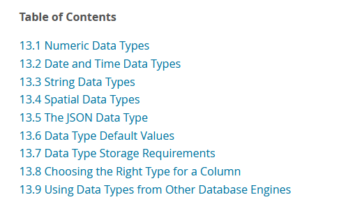

# Data Type

## overview

+ 数值 数位 对应关系

  + 表格

    + [table]

      |   数位    | 数值   |
      | -------: | ----: |
      | $2^{7}$  | $128 $  |
      | $2^{8}$  | $256 $  |
      | $2^{15}$ | $32,768 $  |
      | $2^{16}$ | $65,536 $  |
      | $2^{23}$ | $8,388,608 $  |
      | $2^{24}$ | $16,777,216 $  |
      | $2^{31}$ | $2,147,483,648 $  |
      | $2^{32}$ | $4,294,967,296 $  |
      | $2^{63}$ | $9,223,372,036,854,775,808 $  |
      | $2^{64}$ | $18,446,744,073,709,551,616 $  |

+ DBSC7 -- Database System Concept 7th Edition

  + 表格

    + [table]

      | DBSC7                  | Remark 1              | Remark 2 |
      | :--------------------- | :-------------------- | :------- |
      | char(n)                | character             | 定长字符串，会用空格填充来达到其最大长度，默认为1。 |
      | varchar(n)             | character varying     |          |
      | smallint               |                       |          |
      | int                    |                       |          |
      | numeric(p,d)           |                       |          |
      | real, double precision |                       |          |
      | float(n)               |                       | 精度至少为n位的浮点数 | 

  p -- 总位数(不含符号、小数点)
  d -- 小数位数

+ rucedu 人大-数据库概念

  + 表格

    + [table]

      | data type                       | notes  |
      | :------------------------------ | :----- |
      | CHAR(n), CHARACTER(n)           | 长度为 n 的定长字符串  |
      | VARCHAR(n), CHARACTERVARYING(n) | 最大长度为n的变长字符串 |
      | CLOB                            | 字符串大对象          |
      | BLOB                            | 二进制大对象          |
      | INT, INTEGER                    | 整数(4字节)，取值范围[$-2,147,483,648 \sim 2,147,483,647$] |
      | SMALLINT                        | 短整数(2字节)，取值范围[$-32,768 \sim 32,767$] |
      | BIGINT                          | 大整数(8字节)，取值范围[$-2^{63} \sim 2^{63} - 1$] |
      | NUMERIC(p,d)                    | 定点数，由p位数字(不包括符号、小数点)组成，小数点后面有d位数字 |
      | DECIMAL(p,d), DEC(p,d)          | 同NUMERIC，但数值精度不受p和d的限制 |
      | REAL                            | 取决于机器精度的单精度浮点数 |
      | DOUBLE PRECISION                | 取决于机器精度的双精度浮点数 |
      | FLOAT(n)                        | 可选精度的浮点数，精度至少为n位数字 |
      | BOOLEAN                         | 布尔值                         |
      | DATE                            | 日期，包含年、月、日，格式为 YYYY-MM-DD |
      | TIME                            | 时间，包含时、分、秒，格式为 HH:MM:SS |
      | TIMESTAMP                       | 时间戳类型 |
      | INTERVAL                        | 时间间隔类型 |

## Data Type in MySQL

### 概述

+ 简图
  + [diagram]  
      
    [MySQL 8.4 Documentation Chapter 13 Data Types](https://dev.mysql.com/doc/refman/8.4/en/data-types.html)

### 数值类型

#### 整数类型

+ 表格
  + [table]

    | Data Type | Range (signed)                             | Size 1   | Range (unsigned)         |
    | :-------- | :----------------------------------------: | :------- | :----------------------: |
    | tinyint   |                 -128 ~ 127                 | 1 Byte   | 0 ~                  255 |
    | smallint  |               -32768 ~ 32767               | 2 Bytes  | 0 ~                65535 |
    | mediumint |             -8388608 ~ 8388607             | 3 Bytes  | 0 ~             16777215 |
    | int       |          -2147483648 ~ 2147483647          | 4 Bytes  | 0 ~           4294967295 |
    | bigint    | -9223372036854775808 ~ 9223372036854775807 | 8 Bytes  | 0 ~ 18446744073709551615 |

#### 浮点类型

+ 表格
  + [table]

    | Data Type    | Comments                                | Size 1           | Size 2                    | Remark |
    | :----------- | :-------------------------------------: | :--------------- | :------------------------ | :----- |
    | float        | single precision float                  |          4 Bytes |                           | 用于近似激素       |
    | double       | double precision float                  |          8 Bytes |                           | 用于近似计算       |
    | decimal(m,d) | Fixed  precision float                  | max(m,d)+2 Bytes |                           | 最多65个数字；用于精确计算 |

    m, 表示总位数
    d, 表示小数位数

    decimal 总共65位

### 日期和时间类型

+ 表格
  + [table]

    | Data Type    | Format                | Size 1   | Size 2                                            |
    | :----------- | :-------------------- | :------- | :-----------------------------------------------: | 
    | year         | YYYYY                 | 1 Byte   |                    1901 ~ 2155                    |
    | time         | HH:MM:SS              | 3 Bytes  |              -838:59:59 ~ 838:59:59               |
    | date         | YYYY-MM-DD            | 3 Bytes  |              1000-01-01 ~ 9999-12-31              |
    | datetime     | YYYY-MM-DD HH:MM:SS   | 8 Bytes  |     1000-01-01 00:00:00 ~ 9999-12-31 23:59:59     |
    | timestamp    | YYYY-MM-DD HH:MM:SS   | 4 Bytes  | 1980-01-01 00:00:00 UTC ~ 2038-01-19 03:14:07 UTC |

+ datetime vs timestamp

  + 表格
    + [table]

      |          |  datatime | timestamp |
      | :------- | :-------- | :-------- |
      | 时间长度   | 1000-01-01 00:00:00 ~ 9999-12-31 23:59:59 | 1980-01-01 00:00:00 UTC ~ 2038-01-19 03:14:07 UTC |
      | 存储空间   | 8 Bytes   | 4 Bytes |
      | 时间内容   | 不做时区转换 | 写，有时会从当前时区转为UTC；读，从UTC转换为当前时区 |  
      | 高并发问题 |            | 默认操作系统时间，每次读写要调用tz_convert，须加锁。高并发，性能抖动  |

### 字符串类型

+ 表格

  + [table]

    | Data Type    | comments              | Size 1   | Size 2                                            |
    | :----------- | :-------------------- | :------- | :-----------------------------------------------: | 
    | char(m)      | 定长，补空格            |          | 0 ~        255                                    |
    | varchar(m)   | 不定长                 |          | 0 ~      65535                                    |
    | tinyblob     |                       |          | 0 ~        255                                    |
    | tinytext     |                       |          | 0 ~        255                                    |
    | blob         |                       |          | 0 ~      65535                                    |
    | text         |                       |          | 0 ~      65535                                    |
    | mediumblob   |                       |          | 0 ~   16777215                                    |
    | mediumtext   |                       |          | 0 ~   16777215                                    |
    | longblob     |                       |          | 0 ~ 4294967295                                    |
    | longtext     |                       |          | 0 ~ 4294967295                                    |

+ 示例

  + [table] 

    | Value | CHAR(4) | size  | VARCHAR(4) | size  |
    | :---- | :------ | :---- | :--------- | :---- |
    | $''$    | $'\ \ \ \ '$ | 4 B   | $''$ | 1 B   |
    | $'ab'$  | $'ab\ \ '$  | 4 B   | $'ab'$       | 3 B   |
    | $'abcd'$ | $'abcd'$ | 4 B   | $'abcd'$    | 5 B   |
    | $'abcdefg'$ | $'abcd'$ | 4 B | $'abcd'$   | 5 B   |

    + VARCHAR需要1B的空间存储字串长度

### 枚举 & 集合

#### ENUM

#### SET

### 空间数据

用于存储空间数据(地理信息、几何图形)，  
如: GEOMETRY, POINT, LINESTRING, POLYGON, MULTIPOINT, MULTILINESTRING, MULTIPOLYGON, GEOMETRYCOLLECTION

