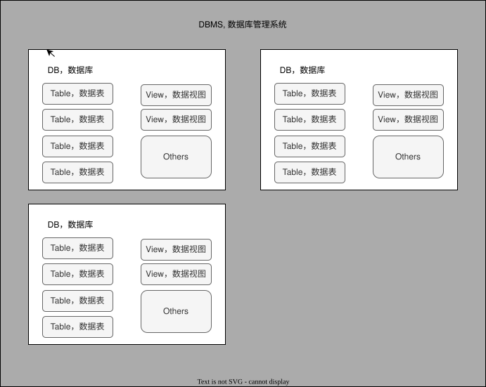
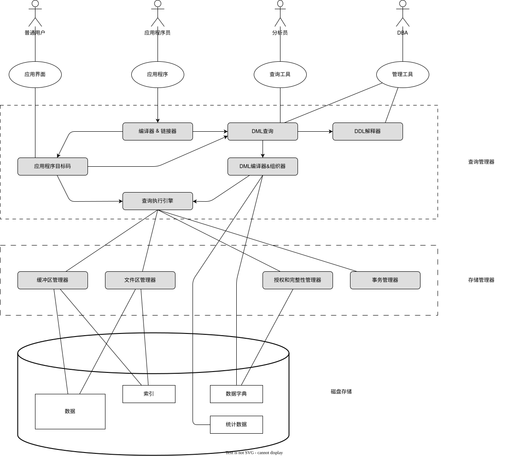
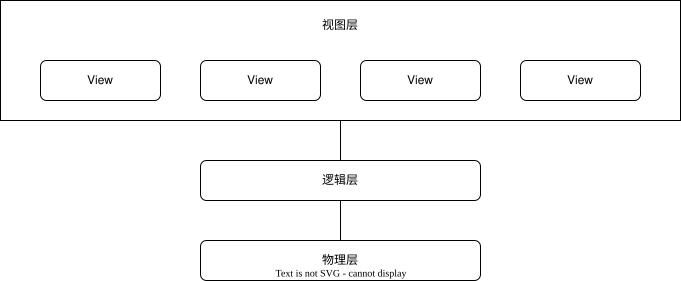
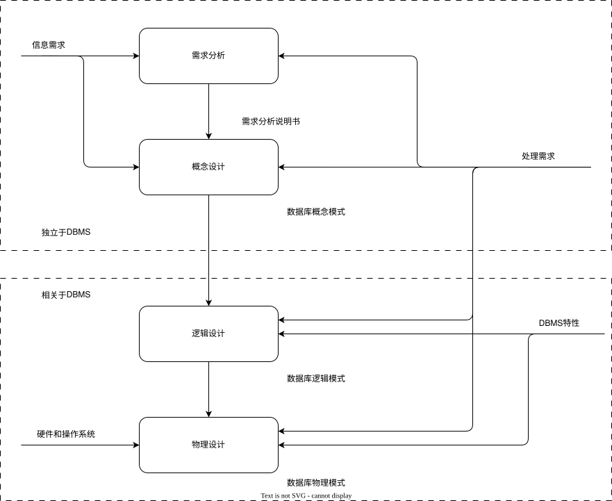
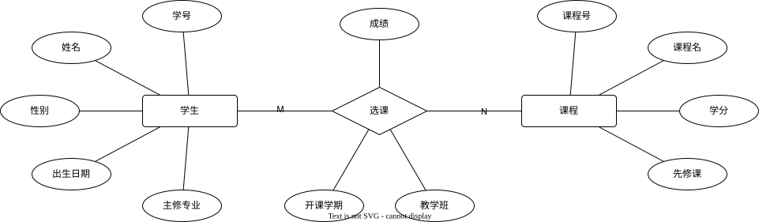
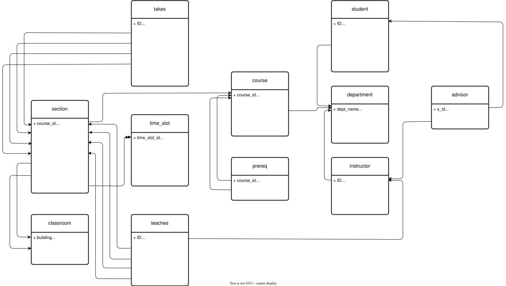
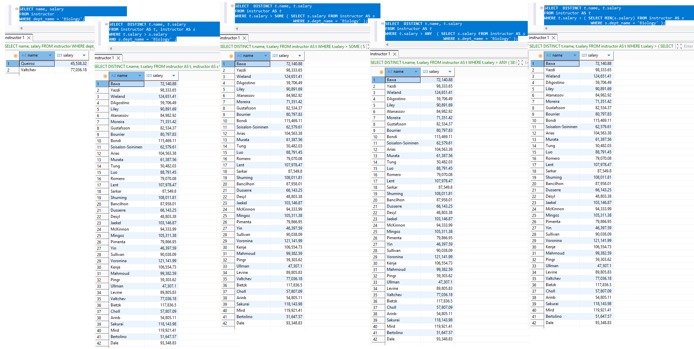
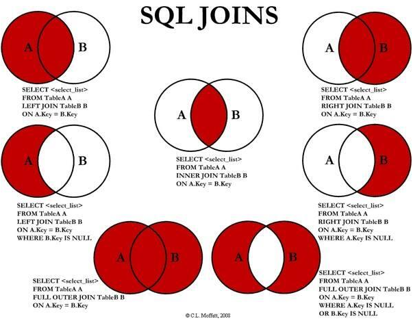
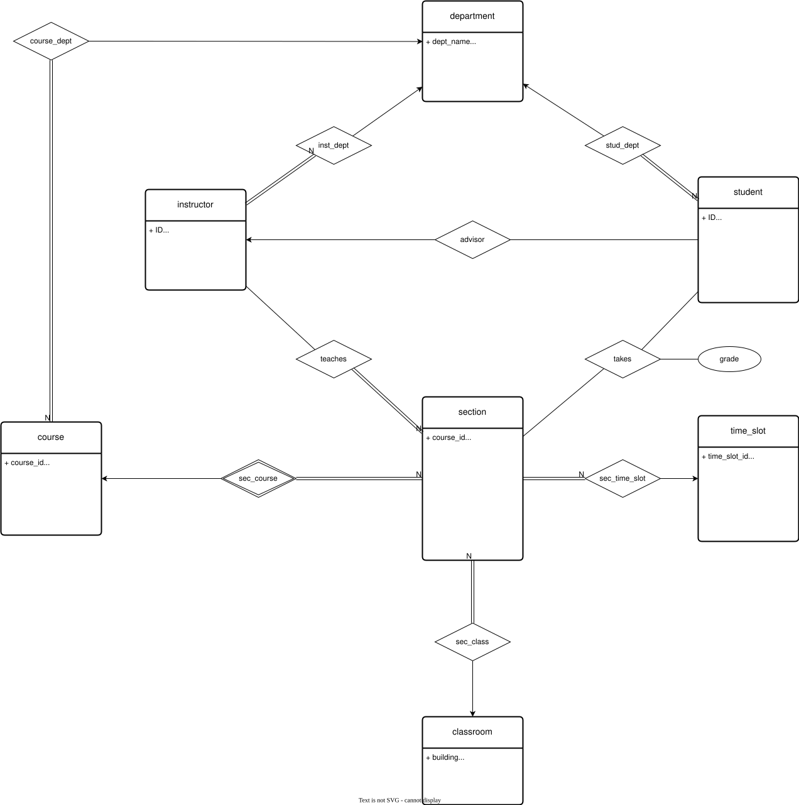

## 摘要

[Datbase基础摘要](./DB_Database-index.mm) (by App FreeMind)

## 简述

### 数据(Data)

+ 定义  
  对客观事物进行记录并可以鉴别的符号，是对客观事务的性质、状态以及相关关系等进行记者的的物理符号或这些物理符号的组合。

+ 说明
  + 数据是数据库中存储的基本对象
  + 描述事物的符号记录
  + 数据的种类
    数字、文本、图形、图像、音频、视频、etc
    可以数字化的信息
  + 数据的含义，即数据的语义。数据与语义不可分

  + 信息
    + 数据是信息的表现形式和载体
    + 信息是数据的内涵，加载于数据之上，对数据作具有含义的解释

### 数据库系统

#### OS

##### 运行内存管理

##### 数据存储管理

#### 数据库(Database,DB)

+ **长期存储**在计算机内的、**有组织的**、**可共享**的有关系的数据集合

+ 数据是数据库中存储的基本对象，是按一定顺序排列组合的物理符号

+ 数据库是一个存储数据的仓库，将数据按照特定规律存储在磁盘上。

+ 管理数据集合
  + 高价值数据集合
    + 可加工处理、抽取有用信息、转换为有价值的知识
  + 庞大的数据集合
  + 共享的数据集合

+ 解决非数据库系统的问题
  + 非数据库系统的问题
    + 数据冗余 和 不一致性 -- data redundancy and inconsistency
      + data redundancy, 多个数据副本
      + data inconsistency, 由于维护问题导致副本间数据差异
    + 数据访问困难 -- difficulty in accessing data
    + 数据孤立 -- data isolation
    + (不)完整性 和 (不)一致性 -- integrity & consistency constraint
    + 原子性 -- atomicity
    + 并发访问异常 -- concurrent-access anomaly
    + 安全性 -- security

+ 基本目标
  + 数据按一定的数据模型组织、描述、存储，即结构化
  + 小冗余
  + 高独立
  + 易扩展

+ 数据库类型

  + 关系数据库 / SQL

  + 非关系数据库 / NoSQL

  + etc

#### DBMS 数据管理系统

+ DBMS组成简示
  + [diagram]
    

+ 说明
  + [diagram]
    
  + 一个相互关联的数据的集合以及一组用以访问这些数据的程序组成
  + 主要目标是提供一种可以方便、高效的存取数据库信息的途径

+ 基础软件
  + 数据定义功能，即提供DDL的实现
  + 数据组织、存储、管理
    + 数据存储方式
      + 内存
      + 磁盘
    + 数据
      + 用户数据
      + 元数据
      + 数据字典
    + 操作
      + 读
      + 写
  + 数据操纵功能，即提供DML的实现
  + 事务管理
  + 建立和维护
  + 其他

#### Application

+ 管理程序

+ 联机事务处理 online transaction processing

+ 数据分析 data analytics
  + 预测模型 predictive model
  + 数据挖掘 data mining
  + ...

#### Administrator

+ 职责
  + 模式定义 -- schema definition
  + 存储结构和存取方法定义 -- storage structure and access-method definition
  + 模式及物理组织修改 -- schema and physical-organization modification
  + 数据访问授权 -- granting of authorization for data access
  + 日常维护 -- routine maintenance

#### User

+ 业务用户

+ 开发者

### 数据视图

#### 数据抽象

数据抽象, data abstraction
+ 图示
  + [diagram]  
    


+ 视图层 -- view layer
  + **外模式**
  + 给用户提供数据的抽象视图, 描述数据库的某个部分。
  + 数据库用户和数据库系统的接口
  + 一个数据库可有多个外模式。一个应用程序只使用一个外模式
  + 具有**逻辑独立性**

+ 逻辑层 -- logical layer
  + **模式**
  + 描述存储了什么样的数据，以及这些数据的关系。  
  + 具有**物理独立性**，(用户的应用程序与数据库中数据的物理存储是相互独立的。当数据的物理存储改变了，应用程序不用改变)。  

+ 物理层 -- physical layer
  + **内模式**
  + 数据是怎样存储的，详细描述复杂的底层数据结构。

+ 数据独立性
  + 逻辑独立性:
    + 应用程序不受数据库逻辑结构(如表格结构调整)改变的影响
    + 当数据库的概念模式发生变化时，通过外模式/模式映像保证应用程序不变
  + 物理独立性(physical data independence):
    + 应用程序不受数据库存储结构(如文件组织方式、索引技术)改变的影响。
    + 当数据库的内模式(存储模式)发生变化时，通过模式/内模式映像保证应用程序不变

#### 数据模型

数据模型, data model

##### 模型简述

+ 数据模型定义

  + 描述 **数据**、**数据关系**、**数据语义**及**一致性约束** 的 概念工具 的 集合
  + 对象世界数据特征的抽象，是现实世界的模拟

+ 数据模型要素
  + 数据结构
    + 描述数据库组成的对象与对象间的关系
    + 描述数据的内容
      + 相关性
        + 与对象的类型、内容、性质有关
        + 与对象间关系有关
    + 数据结构是对模型静态特性的描述

  + 数据操作
    + 数据操作，对模型动态特性的描述
  
    + 操作语言
  
  + 数据模型的完整性约束

    + 关系数据库
      + 实体完整性(主键)
      + 参照完整性(外键)

##### 现实世界

##### 概念模型

##### 逻辑模型

+ 逻辑模型要素 

  + 静态描述, 数据结构, DDL + DCL
  + 动态描述, 数据操作, DML + DQL
  + 规则描述, 完整性约束
    + 实体完整性, 主键
    + 参照完整性, 外键
  + 范式
    + 1NF
    + 2NF
    + 3NF
    + BCNF
    + 4NF
    + 5NF

+ 逻辑模型种类

  + 层次模型  
  + 网状模型  
  + 关系模型 relational model  
    + 模式图

    + 关系代数
      + 选择  
        + select / sigma $\sigma$  
          + 实际为 WHERE 语句决定

        + 代数表示
          + [demo]  
            $ \sigma_{(dept_name='Physics' \wedge salary > 9000)}  {(instructor)} $  
            由 (dept_name='Physics' ^ salary > 9000) 决定, `^ <==> and`  

        + SQL
          + [code]

            ```sql
            select * 
            from instructor 
            where dept_name = 'Physics'
              and salary > 9000;
            ```

      + 投影  
        + project / prod $\prod$  
          + 实际为 SELECT 语句决定

        + 代数表示
          + [demo]  
            $ \prod_{ID,name,salary}{(\sigma_{dept\_name='Physics' \wedge salary > 9000}{(instructor)})} $

        + SQL
          + [code]

            ```sql
            select ID, name, salary
            from instructor 
            where dept_name = 'Physics'
              and salary > 9000;
            ```

      + 笛卡尔积  
        + Cartesian-product

        + 代数表示
          + [demo]  
            $ \sigma_{instructor.ID = teachers.ID}{(instructor \times teachers)} $  

        + SQL
          + [code]

            ```sql
            select *
            from instructor, teaches
            where instructor.ID = teaches.ID;
            ```

      + 连接  
        + Join

        + 代数表示
          + [demo]  
            $ r \Join_\theta s =  \sigma_{\theta}{(r \times s)} $  

      + 集合
        + 合 union
          + 代数表示
            + [demo]  
              $ \prod_{course\_id}{(\sigma_{semester="Fall" \wedge year=2017}{(section)})} \cup \prod_{course\_id}{(\sigma_{semester="Spring" \wedge year=2018}{(section)})} $  

          + SQL
            + [code]

              ```sql
              select * from section where semester='Fall' and year=2017
              union all
              select * from section where semester='Spring' and year=2018;
              ```

        + 交 intersection
          + 代数表示
            + [demo]  
              $ \prod_{course\_id}{(\sigma_{semester="Fall" \wedge year=2017}{(section)})} \cap \prod_{course\_id}{(\sigma_{semester="Spring" \wedge year=2018}{(section)})} $  

          + SQL
            + [code]

              ```sql
              ```

        + 差 set-difference
          + 代数表示
            + [demo]  
              $ \prod_{course\_id}{(\sigma_{semester="Fall" \wedge year=2017}{(section)})} - \prod_{course\_id}{(\sigma_{semester="Spring" \wedge year=2018}{(section)})} $  

          + SQL
            + [code]

              ```sql
              ```

        + 赋值
          + 代数表示 <-

        + 更名
          + 代数表示
            + [demo]  
              $ \rho_{x(A_1,A_2,...,A_n}{(E)} $  
              以x命名的表达式E的结果

        + 聚集
        + 等价查询

  + 面向对象模型
  + 对象关系模型

##### 物理模型

+ 说明

  + 数据存储和读取

    + 数据库引擎

      + 查询处理器

        + DDL interpreter, DDL解释器

        + DML compiler, DML编译器

        + Query Evaluation Engine, 查询执行引擎

      + 存储管理器

        + 文件管理器

          + 数据文件

          + 元数据 & 数据字典

          + 索引

        + 缓冲区管理器

        + 权限和完整性管理器

      + 事务管理器

        + 恢复管理器

          + 原子性

          + 持久性

        + 并发控制管理器

          + 一致性

          + 隔离性

  + 面向计算机系统

    + 磁盘
    + ...
    + 操作系统

#### 数据建模

数据建模, data modeling

##### 建模简述

+ 说明
  + 把现实世界中的具体事物抽象、组织为某一DBMS(具体数据库产品，如OracleDB, MySql,etc)支持的数据模型
  + 步骤
    + 把现实世界中的客观对象抽象为概念模型，将**现实**世界抽象为**信息**世界
    + 将概念模型转换为某一DBMS支持的数据模型，将**信息**世界转为**机器**世界  
  + [diagram]  
      
    

##### 概念设计阶段

+ conceptual-design phrase

+ 概念模型/信息模型
  + 语义
  + 简单清晰

##### 逻辑设计阶段

+ logical-design phrase

+ 逻辑模型，展示结构
  + 层次模型 -- Hierarchical Model
  + 网状模型 -- Network Model
  + 关系模型 -- Relationship Model
  + 面向对象模型 -- Object Oriented Model
  + 对象关系模型 -- Object Relational Model

##### 物理设计阶段

+ physical-design phrase

+ 物理模型
  + 描述数据存储和读取的方式
  + 面向计算机系统(存储系统)

### 实例 vs 模式


======

#### 数据模型


+ 数据模型类型
  + 关系模型/关系数据模型 -- 
  + 实体-关系模型 -- entity-relationship model, ER
  + 半结构化数据模型 -- semi-structured data model
  + 基于对象数据模型 -- object-based data model


  + 建模方法(简述)

    + E-R图 -- Entity-Relationship Diagram，概念模型

      + 示例 of rucedu
        + [diagram]  
          

      + SQL语句

        + 示例 of rucedu

          + [operating]

          ```sql
          [edgar@ThinkPadT14P-23 Workspace]$ mysql -uadmin -pLiHaobo#1119
          mysql: [Warning] Using a password on the command line interface can be insecure.
          Welcome to the MySQL monitor.  Commands end with ; or \g.
          Your MySQL connection id is 10
          Server version: 8.4.9 MySQL Community Server - GPL
          
          Copyright (c) 2000, 2026, Oracle and/or its affiliates.
          
          Oracle is a registered trademark of Oracle Corporation and/or its
          affiliates. Other names may be trademarks of their respective
          owners.
          
          Type 'help;' or '\h' for help. Type '\c' to clear the current input statement.
          
          mysql> SELECt DATABASE();
          +------------+
          | DATABASE() |
          +------------+
          | NULL       |
          +------------+
          1 row in set (0.01 sec)
          
          mysql> CREATE DATABASE rucedu;
          Query OK, 1 row affected (0.03 sec)
          
          mysql> USE rucedu
          Database changed
          mysql>
          ```

          + [code]

          ```sql
          DROP TABLE IF EXISTS t_student;
          CREATE TABLE t_student (
            sno CHAR(14) PRIMARY KEY,
            sname VARCHAR(30) NOT NULL,
            gender CHAR(1),
            date_of_birth DATE,
            major_courses CHAR(10)
          );
          
          DROP TABLE IF EXISTS t_course;
          CREATE TABLE t_course (
            cno CHAR(10) PRIMARY KEY,
            cname VARCHAR(90),
            ccredit TINYINT,
            cpre_cno INT
          );
          
          DROP TABLE IF EXISTS t_take;
          CREATE TABLE t_take (
            sno CHAR(14),
            cno CHAR(10),
            grade TINYINT,
            semester CHAR(5),
            teching_class VARCHAR(20)
          );
          ```


#### instance & schema

+ instance 实例
  + 特定时刻存储在数据库中的信息的集合。  
  + 给定时刻数据库中数据的一个快照。  

+ schema 模式, 数据库的总体设计
  + 物理模式 -- physical schema
  + 逻辑模式 -- logical schema
    + Schema 是一个命名空间，包含一组数据库对象（如表、视图、索引、序列、函数等），用于逻辑分组和隔离。不同 Schema 可以包含同名对象，避免命名冲突。
  + Schema 与 Database 的关系‌

    + Database‌ 是最高层级的‌物理/逻辑容器‌，具有独立的存储、用户权限、配置（如字符集、排序规则）等。
    + Schema‌ 是 Database 内部的‌逻辑组织单元‌，一个 Database 可包含多个 Schema。  

    + 数据库产品差异

      + [table]

        | Database Product | Schema & Database | Notes  |
        | :--------------- | :---------------- | :----- |
        | PostgreSQL       | Schema 是 Database 的子集 | 一个 Database 可有多个 Schema；默认有 public Schema；跨 Schema 查询需指定 schema.table |
        | MySql            | Schema ≈ Database       | 在 MySQL 中，SCHEMA 和 DATABASE 是同义词，可互换使用；CREATE SCHEMA mydb 等同于 CREATE DATABASE mydb。`SHOW DATABASES;`可见"information_schema"和”performance_schema" |
        | Oracle           | Schema ≈ 用户      | 每个用户拥有一个同名 Schema；Schema 是用户拥有的所有对象的集合；创建用户即隐式创建 Schema |
        | SQL Server‌       | Schema 是 Database 的子集 | Schema 独立于用户，可由多个用户共享；需显式创建（CREATE SCHEMA）‌|

### 数据库语言

#### DDL

DDL -- 数据库定义语言, data-definition language ==> data storage and definition

+ 域约束 -- domain constraint, 如 字段数据类型 等
+ 引用完整性 -- referential integrity, 如 外键 
+ 授权 -- authorization
  + 读权限 -- read authorization
  + 插入权限 -- insert authorization
  + 更新权限 -- update authorization
  + 删除权限 -- delete authorization
+ 数据字段 -- data dictionary
+ 元数据 --  metadata

#### DML

DML -- 数据库操纵语言, data-manipulation language

+ 访问类型(操纵类型)
  + **增**, 向数据库中插入新的*信息*
  + **删**, 从数据库中删除*信息*
  + **改**, 修改数据库中存储的*信息*
  + **查**, 对存储在数据库中的*信息*进行检索

+ 语言类型
  + 过程化DML, procedural DML
  + 声明式DML, declarative DML
  + 关系查询语言, query Language, DQL

### 数据库体系结构

+ 数据库引擎

  + 存储管理器 storage manager
    + 相关数据结构
      + 数据文件
      + 数据字典
      + 索引

    + 组成
      + 权限与完整性管理器
      + 事务管理器
      + 文件管理器
      + 缓冲区管理器

  + 查询处理器

    + 组成
      + DDL解释器, DDL interpreter
      + DML编译器, DML compiler
      + 查询执行引擎, query evaluation engine


+ 数据库应用系统 -- DBS / DBAS(Database Application System)

  + 两层结构 Client-Database

  + 三层结构 Client-AppServer-Database

+ DBA(Database Administrator)讨论
  
  
  
  
  
  

### 关系数据库讨论

#### 关系数据库的一些概念

+ 数据表 / 关系, Database Table / Relation, 数据的矩阵
  + **关系** R(D1, D2, ..., Dn)
  + 表头, header, 列的名称

  + 行 / **元组**, row / **tuple**, 一组相关的数据

    + 元组 t
    + **分量** -- **Component**, 元组在属性上的取值
    + 一元关系(Unary relation) & 二元关系(Binary relation)

  + 列 / **属性**, col / **attribute**

    + {数据类型, 约束} / 域(domain)

      + **基数** -- **Cardinal Number**，属性取值的个数，针对笛卡尔积

    + 列, column, 包含相同类型(非特指物理类型/数据类型，也包含其逻辑类型/属性)的数据
    + 属性的个数 n, 关系的 **目** 或 **度**

+ 记录集 / 关系实例 / 元组集, record-set / relation instance / tuple-set, 一组特定的数据行

+ 关系定义示例

  + 示例 of dbsc7

    + [code]

      ```python
      student(ID, name, dept_name, tot_cred)
      ```

    + [code]

      ```sql
      create table if not exists student
          (ID             varchar(5), 
           name           varchar(20) not null, 
           dept_name      varchar(20), 
           tot_cred       numeric(3,0) check (tot_cred >= 0),
           primary key (ID),
           foreign key (dept_name) references department (dept_name)
              on delete set null
          );
      ```

  + 示例 of rucedu

    + [code]

      ```python
      t_student(sno, sname, gender, date_of_birth, major_courses)
      ```

    + [code]

      ```sql
      CREATE TABLE t_student (
        sno CHAR(14) PRIMARY KEY,
        sname VARCHAR(30) NOT NULL,
        gender CHAR(1),
        date_of_birth DATE,
        major_courses CHAR(10)
      );
      ```

+ 码，足以区分实体(记录)的属性或属性集/组。
  + 规则:  
    + 一个元组的所有属性值必须能够唯一标识元组
    + 一个关系中不能有两个/多个元组在所有属性上取值完全相同

  + 超码 superkey
    一个或多个属性，将这些属性组合在一起可以在一个关系(表)中唯一标识一个元组(行)。

  + 候选码 candidate key
    + 最小的超码  
    + 候选码的诸属性称为主属性，不包含在任何候选码中的属性称为非主属性

  + 全码 All-Key
    + 所有属性为候选码

  + 主码 primary key / 主码约束 primary key constraint  
    数据库设计者选出的候选码  

  + 外码 foreign key / 外码约束 foreign key constraint / 被引用关系 referenced relation  
    + 说明
      在数据库实例中，(关系)r1 中的每个 元组 对 (属性)A 的取值也必须是 r2 中某个 元组 对 B 的取值。  
      r1.A 必须取自 r2.B
      A属性集 被称为 从r1引用r2的外码(foreign key)
      引用关系 referenced relation, r1关系 称 外码约束的引用关系
      被引用关系 referenced relation, r2关系 称 外码约束的被应用关系
    + 引用完整性约束 referential integrity constraint

+ 基本关系的性质
  + 列是同质的(Homogeneous)
  + 不同的列可出自同一个域
  + 列的排列是无序的
  + 任意的两个元组的候选码不相同
  + 行的排列时无序的
  + 分量必须取原子值

+ 模式图 schema diagram
  + 说明
    + 元组的结构
      + 属性
      + 域

    + 关系由元组语义确定

    + 完整性约束
      + 两不变性
        + 实体完整性 -- Entity Integrity,
          + 若属性A是基本关系R的主属性，则属性A不能为空，也不相同/相等
          + 针对基本关系而言，
          + 实体可区分，唯一性。一般以主码作为唯一性标识
          + 主属性非空

        + 参照完整性
          + 实体间，存在属性间的引用
          + 外码
            A关系的非主属性D，依赖于B关系的主码

            + A 参照关系
            + A.D 外键
            + B 被参照关系/目标关系

      + 用户定义完整性

  + 定义方式 (**注意**：关系定义 vs 关系模式定义) `R(U, D, DOM, F)`

    + R, 关系名
    + U, 关系的属性**名**集合
    + D, 关系的属性**域**
    + DOM, 属性向域的映射集合
    + F, 属性间的数据依赖~~关系~~集合

  + 关系 vs. 关系模式
    + 关系，动态随时变化，具有具体内容和状态
    + 关系模式, 静态，描述性的

  + 模式图示例 of dbsc7
    + [diagram]  
      

+ Query Language -- 关系查询语言
  + 命令式查询语言 imperative query language
  + 函数式查询语言 functional query language
  + 声明式查询语言 declarative query language

#### 关系代数 relational-algebra


#### 关系演算

用谓词表达查询要求

+ 元组关系
  + ALPHA
  + QUEL

+ 域关系
  + QBF

### SQL

#### SQL数据类型

+ 数据类型表

  + [table]

    | type    | SQL              | MySQL | OracleDB | Notes |
    | :------ | :--------------- | :---- | :------- | :---- |
    |         | char(n)          |       |          |       |
    |         | varchar(n)       |       |          |       |
    |         | smallint         |       |          |       |
    |         | int              |       |          |       |
    |         | numeric(p,d)     |       |          |       |
    |         | real             |       |          |       |
    |         | double precision |       |          |       |
    |         | float(n)         |       |          |       |
    |         | date             |       |          |       |
    |         | time             |       |          |       |
    |         | timestamp        |       |          |       |
    |         | clob             |       |          |       |
    |         | blob             |       |          |       |

  + null

#### SQL之DDL

##### 功能

+ 定义关系的集合，即 database
+ 定义关系模式，即 table
  + 各关系的模式
  + 每个属性的取值范围
  + 完整性约束
  + 每个关系维护的索引集合
  + 每个关系的安全性和权限集合
  + 每个关系在磁盘上的物理存储结构

##### CREATE

+ primary key

+ foreign key references

##### DROP

##### ALTER

#### SQL之DCL (DDL)

##### GRANT

##### REVOKE

##### COMMIT

##### ROLLBACK

#### SQL之DQL (DML)

##### SELECT

+ 单关系查询

+ 多关系查询

+ 查询顺序

  + from --> Where --> select

  + 代码表示

    + [code]

      ```sql
      select A1, A2, ..., An
      from r1, r2, ..., rm
      where p;
      ```

      ```python
      for each 元组t1 in 关系r1
          for each 元组t2 in 关系r2
              ...
                  for each 元组tm in 关系rm
                      ...
                      把t1, t2, ..., tm连接成单个元组t
                      把t加入结果关系中
      ```

+ 附加运算
  + as -- 更名运算, 别名
  + 函数、谓词
  + 字符串
  + 其他

  + 示例 of dbsc7

    + [code]

      ```sql
      SELECT name, salary
      FROM instructor 
      WHERE dept_name = 'Biology';
      
      SELECT  DISTINCT t.name, t.salary
      FROM instructor AS t, instructor AS s
      WHERE t.salary > s.salary
      AND s.dept_name = 'Biology' ;
      
      SELECT  DISTINCT t.name, t.salary
      FROM instructor AS t
      WHERE t.salary > SOME ( SELECT s.salary FROM instructor AS s
                               WHERE s.dept_name = 'Biology' );
      
      SELECT  DISTINCT t.name, t.salary
      FROM instructor AS t
      WHERE t.salary > ANY  ( SELECT s.salary FROM instructor AS s
                               WHERE s.dept_name = 'Biology' );
      
      SELECT  DISTINCT t.name, t.salary
      FROM instructor AS t
      WHERE t.salary > ( SELECT MIN(s.salary) FROM instructor AS s
                          WHERE s.dept_name = 'Biology' );
      ```

    + [diagram]
      

+ 集合运算

  + 并集运算
    + union
    + union all
  + 交集运算
    + intersect
    + intersect all
  + 差集运算
    + except
    + except all

+ 聚集函数

  + 基本聚集
  + 分组聚集
  + having

  + 窗口函数

  + 换砖

  + 上卷

  + 立方体

+ 嵌套查询

+ 其他

  + unique，重复元组测试 (MySQL无此谓词/函数)

  + 标量子查询
    SQL允许子查询出现在返回单个值的表达式能够出现的任何地方

    + 示例

      + [operating]

        ```sql
        mysql> SELECT dept_name,
            ->        ( SELECT COUNT(*) FROM instructor WHERE department.dept_name = instructor.dept_name ) AS num_instructors
            -> FROM department;
        +-------------+-----------------+
        | dept_name   | num_instructors |
        +-------------+-----------------+
        | Accounting  |               4 |
        | Astronomy   |               1 |
        | Athletics   |               5 |
        | Biology     |               2 |
        | Civil Eng.  |               0 |
        | Comp. Sci.  |               2 |
        | Cybernetics |               4 |
        | Elec. Eng.  |               4 |
        | English     |               4 |
        | Finance     |               1 |
        | Geology     |               1 |
        | History     |               0 |
        | Languages   |               3 |
        | Marketing   |               4 |
        | Math        |               0 |
        | Mech. Eng.  |               2 |
        | Physics     |               2 |
        | Pol. Sci.   |               3 |
        | Psychology  |               2 |
        | Statistics  |               6 |
        +-------------+-----------------+
        20 rows in set (0.00 sec)
        
        mysql>
        ```

        `( SELECT COUNT(*) FROM instructor WHERE department.dept_name = instructor.dept_name ) AS num_instructors` 即为标量查询

#### SQL之DML

##### INSERT

##### DELETE

+ 普遍删除

+ 级联删除

##### TRUNCATE

##### UPDATE

#### 连接表达式

+ 图示
  + [diagram]
    


  + cross join, 无条件连接

  + natural join, 有特殊含义的条件连接(  `USING ` )

  + Join <==> Inner Join
    + 示例
      + [code]

        ```sql
        select *
        from instructor join teaches
        on instructor.ID = teaches.ID;
        ```

  + Outer Join
    + Left Join <==> Left Outer Join
      + `SELECT 字段列表 FROM 表1 LEFT [OUTER] JOIN 表2 ON 条件`
      + 查询 表1(左表) 的所有数据，以及包含 表1 和 表2 交集部分的数据
    + Right Join <==> Right Outer Join
      + `SELECT 字段列表 FROM 表1 RIGHT [OUTER] JOIN 表2 ON 条件`
      + 查询 表1(右表) 的所有数据，以及包含 表1 和 表2 交集部分的数据
    + Full Join

      + MySql不支持

+ 连接条件 on

+ 连接条件 using

#### 视图 view

##### 物化视图

+ 物化视图(materialized view)定义

+ 物化视图维护 materialized view maintenance

#### 事务 transaction

##### commit work

##### rollback work

#### 完整性约束 integrity constraint

+ 完整性约束类型

  + 单关系约束
    + not null
  + 唯一性约束 unique
  + check谓词
  + 引用完整性 外码

#### 大对象类型

#### 自定义类型

+ distinct type

+ structured data type

#### 生成唯一码

#### 索引

+ 索引是冗余的数据结构

#### 用户、角色、授权

#### 函数

+ 单行函数 / 标量函数

+ 聚集函数 / 聚合函数 / 分组函数 / 统计函数

  + "sum()", 加总
  + "avg()", 均值
  + "max()", 最大值
  + "min()", 最小值
  + "count()", 计数

  + group by
    + 说明
      + 对查询结果集进行分组

  + having
    + 说明
      + 用来对分组之后的数据进行过滤的子句


+ 窗口函数

  + ROW_NUMBER
  + RANK, 排名
  + DENSE_RANK
  + FIRST_VALUE, 返回每个窗口的首个值
  + NTH_VALUE, 返回每个窗口的第n个值
  + LEAD, 返回每个窗口的下一行
  + LAG, 返回每个窗口的下一行
  + AVG
  + PERCENT_RANK
  + CUME_DIST
  + NTILE, 
  + PERCENTILE_CONT
  + PERCENTILE_DISC

+ 旋转 pivot
+ 上卷 rollup
+ 立方体 cube

#### 存储过程

#### 触发器

#### 递归查询

+ 非递归的基查询

+ 传递闭包

+ 递归受限形式


## 数据库设计

### 数据建模(见前)

### 设计选择

+ 冗余问题

+ 不完整

### E-R图

+ 实体集
  + 实体
    + 客观存在且相互区别的事物。
  + 实体集
    + 相同属性的实体的集合
  + 弱实体集，标识性实体集

+ 联系集
  + 联系 / 关系
    不同实体间的联系

+ 属性
  + 对实体的描述
  + 简单属性 & 复杂属性
  + 单值 & 多值
  + 派生属性

+ 域

+ 映射基数

  + 一对一, one-to-one
    实体集A中的每个实体，实体集B中最多有一个实体与其对应
  + 一对多, one-to-many
    实体集A中的每个实体，实体集B中可以有n(N >= 0)个实体与其对应
  + 多对一, many-to-one
  + 多对多, many-to-many

+ 示例 of dbsc7
  + [diagram] 1
    

  + [diagram] 2
    

+ E-R图 ==> 关系模式

+ E-R扩展
  + 特化
  + 概化
  + 属性继承
  + 特化上的约束
  + 聚集

+ 实体关系设计问题

### 范式

#### Normal form - 范式

+ 示意图
  + [diagram]
    

#### 1NF - 第一范式

+ 定义: 所有域都是原子性的，即数据库表的每一列都是不可分割的原子数据项
+ 示例
  + 错误
    + [Table]

      | reader_id | name | Dept_id | Book | Borrowing_Date | Return_date |
      | :-------- | :---- | :---- | :---- | :------------: | :---------: |
      | 001       | Bob   | 100   | 101 DB Conceptions | 2021/08/20 |  |
      | 002       | Auth  | 200   | 102 C++ Programming | 2021/08/21 |  |

    + 说明
      Book字段可以拆分为 Book_ID 和 Book_Name
  + 纠正
    + [Table]

      | reader_id | name | Dept_id | Book_ID | Book_Name | Borrowing_Date | Return_date |
      | :-------- | :---- | :---- | :---- | :---- | :------------: | :---------: |
      | 001       | Bob   | 100   | 101 | DB Conceptions | 2021/08/20 |  |
      | 002       | Auth  | 200   | 102 | C++ Programming | 2021/08/21 |  |

#### 2NF - 第二范式

+ 定义: 在1NF的基础上，非码属性必须完全依赖于候选码（在1NF基础上消除非主属性对主码的部分函依赖）
+ 要求: 数据库表中的每个实例或记录必须可以被唯一地区分。选取一个能区分每个实体的**属性**或*属性组**，作为实体的唯一标识
+ 示例
  + 错误
  + 纠正
+ Problems
  + 数据冗余
  + 操作(更新、插入、删除)异常

#### 3NF - 第三范式

+ 定义: 在2NF基础上，任何非主属性不依赖于其它非主属性（在2NF基础上消除传递依赖）
+ 要求: 一个关系中不包含已在其它关系已包含的非主关键字信息。
+ 示例
  + 错误
  + 纠正

#### BCNF

Boyce-Codd Normal Form -- 巴斯-科德范式 / 修正第三方式

+ 定义: 在3NF基础上，任何主属性不能对主键子集依赖（在3NF基础上消除主属性对主码子集的依赖）
+ 说明: 任何决定因素都是超键
+ BCNF 和 保持依赖
+ 函数依赖
  + 依赖集闭包 / 逻辑蕴涵
    + 公理 (阿姆斯特朗公理)
      + 自反律 reflexivity rule
      + 增补律 augmentation rule
      + 传递律 transitivity rule
      + 合并律 union rule
      + 分解律 decomposition
      + 伪传递律 pseudo transitivity rule

  + 属性集闭包
  + 正则覆盖
  + 保持依赖
  + 分解算法

+ 多值依赖
+ 示例
  + 错误
  + 纠正

#### 4NF - 第四范式

+ 定义
+ 示例
  + 错误
  + 纠正

#### 5NF - 第五范式

+ 定义
+ 示例
  + 错误
  + 纠正

## 数据库存储管理

### 物理存储结构

### 数据存储结构

#### 文件组织

#### 缓冲区

### 数据库索引

## 大数据

