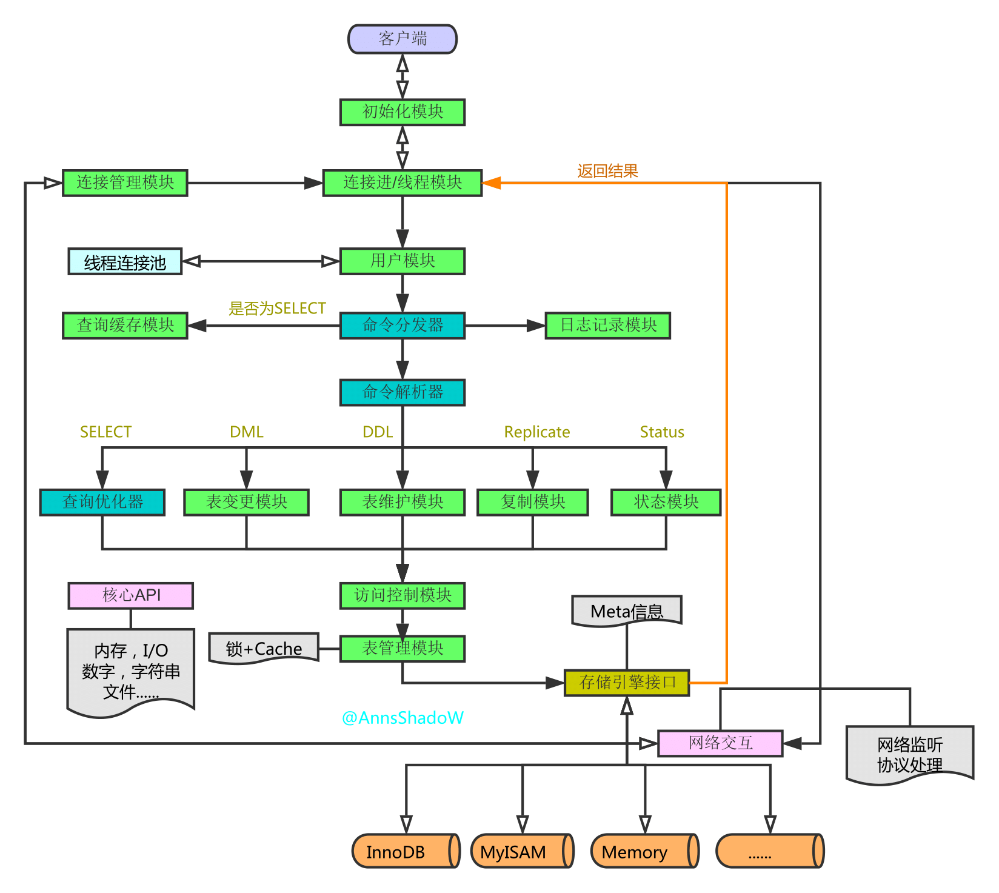
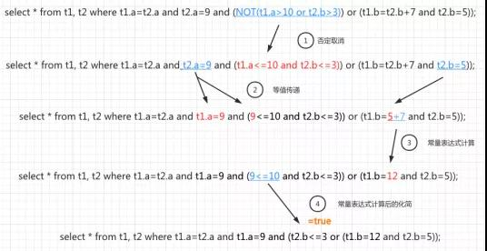

# 数据库基础

## 概述

+ 定义

  + 信息
    + 数据是信息的表现形式和载体
    + 信息是数据的内涵，加载于数据之上，对数据作具有含义的解释

  + 数据库
    + 长期存储在计算机内的、有组织的、可共享的数据集合
    + 数据是数据库中存储的基本对象，是按一定舒徐排列组合的物理符号
    + 数据库是一个存储数据的仓库，将数据按照特定规律存储在磁盘上。

  + 数据库管理系统
    + 一个相互关联的数据的集合以及一组用以访问这些数据的程序组成
    + 主要目标是提供一种可以方便、高效的存取数据库信息的途径


+ 目的


## 概念

### 数据库语言

+ 数据库定义语言 -- data-definition language, DDL
  + 数据存储和定义 -- data storage and definition
    + 域约束 -- domain constraint, 如 字段数据类型 等
    + 引用完整性 -- referential integrity  
    + 授权 -- authorization
      + 读权限 -- read authorization
      + 插入权限 -- insert authorization
      + 更新权限 -- update authorization
      + 删除权限 -- delete authorization
      + 数据字段 和 元数据 -- data dictionary & metadata

+ 数据库操纵语言 -- data-manipulation language, DML
  + 过程化DML -- procedural DML
  + 声明式DML -- declarative DML
  + 关系查询语言 -- query language
    + 命令式查询语言 imperative query language
    + 函数式查询语言 functional query language
      + 关系代数 relational-algebra
        + 选择 select
          + 代数表示
            + [diagram]
              
          + SQL
            + [code]

              ```sql
              select * 
              from instructor 
              where dept_name = 'Physics'
                and salary > 9000;
              ```

        + 投影 project
          + 代数表示
            + [diagram]
              
          + SQL
            + [code]

              ```sql
              select ID, name, salary
              from instructor 
              where dept_name = 'Physics'
                and salary > 9000;
              ```

        + 笛卡尔积 Cartesian-product
          + 代数表示
            + [diagram]
              
          + SQL
            + [code]

              ```sql
              select *
              from instructor, teaches
              where instructor.ID = teaches.ID;
              ```

        + 连接 Join
          + 代数表示
            + [diagram]
              

          + 图示

            + [diagram]
              

          + Join <==> Inner Join

            + 示例
              + [code]

                ```sql
                select *
                from instructor join teaches
                on instructor.ID = teaches.ID;
                ```

          + Outer Join

            + Left Join <==> Left Outer Join
              + `SELECT 字段列表 FROM 表1 LEFT [OUTER] JOIN 表2 ON 条件`
              + 查询 表1(左表) 的所有数据，以及包含 表1 和 表2 交集部分的数据

            + Right Join <==> Right Outer Join
              + `SELECT 字段列表 FROM 表1 RIGHT [OUTER] JOIN 表2 ON 条件`
              + 查询 表1(右表) 的所有数据，以及包含 表1 和 表2 交集部分的数据

            + Full Join

        + 集合
          + 合 union
            + 代数表示
              + [diagram]
                + 
            + SQL

              + [code]

                ```sql
                select * from section where semester='Fall' and year=2017
                union all
                select * from section where semester='Spring' and year=2018;
                ```

          + 交 intersection
            + 代数表示
              + [diagram]
                + 
            + SQL
              + [code]

                ```sql
                ```

          + 差 set-difference
            + 代数表示
              + [diagram]
                + 
            + SQL
              + [code]

                ```sql
                ```

        + 赋值
          + 代数表示 <-
        + 更名
          + 代数表示
            + [diagram]
              + 
              + 以x命名的表达式E的结果
        + 聚集
        + 等价查询

    + 声明式查询语言 declarative query language


+ 其他分类方法

  + DDL
    + 定义/修改/删除 数据库对象{数据库, 数据表, 列}
    + 包含
      + `CREATE`
      + `DROP`
      + `ALTER`

  + DQL -- Data Query Language
    + `SELECT`
    + ...

### 实例(database instance) 和 模式(database schema)

+ 数据库模式， 数据库的逻辑设计
  + 模式图 schema diagram
  + Schema 是一个命名空间，包含一组数据库对象（如表、视图、索引、序列、函数等），用于逻辑分组和隔离。不同 Schema 可以包含同名对象，避免命名冲突。
  + Schema 与 Database 的关系‌

    + Database‌ 是最高层级的‌物理/逻辑容器‌，具有独立的存储、用户权限、配置（如字符集、排序规则）等。
    + Schema‌ 是 Database 内部的‌逻辑组织单元‌，一个 Database 可包含多个 Schema。  
    + **?** 二者关系类似于“公司（Database）→ 部门（Schema）”。
    + 数据库产品差异

      + [table]

        | Database Product | Schema & Database | Notes  |
        | :--------------- | :---------------- | :----- |
        | PostgreSQL       | Schema 是 Database 的子集 | 一个 Database 可有多个 Schema；默认有 public Schema；跨 Schema 查询需指定 schema.table |
        | MySql            | Schema ≈ Database  | 在 MySQL 中，SCHEMA 和 DATABASE 是同义词，可互换使用；CREATE SCHEMA mydb 等同于 CREATE DATABASE mydb。`SHOW DATABASES;`可见"information_schema"和”performance_schema" |
        |                  | Schema ≈ DataTable    | 在 MySQL 中，SCHEMA 和 Table 是同义词，可互换使用；CREATE SCHEMA mytable 等同于 CREATE TABLE mytable。 参考 DBSC7 |
        | Oracle           | Schema ≈ 用户      | 每个用户拥有一个同名 Schema；Schema 是用户拥有的所有对象的集合；创建用户即隐式创建 Schema |
        | SQL Server‌       | Schema 是 Database 的子集 | Schema 独立于用户，可由多个用户共享；需显式创建（CREATE SCHEMA）‌|

+ 数据库实例， 给定时刻数据库中数据的一个快照

### 关系数据库

#### 定义 & 概念

+ Database -- 关联表(database tables)的集合
+ Data, 对客观事物进行描述并可以鉴别的符号(抽象)。
+ RDBMS (Relational Database Management System), 关系数据库管理系统
  + 图示

    + [diagram]
      
  
+ DBAS (Database Application System) 数据库应用程序/系统
+ DBA (Database Administrator) 数据库管理员
  + 职责
    + 模式定义 -- schema definition
    + 存储结构和存取方法定义 -- storage structure and access-method definition
    + 模式及物理组织修改 -- schema and physical-organization modification
    + 数据访问授权 -- granting of authorization for data access
    + 日常维护 -- routine maintenance

+ 数据表, Database Table, 数据的矩阵

  + 表头, header, 列的名称

  + 行 / 元组, row, 一组相关的数据

  + 列, column, 包含相同类型(非特指物理类型/数据类型，也包含其逻辑类型/属性)的数据

+ 冗余, redundancy, 存储多倍数据， 冗余降低了_性能_，但提高了_安全性_
  
+ SQL -- Structured Query Language
  + DDL, Data-Definition Language 数据定义语言
    + 每个关系/表的模式
    + 每个属性/列的取值类型
    + 完整性约束
    + 为每个关系维护的索引集合
    + 每个关系的安全性和权限信息
    + 每个关系在磁盘上的物理存储结构

  + DML, Data-Manipulation Language 数据操纵语言
  + integrity, 完整性
  + view definition, 视图定义
  + transaction control, 事务控制
  + embedded SQL & dynamic SQL, 嵌入式SQL 和 动态SQL
  + authorization, 授权

#### 数据库范式

#### 数据库引擎

# MySql

## MySql Server 结构

+ 图示
  + [diagram]
    
  + [diagram]
    

+ 执行流程

  + 示例 1

    + 说明
      + 客户端

      + MySQL服务端网络模型: [reactor]() (非阻塞IO + 多路复用) + 线程池
        + TCP/IP 连接请求， 三次握手，建立稳定连接
        + 每个客户端在线程池中，都有一个线程为之服务
        + 多路复用技术使用的是 [select]() (vs. epoll)

    + [diagram]
      

+ 连接层/连接器
  + 说明
    + 当客户端登录MySQL时，对身份认证和权限判断 (mysql.user & mysql.db)
  + 查询连接状态
    + 状态
      + Daemon, 守护进程/线程
      + Locked, 线程正在等待表锁的释放
      + Query, 正在查询，连接线程正在执行查询
      + Sending Data, 向请前端返回数据
      + Sleep, 空闲状态，正在等待客户端发数据
      + Sorting Result, 线程正在对结果进行排序

    + [operating]

      ```sql
      mysql> SHOW PROCESSLIST;
      +----+-----------------+-----------------+-------+---------+-------+------------------------+------------------+
      | Id | User            | Host            | db    | Command | Time  | State                  | Info             |
      +----+-----------------+-----------------+-------+---------+-------+------------------------+------------------+
      |  5 | event_scheduler | localhost       | NULL  | Daemon  | 31985 | Waiting on empty queue | NULL             |
      | 11 | root            | localhost       | mysql | Query   |     0 | init                   | SHOW PROCESSLIST |
      | 14 | root            | localhost:55864 | dbsc7 | Sleep   | 12762 |                        | NULL             |
      | 15 | root            | localhost:55870 | dbsc7 | Sleep   | 10453 |                        | NULL             |
      | 16 | root            | localhost:39098 | douma | Sleep   | 10226 |                        | NULL             |
      +----+-----------------+-----------------+-------+---------+-------+------------------------+------------------+
      5 rows in set, 1 warning (0.00 sec)
      
      mysql> SHOW STATUS like 'Threads%';
      +-------------------+-------+
      | Variable_name     | Value |
      +-------------------+-------+
      | Threads_cached    | 0     |
      | Threads_connected | 4     |
      | Threads_created   | 4     |
      | Threads_running   | 2     |
      +-------------------+-------+
      4 rows in set (0.00 sec)

      mysql>
      ```

    + 长连接 & 短链接
      + 长连接, 客户端连接成功后，一直使用同一个连接
        + 内存资源消耗过多
        + 定期断开长连接，需要时再次创建
        + 执行 mysql_reset_connection，释放内存，但保留连接。(MySQL5.7+)
      + 短链接, 每次执行完成SQL请求后断开连接；新请求则建立新连接。
        + 短连接会重复创建资源请求、释放，消耗资源(CPU+MEM & Time)过多

+ Server层
  + ~~缓存~~
    + 执行查询语句时，先查询缓存
      + 前次查询结果以 key-value 形式缓存在内存中
        + key, 查询语句
        + value, 查询结果
    + MySQL 8.0后删除

  + 解析器 / 分析器 Parser
    + 说明
      + 明确SQL要完成的任务，检查语法是否正确
        + 词法分析 Lexical scanner, 从 SQL 中提取关键字，如 表、字段、查询条件、等
          + 语法树
            + 图示
              + [diagram]
                

        + 语法规则 Grammar rule module, 检查语法是否正确
      + 解析编译执行程序

  + 优化器 Optimizer
    + 说明
      + 优化执行方案
        + 逻辑变换
          + 图示
            + [diagram]
              
          + 步骤
            + 否定消除，针对表达式“**和取**”或“**析取**”前面出现的”**否定**“情况进行拆分，从而将外层的 **NOT** 消除
            + 等值常量传递，利用等值关系的传递特性，为了能够尽早执行”下推“运算。
              下推的基本策略是始终将过滤表达式尽可能移至靠近数据源的位置
            + 常量表达式计算，对于能立刻计算结果的表达式，直接计算结果
            + 化简，将常量表达式结果与其他条件尽量提前进行化简，如, 9 <= 10 化简为 True

        + 代价优化
          + 说明
            + 用来确定每个表，根据条件是否应用索引，应用哪个索引和确定多表连接的顺序等问题，找到找到一个代价最小的方案
              即，是根据**全表检索**，还是**索引检索**
          + 过程
            + 赋值操作代价：针对每个数据库操作(创建表、返回数据集)设置对应的代价，这个代价值一般设置为1、0.2之类的值，没有具体的含义就是对操作的代价定义。
            + 计算操作数量：将SQL语句中涉及到的操作进行逻辑，并且做计算。说白了就是看这次SQL请求需要做哪些具体的数据库操作。
            + 求和操作代价：既然知道SQL由哪些数据库操作组成，同时知道每个操作对应的代价，求和以后就是知道整体SQL执行的代价。
            + 选择代价计划：如果说没给SQL执行的操作都是一个计划，那么这些操作的不同组合就会对应不同的计划，这里需要选择整体执行代价最低的操作计划，作为这次执行SQL语句的代价计划，从而达到总代价最低。          + 代价估值
          + 类型分类1
            + 逻辑查询优化，通过SQL等价变化提升查询效率
            + 物理查询优化，通过索引和表连接方式等技术进行优化
          + 类型分类2
            + MySQL服务层
              + 说明
                + 针对CPU
                  + disk_temptable_create_cost，创建IonnDB临时表的代价
                  + disk_temptable_row_cost，查询IonnDB临时表记录行的代价
                  + key_compare_cost，键比较的代价，如排序
                  + memory_temptable_create_cost，内存中创建临时表的代价
                  + memory_temptable_row_cost，内存中历史表查询记录行的代价
                  + row_evaluate_cost，计算符合条件的记录行的代价，行数越多，总体代价越高
              + 估值
                + [operating]

                  ```sql
                  mysql> select * from mysql.server_cost;
                  +------------------------------+------------+---------------------+---------+---------------+
                  | cost_name                    | cost_value | last_update         | comment | default_value |
                  +------------------------------+------------+---------------------+---------+---------------+
                  | disk_temptable_create_cost   |       NULL | 2026-04-23 00:50:21 | NULL    |            20 |
                  | disk_temptable_row_cost      |       NULL | 2026-04-23 00:50:21 | NULL    |           0.5 |
                  | key_compare_cost             |       NULL | 2026-04-23 00:50:21 | NULL    |          0.05 |
                  | memory_temptable_create_cost |       NULL | 2026-04-23 00:50:21 | NULL    |             1 |
                  | memory_temptable_row_cost    |       NULL | 2026-04-23 00:50:21 | NULL    |           0.1 |
                  | row_evaluate_cost            |       NULL | 2026-04-23 00:50:21 | NULL    |           0.1 |
                  +------------------------------+------------+---------------------+---------+---------------+
                  6 rows in set (0.00 sec)
                  
                  mysql>
                  ```

            + MySQL存储引擎
              + 说明
                + 针对IO
                  + io_block_read_cost，从磁盘读取一个Page数据(InnoDB)的代价
                  + memory_block_read_cost，从内存buffer pool读取一个Page数据(InnoDB)的代价
              + 估值
                + [operating]

                  ```sql
                  mysql> select * from mysql.engine_cost;
                  +-------------+-------------+------------------------+------------+---------------------+---------+---------------+
                  | engine_name | device_type | cost_name              | cost_value | last_update         | comment | default_value |
                  +-------------+-------------+------------------------+------------+---------------------+---------+---------------+
                  | default     |           0 | io_block_read_cost     |       NULL | 2026-04-23 00:50:21 | NULL    |             1 |
                  | default     |           0 | memory_block_read_cost |       NULL | 2026-04-23 00:50:21 | NULL    |          0.25 |
                  +-------------+-------------+------------------------+------------+---------------------+---------+---------------+
                  2 rows in set (0.01 sec)
                  
                  mysql>
                  ```

  + 执行器
    + 说明
      + 将语句分发给存储引擎，并返回数据
    + 执行顺序
      + from
      + on
      + join
      + where
      + group by
      + having
      + select
      + order by
      + limit

+ 连接层 和 服务层 的边界
  + 架构原则
    + 不过度设计
      + 逻辑集中编写
      + 拒绝盲目提前分层
    + 持续迭代
    + 合理拆分
      按职责单一性于变化频率进行分层分模块
    + MySql: 早期单体耦合架构 ==> 连接层+服务层

  + 连接层特性
    + 外部接入域 + 易变适配层
    + 核心职责
      + 直面外部网络世界

      + 聚焦
        + 网络通信
        + IO
        + 协议解析
        + 连接管理

    + 变化来源
      + 网络模型
      + IO模型
      + 连接策略
      + 安全策略
      + 接入方式

    + 核心特性
      + 易变
      + 与 业务语义解耦
      + 需根据外部环境持续优化与迭代升级

    + 优化方向
      + 吞吐能力, 连接数
      + 增强抗抖动能力
      + 实施限流
      + 熔断
      + 横向扩容

    + 定位
      + 系统的外围接入层，属于外部不可控域，是高频易变的适配性层级

    + 关键差异
      所有变化仅涉及网络架构与运维策略，与核心业务执行逻辑完全解耦

  + 服务层特性
    + 核心执行域 + 稳定精密层

    + 核心职责
      + 面向SQL的全生命周期逻辑
        + 语义校验
        + 语法解析
        + 权限管控
        + 查询优化
        + 事务调度
        + 指令执行
      + 诉求
        + 功能完备
        + 执行高效
        + 结果正确
        + 兼容稳定

    + 变化来源
      + 业务功能
      + SQL语法
      + 优化器
      + 事务机制
      + 存储引擎

    + 稳定性要求
      + 禁止随意改动

    + 优化方向
      + 执行效率
      + 正确性
      + 版本兼容
      + 数据安全

    + 定位
      + 系统内核
      + 核心业务域
      + 高稳定精密层

  + ...
    + 两层间仅作数据透传
    + 无任何状态共享与交叉依赖
    + 分层核心逻辑是 两层分别不能做什么
      + 同层同质 异层异质
      + 隔离不同的变化规律, 实现关注点分离

+ 存储引擎
  负责组织在磁盘中的数据，提供磁盘的数据读写接口
  + 说明
    + [operating]

      ```sql
      mysql> SHOW ENGINES;
      +--------------------+---------+----------------------------------------------------------------+--------------+------+------------+
      | Engine             | Support | Comment                                                        | Transactions | XA   | Savepoints |
      +--------------------+---------+----------------------------------------------------------------+--------------+------+------------+
      | ndbcluster         | NO      | Clustered, fault-tolerant tables                               | NULL         | NULL | NULL       |
      | FEDERATED          | NO      | Federated MySQL storage engine                                 | NULL         | NULL | NULL       |
      | MEMORY             | YES     | Hash based, stored in memory, useful for temporary tables      | NO           | NO   | NO         |
      | InnoDB             | DEFAULT | Supports transactions, row-level locking, and foreign keys     | YES          | YES  | YES        |
      | PERFORMANCE_SCHEMA | YES     | Performance Schema                                             | NO           | NO   | NO         |
      | MyISAM             | YES     | MyISAM storage engine                                          | NO           | NO   | NO         |
      | ndbinfo            | NO      | MySQL Cluster system information storage engine                | NULL         | NULL | NULL       |
      | MRG_MYISAM         | YES     | Collection of identical MyISAM tables                          | NO           | NO   | NO         |
      | BLACKHOLE          | YES     | /dev/null storage engine (anything you write to it disappears) | NO           | NO   | NO         |
      | CSV                | YES     | CSV storage engine                                             | NO           | NO   | NO         |
      | ARCHIVE            | YES     | Archive storage engine                                         | NO           | NO   | NO         |
      +--------------------+---------+----------------------------------------------------------------+--------------+------+------------+
      11 rows in set (0.00 sec)
      
      mysql>
      ```

  + InnoDB
    + 结构
      + 图示
        + [diagram]
          

    + BufferPool 缓冲池
      + 说明
        + 缓存的是页面信息
          + 数据页
          + 索引页
        + InnoDB用LRU算法管理缓冲池（链表实现，非传统，分为Young, Old），经过淘汰的就是热点数据
        + 大小
          + 默认: 128M
          + 查询语句
            + [operating]

              ```cmd
              mysql> SHOW VARIABLES LIKE '%innodb_buffer_pool%';
              +-------------------------------------+----------------+
              | Variable_name                       | Value          |
              +-------------------------------------+----------------+
              | innodb_buffer_pool_chunk_size       | 134217728      |
              | innodb_buffer_pool_dump_at_shutdown | ON             |
              | innodb_buffer_pool_dump_now         | OFF            |
              | innodb_buffer_pool_dump_pct         | 25             |
              | innodb_buffer_pool_filename         | ib_buffer_pool |
              | innodb_buffer_pool_in_core_file     | OFF            |
              | innodb_buffer_pool_instances        | 1              |
              | innodb_buffer_pool_load_abort       | OFF            |
              | innodb_buffer_pool_load_at_startup  | ON             |
              | innodb_buffer_pool_load_now         | OFF            |
              | innodb_buffer_pool_size             | 134217728      |
              +-------------------------------------+----------------+
              11 rows in set (0.01 sec)
              
              mysql>
              ```

        + 超限

      + 状态查询
        + [operating]

          ```cmd
          mysql> SHOW STATUS LIKE '%innodb_buffer_pool%';
          +-------------------------------------------+--------------------------------------------------+
          | Variable_name                             | Value                                            |
          +-------------------------------------------+--------------------------------------------------+
          | Innodb_buffer_pool_dump_status            | Dumping of buffer pool not started               |
          | Innodb_buffer_pool_load_status            | Buffer pool(s) load completed at 260423  8:08:30 |
          | Innodb_buffer_pool_resize_status          |                                                  |
          | Innodb_buffer_pool_resize_status_code     | 0                                                |
          | Innodb_buffer_pool_resize_status_progress | 0                                                |
          | Innodb_buffer_pool_pages_data             | 964                                              |
          | Innodb_buffer_pool_bytes_data             | 15794176                                         |
          | Innodb_buffer_pool_pages_dirty            | 0                                                |
          | Innodb_buffer_pool_bytes_dirty            | 0                                                |
          | Innodb_buffer_pool_pages_flushed          | 196                                              |
          | Innodb_buffer_pool_pages_free             | 7228                                             |
          | Innodb_buffer_pool_pages_misc             | 0                                                |
          | Innodb_buffer_pool_pages_total            | 8192                                             |
          | Innodb_buffer_pool_read_ahead_rnd         | 0                                                |
          | Innodb_buffer_pool_read_ahead             | 0                                                |
          | Innodb_buffer_pool_read_ahead_evicted     | 0                                                |
          | Innodb_buffer_pool_read_requests          | 15670                                            |
          | Innodb_buffer_pool_reads                  | 822                                              |
          | Innodb_buffer_pool_wait_free              | 0                                                |
          | Innodb_buffer_pool_write_requests         | 1933                                             |
          +-------------------------------------------+--------------------------------------------------+
          20 rows in set (0.00 sec)
          
          mysql>
          ```

      + ChangeBuffer
        + 说明
          暂存修改记录
        + 查询
          + [operating]

            ```cmd
            mysql> SHOW STATUS LIKE 'innodb_change_buffer_max_size';
            Empty set (0.00 sec)
            
            mysql>
            ```

    + LogBuffer
      + 说明
        + InnoDB机制
          + WAL -- Write-Ahead Logging，先写日志，后写磁盘
          + Update过程
            + 准备
              + 连接数据库
              + 确认为更新语句
                + 优化器决定要使用的索引
                + 执行器准备
            + 事务开始
              + 从 BufferPool 或 DataFile 中查询，并将该记录的数据页，返回给Server的执行器
            + 修改数据
            + 查询记录原值到 Undo Log
            + 更新记录新值到 Redo Log
            + 调用引擎接口，修改记录数据页到 buffer pool
            + 事务提交
        + 查询
          + [operating]

            ```cmd
            mysql> SHOW VARIABLES LIKE 'innodb_log%';
            +------------------------------------+----------+
            | Variable_name                      | Value    |
            +------------------------------------+----------+
            | innodb_log_buffer_size             | 67108864 |
            | innodb_log_checksums               | ON       |
            | innodb_log_compressed_pages        | ON       |
            | innodb_log_file_size               | 50331648 |
            | innodb_log_files_in_group          | 2        |
            | innodb_log_group_home_dir          | ./       |
            | innodb_log_spin_cpu_abs_lwm        | 80       |
            | innodb_log_spin_cpu_pct_hwm        | 50       |
            | innodb_log_wait_for_flush_spin_hwm | 400      |
            | innodb_log_write_ahead_size        | 8192     |
            | innodb_log_writer_threads          | ON       |
            +------------------------------------+----------+
            11 rows in set (0.00 sec)
            
            mysql>
            ```

        + 重做日志
          + 文件路径: "/var/lib/mysql/ib_logfile?"
          + 空间大小: 48M

      + 图示
        + [diagram]
          


+ 性能分析

  + 设置

    + Checking

      + [operating]

        ```sql
        mysql> SELECT @@profiling;
        +-------------+
        | @@profiling |
        +-------------+
        |           0 |
        +-------------+
        1 row in set, 1 warning (0.00 sec)
        
        mysql>
        ```

    + Turn On

      + [operating]

        ```sql
        mysql> SET profiling = 1;
        Query OK, 0 rows affected, 1 warning (0.00 sec)
        
        mysql> SELECT @@profiling;
        +-------------+
        | @@profiling |
        +-------------+
        |           1 |
        +-------------+
        1 row in set, 1 warning (0.02 sec)
        
        mysql>
        ```

    + Working

      + 示例 

        + 登录 & 设置

          + [operating]

            ```sql
            [edgar@ThinkPadT14P-23 Workspace]$ mysql -u dbsc7admin -p
            Enter password:
            Welcome to the MySQL monitor.  Commands end with ; or \g.
            Your MySQL connection id is 10
            Server version: 8.4.9 MySQL Community Server - GPL
            
            Copyright (c) 2000, 2026, Oracle and/or its affiliates.
            
            Oracle is a registered trademark of Oracle Corporation and/or its
            affiliates. Other names may be trademarks of their respective
            owners.
            
            Type 'help;' or '\h' for help. Type '\c' to clear the current input statement.
            
            mysql> USE dbsc7;
            Reading table information for completion of table and column names
            You can turn off this feature to get a quicker startup with -A
            
            Database changed
            mysql> SHOW TABLES;
            +-----------------+
            | Tables_in_dbsc7 |
            +-----------------+
            | advisor         |
            | classroom       |
            | course          |
            | department      |
            | instructor      |
            | prereq          |
            | section         |
            | student         |
            | takes           |
            | teaches         |
            | time_slot       |
            +-----------------+
            11 rows in set (0.01 sec)
            
            mysql> SHOW profiles;
            Empty set, 1 warning (0.00 sec)
            
            mysql> SELECT @@profiling;
            +-------------+
            | @@profiling |
            +-------------+
            |           0 |
            +-------------+
            1 row in set, 1 warning (0.00 sec)
            
            mysql> SET profiling = 1;
            Query OK, 0 rows affected, 1 warning (0.00 sec)
            
            mysql> SELECT @@profiling;
            +-------------+
            | @@profiling |
            +-------------+
            |           1 |
            +-------------+
            1 row in set, 1 warning (0.00 sec)
            
            mysql>
            ```

        + 查询用例

          + [operating]

            ```sql
            mysql> select * from course;            
            ... ...
            mysql> select * from course;            
            ... ...
            mysql> select * from student;
            ... ...
            mysql> select * from student;
            ... ...
            mysql>
            ```

        + 分析

          + 总查询 **profiles**

            + [operating]
  
              ```sql
              mysql> SHOW profiles;
              +----------+------------+-----------------------+
              | Query_ID | Duration   | Query                 |
              +----------+------------+-----------------------+
              |        1 | 0.00015475 | SELECT @@profiling    |
              |        2 | 0.00043325 | select * from course  |
              |        3 | 0.00026325 | select * from course  |
              |        4 | 0.00081800 | select * from student |
              |        5 | 0.00074925 | select * from student |
              +----------+------------+-----------------------+
              5 rows in set, 1 warning (0.00 sec)
              
              mysql>
              ```

          + 具体查询 **profile**

            + [operating]

              ```sql
              mysql> SHOW profile for query 5;
              +--------------------------------+----------+
              | Status                         | Duration |
              +--------------------------------+----------+
              | starting                       | 0.000057 |
              | Executing hook on transaction  | 0.000003 |
              | starting                       | 0.000005 |
              | checking permissions           | 0.000004 |
              | Opening tables                 | 0.000090 |
              | init                           | 0.000005 |
              | System lock                    | 0.000005 |
              | optimizing                     | 0.000002 |
              | statistics                     | 0.000008 |
              | preparing                      | 0.000007 |
              | executing                      | 0.000472 |
              | end                            | 0.000004 |
              | query end                      | 0.000002 |
              | waiting for handler commit     | 0.000004 |
              | closing tables                 | 0.000005 |
              | freeing items                  | 0.000070 |
              | cleaning up                    | 0.000007 |
              +--------------------------------+----------+
              17 rows in set, 1 warning (0.00 sec)
              
              mysql>
              mysql> SHOW profile cpu,block io for query 5;
              +--------------------------------+----------+----------+------------+--------------+---------------+
              | Status                         | Duration | CPU_user | CPU_system | Block_ops_in | Block_ops_out |
              +--------------------------------+----------+----------+------------+--------------+---------------+
              | starting                       | 0.000057 | 0.000000 |   0.000056 |            0 |             0 |
              | Executing hook on transaction  | 0.000003 | 0.000000 |   0.000002 |            0 |             0 |
              | starting                       | 0.000005 | 0.000000 |   0.000005 |            0 |             0 |
              | checking permissions           | 0.000004 | 0.000000 |   0.000004 |            0 |             0 |
              | Opening tables                 | 0.000090 | 0.000000 |   0.000091 |            0 |             0 |
              | init                           | 0.000005 | 0.000000 |   0.000004 |            0 |             0 |
              | System lock                    | 0.000005 | 0.000000 |   0.000005 |            0 |             0 |
              | optimizing                     | 0.000002 | 0.000000 |   0.000002 |            0 |             0 |
              | statistics                     | 0.000008 | 0.000000 |   0.000009 |            0 |             0 |
              | preparing                      | 0.000007 | 0.000000 |   0.000006 |            0 |             0 |
              | executing                      | 0.000472 | 0.000000 |   0.000473 |            0 |             0 |
              | end                            | 0.000004 | 0.000000 |   0.000003 |            0 |             0 |
              | query end                      | 0.000002 | 0.000000 |   0.000002 |            0 |             0 |
              | waiting for handler commit     | 0.000004 | 0.000000 |   0.000004 |            0 |             0 |
              | closing tables                 | 0.000005 | 0.000000 |   0.000004 |            0 |             0 |
              | freeing items                  | 0.000070 | 0.000000 |   0.000071 |            0 |             0 |
              | cleaning up                    | 0.000007 | 0.000000 |   0.000007 |            0 |             0 |
              +--------------------------------+----------+----------+------------+--------------+---------------+
              17 rows in set, 1 warning (0.00 sec)
              
              mysql>
              ```

              + 说明
                + 如不在 "SHOW profile" 中使用 "for query 序号", 则默认最后的SQL语句

## 键 和 索引

### 主键, PK(Primary Key)

#### Problems/Questions

##### 自增主键问题

+ 描述: 为什么**不**推荐使用数据库自增主键，也不推荐UUID，雪花算法简论

+ 解释/解决
  + 自增主键问题
    + 在分库分表时会有问题
      + 单表时，可以有独立(唯一)ID
      + 横向分表时，每个逻辑子表都有一个自增主键，不能保证唯一
        + 使用步长增加ID，在扩容时会有问题
          ==> UUID
  + UUID
    + InnoDB的索引结构
      + B+-Tree 索引即数据，数据即索引。主键索引树的叶子节点，会保存完整的行数据
        + UUID负面影响
          + UUID较长，占用空间更大大，Page(内存磁盘交换使用，空间固定)占用更多，索引树高度高，遍历次数越多，遍历Page更多，IO更多，影响IO性能
          + UUID是无序的，非趋势递增；但主键是有序的，需要排序。插入数据时，需要树的分裂与合并。
            ==> 雪花算法
  + 雪花算法
    + 组成 (64位二进制 转化为 十进制ID)
      + 1 bit Sign
      + 41 bit timestamp
      + 10 bit MachineID
      + 12 bit SequenceID
    + Problems
      + 时间回拨问题
        + 问题
          + 不再趋势递增
          + 时间戳重复
        + 解决
          + 抛出异常，牺牲可用性
          + 等待时间恢复，(回拨时间跨度大?须:需) 设置等待时间
          + 备用方式生成
      + 机器码问题
        + 原因: 机器集群
        + 解决
          + 配置文件管理
          + 服务注册组件，使用服务ID
      + 序列号一直为0的问题
        + 原因: 同一机器同一时间并发，序列号才递增。大部分场景，不会触发这一机制。
        + 问题: 分库分表时，因取模，导致数据偏移(末尾为0，取模后为偶数，导致奇数表中    无数据)，数据不均匀/数据倾斜
        + 解决：
          + 当序列号为0时，使用时间戳的最后一位

### 外键, FK(Foregin Key)

### 复合键

### 索引, Index

#### 分类

+ 分类 1， 索引性质
  + 主键索引
    + 说明
      + 唯一且非空，一个表只能有一个
  + 唯一索引
    + 说明
      + 值不能重复
      + 可以为空
  + 普通索引
  + 联合索引
    + 说明
      + 多列组合的索引
      + 注意列的顺序
  + 全文索引
    + 说明
      + 针对长文本字段
  + 空间索引
    + 说明
      + 专门为空间数据做区域距离查询准备
+ 分类 2， 数据结构角度
  + B+树索引
    + 说明
      + 默认
      + 适用: 范围查询、排序、聚合；
  + 哈希索引
    + 说明
      + 适用: 等值查询; **不**支持范围查询；
  + 倒排索引
    + 说明
      + 适用: 全文搜索，先分词再查找；
  + R树索引
    + 说明
      + 适用: 多维空间数据专用；
+ 分类 3， 从InnoDB的B+树实现
  + 聚簇索引
    + 说明
      + 主键索引，叶子节点直接存完整数据行
  + 非聚簇索引
    + 说明
      + 叶子节点只保存索引列和主键值，要查全行，得先回表到聚簇索引再取一次
+ ~~二叉树~~
  + 缺点
    + 如果插入顺序不理想，树容易长歪
+ ~~B树索引~~
  + B树
  + B树索引
    + 说明
      所有的值是按顺序存储的，并且每个叶子到根的距离相同；  
      B树索引，存储引擎不再需要进行全表扫描来获取数据
    + 示例
      + 图例
        + [diagram]
          
      + 过程 查找E
        1. 和 根节点M 比较， E < M, 搜索左侧分支
        2. 和 一级节点 D|G 比较， D < E < M, 搜索中间节点
        3. 和 二级节点 E|F 比较， E = E， 返回 E 的关键字和指针信息
        4. 通过指针信息找出记录的全行信息
+ B+树索引
  + B树 vs. B+树
    + 图例
      + [diagram]
        
    + 区别
      + B树中无重复元素，B+树有
      + B树中间节点会存储数据指针信息，B+树只在叶子节点中才存储
      + B+树的每个叶子节点都有一个指针指向下一片叶子，把所有叶子链在一起
    + B+树优点
      + 中间节点不存储指针，同样的页可以保存更多的节点，树的总高度小，（数据量相同的情况下，B+树比B树更加矮胖，）效率更高。
      + B+树只在叶子才能获取数据，而B树可以在中间节点获取，所以B+树查询时间更稳定
      + B+树每个叶子都有指向下一叶子的指针，方便范围查询和全表查询；而B树须做中序遍历。
  + B+树
    + 结构
      + 示例
        + 图例
          + [diagram]
            
        + 表结构
          + [code]

            ```sql
            create table Student(
              last_name varchar(50) not null,
              first_name varchar(50) not null,
              birth_date date not null,
              gender int(2) not null,
              key (last_name, first_name, birth_date)
            );
            ```

            `Index{last_name, first_name, birth_date}`

        + 过程 

    + 查询效率 `O(log n)`
    + 特点 (i.e. B+树优点)
      + 所有的值都存储在叶子节点
      + 多路平衡树 一般只有3~4层
      + 叶子节点间使用指针相连，可高效遍历
      + 全值匹配 和索引中所有的列进行匹配，如上例中，查找{"name":"Cuba Allen", "BirthDate":"1960-Jan-01"}  
      + 匹配最左前缀，索引的第一列， 如上例中，查找{"last_name":"Allen"} 
      + 匹配列前缀，某列值开始的部分， 如上例中，查找{"last_name":"J*"}，即，以J开头为姓的人
      + 匹配范围值，如上例中，查找{"last_name":"Allen" ~ "Barrymore"}，即，姓在 Allen 和 Barrymore 之间的人
      + 精确匹配某一列，且范围匹配另一列，如上例中，查找{"last_name":"Allen", "last_name":"K*"}，即，姓为Allen，名以K开头的人
      + 只访问索引的查询，即覆盖索引。
    + 查询建议
      + 尽量从左到右依次使用联合索引的列匹配条件
    + 限制
      + 如果不是按照索引的最左列开始查找，无法使用索引。例如上面例子中的索引无法用于查找某个特定生日的人，因为生日不是最左数据列。也不能查找last_name以某个字母结尾的人。
      + 不能跳过索引的列。上述索引无法用于查找last_name为Smith并且某个特定生日的人。如果不指定first_name，则mysql只能使用索引的第一列。
      + 如果查询中有某个列的范围查询，则右边所有的列都无法使用索引优化查找。例如查询WHERE last_name=’Smith’ AND first_name LIKE ‘J%’ AND birthday=‘1996-05-19’，这个查询只能使用索引的前两列。
+ Hash索引
  + 说明
    哈希索引，只有精确匹配索引所有列的查询才有效。  
    对于每一行数据，存储引擎都会对所有的索引列计算一个哈希码。哈希索引将所有的哈希码存储在索引中，同时在哈希表中保存指向每个数据行的指针。  
    如果多个列的哈希值相同，索引会以链表的方式存放多个指针记录到同一个哈希条目中。
  + 特点
    因为索引自身只存储对应的哈希值，所以索引的结构十分紧凑，哈希索引查找的速度非常快。
  + 限制
    + 哈希索引不是按照索引顺序存储的，无法用于排序。
    + 不支持部分索引列匹配查找。
    + 不支持范围查找。
+ 聚集索引/主键索引
  + 说明
    + 每个存储引擎为InnoDB的表都有一个特殊的索引，即聚集索引。  
    + 聚集索引并非单独的索引类型，而是数据存储方式。  
    + 当数据表有聚集索引时，数据行实际上存放在叶子页中。  
    + 一个表不可能有两个地方存放数据，所以一个表只能有一个聚集索引。  
    + 存储引擎负责实现索引，所以不是所有的存储引擎都支持聚集索引。 InnoDB表中聚集索引的索引列就是主键，所以也叫主键索引
  + 结构
    + 图例
      + [diagram]
        
    + 表结构
      + [code]

        ```sql
        create table Student(
          id int(11) primary key auto_increment,
          last_name varchar(50) not null,
          first_name varchar(50) not null,
          birth_date not null
        );
        ```

+ 非聚簇索引/二级索引  
  + 说明
    + 对于InnoDB表，在非主键列的其他列上建的索引，即为二级索引。
    + 二级索引可以是 0..N 个
    + 二级索引的节点页只保存 {索引列的值(同聚集索引) + 对应主键值}
  + 结构
    + 表结构
      + 图例
        + [diagram]
          
      + 表结构
        + [code]

          ```sql
          create table layout_test (
            col1 int(11) primary key,
            col2 int(11) not null,
            key(col2)
          )
          ```

  + 比较
    + InnoDB vs. MyISAM
      + InnoDB
        + 主键索引
          + 图示
            + [diagram]
              
        + 二级索引
          + 图示
            + [diagram]
              
          + 说明
            + 二级索引叶子节点保存了主键，类似指针而非通常保存的下一叶子的地址 
              + 保存主键值而非指针，占用了更多空间 
              + 减少了行移动和数据页分裂时的二级索引维护工作，因为是主键而非指针，无需修改
      + MyISAM
        + 主键索引
          + 图示
            + [diagram]
              
        + 二级索引
          + 图示
            + [diagram]
              
          + 说明
            + 二级索引和主键索引无区别
      + 比较
        + 图示
          + [diagram]
            
        + 聚集索引的优点：
          + 可以把相关数据保存在一起，例如实现电子邮箱时，根据用户ID来聚集数据，读取少数的数据页就能获取某个用户的全部邮件。
          + 聚集索引将索引和数据保存在同一个B树中，因此从聚集索引中获取数据比在非聚集索引中要快一些。
        + 聚集索引的缺点：
          + 插入速度严重依赖插入顺序。按照主键的顺序插入是加载数据到InnoDB表中速度最快的方式。
            假如磁盘中的某一个已经存满了，但是新增的行要插入到这一页当中，存储引擎就会把该页分裂成两个页面来容纳该行，这就是一次页分裂操作。页分裂会导致表占用更多的磁盘空间。
          + 更新聚集索引列的代较很高，会强制InnoDB将每个被更新的行移动到新的位置。
          + 用二级索引访问数据需要两个索引查找，不是一次。因为要先从二级索引的叶子节点获得主键值，再根据这主键去聚集索引中查到对应的行，所以需要两次B树查找。

  + B+-Tree vs. Hash
    + 表格
      + [Table]

        | 特性 | B+树 | Hash表 |
        | :---- | :---- | :---- |
        | 查找 | O(log n) | O(1) |
        | 范围查询 | 支持 | 不支持 |
        | 顺序访问 | 支持 | 不支持 |
        | 磁盘IO  | 少   | 多，容易冲突 |

  + 覆盖索引
    + 说明
      查询只需访问索引，无需访问数据行

## 数据库操作

### 数据类型

+ [学习笔记](./MySql-data_type.md)

### 完整性约束

+ 非空约束
  + 要求: 数据表指定字段 不能为空
  + 关键字/语句/表达式: 
    + `NOT NULL,` 或 `NOT NULL DEFAULT 缺省值,` 
  + 示例 1

    + [operating]

      ```cmd
      mysql> USE douma
      Reading table information for completion of table and column names
      You can turn off this feature to get a quicker startup with -A
      
      Database changed
      mysql> CREATE TABLE member (
      ,
          name VARCHAR(20) NOT NULL
      );
          ->     member_id INT UNSIGNED,
          ->     name VARCHAR(20) NOT NULL
          -> );
      Query OK, 0 rows affected (0.04 sec)
      
      mysql> SHOW TABLES;
      +-----------------+
      | Tables_in_douma |
      +-----------------+
      | member          |
      | person          |
      | person2         |
      | person3         |
      +-----------------+
      4 rows in set (0.00 sec)
      
      mysql> INSERT INTO member (member_id, name) VALUES(1, 'douma');
      Query OK, 1 row affected (0.02 sec)
      
      mysql> INSERT INTO member (member_id, name) VALUES(2, '');
      Query OK, 1 row affected (0.02 sec)
      
      mysql> INSERT INTO member (member_id, name) VALUES(3, NULL);
      ERROR 1048 (23000): Column 'name' cannot be null
      mysql> INSERT INTO member (member_id)       VALUES(4);
      ERROR 1364 (HY000): Field 'name' doesn't have a default value
      mysql>
      ```

  + 示例 2

    + [operating]

      ```cmd
      mysql> USE douma
      Reading table information for completion of table and column names
      You can turn off this feature to get a quicker startup with -A
      
      Database changed
      mysql> CREATE TABLE member2 (
          ->     member_id INT UNSIGNED,
          ->     name VARCHAR(20) NOT NULL DEFAULT 'Tester'
          -> );
      Query OK, 0 rows affected (0.04 sec)
      
      mysql> SHOW TABLES;
      +-----------------+
      | Tables_in_douma |
      +-----------------+
      | member          |
      | member2         |
      | person          |
      | person2         |
      | person3         |
      +-----------------+
      5 rows in set (0.00 sec)
      
      mysql> INSERT INTO member2 (member_id, name) VALUES(1, 'douma');
      Query OK, 1 row affected (0.02 sec)
      
      mysql> INSERT INTO member2 (member_id, name) VALUES(2, '');
      Query OK, 1 row affected (0.01 sec)
      
      mysql> INSERT INTO member2 (member_id, name) VALUES(3, NULL);
      ERROR 1048 (23000): Column 'name' cannot be null
      mysql> INSERT INTO member2 (member_id)       VALUES(4);
      Query OK, 1 row affected (0.02 sec)
      
      mysql>
      ```

+ 唯一约束

  + 要求: 数据表中所有记录的指定字段不能重复
    + `NULL`可以重复
    + `''`不可以重复
  + 关键字/语句/表达式: 
    + `UNIQUE,`
  + 示例 1

    + [operating]

      ```cmd
      mysql> USE douma
      Reading table information for completion of table and column names
      You can turn off this feature to get a quicker startup with -A
      
      Database changed
      mysql> DROP TABLE IF EXISTS member3;
      Query OK, 0 rows affected (0.03 sec)
      
      mysql> CREATE TABLE member3 (
          ->     member_id INT UNSIGNED,
          ->     name VARCHAR(20) NOT NULL DEFAULT 'Tester',
          ->     email VARCHAR(30) UNIQUE
          -> );
      Query OK, 0 rows affected (0.04 sec)
      
      mysql> SHOW TABLES;
      +-----------------+
      | Tables_in_douma |
      +-----------------+
      | member          |
      | member2         |
      | member3         |
      | person          |
      | person2         |
      | person3         |
      +-----------------+
      6 rows in set (0.00 sec)
      
      mysql> INSERT INTO member3 (member_id, name, email) VALUES(1, 'douma', 'douma_ok@163.com');
      Query OK, 1 row affected (0.02 sec)
      
      mysql> INSERT INTO member3 (member_id, name, email) VALUES(2, 'jeffy', 'douma_ok@163.com');
      ERROR 1062 (23000): Duplicate entry 'douma_ok@163.com' for key 'member3.email'
      mysql> INSERT INTO member3 (member_id, name) VALUES(3, 'bob');
      Query OK, 1 row affected (0.02 sec)
      
      mysql> INSERT INTO member3 (member_id, name) VALUES(3, 'auth');
      Query OK, 1 row affected (0.01 sec)
      
      mysql> INSERT INTO member3 (member_id, name, email) VALUES(2, 'john', '');
      Query OK, 1 row affected (0.01 sec)
      
      mysql> INSERT INTO member3 (member_id, name, email) VALUES(4, 'joy', '');
      ERROR 1062 (23000): Duplicate entry '' for key 'member3.email'
      mysql> SELECT * FROM member3;
      +-----------+-------+------------------+
      | member_id | name  | email            |
      +-----------+-------+------------------+
      |         1 | douma | douma_ok@163.com |
      |         3 | bob   | NULL             |
      |         3 | auth  | NULL             |
      |         2 | john  |                  |
      +-----------+-------+------------------+
      4 rows in set (0.00 sec)
      
      mysql>
      ```

+ 主键约束

  + 要求：非空且唯一
  + 关键字/语句/表达式: 
    + `PRIMARY KEY,`
    + `PRIMARY KEY (...),`

  + 注意:
    + 主键不要使用自增(`AUTO_INCREMENT,`)
  + 示例 1

    + [operating]

      ```cmd
      mysql> USE douma;
      Database changed
      mysql> DROP TABLE IF EXISTS member4;
      Query OK, 0 rows affected, 1 warning (0.01 sec)
      
      mysql> CREATE TABLE member4 (
          ->     member_id INT UNSIGNED PRIMARY KEY,
          ->     name VARCHAR(20) NOT NULL DEFAULT 'Tester',
          ->     email VARCHAR(30) UNIQUE
          -> );
      Query OK, 0 rows affected (0.04 sec)
      
      mysql> INSERT INTO member4 (member_id, name, email) VALUES(1, 'douma', 'douma_ok@163.com');
      Query OK, 1 row affected (0.00 sec)
      
      mysql> INSERT INTO member4 (member_id, name, email) VALUES(2, 'jeffy', 'jeffy_ok@163.com');
      Query OK, 1 row affected (0.00 sec)
      
      mysql> INSERT INTO member4 (member_id, name, email) VALUES(2, 'john', 'john_ok@163.com');
      ERROR 1062 (23000): Duplicate entry '2' for key 'member4.PRIMARY'
      mysql> INSERT INTO member4 (name, email) VALUES('kathy', '');
      ERROR 1364 (HY000): Field 'member_id' doesn't have a default value
      mysql>
      ```

  + 示例 2

    + [code]

      ```sql
      USE dbsc7;
      create table if not exists classroom
          (building       varchar(15),
           room_number    varchar(7),
           capacity       numeric(4,0),
           primary key (building, room_number)
          );
      insert into classroom values('Lamberton', 134, 10);
      insert into classroom values('Chandler', 375, 10);
      insert into classroom values('Fairchild', 145, 27);
      insert into classroom values('Nassau', 45, 92);
      insert into classroom values('Grace', 40, 34);
      insert into classroom values('Whitman', 134, 120);
      insert into classroom values('Lamberton', 143, 10);
      insert into classroom values('Taylor', 812, 115);
      insert into classroom values('Saucon', 113, 109);
      insert into classroom values('Painter', 86, 97);
      insert into classroom values('Alumni', 547, 26);
      insert into classroom values('Alumni', 143, 47);
      insert into classroom values('Drown', 757, 18);
      insert into classroom values('Saucon', 180, 15);
      insert into classroom values('Whitman', 434, 32);
      insert into classroom values('Saucon', 844, 24);
      insert into classroom values('Bronfman', 700, 12);
      insert into classroom values('Polya', 808, 28);
      insert into classroom values('Gates', 707, 65);
      insert into classroom values('Gates', 314, 10);
      insert into classroom values('Main', 45, 30);
      insert into classroom values('Taylor', 183, 71);
      insert into classroom values('Power', 972, 10);
      insert into classroom values('Garfield', 119, 59);
      insert into classroom values('Rathbone', 261, 60);
      insert into classroom values('Stabler', 105, 113);
      insert into classroom values('Power', 717, 12);
      insert into classroom values('Main', 425, 22);
      insert into classroom values('Lambeau', 348, 51);
      insert into classroom values('Chandler', 804, 11);
      ```

+ 检查约束

  + 要求: 对指定字段进行检查
  + 关键字/语句/表达式
    + `CHECK(...),`
    + `ENUM(...),`
  
  + 示例 1

    + [operating]

      ```cmd
      mysql> USE douma;
      Database changed
      mysql> DROP TABLE IF EXISTS member5;
      Query OK, 0 rows affected (0.03 sec)
      
      mysql> CREATE TABLE member5 (
          ->     member_id INT UNSIGNED PRIMARY KEY,
          ->     name VARCHAR(20) NOT NULL DEFAULT 'Tester',
          ->     email VARCHAR(30) UNIQUE,
          ->     age SMALLINT UNSIGNED CHECK(age > 0 AND age < 200),
          ->     gender ENUM('MALE','FEMALE','OTHERS')
          -> );
      Query OK, 0 rows affected (0.06 sec)
      
      mysql> INSERT INTO member5 (member_id, name, email, age, gender) VALUES(1, 'douma', 'douma_ok@163.com', 29,'MALE');
      Query OK, 1 row affected (0.01 sec)
      
      mysql> INSERT INTO member5 (member_id, name, email, age, gender) VALUES(2, 'jeffy', 'jeffy_ok@163.com', 248,'FEMALE');
      ERROR 3819 (HY000): Check constraint 'member5_chk_1' is violated.
      mysql> INSERT INTO member5 (member_id, name, email) VALUES(3, 'john', 'john_ok@163.com');
      Query OK, 1 row affected (0.01 sec)
      
      mysql> INSERT INTO member5 (member_id, name, email, age, gender) VALUES(4, 'auth', 'auth_ok@163.com', 33, 'Nan');
      ERROR 1265 (01000): Data truncated for column 'gender' at row 1
      mysql> SELECT * FROM member5;
      +-----------+-------+------------------+------+--------+
      | member_id | name  | email            | age  | gender |
      +-----------+-------+------------------+------+--------+
      |         1 | douma | douma_ok@163.com |   29 | MALE   |
      |         3 | john  | john_ok@163.com  | NULL | NULL   |
      +-----------+-------+------------------+------+--------+
      2 rows in set (0.00 sec)
      
      mysql>
      ```

  + 示例 2

    + [code]

      ```sql
      USE dbsc7;
      create table if not exists section
          (course_id      varchar(8), 
           sec_id         varchar(8),
           semester       varchar(6)
              check (semester in ('Fall', 'Winter', 'Spring', 'Summer')), 
           year           numeric(4,0) check (year > 1701 and year < 2100), 
           building       varchar(15),
           room_number    varchar(7),
           time_slot_id   varchar(4),
           primary key (course_id, sec_id, semester, year),
           foreign key (course_id) references course (course_id)
              on delete cascade,
           foreign key (building, room_number) references classroom (building, room_number)
              on delete set null
          );
      ```

+ 外键约束

  + 要求

  + 关键字/语句/表达式

  + 示例 1

    + [code]

      ```sql
      USE douma;
      
      DROP TABLE IF EXISTS book;
      DROP TABLE IF EXISTS student;
      
      
      
      CREATE TABLE student (
          sid INT UNSIGNED,
          name VARCHAR(40) NOT NULL,
          PRIMARY KEY(sid)
      );
      
      
      CREATE TABLE book (
          bid INT UNSIGNED,
          title VARCHAR(100) NOT NULL,
          sid INT UNSIGNED,
          CONSTRAINT fk_sid FOREIGN KEY (sid) REFERENCES student(sid)
      );
      
      
      INSERT INTO student VALUES (1,'ZhangSan');
      INSERT INTO student VALUES (2,'LiSi');
      
      INSERT INTO book VALUES (10,'高性能MySQL', 1);
      INSERT INTO book VALUES (11,'MySQL技术内幕：InnoDB存储引擎', 1);
      INSERT INTO book VALUES (12,'SQL必知必会', 2);
      INSERT INTO book VALUES (13,'深入理解MySQ核心技术', 2);
      ```

    + [operating]

      ```sql
      mysql> USE douma;
      Database changed
      mysql> INSERT INTO book VALUES (20,'MySql Action', 9);
      ERROR 1452 (23000): Cannot add or update a child row: a foreign key constraint fails (`douma`.`book`, CONSTRAINT `fk_sid` FOREIGN KEY (`sid`) REFERENCES `student` (`sid`))
      mysql>
      ```

    + 注意:
      + DROP TABLE时，应先drop table book，因为student中sid是book的外键

  + 示例 2

    + [code]

      ```sql
      USE dbsc7;
      create table if not exists course
          (course_id      varchar(8), 
           title          varchar(50), 
           dept_name      varchar(20),
           credits        numeric(2,0) check (credits > 0),
           primary key (course_id),
           foreign key (dept_name) references department (dept_name)
              on delete set null
          );
      ```

  + 限制
    + 必须是有唯一约束(UNIQU)或主键约束(Primary Key)的字段才能作为另一张表的外键

      + 示例

        + [operating]

          ```sql
          mysql> USE douma;
          Database changed
          mysql> CREATE TABLE book2 (
              ->     bid INT UNSIGNED,
              ->     title VARCHAR(100) NOT NULL,
              ->     sid INT UNSIGNED,
              ->     sname VARCHAR(40),
              ->     CONSTRAINT fk_sname FOREIGN KEY (sname) REFERENCES student(name)
              -> );
          ERROR 6125 (HY000): Failed to add the foreign key constraint. Missing unique key for constraint 'fk_sname' in the referenced table 'student'
          mysql>
          ```

    + 先删除子表，再删除父表
      包括 DROP操作 和 DELETE操作
      _子表 REFERENCES 父表; 子表无数据涉及父表除外_

      + 示例 1

        + [operating]

          ```sql
          mysql> USE douma;
          Database changed
          mysql> DELETE FROM student WHERE sid = 1;
          ERROR 1451 (23000): Cannot delete or update a parent row: a foreign key constraint fails (`douma`.`book`, CONSTRAINT `fk_sid` FOREIGN KEY (`sid`) REFERENCES `student` (`sid`))
          mysql>
          ```
  
      + 示例 2

        + [operating]

          ```sql
          mysql> USE douma;
          Database changed
          mysql> INSERT INTO student VALUES (12,'WangWu');
          Query OK, 1 row affected (0.00 sec)
          
          mysql> COMMIT;
          Query OK, 0 rows affected (0.00 sec)
          
          mysql> SELECT * FROM student FOR UPDATE;
          +-----+----------+
          | sid | name     |
          +-----+----------+
          |   1 | ZhangSan |
          |   2 | LiSi     |
          |  12 | WangWu   |
          +-----+----------+
          3 rows in set (0.00 sec)
          
          mysql> DELETE FROM student WHERE sid = 12;
          OM student FOR UPDATE;Query OK, 1 row affected (0.02 sec)
          
          mysql>
          mysql> SELECT * FROM student FOR UPDATE;
          +-----+----------+
          | sid | name     |
          +-----+----------+
          |   1 | ZhangSan |
          |   2 | LiSi     |
          +-----+----------+
          2 rows in set (0.00 sec)
          
          mysql>
          ```

### 数据库 + 数据表 + 视图 + 存储过程

+ Create -- 创建
  + 数据库
    + [code]

      ```sql
      CREATE DATABASE 数据库名;
      ```

  + 数据表

    + 建表，含字段

      + [code]

        ```sql
        CREATE TABLE 数据表名 (
          字段名 数据类型及范围 约束，
          ....
          Primary key(字段列表)，
          Foreign Key(本表字段组合) references 外表(外表对应字段组合) on 动作 动作条件
        );
        ```

      + [code]

        ```sql
        CREATE TABLE 数据表名 AS SELECT语句
        ```

  + 视图
    + [code]

      ```sql
      CREATE VIEW 视图名 ...
      ```

  + 虚拟临时表 vs. 视图
    + 虚拟临时表是一张真正的数据表，有物理文件，全局可见
    + 虚拟临时表的物理存储一般是文件，**静态/语句更新**
    + 虚拟临时表可以增删改查
    + 视图全局可见
    + 视图一般存储在内存中，**动态更新**
    + 视图只能进行查询

  + 物理临时表

    + 创建语句

      + [operating]

        ```sql
        CREATE TEMPORATY TABLE ... (...)
        ```

    + 说明

      + 物理临时表类似虚拟临时表，但只对当前会话可见
      + 无物理文件
      + 会话关闭后，自动删除

+ Alter -- 修改

  + 数据库

  + 数据表

    + `ALTER TABLE 数据表名 ADD(字段名 数据类型 约束);`
      + 示例

        + [operating]

          ```sql
          mysql> USE douma;
          Database changed
          mysql> CREATE TABLE player (
              -> player_id INT PRIMARY KEY AUTO_INCREMENT,
              -> player_name VARCHAR(255) NOT NULL
              -> );
          Query OK, 0 rows affected (0.06 sec)
          
          mysql> ALTER TABLE player ADD (age TINYINT UNSIGNED);
          Query OK, 0 rows affected (0.09 sec)
          Records: 0  Duplicates: 0  Warnings: 0
          
          mysql>
          mysql> SHOW CREATE TABLE player\G;
          *************************** 1. row ***************************
                 Table: player
          Create Table: CREATE TABLE `player` (
            `player_id` int NOT NULL AUTO_INCREMENT,
            `player_name` varchar(255) NOT NULL,
            `age` tinyint unsigned DEFAULT NULL,
            PRIMARY KEY (`player_id`)
          ) ENGINE=InnoDB DEFAULT CHARSET=utf8mb4 COLLATE=utf8mb4_0900_ai_ci
          1 row in set (0.00 sec)
          
          ERROR:
          No query specified
          
          mysql>
          ```

    + `ALTER TABLE 数据表名 RENAME COLUMN 字段名 TO 新字段名;`
    + `ALTER TABLE 数据表名 MODIFY 字段名 数据类型 约束;`
    + `ALTER TABLE 数据表名 DROP COLUMN 字段名;`

+ Drop -- 抛弃
  + 数据库
    + [code]

      ```sql
      DROP DATABASE 数据库名;
      ```

+ Grant -- 授权

  + 用户标志
    用户名@主机名

  + 创建用户

    + 示例 1, for "admin"

      + [operating]

        ```sql
        mysql> CREATE USER 'admin'@'%' IDENTIFIED BY 'LiHaobo#1119';
        Query OK, 0 rows affected (0.01 sec)
        
        mysql>
        ```

    + 示例 2, for "douma"

      + [operating]

        ```sql
        mysql> CREATE USER 'douma'@'%' IDENTIFIED BY '!QAZ2wsx';
        Query OK, 0 rows affected (0.00 sec)
        
        mysql>
        ```

    + 示例 3, for "dbsc7admin"

      + [operating]

        ```sql
        mysql> CREATE USER 'dbsc7admin'@'%' IDENTIFIED BY '!QAZ2wsx';
        Query OK, 0 rows affected (0.03 sec)

        mysql>
        ```

  + 查看权限

    + 示例 1.1, for "admin" 

      + [operating]

        ```sql
        mysql> SELECT * FROM mysql.user WHERE user like 'admin%'\G;
        *************************** 1. row ***************************
                            Host: %
                            User: admin
                     Select_priv: N
                     Insert_priv: N
                     Update_priv: N
                     Delete_priv: N
                     Create_priv: N
                       Drop_priv: N
                     Reload_priv: N
                   Shutdown_priv: N
                    Process_priv: N
                       File_priv: N
                      Grant_priv: N
                 References_priv: N
                      Index_priv: N
                      Alter_priv: N
                    Show_db_priv: N
                      Super_priv: N
           Create_tmp_table_priv: N
                Lock_tables_priv: N
                    Execute_priv: N
                 Repl_slave_priv: N
                Repl_client_priv: N
                Create_view_priv: N
                  Show_view_priv: N
             Create_routine_priv: N
              Alter_routine_priv: N
                Create_user_priv: N
                      Event_priv: N
                    Trigger_priv: N
          Create_tablespace_priv: N
                        ssl_type:
                      ssl_cipher: 0x
                     x509_issuer: 0x
                    x509_subject: 0x
                   max_questions: 0
                     max_updates: 0
                 max_connections: 0
            max_user_connections: 0
                          plugin: caching_sha2_password
           authentication_string: $A$005$vzrEvJtlAABP%*fnyRe.fvoxXsc.PUSm78hkerb03eHhWcYKm.4OGirNB
                password_expired: N
           password_last_changed: 2026-04-27 11:18:13
               password_lifetime: NULL
                  account_locked: N
                Create_role_priv: N
                  Drop_role_priv: N
          Password_reuse_history: NULL
             Password_reuse_time: NULL
        Password_require_current: NULL
                 User_attributes: NULL
        1 row in set (0.00 sec)
        
        ERROR:
        No query specified
        
        mysql>
        ```

    + 示例 2.1, for "douma"

      + [operating]

        ```sql
        mysql> SELECT * FROM mysql.user WHERE user like 'douma%'\G;
        *************************** 1. row ***************************
                            Host: %
                            User: douma
                     Select_priv: N
                     Insert_priv: N
                     Update_priv: N
                     Delete_priv: N
                     Create_priv: N
                       Drop_priv: N
                     Reload_priv: N
                   Shutdown_priv: N
                    Process_priv: N
                       File_priv: N
                      Grant_priv: N
                 References_priv: N
                      Index_priv: N
                      Alter_priv: N
                    Show_db_priv: N
                      Super_priv: N
           Create_tmp_table_priv: N
                Lock_tables_priv: N
                    Execute_priv: N
                 Repl_slave_priv: N
                Repl_client_priv: N
                Create_view_priv: N
                  Show_view_priv: N
             Create_routine_priv: N
              Alter_routine_priv: N
                Create_user_priv: N
                      Event_priv: N
                    Trigger_priv: N
          Create_tablespace_priv: N
                        ssl_type:
                      ssl_cipher: 0x
                     x509_issuer: 0x
                    x509_subject: 0x
                   max_questions: 0
                     max_updates: 0
                 max_connections: 0
            max_user_connections: 0
                          plugin: caching_sha2_password
           authentication_string: $A$005$x-g]ek(1"aMP[8VoyIlya4piSnOjLrOiCTkZYVNiNC28wqM0eod2Y..0P/huz4
                password_expired: N
           password_last_changed: 2026-04-27 11:07:51
               password_lifetime: NULL
                  account_locked: N
                Create_role_priv: N
                  Drop_role_priv: N
          Password_reuse_history: NULL
             Password_reuse_time: NULL
        Password_require_current: NULL
                 User_attributes: NULL
        1 row in set (0.02 sec)
        
        ERROR:
        No query specified
        
        mysql>
        ```

    + 示例 2.2, for "douma"

      + [operating]

        ```sql
        mysql> SELECT user, host, Select_priv, Insert_priv, Update_priv, Delete_priv FROM mysql.user;
        +------------------+-----------+-------------+-------------+-------------+-------------+
        | user             | host      | Select_priv | Insert_priv | Update_priv | Delete_priv |
        +------------------+-----------+-------------+-------------+-------------+-------------+
        | dbsc7admin       | %         | N           | N           | N           | N           |
        | douma            | %         | N           | N           | N           | N           |
        | mysql.infoschema | localhost | Y           | N           | N           | N           |
        | mysql.session    | localhost | N           | N           | N           | N           |
        | mysql.sys        | localhost | N           | N           | N           | N           |
        | root             | localhost | Y           | Y           | Y           | Y           |
        +------------------+-----------+-------------+-------------+-------------+-------------+
        7 rows in set (0.00 sec)
        
        mysql>
        ```

    + 示例 3, for "dbsc7admin"

    + "mysql.user" vs "mysql.db"

      + 示例 2, for "douma"

        + [operating]

          ```sql
          mysql> SELECT * FROM mysql.user WHERE user = 'douma'\G;
          *************************** 1. row ***************************
                              Host: %
                              User: douma
                       Select_priv: N
                       Insert_priv: N
                       Update_priv: N
                       Delete_priv: N
                       Create_priv: N
                         Drop_priv: N
                       Reload_priv: N
                     Shutdown_priv: N
                      Process_priv: N
                         File_priv: N
                        Grant_priv: N
                   References_priv: N
                        Index_priv: N
                        Alter_priv: N
                      Show_db_priv: N
                        Super_priv: N
             Create_tmp_table_priv: N
                  Lock_tables_priv: N
                      Execute_priv: N
                   Repl_slave_priv: N
                  Repl_client_priv: N
                  Create_view_priv: N
                    Show_view_priv: N
               Create_routine_priv: N
                Alter_routine_priv: N
                  Create_user_priv: N
                        Event_priv: N
                      Trigger_priv: N
            Create_tablespace_priv: N
                          ssl_type:
                        ssl_cipher: 0x
                       x509_issuer: 0x
                      x509_subject: 0x
                     max_questions: 0
                       max_updates: 0
                   max_connections: 0
              max_user_connections: 0
                            plugin: caching_sha2_password
             authentication_string: $A$005$x-g]ek(1"aMP[8VoyIlya4piSnOjLrOiCTkZYVNiNC28wqM0eod2Y..0P/huz4
                  password_expired: N
             password_last_changed: 2026-04-27 11:07:51
                 password_lifetime: NULL
                    account_locked: N
                  Create_role_priv: N
                    Drop_role_priv: N
            Password_reuse_history: NULL
               Password_reuse_time: NULL
          Password_require_current: NULL
                   User_attributes: NULL
          1 row in set (0.00 sec)
          
          ERROR:
          No query specified
          
          mysql>
          ```

        + [operating]

          ```sql
          mysql> SELECT * FROM mysql.db WHERE user = 'douma'\G;
          *************************** 1. row ***************************
                           Host: %
                             Db: douma
                           User: douma
                    Select_priv: Y
                    Insert_priv: Y
                    Update_priv: Y
                    Delete_priv: Y
                    Create_priv: Y
                      Drop_priv: Y
                     Grant_priv: Y
                References_priv: Y
                     Index_priv: Y
                     Alter_priv: Y
          Create_tmp_table_priv: Y
               Lock_tables_priv: Y
               Create_view_priv: Y
                 Show_view_priv: Y
            Create_routine_priv: Y
             Alter_routine_priv: Y
                   Execute_priv: Y
                     Event_priv: Y
                   Trigger_priv: Y
          1 row in set (0.00 sec)
          
          ERROR:
          No query specified
          
          mysql>
          ```

  + 授予权限

    + 示例 1, for "admin"

      + [operating]

        ```sql
        mysql> GRANT ALL PRIVILEGES ON *.* TO 'admin'@'%' WITH GRANT OPTION;
        Query OK, 0 rows affected (0.01 sec)
        
        mysql> SELECT * FROM mysql.user WHERE user like 'admin%'\G;
        *************************** 1. row ***************************
                            Host: %
                            User: admin
                     Select_priv: Y
                     Insert_priv: Y
                     Update_priv: Y
                     Delete_priv: Y
                     Create_priv: Y
                       Drop_priv: Y
                     Reload_priv: Y
                   Shutdown_priv: Y
                    Process_priv: Y
                       File_priv: Y
                      Grant_priv: Y
                 References_priv: Y
                      Index_priv: Y
                      Alter_priv: Y
                    Show_db_priv: Y
                      Super_priv: Y
           Create_tmp_table_priv: Y
                Lock_tables_priv: Y
                    Execute_priv: Y
                 Repl_slave_priv: Y
                Repl_client_priv: Y
                Create_view_priv: Y
                  Show_view_priv: Y
             Create_routine_priv: Y
              Alter_routine_priv: Y
                Create_user_priv: Y
                      Event_priv: Y
                    Trigger_priv: Y
          Create_tablespace_priv: Y
                        ssl_type:
                      ssl_cipher: 0x
                     x509_issuer: 0x
                    x509_subject: 0x
                   max_questions: 0
                     max_updates: 0
                 max_connections: 0
            max_user_connections: 0
                          plugin: caching_sha2_password
           authentication_string: $A$005$vzrEvJtlAABP%*fnyRe.fvoxXsc.PUSm78hkerb03eHhWcYKm.4OGirNB
                password_expired: N
           password_last_changed: 2026-04-27 11:18:13
               password_lifetime: NULL
                  account_locked: N
                Create_role_priv: Y
                  Drop_role_priv: Y
          Password_reuse_history: NULL
             Password_reuse_time: NULL
        Password_require_current: NULL
                 User_attributes: NULL
        1 row in set (0.00 sec)
        
        ERROR:
        No query specified
        
        mysql>
        ```

    + 示例 2, for "douma"

      + [operating]

        ```sql
        mysql> GRANT ALL PRIVILEGES ON douma.* TO 'douma'@'%' WITH GRANT OPTION;
        Query OK, 0 rows affected (0.02 sec)
        
        mysql> 
        ```

      + 准备 by douma

        + [operating]

          ```sql
          mysql> CREATE TABLE t1(id INT, a INT);
          Query OK, 0 rows affected (0.05 sec)
          
          mysql> CREATE TABLE t2(c INT, d INT);
          Query OK, 0 rows affected (0.04 sec)
          
          mysql>
          ```

      + [operating]

        ```sql
        mysql> CREATE USER 'douma2'@'%' IDENTIFIED BY '!QAZ2wsx';
        Query OK, 0 rows affected (0.02 sec)
        
        mysql> GRANT ALL PRIVILEGES ON douma.t1 to 'douma2'@'%' WITH GRANT OPTION;
        Query OK, 0 rows affected (0.02 sec)
        
        mysql>
        ```

      + [operating]

        ```sql
        mysql> GRANT SELECT(c), INSERT(c,d) ON douma.t2 TO 'douma2'@'%' WITH GRANT OPTION;
        Query OK, 0 rows affected (0.02 sec)
        
        mysql>
        ```

      + [operating]

        ```sql
        [edgar@ThinkPadT14P-23 Workspace]$ mysql -u douma2 -p
        Enter password:
        Welcome to the MySQL monitor.  Commands end with ; or \g.
        Your MySQL connection id is 18
        Server version: 8.4.9 MySQL Community Server - GPL
        
        Copyright (c) 2000, 2026, Oracle and/or its affiliates.
        
        Oracle is a registered trademark of Oracle Corporation and/or its
        affiliates. Other names may be trademarks of their respective
        owners.
        
        Type 'help;' or '\h' for help. Type '\c' to clear the current input statement.
        
        mysql> SHOW DATABASES;
        +--------------------+
        | Database           |
        +--------------------+
        | douma              |
        | information_schema |
        | performance_schema |
        +--------------------+
        3 rows in set (0.00 sec)
        
        mysql> USE douma;
        Reading table information for completion of table and column names
        You can turn off this feature to get a quicker startup with -A
        
        Database changed
        
        mysql> SHOW TABLES;
        +-----------------+
        | Tables_in_douma |
        +-----------------+
        | t1              |
        | t2              |
        +-----------------+
        2 rows in set (0.01 sec)
        
        mysql>
        ```

    + 示例 3, for "dbsc7admin"

      + [operating]

        ```sql
        mysql> GRANT ALL PRIVILEGES ON dbsc7.* TO 'dbsc7admin'@'%' WITH GRANT OPTION;
        Query OK, 0 rows affected (0.01 sec)

        mysql>
        ```


  + 回收权限 / 削权

    + 示例 1, for "admin"

    + 示例 2, for "douma"

      + [code]

        ```sql
        REVOKE ALL PRIVILEGES ON douma.* FROM 'douma'@'%';
        ```

    + 示例 3, for "dbsc7admin"

      + [operating]
  
        ```sql
        mysql> REVOKE ALL PRIVILEGES ON dbsc7.* FROM 'dbsc7admin'@'localhost';
        Query OK, 0 rows affected (0.01 sec)
        
        mysql> 
        ```

+ 退出当前数据库

  + [operating]

    ```sql
    mysql> select database();
    +------------+
    | database() |
    +------------+
    | douma      |
    +------------+
    1 row in set (0.00 sec)
    
    mysql> USE mysql;
    Reading table information for completion of table and column names
    You can turn off this feature to get a quicker startup with -A
    
    Database changed
    mysql> select database();
    +------------+
    | database() |
    +------------+
    | mysql      |
    +------------+
    1 row in set (0.00 sec)
    
    mysql> 
    ```

### 数据 

+ Select -- Query 查询
  + 单表查询
    + `SELECT * FROM 表名;`
    + `SELECT 字段1, 字段2, ..., 字段n FROM 表名;`
    + `SELECT 字段1 as 别名1, 字段2 as 别名2, ..., 字段n as 别名n, 表达式1 ..., ... FROM 表名 as 简称;`

  + 条件查询
    + 大小写敏感问题

      + 示例

        + [operating]

          ```sql
          mysql> SELECT * FROM emp WHERE ename='smith';
          +-------+-------+-------+------+------------+--------+------+--------+
          | empno | ename | job   | mgr  | hiredate   | sal    | comm | deptno |
          +-------+-------+-------+------+------------+--------+------+--------+
          |  7369 | Smith | CLERK | 7902 | 1980-12-17 | 800.00 | NULL |     20 |
          +-------+-------+-------+------+------------+--------+------+--------+
          1 row in set (0.00 sec)
          
          mysql> SELECT * FROM emp WHERE BINARY ename='smith';
          Empty set, 1 warning (0.00 sec)
          
          mysql> SELECT * FROM emp WHERE BINARY ename='Smith';
          +-------+-------+-------+------+------------+--------+------+--------+
          | empno | ename | job   | mgr  | hiredate   | sal    | comm | deptno |
          +-------+-------+-------+------+------------+--------+------+--------+
          |  7369 | Smith | CLERK | 7902 | 1980-12-17 | 800.00 | NULL |     20 |
          +-------+-------+-------+------+------------+--------+------+--------+
          1 row in set, 1 warning (0.00 sec)

          mysql>
          ```

  + all vs. distinct
    + 说明
      + 默认是显示全部，all则显式指明显示全部
      + distinct是去重，作用于整个select列表
        + distinct vs. group by
          + distinct
            + **专门**用于去除重复的记录行
            + 作用于**整个select列表**
            + 查完计算（基本不计算），处理速度快，资源消耗低，
            + 有更好的自动优化
            + 大多数情况下，distinct是特殊的group by

          + group by
            + 主要作用为分组统计，对每组应用聚合函数，去重是副业
            + 边查边计算（按指定列分组，每组返回一行数据，需要更多计算），资源消耗高

          + 小于100k行，效率相差不大
          + 大于100k行，group by更优，因为 distinct 需要全表扫描
          + 去除字段有索引时，性能接近
          + 去除字段无索引时，distinct更优
          + 多列去重，建议使用group by
    + 查询过程
      见 《查询器》 小节

  + 排序 -- order by
    + None
    + asc 升序 (default)
    + desc 降序
    + 排列优先级按"order by"字段列表进行
    + 示例 (无，升序，降序，默认，排序优先级)

      + [operating]

        ```sql
        mysql> use douma
        Reading table information for completion of table and column names
        You can turn off this feature to get a quicker startup with -A
        
        Database changed
        mysql> SELECT * FROM emp WHERE job = 'CLERK';
        +-------+--------+-------+------+------------+---------+------+--------+
        | empno | ename  | job   | mgr  | hiredate   | sal     | comm | deptno |
        +-------+--------+-------+------+------------+---------+------+--------+
        |  7369 | Smith  | CLERK | 7902 | 1980-12-17 |  800.00 | NULL |     20 |
        |  7876 | Adams  | CLERK | 7788 | 1987-05-23 | 1100.00 | NULL |     20 |
        |  7900 | James  | CLERK | 7698 | 1981-12-03 |  950.00 | NULL |     30 |
        |  7934 | Miller | CLERK | 7782 | 1982-01-23 | 1300.00 | NULL |     10 |
        +-------+--------+-------+------+------------+---------+------+--------+
        4 rows in set (0.01 sec)
        
        mysql> SELECT * FROM emp WHERE job = 'CLERK' ORDER BY sal ASC;
        +-------+--------+-------+------+------------+---------+------+--------+
        | empno | ename  | job   | mgr  | hiredate   | sal     | comm | deptno |
        +-------+--------+-------+------+------------+---------+------+--------+
        |  7369 | Smith  | CLERK | 7902 | 1980-12-17 |  800.00 | NULL |     20 |
        |  7900 | James  | CLERK | 7698 | 1981-12-03 |  950.00 | NULL |     30 |
        |  7876 | Adams  | CLERK | 7788 | 1987-05-23 | 1100.00 | NULL |     20 |
        |  7934 | Miller | CLERK | 7782 | 1982-01-23 | 1300.00 | NULL |     10 |
        +-------+--------+-------+------+------------+---------+------+--------+
        4 rows in set (0.00 sec)
        
        mysql> SELECT * FROM emp WHERE job = 'CLERK' ORDER BY sal DESC;
        +-------+--------+-------+------+------------+---------+------+--------+
        | empno | ename  | job   | mgr  | hiredate   | sal     | comm | deptno |
        +-------+--------+-------+------+------------+---------+------+--------+
        |  7934 | Miller | CLERK | 7782 | 1982-01-23 | 1300.00 | NULL |     10 |
        |  7876 | Adams  | CLERK | 7788 | 1987-05-23 | 1100.00 | NULL |     20 |
        |  7900 | James  | CLERK | 7698 | 1981-12-03 |  950.00 | NULL |     30 |
        |  7369 | Smith  | CLERK | 7902 | 1980-12-17 |  800.00 | NULL |     20 |
        +-------+--------+-------+------+------------+---------+------+--------+
        4 rows in set (0.00 sec)
        
        mysql> SELECT * FROM emp WHERE job = 'CLERK' order by sal;
        +-------+--------+-------+------+------------+---------+------+--------+
        | empno | ename  | job   | mgr  | hiredate   | sal     | comm | deptno |
        +-------+--------+-------+------+------------+---------+------+--------+
        |  7369 | Smith  | CLERK | 7902 | 1980-12-17 |  800.00 | NULL |     20 |
        |  7900 | James  | CLERK | 7698 | 1981-12-03 |  950.00 | NULL |     30 |
        |  7876 | Adams  | CLERK | 7788 | 1987-05-23 | 1100.00 | NULL |     20 |
        |  7934 | Miller | CLERK | 7782 | 1982-01-23 | 1300.00 | NULL |     10 |
        +-------+--------+-------+------+------------+---------+------+--------+
        4 rows in set (0.00 sec)
        
        mysql> SELECT ename, job, hiredate, sal FROM emp ORDER BY sal ASC, hiredate DESC;
        +--------+-----------+------------+---------+
        | ename  | job       | hiredate   | sal     |
        +--------+-----------+------------+---------+
        | Smith  | CLERK     | 1980-12-17 |  800.00 |
        | James  | CLERK     | 1981-12-03 |  950.00 |
        | Adams  | CLERK     | 1987-05-23 | 1100.00 |
        | Martin | SALESMAN  | 1981-09-28 | 1250.00 |
        | Ward   | SALESMAN  | 1981-02-22 | 1250.00 |
        | Miller | CLERK     | 1982-01-23 | 1300.00 |
        | Turner | SALESMAN  | 1981-09-08 | 1500.00 |
        | Allen  | SALESMAN  | 1981-02-20 | 1600.00 |
        | Clark  | MANAGER   | 1981-06-09 | 2450.00 |
        | Blake  | MANAGER   | 1981-05-01 | 2850.00 |
        | Jones  | MANAGER   | 1981-04-02 | 2975.00 |
        | Scott  | ANALYST   | 1987-04-19 | 3000.00 |
        | Ford   | ANALYST   | 1981-12-03 | 3000.00 |
        | King   | PRESIDENT | 1981-11-17 | 5000.00 |
        +--------+-----------+------------+---------+
        14 rows in set (0.00 sec)
        
        mysql>
        ```

  + 关联查询
    + 说明

      + 内连接
      + 外连接
      + 自连接

    + 示例

      + [operating]

        ```sql
        mysql> USE douma;
        Reading table information for completion of table and column names
        You can turn off this feature to get a quicker startup with -A
        
        Database changed
        mysql> SELECT * FROM dept;
        +--------+------------+-----------+
        | deptno | dname      | loc       |
        +--------+------------+-----------+
        |     10 | ACCOUNTING | NEW YOURK |
        |     20 | RESEARCH   | DALLAS    |
        |     30 | SALES      | CHICAGO   |
        |     40 | OPERATIONS | BOSTON    |
        +--------+------------+-----------+
        4 rows in set (0.01 sec)
        
        mysql> SELECT * FROM emp;
        +-------+--------+-----------+------+------------+---------+---------+--------+
        | empno | ename  | job       | mgr  | hiredate   | sal     | comm    | deptno |
        +-------+--------+-----------+------+------------+---------+---------+--------+
        |  7369 | Smith  | CLERK     | 7902 | 1980-12-17 |  800.00 |    NULL |     20 |
        |  7499 | Allen  | SALESMAN  | 7698 | 1981-02-20 | 1600.00 |  300.00 |     30 |
        |  7521 | Ward   | SALESMAN  | 7698 | 1981-02-22 | 1250.00 |  500.00 |     30 |
        |  7566 | Jones  | MANAGER   | 7839 | 1981-04-02 | 2975.00 |    NULL |     20 |
        |  7654 | Martin | SALESMAN  | 7698 | 1981-09-28 | 1250.00 | 1400.00 |     30 |
        |  7698 | Blake  | MANAGER   | 7839 | 1981-05-01 | 2850.00 |    NULL |     30 |
        |  7782 | Clark  | MANAGER   | 7839 | 1981-06-09 | 2450.00 |    NULL |     10 |
        |  7788 | Scott  | ANALYST   | 7566 | 1987-04-19 | 3000.00 |    NULL |     20 |
        |  7839 | King   | PRESIDENT | NULL | 1981-11-17 | 5000.00 |    NULL |     10 |
        |  7844 | Turner | SALESMAN  | 7698 | 1981-09-08 | 1500.00 |    0.00 |     30 |
        |  7876 | Adams  | CLERK     | 7788 | 1987-05-23 | 1100.00 |    NULL |     20 |
        |  7900 | James  | CLERK     | 7698 | 1981-12-03 |  950.00 |    NULL |     30 |
        |  7902 | Ford   | ANALYST   | 7566 | 1981-12-03 | 3000.00 |    NULL |     20 |
        |  7934 | Miller | CLERK     | 7782 | 1982-01-23 | 1300.00 |    NULL |     10 |
        +-------+--------+-----------+------+------------+---------+---------+--------+
        14 rows in set (0.00 sec)
        ```

        + 说明
          + dept表 共有 3列字段，4行记录
          + emp表 共有 8列字段， 14行记录

      + [operating]

        ```sql
        mysql> SELECT * FROM emp, dept ORDER BY empno;
        +-------+--------+-----------+------+------------+---------+---------+--------+--------+------------+-----------+
        | empno | ename  | job       | mgr  | hiredate   | sal     | comm    | deptno | deptno | dname      | loc       |
        +-------+--------+-----------+------+------------+---------+---------+--------+--------+------------+-----------+
        |  7369 | Smith  | CLERK     | 7902 | 1980-12-17 |  800.00 |    NULL |     20 |     30 | SALES      | CHICAGO   |
        |  7369 | Smith  | CLERK     | 7902 | 1980-12-17 |  800.00 |    NULL |     20 |     20 | RESEARCH   | DALLAS    |
        |  7369 | Smith  | CLERK     | 7902 | 1980-12-17 |  800.00 |    NULL |     20 |     10 | ACCOUNTING | NEW YOURK |
        |  7369 | Smith  | CLERK     | 7902 | 1980-12-17 |  800.00 |    NULL |     20 |     40 | OPERATIONS | BOSTON    |
        |  7499 | Allen  | SALESMAN  | 7698 | 1981-02-20 | 1600.00 |  300.00 |     30 |     40 | OPERATIONS | BOSTON    |
        |  7499 | Allen  | SALESMAN  | 7698 | 1981-02-20 | 1600.00 |  300.00 |     30 |     30 | SALES      | CHICAGO   |
        |  7499 | Allen  | SALESMAN  | 7698 | 1981-02-20 | 1600.00 |  300.00 |     30 |     20 | RESEARCH   | DALLAS    |
        |  7499 | Allen  | SALESMAN  | 7698 | 1981-02-20 | 1600.00 |  300.00 |     30 |     10 | ACCOUNTING | NEW YOURK |
        |  7521 | Ward   | SALESMAN  | 7698 | 1981-02-22 | 1250.00 |  500.00 |     30 |     40 | OPERATIONS | BOSTON    |
        |  7521 | Ward   | SALESMAN  | 7698 | 1981-02-22 | 1250.00 |  500.00 |     30 |     30 | SALES      | CHICAGO   |
        |  7521 | Ward   | SALESMAN  | 7698 | 1981-02-22 | 1250.00 |  500.00 |     30 |     20 | RESEARCH   | DALLAS    |
        |  7521 | Ward   | SALESMAN  | 7698 | 1981-02-22 | 1250.00 |  500.00 |     30 |     10 | ACCOUNTING | NEW YOURK |
        |  7566 | Jones  | MANAGER   | 7839 | 1981-04-02 | 2975.00 |    NULL |     20 |     10 | ACCOUNTING | NEW YOURK |
        |  7566 | Jones  | MANAGER   | 7839 | 1981-04-02 | 2975.00 |    NULL |     20 |     20 | RESEARCH   | DALLAS    |
        |  7566 | Jones  | MANAGER   | 7839 | 1981-04-02 | 2975.00 |    NULL |     20 |     30 | SALES      | CHICAGO   |
        |  7566 | Jones  | MANAGER   | 7839 | 1981-04-02 | 2975.00 |    NULL |     20 |     40 | OPERATIONS | BOSTON    |
        |  7654 | Martin | SALESMAN  | 7698 | 1981-09-28 | 1250.00 | 1400.00 |     30 |     40 | OPERATIONS | BOSTON    |
        |  7654 | Martin | SALESMAN  | 7698 | 1981-09-28 | 1250.00 | 1400.00 |     30 |     30 | SALES      | CHICAGO   |
        |  7654 | Martin | SALESMAN  | 7698 | 1981-09-28 | 1250.00 | 1400.00 |     30 |     20 | RESEARCH   | DALLAS    |
        |  7654 | Martin | SALESMAN  | 7698 | 1981-09-28 | 1250.00 | 1400.00 |     30 |     10 | ACCOUNTING | NEW YOURK |
        |  7698 | Blake  | MANAGER   | 7839 | 1981-05-01 | 2850.00 |    NULL |     30 |     40 | OPERATIONS | BOSTON    |
        |  7698 | Blake  | MANAGER   | 7839 | 1981-05-01 | 2850.00 |    NULL |     30 |     30 | SALES      | CHICAGO   |
        |  7698 | Blake  | MANAGER   | 7839 | 1981-05-01 | 2850.00 |    NULL |     30 |     20 | RESEARCH   | DALLAS    |
        |  7698 | Blake  | MANAGER   | 7839 | 1981-05-01 | 2850.00 |    NULL |     30 |     10 | ACCOUNTING | NEW YOURK |
        |  7782 | Clark  | MANAGER   | 7839 | 1981-06-09 | 2450.00 |    NULL |     10 |     40 | OPERATIONS | BOSTON    |
        |  7782 | Clark  | MANAGER   | 7839 | 1981-06-09 | 2450.00 |    NULL |     10 |     30 | SALES      | CHICAGO   |
        |  7782 | Clark  | MANAGER   | 7839 | 1981-06-09 | 2450.00 |    NULL |     10 |     20 | RESEARCH   | DALLAS    |
        |  7782 | Clark  | MANAGER   | 7839 | 1981-06-09 | 2450.00 |    NULL |     10 |     10 | ACCOUNTING | NEW YOURK |
        |  7788 | Scott  | ANALYST   | 7566 | 1987-04-19 | 3000.00 |    NULL |     20 |     40 | OPERATIONS | BOSTON    |
        |  7788 | Scott  | ANALYST   | 7566 | 1987-04-19 | 3000.00 |    NULL |     20 |     10 | ACCOUNTING | NEW YOURK |
        |  7788 | Scott  | ANALYST   | 7566 | 1987-04-19 | 3000.00 |    NULL |     20 |     30 | SALES      | CHICAGO   |
        |  7788 | Scott  | ANALYST   | 7566 | 1987-04-19 | 3000.00 |    NULL |     20 |     20 | RESEARCH   | DALLAS    |
        |  7839 | King   | PRESIDENT | NULL | 1981-11-17 | 5000.00 |    NULL |     10 |     40 | OPERATIONS | BOSTON    |
        |  7839 | King   | PRESIDENT | NULL | 1981-11-17 | 5000.00 |    NULL |     10 |     30 | SALES      | CHICAGO   |
        |  7839 | King   | PRESIDENT | NULL | 1981-11-17 | 5000.00 |    NULL |     10 |     20 | RESEARCH   | DALLAS    |
        |  7839 | King   | PRESIDENT | NULL | 1981-11-17 | 5000.00 |    NULL |     10 |     10 | ACCOUNTING | NEW YOURK |
        |  7844 | Turner | SALESMAN  | 7698 | 1981-09-08 | 1500.00 |    0.00 |     30 |     40 | OPERATIONS | BOSTON    |
        |  7844 | Turner | SALESMAN  | 7698 | 1981-09-08 | 1500.00 |    0.00 |     30 |     30 | SALES      | CHICAGO   |
        |  7844 | Turner | SALESMAN  | 7698 | 1981-09-08 | 1500.00 |    0.00 |     30 |     20 | RESEARCH   | DALLAS    |
        |  7844 | Turner | SALESMAN  | 7698 | 1981-09-08 | 1500.00 |    0.00 |     30 |     10 | ACCOUNTING | NEW YOURK |
        |  7876 | Adams  | CLERK     | 7788 | 1987-05-23 | 1100.00 |    NULL |     20 |     10 | ACCOUNTING | NEW YOURK |
        |  7876 | Adams  | CLERK     | 7788 | 1987-05-23 | 1100.00 |    NULL |     20 |     20 | RESEARCH   | DALLAS    |
        |  7876 | Adams  | CLERK     | 7788 | 1987-05-23 | 1100.00 |    NULL |     20 |     30 | SALES      | CHICAGO   |
        |  7876 | Adams  | CLERK     | 7788 | 1987-05-23 | 1100.00 |    NULL |     20 |     40 | OPERATIONS | BOSTON    |
        |  7900 | James  | CLERK     | 7698 | 1981-12-03 |  950.00 |    NULL |     30 |     40 | OPERATIONS | BOSTON    |
        |  7900 | James  | CLERK     | 7698 | 1981-12-03 |  950.00 |    NULL |     30 |     30 | SALES      | CHICAGO   |
        |  7900 | James  | CLERK     | 7698 | 1981-12-03 |  950.00 |    NULL |     30 |     20 | RESEARCH   | DALLAS    |
        |  7900 | James  | CLERK     | 7698 | 1981-12-03 |  950.00 |    NULL |     30 |     10 | ACCOUNTING | NEW YOURK |
        |  7902 | Ford   | ANALYST   | 7566 | 1981-12-03 | 3000.00 |    NULL |     20 |     40 | OPERATIONS | BOSTON    |
        |  7902 | Ford   | ANALYST   | 7566 | 1981-12-03 | 3000.00 |    NULL |     20 |     30 | SALES      | CHICAGO   |
        |  7902 | Ford   | ANALYST   | 7566 | 1981-12-03 | 3000.00 |    NULL |     20 |     20 | RESEARCH   | DALLAS    |
        |  7902 | Ford   | ANALYST   | 7566 | 1981-12-03 | 3000.00 |    NULL |     20 |     10 | ACCOUNTING | NEW YOURK |
        |  7934 | Miller | CLERK     | 7782 | 1982-01-23 | 1300.00 |    NULL |     10 |     40 | OPERATIONS | BOSTON    |
        |  7934 | Miller | CLERK     | 7782 | 1982-01-23 | 1300.00 |    NULL |     10 |     30 | SALES      | CHICAGO   |
        |  7934 | Miller | CLERK     | 7782 | 1982-01-23 | 1300.00 |    NULL |     10 |     20 | RESEARCH   | DALLAS    |
        |  7934 | Miller | CLERK     | 7782 | 1982-01-23 | 1300.00 |    NULL |     10 |     10 | ACCOUNTING | NEW YOURK |
        +-------+--------+-----------+------+------------+---------+---------+--------+--------+------------+-----------+
        56 rows in set (0.01 sec)
        
        mysql>
        ```

        + 说明
          + 笛卡儿积  
            emp 左表  
            dept 右表

      + [operating]

        ```sql
        mysql> SELECT * FROM emp JOIN dept ON dept.deptno = emp.deptno ORDER BY empno;
        +-------+--------+-----------+------+------------+---------+---------+--------+--------+------------+-----------+
        | empno | ename  | job       | mgr  | hiredate   | sal     | comm    | deptno | deptno | dname      | loc       |
        +-------+--------+-----------+------+------------+---------+---------+--------+--------+------------+-----------+
        |  7369 | Smith  | CLERK     | 7902 | 1980-12-17 |  800.00 |    NULL |     20 |     20 | RESEARCH   | DALLAS    |
        |  7499 | Allen  | SALESMAN  | 7698 | 1981-02-20 | 1600.00 |  300.00 |     30 |     30 | SALES      | CHICAGO   |
        |  7521 | Ward   | SALESMAN  | 7698 | 1981-02-22 | 1250.00 |  500.00 |     30 |     30 | SALES      | CHICAGO   |
        |  7566 | Jones  | MANAGER   | 7839 | 1981-04-02 | 2975.00 |    NULL |     20 |     20 | RESEARCH   | DALLAS    |
        |  7654 | Martin | SALESMAN  | 7698 | 1981-09-28 | 1250.00 | 1400.00 |     30 |     30 | SALES      | CHICAGO   |
        |  7698 | Blake  | MANAGER   | 7839 | 1981-05-01 | 2850.00 |    NULL |     30 |     30 | SALES      | CHICAGO   |
        |  7782 | Clark  | MANAGER   | 7839 | 1981-06-09 | 2450.00 |    NULL |     10 |     10 | ACCOUNTING | NEW YOURK |
        |  7788 | Scott  | ANALYST   | 7566 | 1987-04-19 | 3000.00 |    NULL |     20 |     20 | RESEARCH   | DALLAS    |
        |  7839 | King   | PRESIDENT | NULL | 1981-11-17 | 5000.00 |    NULL |     10 |     10 | ACCOUNTING | NEW YOURK |
        |  7844 | Turner | SALESMAN  | 7698 | 1981-09-08 | 1500.00 |    0.00 |     30 |     30 | SALES      | CHICAGO   |
        |  7876 | Adams  | CLERK     | 7788 | 1987-05-23 | 1100.00 |    NULL |     20 |     20 | RESEARCH   | DALLAS    |
        |  7900 | James  | CLERK     | 7698 | 1981-12-03 |  950.00 |    NULL |     30 |     30 | SALES      | CHICAGO   |
        |  7902 | Ford   | ANALYST   | 7566 | 1981-12-03 | 3000.00 |    NULL |     20 |     20 | RESEARCH   | DALLAS    |
        |  7934 | Miller | CLERK     | 7782 | 1982-01-23 | 1300.00 |    NULL |     10 |     10 | ACCOUNTING | NEW YOURK |
        +-------+--------+-----------+------+------------+---------+---------+--------+--------+------------+-----------+
        14 rows in set (0.00 sec)
        
        mysql> 
        ```

      + [operating]

        ```sql
        mysql> SELECT * FROM emp, dept where dept.deptno = emp.deptno ORDER BY empno;
        +-------+--------+-----------+------+------------+---------+---------+--------+--------+------------+-----------+
        | empno | ename  | job       | mgr  | hiredate   | sal     | comm    | deptno | deptno | dname      | loc       |
        +-------+--------+-----------+------+------------+---------+---------+--------+--------+------------+-----------+
        |  7369 | Smith  | CLERK     | 7902 | 1980-12-17 |  800.00 |    NULL |     20 |     20 | RESEARCH   | DALLAS    |
        |  7499 | Allen  | SALESMAN  | 7698 | 1981-02-20 | 1600.00 |  300.00 |     30 |     30 | SALES      | CHICAGO   |
        |  7521 | Ward   | SALESMAN  | 7698 | 1981-02-22 | 1250.00 |  500.00 |     30 |     30 | SALES      | CHICAGO   |
        |  7566 | Jones  | MANAGER   | 7839 | 1981-04-02 | 2975.00 |    NULL |     20 |     20 | RESEARCH   | DALLAS    |
        |  7654 | Martin | SALESMAN  | 7698 | 1981-09-28 | 1250.00 | 1400.00 |     30 |     30 | SALES      | CHICAGO   |
        |  7698 | Blake  | MANAGER   | 7839 | 1981-05-01 | 2850.00 |    NULL |     30 |     30 | SALES      | CHICAGO   |
        |  7782 | Clark  | MANAGER   | 7839 | 1981-06-09 | 2450.00 |    NULL |     10 |     10 | ACCOUNTING | NEW YOURK |
        |  7788 | Scott  | ANALYST   | 7566 | 1987-04-19 | 3000.00 |    NULL |     20 |     20 | RESEARCH   | DALLAS    |
        |  7839 | King   | PRESIDENT | NULL | 1981-11-17 | 5000.00 |    NULL |     10 |     10 | ACCOUNTING | NEW YOURK |
        |  7844 | Turner | SALESMAN  | 7698 | 1981-09-08 | 1500.00 |    0.00 |     30 |     30 | SALES      | CHICAGO   |
        |  7876 | Adams  | CLERK     | 7788 | 1987-05-23 | 1100.00 |    NULL |     20 |     20 | RESEARCH   | DALLAS    |
        |  7900 | James  | CLERK     | 7698 | 1981-12-03 |  950.00 |    NULL |     30 |     30 | SALES      | CHICAGO   |
        |  7902 | Ford   | ANALYST   | 7566 | 1981-12-03 | 3000.00 |    NULL |     20 |     20 | RESEARCH   | DALLAS    |
        |  7934 | Miller | CLERK     | 7782 | 1982-01-23 | 1300.00 |    NULL |     10 |     10 | ACCOUNTING | NEW YOURK |
        +-------+--------+-----------+------+------------+---------+---------+--------+--------+------------+-----------+
        14 rows in set (0.00 sec)
        
        mysql>
        ```

      + [operating]

        ```sql
        mysql> SELECT e.empno, e.ename, e.sal, s.grade
            -> FROM emp e, salgrade s
            -> WHERE e.sal BETWEEN s.losal AND s.hisal;
        +-------+--------+---------+-------+
        | empno | ename  | sal     | grade |
        +-------+--------+---------+-------+
        |  7369 | Smith  |  800.00 |     1 |
        |  7499 | Allen  | 1600.00 |     3 |
        |  7521 | Ward   | 1250.00 |     2 |
        |  7566 | Jones  | 2975.00 |     4 |
        |  7654 | Martin | 1250.00 |     2 |
        |  7698 | Blake  | 2850.00 |     4 |
        |  7782 | Clark  | 2450.00 |     4 |
        |  7788 | Scott  | 3000.00 |     4 |
        |  7839 | King   | 5000.00 |     5 |
        |  7844 | Turner | 1500.00 |     3 |
        |  7876 | Adams  | 1100.00 |     1 |
        |  7900 | James  |  950.00 |     1 |
        |  7902 | Ford   | 3000.00 |     4 |
        |  7934 | Miller | 1300.00 |     2 |
        +-------+--------+---------+-------+
        14 rows in set (0.00 sec)
        
        mysql>
        ```

      + [operating]

        ```sql
        mysql> SELECT e.empno, e.ename, d.dname, e.sal, s.grade
            -> FROM emp e, dept d, salgrade s
            -> WHERE e.deptno = d.deptno
            ->   AND e.sal BETWEEN s.losal AND s.hisal;
        +-------+--------+------------+---------+-------+
        | empno | ename  | dname      | sal     | grade |
        +-------+--------+------------+---------+-------+
        |  7369 | Smith  | RESEARCH   |  800.00 |     1 |
        |  7499 | Allen  | SALES      | 1600.00 |     3 |
        |  7521 | Ward   | SALES      | 1250.00 |     2 |
        |  7566 | Jones  | RESEARCH   | 2975.00 |     4 |
        |  7654 | Martin | SALES      | 1250.00 |     2 |
        |  7698 | Blake  | SALES      | 2850.00 |     4 |
        |  7782 | Clark  | ACCOUNTING | 2450.00 |     4 |
        |  7788 | Scott  | RESEARCH   | 3000.00 |     4 |
        |  7839 | King   | ACCOUNTING | 5000.00 |     5 |
        |  7844 | Turner | SALES      | 1500.00 |     3 |
        |  7876 | Adams  | RESEARCH   | 1100.00 |     1 |
        |  7900 | James  | SALES      |  950.00 |     1 |
        |  7902 | Ford   | RESEARCH   | 3000.00 |     4 |
        |  7934 | Miller | ACCOUNTING | 1300.00 |     2 |
        +-------+--------+------------+---------+-------+
        14 rows in set (0.00 sec)
        
        mysql>
        ```

      + [operating]

        ```sql
        mysql> INSERT INTO dept VALUES(50, 'None', 'BEIJING');
        mysql> INSERT INTO emp VALUES(8888, 'Tang', 'CLERK', 7902, '1999-10-10', 2000, null, 50);
        mysql> SELECT * FROM emp;
        +-------+--------+-----------+------+------------+---------+---------+--------+
        | empno | ename  | job       | mgr  | hiredate   | sal     | comm    | deptno |
        +-------+--------+-----------+------+------------+---------+---------+--------+
        |  7369 | Smith  | CLERK     | 7902 | 1980-12-17 |  800.00 |    NULL |     20 |
        |  7499 | Allen  | SALESMAN  | 7698 | 1981-02-20 | 1600.00 |  300.00 |     30 |
        |  7521 | Ward   | SALESMAN  | 7698 | 1981-02-22 | 1250.00 |  500.00 |     30 |
        |  7566 | Jones  | MANAGER   | 7839 | 1981-04-02 | 2975.00 |    NULL |     20 |
        |  7654 | Martin | SALESMAN  | 7698 | 1981-09-28 | 1250.00 | 1400.00 |     30 |
        |  7698 | Blake  | MANAGER   | 7839 | 1981-05-01 | 2850.00 |    NULL |     30 |
        |  7782 | Clark  | MANAGER   | 7839 | 1981-06-09 | 2450.00 |    NULL |     10 |
        |  7788 | Scott  | ANALYST   | 7566 | 1987-04-19 | 3000.00 |    NULL |     20 |
        |  7839 | King   | PRESIDENT | NULL | 1981-11-17 | 5000.00 |    NULL |     10 |
        |  7844 | Turner | SALESMAN  | 7698 | 1981-09-08 | 1500.00 |    0.00 |     30 |
        |  7876 | Adams  | CLERK     | 7788 | 1987-05-23 | 1100.00 |    NULL |     20 |
        |  7900 | James  | CLERK     | 7698 | 1981-12-03 |  950.00 |    NULL |     30 |
        |  7902 | Ford   | ANALYST   | 7566 | 1981-12-03 | 3000.00 |    NULL |     20 |
        |  7934 | Miller | CLERK     | 7782 | 1982-01-23 | 1300.00 |    NULL |     10 |
        |  8888 | Tang   | CLERK     | 7902 | 1999-10-10 | 2000.00 |    NULL |     50 |
        +-------+--------+-----------+------+------------+---------+---------+--------+
        15 rows in set (0.00 sec)

        mysql> CREATE TABLE IF NOT EXISTS dept2 (
            ->   deptno SMALLINT UNSIGNED PRIMARY KEY,
            ->   dname  VARCHAR(14) NOT NULL,
            ->   loc    VARCHAR(13)
            -> );
        mysql> INSERT INTO dept2 VALUES (10, 'ACCOUNTING', 'NEW YOURK');
        Query OK, 1 row affected (0.02 sec)
        mysql> INSERT INTO dept2 VALUES (20, 'RESEARCH',   'DALLAS');
        Query OK, 1 row affected (0.02 sec)
        mysql> INSERT INTO dept2 VALUES (30, 'SALES',      'CHICAGO');
        Query OK, 1 row affected (0.02 sec)
        mysql> INSERT INTO dept2 VALUES (40, 'OPERATIONS', 'BOSTON');   
        Query OK, 1 row affected (0.02 sec)
        mysql> INSERT INTO dept2 VALUES(90, 'CS', 'SHANGHAI');
        Query OK, 1 row affected (0.02 sec)
        
        mysql> SELECT * FROM dept2;
        +--------+------------+-----------+
        | deptno | dname      | loc       |
        +--------+------------+-----------+
        |     10 | ACCOUNTING | NEW YOURK |
        |     20 | RESEARCH   | DALLAS    |
        |     30 | SALES      | CHICAGO   |
        |     40 | OPERATIONS | BOSTON    |
        |     90 | CS         | SHANGHAI  |
        +--------+------------+-----------+
        5 rows in set (0.00 sec)
        ```

        ```sql
        mysql> SELECT * FROM emp JOIN dept2 ON dept2.deptno = emp.deptno ORDER BY empno;
        +-------+--------+-----------+------+------------+---------+---------+--------+--------+------------+-----------+
        | empno | ename  | job       | mgr  | hiredate   | sal     | comm    | deptno | deptno | dname      | loc       |
        +-------+--------+-----------+------+------------+---------+---------+--------+--------+------------+-----------+
        |  7369 | Smith  | CLERK     | 7902 | 1980-12-17 |  800.00 |    NULL |     20 |     20 | RESEARCH   | DALLAS    |
        |  7499 | Allen  | SALESMAN  | 7698 | 1981-02-20 | 1600.00 |  300.00 |     30 |     30 | SALES      | CHICAGO   |
        |  7521 | Ward   | SALESMAN  | 7698 | 1981-02-22 | 1250.00 |  500.00 |     30 |     30 | SALES      | CHICAGO   |
        |  7566 | Jones  | MANAGER   | 7839 | 1981-04-02 | 2975.00 |    NULL |     20 |     20 | RESEARCH   | DALLAS    |
        |  7654 | Martin | SALESMAN  | 7698 | 1981-09-28 | 1250.00 | 1400.00 |     30 |     30 | SALES      | CHICAGO   |
        |  7698 | Blake  | MANAGER   | 7839 | 1981-05-01 | 2850.00 |    NULL |     30 |     30 | SALES      | CHICAGO   |
        |  7782 | Clark  | MANAGER   | 7839 | 1981-06-09 | 2450.00 |    NULL |     10 |     10 | ACCOUNTING | NEW YOURK |
        |  7788 | Scott  | ANALYST   | 7566 | 1987-04-19 | 3000.00 |    NULL |     20 |     20 | RESEARCH   | DALLAS    |
        |  7839 | King   | PRESIDENT | NULL | 1981-11-17 | 5000.00 |    NULL |     10 |     10 | ACCOUNTING | NEW YOURK |
        |  7844 | Turner | SALESMAN  | 7698 | 1981-09-08 | 1500.00 |    0.00 |     30 |     30 | SALES      | CHICAGO   |
        |  7876 | Adams  | CLERK     | 7788 | 1987-05-23 | 1100.00 |    NULL |     20 |     20 | RESEARCH   | DALLAS    |
        |  7900 | James  | CLERK     | 7698 | 1981-12-03 |  950.00 |    NULL |     30 |     30 | SALES      | CHICAGO   |
        |  7902 | Ford   | ANALYST   | 7566 | 1981-12-03 | 3000.00 |    NULL |     20 |     20 | RESEARCH   | DALLAS    |
        |  7934 | Miller | CLERK     | 7782 | 1982-01-23 | 1300.00 |    NULL |     10 |     10 | ACCOUNTING | NEW YOURK |
        +-------+--------+-----------+------+------------+---------+---------+--------+--------+------------+-----------+
        14 rows in set (0.00 sec)
        
        mysql> SELECT * FROM emp JOIN dept2 USING(deptno) ORDER BY empno;
        +--------+-------+--------+-----------+------+------------+---------+---------+------------+-----------+
        | deptno | empno | ename  | job       | mgr  | hiredate   | sal     | comm    | dname      | loc       |
        +--------+-------+--------+-----------+------+------------+---------+---------+------------+-----------+
        |     20 |  7369 | Smith  | CLERK     | 7902 | 1980-12-17 |  800.00 |    NULL | RESEARCH   | DALLAS    |
        |     30 |  7499 | Allen  | SALESMAN  | 7698 | 1981-02-20 | 1600.00 |  300.00 | SALES      | CHICAGO   |
        |     30 |  7521 | Ward   | SALESMAN  | 7698 | 1981-02-22 | 1250.00 |  500.00 | SALES      | CHICAGO   |
        |     20 |  7566 | Jones  | MANAGER   | 7839 | 1981-04-02 | 2975.00 |    NULL | RESEARCH   | DALLAS    |
        |     30 |  7654 | Martin | SALESMAN  | 7698 | 1981-09-28 | 1250.00 | 1400.00 | SALES      | CHICAGO   |
        |     30 |  7698 | Blake  | MANAGER   | 7839 | 1981-05-01 | 2850.00 |    NULL | SALES      | CHICAGO   |
        |     10 |  7782 | Clark  | MANAGER   | 7839 | 1981-06-09 | 2450.00 |    NULL | ACCOUNTING | NEW YOURK |
        |     20 |  7788 | Scott  | ANALYST   | 7566 | 1987-04-19 | 3000.00 |    NULL | RESEARCH   | DALLAS    |
        |     10 |  7839 | King   | PRESIDENT | NULL | 1981-11-17 | 5000.00 |    NULL | ACCOUNTING | NEW YOURK |
        |     30 |  7844 | Turner | SALESMAN  | 7698 | 1981-09-08 | 1500.00 |    0.00 | SALES      | CHICAGO   |
        |     20 |  7876 | Adams  | CLERK     | 7788 | 1987-05-23 | 1100.00 |    NULL | RESEARCH   | DALLAS    |
        |     30 |  7900 | James  | CLERK     | 7698 | 1981-12-03 |  950.00 |    NULL | SALES      | CHICAGO   |
        |     20 |  7902 | Ford   | ANALYST   | 7566 | 1981-12-03 | 3000.00 |    NULL | RESEARCH   | DALLAS    |
        |     10 |  7934 | Miller | CLERK     | 7782 | 1982-01-23 | 1300.00 |    NULL | ACCOUNTING | NEW YOURK |
        +--------+-------+--------+-----------+------+------------+---------+---------+------------+-----------+
        14 rows in set (0.00 sec)
        
        mysql>
        ```

        + 说明
          + 内连接查询，俩个数据表的交集。  
            无员工{8888, "Tang", ...}  
            无部门{ {40, 'OPERATIONS', 'BOSTON'}, {90, 'CS', 'SHANGHAI'} }  
          + 使用USING时，
            + 必须字段名相同
            + 必须等值
            + 不得使用表名， 如 （~~e1.deptno~~)

        ```sql
        mysql> SELECT e.empno, e.ename, e.hiredate, e.sal, s.grade FROM emp e JOIN salgrade s ON e.sal BETWEEN s.losal AND s.hisal;
        +-------+--------+------------+---------+-------+
        | empno | ename  | hiredate   | sal     | grade |
        +-------+--------+------------+---------+-------+
        |  7369 | Smith  | 1980-12-17 |  800.00 |     1 |
        |  7499 | Allen  | 1981-02-20 | 1600.00 |     3 |
        |  7521 | Ward   | 1981-02-22 | 1250.00 |     2 |
        |  7566 | Jones  | 1981-04-02 | 2975.00 |     4 |
        |  7654 | Martin | 1981-09-28 | 1250.00 |     2 |
        |  7698 | Blake  | 1981-05-01 | 2850.00 |     4 |
        |  7782 | Clark  | 1981-06-09 | 2450.00 |     4 |
        |  7788 | Scott  | 1987-04-19 | 3000.00 |     4 |
        |  7839 | King   | 1981-11-17 | 5000.00 |     5 |
        |  7844 | Turner | 1981-09-08 | 1500.00 |     3 |
        |  7876 | Adams  | 1987-05-23 | 1100.00 |     1 |
        |  7900 | James  | 1981-12-03 |  950.00 |     1 |
        |  7902 | Ford   | 1981-12-03 | 3000.00 |     4 |
        |  7934 | Miller | 1982-01-23 | 1300.00 |     2 |
        |  8888 | Tang   | 1999-10-10 | 2000.00 |     3 |
        +-------+--------+------------+---------+-------+
        15 rows in set (0.00 sec)
        
        mysql>
        ```

        + 说明

        ```sql
        mysql> SELECT * FROM emp LEFT JOIN dept2 ON dept2.deptno = emp.deptno ORDER BY empno;
        +-------+--------+-----------+------+------------+---------+---------+--------+--------+------------+-----------+
        | empno | ename  | job       | mgr  | hiredate   | sal     | comm    | deptno | deptno | dname      | loc       |
        +-------+--------+-----------+------+------------+---------+---------+--------+--------+------------+-----------+
        |  7369 | Smith  | CLERK     | 7902 | 1980-12-17 |  800.00 |    NULL |     20 |     20 | RESEARCH   | DALLAS    |
        |  7499 | Allen  | SALESMAN  | 7698 | 1981-02-20 | 1600.00 |  300.00 |     30 |     30 | SALES      | CHICAGO   |
        |  7521 | Ward   | SALESMAN  | 7698 | 1981-02-22 | 1250.00 |  500.00 |     30 |     30 | SALES      | CHICAGO   |
        |  7566 | Jones  | MANAGER   | 7839 | 1981-04-02 | 2975.00 |    NULL |     20 |     20 | RESEARCH   | DALLAS    |
        |  7654 | Martin | SALESMAN  | 7698 | 1981-09-28 | 1250.00 | 1400.00 |     30 |     30 | SALES      | CHICAGO   |
        |  7698 | Blake  | MANAGER   | 7839 | 1981-05-01 | 2850.00 |    NULL |     30 |     30 | SALES      | CHICAGO   |
        |  7782 | Clark  | MANAGER   | 7839 | 1981-06-09 | 2450.00 |    NULL |     10 |     10 | ACCOUNTING | NEW YOURK |
        |  7788 | Scott  | ANALYST   | 7566 | 1987-04-19 | 3000.00 |    NULL |     20 |     20 | RESEARCH   | DALLAS    |
        |  7839 | King   | PRESIDENT | NULL | 1981-11-17 | 5000.00 |    NULL |     10 |     10 | ACCOUNTING | NEW YOURK |
        |  7844 | Turner | SALESMAN  | 7698 | 1981-09-08 | 1500.00 |    0.00 |     30 |     30 | SALES      | CHICAGO   |
        |  7876 | Adams  | CLERK     | 7788 | 1987-05-23 | 1100.00 |    NULL |     20 |     20 | RESEARCH   | DALLAS    |
        |  7900 | James  | CLERK     | 7698 | 1981-12-03 |  950.00 |    NULL |     30 |     30 | SALES      | CHICAGO   |
        |  7902 | Ford   | ANALYST   | 7566 | 1981-12-03 | 3000.00 |    NULL |     20 |     20 | RESEARCH   | DALLAS    |
        |  7934 | Miller | CLERK     | 7782 | 1982-01-23 | 1300.00 |    NULL |     10 |     10 | ACCOUNTING | NEW YOURK |
        |  8888 | Tang   | CLERK     | 7902 | 1999-10-10 | 2000.00 |    NULL |     50 |   NULL | NULL       | NULL      |
        +-------+--------+-----------+------+------------+---------+---------+--------+--------+------------+-----------+
        15 rows in set (0.00 sec)
        
        mysql> SELECT * FROM emp LEFT JOIN dept2 USING(deptno) ORDER BY empno;
        +--------+-------+--------+-----------+------+------------+---------+---------+------------+-----------+
        | deptno | empno | ename  | job       | mgr  | hiredate   | sal     | comm    | dname      | loc       |
        +--------+-------+--------+-----------+------+------------+---------+---------+------------+-----------+
        |     20 |  7369 | Smith  | CLERK     | 7902 | 1980-12-17 |  800.00 |    NULL | RESEARCH   | DALLAS    |
        |     30 |  7499 | Allen  | SALESMAN  | 7698 | 1981-02-20 | 1600.00 |  300.00 | SALES      | CHICAGO   |
        |     30 |  7521 | Ward   | SALESMAN  | 7698 | 1981-02-22 | 1250.00 |  500.00 | SALES      | CHICAGO   |
        |     20 |  7566 | Jones  | MANAGER   | 7839 | 1981-04-02 | 2975.00 |    NULL | RESEARCH   | DALLAS    |
        |     30 |  7654 | Martin | SALESMAN  | 7698 | 1981-09-28 | 1250.00 | 1400.00 | SALES      | CHICAGO   |
        |     30 |  7698 | Blake  | MANAGER   | 7839 | 1981-05-01 | 2850.00 |    NULL | SALES      | CHICAGO   |
        |     10 |  7782 | Clark  | MANAGER   | 7839 | 1981-06-09 | 2450.00 |    NULL | ACCOUNTING | NEW YOURK |
        |     20 |  7788 | Scott  | ANALYST   | 7566 | 1987-04-19 | 3000.00 |    NULL | RESEARCH   | DALLAS    |
        |     10 |  7839 | King   | PRESIDENT | NULL | 1981-11-17 | 5000.00 |    NULL | ACCOUNTING | NEW YOURK |
        |     30 |  7844 | Turner | SALESMAN  | 7698 | 1981-09-08 | 1500.00 |    0.00 | SALES      | CHICAGO   |
        |     20 |  7876 | Adams  | CLERK     | 7788 | 1987-05-23 | 1100.00 |    NULL | RESEARCH   | DALLAS    |
        |     30 |  7900 | James  | CLERK     | 7698 | 1981-12-03 |  950.00 |    NULL | SALES      | CHICAGO   |
        |     20 |  7902 | Ford   | ANALYST   | 7566 | 1981-12-03 | 3000.00 |    NULL | RESEARCH   | DALLAS    |
        |     10 |  7934 | Miller | CLERK     | 7782 | 1982-01-23 | 1300.00 |    NULL | ACCOUNTING | NEW YOURK |
        |     50 |  8888 | Tang   | CLERK     | 7902 | 1999-10-10 | 2000.00 |    NULL | NULL       | NULL      |
        +--------+-------+--------+-----------+------+------------+---------+---------+------------+-----------+
        15 rows in set (0.00 sec)

        mysql>
        ```

        + 说明
          + 左连接查询，左数据表的全集。  
            **有**员工{8888, "Tang", ...}  
            无部门{ {40, 'OPERATIONS', 'BOSTON'}, {90, 'CS', 'SHANGHAI'} }
          + 无数据显示NULL

        ```sql
        mysql> SELECT * FROM emp RIGHT JOIN dept2 ON dept2.deptno = emp.deptno ORDER BY empno;
        +-------+--------+-----------+------+------------+---------+---------+--------+--------+------------+-----------+
        | empno | ename  | job       | mgr  | hiredate   | sal     | comm    | deptno | deptno | dname      | loc       |
        +-------+--------+-----------+------+------------+---------+---------+--------+--------+------------+-----------+
        |  NULL | NULL   | NULL      | NULL | NULL       |    NULL |    NULL |   NULL |     40 | OPERATIONS | BOSTON    |
        |  NULL | NULL   | NULL      | NULL | NULL       |    NULL |    NULL |   NULL |     90 | CS         | SHANGHAI  |
        |  7369 | Smith  | CLERK     | 7902 | 1980-12-17 |  800.00 |    NULL |     20 |     20 | RESEARCH   | DALLAS    |
        |  7499 | Allen  | SALESMAN  | 7698 | 1981-02-20 | 1600.00 |  300.00 |     30 |     30 | SALES      | CHICAGO   |
        |  7521 | Ward   | SALESMAN  | 7698 | 1981-02-22 | 1250.00 |  500.00 |     30 |     30 | SALES      | CHICAGO   |
        |  7566 | Jones  | MANAGER   | 7839 | 1981-04-02 | 2975.00 |    NULL |     20 |     20 | RESEARCH   | DALLAS    |
        |  7654 | Martin | SALESMAN  | 7698 | 1981-09-28 | 1250.00 | 1400.00 |     30 |     30 | SALES      | CHICAGO   |
        |  7698 | Blake  | MANAGER   | 7839 | 1981-05-01 | 2850.00 |    NULL |     30 |     30 | SALES      | CHICAGO   |
        |  7782 | Clark  | MANAGER   | 7839 | 1981-06-09 | 2450.00 |    NULL |     10 |     10 | ACCOUNTING | NEW YOURK |
        |  7788 | Scott  | ANALYST   | 7566 | 1987-04-19 | 3000.00 |    NULL |     20 |     20 | RESEARCH   | DALLAS    |
        |  7839 | King   | PRESIDENT | NULL | 1981-11-17 | 5000.00 |    NULL |     10 |     10 | ACCOUNTING | NEW YOURK |
        |  7844 | Turner | SALESMAN  | 7698 | 1981-09-08 | 1500.00 |    0.00 |     30 |     30 | SALES      | CHICAGO   |
        |  7876 | Adams  | CLERK     | 7788 | 1987-05-23 | 1100.00 |    NULL |     20 |     20 | RESEARCH   | DALLAS    |
        |  7900 | James  | CLERK     | 7698 | 1981-12-03 |  950.00 |    NULL |     30 |     30 | SALES      | CHICAGO   |
        |  7902 | Ford   | ANALYST   | 7566 | 1981-12-03 | 3000.00 |    NULL |     20 |     20 | RESEARCH   | DALLAS    |
        |  7934 | Miller | CLERK     | 7782 | 1982-01-23 | 1300.00 |    NULL |     10 |     10 | ACCOUNTING | NEW YOURK |
        +-------+--------+-----------+------+------------+---------+---------+--------+--------+------------+-----------+
        16 rows in set (0.02 sec)
        
        mysql> SELECT * FROM emp RIGHT JOIN dept2 USING(deptno) ORDER BY empno;
        +--------+------------+-----------+-------+--------+-----------+------+------------+---------+---------+
        | deptno | dname      | loc       | empno | ename  | job       | mgr  | hiredate   | sal     | comm    |
        +--------+------------+-----------+-------+--------+-----------+------+------------+---------+---------+
        |     40 | OPERATIONS | BOSTON    |  NULL | NULL   | NULL      | NULL | NULL       |    NULL |    NULL |
        |     90 | CS         | SHANGHAI  |  NULL | NULL   | NULL      | NULL | NULL       |    NULL |    NULL |
        |     20 | RESEARCH   | DALLAS    |  7369 | Smith  | CLERK     | 7902 | 1980-12-17 |  800.00 |    NULL |
        |     30 | SALES      | CHICAGO   |  7499 | Allen  | SALESMAN  | 7698 | 1981-02-20 | 1600.00 |  300.00 |
        |     30 | SALES      | CHICAGO   |  7521 | Ward   | SALESMAN  | 7698 | 1981-02-22 | 1250.00 |  500.00 |
        |     20 | RESEARCH   | DALLAS    |  7566 | Jones  | MANAGER   | 7839 | 1981-04-02 | 2975.00 |    NULL |
        |     30 | SALES      | CHICAGO   |  7654 | Martin | SALESMAN  | 7698 | 1981-09-28 | 1250.00 | 1400.00 |
        |     30 | SALES      | CHICAGO   |  7698 | Blake  | MANAGER   | 7839 | 1981-05-01 | 2850.00 |    NULL |
        |     10 | ACCOUNTING | NEW YOURK |  7782 | Clark  | MANAGER   | 7839 | 1981-06-09 | 2450.00 |    NULL |
        |     20 | RESEARCH   | DALLAS    |  7788 | Scott  | ANALYST   | 7566 | 1987-04-19 | 3000.00 |    NULL |
        |     10 | ACCOUNTING | NEW YOURK |  7839 | King   | PRESIDENT | NULL | 1981-11-17 | 5000.00 |    NULL |
        |     30 | SALES      | CHICAGO   |  7844 | Turner | SALESMAN  | 7698 | 1981-09-08 | 1500.00 |    0.00 |
        |     20 | RESEARCH   | DALLAS    |  7876 | Adams  | CLERK     | 7788 | 1987-05-23 | 1100.00 |    NULL |
        |     30 | SALES      | CHICAGO   |  7900 | James  | CLERK     | 7698 | 1981-12-03 |  950.00 |    NULL |
        |     20 | RESEARCH   | DALLAS    |  7902 | Ford   | ANALYST   | 7566 | 1981-12-03 | 3000.00 |    NULL |
        |     10 | ACCOUNTING | NEW YOURK |  7934 | Miller | CLERK     | 7782 | 1982-01-23 | 1300.00 |    NULL |
        +--------+------------+-----------+-------+--------+-----------+------+------------+---------+---------+
        16 rows in set (0.00 sec)

        mysql>
        ```

        + 说明
          + 右连接查询，右数据表的全集。  
            无员工{8888, "Tang", ...}  
            **有**部门{ {40, 'OPERATIONS', 'BOSTON'}, {90, 'CS', 'SHANGHAI'} }
          + 无数据显示NULL

        ```sql
        mysql> SELECT * FROM emp FULL JOIN dept2 on emp.deptno = dept2.deptno ORDER BY empno;
        ERROR 1054 (42S22): Unknown column 'emp.deptno' in 'on clause'
        mysql>
        ```

        + 说明
          + **MySQL不支持全外连接**

      + [operating]

        ```sql
        mysql> SELECT e.*, m.empno, m.ename FROM emp e JOIN emp m ON e.mgr = m.empno ORDER BY m.ename;
        +-------+--------+----------+------+------------+---------+---------+--------+-------+-------+
        | empno | ename  | job      | mgr  | hiredate   | sal     | comm    | deptno | empno | ename |
        +-------+--------+----------+------+------------+---------+---------+--------+-------+-------+
        |  7499 | Allen  | SALESMAN | 7698 | 1981-02-20 | 1600.00 |  300.00 |     30 |  7698 | Blake |
        |  7521 | Ward   | SALESMAN | 7698 | 1981-02-22 | 1250.00 |  500.00 |     30 |  7698 | Blake |
        |  7654 | Martin | SALESMAN | 7698 | 1981-09-28 | 1250.00 | 1400.00 |     30 |  7698 | Blake |
        |  7844 | Turner | SALESMAN | 7698 | 1981-09-08 | 1500.00 |    0.00 |     30 |  7698 | Blake |
        |  7900 | James  | CLERK    | 7698 | 1981-12-03 |  950.00 |    NULL |     30 |  7698 | Blake |
        |  7934 | Miller | CLERK    | 7782 | 1982-01-23 | 1300.00 |    NULL |     10 |  7782 | Clark |
        |  7369 | Smith  | CLERK    | 7902 | 1980-12-17 |  800.00 |    NULL |     20 |  7902 | Ford  |
        |  8888 | Tang   | CLERK    | 7902 | 1999-10-10 | 2000.00 |    NULL |     50 |  7902 | Ford  |
        |  7788 | Scott  | ANALYST  | 7566 | 1987-04-19 | 3000.00 |    NULL |     20 |  7566 | Jones |
        |  7902 | Ford   | ANALYST  | 7566 | 1981-12-03 | 3000.00 |    NULL |     20 |  7566 | Jones |
        |  7566 | Jones  | MANAGER  | 7839 | 1981-04-02 | 2975.00 |    NULL |     20 |  7839 | King  |
        |  7698 | Blake  | MANAGER  | 7839 | 1981-05-01 | 2850.00 |    NULL |     30 |  7839 | King  |
        |  7782 | Clark  | MANAGER  | 7839 | 1981-06-09 | 2450.00 |    NULL |     10 |  7839 | King  |
        |  7876 | Adams  | CLERK    | 7788 | 1987-05-23 | 1100.00 |    NULL |     20 |  7788 | Scott |
        +-------+--------+----------+------+------------+---------+---------+--------+-------+-------+
        14 rows in set (0.00 sec)
        
        mysql>
        ```

        ```sql
        mysql> SELECT e.*, m.empno, m.ename FROM emp e LEFT JOIN emp m ON e.mgr = m.empno ORDER BY m.ename;
        +-------+--------+-----------+------+------------+---------+---------+--------+-------+-------+
        | empno | ename  | job       | mgr  | hiredate   | sal     | comm    | deptno | empno | ename |
        +-------+--------+-----------+------+------------+---------+---------+--------+-------+-------+
        |  7839 | King   | PRESIDENT | NULL | 1981-11-17 | 5000.00 |    NULL |     10 |  NULL | NULL  |
        |  7499 | Allen  | SALESMAN  | 7698 | 1981-02-20 | 1600.00 |  300.00 |     30 |  7698 | Blake |
        |  7521 | Ward   | SALESMAN  | 7698 | 1981-02-22 | 1250.00 |  500.00 |     30 |  7698 | Blake |
        |  7654 | Martin | SALESMAN  | 7698 | 1981-09-28 | 1250.00 | 1400.00 |     30 |  7698 | Blake |
        |  7844 | Turner | SALESMAN  | 7698 | 1981-09-08 | 1500.00 |    0.00 |     30 |  7698 | Blake |
        |  7900 | James  | CLERK     | 7698 | 1981-12-03 |  950.00 |    NULL |     30 |  7698 | Blake |
        |  7934 | Miller | CLERK     | 7782 | 1982-01-23 | 1300.00 |    NULL |     10 |  7782 | Clark |
        |  7369 | Smith  | CLERK     | 7902 | 1980-12-17 |  800.00 |    NULL |     20 |  7902 | Ford  |
        |  8888 | Tang   | CLERK     | 7902 | 1999-10-10 | 2000.00 |    NULL |     50 |  7902 | Ford  |
        |  7788 | Scott  | ANALYST   | 7566 | 1987-04-19 | 3000.00 |    NULL |     20 |  7566 | Jones |
        |  7902 | Ford   | ANALYST   | 7566 | 1981-12-03 | 3000.00 |    NULL |     20 |  7566 | Jones |
        |  7566 | Jones  | MANAGER   | 7839 | 1981-04-02 | 2975.00 |    NULL |     20 |  7839 | King  |
        |  7698 | Blake  | MANAGER   | 7839 | 1981-05-01 | 2850.00 |    NULL |     30 |  7839 | King  |
        |  7782 | Clark  | MANAGER   | 7839 | 1981-06-09 | 2450.00 |    NULL |     10 |  7839 | King  |
        |  7876 | Adams  | CLERK     | 7788 | 1987-05-23 | 1100.00 |    NULL |     20 |  7788 | Scott |
        +-------+--------+-----------+------+------------+---------+---------+--------+-------+-------+
        15 rows in set (0.00 sec)
        
        mysql>
        ```
 
  + 联合查询

    + [operating]

      ```sql
      mysql> SELECT * FROM emp LEFT JOIN dept2 on emp.deptno = dept2.deptno UNION SELECT * FROM emp RIGHT JOIN dept2 on emp.deptno = dept2.deptno;
      +-------+--------+-----------+------+------------+---------+---------+--------+--------+------------+-----------+
      | empno | ename  | job       | mgr  | hiredate   | sal     | comm    | deptno | deptno | dname      | loc       |
      +-------+--------+-----------+------+------------+---------+---------+--------+--------+------------+-----------+
      |  7369 | Smith  | CLERK     | 7902 | 1980-12-17 |  800.00 |    NULL |     20 |     20 | RESEARCH   | DALLAS    |
      |  7499 | Allen  | SALESMAN  | 7698 | 1981-02-20 | 1600.00 |  300.00 |     30 |     30 | SALES      | CHICAGO   |
      |  7521 | Ward   | SALESMAN  | 7698 | 1981-02-22 | 1250.00 |  500.00 |     30 |     30 | SALES      | CHICAGO   |
      |  7566 | Jones  | MANAGER   | 7839 | 1981-04-02 | 2975.00 |    NULL |     20 |     20 | RESEARCH   | DALLAS    |
      |  7654 | Martin | SALESMAN  | 7698 | 1981-09-28 | 1250.00 | 1400.00 |     30 |     30 | SALES      | CHICAGO   |
      |  7698 | Blake  | MANAGER   | 7839 | 1981-05-01 | 2850.00 |    NULL |     30 |     30 | SALES      | CHICAGO   |
      |  7782 | Clark  | MANAGER   | 7839 | 1981-06-09 | 2450.00 |    NULL |     10 |     10 | ACCOUNTING | NEW YOURK |
      |  7788 | Scott  | ANALYST   | 7566 | 1987-04-19 | 3000.00 |    NULL |     20 |     20 | RESEARCH   | DALLAS    |
      |  7839 | King   | PRESIDENT | NULL | 1981-11-17 | 5000.00 |    NULL |     10 |     10 | ACCOUNTING | NEW YOURK |
      |  7844 | Turner | SALESMAN  | 7698 | 1981-09-08 | 1500.00 |    0.00 |     30 |     30 | SALES      | CHICAGO   |
      |  7876 | Adams  | CLERK     | 7788 | 1987-05-23 | 1100.00 |    NULL |     20 |     20 | RESEARCH   | DALLAS    |
      |  7900 | James  | CLERK     | 7698 | 1981-12-03 |  950.00 |    NULL |     30 |     30 | SALES      | CHICAGO   |
      |  7902 | Ford   | ANALYST   | 7566 | 1981-12-03 | 3000.00 |    NULL |     20 |     20 | RESEARCH   | DALLAS    |
      |  7934 | Miller | CLERK     | 7782 | 1982-01-23 | 1300.00 |    NULL |     10 |     10 | ACCOUNTING | NEW YOURK |
      |  8888 | Tang   | CLERK     | 7902 | 1999-10-10 | 2000.00 |    NULL |     50 |   NULL | NULL       | NULL      |
      |  NULL | NULL   | NULL      | NULL | NULL       |    NULL |    NULL |   NULL |     40 | OPERATIONS | BOSTON    |
      |  NULL | NULL   | NULL      | NULL | NULL       |    NULL |    NULL |   NULL |     90 | CS         | SHANGHAI  |
      +-------+--------+-----------+------+------------+---------+---------+--------+--------+------------+-----------+
      17 rows in set (0.00 sec)
      
      mysql> SELECT * FROM emp LEFT JOIN dept2 on emp.deptno = dept2.deptno  UNION ALL SELECT * FROM emp RIGHT JOIN dept2 on emp.deptno = dept2.deptno;
      +-------+--------+-----------+------+------------+---------+---------+--------+--------+------------+-----------+
      | empno | ename  | job       | mgr  | hiredate   | sal     | comm    | deptno | deptno | dname      | loc       |
      +-------+--------+-----------+------+------------+---------+---------+--------+--------+------------+-----------+
      |  7369 | Smith  | CLERK     | 7902 | 1980-12-17 |  800.00 |    NULL |     20 |     20 | RESEARCH   | DALLAS    |
      |  7499 | Allen  | SALESMAN  | 7698 | 1981-02-20 | 1600.00 |  300.00 |     30 |     30 | SALES      | CHICAGO   |
      |  7521 | Ward   | SALESMAN  | 7698 | 1981-02-22 | 1250.00 |  500.00 |     30 |     30 | SALES      | CHICAGO   |
      |  7566 | Jones  | MANAGER   | 7839 | 1981-04-02 | 2975.00 |    NULL |     20 |     20 | RESEARCH   | DALLAS    |
      |  7654 | Martin | SALESMAN  | 7698 | 1981-09-28 | 1250.00 | 1400.00 |     30 |     30 | SALES      | CHICAGO   |
      |  7698 | Blake  | MANAGER   | 7839 | 1981-05-01 | 2850.00 |    NULL |     30 |     30 | SALES      | CHICAGO   |
      |  7782 | Clark  | MANAGER   | 7839 | 1981-06-09 | 2450.00 |    NULL |     10 |     10 | ACCOUNTING | NEW YOURK |
      |  7788 | Scott  | ANALYST   | 7566 | 1987-04-19 | 3000.00 |    NULL |     20 |     20 | RESEARCH   | DALLAS    |
      |  7839 | King   | PRESIDENT | NULL | 1981-11-17 | 5000.00 |    NULL |     10 |     10 | ACCOUNTING | NEW YOURK |
      |  7844 | Turner | SALESMAN  | 7698 | 1981-09-08 | 1500.00 |    0.00 |     30 |     30 | SALES      | CHICAGO   |
      |  7876 | Adams  | CLERK     | 7788 | 1987-05-23 | 1100.00 |    NULL |     20 |     20 | RESEARCH   | DALLAS    |
      |  7900 | James  | CLERK     | 7698 | 1981-12-03 |  950.00 |    NULL |     30 |     30 | SALES      | CHICAGO   |
      |  7902 | Ford   | ANALYST   | 7566 | 1981-12-03 | 3000.00 |    NULL |     20 |     20 | RESEARCH   | DALLAS    |
      |  7934 | Miller | CLERK     | 7782 | 1982-01-23 | 1300.00 |    NULL |     10 |     10 | ACCOUNTING | NEW YOURK |
      |  8888 | Tang   | CLERK     | 7902 | 1999-10-10 | 2000.00 |    NULL |     50 |   NULL | NULL       | NULL      |
      |  7782 | Clark  | MANAGER   | 7839 | 1981-06-09 | 2450.00 |    NULL |     10 |     10 | ACCOUNTING | NEW YOURK |
      |  7839 | King   | PRESIDENT | NULL | 1981-11-17 | 5000.00 |    NULL |     10 |     10 | ACCOUNTING | NEW YOURK |
      |  7934 | Miller | CLERK     | 7782 | 1982-01-23 | 1300.00 |    NULL |     10 |     10 | ACCOUNTING | NEW YOURK |
      |  7369 | Smith  | CLERK     | 7902 | 1980-12-17 |  800.00 |    NULL |     20 |     20 | RESEARCH   | DALLAS    |
      |  7566 | Jones  | MANAGER   | 7839 | 1981-04-02 | 2975.00 |    NULL |     20 |     20 | RESEARCH   | DALLAS    |
      |  7788 | Scott  | ANALYST   | 7566 | 1987-04-19 | 3000.00 |    NULL |     20 |     20 | RESEARCH   | DALLAS    |
      |  7876 | Adams  | CLERK     | 7788 | 1987-05-23 | 1100.00 |    NULL |     20 |     20 | RESEARCH   | DALLAS    |
      |  7902 | Ford   | ANALYST   | 7566 | 1981-12-03 | 3000.00 |    NULL |     20 |     20 | RESEARCH   | DALLAS    |
      |  7499 | Allen  | SALESMAN  | 7698 | 1981-02-20 | 1600.00 |  300.00 |     30 |     30 | SALES      | CHICAGO   |
      |  7521 | Ward   | SALESMAN  | 7698 | 1981-02-22 | 1250.00 |  500.00 |     30 |     30 | SALES      | CHICAGO   |
      |  7654 | Martin | SALESMAN  | 7698 | 1981-09-28 | 1250.00 | 1400.00 |     30 |     30 | SALES      | CHICAGO   |
      |  7698 | Blake  | MANAGER   | 7839 | 1981-05-01 | 2850.00 |    NULL |     30 |     30 | SALES      | CHICAGO   |
      |  7844 | Turner | SALESMAN  | 7698 | 1981-09-08 | 1500.00 |    0.00 |     30 |     30 | SALES      | CHICAGO   |
      |  7900 | James  | CLERK     | 7698 | 1981-12-03 |  950.00 |    NULL |     30 |     30 | SALES      | CHICAGO   |
      |  NULL | NULL   | NULL      | NULL | NULL       |    NULL |    NULL |   NULL |     40 | OPERATIONS | BOSTON    |
      |  NULL | NULL   | NULL      | NULL | NULL       |    NULL |    NULL |   NULL |     90 | CS         | SHANGHAI  |
      +-------+--------+-----------+------+------------+---------+---------+--------+--------+------------+-----------+
      31 rows in set (0.00 sec)
      
      mysql>
      ```

      + 说明
        + UNION 去重
        + UNION ALL 不去重
    + [operating]

      ```sql
      mysql> SELECT e1.empno, e1.ename, DATE_FORMAT(e1.hiredate, '%Y/%m%d'),
          ->        d.deptno, d.dname, e2.ename, e1.job, e1.sal, e1.comm, (e1.sal * 12 + IFNULL(e1.comm, 0)),
          ->        s.grade, d.loc
          -> FROM emp e1, emp e2, dept2 d, salgrade s
          -> WHERE e1.mgr = e2.empno
          ->   AND e1.deptno = d.deptno
          ->   AND e1.sal BETWEEN s.losal AND s.hisal
          ->   AND e1.hiredate like '1981%'
          ->   AND e1.sal BETWEEN 1500 AND 3500  ;
      +-------+--------+-------------------------------------+--------+------------+-------+----------+---------+--------+------------------------------------+-------+-----------+
      | empno | ename  | DATE_FORMAT(e1.hiredate, '%Y/%m%d') | deptno | dname      | ename | job      | sal     | comm   | (e1.sal * 12 + IFNULL(e1.comm, 0)) | grade | loc       |
      +-------+--------+-------------------------------------+--------+------------+-------+----------+---------+--------+------------------------------------+-------+-----------+
      |  7844 | Turner | 1981/0908                           |     30 | SALES      | Blake | SALESMAN | 1500.00 |   0.00 |                           18000.00 |     3 | CHICAGO   |
      |  7499 | Allen  | 1981/0220                           |     30 | SALES      | Blake | SALESMAN | 1600.00 | 300.00 |                           19500.00 |     3 | CHICAGO   |
      |  7902 | Ford   | 1981/1203                           |     20 | RESEARCH   | Jones | ANALYST  | 3000.00 |   NULL |                           36000.00 |     4 | DALLAS    |
      |  7782 | Clark  | 1981/0609                           |     10 | ACCOUNTING | King  | MANAGER  | 2450.00 |   NULL |                           29400.00 |     4 | NEW YOURK |
      |  7698 | Blake  | 1981/0501                           |     30 | SALES      | King  | MANAGER  | 2850.00 |   NULL |                           34200.00 |     4 | CHICAGO   |
      |  7566 | Jones  | 1981/0402                           |     20 | RESEARCH   | King  | MANAGER  | 2975.00 |   NULL |                           35700.00 |     4 | DALLAS    |
      +-------+--------+-------------------------------------+--------+------------+-------+----------+---------+--------+------------------------------------+-------+-----------+
      6 rows in set (0.00 sec)
      
      mysql> SELECT e1.empno, e1.ename, DATE_FORMAT(e1.hiredate, '%Y/%m%d'),
          ->        d.deptno, d.dname, e2.ename, e1.job, e1.sal, e1.comm, (e1.sal * 12 + IFNULL(e1.comm, 0)),
          ->        s.grade, d.loc
          -> FROM emp e1 JOIN emp e2 JOIN dept2 d JOIN salgrade s
          -> ON e1.mgr = e2.empno
          -> AND e1.deptno = d.deptno
          -> AND e1.sal BETWEEN s.losal AND s.hisal
          -> WHERE YEAR(e1.hiredate) = 1981
          ->   AND e1.sal BETWEEN 1500 AND 3500  ;
      +-------+--------+-------------------------------------+--------+------------+-------+----------+---------+--------+------------------------------------+-------+-----------+
      | empno | ename  | DATE_FORMAT(e1.hiredate, '%Y/%m%d') | deptno | dname      | ename | job      | sal     | comm   | (e1.sal * 12 + IFNULL(e1.comm, 0)) | grade | loc       |
      +-------+--------+-------------------------------------+--------+------------+-------+----------+---------+--------+------------------------------------+-------+-----------+
      |  7844 | Turner | 1981/0908                           |     30 | SALES      | Blake | SALESMAN | 1500.00 |   0.00 |                           18000.00 |     3 | CHICAGO   |
      |  7499 | Allen  | 1981/0220                           |     30 | SALES      | Blake | SALESMAN | 1600.00 | 300.00 |                           19500.00 |     3 | CHICAGO   |
      |  7902 | Ford   | 1981/1203                           |     20 | RESEARCH   | Jones | ANALYST  | 3000.00 |   NULL |                           36000.00 |     4 | DALLAS    |
      |  7782 | Clark  | 1981/0609                           |     10 | ACCOUNTING | King  | MANAGER  | 2450.00 |   NULL |                           29400.00 |     4 | NEW YOURK |
      |  7698 | Blake  | 1981/0501                           |     30 | SALES      | King  | MANAGER  | 2850.00 |   NULL |                           34200.00 |     4 | CHICAGO   |
      |  7566 | Jones  | 1981/0402                           |     20 | RESEARCH   | King  | MANAGER  | 2975.00 |   NULL |                           35700.00 |     4 | DALLAS    |
      +-------+--------+-------------------------------------+--------+------------+-------+----------+---------+--------+------------------------------------+-------+-----------+
      6 rows in set (0.00 sec)
      
      mysql> SELECT e1.empno, e1.ename, DATE_FORMAT(e1.hiredate, '%Y/%m%d'), 
          ->        d.deptno, d.dname, e2.ename, e1.job, e1.sal, e1.comm, 
          ->        (e1.sal * 12 + IFNULL(e1.comm, 0)) year_sal, 
          ->        s.grade, d.loc
          -> FROM emp e1 JOIN emp e2 ON e1.mgr = e2.empno
          ->             JOIN dept2 d ON e1.deptno = d.deptno
          ->             JOIN salgrade s ON e1.sal BETWEEN s.losal AND s.hisal
          -> WHERE YEAR(e1.hiredate) = 1981 
          ->   AND e1.sal BETWEEN 1500 AND 3500  
          -> ORDER BY year_sal DESC, e1.hiredate ASC ;
      +-------+--------+-------------------------------------+--------+------------+-------+----------+---------+--------+----------+-------+-----------+
      | empno | ename  | DATE_FORMAT(e1.hiredate, '%Y/%m%d') | deptno | dname      | ename | job      | sal     | comm   | year_sal | grade | loc       |
      +-------+--------+-------------------------------------+--------+------------+-------+----------+---------+--------+----------+-------+-----------+
      |  7902 | Ford   | 1981/1203                           |     20 | RESEARCH   | Jones | ANALYST  | 3000.00 |   NULL | 36000.00 |     4 | DALLAS    |
      |  7566 | Jones  | 1981/0402                           |     20 | RESEARCH   | King  | MANAGER  | 2975.00 |   NULL | 35700.00 |     4 | DALLAS    |
      |  7698 | Blake  | 1981/0501                           |     30 | SALES      | King  | MANAGER  | 2850.00 |   NULL | 34200.00 |     4 | CHICAGO   |
      |  7782 | Clark  | 1981/0609                           |     10 | ACCOUNTING | King  | MANAGER  | 2450.00 |   NULL | 29400.00 |     4 | NEW YOURK |
      |  7499 | Allen  | 1981/0220                           |     30 | SALES      | Blake | SALESMAN | 1600.00 | 300.00 | 19500.00 |     3 | CHICAGO   |
      |  7844 | Turner | 1981/0908                           |     30 | SALES      | Blake | SALESMAN | 1500.00 |   0.00 | 18000.00 |     3 | CHICAGO   |
      +-------+--------+-------------------------------------+--------+------------+-------+----------+---------+--------+----------+-------+-----------+
      6 rows in set (0.01 sec)
      
      mysql>
      ```

  + 子查询

    + 说明

      + 可以使用的语句/表达式
        + WHERE 子句
        + HAVING 子句
        + FROM 子句
        + WITH 子句

      + 条件
        + "<", "<=", "=", ">=", ">", "<>", "!="
        + "IN", "NOT IN"
        + "ANY", "ALL"

          + 示例

            要求，获取月薪大于任意一位经理月薪的员工明细

            + [operating]

              ```sql
              mysql> SELECT MIN(sal) FROM emp WHERE job = 'MANAGER';
              +----------+
              | MIN(sal) |
              +----------+
              |  2450.00 |
              +----------+
              1 row in set (0.00 sec)
              
              mysql>
              mysql>
              mysql> SELECT * FROM emp WHERE sal > ANY ( SELECT sal FROM emp WHERE job = 'MANAGER' );
              +-------+-------+-----------+------+------------+---------+------+--------+
              | empno | ename | job       | mgr  | hiredate   | sal     | comm | deptno |
              +-------+-------+-----------+------+------------+---------+------+--------+
              |  7566 | Jones | MANAGER   | 7839 | 1981-04-02 | 2975.00 | NULL |     20 |
              |  7698 | Blake | MANAGER   | 7839 | 1981-05-01 | 2850.00 | NULL |     30 |
              |  7788 | Scott | ANALYST   | 7566 | 1987-04-19 | 3000.00 | NULL |     20 |
              |  7839 | King  | PRESIDENT | NULL | 1981-11-17 | 5000.00 | NULL |     10 |
              |  7902 | Ford  | ANALYST   | 7566 | 1981-12-03 | 3000.00 | NULL |     20 |
              +-------+-------+-----------+------+------------+---------+------+--------+
              5 rows in set (0.00 sec)
              
              mysql>
              ```

          + 示例

            要求，获取月薪大于所有经理月薪的员工明细

            + [operating]

              ```sql
              mysql> SELECT MAX(sal) FROM emp WHERE job = 'MANAGER';
              +----------+
              | MAX(sal) |
              +----------+
              |  2975.00 |
              +----------+
              1 row in set (0.00 sec)
              
              mysql>
              mysql>
              mysql> SELECT * FROM emp WHERE sal > ALL ( SELECT sal FROM emp WHERE job = 'MANAGER' );
              +-------+-------+-----------+------+------------+---------+------+--------+
              | empno | ename | job       | mgr  | hiredate   | sal     | comm | deptno |
              +-------+-------+-----------+------+------------+---------+------+--------+
              |  7788 | Scott | ANALYST   | 7566 | 1987-04-19 | 3000.00 | NULL |     20 |
              |  7839 | King  | PRESIDENT | NULL | 1981-11-17 | 5000.00 | NULL |     10 |
              |  7902 | Ford  | ANALYST   | 7566 | 1981-12-03 | 3000.00 | NULL |     20 |
              +-------+-------+-----------+------+------------+---------+------+--------+
              3 rows in set (0.00 sec)
              
              mysql>
              ```

      + 讨论
        + 在FROM子句中使用子查询，比FORM外使用 GROUP BY 减少了 笛卡尔积
          + 示例

            + [operating]

              要求，获取各部门编号、名称、所在地、人数、平均月薪

              ```sql
              mysql> SELECT d.deptno, d.dname, d.loc, t.cnt, t.avg_sal
                  -> FROM dept2 d JOIN (SELECT deptno, COUNT(empno) cnt, ROUND(AVG(sal),2) avg_sal FROM emp GROUP BY deptno) t USING(deptno) ;
              +--------+------------+-----------+-----+---------+
              | deptno | dname      | loc       | cnt | avg_sal |
              +--------+------------+-----------+-----+---------+
              |     10 | ACCOUNTING | NEW YOURK |   3 | 2916.67 |
              |     20 | RESEARCH   | DALLAS    |   6 | 2029.17 |
              |     30 | SALES      | CHICAGO   |   6 | 1566.67 |
              +--------+------------+-----------+-----+---------+
              3 rows in set (0.00 sec)
              
              mysql> SELECT d.deptno, d.dname, d.loc, COUNT(e.empno) cnt, ROUND(AVG(e.sal),2) avg_sal
                  -> FROM dept2 d JOIN emp e USING(deptno)
                  -> GROUP by d.deptno, d.dname, d.loc ;
              +--------+------------+-----------+-----+---------+
              | deptno | dname      | loc       | cnt | avg_sal |
              +--------+------------+-----------+-----+---------+
              |     20 | RESEARCH   | DALLAS    |   6 | 2029.17 |
              |     30 | SALES      | CHICAGO   |   6 | 1566.67 |
              |     10 | ACCOUNTING | NEW YOURK |   3 | 2916.67 |
              +--------+------------+-----------+-----+---------+
              3 rows in set (0.00 sec)

              mysql> SELECT d.deptno, d.dname, d.loc, t.cnt, t.avg_sal
                  -> FROM dept2 d LEFT JOIN (SELECT deptno, COUNT(empno) cnt, ROUND(AVG(sal),2) avg_sal FROM emp GROUP BY deptno) t USING(deptno) ;
              +--------+------------+-----------+------+---------+
              | deptno | dname      | loc       | cnt  | avg_sal |
              +--------+------------+-----------+------+---------+
              |     10 | ACCOUNTING | NEW YOURK |    3 | 2916.67 |
              |     20 | RESEARCH   | DALLAS    |    6 | 2029.17 |
              |     30 | SALES      | CHICAGO   |    6 | 1566.67 |
              |     40 | OPERATIONS | BOSTON    | NULL |    NULL |
              |     90 | CS         | SHANGHAI  | NULL |    NULL |
              +--------+------------+-----------+------+---------+
              5 rows in set (0.00 sec)
              
              mysql>
              ```

    + 示例

      + [operating]

        要求，查询工资最低的雇员信息

        ```sql
        mysql> SELECT * FROM emp
            -> WHERE sal = (SELECT MIN(sal) FROM emp);
        +-------+-------+-------+------+------------+--------+------+--------+
        | empno | ename | job   | mgr  | hiredate   | sal    | comm | deptno |
        +-------+-------+-------+------+------------+--------+------+--------+
        |  7369 | Smith | CLERK | 7902 | 1980-12-17 | 800.00 | NULL |     20 |
        +-------+-------+-------+------+------------+--------+------+--------+
        1 row in set (0.00 sec)
        
        mysql>
        ```

      + [operating]

        要求，月薪低于Allen月薪的员工信息; 月薪不低于全体职员平均月薪的员工信息

        ```sql
        mysql> SELECT * FROM emp WHERE sal < (SELECT sal FROM emp WHERE ename = 'Allen');
        +-------+--------+----------+------+------------+---------+---------+--------+
        | empno | ename  | job      | mgr  | hiredate   | sal     | comm    | deptno |
        +-------+--------+----------+------+------------+---------+---------+--------+
        |  7369 | Smith  | CLERK    | 7902 | 1980-12-17 |  800.00 |    NULL |     20 |
        |  7521 | Ward   | SALESMAN | 7698 | 1981-02-22 | 1250.00 |  500.00 |     30 |
        |  7654 | Martin | SALESMAN | 7698 | 1981-09-28 | 1250.00 | 1400.00 |     30 |
        |  7844 | Turner | SALESMAN | 7698 | 1981-09-08 | 1500.00 |    0.00 |     30 |
        |  7876 | Adams  | CLERK    | 7788 | 1987-05-23 | 1100.00 |    NULL |     20 |
        |  7900 | James  | CLERK    | 7698 | 1981-12-03 |  950.00 |    NULL |     30 |
        |  7934 | Miller | CLERK    | 7782 | 1982-01-23 | 1300.00 |    NULL |     10 |
        +-------+--------+----------+------+------------+---------+---------+--------+
        7 rows in set (0.01 sec)
        
        mysql> SELECT * FROM emp WHERE sal >= (SELECT AVG(sal) FROM emp);
        +-------+-------+-----------+------+------------+---------+------+--------+
        | empno | ename | job       | mgr  | hiredate   | sal     | comm | deptno |
        +-------+-------+-----------+------+------------+---------+------+--------+
        |  7566 | Jones | MANAGER   | 7839 | 1981-04-02 | 2975.00 | NULL |     20 |
        |  7698 | Blake | MANAGER   | 7839 | 1981-05-01 | 2850.00 | NULL |     30 |
        |  7782 | Clark | MANAGER   | 7839 | 1981-06-09 | 2450.00 | NULL |     10 |
        |  7788 | Scott | ANALYST   | 7566 | 1987-04-19 | 3000.00 | NULL |     20 |
        |  7839 | King  | PRESIDENT | NULL | 1981-11-17 | 5000.00 | NULL |     10 |
        |  7902 | Ford  | ANALYST   | 7566 | 1981-12-03 | 3000.00 | NULL |     20 |
        +-------+-------+-----------+------+------------+---------+------+--------+
        6 rows in set (0.00 sec)
        
        mysql>
        mysql>
        ```

      + [operating]

        要求，获取于Scott从事同意工作且工作相同的员工信息

        ```sql
        mysql> SELECT * FROM emp WHERE (job, sal) = (SELECT job, sal FROM emp WHERE ename = 'Scott');
        +-------+-------+---------+------+------------+---------+------+--------+
        | empno | ename | job     | mgr  | hiredate   | sal     | comm | deptno |
        +-------+-------+---------+------+------------+---------+------+--------+
        |  7788 | Scott | ANALYST | 7566 | 1987-04-19 | 3000.00 | NULL |     20 |
        |  7902 | Ford  | ANALYST | 7566 | 1981-12-03 | 3000.00 | NULL |     20 |
        +-------+-------+---------+------+------------+---------+------+--------+
        2 rows in set (0.00 sec)
        
        mysql> SELECT * FROM emp WHERE (job, sal) = (SELECT job, sal FROM emp WHERE ename = 'Scott') AND ename != 'Scott';
        +-------+-------+---------+------+------------+---------+------+--------+
        | empno | ename | job     | mgr  | hiredate   | sal     | comm | deptno |
        +-------+-------+---------+------+------------+---------+------+--------+
        |  7902 | Ford  | ANALYST | 7566 | 1981-12-03 | 3000.00 | NULL |     20 |
        +-------+-------+---------+------+------------+---------+------+--------+
        1 row in set (0.00 sec)

        mysql>
        ```

      + [operating]

        要求, 获取与Allen同年加入公司，且工种相同的全部员工的信息

        ```sql
        mysql> SELECT * FROM emp WHERE (job, YEAR(hiredate)) = (SELECT job, YEAR(hiredate) FROM emp WHERE ename = 'Allen');
        +-------+--------+----------+------+------------+---------+---------+--------+
        | empno | ename  | job      | mgr  | hiredate   | sal     | comm    | deptno |
        +-------+--------+----------+------+------------+---------+---------+--------+
        |  7499 | Allen  | SALESMAN | 7698 | 1981-02-20 | 1600.00 |  300.00 |     30 |
        |  7521 | Ward   | SALESMAN | 7698 | 1981-02-22 | 1250.00 |  500.00 |     30 |
        |  7654 | Martin | SALESMAN | 7698 | 1981-09-28 | 1250.00 | 1400.00 |     30 |
        |  7844 | Turner | SALESMAN | 7698 | 1981-09-08 | 1500.00 |    0.00 |     30 |
        +-------+--------+----------+------+------------+---------+---------+--------+
        4 rows in set (0.00 sec)
        
        mysql>
        ```

    + 示例
      + 要求，获取所有部门月薪最低的员工明细
      + [operating]

        ```sql
        mysql> SELECT * FROM emp WHERE sal IN ( SELECT MIN(sal) FROM emp GROUP BY deptno);
        +-------+--------+-------+------+------------+---------+------+--------+
        | empno | ename  | job   | mgr  | hiredate   | sal     | comm | deptno |
        +-------+--------+-------+------+------------+---------+------+--------+
        |  7369 | Smith  | CLERK | 7902 | 1980-12-17 |  800.00 | NULL |     20 |
        |  7900 | James  | CLERK | 7698 | 1981-12-03 |  950.00 | NULL |     30 |
        |  7934 | Miller | CLERK | 7782 | 1982-01-23 | 1300.00 | NULL |     10 |
        |  8888 | Tang   | CLERK | 7902 | 1999-10-10 | 2000.00 | NULL |     50 |
        +-------+--------+-------+------+------------+---------+------+--------+
        4 rows in set (0.02 sec)
        
        mysql>
        ```

      +  如果A部门员工最低月薪为m, B部门员工最低月薪为n, m < n，恰巧A部门另有员工C的月薪为n，此次会有偏差

        + [operating]

          ```sql
          mysql> SELECT * FROM emp WHERE sal IN ( SELECT MIN(sal) FROM emp GROUP BY deptno);
          +-------+--------+-------+------+------------+---------+------+--------+
          | empno | ename  | job   | mgr  | hiredate   | sal     | comm | deptno |
          +-------+--------+-------+------+------------+---------+------+--------+
          |  7369 | Smith  | CLERK | 7902 | 1980-12-17 |  800.00 | NULL |     20 |
          |  7900 | James  | CLERK | 7698 | 1981-12-03 |  950.00 | NULL |     30 |
          |  7934 | Miller | CLERK | 7782 | 1982-01-23 | 1300.00 | NULL |     10 |
          |  8888 | Tang   | CLERK | 7902 | 1999-10-10 | 2000.00 | NULL |     50 |
          +-------+--------+-------+------+------------+---------+------+--------+
          4 rows in set (0.02 sec)

          mysql>
          mysql>
          mysql>
          mysql>
          mysql> INSERT INTO emp VALUES ( 8889, 'Liao', 'CLERK', 7902, '1981-12-17', 1300, NULL, 20);
          Query OK, 1 row affected (0.02 sec)

          mysql>
          mysql>
          mysql>
          mysql> SELECT * FROM emp WHERE (deptno, sal) IN ( SELECT deptno, MIN(sal) FROM emp GROUP BY deptno);
          +-------+--------+-------+------+------------+---------+------+--------+
          | empno | ename  | job   | mgr  | hiredate   | sal     | comm | deptno |
          +-------+--------+-------+------+------------+---------+------+--------+
          |  7369 | Smith  | CLERK | 7902 | 1980-12-17 |  800.00 | NULL |     20 |
          |  7900 | James  | CLERK | 7698 | 1981-12-03 |  950.00 | NULL |     30 |
          |  7934 | Miller | CLERK | 7782 | 1982-01-23 | 1300.00 | NULL |     10 |
          |  8888 | Tang   | CLERK | 7902 | 1999-10-10 | 2000.00 | NULL |     50 |
          +-------+--------+-------+------+------------+---------+------+--------+
          4 rows in set (0.00 sec)
          
          mysql> SELECT * FROM emp WHERE sal IN ( SELECT MIN(sal) FROM emp GROUP BY deptno);
          +-------+--------+-------+------+------------+---------+------+--------+
          | empno | ename  | job   | mgr  | hiredate   | sal     | comm | deptno |
          +-------+--------+-------+------+------------+---------+------+--------+
          |  7369 | Smith  | CLERK | 7902 | 1980-12-17 |  800.00 | NULL |     20 |
          |  7900 | James  | CLERK | 7698 | 1981-12-03 |  950.00 | NULL |     30 |
          |  7934 | Miller | CLERK | 7782 | 1982-01-23 | 1300.00 | NULL |     10 |
          |  8888 | Tang   | CLERK | 7902 | 1999-10-10 | 2000.00 | NULL |     50 |
          |  8889 | Liao   | CLERK | 7902 | 1981-12-17 | 1300.00 | NULL |     20 |
          +-------+--------+-------+------+------------+---------+------+--------+
          5 rows in set (0.00 sec)
          
          mysql>
          ```

    + 示例
      + [operating]  
        要求，获取所有部门月薪最低的员工明细

        ```sql
        mysql> SELECT * FROM emp WHERE (deptno, sal) = ANY( ( SELECT deptno, MIN(sal) FROM emp GROUP BY deptno) );
        +-------+--------+-------+------+------------+---------+------+--------+
        | empno | ename  | job   | mgr  | hiredate   | sal     | comm | deptno |
        +-------+--------+-------+------+------------+---------+------+--------+
        |  7369 | Smith  | CLERK | 7902 | 1980-12-17 |  800.00 | NULL |     20 |
        |  7900 | James  | CLERK | 7698 | 1981-12-03 |  950.00 | NULL |     30 |
        |  7934 | Miller | CLERK | 7782 | 1982-01-23 | 1300.00 | NULL |     10 |
        |  8888 | Tang   | CLERK | 7902 | 1999-10-10 | 2000.00 | NULL |     50 |
        +-------+--------+-------+------+------------+---------+------+--------+
        4 rows in set (0.01 sec)
        
        mysql>
        ```

      + [operating]  
        要求，获取所有部门月薪不是最低的员工明细

        ```sql
        mysql> SELECT * FROM emp WHERE (deptno, sal) <> ALL ( SELECT deptno, MIN(sal) FROM emp GROUP BY deptno ) ;
        +-------+--------+-----------+------+------------+---------+---------+--------+
        | empno | ename  | job       | mgr  | hiredate   | sal     | comm    | deptno |
        +-------+--------+-----------+------+------------+---------+---------+--------+
        |  7499 | Allen  | SALESMAN  | 7698 | 1981-02-20 | 1600.00 |  300.00 |     30 |
        |  7521 | Ward   | SALESMAN  | 7698 | 1981-02-22 | 1250.00 |  500.00 |     30 |
        |  7566 | Jones  | MANAGER   | 7839 | 1981-04-02 | 2975.00 |    NULL |     20 |
        |  7654 | Martin | SALESMAN  | 7698 | 1981-09-28 | 1250.00 | 1400.00 |     30 |
        |  7698 | Blake  | MANAGER   | 7839 | 1981-05-01 | 2850.00 |    NULL |     30 |
        |  7782 | Clark  | MANAGER   | 7839 | 1981-06-09 | 2450.00 |    NULL |     10 |
        |  7788 | Scott  | ANALYST   | 7566 | 1987-04-19 | 3000.00 |    NULL |     20 |
        |  7839 | King   | PRESIDENT | NULL | 1981-11-17 | 5000.00 |    NULL |     10 |
        |  7844 | Turner | SALESMAN  | 7698 | 1981-09-08 | 1500.00 |    0.00 |     30 |
        |  7876 | Adams  | CLERK     | 7788 | 1987-05-23 | 1100.00 |    NULL |     20 |
        |  7902 | Ford   | ANALYST   | 7566 | 1981-12-03 | 3000.00 |    NULL |     20 |
        |  8889 | Liao   | CLERK     | 7902 | 1981-12-17 | 1300.00 |    NULL |     20 |
        +-------+--------+-----------+------+------------+---------+---------+--------+
        12 rows in set (0.00 sec)
        
        mysql>
        ```

        "<> ALL" 可以用 "NOT IN" 替代

  + 示例
    + 要求:
      + 查询所有月薪高于公司平均水平的员工信息
      + 及所属部门的名称、所在地，部门人数、部门平均薪资、平均服务年限
      + 直管领导的姓名、薪资等级

    + [operating]

      ```sql
      mysql> USE douma;
      Reading table information for completion of table and column names
      You can turn off this feature to get a quicker startup with -A
      
      Database changed
      mysql> WITH dept_sum AS (
          -> SELECT deptno,
          ->        COUNT(empno) cnt,
          ->        ROUND(AVG(sal),2) avg_sal,
          ->        ROUND(AVG(TIMESTAMPDIFF(YEAR, hiredate, CURRENT_DATE))) avg_srv_years
          -> FROM emp
          -> GROUP BY deptno
          -> )
          -> SELECT e.empno, e.ename, e.sal, e.job, e.hiredate,
          ->        d.dname, d.loc,
          ->        m.ename manager, s.grade manager_grade,
          ->        dept_sum.cnt, dept_sum.avg_sal, dept_sum.avg_srv_years
          -> FROM emp e JOIN dept2 d USING(deptno)
          ->            LEFT JOIN emp m ON e.mgr = m.empno
          ->            LEFT JOIN salgrade s ON m.sal BETWEEN s.losal AND s.hisal    # m.sal 则选择领导的薪资等级； e.sal 则选择本人的薪资等级，且可不使用外连接
          ->            JOIN dept_sum on e.deptno = dept_sum.deptno
          -> WHERE e.sal > (SELECT AVG(sal) FROM emp)
          -> ;
      +-------+-------+---------+-----------+------------+------------+-----------+---------+---------------+-----+---------+---------------+
      | empno | ename | sal     | job       | hiredate   | dname      | loc       | manager | manager_grade | cnt | avg_sal | avg_srv_years |
      +-------+-------+---------+-----------+------------+------------+-----------+---------+---------------+-----+---------+---------------+
      |  7566 | Jones | 2975.00 | MANAGER   | 1981-04-02 | RESEARCH   | DALLAS    | King    |             5 |   6 | 2029.17 |            43 |
      |  7698 | Blake | 2850.00 | MANAGER   | 1981-05-01 | SALES      | CHICAGO   | King    |             5 |   6 | 1566.67 |            45 |
      |  7782 | Clark | 2450.00 | MANAGER   | 1981-06-09 | ACCOUNTING | NEW YOURK | King    |             5 |   3 | 2916.67 |            44 |
      |  7788 | Scott | 3000.00 | ANALYST   | 1987-04-19 | RESEARCH   | DALLAS    | Jones   |             4 |   6 | 2029.17 |            43 |
      |  7839 | King  | 5000.00 | PRESIDENT | 1981-11-17 | ACCOUNTING | NEW YOURK | NULL    |          NULL |   3 | 2916.67 |            44 |
      |  7902 | Ford  | 3000.00 | ANALYST   | 1981-12-03 | RESEARCH   | DALLAS    | Jones   |             4 |   6 | 2029.17 |            43 |
      +-------+-------+---------+-----------+------------+------------+-----------+---------+---------------+-----+---------+---------------+
      6 rows in set (0.00 sec)
      
      mysql>
      ```

  + 示例 for 变量

    + [operating]

      ```sql
      mysql> USE douma;
      Reading table information for completion of table and column names
      You can turn off this feature to get a quicker startup with -A
      
      Database changed
      mysql> SET @avg_sal = 0;
      Query OK, 0 rows affected (0.00 sec)
      
      mysql> SELECT AVG(sal) INTO @avg_sal FROM emp;
      Query OK, 1 row affected (0.02 sec)
      
      mysql> SELECT @avg_sal;
      +----------------+
      | @avg_sal       |
      +----------------+
      | 2020.312500000 |
      +----------------+
      1 row in set (0.01 sec)
      
      mysql>
      ```

      + MySQL中，UPDATE 和 DELETE 语句不允许使用子查询，可以使用变量予以解决
        + [code]

          ```sql
          SET @avg_sal = 0;
          SELECT AVG(sal) INTO @avg_sal FROM emp;
          UPDATE emp SET sal = sal * 1.2 WHERE sal < @avg_sal;
          ```

  + 分页查询

    + 示例

      + [operating]

        ```sql
        mysql> SELECT * FROM emp ORDER BY empno;
        +-------+--------+-----------+------+------------+---------+---------+--------+
        | empno | ename  | job       | mgr  | hiredate   | sal     | comm    | deptno |
        +-------+--------+-----------+------+------------+---------+---------+--------+
        |  7369 | Smith  | CLERK     | 7902 | 1980-12-17 |  800.00 |    NULL |     20 |
        |  7499 | Allen  | SALESMAN  | 7698 | 1981-02-20 | 1600.00 |  300.00 |     30 |
        |  7521 | Ward   | SALESMAN  | 7698 | 1981-02-22 | 1250.00 |  500.00 |     30 |
        |  7566 | Jones  | MANAGER   | 7839 | 1981-04-02 | 2975.00 |    NULL |     20 |
        |  7654 | Martin | SALESMAN  | 7698 | 1981-09-28 | 1250.00 | 1400.00 |     30 |
        |  7698 | Blake  | MANAGER   | 7839 | 1981-05-01 | 2850.00 |    NULL |     30 |
        |  7782 | Clark  | MANAGER   | 7839 | 1981-06-09 | 2450.00 |    NULL |     10 |
        |  7788 | Scott  | ANALYST   | 7566 | 1987-04-19 | 3000.00 |    NULL |     20 |
        |  7839 | King   | PRESIDENT | NULL | 1981-11-17 | 5000.00 |    NULL |     10 |
        |  7844 | Turner | SALESMAN  | 7698 | 1981-09-08 | 1500.00 |    0.00 |     30 |
        |  7876 | Adams  | CLERK     | 7788 | 1987-05-23 | 1100.00 |    NULL |     20 |
        |  7900 | James  | CLERK     | 7698 | 1981-12-03 |  950.00 |    NULL |     30 |
        |  7902 | Ford   | ANALYST   | 7566 | 1981-12-03 | 3000.00 |    NULL |     20 |
        |  7934 | Miller | CLERK     | 7782 | 1982-01-23 | 1300.00 |    NULL |     10 |
        |  8888 | Tang   | CLERK     | 7902 | 1999-10-10 | 2000.00 |    NULL |     50 |
        |  8889 | Liao   | CLERK     | 7902 | 1981-12-17 | 1300.00 |    NULL |     20 |
        +-------+--------+-----------+------+------------+---------+---------+--------+
        16 rows in set (0.00 sec)
        
        mysql> SELECT * FROM emp ORDER BY empno LIMIT 0,3;
        +-------+-------+----------+------+------------+---------+--------+--------+
        | empno | ename | job      | mgr  | hiredate   | sal     | comm   | deptno |
        +-------+-------+----------+------+------------+---------+--------+--------+
        |  7369 | Smith | CLERK    | 7902 | 1980-12-17 |  800.00 |   NULL |     20 |
        |  7499 | Allen | SALESMAN | 7698 | 1981-02-20 | 1600.00 | 300.00 |     30 |
        |  7521 | Ward  | SALESMAN | 7698 | 1981-02-22 | 1250.00 | 500.00 |     30 |
        +-------+-------+----------+------+------------+---------+--------+--------+
        3 rows in set (0.00 sec)
        
        mysql> SELECT * FROM emp ORDER BY empno LIMIT 3,3;
        +-------+--------+----------+------+------------+---------+---------+--------+
        | empno | ename  | job      | mgr  | hiredate   | sal     | comm    | deptno |
        +-------+--------+----------+------+------------+---------+---------+--------+
        |  7566 | Jones  | MANAGER  | 7839 | 1981-04-02 | 2975.00 |    NULL |     20 |
        |  7654 | Martin | SALESMAN | 7698 | 1981-09-28 | 1250.00 | 1400.00 |     30 |
        |  7698 | Blake  | MANAGER  | 7839 | 1981-05-01 | 2850.00 |    NULL |     30 |
        +-------+--------+----------+------+------------+---------+---------+--------+
        3 rows in set (0.00 sec)
        
        mysql>
        ```

      + [operating]

        说明 1，非主键，使用LIMIT，可以直接查询最大/最小，避免 MAX/MIN 在子查询中，提高效率。（注意执行时间）
        说明 2，使用Limit，随着分页增加，效率降低

        ```sql
        mysql> SELECT * FROM emp ORDER BY sal DESC LIMIT 1;
        +-------+-------+-----------+------+------------+---------+------+--------+
        | empno | ename | job       | mgr  | hiredate   | sal     | comm | deptno |
        +-------+-------+-----------+------+------------+---------+------+--------+
        |  7839 | King  | PRESIDENT | NULL | 1981-11-17 | 5000.00 | NULL |     10 |
        +-------+-------+-----------+------+------------+---------+------+--------+
        1 row in set (0.00 sec)
        
        mysql> SELECT * FROM emp e WHERE e.sal = (SELECT MAX(sal) FROM emp);
        +-------+-------+-----------+------+------------+---------+------+--------+
        | empno | ename | job       | mgr  | hiredate   | sal     | comm | deptno |
        +-------+-------+-----------+------+------------+---------+------+--------+
        |  7839 | King  | PRESIDENT | NULL | 1981-11-17 | 5000.00 | NULL |     10 |
        +-------+-------+-----------+------+------------+---------+------+--------+
        1 row in set (0.01 sec)
        
        mysql>
        ```

    + 使用主键偏移替代LIMIT

      + [operating]

        说明， 
          使用Limit，随着页数增加，效率降低。（注意执行时间）
          使用主键，因为主键索引，效率显著提升 

        ```sql
        mysql> SELECT * FROM t_user ORDER BY email ASC LIMIT 0,10;
        +--------+------------+----------+
        | id     | email      | password |
        +--------+------------+----------+
        |      1 | 1@163      | 1        |
        |     21 | 1@163      | 1        |
        |     11 | 1@163      | 1        |
        |     20 | 10@163     | 10       |
        |     30 | 10@163     | 10       |
        |     10 | 10@163     | 10       |
        |    120 | 100@163    | 100      |
        |   1020 | 1000@163   | 1000     |
        |  10020 | 10000@163  | 10000    |
        | 100020 | 100000@163 | 100000   |
        +--------+------------+----------+
        10 rows in set (0.26 sec)
        
        mysql> SELECT * FROM t_user ORDER BY email ASC LIMIT 100,10;
        +---------+-------------+----------+
        | id      | email       | password |
        +---------+-------------+----------+
        | 1000102 | 1000082@163 | 1000082  |
        | 1000103 | 1000083@163 | 1000083  |
        | 1000104 | 1000084@163 | 1000084  |
        | 1000105 | 1000085@163 | 1000085  |
        | 1000106 | 1000086@163 | 1000086  |
        | 1000107 | 1000087@163 | 1000087  |
        | 1000108 | 1000088@163 | 1000088  |
        | 1000109 | 1000089@163 | 1000089  |
        |  100029 | 100009@163  | 100009   |
        | 1000110 | 1000090@163 | 1000090  |
        +---------+-------------+----------+
        10 rows in set (0.22 sec)
        
        mysql> SELECT * FROM t_user ORDER BY email ASC LIMIT 1000,10;
        +---------+-------------+----------+
        | id      | email       | password |
        +---------+-------------+----------+
        | 1000913 | 1000893@163 | 1000893  |
        | 1000914 | 1000894@163 | 1000894  |
        | 1000915 | 1000895@163 | 1000895  |
        | 1000916 | 1000896@163 | 1000896  |
        | 1000917 | 1000897@163 | 1000897  |
        | 1000918 | 1000898@163 | 1000898  |
        | 1000919 | 1000899@163 | 1000899  |
        |   10029 | 10009@163   | 10009    |
        |  100110 | 100090@163  | 100090   |
        | 1000920 | 1000900@163 | 1000900  |
        +---------+-------------+----------+
        10 rows in set (0.30 sec)
        
        mysql> SELECT * FROM t_user ORDER BY email ASC LIMIT 10000,10;
        +---------+-------------+----------+
        | id      | email       | password |
        +---------+-------------+----------+
        | 1009014 | 1008994@163 | 1008994  |
        | 1009015 | 1008995@163 | 1008995  |
        | 1009016 | 1008996@163 | 1008996  |
        | 1009017 | 1008997@163 | 1008997  |
        | 1009018 | 1008998@163 | 1008998  |
        | 1009019 | 1008999@163 | 1008999  |
        |    1029 | 1009@163    | 1009     |
        |   10110 | 10090@163   | 10090    |
        |  100920 | 100900@163  | 100900   |
        | 1009020 | 1009000@163 | 1009000  |
        +---------+-------------+----------+
        10 rows in set (0.44 sec)
        
        mysql> SELECT * FROM t_user ORDER BY email ASC LIMIT 100000,10;
        +---------+-------------+----------+
        | id      | email       | password |
        +---------+-------------+----------+
        | 1090015 | 1089995@163 | 1089995  |
        | 1090016 | 1089996@163 | 1089996  |
        | 1090017 | 1089997@163 | 1089997  |
        | 1090018 | 1089998@163 | 1089998  |
        | 1090019 | 1089999@163 | 1089999  |
        |     129 | 109@163     | 109      |
        |    1110 | 1090@163    | 1090     |
        |   10920 | 10900@163   | 10900    |
        |  109020 | 109000@163  | 109000   |
        | 1090020 | 1090000@163 | 1090000  |
        +---------+-------------+----------+
        10 rows in set (0.52 sec)
        
        mysql> SELECT * FROM t_user ORDER BY email ASC LIMIT 1000000,10;
        +---------+-------------+----------+
        | id      | email       | password |
        +---------+-------------+----------+
        | 1900016 | 1899996@163 | 1899996  |
        | 1900017 | 1899997@163 | 1899997  |
        | 1900018 | 1899998@163 | 1899998  |
        | 1900019 | 1899999@163 | 1899999  |
        |      39 | 19@163      | 19       |
        |     210 | 190@163     | 190      |
        |    1920 | 1900@163    | 1900     |
        |   19020 | 19000@163   | 19000    |
        |  190020 | 190000@163  | 190000   |
        | 1900020 | 1900000@163 | 1900000  |
        +---------+-------------+----------+
        10 rows in set (0.60 sec)
        
        mysql> SELECT * FROM t_user ORDER BY email ASC LIMIT 2000000,10;
        +---------+------------+----------+
        | id      | email      | password |
        +---------+------------+----------+
        | 1000001 | 999981@163 | 999981   |
        | 1000002 | 999982@163 | 999982   |
        | 1000003 | 999983@163 | 999983   |
        | 1000004 | 999984@163 | 999984   |
        | 1000005 | 999985@163 | 999985   |
        | 1000006 | 999986@163 | 999986   |
        | 1000007 | 999987@163 | 999987   |
        | 1000008 | 999988@163 | 999988   |
        | 1000009 | 999989@163 | 999989   |
        |  100019 | 99999@163  | 99999    |
        +---------+------------+----------+
        10 rows in set (0.64 sec)
        
        mysql>
        ```

      + [operating]

        ```sql
        mysql> SELECT * FROM t_user WHERE id > 0 ORDER BY id ASC LIMIT 0,10;
        +----+--------+----------+
        | id | email  | password |
        +----+--------+----------+
        |  1 | 1@163  | 1        |
        |  2 | 2@163  | 2        |
        |  3 | 3@163  | 3        |
        |  4 | 4@163  | 4        |
        |  5 | 5@163  | 5        |
        |  6 | 6@163  | 6        |
        |  7 | 7@163  | 7        |
        |  8 | 8@163  | 8        |
        |  9 | 9@163  | 9        |
        | 10 | 10@163 | 10       |
        +----+--------+----------+
        10 rows in set (0.01 sec)
        
        mysql> SELECT * FROM t_user WHERE id > 100 ORDER BY id ASC LIMIT 0,10;
        +-----+--------+----------+
        | id  | email  | password |
        +-----+--------+----------+
        | 101 | 81@163 | 81       |
        | 102 | 82@163 | 82       |
        | 103 | 83@163 | 83       |
        | 104 | 84@163 | 84       |
        | 105 | 85@163 | 85       |
        | 106 | 86@163 | 86       |
        | 107 | 87@163 | 87       |
        | 108 | 88@163 | 88       |
        | 109 | 89@163 | 89       |
        | 110 | 90@163 | 90       |
        +-----+--------+----------+
        10 rows in set (0.00 sec)
        
        mysql> SELECT * FROM t_user WHERE id > 1000 ORDER BY id ASC LIMIT 0,10;
        +------+---------+----------+
        | id   | email   | password |
        +------+---------+----------+
        | 1001 | 981@163 | 981      |
        | 1002 | 982@163 | 982      |
        | 1003 | 983@163 | 983      |
        | 1004 | 984@163 | 984      |
        | 1005 | 985@163 | 985      |
        | 1006 | 986@163 | 986      |
        | 1007 | 987@163 | 987      |
        | 1008 | 988@163 | 988      |
        | 1009 | 989@163 | 989      |
        | 1010 | 990@163 | 990      |
        +------+---------+----------+
        10 rows in set (0.00 sec)
        
        mysql> SELECT * FROM t_user WHERE id > 10000 ORDER BY id ASC LIMIT 0,10;
        +-------+----------+----------+
        | id    | email    | password |
        +-------+----------+----------+
        | 10001 | 9981@163 | 9981     |
        | 10002 | 9982@163 | 9982     |
        | 10003 | 9983@163 | 9983     |
        | 10004 | 9984@163 | 9984     |
        | 10005 | 9985@163 | 9985     |
        | 10006 | 9986@163 | 9986     |
        | 10007 | 9987@163 | 9987     |
        | 10008 | 9988@163 | 9988     |
        | 10009 | 9989@163 | 9989     |
        | 10010 | 9990@163 | 9990     |
        +-------+----------+----------+
        10 rows in set (0.00 sec)
        
        mysql> SELECT * FROM t_user WHERE id > 100000 ORDER BY id ASC LIMIT 0,10;
        +--------+-----------+----------+
        | id     | email     | password |
        +--------+-----------+----------+
        | 100001 | 99981@163 | 99981    |
        | 100002 | 99982@163 | 99982    |
        | 100003 | 99983@163 | 99983    |
        | 100004 | 99984@163 | 99984    |
        | 100005 | 99985@163 | 99985    |
        | 100006 | 99986@163 | 99986    |
        | 100007 | 99987@163 | 99987    |
        | 100008 | 99988@163 | 99988    |
        | 100009 | 99989@163 | 99989    |
        | 100010 | 99990@163 | 99990    |
        +--------+-----------+----------+
        10 rows in set (0.00 sec)
        
        mysql> SELECT * FROM t_user WHERE id > 1000000 ORDER BY id ASC LIMIT 0,10;
        +---------+------------+----------+
        | id      | email      | password |
        +---------+------------+----------+
        | 1000001 | 999981@163 | 999981   |
        | 1000002 | 999982@163 | 999982   |
        | 1000003 | 999983@163 | 999983   |
        | 1000004 | 999984@163 | 999984   |
        | 1000005 | 999985@163 | 999985   |
        | 1000006 | 999986@163 | 999986   |
        | 1000007 | 999987@163 | 999987   |
        | 1000008 | 999988@163 | 999988   |
        | 1000009 | 999989@163 | 999989   |
        | 1000010 | 999990@163 | 999990   |
        +---------+------------+----------+
        10 rows in set (0.00 sec)
        
        mysql> SELECT * FROM t_user WHERE id > 2000000 ORDER BY id ASC LIMIT 0,10;
        +---------+-------------+----------+
        | id      | email       | password |
        +---------+-------------+----------+
        | 2000001 | 1999981@163 | 1999981  |
        | 2000002 | 1999982@163 | 1999982  |
        | 2000003 | 1999983@163 | 1999983  |
        | 2000004 | 1999984@163 | 1999984  |
        | 2000005 | 1999985@163 | 1999985  |
        | 2000006 | 1999986@163 | 1999986  |
        | 2000007 | 1999987@163 | 1999987  |
        | 2000008 | 1999988@163 | 1999988  |
        | 2000009 | 1999989@163 | 1999989  |
        | 2000010 | 1999990@163 | 1999990  |
        +---------+-------------+----------+
        10 rows in set (0.00 sec)
        
        mysql>
        ```

+ Update ... SET ... WHERE ...  -- 更新

+ Insert Into ... -- 插入
  + Insert Into ... Value(s) ...
    + values, 一个语句可以插入多条记录
      + 用 "," 分隔诸行
  + Insert Into ... SELECT语句

+ Delete From ... WHERE ... -- 删除

+ Truncate -- 截断/删节

+ Delete vs. Truncate

### 编程

#### 自定义函数

#### 视图

#### 存储过程

+ 示例

  + [operating]

    ```sql
    ```

### 导入导出

### 备份恢复

#### 备份

##### 类型

+ 静态转储 / 冷备份

+ 动态转储 / 热备份

+ 完全备份

+ 差量备份
  + 备份上一次**完全备份**之后变化的数据

+ 增量备份
  + 备份上一次**备份**之后变化的数据

## 主题

### 锁

#### MySQL锁的说明

+ 围绕 高并发 + 一致性

#### MySQL锁类型

+ 类型，粒度
  + 全局锁
    + 全库只读 FTWRL -- Flush tables with read lock
      + 说明
        需要数据库逻辑备份、导出等操作时
      + 问题解决
        `mysqldump --single-transaction`  
        利用MVCC机制进行无锁备份
  + 表级锁
  + 行级锁(InnoDB)
    + 区别于 

+ 类型，模式
  + 乐观锁
  + 悲观锁

+ 类型，属性
  + 共享锁，
  + 排他锁

+ 类型，状态
  + 意向共享锁
  + 意向排他锁

+ 类型，算法
  + 记录锁 （属于 行锁）
  + 间隙锁 （属于 行锁）
  + 临键锁 （属于 行锁）
  
    + MDL锁 meta data lock
      + 说明
        元数据，保存表结构信息的  
        CRUD(Select/Update)操作加MDL  
        Alter时排他。如有长查询，DDL等待  
        DDL
    + 表锁 Explicit
    + 意向锁 IS/IX (内部协调机制)
    + 自增锁 Auto inc
    + 记录所 Record
    + 间隙锁 Gap
    + 临键锁 Next Key
    + 插入意向锁 Insert intention

#### MVCC -- Multi-Version Concurrency Control

## 数据库实例

### 检查

#### 服务

##### 状态

+ [operating]
  
  ```cmd
  [root@ThinkPadT14P-23 Workspace]# systemctl status mysqld
  ● mysqld.service - MySQL Server
     Loaded: loaded (/usr/lib/systemd/system/mysqld.service; enabled; vendor preset: disabled)
     Active: active (running) since Thu 2026-04-23 01:00:08 CST; 11min ago
       Docs: man:mysqld(8)
             http://dev.mysql.com/doc/refman/en/using-systemd.html
    Process: 53 ExecStartPre=/usr/bin/mysqld_pre_systemd (code=exited, status=0/SUCCESS)
   Main PID: 125 (mysqld)
     Status: "Server is operational"
      Tasks: 44 (limit: 26213)
     Memory: 443.3M
     CGroup: /system.slice/mysqld.service
             └─125 /usr/sbin/mysqld
  
  Apr 23 01:00:07 ThinkPadT14P-23 systemd[1]: Starting MySQL Server...
  Apr 23 01:00:08 ThinkPadT14P-23 systemd[1]: Started MySQL Server.
  [root@ThinkPadT14P-23 Workspace]#
  ```

##### 配置

#### 连接

+ [operating]
 
  ```cmd
  [root@ThinkPadT14P-23 Workspace]# mysql -h localhost -P 3306 -u root -p -e "SHOW VARIABLES LIKE 'version';"
  Enter password:
  +---------------+-------+
  | Variable_name | Value |
  +---------------+-------+
  | version       | 8.4.9 |
  +---------------+-------+
  [root@ThinkPadT14P-23 Workspace]#
  ```

### 物理存储

#### 说明

#### 数据文件

+ [operating]

  ```sh
  [root@ThinkPadT14P-23 Workspace]# mysql -h localhost -P 3306 -u root -p -e "select @@datadir;"
  Enter password:
  +-----------------+
  | @@datadir       |
  +-----------------+
  | /var/lib/mysql/ |
  +-----------------+
  [root@ThinkPadT14P-23 Workspace]#
  ```

+ [operating]

  ```sh
  [root@ThinkPadT14P-23 Workspace]# ll /var/lib/mysql/
  total 99412
  -rw-r----- 1 mysql mysql       56 Apr 23 00:50  auto.cnf
  -rw-r----- 1 mysql mysql      503 Apr 23 00:57  binlog.000001
  -rw-r----- 1 mysql mysql      158 Apr 23 01:00  binlog.000002
  -rw-r----- 1 mysql mysql       32 Apr 23 01:00  binlog.index
  -rw------- 1 mysql mysql     1680 Apr 23 00:50  ca-key.pem
  -rw-r--r-- 1 mysql mysql     1108 Apr 23 00:50  ca.pem
  -rw-r--r-- 1 mysql mysql     1108 Apr 23 00:50  client-cert.pem
  -rw------- 1 mysql mysql     1680 Apr 23 00:50  client-key.pem
  -rw-r----- 1 mysql mysql  4194304 Apr 23 01:16 '#ib_16384_0.dblwr'
  -rw-r----- 1 mysql mysql 12582912 Apr 23 00:50 '#ib_16384_1.dblwr'
  -rw-r----- 1 mysql mysql     3582 Apr 23 00:57  ib_buffer_pool
  -rw-r----- 1 mysql mysql 12582912 Apr 23 01:16  ibdata1
  -rw-r----- 1 mysql mysql 12582912 Apr 23 01:00  ibtmp1
  drwxr-x--- 2 mysql mysql     4096 Apr 23 01:00 '#innodb_redo'
  drwxr-x--- 2 mysql mysql     4096 Apr 23 01:00 '#innodb_temp'
  drwxr-x--- 2 mysql mysql     4096 Apr 23 00:50  mysql
  -rw-r----- 1 mysql mysql 26214400 Apr 23 01:16  mysql.ibd
  srwxrwxrwx 1 mysql mysql        0 Apr 23 01:00  mysql.sock
  -rw------- 1 mysql mysql        4 Apr 23 01:00  mysql.sock.lock
  -rw-r----- 1 mysql mysql      124 Apr 23 00:50  mysql_upgrade_history
  drwxr-x--- 2 mysql mysql     4096 Apr 23 00:50  performance_schema
  -rw------- 1 mysql mysql     1680 Apr 23 00:50  private_key.pem
  -rw-r--r-- 1 mysql mysql      452 Apr 23 00:50  public_key.pem
  -rw-r--r-- 1 mysql mysql     1108 Apr 23 00:50  server-cert.pem
  -rw------- 1 mysql mysql     1680 Apr 23 00:50  server-key.pem
  drwxr-x--- 2 mysql mysql     4096 Apr 23 00:50  sys
  -rw-r----- 1 mysql mysql 16777216 Apr 23 01:16  undo_001
  -rw-r----- 1 mysql mysql 16777216 Apr 23 01:16  undo_002
  [root@ThinkPadT14P-23 Workspace]#
  ```

### 启动 / 停止

+ 启动

  + [code]

    ```sh
    systemctl start mysqld
    ```

+ 停止

  + [code]

    ```sh
    systemctl stop mysqld
    ```

+ 重启

  + [code]

    ```sh
    systemctl restart mysqld
    ```

+ 开机启动

  + [code]

    ```sh
    systemctl enable mysqld
    ```

### 数据库操作

#### Schema / Database

##### 检索

+ [operating]

  ```sh
  [root@ThinkPadT14P-23 Workspace]# mysql -h localhost -P 3306 -u root -p -e "SHOW DATABASES;"
  Enter password:
  +--------------------+
  | Database           |
  +--------------------+
  | information_schema |
  | mysql              |
  | performance_schema |
  | sys                |
  +--------------------+
  [root@ThinkPadT14P-23 Workspace]#
  ```

+ 说明
  + 通常情况下，一个database/schema 在 "/var/lib/mysql" 下对应一个同名目录
  + {database:information_schema} 在 "/var/lib/mysql" 下**无**对应目录

##### mysql系统表

+ 概述

  + mysql

    + 包括了MySQL的用户、权限等信息
    + 核心表
      + mysql.user
        + 存储所有MySQL用户的账号信息、全局权限和密码哈希值
      + mysql.db
        + 存储数据库级别的权限配置（控制用户对某一数据库的操作权限）

  + infomation_schema
    + MySQL的元数据仓库，存储了数据库实例中所有的库、表、列、索引等结构化元数据
    + 存储当前数据库连接、事务状态等动态信息
    + 核心表
      + information_schema.schemata
        + 存储当前MySQL实例中所有数据库的基本信息，如 数据库名、字符集
        + 示例
          + [operating]

            ```sql
            [edgar@ThinkPadT14P-23 MySQL8]$ mysql -uadmin -pLiHaobo#1119
            mysql: [Warning] Using a password on the command line interface can be insecure.
            Welcome to the MySQL monitor.  Commands end with ; or \g.
            Your MySQL connection id is 15
            Server version: 8.4.9 MySQL Community Server - GPL
            
            Copyright (c) 2000, 2026, Oracle and/or its affiliates.
            
            Oracle is a registered trademark of Oracle Corporation and/or its
            affiliates. Other names may be trademarks of their respective
            owners.
            
            Type 'help;' or '\h' for help. Type '\c' to clear the current input statement.
            
            mysql> SELECT DATABASE();
            +------------+
            | DATABASE() |
            +------------+
            | NULL       |
            +------------+
            1 row in set (0.00 sec)
            
            mysql> SELECT schema_name as db_name, default_character_set_name as char_set from information_schema.schemata;
            +--------------------+----------+
            | db_name            | char_set |
            +--------------------+----------+
            | mysql              | utf8mb4  |
            | information_schema | utf8mb3  |
            | performance_schema | utf8mb4  |
            | sys                | utf8mb4  |
            | douma              | utf8mb4  |
            | dbsc7              | utf8mb4  |
            +--------------------+----------+
            6 rows in set (0.01 sec)
            
            mysql>
            ```

      + information_schema.table
        + 存储所有表的元数据，如 表名、所属数据库、存储引擎、创建时间
        + 示例
          + [operating]

            ```sql
            [edgar@ThinkPadT14P-23 MySQL8]$ mysql -uadmin -pLiHaobo#1119
            mysql: [Warning] Using a password on the command line interface can be insecure.
            Welcome to the MySQL monitor.  Commands end with ; or \g.
            Your MySQL connection id is 15
            Server version: 8.4.9 MySQL Community Server - GPL
            
            Copyright (c) 2000, 2026, Oracle and/or its affiliates.
            
            Oracle is a registered trademark of Oracle Corporation and/or its
            affiliates. Other names may be trademarks of their respective
            owners.
            
            Type 'help;' or '\h' for help. Type '\c' to clear the current input statement.
            
            mysql> SELECT DATABASE();
            +------------+
            | DATABASE() |
            +------------+
            | NULL       |
            +------------+
            1 row in set (0.00 sec)
            
            mysql> SELECT table_name, engine, table_rows FROM information_schema.tables WHERE table_schema = 'douma';
            +------------+--------+------------+
            | TABLE_NAME | ENGINE | TABLE_ROWS |
            +------------+--------+------------+
            | book       | InnoDB |          4 |
            | dept       | InnoDB |          4 |
            | dept2      | InnoDB |          4 |
            | emp        | InnoDB |         14 |
            | member     | InnoDB |          2 |
            | member2    | InnoDB |          2 |
            | member3    | InnoDB |          4 |
            | member4    | InnoDB |          2 |
            | member5    | InnoDB |          2 |
            | person     | InnoDB |         10 |
            | person2    | InnoDB |         10 |
            | person3    | InnoDB |          0 |
            | player     | InnoDB |          0 |
            | salgrade   | InnoDB |          5 |
            | student    | InnoDB |          2 |
            | t1         | InnoDB |          0 |
            | t2         | InnoDB |          0 |
            +------------+--------+------------+
            17 rows in set (0.00 sec)
            
            mysql>
            ```

            + TABLE_ROWS 
              + 为预读行数，非数据表存储行数
              + 
              + 示例

                + [operating]

                  ```sql
                  mysql> SELECT COUNT(*) FROM douma.emp;
                  +----------+
                  | COUNT(*) |
                  +----------+
                  |       16 |
                  +----------+
                  1 row in set (0.00 sec)
                  
                  mysql>
                  ```

      + information_schema.processlist
        + 显示当前MySQL的所有活跃连接，可排查慢查询、空闲连接

        + 示例
          + [operating]

            ```sql
            [edgar@ThinkPadT14P-23 MySQL8]$ mysql -uadmin -pLiHaobo#1119
            mysql: [Warning] Using a password on the command line interface can be insecure.
            Welcome to the MySQL monitor.  Commands end with ; or \g.
            Your MySQL connection id is 15
            Server version: 8.4.9 MySQL Community Server - GPL
            
            Copyright (c) 2000, 2026, Oracle and/or its affiliates.
            
            Oracle is a registered trademark of Oracle Corporation and/or its
            affiliates. Other names may be trademarks of their respective
            owners.
            
            Type 'help;' or '\h' for help. Type '\c' to clear the current input statement.
            
            mysql> SELECT DATABASE();
            +------------+
            | DATABASE() |
            +------------+
            | NULL       |
            +------------+
            1 row in set (0.00 sec)
            
            mysql> SELECT id, user, host, db, command, time FROM information_schema.processlist;
            +----+-----------------+-----------------+-------+---------+-------+
            | id | user            | host            | db    | command | time  |
            +----+-----------------+-----------------+-------+---------+-------+
            |  9 | root            | localhost:45280 | dbsc7 | Sleep   |  4040 |
            | 10 | root            | localhost:45284 | dbsc7 | Sleep   |  2640 |
            | 11 | root            | localhost:45298 | douma | Sleep   |  9030 |
            | 12 | douma           | localhost       | douma | Sleep   |  2420 |
            |  5 | event_scheduler | localhost       | NULL  | Daemon  | 25188 |
            | 13 | root            | localhost:52196 | mysql | Sleep   |  2377 |
            | 14 | root            | localhost:33382 | douma | Sleep   |  2291 |
            | 15 | admin           | localhost       | NULL  | Query   |     0 |
            +----+-----------------+-----------------+-------+---------+-------+
            8 rows in set, 1 warning (0.00 sec)
            
            mysql>
            ```

        + 状态
          + Daemon, 守护进程/线程
          + Locked, 线程正在等待表锁的释放
          + Query, 正在查询，连接线程正在执行查询
          + Sending Data, 向请前端返回数据
          + Sleep, 空闲状态，正在等待客户端发数据
          + Sorting Result, 线程正在对结果进行排序


      + information_schema.innodb_trx
        + 显示InnoDB引擎当前正在执行的所有事务，可定位长事务
        + 示例
          + [operating]

            ```sql
            [edgar@ThinkPadT14P-23 MySQL8]$ mysql -uadmin -pLiHaobo#1119
            mysql: [Warning] Using a password on the command line interface can be insecure.
            Welcome to the MySQL monitor.  Commands end with ; or \g.
            Your MySQL connection id is 15
            Server version: 8.4.9 MySQL Community Server - GPL
            
            Copyright (c) 2000, 2026, Oracle and/or its affiliates.
            
            Oracle is a registered trademark of Oracle Corporation and/or its
            affiliates. Other names may be trademarks of their respective
            owners.
            
            Type 'help;' or '\h' for help. Type '\c' to clear the current input statement.
            
            mysql> SELECT DATABASE();
            +------------+
            | DATABASE() |
            +------------+
            | NULL       |
            +------------+
            1 row in set (0.00 sec)
            
            mysql> SELECT * FROM information_schema.innodb_trx;
            Empty set (0.00 sec)
            
            mysql>
            ```

  + performance_schema
    + MySQL性能是MySQL的性能监控核心库
    + 专注收集数据库运行过程中的资源消耗，如 CPU、IO、事件等待{锁、IO}
    + 核心表
      + performance_schema.events_statements_current
        + 记录当前正在执行的SQL语句事件，包含执行时间、锁等待时间等
          + 定位当前执行的慢SQL
      + performance_schema.events_statements_history
        + 记录每个线程已执行完成的SQL语句历史，默认10条
      + performance_schema.events_waits_current
        + 记录当前线程的事件等待信息，如 IO等待，互斥锁等待等
      + performance_schema.table_io_waits_summary_by_table
        + 按表统计IO等待事件，可定位IO密集型表
          + 查找IO操作频繁的数据表，优化索引和制定分表策略
      + performance_schema.events_waits_histroy
        + 记录历史等待事件
      + performance_schema.file_summary_by_event_name
        + 汇总有关IO操作的信息

  + sys
    + 是 information_schema 和 performance_schema 的简化库
    + 核心表
      + sys.host_summary
        + 按客户端IP统计资源消耗，如 CPU、IO、连接数
        + 示例
          + [operating]

            ```sql
            mysql> SELECT * FROM sys.host_summary\G;
            *************************** 1. row ***************************
                              host: localhost
                        statements: 848
                 statement_latency: 2.78 s
             statement_avg_latency: 3.28 ms
                       table_scans: 252
                          file_ios: 464
                   file_io_latency: 354.32 ms
               current_connections: 8
                 total_connections: 9
                      unique_users: 4
                    current_memory: 38.03 MiB
            total_memory_allocated: 287.32 MiB
            1 row in set (0.00 sec)
            
            ERROR:
            No query specified
            
            mysql>
            ```

      + sys.innodb_lock_waits
        + 显示InnoDB锁 etc. 等待信息
        + 示例
          + [operating]

            ```sql
            mysql> SELECT * FROM sys.innodb_lock_waits;
            Empty set (0.02 sec)
            
            mysql> 
            ```

      + sys.memory_global_total
        + 查看 MySQL实例的总内存使用情况
        + 示例
          + [operating]

            ```sql
            mysql> SELECT * FROM sys.memory_global_total;
            +-----------------+
            | total_allocated |
            +-----------------+
            | 509.03 MiB      |
            +-----------------+
            1 row in set (0.02 sec)
            
            mysql>
            ```

      + sys.statement_analysis
        + 统计SQL语句执行情况
        + 示例
          + [operating]

            ```sql
            mysql> SELECT query, db, exec_count, avg_latency
                -> FROM sys.statement_analysis
                -> ORDER BY exec_count desc
                -> LIMIT 10;
            +-------------------------------------------------------------------+-------+------------+-------------+
            | query                                                             | db    | exec_count | avg_latency |
            +-------------------------------------------------------------------+-------+------------+-------------+
            | SHOW FULL TABLES FROM `douma` WHERE `Tables_in_douma` = ?         | dbsc7 |         13 | 511.79 us   |
            | SET `autocommit` = ?                                              | dbsc7 |         10 | 56.23 us    |
            | SELECT @@SESSION . `auto_incre ... ait_timeout` AS `wait_timeout` | dbsc7 |          5 | 339.21 us   |
            | SET `character_set_results` = ?                                   | dbsc7 |          5 | 83.23 us    |
            | SELECT `kc` . `CONSTRAINT_NAME ... E` , `kc` . `ORDINAL_POSITION` | dbsc7 |          5 | 1.59 ms     |
            | SELECT `tc` . `TABLE_NAME` , ` ... ME` , `cc` . `CONSTRAINT_NAME` | dbsc7 |          5 | 941.56 us   |
            | SELECT DISTINCTROW `A` . `REFE ...  ) JOIN `INFORMATION_SCHEMA` . | dbsc7 |          5 | 3.23 ms     |
            | SELECT `d` . `deptno` , `d` .  ...  , `d` . `dname` , `d` . `loc` | douma |          4 | 695.15 us   |
            | SELECT * FROM `information_sch ...  ? ORDER BY `ORDINAL_POSITION` | dbsc7 |          4 | 886.45 us   |
            | SELECT `d` . `deptno` , `d` .  ... ptno` ) `t` USING ( `deptno` ) | douma |          4 | 636.10 us   |
            +-------------------------------------------------------------------+-------+------------+-------------+
            10 rows in set (0.02 sec)
            
            mysql>
            ```

      + sys.schema_unused_indexes
        + 检索未被使用的索引
        + 示例
          + [operating]

             ```sql
             mysql> SELECT * FROM sys.schema_unused_indexes;
             +--------------------+-------------------------------------------+----------------------------------+
             | object_schema      | object_name                               | index_name                       |
             +--------------------+-------------------------------------------+----------------------------------+
             | douma              | book                                      | fk_sid                           |
             | douma              | emp                                       | fk_mgr                           |
             | performance_schema | cond_instances                            | NAME                             |
             | performance_schema | data_lock_waits                           | REQUESTING_ENGINE_LOCK_ID        |
             | performance_schema | data_lock_waits                           | BLOCKING_ENGINE_LOCK_ID          |
             | performance_schema | data_lock_waits                           | REQUESTING_ENGINE_TRANSACTION_ID |
             | performance_schema | data_lock_waits                           | BLOCKING_ENGINE_TRANSACTION_ID   |
             | performance_schema | data_lock_waits                           | REQUESTING_THREAD_ID             |
             | performance_schema | data_lock_waits                           | BLOCKING_THREAD_ID               |
             | performance_schema | data_locks                                | ENGINE_TRANSACTION_ID            |
             | performance_schema | data_locks                                | THREAD_ID                        |
             | performance_schema | data_locks                                | OBJECT_SCHEMA                    |
             | performance_schema | error_log                                 | THREAD_ID                        |
             | performance_schema | error_log                                 | SUBSYSTEM                        |
             | performance_schema | error_log                                 | ERROR_CODE                       |
             | performance_schema | error_log                                 | PRIO                             |
             | performance_schema | events_waits_summary_by_instance          | EVENT_NAME                       |
             | performance_schema | file_instances                            | EVENT_NAME                       |
             | performance_schema | file_summary_by_instance                  | FILE_NAME                        |
             | performance_schema | file_summary_by_instance                  | EVENT_NAME                       |
             | performance_schema | host_cache                                | HOST                             |
             | performance_schema | metadata_locks                            | OWNER_THREAD_ID                  |
             | performance_schema | metadata_locks                            | OBJECT_TYPE                      |
             | performance_schema | mutex_instances                           | NAME                             |
             | performance_schema | mutex_instances                           | LOCKED_BY_THREAD_ID              |
             | performance_schema | prepared_statements_instances             | STATEMENT_ID                     |
             | performance_schema | prepared_statements_instances             | STATEMENT_NAME                   |
             | performance_schema | prepared_statements_instances             | OWNER_OBJECT_TYPE                |
             | performance_schema | replication_applier_status_by_coordinator | THREAD_ID                        |
             | performance_schema | replication_applier_status_by_worker      | THREAD_ID                        |
             | performance_schema | replication_connection_status             | THREAD_ID                        |
             | performance_schema | rwlock_instances                          | NAME                             |
             | performance_schema | rwlock_instances                          | WRITE_LOCKED_BY_THREAD_ID        |
             | performance_schema | socket_instances                          | THREAD_ID                        |
             | performance_schema | socket_instances                          | IP                               |
             | performance_schema | socket_instances                          | SOCKET_ID                        |
             | performance_schema | socket_summary_by_instance                | EVENT_NAME                       |
             | performance_schema | table_handles                             | OBJECT_TYPE                      |
             | performance_schema | table_handles                             | OWNER_THREAD_ID                  |
             | performance_schema | threads                                   | PROCESSLIST_ID                   |
             | performance_schema | threads                                   | THREAD_OS_ID                     |
             | performance_schema | threads                                   | NAME                             |
             | performance_schema | threads                                   | PROCESSLIST_ACCOUNT              |
             | performance_schema | threads                                   | PROCESSLIST_HOST                 |
             | performance_schema | threads                                   | RESOURCE_GROUP                   |
             +--------------------+-------------------------------------------+----------------------------------+
             45 rows in set (0.01 sec)
             
             mysql>
             ```

          + 说明
            + 建议加条件 "where object_name = '指定数据库' "

      + sys.schema_redundant_indexes
        + 检索冗余索引，即同一列上的多个普通索引
        + 示例
          + [operating]

            ```sql
            mysql> SELECT * FROM sys.schema_redundant_indexes;
            Empty set (0.01 sec)
            
            mysql>
            ```

      + sys.io_global_by_file_by_bytes
        + IO使用统计
        + 示例
          + [operating]

            ```sql
            mysql> SELECT * FROM sys.io_global_by_file_by_bytes;
            +----------------------------------------------+------------+------------+------------+-------------+---------------+------------+------------+-----------+
            | file                                         | count_read | total_read | avg_read   | count_write | total_written | avg_write  | total      | write_pct |
            +----------------------------------------------+------------+------------+------------+-------------+---------------+------------+------------+-----------+
            | @@datadir/ibtmp1                             |          0 |    0 bytes |    0 bytes |         143 | 14.05 MiB     | 100.59 KiB | 14.05 MiB  |    100.00 |
            | @@datadir/#ib_16384_0.dblwr                  |          1 | 4.00 MiB   | 4.00 MiB   |          15 | 9.14 MiB      | 624.00 KiB | 13.14 MiB  |     69.56 |
            | @@datadir/#ib_16384_1.dblwr                  |          1 | 12.00 MiB  | 12.00 MiB  |           0 |    0 bytes    |    0 bytes | 12.00 MiB  |      0.00 |
            | @@datadir/undo_001                           |        382 | 6.02 MiB   | 16.13 KiB  |         267 | 4.17 MiB      | 16.00 KiB  | 10.19 MiB  |     40.95 |
            | @@datadir/undo_002                           |        376 | 5.92 MiB   | 16.13 KiB  |         270 | 4.22 MiB      | 16.00 KiB  | 10.14 MiB  |     41.60 |
            | @@datadir/mysql.ibd                          |        365 | 5.75 MiB   | 16.13 KiB  |          40 | 640.00 KiB    | 16.00 KiB  | 6.38 MiB   |      9.80 |
            | @@basedir/share/mysql-8.4/english/errmsg.sys |          3 | 402.73 KiB | 134.24 KiB |           0 |    0 bytes    |    0 bytes | 402.73 KiB |      0.00 |
            | @@datadir/ibdata1                            |         10 | 208.00 KiB | 20.80 KiB  |           8 | 128.00 KiB    | 16.00 KiB  | 336.00 KiB |     38.10 |
            | @@datadir/#innodb_redo/#ib_redo11            |          6 | 66.50 KiB  | 11.08 KiB  |         256 | 233.50 KiB    |  934 bytes | 300.00 KiB |     77.83 |
            | @@datadir/#innodb_temp/temp_10.ibt           |          2 | 32.00 KiB  | 16.00 KiB  |           5 | 80.00 KiB     | 16.00 KiB  | 112.00 KiB |     71.43 |
            | @@datadir/douma/emp.ibd                      |          5 | 80.00 KiB  | 16.00 KiB  |           0 |    0 bytes    |    0 bytes | 80.00 KiB  |      0.00 |
            | @@datadir/#innodb_temp/temp_9.ibt            |          0 |    0 bytes |    0 bytes |           5 | 80.00 KiB     | 16.00 KiB  | 80.00 KiB  |    100.00 |
            | @@datadir/douma/dept2.ibd                    |          4 | 64.00 KiB  | 16.00 KiB  |           0 |    0 bytes    |    0 bytes | 64.00 KiB  |      0.00 |
            | @@datadir/douma/dept.ibd                     |          4 | 64.00 KiB  | 16.00 KiB  |           0 |    0 bytes    |    0 bytes | 64.00 KiB  |      0.00 |
            | @@datadir/douma/person.ibd                   |          4 | 64.00 KiB  | 16.00 KiB  |           0 |    0 bytes    |    0 bytes | 64.00 KiB  |      0.00 |
            | @@datadir/sys/sys_config.ibd                 |          4 | 64.00 KiB  | 16.00 KiB  |           0 |    0 bytes    |    0 bytes | 64.00 KiB  |      0.00 |
            | @@datadir/#innodb_temp/temp_4.ibt            |          0 |    0 bytes |    0 bytes |           2 | 32.00 KiB     | 16.00 KiB  | 32.00 KiB  |    100.00 |
            | @@datadir/#innodb_temp/temp_3.ibt            |          0 |    0 bytes |    0 bytes |           2 | 32.00 KiB     | 16.00 KiB  | 32.00 KiB  |    100.00 |
            | @@datadir/#innodb_temp/temp_2.ibt            |          0 |    0 bytes |    0 bytes |           2 | 32.00 KiB     | 16.00 KiB  | 32.00 KiB  |    100.00 |
            | @@datadir/#innodb_temp/temp_1.ibt            |          0 |    0 bytes |    0 bytes |           2 | 32.00 KiB     | 16.00 KiB  | 32.00 KiB  |    100.00 |
            | @@datadir/#innodb_temp/temp_5.ibt            |          0 |    0 bytes |    0 bytes |           2 | 32.00 KiB     | 16.00 KiB  | 32.00 KiB  |    100.00 |
            | @@datadir/#innodb_temp/temp_6.ibt            |          0 |    0 bytes |    0 bytes |           2 | 32.00 KiB     | 16.00 KiB  | 32.00 KiB  |    100.00 |
            | @@datadir/#innodb_temp/temp_7.ibt            |          0 |    0 bytes |    0 bytes |           2 | 32.00 KiB     | 16.00 KiB  | 32.00 KiB  |    100.00 |
            | @@datadir/#innodb_temp/temp_8.ibt            |          0 |    0 bytes |    0 bytes |           2 | 32.00 KiB     | 16.00 KiB  | 32.00 KiB  |    100.00 |
            | @@basedir/share/mysql-8.4/charsets/Index.xml |          1 | 19.07 KiB  | 19.07 KiB  |           0 |    0 bytes    |    0 bytes | 19.07 KiB  |      0.00 |
            | @@datadir/douma/member5.ibd                  |          1 | 16.00 KiB  | 16.00 KiB  |           0 |    0 bytes    |    0 bytes | 16.00 KiB  |      0.00 |
            | @@datadir/douma/student.ibd                  |          1 | 16.00 KiB  | 16.00 KiB  |           0 |    0 bytes    |    0 bytes | 16.00 KiB  |      0.00 |
            | @@datadir/douma/member4.ibd                  |          1 | 16.00 KiB  | 16.00 KiB  |           0 |    0 bytes    |    0 bytes | 16.00 KiB  |      0.00 |
            | @@datadir/douma/person2.ibd                  |          1 | 16.00 KiB  | 16.00 KiB  |           0 |    0 bytes    |    0 bytes | 16.00 KiB  |      0.00 |
            | @@datadir/douma/t1.ibd                       |          1 | 16.00 KiB  | 16.00 KiB  |           0 |    0 bytes    |    0 bytes | 16.00 KiB  |      0.00 |
            | @@datadir/douma/member2.ibd                  |          1 | 16.00 KiB  | 16.00 KiB  |           0 |    0 bytes    |    0 bytes | 16.00 KiB  |      0.00 |
            | @@datadir/douma/book.ibd                     |          1 | 16.00 KiB  | 16.00 KiB  |           0 |    0 bytes    |    0 bytes | 16.00 KiB  |      0.00 |
            | @@datadir/douma/player.ibd                   |          1 | 16.00 KiB  | 16.00 KiB  |           0 |    0 bytes    |    0 bytes | 16.00 KiB  |      0.00 |
            | @@datadir/douma/member.ibd                   |          1 | 16.00 KiB  | 16.00 KiB  |           0 |    0 bytes    |    0 bytes | 16.00 KiB  |      0.00 |
            | @@datadir/douma/person3.ibd                  |          1 | 16.00 KiB  | 16.00 KiB  |           0 |    0 bytes    |    0 bytes | 16.00 KiB  |      0.00 |
            | @@datadir/dbsc7/section.ibd                  |          1 | 16.00 KiB  | 16.00 KiB  |           0 |    0 bytes    |    0 bytes | 16.00 KiB  |      0.00 |
            | @@datadir/douma/t2.ibd                       |          1 | 16.00 KiB  | 16.00 KiB  |           0 |    0 bytes    |    0 bytes | 16.00 KiB  |      0.00 |
            | @@datadir/douma/member3.ibd                  |          1 | 16.00 KiB  | 16.00 KiB  |           0 |    0 bytes    |    0 bytes | 16.00 KiB  |      0.00 |
            | @@datadir/douma/salgrade.ibd                 |          1 | 16.00 KiB  | 16.00 KiB  |           0 |    0 bytes    |    0 bytes | 16.00 KiB  |      0.00 |
            | @@datadir/dbsc7/time_slot.ibd                |          1 | 16.00 KiB  | 16.00 KiB  |           0 |    0 bytes    |    0 bytes | 16.00 KiB  |      0.00 |
            | @@datadir/dbsc7/student.ibd                  |          1 | 16.00 KiB  | 16.00 KiB  |           0 |    0 bytes    |    0 bytes | 16.00 KiB  |      0.00 |
            | @@datadir/dbsc7/classroom.ibd                |          1 | 16.00 KiB  | 16.00 KiB  |           0 |    0 bytes    |    0 bytes | 16.00 KiB  |      0.00 |
            | @@datadir/dbsc7/prereq.ibd                   |          1 | 16.00 KiB  | 16.00 KiB  |           0 |    0 bytes    |    0 bytes | 16.00 KiB  |      0.00 |
            | @@datadir/dbsc7/department.ibd               |          1 | 16.00 KiB  | 16.00 KiB  |           0 |    0 bytes    |    0 bytes | 16.00 KiB  |      0.00 |
            | @@datadir/dbsc7/course.ibd                   |          1 | 16.00 KiB  | 16.00 KiB  |           0 |    0 bytes    |    0 bytes | 16.00 KiB  |      0.00 |
            | @@datadir/dbsc7/instructor.ibd               |          1 | 16.00 KiB  | 16.00 KiB  |           0 |    0 bytes    |    0 bytes | 16.00 KiB  |      0.00 |
            | @@datadir/dbsc7/advisor.ibd                  |          1 | 16.00 KiB  | 16.00 KiB  |           0 |    0 bytes    |    0 bytes | 16.00 KiB  |      0.00 |
            | @@datadir/dbsc7/takes.ibd                    |          1 | 16.00 KiB  | 16.00 KiB  |           0 |    0 bytes    |    0 bytes | 16.00 KiB  |      0.00 |
            | @@datadir/dbsc7/teaches.ibd                  |          1 | 16.00 KiB  | 16.00 KiB  |           0 |    0 bytes    |    0 bytes | 16.00 KiB  |      0.00 |
            | @@datadir/binlog.000025                      |          3 | 1006 bytes |  335 bytes |           0 |    0 bytes    |    0 bytes | 1006 bytes |      0.00 |
            | @@datadir/binlog.index                       |          2 |  832 bytes |  416 bytes |           0 |    0 bytes    |    0 bytes |  832 bytes |      0.00 |
            | @@datadir/binlog.000001                      |          1 |  503 bytes |  503 bytes |           0 |    0 bytes    |    0 bytes |  503 bytes |      0.00 |
            | @@datadir/binlog.000026                      |          0 |    0 bytes |    0 bytes |           2 |  158 bytes    |   79 bytes |  158 bytes |    100.00 |
            | @@datadir/auto.cnf                           |          3 |   56 bytes |   18 bytes |           0 |    0 bytes    |    0 bytes |   56 bytes |      0.00 |
            | /run/mysqld/mysqld.pid                       |          0 |    0 bytes |    0 bytes |           1 |    4 bytes    |    4 bytes |    4 bytes |    100.00 |
            | @@datadir/#innodb_redo/#ib_redo32_tmp        |          0 |    0 bytes |    0 bytes |           0 |    0 bytes    |    0 bytes |    0 bytes |      0.00 |
            | @@datadir/#innodb_redo/#ib_redo41_tmp        |          0 |    0 bytes |    0 bytes |           0 |    0 bytes    |    0 bytes |    0 bytes |      0.00 |
            | @@datadir/#innodb_redo/#ib_redo40_tmp        |          0 |    0 bytes |    0 bytes |           0 |    0 bytes    |    0 bytes |    0 bytes |      0.00 |
            | @@datadir/#innodb_redo/#ib_redo29_tmp        |          0 |    0 bytes |    0 bytes |           0 |    0 bytes    |    0 bytes |    0 bytes |      0.00 |
            | @@datadir/#innodb_redo/#ib_redo30_tmp        |          0 |    0 bytes |    0 bytes |           0 |    0 bytes    |    0 bytes |    0 bytes |      0.00 |
            | @@datadir/#innodb_redo/#ib_redo31_tmp        |          0 |    0 bytes |    0 bytes |           0 |    0 bytes    |    0 bytes |    0 bytes |      0.00 |
            | @@datadir/#innodb_redo/#ib_redo38_tmp        |          0 |    0 bytes |    0 bytes |           0 |    0 bytes    |    0 bytes |    0 bytes |      0.00 |
            | @@datadir/#innodb_redo/#ib_redo33_tmp        |          0 |    0 bytes |    0 bytes |           0 |    0 bytes    |    0 bytes |    0 bytes |      0.00 |
            | @@datadir/#innodb_redo/#ib_redo34_tmp        |          0 |    0 bytes |    0 bytes |           0 |    0 bytes    |    0 bytes |    0 bytes |      0.00 |
            | @@datadir/#innodb_redo/#ib_redo35_tmp        |          0 |    0 bytes |    0 bytes |           0 |    0 bytes    |    0 bytes |    0 bytes |      0.00 |
            | @@datadir/#innodb_redo/#ib_redo36_tmp        |          0 |    0 bytes |    0 bytes |           0 |    0 bytes    |    0 bytes |    0 bytes |      0.00 |
            | @@datadir/#innodb_redo/#ib_redo42_tmp        |          0 |    0 bytes |    0 bytes |           0 |    0 bytes    |    0 bytes |    0 bytes |      0.00 |
            | @@datadir/#innodb_redo/#ib_redo37_tmp        |          0 |    0 bytes |    0 bytes |           0 |    0 bytes    |    0 bytes |    0 bytes |      0.00 |
            | @@datadir/#innodb_redo/#ib_redo39_tmp        |          0 |    0 bytes |    0 bytes |           0 |    0 bytes    |    0 bytes |    0 bytes |      0.00 |
            | @@datadir/#innodb_redo/#ib_redo20_tmp        |          0 |    0 bytes |    0 bytes |           0 |    0 bytes    |    0 bytes |    0 bytes |      0.00 |
            | @@datadir/#innodb_redo/#ib_redo12_tmp        |          0 |    0 bytes |    0 bytes |           0 |    0 bytes    |    0 bytes |    0 bytes |      0.00 |
            | @@datadir/#innodb_redo/#ib_redo13_tmp        |          0 |    0 bytes |    0 bytes |           0 |    0 bytes    |    0 bytes |    0 bytes |      0.00 |
            | @@datadir/#innodb_redo/#ib_redo14_tmp        |          0 |    0 bytes |    0 bytes |           0 |    0 bytes    |    0 bytes |    0 bytes |      0.00 |
            | @@datadir/#innodb_redo/#ib_redo15_tmp        |          0 |    0 bytes |    0 bytes |           0 |    0 bytes    |    0 bytes |    0 bytes |      0.00 |
            | @@datadir/#innodb_redo/#ib_redo16_tmp        |          0 |    0 bytes |    0 bytes |           0 |    0 bytes    |    0 bytes |    0 bytes |      0.00 |
            | @@datadir/#innodb_redo/#ib_redo17_tmp        |          0 |    0 bytes |    0 bytes |           0 |    0 bytes    |    0 bytes |    0 bytes |      0.00 |
            | @@datadir/#innodb_redo/#ib_redo18_tmp        |          0 |    0 bytes |    0 bytes |           0 |    0 bytes    |    0 bytes |    0 bytes |      0.00 |
            | @@datadir/#innodb_redo/#ib_redo19_tmp        |          0 |    0 bytes |    0 bytes |           0 |    0 bytes    |    0 bytes |    0 bytes |      0.00 |
            | @@datadir/#innodb_redo/#ib_redo28_tmp        |          0 |    0 bytes |    0 bytes |           0 |    0 bytes    |    0 bytes |    0 bytes |      0.00 |
            | @@datadir/#innodb_redo/#ib_redo21_tmp        |          0 |    0 bytes |    0 bytes |           0 |    0 bytes    |    0 bytes |    0 bytes |      0.00 |
            | @@datadir/#innodb_redo/#ib_redo22_tmp        |          0 |    0 bytes |    0 bytes |           0 |    0 bytes    |    0 bytes |    0 bytes |      0.00 |
            | @@datadir/#innodb_redo/#ib_redo23_tmp        |          0 |    0 bytes |    0 bytes |           0 |    0 bytes    |    0 bytes |    0 bytes |      0.00 |
            | @@datadir/#innodb_redo/#ib_redo24_tmp        |          0 |    0 bytes |    0 bytes |           0 |    0 bytes    |    0 bytes |    0 bytes |      0.00 |
            | @@datadir/#innodb_redo/#ib_redo25_tmp        |          0 |    0 bytes |    0 bytes |           0 |    0 bytes    |    0 bytes |    0 bytes |      0.00 |
            | @@datadir/#innodb_redo/#ib_redo26_tmp        |          0 |    0 bytes |    0 bytes |           0 |    0 bytes    |    0 bytes |    0 bytes |      0.00 |
            | @@datadir/#innodb_redo/#ib_redo27_tmp        |          0 |    0 bytes |    0 bytes |           0 |    0 bytes    |    0 bytes |    0 bytes |      0.00 |
            +----------------------------------------------+------------+------------+------------+-------------+---------------+------------+------------+-----------+
            86 rows in set (0.04 sec)
            
            mysql>
            ```

      + sys.innodb_buffer_stats_by_table
        + 总结了表使用buffer pool的信息
        + 示例
          + [operating]

            ```sql
            mysql> SELECT * FROM sys.innodb_buffer_stats_by_table;
            +---------------+------------------------------------------------------+------------+------------+-------+--------------+-----------+-------------+
            | object_schema | object_name                                          | allocated  | data       | pages | pages_hashed | pages_old | rows_cached |
            +---------------+------------------------------------------------------+------------+------------+-------+--------------+-----------+-------------+
            | mysql         | columns                                              | 1.48 MiB   | 1.09 MiB   |    95 |            0 |        53 |        3889 |
            | mysql         | tables                                               | 800.00 KiB | 548.96 KiB |    50 |            0 |        19 |         396 |
            | mysql         | routines                                             | 288.00 KiB | 137.11 KiB |    18 |            0 |         7 |          50 |
            | mysql         | index_column_usage                                   | 256.00 KiB | 129.84 KiB |    16 |            0 |         6 |        1422 |
            | mysql         | help_topic                                           | 176.00 KiB | 111.54 KiB |    11 |            0 |         4 |         270 |
            | mysql         | help_keyword                                         | 144.00 KiB | 77.71 KiB  |     9 |            0 |         3 |         495 |
            | mysql         | triggers                                             | 112.00 KiB | 1.12 KiB   |     7 |            0 |         2 |           2 |
            | mysql         | table_partitions                                     | 112.00 KiB |    0 bytes |     7 |            0 |         3 |           0 |
            | mysql         | indexes                                              | 96.00 KiB  | 52.14 KiB  |     6 |            0 |         2 |         328 |
            | mysql         | global_grants                                        | 96.00 KiB  | 33.49 KiB  |     6 |            0 |         3 |         101 |
            | mysql         | events                                               | 96.00 KiB  |    0 bytes |     6 |            0 |         3 |           0 |
            | mysql         | collations                                           | 80.00 KiB  | 31.04 KiB  |     5 |            0 |         2 |         287 |
            | mysql         | column_type_elements                                 | 64.00 KiB  | 35.22 KiB  |     4 |            0 |         3 |         904 |
            | mysql         | foreign_keys                                         | 64.00 KiB  | 13.22 KiB  |     4 |            0 |         1 |          67 |
            | mysql         | parameters                                           | 48.00 KiB  | 10.38 KiB  |     3 |            0 |         1 |          83 |
            | mysql         | help_relation                                        | 48.00 KiB  | 28.61 KiB  |     3 |            0 |         1 |        1128 |
            | mysql         | index_partitions                                     | 48.00 KiB  |    0 bytes |     3 |            0 |         1 |           0 |
            | mysql         | foreign_key_column_usage                             | 48.00 KiB  | 6.99 KiB   |     3 |            0 |         2 |          74 |
            | mysql         | character_sets                                       | 48.00 KiB  | 4.20 KiB   |     3 |            0 |         1 |          41 |
            | mysql         | check_constraints                                    | 48.00 KiB  | 2.16 KiB   |     3 |            0 |         3 |          11 |
            | mysql         | schemata                                             | 48.00 KiB  |  684 bytes |     3 |            0 |         3 |           6 |
            | mysql         | column_statistics                                    | 48.00 KiB  |    0 bytes |     3 |            0 |         1 |           0 |
            | mysql         | innodb_index_stats                                   | 32.00 KiB  | 7.79 KiB   |     2 |            0 |         1 |          88 |
            | mysql         | proxies_priv                                         | 32.00 KiB  | 1.16 KiB   |     2 |            0 |         0 |           1 |
            | mysql         | replication_asynchronous_connection_failover         | 32.00 KiB  |    0 bytes |     2 |            0 |         0 |           0 |
            | mysql         | tables_priv                                          | 32.00 KiB  | 3.48 KiB   |     2 |            0 |         1 |           4 |
            | mysql         | tablespace_files                                     | 32.00 KiB  | 3.03 KiB   |     2 |            0 |         2 |          34 |
            | mysql         | tablespaces                                          | 32.00 KiB  | 5.82 KiB   |     2 |            0 |         2 |          34 |
            | mysql         | procs_priv                                           | 32.00 KiB  |    0 bytes |     2 |            0 |         1 |           0 |
            | mysql         | help_category                                        | 32.00 KiB  | 8.33 KiB   |     2 |            0 |         1 |          53 |
            | mysql         | replication_group_member_actions                     | 32.00 KiB  | 1.54 KiB   |     2 |            0 |         1 |           2 |
            | mysql         | resource_groups                                      | 32.00 KiB  | 2.14 KiB   |     2 |            0 |         0 |           2 |
            | mysql         | db                                                   | 32.00 KiB  | 2.92 KiB   |     2 |            0 |         0 |           4 |
            | mysql         | view_routine_usage                                   | 32.00 KiB  | 1.59 KiB   |     2 |            0 |         1 |          18 |
            | mysql         | catalogs                                             | 32.00 KiB  |   56 bytes |     2 |            0 |         0 |           1 |
            | mysql         | view_table_usage                                     | 32.00 KiB  | 23.41 KiB  |     2 |            0 |         1 |         184 |
            | douma         | emp                                                  | 32.00 KiB  |  996 bytes |     2 |            0 |         0 |          16 |
            | mysql         | slave_relay_log_info                                 | 16.00 KiB  |    0 bytes |     1 |            0 |         0 |           0 |
            | mysql         | slave_worker_info                                    | 16.00 KiB  |    0 bytes |     1 |            0 |         0 |           0 |
            | mysql         | slave_master_info                                    | 16.00 KiB  |    0 bytes |     1 |            0 |         1 |           0 |
            | sys           | sys_config                                           | 16.00 KiB  |  338 bytes |     1 |            0 |         0 |           6 |
            | mysql         | server_cost                                          | 16.00 KiB  |  279 bytes |     1 |            0 |         0 |           6 |
            | mysql         | table_partition_values                               | 16.00 KiB  |    0 bytes |     1 |            0 |         0 |           0 |
            | mysql         | table_stats                                          | 16.00 KiB  | 6.45 KiB   |     1 |            0 |         0 |          67 |
            | mysql         | time_zone                                            | 16.00 KiB  |    0 bytes |     1 |            0 |         1 |           0 |
            | mysql         | time_zone_leap_second                                | 16.00 KiB  |    0 bytes |     1 |            0 |         0 |           0 |
            | mysql         | time_zone_name                                       | 16.00 KiB  |    0 bytes |     1 |            0 |         0 |           0 |
            | mysql         | time_zone_transition                                 | 16.00 KiB  |    0 bytes |     1 |            0 |         1 |           0 |
            | mysql         | time_zone_transition_type                            | 16.00 KiB  |    0 bytes |     1 |            0 |         0 |           0 |
            | mysql         | user                                                 | 16.00 KiB  | 3.91 KiB   |     1 |            0 |         1 |           8 |
            | douma         | dept                                                 | 16.00 KiB  |  187 bytes |     1 |            0 |         0 |           5 |
            | mysql         | innodb_ddl_log                                       | 16.00 KiB  |    0 bytes |     1 |            0 |         1 |           0 |
            | douma         | dept2                                                | 16.00 KiB  |  186 bytes |     1 |            0 |         0 |           5 |
            | douma         | person                                               | 16.00 KiB  |  850 bytes |     1 |            0 |         1 |          10 |
            | mysql         | columns_priv                                         | 16.00 KiB  | 1012 bytes |     1 |            0 |         0 |           2 |
            | mysql         | component                                            | 16.00 KiB  |   61 bytes |     1 |            0 |         0 |           1 |
            | mysql         | dd_properties                                        | 16.00 KiB  |   47 bytes |     1 |            0 |         1 |           1 |
            | mysql         | default_roles                                        | 16.00 KiB  |    0 bytes |     1 |            0 |         0 |           0 |
            | mysql         | engine_cost                                          | 16.00 KiB  |  112 bytes |     1 |            0 |         1 |           2 |
            | mysql         | func                                                 | 16.00 KiB  |    0 bytes |     1 |            0 |         0 |           0 |
            | mysql         | gtid_executed                                        | 16.00 KiB  |    0 bytes |     1 |            0 |         0 |           0 |
            | mysql         | index_stats                                          | 16.00 KiB  | 9.58 KiB   |     1 |            0 |         0 |         144 |
            | mysql         | servers                                              | 16.00 KiB  |    0 bytes |     1 |            0 |         0 |           0 |
            | mysql         | innodb_dynamic_metadata                              | 16.00 KiB  |  598 bytes |     1 |            0 |         0 |          16 |
            | mysql         | innodb_table_stats                                   | 16.00 KiB  | 1.74 KiB   |     1 |            0 |         0 |          30 |
            | mysql         | ndb_binlog_index                                     | 16.00 KiB  |    0 bytes |     1 |            0 |         1 |           0 |
            | mysql         | parameter_type_elements                              | 16.00 KiB  | 1.21 KiB   |     1 |            0 |         1 |          32 |
            | mysql         | password_history                                     | 16.00 KiB  |    0 bytes |     1 |            0 |         0 |           0 |
            | mysql         | plugin                                               | 16.00 KiB  |    0 bytes |     1 |            0 |         0 |           0 |
            | mysql         | replication_asynchronous_connection_failover_managed | 16.00 KiB  |    0 bytes |     1 |            0 |         1 |           0 |
            | mysql         | replication_group_configuration_version              | 16.00 KiB  |  281 bytes |     1 |            0 |         0 |           1 |
            | mysql         | role_edges                                           | 16.00 KiB  |    0 bytes |     1 |            0 |         1 |           0 |
            +---------------+------------------------------------------------------+------------+------------+-------+--------------+-----------+-------------+
            72 rows in set (0.05 sec)
            
            mysql>
            ```
  
+ mysql vs. sys

  + [table]

    |        | mysql                 | sys                                           |
    | :----- | :-------------------- | :-------------------------------------------- |
    | 主要目的 | 权限、账户、配置管理     | 性能监控、慢查询分析、诊断                         |
    | 数据来源 | 内部系统表，持久化保存    | performance_schema，内存中、实时                |
    | 删除能否 | **否**                | 不建议                                         |
    | 典型用户 | DBA(权限关联)          | DBA + DEV (性能调优)                           |
    | 关键对象 | user, db, tables_priv | host_summary, statement_analysis, sys_config |

##### 创建

+ [code]
  
  ```sql
  CREATE DATABASE dbsc7;
  ```

##### 删除

+ [code]

  ```sql
  DROP DATABASE dbsc7;
  ```

##### 确认当前数据库

+ [operating]
  
  ```sql
  mysql> SELECT DATABASE();
  +------------+
  | DATABASE() |
  +------------+
  | douma      |
  +------------+
  1 row in set (0.00 sec)
  
  mysql>
  ```

#### User / Role

##### 检索用户

+ [operating]

  ```sql
  mysql> SELECT user, host, Select_priv, Insert_priv, Update_priv, Delete_priv FROM mysql.user;
  +------------------+-----------+-------------+-------------+-------------+-------------+
  | user             | host      | Select_priv | Insert_priv | Update_priv | Delete_priv |
  +------------------+-----------+-------------+-------------+-------------+-------------+
  | mysql.infoschema | localhost | Y           | N           | N           | N           |
  | mysql.session    | localhost | N           | N           | N           | N           |
  | mysql.sys        | localhost | N           | N           | N           | N           |
  | root             | localhost | Y           | Y           | Y           | Y           |
  +------------------+-----------+-------------+-------------+-------------+-------------+
  4 rows in set (0.01 sec)
  
  mysql>
  ```

+ [code]

  ```sql
  SHOW grants;
  ```

##### 用户

###### 示例 1

+ 数据库管理用户

  + 增加

    + [operating]

      ```sql
      mysql> CREATE USER 'dbsc7admin'@'localhost' IDENTIFIED BY 'P@ssw0rd';
      Query OK, 0 rows affected (0.02 sec)
      
      mysql>
      ```

  + 授权

    + 步骤
      1. 授权 GRANT
      2. 刷新 FLUSH PRIVILEGES

    + [operating]

      ```sql
      mysql> GRANT ALL PRIVILEGES ON dbsc7.* TO 'dbsc7admin'@'localhost';
      Query OK, 0 rows affected (0.01 sec)
      
      mysql> SELECT user, host, Select_priv, Insert_priv, Update_priv, Delete_priv FROM mysql.user;
      +------------------+-----------+-------------+-------------+-------------+-------------+
      | user             | host      | Select_priv | Insert_priv | Update_priv | Delete_priv |
      +------------------+-----------+-------------+-------------+-------------+-------------+
      | dbsc7admin       | localhost | N           | N           | N           | N           |
      | mysql.infoschema | localhost | Y           | N           | N           | N           |
      | mysql.session    | localhost | N           | N           | N           | N           |
      | mysql.sys        | localhost | N           | N           | N           | N           |
      | root             | localhost | Y           | Y           | Y           | Y           |
      +------------------+-----------+-------------+-------------+-------------+-------------+
      5 rows in set (0.00 sec)
      
      mysql> FLUSH PRIVILEGES;
      Query OK, 0 rows affected (0.00 sec)
      
      mysql> SELECT user, host, Select_priv, Insert_priv, Update_priv, Delete_priv FROM mysql.user;
      +------------------+-----------+-------------+-------------+-------------+-------------+
      | user             | host      | Select_priv | Insert_priv | Update_priv | Delete_priv |
      +------------------+-----------+-------------+-------------+-------------+-------------+
      | dbsc7admin       | localhost | N           | N           | N           | N           |
      | mysql.infoschema | localhost | Y           | N           | N           | N           |
      | mysql.session    | localhost | N           | N           | N           | N           |
      | mysql.sys        | localhost | N           | N           | N           | N           |
      | root             | localhost | Y           | Y           | Y           | Y           |
      +------------------+-----------+-------------+-------------+-------------+-------------+
      5 rows in set (0.01 sec)
      
      mysql> SHOW GRANTS FOR 'dbsc7admin'@'localhost';
      +---------------------------------------------------------------+
      | Grants for dbsc7admin@localhost                               |
      +---------------------------------------------------------------+
      | GRANT USAGE ON *.* TO `dbsc7admin`@`localhost`                |
      | GRANT ALL PRIVILEGES ON `dbsc7`.* TO `dbsc7admin`@`localhost` |
      +---------------------------------------------------------------+
      2 rows in set (0.00 sec)
      
      mysql>
      ```

    + [operating]

      ```sh
      [edgar@ThinkPadT14P-23 Workspace]$ mysql -u dbsc7admin -p
      Enter password:
      Welcome to the MySQL monitor.  Commands end with ; or \g.
      Your MySQL connection id is 10
      Server version: 8.4.9 MySQL Community Server - GPL
      
      Copyright (c) 2000, 2026, Oracle and/or its affiliates.
      
      Oracle is a registered trademark of Oracle Corporation and/or its
      affiliates. Other names may be trademarks of their respective
      owners.
      
      Type 'help;' or '\h' for help. Type '\c' to clear the current input statement.
      
      mysql> SHOW DATABASES;
      +--------------------+
      | Database           |
      +--------------------+
      | dbsc7              |
      | information_schema |
      | performance_schema |
      +--------------------+
      3 rows in set (0.00 sec)
      
      mysql>
      ``` 

  + 削权

    + [operating]

      ```sql
      mysql> REVOKE ALL PRIVILEGES ON dbsc7.* FROM 'dbsc7admin'@'localhost';
      Query OK, 0 rows affected (0.01 sec)
      
      mysql> 
      ```

  + 删户

    + [code]

      ```sql
      DROP USER 'dbsc7admin'@'localhost';
      ```

##### 修改密码

+ [operating]
  
  ```sh
  [root@ThinkPadT14P-23 Workspace]# mysql -u root -p
  ...
  mysql> ALTER USER 'root'@'localhost' IDENTIFIED BY 'LiHaobo#1119';
  Query OK, 0 rows affected (0.02 sec)
  
  mysql>quit
  [root@ThinkPadT14P-23 Workspace]# 
  ```

### 故障解决

#### 启动

# 分布式数据库 DDB -- Distributed Database

## 分布式数据库概述

### 分布式数据库概念

通过网络将数据分散存储在多个物理节点上，并通过统一接口对外提供服务的数据库系统。

### 核心目标

解决单机数据库在 **数据规模**、**并发访问** 和 **高可用性** 三个维度上的瓶颈问题

### 本质特征

+ 数据分片 Sharding，
  采用水平分片策略将数据分布到不同节点

  + 哈希分片
  + 范围分片
  + 复合分片

+ 多副本机制
  通过 Raft, Paxos 等共识算法维护数据副本
  典型配置为3副本
+ 分布式事务
  支持跨节点ACID事务，如 2PC协议

### 核心架构

+ 分层架构

  + 接入层
    + SQL解析
    + 路由分发

  + 计算层
    + 查询优化
    + 分布式执行计划

  + 存储层
    基于 LSM-Tree 或 B+Tree 的分布式存储引擎

+ 关键技术

  + 一致性哈希
    实现动态扩缩容时最小化数据迁移
  + 向量时钟
    解决多副本场景下的版本冲突
  + MVCC + 2PC
    分布式事务

+ 优势

  + 线性扩展能力
    + 理论支持无限水平扩展，每增加一个节点可提升约 70% 吞吐量
    + QPS 从 5K 提升至 50W+

  + 高可用保障
    + 自动故障检测和转移
    + 多可用区部署

  + 弹性伸缩
    + 在线添加节点
    + 存储容量可动态扩展

  + 混合负载处理
    + 通过读写分离架构同时支持 OLTP 和 OLAP
    + 典型配置
      3副本 （ 1主 2从 ）+ 列存分析节点

  + 全球化部署
    + 异地多活架构
    + 跨地域同步延迟

### 术语

+ GTM -- 全局事务管理器/全局事务节点

+ CN -- 计算节点

+ DN -- 数据节点

# GlodenDB

# 云数据库

# 附录

## 操作系统


## 参考

### [568数据](http://www.568sj.cn/)

#### [...]()

##### [MySQL / DataType]()

+ [MySQL数据库数据类型详解与性能对比](http://www.568sj.cn/news/01121254636527947776.html)

### [百度云]()

#### [很菜不狗]()

##### [Database / 分布式]()

+ [分布式数据库DDB：架构解析、核心优势与实践指南](https://cloud.baidu.com/article/3555621)

### [bilibili](https://www.bilibili.com/)

#### [77sindu](https://space.bilibili.com/3546955412146263?spm_id_from=333.788.upinfo.detail.click)

#### [徐庶]()

##### [MySql / Lock]()

+ [2026吃透数据库MySQL锁机制全套教程，2天学完mysql10种锁，让你面试少走99%的弯路！](https://www.bilibili.com/video/BV1k4Q4BgEzv/?spm_id_from=333.1391.0.0&vd_source=38fc599412349dcfe60484e3ff320c66)

### [菜鸟教程](https://www.runoob.com/)

#### [MySQL 教程](https://www.runoob.com/mysql/mysql-tutorial.html)

##### [MySql / Management]()

+ [MySQL 管理](https://www.runoob.com/mysql/mysql-administration.html) {服务, 用户管理, }

### [腾讯](https://cloud.tencent.com)

#### [BookSea]()

##### [Database / 锁]()

+ [六个案例搞懂间隙锁](https://cloud.tencent.com/developer/article/2380139)

##### [MySQL / MVCC]()

+ [全网最详细MVCC讲解，一篇看懂](https://cloud.tencent.com/developer/article/2378614)

##### [Database / 分布式]()

+ [分库分表核心理念](https://cloud.tencent.com/developer/article/2450714)

#### [捡田螺的小男孩]()

##### [MySQL / MVCC]()

+ [看一遍就理解：MVCC原理详解](https://cloud.tencent.com/developer/article/1890727)

#### [码农架构](https://cloud.tencent.com/developer/user/5395074)

##### [MySQL / index]()

+ [MySQL索引的原理，B+树、聚集索引和二级索引的结构分析](https://cloud.tencent.com/developer/article/1735294)

### [知乎]()

#### [神州数码AI实践工]()

##### [Database / 分布式]()

+ [什么是分布式数据库？我不信，看完这篇你还不懂!!](https://zhuanlan.zhihu.com/p/503180808)

#### [汉松]()

##### [Database / 分布式]()

+ [分布式系统：Lamport 逻辑时钟](https://zhuanlan.zhihu.com/p/56146800)

+ [分布式系统：向量时钟](https://zhuanlan.zhihu.com/p/56886156)
