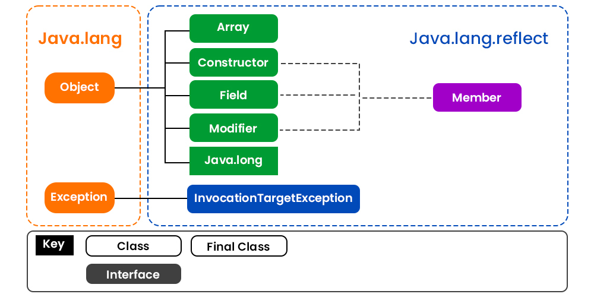
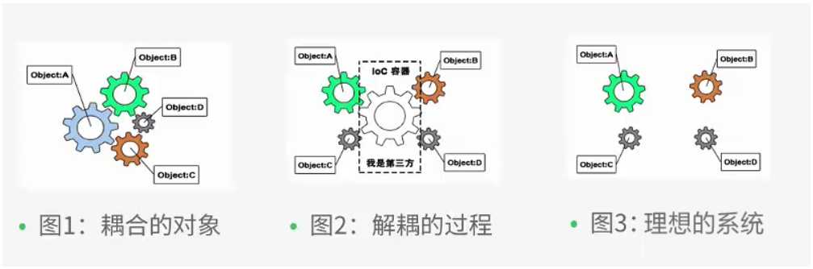
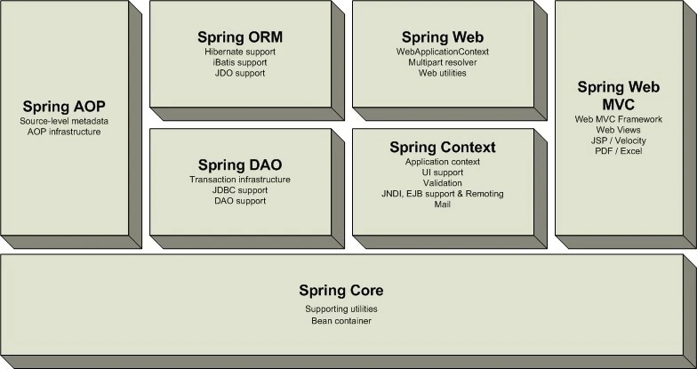
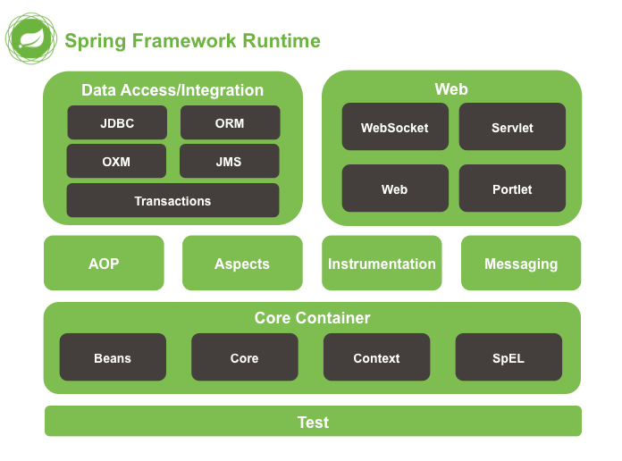
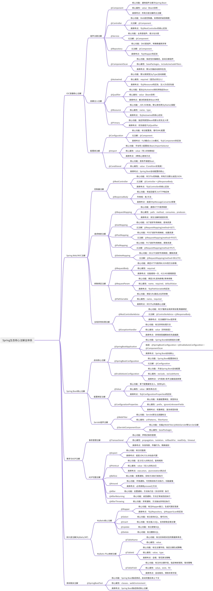

# Java

## 概述

+ 一些概念

  + JDK -- Java Development Kit
    + java.exe, 启动JVM
    + javac.exe, Java编译器，把 .java文件编译成 .class (java字节码文件)
    + .jar, 把一组 .class文件打包成 .jar文件，用于发布
    + javadoc.exe, 从 .java文件中自动提取注释并生成帮助文档
    + jdb.exe, Java调试器，用于开发阶段的运行调试

    + jdk8 升级至 jdk17

      + 框架要求
        + Spring Framework
        + Spring Boot
        + Kafka  
        + Jenkins
      + 增强
        + switch
          + 取消 break，且精简

            + before jdk17

              + [code]

                ```java
                String name = "徐庶";
                String alias;
                Switch (name) {
                  case "周瑜":
                    alias = "公瑾";
                    break;
                  case "徐庶":
                    alias = "元直";
                    break;
                  default:
                    alias = "未知";
                    break;
                }
                ```

              + [code]

                ```java
                String name = "徐庶";
                String country;
                Switch (name) {
                  case "周瑜":
                  case "徐庶":
                    country = "三国";
                    break;
                  case "铁木真":
                  case "忽必烈":
                    country = "元朝";
                    break;
                  default:
                    country = "未知";
                    break;
                }
                ```

            + jdk17

              + [code]

                ```java
                var name = "徐庶";
                String alias = switch (name) {
                  case "周瑜" -> "公瑾"
                  case "徐庶" -> "元直";
                  default -> "未知";
                }
                ```

              + [code]

                ```java
                var name = "徐庶";
                String alias = switch (name) {
                  case "周瑜", "徐庶" -> "三国";
                  case "铁木真", "忽必烈" -> "元朝";
                  default -> "未知";
                }
                ```

              + [code]

                ```java
                var name = "徐庶";
                String alias = switch (name) {
                  case "周瑜", "徐庶" -> {
                    System.out.println("三国");
                    yield "三国"；
                  }
                  case "铁木真", "忽必烈" -> {
                    System.out.println("元朝");
                    yield "元朝";
                  }
                  default -> {
                    System.out.println("未知");
                    yield "未知";
                  }
                }
                ```
          + 对象类型支持
        + 字符串增强
          + 引入 `'''... '''`
          + 引入 `\` 和 `\s`
        + instanceof增强
        + 子类继承问题
        + Lombok
          通过注解自动生成常见样本代码
        + 空指针问题
        + ZGC

  + JRE -- Java Runtime Environment
  + JVM -- Java Virtual Machine
  + EE -- Enterprise Edition
    + Java SE
    + API+ 扩展库
  + SE -- Standard Edition
    + JVM
    + 标准库
  + ME -- Micro Edition
  + OpenJDK
  + Hotspot
  + JSR -- Java Specification Request
  + JCP -- Java Community Process

  + GC -- Garbage Collector

+ 关键字

  + 列表
    + [表格]

      | 类别    | 关键字 | 说明   |
      | :------ | :--------- | :---- |
      | 访问控制 | private    | 私有类成员  |
      |         | protected  | 受保护类成员 |
      |         | public     | 公共类成员  |
      |         | default    | 默认类成员  |
      | 修饰符   | abstract   | 声明抽象    |
      |         | class      | 类         |
      |         | extends    | 扩充、继承  |
      |         | final      | 最终值、不可变 |
      |         | implements | 实现(接口) |
      |         | interface  | 接口      |
      |         | native     | 本地、原生 |
      |         | new        | 创建      |
      |         | static     | 静态      |
      |         | strictfp   | 严格浮点、精确浮点 |
      |         | synchronized | 线程、同步 |
      |         | transient  | 短暂的 |
      |         | volatile   | 易失  |
      | 程序控制 | break      | 终止循环 |
      |         | case       | switch选择 |
      |         | continue   | 继续处理   |
      |         | do         | 运行      |
      |         | else       | 否则      |
      |         | for        | 循环      |
      |         | if         | 如果      |
      |         | instanceof | 实例      |
      |         | return     | 返回      |
      |         | switch     | 选择      |
      |         | while      | 循环      |
      | 错误处理 | assert     | 断言表达式  |
      |         | catch      | 捕捉异常   |
      |         | finally    | 强制执行   |
      |         | throw      | 抛出异常对象 |
      |         | throws     | 声明可能抛出的异常 |
      |         | try        | 尝试运行   |
      | 包相关   | import     | 导入      |
      |         | package    | 包        |
      | 基本类型 | boolean    | 布尔类型   |
      |         | byte       | 字节类型   |
      |         | char       | 字符类型   |
      |         | double     | 双精度浮点 |
      |         | float      | 单精度浮点 |
      |         | int        | 整型      |
      |         | long       | 长整型    |
      |         | short      | 短整型    |
      | 变量引用 | super      | 父类、超类 |
      |         | this       | 本类      |
      |         | void       | 无返回值   |
      | 保留关键字 | goto      | 跳转，禁用 |
      |          | const     | 常量，禁用 |

  + 说明

    + null，字面常量，非关键字
    + true & false，字面常量，非关键字

+ JVM  

  + 内存模型，  
    运行时数据区

    + 线程共享区

      + 方法区 Method Area
        + 功能 存储类信息、常量、静态变量、JIT编译后的代码
        + 说明
          + 实现
            + JDK 1.7: 永久代(PermGen, Permanent Generation)
              Java启动参数 `-XX:MaxPermSize`
            + JDK 1.8: 元空间(Metaspace)，使用本地内存(不再受JVM堆的限制)
              + 运行时常量池，存放类、方法、字段的符号引用，及字面量(如，String.intem()的字)
          + Exceptions
            + OutOfMemoryError  
              元空间溢出，抛出 java.lang.OutOfMemoryError: Java heap space --> PermGen

      + 堆 Heap

        + 功能 存放所有的对象实例和数组，均为 _引用类型_
        + 说明
          + Java启动参数 `-Xmx`
          + 垃圾回收(GC, Garbage Collector)的主要区域

            + GC Root
              + 可达性算法
                + 标记整理算法
                + 标记复制算法
                + 标记清理算法

              + Stop the world
                停止用户线程

          + 新生代 + 老年代 (分代回收)
            + 新生代 Young Generation， 标记复制
              + Eden区 （默认占比 80%）
              + Survivor From区（默认占比 10%）
              + Survivor To区（默认占比 10%）
            + 老年代 Old Generation, 标记整理
              长期存活的对象
          + Exceptions
            + OutOfMemoryError  
              + 当堆无法分配内存时，抛出 java.lang.OutOfMemoryError: Java heap space
                + 超出预期的访问量或数据量
                + 内存泄漏 Memory Leak
              + 垃圾回收错误，抛出 java.lang.OutOfMemoryError: GC overhead limit exceeded

    + 线程私有区，
      每个线程独有

      + 程序计数器 PC Register, Program Counter Register
        唯一不会发生 OutOfMemoryError的区域

        + 功能 存储下一条待执行指令的内存地址
        + 说明  
          + 线程切换后，能恢复到正确执行的位置

      + 虚拟机栈 VM Stack
        + 功能 存储 方法调用的栈帧
        + 说明
          + 栈帧结构 Stack Frames
            + 局部变量表 Local Variable Array，存储方法参数和局部变量
            + 操作数栈 Operand Stack，执行字节码指令的工作区，如 加、减、乘、除， 策略为先进后出(FILO)/后进先出(LIFO)
            + 动态链接 Dynamic Linking，指向方法区(线程共享区>方法区)中该方法的符号引用
              + 指向运行时常量池中该方法的符号引用
              + 支持方法的多态，即晚期绑定
            + 返回地址 Return Address，方法退出后应回到的指令位置
              + 记录方法退出时的字节码指令地址
              + 返回时
                + 正常，调用者的PC计数器值
                + 异常，异常处理器表的地址
          + Exceptions
            + StackOverflowError, 栈深度超过限制，如无限递归
            + OutOfMemoryError, 扩展栈时，无法申请到足够空间

      + 本地方法栈 Native Stack
        + 功能 为JVM调用Native方法(如 C/C++ 代码)服务
        + 说明
          + 与"VM Stack"类似，但服务于"Native"方法
          + Exceptions，与"VM Stack"类似
            + StackOverflowError
            + OutOfMemoryError

    + Heap vs Stack

      + 对比
        + [表格]

          |        | JVM Stack | JVM Heap |
          | :----- | :-------- | :------- |
          | 共享性质 | 线程私有区域 | 线程共享区域 |
          | 创建时间 | 线程创建时，会分配一个独立的栈 | JVM启动时，整个JVM只有一个堆 |
          | 存储内容 | 存储方法执行时的栈帧 | 对象实例 和 数组 |
          | 生命周期 | 自动管理，与作用域绑定，不涉及GC | 由GC管理 |
          | 线程安全 | 天然线程安全 | 非线程安全 |
          | 内存碎片 | 无内存碎片 | 存在内存碎片 |
          | 错误异常 | StackOverflowError + OutOfMemoryError | OutOfMemoryError |

      + 线程安全问题 
        + 说明
          堆是共享区域，多个线程可以同时访问(读+写)一个堆上的数据  
          手动使用 synchronized, volatile, lock 等机制来保证并发安全(可见性、原子性、有序性)

  + Java启动参数

    + `-cp` ClassPath

    + `-Djava.util.logging.config.file=<config-file-name>`, 启用内置日志机制

    + `-enableassertions`/`-ea`, 启用断言
      + `-ea:包名.类名`, 只对指定类名启用断言
        + [示例]
          `-ea:com.itranswarp.sample.Main` 类名  
          `-ea:com.itranswarp.sample1` 包名  

    + `-Xms` 
    + `-Xmx`

  + javac编译参数

    + `-cp jar名` ClassPath

+ 数据类型
  Java是强类型语言

  + 基本数据类型
    + byte, 8 bits / 1 Byte, -128 ~ 127, integer
    + short, 16 bits / 2 Bytes, -32768 ~ 32767, integer
    + int, 32 bits / 4 Bytes, -2147483648 ~ 2147483647, integer
    + long, 64 bits / 8 Bytes, -9223372036854775808 ~ 9223372036854775807, interger
    + float, 32 bits / 4 Bytes, 
    + double, 64 bits / 8 Bytes, 
    + char, 16 bits / 2 Bytes,
    + boolean,


  + 引用数据类型
    + class
      + 基本类型 vs 封装类
        
        + 对应关系
          + [Table]

            |  | basic type | class |
            | :---- | :---- | :---- |
            |       | int   | Integer |

        + 区别

          + 存储位置
            + 基本类型，栈
            + 封装类，堆

          + 默认值
            + 基本类型
              + `int a; // a = 0`
            + 封装类，默认 null
              + `Integer a; // a = null`
          + 赋值  
            + 基本类型 直接赋值   
            + 封装类 使用 new 关键字

          + 混用
            自动使用**拆箱**或**装箱**"**操作

          + 操作
            + 基本类型
            + 封装类，增加了方法和属性


        + 说明
          + Integer
            + Integer是int的封装类
            + `Integer.valueOf()`在 -128~127 间会复用缓存对象


    + interface
    + array


  + 类型转换

    + 自动类型提升
SSh
    + 强制类型转换

+ Operator

  + 算术运算符

  + 赋值运算符

  + 比较运算符 

  + 相等运算符

    + `==`
      + 说明， 
        java中的对象相等比较的是对象的引用，而非值
        如果比较数值，应使用 equals
        + 示例
          + [code]

            ```java
            Integer a1 = 100; // it is Integer, not int
            // <==> Integer a1 = Integer.valueOf(100); // i.e. 装箱 boxing
            Integer a2 = 100;
            System.out.println( a1 == a2 ); // return true， since there is a integerCache

            Integer a3 = 200;
            Integer a4 = 200;
            System.out.println( a3 == a4 ); // return false
            System.out.println( a3.equals(a4) ); // return true
            ```

  + 逻辑运算/布尔运算
    + 位运算符

    + 与 `&&`(短路与), `&`
    + 或 `||`(短路或), `|`

  + 三元运算符

  + 运算优先级
    1. `()`
    2. 一元运算符: `!`, `~`, `++`, `--`
    3. 乘除运算符: `*`, `/`, `%`
    4. 加减运算符: `+`, `-`
    5. 移位运算符: `<<`, `>>`, `>>>`

    7. 比较运算符: `>`, `>=`, `<`, `<=`, `instanceof`
    8. 相等运算符: `==`, `!=`
    9. 位与运算符: `&`
    10. 位异或运算符: `^`
    11. 位或运算符: `|`
    12. 逻辑与运算符: `&`, `&&`
    13. 逻辑或运算符: `|`, `||`
    14. 条件运算符: `? : `
    15. 赋值运算符: `+=`, `-=`, `*=`, `/=`

+ Control

  + 顺序结构

  + 分支控制 / 条件控制 / 选择结构

    + `if {}`, `if {} else {}`, `if {} elseif {} else {}`

    + `swith () {case :...}`

  + 循环结构

    + for

    + foreach

    + while

    + do while
  
    + 中断终止
  
      + break
  
      + continue


+ OOP -- Object-Oriented Programming
  + 封装 Encapsulation
    将数据和可对其操作的方法绑定在一起
  + 继承 Inheritance

    + 子类可不可以重写父类的**静态**方法  
      不可以  
      核心在于.class文件(二进制)。静态方法不是对象调用。  
      @Override不可以  
      @Shadow可以  
  + 多态 Polymorphism
    允许不同类的对象对同一消息做出不同相应
  + 抽象 Abstraction
    + 接口
  + 类 Class
    + 说明: 除基本类型外，其他类型(包括interface)均为class
  + 对象 Object
  + 方法 Method
  + 重载 Overload/Override
  + 反射 Reflection
    + 说明:
      允许程序在运行时查询、访问和修改类、接口、字段和方法的信息。  
      反射提供了一种动态操作类的能力。
      为Spring等框架、类库提供了依赖注入。

    + 示意图  
      + 

    + 主要类和接口

      + Class 类
        + 说明: 表示类的对象，提供了获取类信息的方法

        + MethodS:
          + `getFields()` 获取所有公共字段
          + `getDeclaredFields()` 获取所有声明的字段，包括私有字段
          + `getMethods()` 获取所有公共方法
          + `getDeclaredMethods()` 获取所有声明的方法，包括私有方法
          + `getConstructors()` 获取所有公共构造函数
          + `getDeclaredConstructors()` 获取所有声明的构造函数，包括私有构造函数
          + `getSuperclass()` 获取类的父类
          + `getInterface()` 获取类实现的所有接口

      + Field 类

        + 说明: 表示类的字段(属性)，提供了访问和修改字段值的方法

        + Methods:
          + `get(Object obj)` 获取指定对象的字段值
          + `set(Object obj, Object value)` 设置指定对象的字段值
          + `getType()` 获取字段的数据类型
          + `getModifiers()` 获取字段的修饰符，如 'public', 'private'

      + Method 类

        + 说明: 表示类的方法，提供了调用方法的能力

        + Methods:

          + `invoke(Object obj, Object ... args)` 调用指定对象的方法
          + `getReturnType()` 获取方法的返回类型
          + `getParameterType()` 获取方法的参数类型
          + `getModifiers()` 获取方法的修饰符, 如 'public', 'private'

      + Constructor 类

        + 说明: 表示类的构造函数，提够了创建对象的能力

        + Methods:
          + `newInstance(Object... initargs)` 使用指定的构造函数参数创建一个新实例
          + `getParameterType()` 获取构造函数的参数类型
          + `getModifiers()` 获取构造函数的修饰符，如 'public', 'private'

  + 注解 Annotation
    + 内置注解
    + 元注解
    + 自定义注解

+ Java类库  
  + 数学、计算

    + 说明
      + Java不允许运算符重载

    + java
      + math
        + [class] BigInteger
          + [method] `BigInteger add(BigInteger other)`  
          + [method] `BigInteger subtract(BigInteger other)`  
          + [method] `BigInteger multiply(BigInteger other)`
          + [method] `BigInteger divide(BigInteger other)`
          + [method] `BigInteger mod(BigInteger other)`
          + [method] `BigInteger sqrt()`
          + [method] `BigInteger compareTo(BigInteger other)`
          + [method] `static BigInteger valueOf(long x)`

          + 示例

            + [code]

              ```java
              import java.math.*;
              import java.util.*;

              public class BigNumerical {
                  public static void main(String[] args) {
                      Scanner in = new Scanner(System.in);

                      System.out.print("How many numbers do you need to draw? ");
                      int k = in.nextInt();

                      System.out.print("What is the highest number you can draw? ");
                      BigInteger n = in.nextBigInteger();

                      /*
                       * compute binomial coefficient n*(n-1)*(n-2)*...*(n-k+1)/(1*2*...*k)
                       */

                      BigInteger lotteryOdds = BigInteger.ONE;

                      for (int i = 1; i <= k; i++) {
                          lotteryOdds = lotteryOdds.multiply(n.subtract(BigInteger.valueOf(i - 1))).divide              (BigInteger.valueOf(i));
                      }

                      System.out.printf("Your odds are 1 in %s. Good luck !%n", lotteryOdds);
                  }
              }
              ```

        + [class] BigDecimal
          + [constructor] `BigDecimal(String digits)`
          + [method] `BigDecimal(BigDecimal other)`
          + [method] `BigDecimal add(BigDecimal other)`
          + [method] `BigDecimal subtract(BigDecimal other)`
          + [method] `BigDecimal multiply(BigDecimal other)`
          + [method] `BigDecimal divide(BigDecimal other)`
          + [method] `BigDecimal divide(BigDecimal other, RoundingMode mode)`

            + 说明
              + RoundingMode
                + [enum] `RoundingMode.HALF_UP` 四舍五入

          + [method] `BigDecimal compareTo(BigDecimal other)`


  + 字符、字符串

  + 集合
    + java
      + util
        + ArrayList
        + HashMap
        + HashSet
        + LinkedList
        + regex
          + [class] Macher
            + [method] `matches()`
            + [method] `lookingAt()`
            + [method] `find()`
            + [method] `group()`
              + 说明
                + 须成功调用 `matches()`、`lookingAt()` 或 `find()`，否则抛出 "IllegalStateException"
            + [method] `group(int group)`
              + 说明
                + 须成功调用 `matches()`、`lookingAt()` 或 `find()`，否则抛出 "IllegalStateException"
            + [method] `groupCount()`
              + 说明
                + 须成功调用 `matches()`、`lookingAt()` 或 `find()`，否则抛出 "IllegalStateException"
            + [method] `start()`
              + 说明
                + 须成功调用 `matches()`、`lookingAt()` 或 `find()`，否则抛出 "IllegalStateException"
            + [method] `end()`
              + 说明
                + 须成功调用 `matches()`、`lookingAt()` 或 `find()`，否则抛出 "IllegalStateException"

            + 说明
              + 不能 `new()`，必须通过 `Pattern.matcher(CharSequence input)` 创建
              + 根据Pattern编译的正则表达式，对输入的字符序列进行操作
              + Matcher 实例**不**是线程安全的，多个线程应各自创建实例
              + 状态依赖，所有匹配信息的方法都依赖于最近一次成功匹配的状态
              + 使用`()`定义捕获组，组0 始终代表整个匹配
          + [class] Pattern

          + 示例
            + [code]

              ```java
              import java.util.regex.*

              public class MatcherExample {
                public static void main(String[] args) {
                  String text = "The quick brown fox jumps over the lazy dog";
                  Pattern pattern = Pattern.compile("\\b\\2{4}\\b");  // 匹配4字母单词
                  Matcher matcher = pattern.matcher(text);

                  System.out.println("Original Text:" + text);
                  System.out.println("To match the word has 4 letters");

                  while ( matcher.find() ) {
                    System.out.println("Finded:" + matcher.group() + " at position of " + matcher.start() + "-" + (matcher.end() - 1));
                  }

                  // replace all of words with "&zwjn;****&zwnj;"
                  String replaced = matcher.replaceAll("&zwjn;****&zwnj;");
                  System.out.println("\nReplaced Text:" + replaced);
                }
              }
              ```

        + Scanner
        + Vector

  + IO/NIO

    + java
      + io
        + [class] File
        + [class] InputStream
        + [class] OutputStream
      + nio
        + file
          + [class] Files

  + 多线程
    + java
      + lang
        + [class] Thread
    + java
      + util
        + concurrent
          + [class] ExecutorService

  + 日期、时间
    + java
      + text
        + [class] SimpleDateFormat

      + time
        + [class] ChronoUnit
        + [class] Duration
        + [class] Instant
        + [class] LocalDate
        + [class] LocalDateTime
        + [class] Period
        + [class] ZonedDateTime

      + util
        + [class] Calendar
          
        + [class] Date
        + [class] GregorianCalendar
  + 网络编程
    + java
      + net
        + [class] URL
        + [class] Socket

  + 日志

    + java
      + util
        + logging
          + [class] Level

            + 日志级别
  
              + [Table]
  
                | level   | notes 1 | notes 2 |
                | :------ | :------ | :------ |
                | SEVERE  |         | 最严重   |
                | WARNING |         |         |
                | INFO    |         |         |
                | CONFIG  |         |         |
                | FINE    |         |         |
                | FINER   |         |         |
                | FINEST  |         |         |

          + [class] Logger

            + [method] `Logger getGlobal()`
            + [method] `info()`
            + [method] `warning()`
            + [method] `fine()`
            + [method] `severe()`

            + 说明
  
  
            + 示例
  
              + [code]
  
                ```java
                import java.util.logging.Level;
                import java.util.logging.Logger;
        
                public class Hello {
                  public static void main(string[] args) {
                    Logger logger = Logger.getGlobal();
                    logger.info("start process ...");
                    logger.warning("memory is running out ... ");
                    logger.fine("ignored.");
                    logger.severe("process will be terminated ...");
                  }
                }
                ```

+ Java第三方库

  + Commons Logging / Apache 
    + 说明
      可以作为 日志接口 使用。  
      优先使用 Log4j, 后使用 JDK Logging。

    + 文件 "commons-logging-x.y.jar"

    + org
      + apache
        + commons
          + logging
            + [class] Log
            + [class] LogFactory

            + 示例

              + [Code]

                ```sql
                import org.apache.commons.logging.Log;
                import org.apache.commons.logging.LogFactory;
          
                public class Main {
                  public static void main(String[] args) {
                    Log log = LogFactory.getLog(Main.class)
                    log.info("start...");
                    log.warn("end.");
                  }
                }
                ```

    + 日志级别
      + [Table]

        | level   | notes 1 | notes 2 |
        | :------ | :------ | :------ |
        | FATAL   |         | 最严重   |
        | ERROR   |         |         |
        | WARN    | WARNING |         |
        | INFO    |         |         |
        | DEBUG   |         |         |
        | TRACE   |         |         |


  + Log4j

    + 说明
      Log4j是一个日志框架。是一个组件化的日志系统。

      + 示意图
        + 

      + 输出分类
      
        + [Table]

          |       | notes 1 | notes 2 |
          | :---- | :------ | :------ |
          | console |       | 输出到屏幕 |
          | file    |       | 输出到文件 |
          | socket  |       | 输出到远程计算机 |
          | jdbc    |       | 输出到数据库 |

      + filter
        通过日志级别，过滤输出的日志信息

      + Layout
        格式化日志信息

    + 配置 log4j2.xml

      + [code] 

        ```xml

        ``` 

+ Java应用框架

  + SSM

  + SpringBoot

+ 分布式、微服务

  + C(Consistency强一致性) A(Availability可用性) P(Parition tolerance分区容错性)
    最多智能满足上述三项中的两项

  + BA(Base Avalibale基本可用) S(Soft State软状态/中间状态) E(Eventually Consistent最终一致性)
    AP的拓展和工程化，不追求实时强一致性，但保证最终结果正确，且核心流程永远可用  
    时间窗口  

  + ACID
    追求强一致性、强隔离、事务边界清晰

  + SpringCloud

  + 微服务

+ 数据库 & 持久化框架

+ 异常处理

  + try catch

    + catch的顺序，子类须写在前面
      + 示例
        + [code]

          ```java
          public static void main(String[] args){
            try{
              process1();
              process2();
              process3();
            }
            catch (UnsupportedEncodingException e) {
              System.out.println("Bad encoding");
            }
            catch (IOException e) {
              System.out.println("IO Error");
            }
          }
          ```

    + finally，最后执行，执行清理工作

    + try-catch会影响性能吗
      + 未出异常时，不会影响性能
      + 出现异常，
        增加异常状态判断，增加异常栈建立，...，会影响性能
        仍需对可预测的异常进行return处理，而非抛出通用异常  

  + throw 抛出异常

    + 示例

      + [code]

        ```java
        void process2(string s) {
          if ( s == null ){
            NullPointerException e = new NullPointerException();
            throw e;
            /*
            <==>
            throw new NullPointerException();
            */
          }
        }
        ```

  + printStackTrace() 打印错误堆栈

  + Assertion 断言
    对于可恢复的错误，勿使用断言

    + 示例

      + [code]

        ```java
        ublic static void main(String[] args) {
         double x = Math.abs(-123.45);
         assert x >= 0 : "x must larger than or equals 0";
         System.out.println(x);
        
        ```

        当 `x < 0` 时，抛出 AssertionError，断言消息为"x must larger   han or equals 0"

## 专题

+ File， Stream， IO

+ 集合 & 泛型

  + 集合
    + 说明
      Java集合框架主要是由 Collection 和 Map 两个接口派生而来
  
    + List
    + Set
    + Queue
    + ArrayList
      动态数组。查询效率高，插入和删除效率低
    + LinkedList
      基于双向链表。插入和删除效率高，查询效率低
    + HashMap
      基于Hash表实现。透过哈希值快速定位键值，具有较高的查找效率。非线程安全
    + TreeMap
      基于红黑树实现。能够对键进行排序
    + ConcurrentHashMap
      线程安全的哈希表，采用分段锁机制
    + HashSet
    + TreeSet

  + 泛型

    + 泛型类

    + 泛型接口

    + 泛型方法

    + 泛型通配符

      + 无界通配符
      + 上界通配符
      + 下届通配符

+ 多线程 & 并发 

  + 说明
    + 多任务 multitasking，在同一时间，可以运行多个程序。
      + 并发 Concurrency & 并行 Parallelism
        + *并发**，多个任务交替执行
        + **并行**，多个任务同时执行
      + 进程 Process &　线程 Thread 
        + **进程**，程序的一次执行过程，是系统资源分配的基本单位，有**独立**的内存空间
        + **线程**，进程内的执行单元，进程间**共享**内存
          + 状态
            + New
            + Runnable
            + Blocked
            + Waiting
            + Timed waiting
            + Terminated
      + 关系
        一个进程可以包含多个线程  
        线程切换成本远低于进程切换成本
      + 核心问题
        + 分工
          如何高效地拆解任务并分配给线程

          + Executor & 线程池
          + Fork & Join
          + Future
          + Guarded Suspension模式
          + Balking模式
          + Thread-Per-Message模式
          + 生产者-消费者模式
          + Worker Thread模式
          + 两阶段终止模式

        + 同步/协作
          线程间如何协作

          + 信号量(Semaphore)
          + 管理(Monitor)
            + Lock & Condition
            + synchronized
          + CountDownLatch
          + CyclicBarrier
          + Phaser
          + Exchanger
        + 互斥
          保证同一时刻只允许一个线程访问共享资源

          + 无锁
            + 不变模式
            + 线程本地存储
            + CAS
            + Copy-on-Write
            + 原子类
          + 互斥锁
            + synchronized
            + Lock
            + 读写锁

    + 并发理论基础
      + 可见性
        缓存
      + 原子性
        线程切换
      + 有序性

  + 说明2

    + 继承 Thread类
  
    + 实现 Runnable接口
  
    + 线程池
  
      + 固定大小线程池
  
      + 单线程线程池
  
      + 缓存栈线程池

+ IoC -- Inversion of control 控制反转 / DI -- Dependency injection 依赖注入
  + IoC, 将组件间的依赖关系从程序内部提取到外部来管理
  + DI，将组件间的依赖关系在外部通过参数或其他方式注入到内部

  + 图示

    + [Diagram]
      

  + 思想 （好莱坞原则，Do not call us, we will call you）
    + IoC 
      + 将对象的创建和管理交给容器  
      + 容器负责实例化对象，管理对象的声明周期以及注入依赖关系  
      + 对象的控制器由应用程序转移到了容器，即 控制反转
    + DI (IoC的一种实现方式)
      通过IoC，在对象创建时自动将其所依赖的**其他**对象注入到该对象中，而不是让该对象内部自行创建和管理这些依赖
    + Bean，用IoC容器管理的对象实例
      + 开发者可以通过在配置文件中或配置类中定义Bean的属性和依赖关系，
      + IoC容器根据配置信息实例化Bean，并将其置入容器进行管理


+ AOP 面向切面编程  

  + 业务类

  + 切面类

  + 配置类

+ Spring

  + Spring Framework / Spring
    框架的框架，可以整合多种框架
    框架， 预先设计/实现好的软件架构，提供了通用解决方案和功能模块。包括一系列预定义的类、接口、函数和工具

    + 框架组合

      + SSH， Struts + Spring+ Hibernate
      + SSM， Spring + SpringMVC + Mybatis
      + ...


    + 说明
      + 开源、轻量级J2EE
      + IoC & AOP

    + 特点
      + 模块化设计
      + 代码可移植、可维护
      + 声明式事务管理
      + 简化测试
      + 可快速与第三方框架集成
        + Hibernate (持久层)
        + MyBatis (持久层)
        + Struts (表现层)
        + SpringMVC (表现层)
        + SpringBoot
        + SpringCloud
        + ...

    + 优点 = 特点
      + 非侵入式
      + 降低耦合
      + AOP
      + 支持声明式事务
      + 方便程序测试
      + 方便集成第三方框架
      + 降低J2EE API使用难度

    + 概念

      + 图示

        + [Diagram]
          
        + [Diagram]
          

      + Spring容器
        管理组件的生命周期（创建、配置、组装、管理）

        + Core 核心模块
          提供基础功能，包含IoC+DI的底层实现机制
        + Bean**s**，由Spring容器管理。
          + 说明
            提供对 BeanFactory 等工厂模式的实现，是IoC+DI的直接实现。管理Bean
            + Scope 作用域
            + Lifecycle 生命周期
          + 说明2
            + Bean 
              + 安全性 (线程安全性)
                + Spring本身没有提供Bean的安全策略
                  默认不是线程安全的。默认是**Singleton**，整个应用的声明周期只有一个实例。  
                  如果有多个线程同时访问，并修改了成员数据，则出现安全问题。  
                + 安全性取决于作用域和状态
                  + 无状态Bean (ex. Controller, Service, DAO, etc)
                    + 只包含方法的逻辑
                    + 只依赖于其他 无状态Bean
                    + 不保存 用户数据 或 会话状态

                  + 有状态Bean
                    + 有成员数据(即 状态)可被修改
                    + 解决办法
                      + 改为 "Prototype" 作用域
                        `@Scope("prototype")`, 每次请求都创建新的实例，即数据不共享
                      + 使用 "ThreadLocal"
                        把变量放在 ThreadLocal 中，实现线程隔离
                      + 同步机制
                        使用 synchronized, Lock, AtomicInteger, etc 机制

                + 注意事项
                  + 不要在 Controller, Service 等中定义成员变量来存储请求参数
                  + 使用"方法参数"传递请求数据
                  + 使用"ThreadLocal"存储线程私有数据
                  + 避免在 单例Bean 中使用成员变量保存状态 
 
        + Context 上下文模块
          集成了 资源绑定、国际化支持、事件传播
          产生IoC容器/上下文容器？

        + SpEL -- Spring Expressing Language，
          支持在运行时 动态查询和操作 对象，增强配置灵活性

        + Data Access/Integration
          + JDBC
            + JDBC模块简化了JDBC编码过程
            + 处理DB Provider特有的错误代码
          + ORM (Object Relational Mapping)
            + Hibernate, 在Java**类**和数据**表**间建立映射关系，以及提供缓存、事务管理、延迟加载等功能
            + MyBatis, 持久层框架，在XML配置文件和注解中定义SQL映射，将Java**对象**和数据库**记录**之间进行映射 
            + ...
          + OXM
            + XML相关操作（双向转换、XML映射、etc）
            + 绑定XML框架
              + JAXB
              + Castor
              + XML Beans
          + JMS
            消息处理
          + Transaction
            通过注解和配置文件实现声明式事务管理

        + Web
          + Spring Web
            + 基本Web
            + 文件上传
            + HTTP Client Side
            + Spring远程处理支持 (RPC?)
          + Servlet 
            构建Web应用的RESTful服务
          + WebSocket
            + WebSocket
            + SockJS
            + STOMP etc
          + Portlet

        + AOP & Test

          + AOP
          + Aspects
          + Instrumentation
            提供了类工具的支持，实现了类加载器
          + Messaging
          + Test
            + Junit
            + Mockito

      + IoC / DI，将程序的控制权从应用程序转移到框架/容器
        + IoC容器 (对象实例化、装配、配置、管理)
          + BeanFactory
          + ApplicationContext
        + DI的方式
          + 构造器注入
          + Setter方法
          + 字段注入

      + AOP

      + Spring构建方式

        + Spring Initializr
          须连接Internet

          + IDEA / Spring Initializr
            + Options
              + Server URL: Spring Initializr工具URL
              + Name: 项目名称
              + Location: 项目存储的本地目录
              + Language: 项目开发语言
              + Type: 项目构建工具
              + Group: 项目组名称
              + Artifact: 项目发布名称
              + Package name: 项目发布包名
              + JDK: 项目使用的JDK
              + Packaging: 项目打包形式
                + jar
                + war
              
            + Dependencies
              + 

        + Maven

      + 目录解释
        + ${ProjectName}.java
          + ${ProjectName}Application.java 项目启动类
          + static
          + templates
          + application.properties 全局配置文件
          + pom.xml Maven工程配置文件


  + Spring MVC

  + Spring Boot
    Spring Boot 是 Spring Framework 的扩展，而非替代  
    + 设计思想
      + 约定大于配置(Convention Over Configuration)  
      + 开箱即用
      + 外代码生成、无需XML配置。纯 注解驱动开发，兼容 XML配置
      + 内嵌容器。 无需单独部署Web容器，直接打包成Jar运行

    + 启动

      + Spring boot 启动流程
        提供 "starter"(起步)依赖 ，简化构建配置。 可根据需要，选择"starter"。  

        + 三件事
          + 准备环境
          + 创建上下文
          + 启动业务


        + 启动`main()`方法，即五个步骤

          + [code]
  
            ```java
            SpringApplication.run(Application.class, args);
            ```

          + 动作

            + `new SpringApplication()`

              + 说明
                + 推断应用类型
                  + 判断类路径里有没有"javax.servlet"
                    + 有， Web应用
                + 设置初始化器、监听器、主类

            + `run(Application.class, args)`

              + 说明
                + 真正的启动

              + 过程
                + 准备环境
                  + 加载配置文件、系统变量、命令行参数
                  + 封装成 "ConfigurableEnvironment"
                + 创建上下文，"Application Context"，即"上下文容器"
                  + 装配Bean，加载配置类。即 `@ComponentScan`
                + 刷新上下文，
                  + 所有 Bean 初始化完成
                  + 事件监听器 注册完成
                  + Web 项目 ？启动内嵌Tomcat : NoAction;
                + 调用接口 "CommandLineRunner" 和 "ApplicationRunner"
                  + 启动后须完成的逻辑
                + 发布 "ApplicationReadyEvent"，即 启动业务

        + Spring可以快速加载Bean
          原因是使用 `@Conditional` 注解

          + `@Conditional`说明
            只有满足其条件，才能创建Bean实例

            + 定义
              + [code]
                ```java
                Class<? extends Condition>[] value();
                ```

            + 接口

              + [code]
                ```java
                boolean matches(ConditionContext context,
                                AnnotatedTypeMetadata metadata);
                ```

            + 机制
              返回 true --> 注册Bean
              返回 false --> 跳过

          + 工作机制
            Spring容器在加载BeanDefinition阶段通过`@Conditional`筛选Bean。

          + 派生注解
            + `@ConditionalOnClass`
            + `@ConditionalOnProperty`
            + `@ConditionalOnMissingBean`

  + Spring Cloud  
    + 说明
      + 基于Spring Boot构建，是Spring Boot在分布式场景的生态延申
      + 用于构建分布式系统的微服务架构的**工具集合**
      + 提供了多个子项目
        + 服务发现
        + 负载均衡
        + 断路器
        + 分布式配置

    + 运行

      + 从用户请求到服务返回，全程用来哪些组件？
        + 过程
          + 网关与流量控制
            用户请求进来，先到 Spring Cloud Gateway (网关层)，配合 Sentinel 做 限流 + 熔断， 避免突发流量引发后端阻塞
          + 服务发现与调用
            网关到Nacos上搜索 可用实例列表 找服务地址
          + 负载均衡
            服务间使用 OpenFeign 互相调用，同时通过 LoadBalancer 在多个实例间做负载均衡
          + 配置中心
            服务配置统一放在 Nacos config 里维护，改配置不用重启，动态刷新
          + 容错降级
            下游服务故障，Sentinel 介入，降级，保障核心链路/服务
          + 消息驱动
            异步逻辑 进入 Spring Cloud Stream，配合 RocketMQ / RabbitMQ 进行解耦、削峰
          + 全链路观测
            Spring Boot 2.x 用 Sleuth + Zipkin 做链路追踪，配合 Spring Boot Admin 监控

  + 注解 Annotation
    + 概览
      **注解是Spring Boot驱动开发的核心**。

      + 类型
        + 启动注解
          + 核心启动注解 `@SpringBootApplication`
            + 配置 `@SpringBootConfiguration`, 替代Spring的XML配置文件
            + 自动配置 `@EnableAutoConfiguration`, Spring Boot自动配置的核心入口
            + 组件扫描 `@ComponentScan`, 默认扫描启动类所在包及其子包下的Bean

        + 配置绑定注解

          + `@Configuration`                  标记类为配置类，替代 XML 配置，注册 Bean 到容器 
          + `@Bean`                           标注在方法上，将方法返回值注册为 Spring 容器中的 Bean 
          + `@ConfigurationProperties`        类型安全的配置绑定，将配置文件中的属性批量绑定到 Java Bean 
          + `@EnableConfigurationProperties`  开启 @ConfigurationProperties 注解的生效，将绑定的 Bean 注册到容器 
          + `@Value`                          单个配置属性注入，支持 SpEL 表达式 
          + `@PropertySource`                 加载指定的外部配置文件 

        + 条件注解
          Spring Boot 自动配置的核心判断逻辑，用于控制 Bean/配置类的生效条件

          + 类条件：
            + `@ConditionalOnClass`（类路径存在指定类时生效）
            + `@ConditionalOnMissingClass`
          + Bean 条件：
            + `@ConditionalOnBean`（容器存在指定 Bean 时生效）
            + `@ConditionalOnMissingBean`
            + `@ConditionalOnSingleCandidate`
          + 配置条件：
            + `@ConditionalOnProperty`（配置文件中指定属性匹配时生效）
          + 资源条件：
            + `@ConditionalOnResource`（类路径存在指定资源时生效）
          + Web 条件：
            + `@ConditionalOnWebApplication`
            + `@ConditionalOnNotWebApplication`
          + 表达式条件：
            + `@ConditionalOnExpression`（SpEL 表达式成立时生效）

        + 场景化功能注解
          + Web 相关：
            + `@RestController`
            + `@RequestMapping`
            + `@GetMapping、@PostMapping`
            + `@RequestBody`
            + `@RequestParam`
            + ...
          + 事务相关：
            + `@Transactional`
          + 异步相关：
            + `@EnableAsync`
            + `@Async`
          + 定时任务：
            + `@EnableScheduling`
            + `@Scheduled`
          + 缓存相关：
            + `@EnableCaching`
            + `@Cacheable`
            + `@CachePut`
            + `@CacheEvict`
          + 校验相关：
            + 通用
              + `@Valid`
              + `@Validated`
              + ...
            + JSR-380 规范注解
              + `@NotNull`
              + `@NotBlank`
              + ...
        + Bean管理注解
          + ...
          
      + 图示

        + [Diagram]
          

    + `@After`
      + 说明:
        
        + 元注解: 
      + 类别: 事务与AOP注解
      + 所属框架: Spring AOP 
      + 作用域: 方法 
      + 核心功能: 定义通知类型（前置、环绕、后置、返回、异常） 
      + 常用属性: 
        + `value`（切入点）
        + `returning`（返回值参数名）
        + `throwing`（异常参数名） 
      + 使用场景: 方法执行前后的逻辑（如日志、性能监控、异常处理）

    + `@AfterReturning`
      + 说明:
        
        + 元注解: 
      + 类别: 事务与AOP注解
      + 所属框架: Spring AOP 
      + 作用域: 方法 
      + 核心功能: 定义通知类型（前置、环绕、后置、返回、异常） 
      + 常用属性: 
        + `value`（切入点）
        + `returning`（返回值参数名）
        + `throwing`（异常参数名） 
      + 使用场景: 方法执行前后的逻辑（如日志、性能监控、异常处理）

    + `@AfterThrowing`
      + 说明:
        
        + 元注解: 
      + 类别: 事务与AOP注解
      + 所属框架: Spring AOP 
      + 作用域: 方法 
      + 核心功能: 定义通知类型（前置、环绕、后置、返回、异常） 
      + 常用属性: 
        + `value`（切入点）
        + `returning`（返回值参数名）
        + `throwing`（异常参数名） 
      + 使用场景: 方法执行前后的逻辑（如日志、性能监控、异常处理）

    + `@Around`
      + 说明:
        
        + 元注解: 
      + 类别: 事务与AOP注解
      + 所属框架: Spring AOP 
      + 作用域: 方法 
      + 核心功能: 定义通知类型（前置、环绕、后置、返回、异常） 
      + 常用属性: 
        + `value`（切入点）
        + `returning`（返回值参数名）
        + `throwing`（异常参数名） 
      + 使用场景: 方法执行前后的逻辑（如日志、性能监控、异常处理）

    + `@Aspect`
      + 说明:
        
        + 元注解: 
      + 类别: 事务与AOP注解
      + 所属框架: Spring AOP 
      + 作用域: 类 
      + 核心功能: 标注切面类，定义横切关注点（如日志、事务）
      + 常用属性:
      + 使用场景: AOP切面定义

    + `@Autowired`
      + 说明:
      + 类别: 依赖注入注解
      + 所属框架: Spring Framework 
      + 作用域: 构造器、方法、字段、参数 
      + 核心功能: 按类型（byType）自动装配Bean，默认要求依赖必须存在 
      + 常用属性: 
        + `required`（是否必须注入，默认'true'）
      + 使用场景: 自动注入依赖Bean, 配合`@Qualifier`  

    + `@Bean`
      + 说明:
        方法级别注解
        通常写在`@Configuration`配置类方法中  
        告诉 Spring容器 ，该方法的返回值应被注册为一个可被依赖注入管理的Bean
      + 类别:
      + 所属框架:
      + 作用域:
      + 核心功能:
      + 常用属性:
      + 使用场景:

    + `@Before`
      + 说明:
        
        + 元注解: 
      + 类别: 事务与AOP注解
      + 所属框架: Spring AOP 
      + 作用域: 方法 
      + 核心功能: 定义通知类型（前置、环绕、后置、返回、异常） 
      + 常用属性: 
        + `value`（切入点）
        + `returning`（返回值参数名）
        + `throwing`（异常参数名） 
      + 使用场景: 方法执行前后的逻辑（如日志、性能监控、异常处理）

    + `@Component`
      + 说明:
        类级别注解, **核心组件注解**  
        标记一个Java类为Spring组件
      + 类别: Spring核心组件注解
      + 所属框架: Spring Framework
      + 作用域: 类
      + 核心功能: 标注通用组件，自动注册为Spring Bean
      + 常用属性: 
        + `value`(指定Bean名称，默认类名首字母小写)
      + 使用场景: 不确认层级的通用工具类、基础组件

    + Diff: `@Bean`, `@Component`

      + 表格 
        + [Table]

          |          | @Component                         | @Bean                        |
          | :------- | :--------------------------------- | :--------------------------- |
          | 作用目标   | 类                                 | 方法                          |
          | 注册方式   | 自动扫描，需`@ComponentScan`扫描类路径 | 显示声明，在配置类中            |
          | 实例化控制 | Spring自动创建，无构造                | 开发者配置，可 `new()`、配置参数 |
          | 适用对象   | 自定义业务类                         | 第三方类 / 负载初始化逻辑        |
          | 配置灵活性 | 较低，依赖 `@PostConstruct`          | 高，支持 条件、依赖注入，多配置   |
          | 命名规则   | 默认类名首字母小写                    | 默认方法名                     |
          | 需要配置类 | 否                                 | 是，配合 `@Configuration`      |

      + 说明:
        + 同一个类上同时使用 `@Component` 和 `@Bean`
          + `@Component`标记类为Bean；`@Bean`返回另一个Bean
        + 

    + `@ComponentScan`
      + 说明:
        
        + 元注解: 
      + 类别: 配置与启动注解
      + 所属框架: Spring Framework
      + 作用域: 类（通常配合`@Configuration`） 
      + 核心功能: 指定扫描包路径，自动注册@Component等注解的类为Bean 
      + 常用属性:
        + `basePackages`（扫描包路径）
        + `includeFilters`（包含过滤器）
        + `excludeFilters`（排除过滤器）
      + 使用场景: 自定义扫描包路径 

    + `@Conditional`
      + 说明:
        
        + 元注解: 
      + 类别: 配置与启动注解
      + 所属框架: Spring Framework  
      + 作用域: 类、方法
      + 核心功能: 按条件装配Bean，满足指定Condition才注册
      + 常用属性:
        + `value`（Condition实现类数组）
      + 使用场景: 动态装配（如根据环境变量决定是否注册Bean）

    + `@Configuration`
      + 说明:
        
        + 元注解:
          + `@Component` 
      + 类别: 配置与启动注解
      + 所属框架: Spring Framework 
      + 作用域: 类 
      + 核心功能: 标注配置类，替代XML配置，类中通过`@Bean`方法定义Bean
      + 常用属性:
      + 使用场景: Java配置类，定义Bean、配置第三方组件 

    + `@ConfigurationProperties`
      + 说明:
        
        + 元注解: 
      + 类别: 其他注解
      + 所属框架: Spring Boot 
      + 作用域: 类
      + 核心功能: 批量注入配置属性，绑定到类字段（类型安全）
      + 常用属性:
        + `prefix`（配置前缀）
        + `ignoreUnknownFields`（忽略未知字段）
      + 使用场景: 批量配置注入（如连接池配置、自定义应用配置） 

    + `@Controller`
      + 说明:
        + 元注解: 
          + `@Component`
      + 类别: Spring核心组件注解
      + 所属框架: Spring Framework
      + 作用域: 类
      + 核心功能: 标注Web层控制器，处理HTTP请求并返回视图 
      + 常用属性: 
        + `value`(指定Bean名称，默认类名首字母小写)
      + 使用场景: 传统Spring MVC开发，返回JSP/Thymeleaf等视图 

    + `@Delete`
      + 说明:
        
        + 元注解: 
      + 类别: MyBatis/MyBatis-Plus注解
      + 所属框架: MyBatis 
      + 作用域: 方法 
      + 核心功能: 标注CRUD方法，直接定义SQL语句（替代XML） 
      + 常用属性:
        + `value`（SQL语句） 
      + 使用场景: 简单CRUD操作，无需复杂XML配置 

    + `@DeleteMapping`
      + 说明:
        
        + 元注解: 
          + `@RequestMapping`(method = 对应HTTP方法)
      + 类别: Web层注解
      + 所属框架: Spring Framework
      + 作用域: 方法
      + 核心功能: 简化`@RequestMapping`，专门处理对应HTTP方法的请求
      + 常用属性:
      + 使用场景: RESTful资源操作（GET查询、POST创建、PUT更新、DELETE删除）

    + `@EnableAutoConfiguration`
      + 说明:
        
        + 元注解: 
           
      + 类别: 配置与启动注解
      + 所属框架: Spring Boot
      + 作用域: 类  
      + 核心功能: 启用Spring Boot自动配置，根据依赖自动配置Bean  
      + 常用属性:
        + `exclude`（排除自动配置类）
        + `excludeName`（排除自动配置类名）
      + 使用场景: 自定义自动配置（通常被@SpringBootApplication间接使用）

    + `@ExceptionHandler`
      + 说明:
        
        + 元注解: 
        
      + 类别: Web层注解
      + 所属框架: Spring Framework
      + 作用域: 方法 
      + 核心功能: 标注异常处理方法，处理指定类型的异常 
      + 常用属性:
        + `value`（要处理的异常类型数组）
      + 使用场景: 在`@RestControllerAdvice`类中定义异常处理逻辑 

    + `@GetMapping`
      + 说明:
        
        + 元注解: 
          + `@RequestMapping`(method = 对应HTTP方法)
      + 类别: Web层注解
      + 所属框架: Spring Framework
      + 作用域: 方法
      + 核心功能: 简化`@RequestMapping`，专门处理对应HTTP方法的请求
      + 常用属性:
      + 使用场景: RESTful资源操作（GET查询、POST创建、PUT更新、DELETE删除）

    + `@Import`
      + 说明:
        
        + 元注解: 
      + 类别: 配置与启动注解
      + 所属框架: Spring Framework  
      + 作用域: 类
      + 核心功能: 导入其他配置类、Bean类或ImportSelector实现类 
      + 常用属性:
        + `value`（要导入的类数组） 
      + 使用场景: 模块化配置，组合多个配置类 

    + `@Insert`
      + 说明:
        
        + 元注解: 
      + 类别: MyBatis/MyBatis-Plus注解
      + 所属框架: MyBatis 
      + 作用域: 方法 
      + 核心功能: 标注CRUD方法，直接定义SQL语句（替代XML）  
      + 常用属性:
        + `value`（SQL语句） 
      + 使用场景: 简单CRUD操作，无需复杂XML配置 

    + `@Mapper`
      + 说明:
        
        + 元注解: 
      + 类别: MyBatis/MyBatis-Plus注解
      + 所属框架: MyBatis 
      + 作用域: 接口 
      + 核心功能: 标注Mapper接口，自动生成代理实现类并注册为Bean 
      + 常用属性:
      + 使用场景: MyBatis Mapper接口定义 

    + `@PathVariabl`
      + 说明:
        
        + 元注解: 
      + 类别: Web层注解
      + 所属框架: Spring Framework
      + 作用域: 方法参数 
      + 核心功能: 绑定URL路径变量（如/users/{id}中的id）到方法参数 
      + 常用属性:
        + `name`/`value`（路径变量名）
        + `required`（是否必须）
      + 使用场景: RESTful URL中的动态参数 

    + `@Pointcut`
      + 说明:
        
        + 元注解: 
      + 类别: 事务与AOP注解
      + 所属框架: Spring AOP 
      + 作用域: 方法 
      + 核心功能: 定义切入点（要拦截的方法集合）
      + 常用属性:
        + `value`（切入点表达式，如execution(* com.example.service.*.*(..))）
      + 使用场景: 复用切入点表达式 

    + `@PostMapping`
      + 说明:
        
        + 元注解: 
          + `@RequestMapping`(method = 对应HTTP方法)
      + 类别: Web层注解
      + 所属框架: Spring Framework
      + 作用域: 方法
      + 核心功能: 简化`@RequestMapping`，专门处理对应HTTP方法的请求
      + 常用属性:
      + 使用场景: RESTful资源操作（GET查询、POST创建、PUT更新、DELETE删除）

    + `@Primary`
      + 说明:
        + 元注解: 
          + `@Component`
      + 类别: 依赖注入注解
      + 所属框架: Spring Framework 
      + 作用域: 类、方法 
      + 核心功能: 当存在多个同类型Bean时，标注@Primary的Bean为默认优先注入的Bean 
      + 常用属性:
      + 使用场景: 设置默认Bean，避免注入冲突

    + `@PutMapping`
      + 说明:
        
        + 元注解: 
          + `@RequestMapping`(method = 对应HTTP方法)
      + 类别: Web层注解
      + 所属框架: Spring Framework
      + 作用域: 方法
      + 核心功能: 简化`@RequestMapping`，专门处理对应HTTP方法的请求
      + 常用属性:
      + 使用场景: RESTful资源操作（GET查询、POST创建、PUT更新、DELETE删除）

    + `@Qualifier`
      + 说明:
        
      + 类别: 依赖注入注解
      + 所属框架: Spring Framework
      + 作用域: 字段、方法、参数、类
      + 核心功能: 配合@Autowired，按名称（byName）指定要注入的Bean
      + 常用属性: `value`(指定Bean名称，默认类名首字母小写)
      + 使用场景: 传解决同类型多Bean冲突 

    + `@Repository`
      + 说明:
        创建 DAO 对象，访问数据库
        + 元注解: 
          + `@Component`
      + 类别: Spring核心组件注解
      + 所属框架: Spring Framework
      + 作用域: 类
      + 核心功能: 标注数据访问层（DAO层）组件，转换数据库异常为Spring统一异常体系
      + 常用属性:
        + `value`
      + 使用场景: (DAO)数据库操作类，如MyBatis Mapper、JPA Repository 

    + `@RequestBody`
      + 说明:
        
        + 元注解: 
      + 类别: Web层注解
      + 所属框架: Spring Framework 
      + 作用域: 方法参数 
      + 核心功能: 将HTTP请求体（JSON/XML）绑定到方法参数  
      + 常用属性:
        + `required`（是否必须有请求体，默认true）
      + 使用场景: 接收POST/PUT请求的JSON数据 

    + `@RequestMapping`
      + 说明:
        
        + 元注解: 
      + 类别: Web层注解
      + 所属框架: Spring Framework
      + 作用域: 类、方法 
      + 核心功能: 灵活映射HTTP请求到处理方法，可指定URL、HTTP方法、请求头等 
      + 常用属性:
        + `value`/`path`（URL路径）
        + `method`（HTTP方法）
        + `consumes`（请求Content-Type）
        + `produces`（响应Content-Type） 
      + 使用场景: 定义请求映射（类上定义基础路径，方法上定义具体路径）  

    + `@RequestParam`
      + 说明:
        
        + 元注解: 
      + 类别: Web层注解
      + 所属框架: Spring Framework 
      + 作用域: 方法参数 
      + 核心功能: 绑定HTTP请求参数（查询参数或表单参数）到方法参数 
      + 常用属性:
        + `name`/`value`（参数名）
        + `required`（是否必须）
        + `defaultValue`（默认值）
      + 使用场景: 获取URL查询参数（如?page=1）、表单提交参数 

    + `@Resource`
      + 说明:  
      + 类别: 依赖注入注解
      + 所属框架: JSR-250（Java标准）
      + 作用域: 字段、方法 
      + 核心功能: 默认按名称（byName）装配，找不到名称再按类型（byType） 
      + 常用属性: 
        + `name`（Bean名称）
        + `type`（Bean类型）
      + 使用场景:

    + `@ResponseBody`
      + 说明:
        
      + 类别: Web层注解
      + 所属框架: Spring Framework
      + 作用域: 方法、类
      + 核心功能: 将方法返回值直接写入HTTP响应体（而非解析为视图）
      + 常用属性:  
      + 使用场景: 在@Controller类中单独标注方法返回数据   

    + `@RestController`

      + 说明:  
        + 元注解
          + `@Controller`  
          + `@ResponseBody`  
      + 类别: Web层注解
      + 所属框架: Spring Framework  
      + 作用域: 类  
      + 核心功能: 标注RESTful控制器，所有方法默认返回JSON/XML数据  
      + 常用属性:  
      + 使用场景: 前后端分离的REST API开发

    + `@RestControllerAdvice`
      + 说明:
        
        + 元注解: 
          + `@ControllerAdvice`
          + `@ResponseBody`
      + 类别: Web层注解
      + 所属框架: Spring Framework
      + 作用域: 类 
      + 核心功能: 全局异常处理、全局数据绑定，专门用于RESTful服务 
      + 常用属性:
        + `basePackages`（扫描包路径）
        + `annotations`（指定注解）
      + 使用场景: 统一处理REST API的异常，返回JSON格式错误信息 

    + Diff: `@Autowired`，`@Resource`

    + `@Select`
      + 说明:
        
        + 元注解: 
      + 类别: MyBatis/MyBatis-Plus注解
      + 所属框架: MyBatis 
      + 作用域: 方法 
      + 核心功能: 标注CRUD方法，直接定义SQL语句（替代XML） 
      + 常用属性:
        + `value`（SQL语句） 
      + 使用场景: 简单CRUD操作，无需复杂XML配置 

    + `@ServletComponentScan`
      + 说明:
        
        + 元注解: 
      + 类别: 其他注解
      + 所属框架: Spring Boot
      + 作用域: 类 
      + 核心功能: 扫描@WebFilter、@WebServlet等Servlet注解 
      + 常用属性:
        + `basePackages`（扫描包路径）

      + 使用场景: Spring Boot中使用Servlet原生注解

    + `@Service`
      + 说明:
        创建service类对象，业务层对象
        + 元注解: 
          + `@Component`
      + 类别: Spring核心组件注解
      + 所属框架: Spring Framework
      + 作用域: 类
      + 核心功能: 标注业务逻辑层（Service层）组件 
      + 常用属性: 
        + `value`(指定Bean名称，默认类名首字母小写)
      + 使用场景: 业务逻辑处理类，如用户服务、订单服务 

    + `@SpringBootApplication`
      + 说明:
        
        + 元注解:  
          + `@SpringBootConfiguration` 
          + `@EnableAutoConfiguration` 
          + `@ComponentScan`

      + 类别: 配置与启动注解
      + 所属框架: Spring Boot  
      + 作用域: 类（启动类） 
      + 核心功能: Spring Boot启动类核心注解，组合配置、自动配置、组件扫描三大功能 

      + 常用属性:
        + `scanBasePackages`（扫描包路径）
        + `exclude`（排除自动配置类）
      + 使用场景: 标注Spring Boot应用入口类  

    + `@SpringBootConfiguration`
      + 说明:
        
        + 元注解: 
          + `@Configuration`
      + 类别: 配置与启动注解  
      + 所属框架: Spring Boot
      + 作用域: 类
      + 核心功能: 标注Spring Boot配置类，语义上更明确 
      + 常用属性:
      + 使用场景: Spring Boot配置类（通常被`@SpringBootApplication`间接使用）

    + `@SpringBootTest`
      + 说明:
        
        + 元注解: 
      + 类别: 测试注解
      + 所属框架: Spring Boot Test
      + 作用域: 类
      + 核心功能: 标注Spring Boot集成测试类，启动完整应用上下文
      + 常用属性:
        + `classes`（指定启动类）
        + `webEnvironment`（Web环境模式）
      + 使用场景: Spring Boot集成测试（测试Service、Controller等） 


    + `@TableField`
      + 说明:
        
        + 元注解: 
      + 类别: MyBatis/MyBatis-Plus注解
      + 所属框架: MyBatis-Plu
      + 作用域: 字段 
      + 核心功能: 标注非主键字段，指定字段映射、是否插入/更新、填充策略等 
      + 常用属性:
        + `value`（字段名）
        + `exist`（是否为表字段）
        + `fill`（填充策略） 
      + 使用场景: 字段名与列名不一致、排除非表字段、自动填充（如创建时间） 

    + `@TableId`
      + 说明:
        
        + 元注解: 
      + 类别: MyBatis/MyBatis-Plus注解
      + 所属框架: MyBatis-Plus
      + 作用域: 字段
      + 核心功能: 标注主键字段，指定主键生成策略 
      + 常用属性:
        + `value`（字段名）
        + `type`（主键策略，如IdType.AUTO自增）
      + 使用场景: 实体类主键映射 

    + `@TableName`
      + 说明:
        
        + 元注解: 
      + 类别: MyBatis/MyBatis-Plus注解
      + 所属框架: MyBatis-Plus 
      + 作用域: 类 
      + 核心功能: 标注实体类，指定对应的数据库表名
      + 常用属性:
        + `value`（表名）
      + 使用场景: 实体类名与表名不一致时指定表名 

    + `@Transactional`
      + 说明:
        
        + 元注解: 
      + 类别: 事务与AOP注解
      + 所属框架: Spring Framework 
      + 作用域: 类、方法 
      + 核心功能: 开启声明式事务管理，保证方法内操作要么全部成功要么全部回滚
      + 常用属性:
        + `propagation`（传播行为）
        + `isolation`（隔离级别）
        + `rollbackFor`（回滚异常类型）
      + 使用场景: 业务方法需要事务保证数据一致性（如转账、订单创建） 

    + `@Update`
      + 说明:
        
        + 元注解: 
      + 类别: MyBatis/MyBatis-Plus注解
      + 所属框架: MyBatis 
      + 作用域: 方法 
      + 核心功能: 标注CRUD方法，直接定义SQL语句（替代XML） 
      + 常用属性:
        + `value`（SQL语句） 
      + 使用场景: 简单CRUD操作，无需复杂XML配置 

    + `@Value`
      + 说明:
        
        + 元注解: 
      + 类别: 其他注解
      + 所属框架: Spring Framework
      + 作用域: 字段、方法、构造参数 
      + 核心功能: 注入单个配置属性或SpEL表达式结果 
      + 常用属性: 
        + `value`（属性表达式，如${app.name}）
      + 使用场景: 单个属性注入 

    + `@WebFilter`
      + 说明:
        
        + 元注解: 
      + 类别: 其他注解
      + 所属框架: Servlet API 
      + 作用域: 类 
      + 核心功能: 标注Servlet过滤器，定义URL匹配规则 
      + 常用属性:
        + `urlPatterns`（过滤URL）
        + `filterName`（过滤器名称） 
      + 使用场景: Web请求过滤（如字符编码、权限验证） 

+ 项目构建工具
  + Maven
  + Gradle

## reference doc

+ 《Java核心编程 12Ed / 机械工业出版社 / ISBN:978-7-111-70641-0》

+ ~~《Java EE企业级应用开发教程（Spring+Spring MVC+MyBatis）（第3版）/ 人民邮电出版社 / ISBN:978-7-115-66565-2》~~

## reference Web

+ [阿里云开发者社区](https://developer.aliyun.com)

  + [来一杯热Java]()

    + [Java / Spring]()

      + [【数据载体POJO】POJO / DO / PO / DTO / VO / BO / Query / Entity / TO 全方位对比分析](https://developer.aliyun.com/article/1720695?spm=a2c6h.13262185.profile.12.4aa2341aPGAaK5)

      + [【注解】常见 Java 注解系统性知识体系总结（附《全方位对比表》+ 思维导图）](https://developer.aliyun.com/article/1722048)

    + [Data / Database]()
      
      + [【MyBatis】MyBatis框架知识（全体系总结）](https://developer.aliyun.com/article/1716699?spm=a2c6h.13262185.profile.30.4aa2341aPGAaK5)

      + [【MyBatis-Plus】Spring Boot + MyBatis-Plus 进行各种数据库操作（附完整 CRUD 项目代码示例）](https://developer.aliyun.com/article/1718067?spm=a2c6h.13262185.profile.26.4aa2341aPGAaK5)

    + [Data / Redis]()

      + [【Redis】Redis常用命令速查表（完整版）](https://developer.aliyun.com/article/1718597?spm=a2c6h.13262185.profile.22.4aa2341aPGAaK5)

+ [bilibili](https://www.bilibili.com/)

  + [77sindu](https://space.bilibili.com/3546955412146263?spm_id_from=333.788.upinfo.detail.click)
    + [Java / Spring]()
      + [3年Java面试，问他：Spring Boot启动流程。背诵：main方法启动→刷新上下文… 结果直接现场抬走](https://www.bilibili.com/video/BV1r1wcztEkU?spm_id_from=333.788.player.player_end_recommend_autoplay&vd_source=38fc599412349dcfe60484e3ff320c66&trackid=web_related_0.router-related-2479604-grjpt.1775995421238.393)

      + [你背的八股过时啦！刚面了个5年Java，问他：Spring Cloud的核心组件有哪些？他顺口溜：Eureka、Feign...](https://www.bilibili.com/video/BV16jXfBcEaK/?spm_id_from=333.1387.homepage.video_card.click&vd_source=38fc599412349dcfe60484e3ff320c66)

  + [动力节点]()
    + [Java / Spring]()

      + [SpringBoot3视频教程从入门到项目实战,springboot3视频教程一套吃透,springboot最新版](https://www.bilibili.com/video/BV1Km4y1k7bn/?spm_id_from=333.788.recommend_more_video.4&trackid=web_related_0.router-related-2479604-grjpt.1776311648534.598&vd_source=38fc599412349dcfe60484e3ff320c66)
 
  + [黑马程序员教材研究院](https://space.bilibili.com/3706950638373177?spm_id_from=333.788.upinfo.detail.click)

    + [Java / Spring]()
      + [Java EE企业级应用开发教程（Spring+Spring MVC+MyBatis）（第3版）](https://www.bilibili.com/video/BV1BzwSzoEfq/?spm_id_from=333.788.recommend_more_video.0&trackid=web_related_0.router-related-2479604-6dnm7.1776137399665.556&vd_source=38fc599412349dcfe60484e3ff320c66)
      + [Spring Boot企业级开发教程（第2版）](https://www.bilibili.com/video/BV1XQw7ztEYe/?spm_id_from=333.788.recommend_more_video.6&trackid=web_related_0.router-related-2479604-tn27s.1776311514157.524&vd_source=38fc599412349dcfe60484e3ff320c66)

  + [尚硅谷]()
    + [Java / Spring]()
      + [springboot教程，SpringBoot3干活拉满，从零开始轻松拿下面试&加薪](https://www.bilibili.com/video/BV1Es4y1q7Bf/?spm_id_from=333.788.recommend_more_video.3&trackid=web_related_0.router-related-2479604-grjpt.1776311648534.598&vd_source=38fc599412349dcfe60484e3ff320c66)
+ [菜鸟教程](https://www.runoob.com/)

  + [Java教程](https://www.runoob.com/java/java-tutorial.html)

    + [Java / 基础]()

      + [Java 注解（Annotation）](https://www.runoob.com/w3cnote/java-annotation.html)

+ [CSDN](https://csdn.net)

  + [普通网友]()

    + [Java / Spring]()

      + [Spring中的IOC详解](https://blog.csdn.net/dc_0012/article/details/157912749)

+ [gitee](https://gitee.com/)

  + [牛奶不加糖 / JavaStudyNotes]()

    + [Java / 并发、线程]()

      + [Java并发编程实战](https://gitee.com/zhouwb81/java-study-notes/blob/master/Java并发编程实战.md)


+ [腾讯云开发者社区](https://cloud.tencent.com/developer/)

  + [tcilay](https://cloud.tencent.com/developer/user/1414645)
    
    + [Java / 基础]()

      + [Java自定义注解完全指南：从基础到实战落地](https://cloud.tencent.com/developer/article/2626789)

+ [知乎]()

  + [TigerOnHill](https://www.zhihu.com/people/denpenr) 

    + [Java / 基础]()

      + [划重点，Java入门指南](https://zhuanlan.zhihu.com/p/24611339952)
