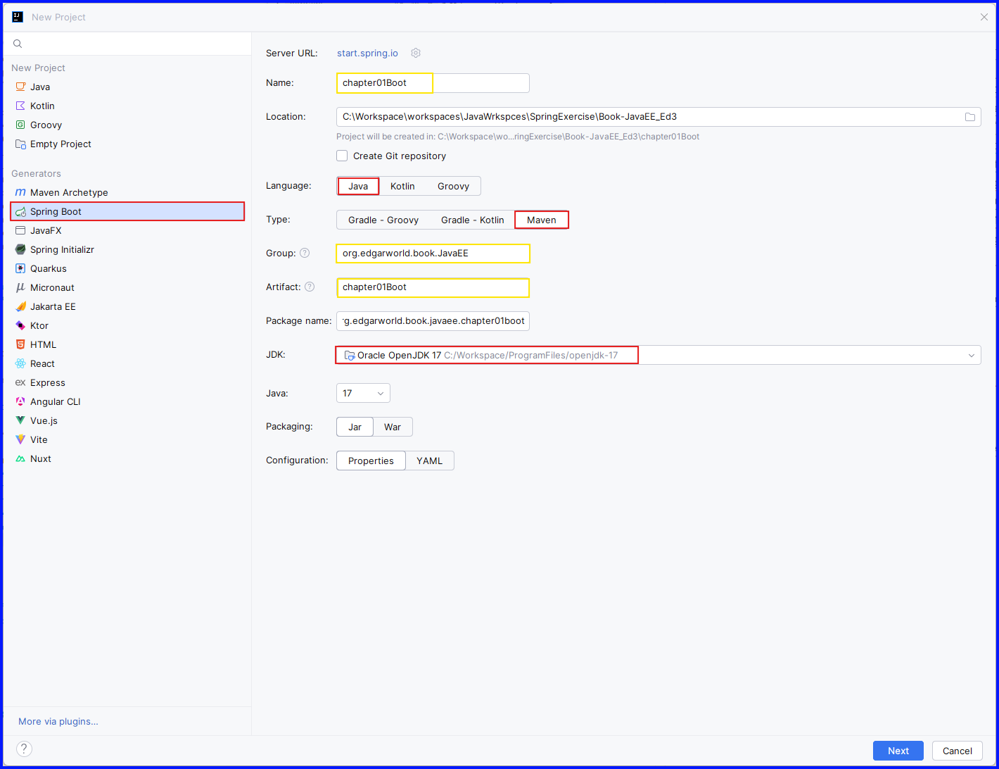

## Develop Environment

+ IDE: 

  + About

    ```text
    IntelliJ IDEA 2026.1
    Build #IU-261.22158.277, built on March 25, 2026
    Source revision: 89c647576f1d2
    Licensed to Trial User
    Subscription is active until May 13, 2026.
    Runtime version: 25.0.2+1-b329.72 amd64137.0.17-261-b65
    VM: OpenJDK 64-Bit Server VM by JetBrains s.r.o.
    Toolkit: sun.awt.windows.WToolkit
    Windows 11.0
    Exception reporter ID: 24032619524298a-bc8d-4329-bbde-474211fefe90
    GC: G1 Young Generation, G1 Concurrent GC, G1 Old Generation
    Memory: 2048M
    Cores: 20
    Registry:
      ide.experimental.ui=true
      trace.state.event.service.url=https://api.jetbrains.cloud/trace-status
    Non-Bundled Plugins:
      intellij.jupyter (261.22158.354)
      com.intellij.spring (261.22158.354)
      Subversion (261.22158.354)
      hg4idea (261.22158.185)
      IdeaVIM (2.30.0)
      PerforceDirectPlugin (261.22158.185)
      Docker (261.22158.299)
      com.jetbrains.plugins.webDeployment (261.22158.299)
      org.jetbrains.plugins.remote-run (261.22158.354)
    Kotlin: 261.22158.277-IJ
    ```

  + plugins

## 《Java核心编程 12Ed / 机械工业出版社 / ISBN:978-7-111-70641-0》

## 《Java EE企业级应用开发教程（Spring+Spring MVC+MyBatis）（第3版）/ 人民邮电出版社 / ISBN:978-7-115-66565-2》

[bilibili视频教程](https://www.bilibili.com/video/BV1BzwSzoEfq?spm_id_from=333.788.videopod.episodes&vd_source=38fc599412349dcfe60484e3ff320c66)

### 章节1.3 项目

#### Spring Boot

+ 步骤
  + 创建项目，并引入依赖
    
    + Project
      + Generators: "Spring Boot"
      + Project Details
        + Server URL: "start.spring.io"
        + Name: "chapter01Boot"
        + Location: "C:\Workspace\workspaces\JavaWrkspces\SpringExercise\Book-JavaEE_Ed3"
        + Language: "Java"
        + Type: "Maven"
        + Group: "org.edgarworld.book.JavaEE"
        + Artifact: "chapter01Boot"
        + Package name: "org.edgarworld.book.javaee.chapter01"
        + JDK: "Oracle Open JDK 17"("C:/Workspace/ProgramFiles/openjdk-17")
        + Java: 17
        + Packaging: "Jar"
        + Configuration: "Properties"
      + Dependencies:
        + Developer Tools
          + Spring Boot DevTools
          + Lombok
          + Spring Configuration Processor

      + 图示
        + [Diagram]
          

    + 配置构建文件

      + 修改"pom.xml"

        + ~~添加"\<dependency>\</dependency>"~~
  
          + [code]
  
            ```xml
            <dependency>
              <groupId>org.springframework</groupId>
              <artifactId>spring-context</artifactId>
              <version>6.1.4</version>
            </dependency>
            ```

        + 自动生成
          
          + [code]
            ```xml
            <dependencies>
                <dependency>
                    <groupId>org.springframework.boot</groupId>
                    <artifactId>spring-boot-starter</artifactId>
                </dependency>
        
                <dependency>
                    <groupId>org.springframework.boot</groupId>
                    <artifactId>spring-boot-devtools</artifactId>
                    <scope>runtime</scope>
                    <optional>true</optional>
                </dependency>
                <dependency>
                    <groupId>org.projectlombok</groupId>
                    <artifactId>lombok</artifactId>
                    <optional>true</optional>
                </dependency>
                <dependency>
                    <groupId>org.springframework.boot</groupId>
                    <artifactId>spring-boot-starter-test</artifactId>
                    <scope>test</scope>
                </dependency>
            </dependencies>
            ```

  + 自定义 接口 和 实现类
    + 创建 
      + [package] "org.edgarworld.book.javaee.dao"
        + [interface] UserDao.java
          + 说明
          + 代码
            + [code]
              ```java
              package java.edgarworld.book.javaee.dao;

              public interface UserDao {
                  public void save();
              }
              ```
        + [Impl-class] UserDaoImpl.java
          + 说明
          + 代码
            + [code]

              ```java
              package java.edgarworld.book.javaee.dao;
              
              public class UserDaoImpl implements UserDao {
                  @Override
                  public void save() {
                      System.out.println("UserDao save method running! ");
                  }
              }
              ```          

  + 创建配置文件并配置Bean
    [Empty]
  + 定义测试类
    [Empty]

## [黑马程序员教材研究院 / Spring Boot企业开发教程](https://www.bilibili.com/video/BV1XQw7ztEYe/?spm_id_from=333.788.recommend_more_video.6&trackid=web_related_0.router-related-2479604-tn27s.1776311514157.524&vd_source=38fc599412349dcfe60484e3ff320c66)

### 章节1.2.2 项目

#### Spring Boot

+ 步骤

  + 创建项目
    + Generators: "Spring Initializr"

    + Project
      + Name: "chapter01BootB"
      + Location: "C:\Workspace\workspaces\JavaWrkspces\SpringExercise\Book-JavaEE_Ed3"
      + Language: "Java"
      + Type: "Maven"
      + Group: "org.edgarworld.book.JavaEE"
      + Artifact: "chapter01BootB"
      + Package name: "org.edgarworld.book.javaee.chapter01bootb"
      + JDK: "17 _Oracle OpenJDK 17_"
      + Java: "17 - Sealed types, always-strict floating-pint semantics"
      + Packaging: "Jar"

    + Version: "4.0.5" 
    + Dependencies
      + Developer Tools
        + [X] Spring Boot DevTools
        + [X] Lombok
        + [X] Spring Configuration Processor
      + Web
        + [X] Spring Web

  + Settings
    + Maven
      + [X] Execute goals recursively
      + Output level: Info
      + Checksum policy: No Global Policy
      + Multiproject build fail policy: Default
      + Thread count: '  ' -T option
      + Maven home path: "Use Maven wrapper"
      + User settings file: "C:\Workspace\Data\Maven\settings.xml"
      + Local repository: "C:\Workspace\Data\Maven\repository"

## 参考

+ [jetbrains.com.cn](https://www.jetbrains.com.cn/)
  + [JVM 框架]()
    + [Spring]()
      + [Spring Boot](https://www.jetbrains.com.cn/help/idea/spring-boot.html)