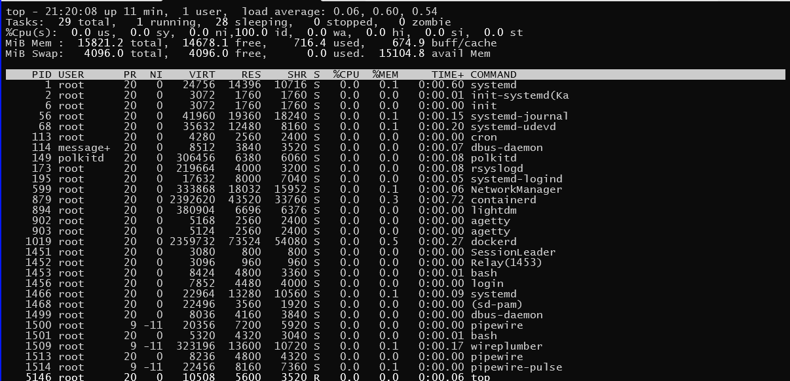

# Linux命令

## Overview

### 命令示例

`command [options] [op-objects]`
+ ex `ls -lah /home ./`

  + "command": `ls`

  + "options": "-lah"

  + "op-objects": "/home ./"


## Command List

### "alias"

#### Desc

#### Help

#### Notes

#### Example & Exercise

#### Others

=== === ===

### "cal"

#### Desc

#### Help

#### Notes

#### Example & Exercise

#### Others

=== === ===

### "cd"

#### Desc
change Directory

#### Help

#### Notes

#### Example & Exercise

#### Others

=== === ===

### "chmod"

#### Desc
change mode

#### Help

#### Notes

#### Example & Exercise

#### Others

=== === ===

### "chown"

#### Desc
change owner

#### Help

#### Notes

#### Example & Exercise

#### Others

=== === ===

### "clear"

#### Desc
清屏

#### Help

+ [operating]

  ```sh
  ┌──(edgar㉿ThinkPadT14P-23)-[/mnt/c/Workspace]
  └─$ clear --help
  clear: invalid option -- '-'
  Usage: clear [options]
  
  Options:
    -T TERM     use this instead of $TERM
    -V          print curses-version
    -x          do not try to clear scrollback
  
  ┌──(edgar㉿ThinkPadT14P-23)-[/mnt/c/Workspace]
  └─$
  ```

#### Notes

#### Example & Exercise

#### Others

=== === ===

### "crontab"

#### Desc

#### Help

+ [operating]

  ```sh
  ┌──(edgar㉿ThinkPadT14P-23)-[/mnt/c/Workspace]
  └─$ crontab --help
  crontab: invalid option -- '-'
  crontab: usage error: unrecognized option
  usage:  crontab [-u user] [-n] file
          crontab [ -u user ] [ -i ] { -e | -l | -r }
  
          -h      (displays this help message)
  
          file    (default operation is replace, per 1003.2)
          -n      (dry run: checks the syntax, then bails out)
          -u user (choose the user whose crontab is touched)
  
          -e      (edit user's crontab)
          -l      (list user's crontab)
          -r      (delete user's crontab)
  
          -i      (prompt before deleting user's crontab)
  
  ┌──(edgar㉿ThinkPadT14P-23)-[/mnt/c/Workspace]
  └─$
  ```

#### Notes
+ 任务格式

  + 表格
  
    + [table]
  
      | 字段   | 分    | 时     | 日    | 月    | 周    | 命令   |
      | :---- | :---- | :---- | :---- | :---- | :---- | :---- |
      | 范围   | 0-59  | 0-23  | 1-31  | 1-12  | 0-7   |       |
  
      + week
        + 0/7 Sun  
        + 1-5 Mon ~ Fri  
        + 6   Sat  


+ 常用参数
  + `-l`  
    罗列现有任务
  
  + `-i`
    删除任务，提示确认
  
  + `-r`  
    删除任务
  
  + `-e`
    添加任务

#### Example & Exercise

+ NJCB示例1

  + [code]

    ```sh  
    #Xfunds_PMFXSpot
    05 20 * * 1-5 sh /home/summit/EOD/crontab/crtb_xfdsPMFxspot_GenReport.sh
    00 05 * * 1-5 sh /home/summit/EOD/crontab/crtb_xfdsPMFxspot_Upload.sh
    30 08 * * 1-5 sh /home/summit/EOD/crontab/crtb_xfdsPMFxspot_SendSMS.sh
    ```
  
    1. 周一至周五，每天 20:05 执行报表生成脚本
    2. 周一至周五，每天 05:50 执行报表上传脚本
    3. 周一至周五，每天 08:30 执行消息发送脚本

#### Others

=== === ===

### "cp"

#### Desc

#### Help

#### Notes

#### Example & Exercise

#### Others

=== === ===

### "date"

#### Desc

#### Help

#### Notes

#### Example & Exercise

+ 显示日期
  + [operating]

    ```sh
    # date
    Sat Dec 13 01:06:43 AM CST 2025
    ```

  + 日期格式化

    + [operating]

      ```sh
      # date +%y%m%d
      251213
      
      # date +%Y%m%d
      20251213
      
      # date +%Y-%m-%d
      2025-12-13
      ```

    + [operating]

      ```sh
      # date +%D
      12/13/25
      # date +%m/%d/%y
      12/13/25
      ```

      `date +%D` <==> `date +%m/%d/%y`

+ 日期计算

  + [operating]

    ```sh
    # date -d "2 day" +%Y-%m-%d
    2025-12-15
    
    # date -d "-2 day" +%Y-%m-%d
    2025-12-11
    ```

  + [operating]

    ```sh
    # date -d "20260301 -2 day" +%Y-%m-%d
    2026-02-27
    
    # date -d "20280301 -2 day" +%Y-%m-%d
    2028-02-28
    ```
  
  + [operating]

    ```sh
    # date -d "20280301 -2 day" +%w
    1
    ```

    1 for Monday

+ 设置日期
  + [operating]

    ```sh
    # date -s 250325
    ```

    设置当前日期为 2025 Mar 25

#### Others

=== === ===

### "dd"

#### Desc

#### Help

#### Note

#### Example & Exercise

#### Other

=== === ===

### "df"

#### Desc

+ Full Name: report file system disk space usage

#### Help

+ [operating]

  ```sh
  [root@ThinkPadT14P-23 Workspace]# df --help
  Usage: df [OPTION]... [FILE]...
  Show information about the file system on which each FILE resides,
  or all file systems by default.
  
  Mandatory arguments to long options are mandatory for short options too.
    -a, --all             include pseudo, duplicate, inaccessible file systems
    -B, --block-size=SIZE  scale sizes by SIZE before printing them; e.g.,
                             '-BM' prints sizes in units of 1,048,576 bytes;
                             see SIZE format below
        --direct          show statistics for a file instead of mount point
    -h, --human-readable  print sizes in powers of 1024 (e.g., 1023M)
    -H, --si              print sizes in powers of 1000 (e.g., 1.1G)
    -i, --inodes          list inode information instead of block usage
    -k                    like --block-size=1K
    -l, --local           limit listing to local file systems
        --no-sync         do not invoke sync before getting usage info (default)
        --output[=FIELD_LIST]  use the output format defined by FIELD_LIST,
                                 or print all fields if FIELD_LIST is omitted.
    -P, --portability     use the POSIX output format
        --sync            invoke sync before getting usage info
        --total           elide all entries insignificant to available space,
                            and produce a grand total
    -t, --type=TYPE       limit listing to file systems of type TYPE
    -T, --print-type      print file system type
    -x, --exclude-type=TYPE   limit listing to file systems not of type TYPE
    -v                    (ignored)
        --help     display this help and exit
        --version  output version information and exit
  
  Display values are in units of the first available SIZE from --block-size,
  and the DF_BLOCK_SIZE, BLOCK_SIZE and BLOCKSIZE environment variables.
  Otherwise, units default to 1024 bytes (or 512 if POSIXLY_CORRECT is set).
  
  The SIZE argument is an integer and optional unit (example: 10K is 10*1024).
  Units are K,M,G,T,P,E,Z,Y (powers of 1024) or KB,MB,... (powers of 1000).
  
  FIELD_LIST is a comma-separated list of columns to be included.  Valid
  field names are: 'source', 'fstype', 'itotal', 'iused', 'iavail', 'ipcent',
  'size', 'used', 'avail', 'pcent', 'file' and 'target' (see info page).
  
  GNU coreutils online help: <https://www.gnu.org/software/coreutils/>
  Full documentation at: <https://www.gnu.org/software/coreutils/df>
  or available locally via: info '(coreutils) df invocation'
  [root@ThinkPadT14P-23 Workspace]#
  ```

#### Notes

#### Example & Exercise

+ 示例

  + [operating]

    ```sh
    [root@ThinkPadT14P-23 Workspace]# df -h
    Filesystem      Size  Used Avail Use% Mounted on
    none            7.8G     0  7.8G   0% /usr/lib/modules/6.6.87.    2-microsoft-standard-WSL2
    none            7.8G  4.0K  7.8G   1% /mnt/wsl
    drivers         953G  628G  326G  66% /usr/lib/wsl/drivers
    /dev/sdd       1007G  4.1G  952G   1% /
    none            7.8G   76K  7.8G   1% /mnt/wslg
    none            7.8G     0  7.8G   0% /usr/lib/wsl/lib
    rootfs          7.8G  2.7M  7.8G   1% /init
    none            7.8G     0  7.8G   0% /dev
    none            7.8G  8.5M  7.8G   1% /run
    none            7.8G     0  7.8G   0% /run/lock
    none            7.8G     0  7.8G   0% /run/shm
    none            7.8G   76K  7.8G   1% /mnt/wslg/versions.txt
    none            7.8G   76K  7.8G   1% /mnt/wslg/doc
    C:\             953G  628G  326G  66% /mnt/c
    tmpfs           1.6G  4.0K  1.6G   1% /run/user/0
    [root@ThinkPadT14P-23 Workspace]#
    ```

#### Others

=== === ===

### "dir"

#### Desc

#### Help

#### Notes

#### Example & Exercise

#### Others

=== === ===

### "dirname"

#### Desc

#### Help

#### Notes

#### Example & Exercise

#### Others

=== === ===

### "du"

#### Desc

#### Help

+ [operating]

  ```sh
  [root@ThinkPadT14P-23 Workspace]# du --help
  Usage: du [OPTION]... [FILE]...
    or:  du [OPTION]... --files0-from=F
  Summarize disk usage of the set of FILEs, recursively for directories.
  
  Mandatory arguments to long options are mandatory for short options too.
    -0, --null            end each output line with NUL, not newline
    -a, --all             write counts for all files, not just directories
        --apparent-size   print apparent sizes, rather than disk usage; although
                            the apparent size is usually smaller, it may be
                            larger due to holes in ('sparse') files, internal
                            fragmentation, indirect blocks, and the like
    -B, --block-size=SIZE  scale sizes by SIZE before printing them; e.g.,
                             '-BM' prints sizes in units of 1,048,576 bytes;
                             see SIZE format below
    -b, --bytes           equivalent to '--apparent-size --block-size=1'
    -c, --total           produce a grand total
    -D, --dereference-args  dereference only symlinks that are listed on the
                            command line
    -d, --max-depth=N     print the total for a directory (or file, with --all)
                            only if it is N or fewer levels below the command
                            line argument;  --max-depth=0 is the same as
                            --summarize
        --files0-from=F   summarize disk usage of the
                            NUL-terminated file names specified in file F;
                            if F is -, then read names from standard input
    -H                    equivalent to --dereference-args (-D)
    -h, --human-readable  print sizes in human readable format (e.g., 1K 234M 2G)
        --inodes          list inode usage information instead of block usage
    -k                    like --block-size=1K
    -L, --dereference     dereference all symbolic links
    -l, --count-links     count sizes many times if hard linked
    -m                    like --block-size=1M
    -P, --no-dereference  don't follow any symbolic links (this is the default)
    -S, --separate-dirs   for directories do not include size of subdirectories
        --si              like -h, but use powers of 1000 not 1024
    -s, --summarize       display only a total for each argument
    -t, --threshold=SIZE  exclude entries smaller than SIZE if positive,
                            or entries greater than SIZE if negative
        --time            show time of the last modification of any file in the
                            directory, or any of its subdirectories
        --time=WORD       show time as WORD instead of modification time:
                            atime, access, use, ctime or status
        --time-style=STYLE  show times using STYLE, which can be:
                              full-iso, long-iso, iso, or +FORMAT;
                              FORMAT is interpreted like in 'date'
    -X, --exclude-from=FILE  exclude files that match any pattern in FILE
        --exclude=PATTERN    exclude files that match PATTERN
    -x, --one-file-system    skip directories on different file systems
        --help     display this help and exit
        --version  output version information and exit
  
  Display values are in units of the first available SIZE from --block-size,
  and the DU_BLOCK_SIZE, BLOCK_SIZE and BLOCKSIZE environment variables.
  Otherwise, units default to 1024 bytes (or 512 if POSIXLY_CORRECT is set).
  
  The SIZE argument is an integer and optional unit (example: 10K is 10*1024).
  Units are K,M,G,T,P,E,Z,Y (powers of 1024) or KB,MB,... (powers of 1000).
  
  GNU coreutils online help: <https://www.gnu.org/software/coreutils/>
  Full documentation at: <https://www.gnu.org/software/coreutils/du>
  or available locally via: info '(coreutils) du invocation'
  [root@ThinkPadT14P-23 Workspace]#
  ```

#### Notes

#### Example & Exercise

+ 示例

  + [operating]

    ```sh
    [root@ThinkPadT14P-23 Workspace]# du -sh /mnt/c/Workspace/
    514G    /mnt/c/Workspace/
    [root@ThinkPadT14P-23 Workspace]#
    ```

#### Others

=== === ===

### "echo"

#### Desc

#### Help

#### Notes

#### Example & Exercise

#### Others

=== === ===

### "file"

#### Desc

#### Help

#### Notes

#### Example & Exercise

#### Others

=== === ===

### "find"

#### Desc

#### Help

#### Notes

#### Example & Exercise

#### Others

=== === ===

### "free"

#### Desc

#### Help

+ [operating]

  ```sh
  root@ThinkPadT14P-23 Workspace]# free --help
  
  Usage:
   free [options]
  
  Options:
   -b, --bytes         show output in bytes
       --kilo          show output in kilobytes
       --mega          show output in megabytes
       --giga          show output in gigabytes
       --tera          show output in terabytes
       --peta          show output in petabytes
   -k, --kibi          show output in kibibytes
   -m, --mebi          show output in mebibytes
   -g, --gibi          show output in gibibytes
       --tebi          show output in tebibytes
       --pebi          show output in pebibytes
   -h, --human         show human-readable output
       --si            use powers of 1000 not 1024
   -l, --lohi          show detailed low and high memory statistics
   -t, --total         show total for RAM + swap
   -s N, --seconds N   repeat printing every N seconds
   -c N, --count N     repeat printing N times, then exit
   -w, --wide          wide output
  
       --help     display this help and exit
   -V, --version  output version information and exit
  
  For more details see free(1).
  [root@ThinkPadT14P-23 Workspace]#
  ```

#### Notes

#### Example & Exercise

+ 示例

  + [operating]

    ```sh
    [root@ThinkPadT14P-23 Workspace]# free -h
                  total        used        free      shared  buff/cache   available
    Mem:           15Gi       789Mi        14Gi        11Mi       332Mi        14Gi
    Swap:         4.0Gi          0B       4.0Gi
    [root@ThinkPadT14P-23 Workspace]#
    ```

#### Others

=== === ===

### "getfacl"

#### Desc

#### Help

#### Notes

#### Example & Exercise

#### Others

=== === ===

### "head"

#### Desc

#### Help

#### Notes

#### Example & Exercise

#### Others

=== === ===

### "help"

#### Desc

#### Help

#### Notes

#### Example & Exercise

#### Others

=== === ===

### "history"

#### Desc

#### Help

#### Notes

#### Example & Exercise

#### Others

=== === ===

### "host"

#### Desc

#### Help

#### Notes

#### Example & Exercise

#### Others

=== === ===

### "hostname"

#### Desc

#### Help

#### Notes

#### Example & Exercise

#### Others

=== === ===

### "ifconfig"

#### Desc

#### Help

#### Notes

#### Example & Exercise

#### Others

=== === ===

### "ip"

#### Desc

#### Help

#### Notes

#### Example & Exercise

#### Others

=== === ===

### "ls"

#### Desc
List Directory Contents

#### Help

#### Notes

#### Example & Exercise

+ 命令实例

  + 查找最后日期的目录
  
    原有目录结构
    ... ... 2026-01-23 20:35 20260122
    ... ... 2026-01-23 21:07 20260123
    ... ... 2026-01-26 09:26 20260126
  
    要获取 20260126目录 所描述的日期  
  
    ```sh
    asofday=$(ls -ltF | grep /$ | head -1)
    asofday=${asofday:0:8}
    echo ${asofday}
    ```
    
    返回 20260126  

#### others

=== === === 

### "lsof"

#### Desc

#### Help

#### Notes

#### Example & Exercise

+ 示例

  + [operating]

    ```sh
    [root@ThinkPadT14P-23 Workspace]# lsof -i:3306
    COMMAND PID  USER   FD   TYPE DEVICE SIZE/OFF NODE NAME
    mysqld  124 mysql   24u  IPv6  18505      0t0  TCP *:mysql (LISTEN)
    [root@ThinkPadT14P-23 Workspace]#
    ```

#### Others

=== === ===

### "man"

#### Desc

#### Help

#### Notes

#### Example & Exercise

#### Others

=== === ===

### "mkdir"

#### Desc
Make Directory

#### Help

#### Notes

+ 常用参数

  + `-p`

#### Example & Exercise

#### Others

=== === ===

### "mv"

#### Desc

#### Help

#### Notes

#### Example & Exercise

#### Others

=== === ===

### "netstat"

#### Desc

#### Help

#### Notes

+ 常用参数
  + `-a`, all
  
  + `-l`, long listing name
  
  + `-h`, 以可读性较高的方式展示
  
  + `-t`, 按时间排序
  
  + `-r`, 反向排序


#### Example & Exercise

#### Others

=== === ===

### "pkill"

#### Desc

#### Help

#### Notes

#### Example & Exercise

#### Others

=== === ===

### "ps"

#### Desc

#### Help

#### Notes

#### Example & Exercise

+ 示例 `-elf` 选项

  + [code]
    ```sh
    ps -elf
    ```
  + 列明细
    + ~~列号 - 列名~~
    + " 1"-"F",
    + " 2"-"S",
    + " 3"-"UID", 用户
    + " 4"-"PID", 进程
    + " 5"-"PPID", 父进程
    + " 6"-"C",
    + " 7"-"PRI",
    + " 8"-"NI",
    + " 9"-"ADDR",
    + "10"-"SZ",
    + "11"-"WCHAN",
    + "12"-"STIME", start time 进程启动时间
    + "13"-"TTY", - 终端
    + "14"-"TIME", - cpu占用时间
    + "15"-"CMD", command 命令

+ 示例 `-aux` 选项

  + [code]
    ```sh
    ps -aux
    ```
  + 列明细
    + ~~列号 - 列名~~
    + " 1"-"USER",
    + " 2"-"PID",
    + " 3"-"%CPU",
    + " 4"-"%MEM",
    + " 5"-"VSZ", 虚拟内存
    + " 6"-"RSS", 常驻内存
    + " 7"-"TTY", 终端
    + " 8"-"STAT", 运行状态
      + R, Running
      + S, Sleeping
      + D, Uninterruptible Sleep
      + T, Stopped
      + Z, Zombied
      + X, Dead
      + I, Idle 空闲
      + P, Paging 分页
  
    + " 9"-"START",
    + "10"-"TIME",
    + "11"-"COMMAND",

+ 实例 1, 内存排序前20, "-rnk 4"针对第4列进行排序

  + [code]

    ```sh
    ps -aux | sort -rnk 4 | head -20
    ```

+ 实例 2, CPU占用前20, "-rnk 3"针对第3列进行排序

  + [code]

    ```sh
    ps -aux | sort -rnk 3 | head -20
    ```

+ 实例 3, 每隔1分钟打印所有java进程信息

  + [code]

    ```sh
    for ((;;)) do ps -aux | grep -v grep | grep -i java; sleep 60; done
    ```

  + [code]

    ```sh
    for ((;;)) do clear; ps -aux | grep -v grep | grep -i java; date; sleep 60; done
    ```

#### Others

+ windows `tasklist`

  + [operating]

    ```cmd
    for /L %N in () do cls & tasklist | findstr /i java & TIMEOUT /T 30 /NOBREAK
    ```

=== === ===

### "pwd"

#### Desc
Print current Working Directory

#### Help

#### Notes

#### Example & Exercise

#### Others

=== === ===

### "reboot"

#### Desc

#### Help

#### Notes

#### Example & Exercise

#### Others

=== === ===

### "rm"

#### Desc
Remove, 删除文件/目录

#### Help

#### Notes

+ 常用参数

  + `-r`

  + `-f`

#### Example & Exercise

#### Others

=== === ===

### "shutdown"

#### Desc
系统关闭

#### Help

#### Notes

+ 常用参数

  + `  ` `--help`
  + `-H` `--halt`    , Halt the machine
  + `-P` `--poweroff`
  + `-r` `--reboot`
  + `-h`             , Equivalent to `--poweroff`, overridden by `--halt`
  + `-k`             , Don't halt/power-off/reboot, just send warnings
  + `  ` `--no-wall` , Don't send wall message before halt/power-off/reboot
  + `-c`             , Cancel a pending shutdown
  + `  ` `--show`    , Show pending shutdown

#### Example & Exercise

+ 示例 1

  + [operating]
    
    ```sh
    shutdown -h 20
    ```

#### Others
+ windows `shutdown`
  + 常用参数
    + "/r" 重启, "/s" 关机, "/h" 休眠/挂起
    + "/f" 强制
    + "/t 1200" 等待1200秒之后执行

  + 示例
    + [operating]

      ```cmd
      shutdown /r /f /t 1200
      ```


=== === ===

### "split"

#### Desc
分割文件

#### Help

#### Notes

#### Example & Exercise

#### Others

=== === ===

### "tail"

#### Desc

#### Help

#### Notes

#### Example & Exercise

#### Others

=== === ===

### "tar"

#### Desc

#### Help

+ [operating]

  ```sh
  [edgar@ThinkPadT14P-23 Downloads]$ tar --help
  Usage: tar [OPTION...] [FILE]...
  GNU 'tar' saves many files together into a single tape or disk archive, and can
  restore individual files from the archive.
  
  Examples:
    tar -cf archive.tar foo bar  # Create archive.tar from files foo and bar.
    tar -tvf archive.tar         # List all files in archive.tar verbosely.
    tar -xf archive.tar          # Extract all files from archive.tar.
  
   Local file name selection:
  
        --add-file=FILE        add given FILE to the archive (useful if its name
                               starts with a dash)
    -C, --directory=DIR        change to directory DIR
        --exclude=PATTERN      exclude files, given as a PATTERN
        --exclude-backups      exclude backup and lock files
        --exclude-caches       exclude contents of directories containing
                               CACHEDIR.TAG, except for the tag file itself
        --exclude-caches-all   exclude directories containing CACHEDIR.TAG
        --exclude-caches-under exclude everything under directories containing
                               CACHEDIR.TAG
        --exclude-ignore=FILE  read exclude patterns for each directory from
                               FILE, if it exists
        --exclude-ignore-recursive=FILE
                               read exclude patterns for each directory and its
                               subdirectories from FILE, if it exists
        --exclude-tag=FILE     exclude contents of directories containing FILE,
                               except for FILE itself
        --exclude-tag-all=FILE exclude directories containing FILE
        --exclude-tag-under=FILE   exclude everything under directories
                               containing FILE
        --exclude-vcs          exclude version control system directories
        --exclude-vcs-ignores  read exclude patterns from the VCS ignore files
        --no-null              disable the effect of the previous --null option
        --no-recursion         avoid descending automatically in directories
        --no-unquote           do not unquote input file or member names
        --no-verbatim-files-from   -T treats file names starting with dash as
                               options (default)
        --null                 -T reads null-terminated names; implies
                               --verbatim-files-from
        --recursion            recurse into directories (default)
    -T, --files-from=FILE      get names to extract or create from FILE
        --unquote              unquote input file or member names (default)
        --verbatim-files-from  -T reads file names verbatim (no escape or option
                               handling)
    -X, --exclude-from=FILE    exclude patterns listed in FILE
  
   File name matching options (affect both exclude and include patterns):
  
        --anchored             patterns match file name start
        --ignore-case          ignore case
        --no-anchored          patterns match after any '/' (default for
                               exclusion)
        --no-ignore-case       case sensitive matching (default)
        --no-wildcards         verbatim string matching
        --no-wildcards-match-slash   wildcards do not match '/'
        --wildcards            use wildcards (default)
        --wildcards-match-slash   wildcards match '/' (default for exclusion)
  
   Main operation mode:
  
    -A, --catenate, --concatenate   append tar files to an archive
    -c, --create               create a new archive
    -d, --diff, --compare      find differences between archive and file system
        --delete               delete from the archive (not on mag tapes!)
    -r, --append               append files to the end of an archive
    -t, --list                 list the contents of an archive
        --test-label           test the archive volume label and exit
    -u, --update               only append files newer than copy in archive
    -x, --extract, --get       extract files from an archive
  
   Operation modifiers:
  
        --check-device         check device numbers when creating incremental
                               archives (default)
    -g, --listed-incremental=FILE   handle new GNU-format incremental backup
    -G, --incremental          handle old GNU-format incremental backup
        --hole-detection=TYPE  technique to detect holes
        --ignore-failed-read   do not exit with nonzero on unreadable files
        --level=NUMBER         dump level for created listed-incremental archive
    -n, --seek                 archive is seekable
        --no-check-device      do not check device numbers when creating
                               incremental archives
        --no-seek              archive is not seekable
        --occurrence[=NUMBER]  process only the NUMBERth occurrence of each file
                               in the archive; this option is valid only in
                               conjunction with one of the subcommands --delete,
                               --diff, --extract or --list and when a list of
                               files is given either on the command line or via
                               the -T option; NUMBER defaults to 1
        --sparse-version=MAJOR[.MINOR]
                               set version of the sparse format to use (implies
                               --sparse)
    -S, --sparse               handle sparse files efficiently
  
   Overwrite control:
  
    -k, --keep-old-files       don't replace existing files when extracting,
                               treat them as errors
        --keep-directory-symlink   preserve existing symlinks to directories when
                               extracting
        --keep-newer-files     don't replace existing files that are newer than
                               their archive copies
        --no-overwrite-dir     preserve metadata of existing directories
        --one-top-level[=DIR]  create a subdirectory to avoid having loose files
                               extracted
        --overwrite            overwrite existing files when extracting
        --overwrite-dir        overwrite metadata of existing directories when
                               extracting (default)
        --recursive-unlink     empty hierarchies prior to extracting directory
        --remove-files         remove files after adding them to the archive
        --skip-old-files       don't replace existing files when extracting,
                               silently skip over them
    -U, --unlink-first         remove each file prior to extracting over it
    -W, --verify               attempt to verify the archive after writing it
  
   Select output stream:
  
        --ignore-command-error ignore exit codes of children
        --no-ignore-command-error   treat non-zero exit codes of children as
                               error
    -O, --to-stdout            extract files to standard output
        --to-command=COMMAND   pipe extracted files to another program
  
   Handling of file attributes:
  
        --atime-preserve[=METHOD]   preserve access times on dumped files, either
                               by restoring the times after reading
                               (METHOD='replace'; default) or by not setting the
                               times in the first place (METHOD='system')
        --clamp-mtime          only set time when the file is more recent than
                               what was given with --mtime
        --delay-directory-restore   delay setting modification times and
                               permissions of extracted directories until the end
                               of extraction
        --group=NAME           force NAME as group for added files
        --group-map=FILE       use FILE to map file owner GIDs and names
        --mode=CHANGES         force (symbolic) mode CHANGES for added files
        --mtime=DATE-OR-FILE   set mtime for added files from DATE-OR-FILE
    -m, --touch                don't extract file modified time
        --no-delay-directory-restore
                               cancel the effect of --delay-directory-restore
                               option
        --no-same-owner        extract files as yourself (default for ordinary
                               users)
        --no-same-permissions  apply the user's umask when extracting permissions
                               from the archive (default for ordinary users)
        --numeric-owner        always use numbers for user/group names
        --owner=NAME           force NAME as owner for added files
        --owner-map=FILE       use FILE to map file owner UIDs and names
    -p, --preserve-permissions, --same-permissions
                               extract information about file permissions
                               (default for superuser)
        --same-owner           try extracting files with the same ownership as
                               exists in the archive (default for superuser)
    -s, --preserve-order, --same-order
                               member arguments are listed in the same order as
                               the files in the archive
        --sort=ORDER           directory sorting order: none (default), name or
                               inode
  
   Handling of extended file attributes:
  
        --acls                 Enable the POSIX ACLs support
        --no-acls              Disable the POSIX ACLs support
        --no-selinux           Disable the SELinux context support
        --no-xattrs            Disable extended attributes support
        --selinux              Enable the SELinux context support
        --xattrs               Enable extended attributes support
        --xattrs-exclude=MASK  specify the exclude pattern for xattr keys
        --xattrs-include=MASK  specify the include pattern for xattr keys
  
   Device selection and switching:
  
    -f, --file=ARCHIVE         use archive file or device ARCHIVE
        --force-local          archive file is local even if it has a colon
    -F, --info-script=NAME, --new-volume-script=NAME
                               run script at end of each tape (implies -M)
    -L, --tape-length=NUMBER   change tape after writing NUMBER x 1024 bytes
    -M, --multi-volume         create/list/extract multi-volume archive
        --rmt-command=COMMAND  use given rmt COMMAND instead of rmt
        --rsh-command=COMMAND  use remote COMMAND instead of rsh
        --volno-file=FILE      use/update the volume number in FILE
  
   Device blocking:
  
    -b, --blocking-factor=BLOCKS   BLOCKS x 512 bytes per record
    -B, --read-full-records    reblock as we read (for 4.2BSD pipes)
    -i, --ignore-zeros         ignore zeroed blocks in archive (means EOF)
        --record-size=NUMBER   NUMBER of bytes per record, multiple of 512
  
   Archive format selection:
  
    -H, --format=FORMAT        create archive of the given format
  
   FORMAT is one of the following:
  
      gnu                      GNU tar 1.13.x format
      oldgnu                   GNU format as per tar <= 1.12
      pax                      POSIX 1003.1-2001 (pax) format
      posix                    same as pax
      ustar                    POSIX 1003.1-1988 (ustar) format
      v7                       old V7 tar format
  
        --old-archive, --portability
                               same as --format=v7
        --pax-option=keyword[[:]=value][,keyword[[:]=value]]...
                               control pax keywords
        --posix                same as --format=posix
    -V, --label=TEXT           create archive with volume name TEXT; at
                               list/extract time, use TEXT as a globbing pattern
                               for volume name
  
   Compression options:
  
    -a, --auto-compress        use archive suffix to determine the compression
                               program
    -I, --use-compress-program=PROG
                               filter through PROG (must accept -d)
    -j, --bzip2                filter the archive through bzip2
    -J, --xz                   filter the archive through xz
        --lzip                 filter the archive through lzip
        --lzma                 filter the archive through xz --format=lzma
        --lzop                 filter the archive through lzop
        --no-auto-compress     do not use archive suffix to determine the
                               compression program
    -z, --gzip, --gunzip, --ungzip   filter the archive through gzip
    -Z, --compress, --uncompress   filter the archive through compress
  
   Local file selection:
  
        --backup[=CONTROL]     backup before removal, choose version CONTROL
    -h, --dereference          follow symlinks; archive and dump the files they
                               point to
        --hard-dereference     follow hard links; archive and dump the files they
                               refer to
    -K, --starting-file=MEMBER-NAME
                               begin at member MEMBER-NAME when reading the
                               archive
        --newer-mtime=DATE     compare date and time when data changed only
    -N, --newer=DATE-OR-FILE, --after-date=DATE-OR-FILE
                               only store files newer than DATE-OR-FILE
        --one-file-system      stay in local file system when creating archive
    -P, --absolute-names       don't strip leading '/'s from file names
        --suffix=STRING        backup before removal, override usual suffix ('~'
                               unless overridden by environment variable
                               SIMPLE_BACKUP_SUFFIX)
  
   File name transformations:
  
        --strip-components=NUMBER   strip NUMBER leading components from file
                               names on extraction
        --transform=EXPRESSION, --xform=EXPRESSION
                               use sed replace EXPRESSION to transform file
                               names
  
   Informative output:
  
        --checkpoint[=NUMBER]  display progress messages every NUMBERth record
                               (default 10)
        --checkpoint-action=ACTION   execute ACTION on each checkpoint
        --full-time            print file time to its full resolution
        --index-file=FILE      send verbose output to FILE
    -l, --check-links          print a message if not all links are dumped
        --no-quote-chars=STRING   disable quoting for characters from STRING
        --quote-chars=STRING   additionally quote characters from STRING
        --quoting-style=STYLE  set name quoting style; see below for valid STYLE
                               values
    -R, --block-number         show block number within archive with each message
  
        --show-defaults        show tar defaults
        --show-omitted-dirs    when listing or extracting, list each directory
                               that does not match search criteria
        --show-snapshot-field-ranges
                               show valid ranges for snapshot-file fields
        --show-transformed-names, --show-stored-names
                               show file or archive names after transformation
        --totals[=SIGNAL]      print total bytes after processing the archive;
                               with an argument - print total bytes when this
                               SIGNAL is delivered; Allowed signals are: SIGHUP,
                               SIGQUIT, SIGINT, SIGUSR1 and SIGUSR2; the names
                               without SIG prefix are also accepted
        --utc                  print file modification times in UTC
    -v, --verbose              verbosely list files processed
        --warning=KEYWORD      warning control
    -w, --interactive, --confirmation
                               ask for confirmation for every action
  
   Compatibility options:
  
    -o                         when creating, same as --old-archive; when
                               extracting, same as --no-same-owner
  
   Other options:
  
    -?, --help                 give this help list
        --restrict             disable use of some potentially harmful options
        --usage                give a short usage message
        --version              print program version
  
  Mandatory or optional arguments to long options are also mandatory or optional
  for any corresponding short options.
  
  The backup suffix is '~', unless set with --suffix or SIMPLE_BACKUP_SUFFIX.
  The version control may be set with --backup or VERSION_CONTROL, values are:
  
    none, off       never make backups
    t, numbered     make numbered backups
    nil, existing   numbered if numbered backups exist, simple otherwise
    never, simple   always make simple backups
  
  Valid arguments for the --quoting-style option are:
  
    literal
    shell
    shell-always
    shell-escape
    shell-escape-always
    c
    c-maybe
    escape
    locale
    clocale
  
  *This* tar defaults to:
  --format=gnu -f- -b20 --quoting-style=escape --rmt-command=/etc/rmt
  --rsh-command=/usr/bin/ssh
  [edgar@ThinkPadT14P-23 Downloads]$
  ```

#### Notes

+ 常用参数

  + "-x" 解压
  + "-v" 显示过程
  + "-f" 指定文件名
  + "-C" 目标目录
  + "-z" 处理gzip压缩
  + "-j" 处理".tar.gz"文件
  + "-k" 防止覆盖

#### Example & Exercise

+ 检查 .tar.xz 文件

  + 方式 1, "tar -tJf ..." / "tar -tJvf ..."

    + [code]

      ```sh
      tar -tJf Python-3.13.13.tar.xz
      tar -tJf Python-3.14.4.tar.xz
      ```

    + [code]

      ```sh
      tar -tJvf Python-3.13.13.tar.xz
      tar -tJvf Python-3.14.4.tar.xz
      ```

  + 方式 2, "xz -d -c ... | tar -tvf -"

    + [code]
  
      ```sh
      xz -d -c Python-3.13.13.tar.xz | tar -tvf -
      xz -d -c Python-3.14.4.tar.xz | tar -tvf -
      ```

+ 解压 .tar.xz 文件

  + 方式 2, 指定 目标目录

    + [code]

      ```sh
      cd /home/edgar
      tar -xf Downloads/Python-3.13.13.tar.xz -C SoftwarePackages/
      ```


#### Others

=== === ===

### "tee"

#### Desc

#### Help

#### Notes

#### Example & Exercise

#### Others

=== === ===

### "time"

#### Desc
计算程序运行时间

#### Help

#### Notes

#### Example & Exercise

#### Others

=== === ===

### "timeout"

#### Desc
须在指定时间(秒)内完成

#### Help

#### Notes

#### Example & Exercise

+ 示例 1

  + [operating]

    ```sh
    timeout 900 ping baidu.com
    ```

#### Others

=== === ===

### "top"

#### Desc

#### Help

+ [operating]

  ```sh
  ┌──(edgar㉿ThinkPadT14P-23)-[/mnt/c/Workspace]
  └─$ top --help
  
  Usage:
   top [options]
  
  Options:
   -b, --batch-mode                run in non-interactive batch mode
   -c, --cmdline-toggle            reverse last remembered 'c' state
   -d, --delay =SECS [.TENTHS]     iterative delay as SECS [.TENTHS]
   -E, --scale-summary-mem =SCALE  set mem as: k,m,g,t,p,e for SCALE
   -e, --scale-task-mem =SCALE     set mem with: k,m,g,t,p for SCALE
   -H, --threads-show              show tasks plus all their threads
   -i, --idle-toggle               reverse last remembered 'i' state
   -n, --iterations =NUMBER        exit on maximum iterations NUMBER
   -O, --list-fields               output all field names, then exit
   -o, --sort-override =FIELD      force sorting on this named FIELD
   -p, --pid =PIDLIST              monitor only the tasks in PIDLIST
   -S, --accum-time-toggle         reverse last remembered 'S' state
   -s, --secure-mode               run with secure mode restrictions
   -U, --filter-any-user =USER     show only processes owned by USER
   -u, --filter-only-euser =USER   show only processes owned by USER
   -w, --width [=COLUMNS]          change print width [,use COLUMNS]
   -1, --single-cpu-toggle         reverse last remembered '1' state
  
   -h, --help                      display this help text, then exit
   -V, --version                   output version information & exit
  
  For more details see top(1).
  
  ┌──(edgar㉿ThinkPadT14P-23)-[/mnt/c/Workspace]
  └─$
  ```

#### Notes

+ 汇总信息缺省显示

  + [diagram]
    
    
  + "top", 运行的命令  

    "21:20:08", 系统时间  
    "up 11 min", 系统已启动 11 分钟  
    "1 user", 1个登录用户  
    "load average: 0.06, 0.60, 0.54"  

  + "Tasks:"  
    任务汇总信息:  
    "29 total", 共 29 个任务  
    "1 running", 1 个运行任务  
    "28 sleeping", 28 个休眠任务  
    "0 stopped", 0 个停止任务  
    "0 zombie", 0 个僵尸进程  
  
  + "%Cpu(s):"
    CPU信息：  
  
  + "MiB Mem:"
  
  + "MiB Swap:" 

  + 进程明细
    + PID
    
    + USER
    
    + PR
    
    + NI
    
    + VIRT
    
    + RES
    
    + SHR
    
    + S
    
    + %CPU
    
    + %MEM
    
    + TIME+
    
    + COMMAND
 

+ Top命令


#### Example & Exercise

#### Others

=== === ===

### "touch"

#### Desc

#### Help

#### Notes

#### Example & Exercise

#### Others

=== === ===

### "tree"

#### Desc

#### Help

#### Notes

#### Example & Exercise

#### Others

=== === ===

### "uptime"

#### Desc

#### Help

#### Notes

#### Example & Exercise

#### Others

=== === ===

### "unalias"

#### Desc

#### Help

#### Notes

#### Example & Exercise

#### Others

=== === ===

### "w"

#### Desc

#### Help

#### Notes

#### Example & Exercise

#### Others

=== === ===

### "wc"

#### Desc

#### Help

#### Notes

+ 常用参数

  + `-l`, line counts
  + `-w`, word counts
  + `-c`, byte counts
  + `-m`, character counts

#### Example & Exercise

#### Others

=== === ===

### "who"

#### Desc

#### Help

#### Notes

#### Example & Exercise

#### Others

