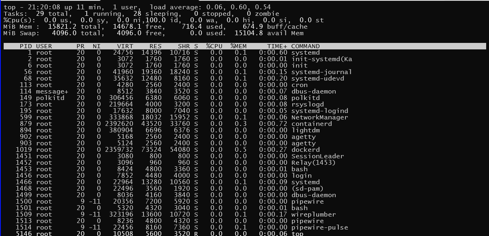
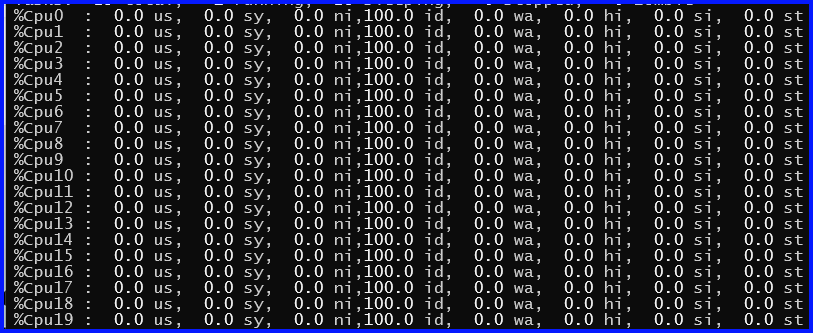

# linux命令

## Overview

`command [options] [op-objects]`
+ ex `ls -lah /home ./`

  + "command": `ls`

  + "options": "-lah"

  + "op-objects": "/home ./"

## linux command list

### `alias`

### `cd`

**C**hange **D**irectory

### `chmod`

### `chown`

### `contab`

+ `-l`  
  罗列现有任务

+ `-i`
  删除任务，提示确认

+ `-r`  
  删除任务

#### 任务格式

| 字段   | 分    | 时     | 日    | 月    | 周    | 命令   |
| :---- | :---- | :---- | :---- | :---- | :---- | :---- |
| 范围   | 0-59  | 0-23  | 1-31  | 1-12  | 0-7   |       |

0/7 Sun  
1-5 Mon ~ Fri  
6   Sat  

#### 示例

+ NJCB示例1
  ```sh  
  #Xfunds_PMFXSpot
  05 20 * * 1-5 sh /home/summit/EOD/crontab/crtb_xfdsPMFxspot_GenReport.sh
  00 05 * * 1-5 sh /home/summit/EOD/crontab/crtb_xfdsPMFxspot_Upload.sh
  30 08 * * 1-5 sh /home/summit/EOD/crontab/crtb_xfdsPMFxspot_SendSMS.sh
  ```

  1. 周一至周五，每天 20:05 执行报表生成脚本
  2. 周一至周五，每天 05:50 执行报表上传脚本
  3. 周一至周五，每天 08:30 执行消息发送脚本

### `cp`

+ "-r"

### `date`

+ 显示日期
  + 实例 1

    ```bash
    # date
    Sat Dec 13 01:06:43 AM CST 2025
    ```

  + 实例 2

    ```bash
    # cal 02 2028
       February 2028
    Su Mo Tu We Th Fr Sa
           1  2  3  4  5
     6  7  8  9 10 11 12
    13 14 15 16 17 18 19
    20 21 22 23 24 25 26
    27 28 29
    ```

  + 日期格式化

    + 实例 1

      ```bash
      # date +%y%m%d
      251213
      
      # date +%Y%m%d
      20251213
      
      # date +%Y-%m-%d
      2025-12-13
      ```

    + 实例 2

      ```sh
      # date +%D
      12/13/25
      # date +%m/%d/%y
      12/13/25
      ```

      `date +%D` <==> `date +%m/%d/%y`

+ 日期计算

  + 实例 1

    ```bash
    # date -d "2 day" +%Y-%m-%d
    2025-12-15
    
    # date -d "-2 day" +%Y-%m-%d
    2025-12-11
    ```

  + 实例 2

    ```bash
    # date -d "20260301 -2 day" +%Y-%m-%d
    2026-02-27
    
    # date -d "20280301 -2 day" +%Y-%m-%d
    2028-02-28
    ```
  
  + 实例 3

    ```bash
    # date -d "20280301 -2 day" +%w
    1
    ```

    1 for Monday

+ 设置日期

  ```bash
  # date -s 250325
  ```

  设置当前日期为 2025 Mar 25

#### windows下

+ `date /T` <==> `echo %date%`

+ `time /T` <==> `echo %time%`

### `dd`

读取、转换和输出数据

### `df`

### `dirname`

### `file`

### `find`

文件/目录查找

### `echo`

### `getfacl`

### `head`

见 `tail` 命令

### `help`

### `history`

### `host`

### `hostname`

### `ifconfig`

### `ip`

### `kill`

### `ls`

**L**i**S**t directory contents

### `man`

### `mkdir`

**M**ake **D**irectory.

+ "-p"

### `mv`

### `netstat`

#### options

+ "-a", all

+ "-l", long listing name

+ "-h", 以可读性较高的方式展示

+ "-t", 按时间排序

+ "-r", 反向排序

### `pkill`

### `ps`

#### 命令实例

+ `-elf` 选项

  ```sh
  ps -elf
  ```
  
  + ~~列号 - 列名~~
  + " 1"-"F",
  + " 2"-"S",
  + " 3"-"UID", 用户
  + " 4"-"PID", 进程
  + " 5"-"PPID", 父进程
  + " 6"-"C",
  + " 7"-"PRI",
  + " 8"-"NI",
  + " 9"-"ADDR",
  + "10"-"SZ",
  + "11"-"WCHAN",
  + "12"-"STIME", start time 进程启动时间
  + "13"-"TTY", - 终端
  + "14"-"TIME", - cpu占用时间
  + "15"-"CMD", command 命令

+ `-aux` 选项

  ```sh
  ps -aux
  ```
  
  + ~~列号 - 列名~~
  + " 1"-"USER",
  + " 2"-"PID",
  + " 3"-"%CPU",
  + " 4"-"%MEM",
  + " 5"-"VSZ", 虚拟内存
  + " 6"-"RSS", 常驻内存
  + " 7"-"TTY", 终端
  + " 8"-"STAT", 运行状态
    + R, Running
    + S, Sleeping
    + D, Uninterruptible Sleep
    + T, Stopped
    + Z, Zombied
    + X, Dead
    + I, Idle 空闲
    + P, Paging 分页

  + " 9"-"START",
  + "10"-"TIME",
  + "11"-"COMMAND",

  实例 1, 内存排序前20, "-rnk 4"针对第4列进行排序

  ```sh
  ps -aux | sort -rnk 4 | head -20
  ```

  实例 2, CPU占用前20, "-rnk 3"针对第3列进行排序

  ```sh
  ps -aux | sort -rnk 3 | head -20
  ```

  实例 3, 每隔1分钟打印所有java进程信息

  ```sh
  for ((;;)) do ps -aux | grep -v grep | grep -i java; sleep 60; done
  ```

  或

  ```sh
  for ((;;)) do clear; ps -aux | grep -v grep | grep -i java; date; sleep 60; done
  ```

#### windows

`tasklist`

```cmd
for /L %N in () do cls & tasklist | findstr /i java & TIMEOUT /T 30 /NOBREAK
```

### `pwd`

**P**rint current **W**orking **D**irectory

### `reboot` 

### `rm`

**R**e**M**ove.

+ "-r"

+ "-f", force, 强制删除

### `shutdown`

+ "  " "--help"
+ "-H" "--halt", Halt the machine
+ "-P" "--poweroff"
+ "-r" "--reboot"
+ "-h" "        ", Equivalent to `--poweroff`, overridden by `--halt`
+ "-k" "        ", Don't halt/power-off/reboot, just send warnings
+ "  " "--no-wall", Don't send wall message before halt/power-off/reboot
+ "-c" "        ", Cancel a pending shutdown
+ "  " "--show", Show pending shutdown

```sh
shutdown -h 20
```

20分钟后，系统关机。

#### windows

```cmd
shutdown /r /f /t 1200
```

+ "/r" 重启, "/s" 关机, "/h" 休眠/挂起
+ "/f" 强制
+ "/t 1200" 等待1200秒之后执行

### `split`

示例: `split -l 行数 文件名`

### `tail`

### `tar`

### `tee`

### `time`

计算程序运行时间

如, `time date`

### `timeout`

须在指定时间(秒)内完成。 如 `timeout 900 ping baidu.com`

### `top`

#### 汇总信息缺省显示



+ "top", 运行的命令  

  "21:20:08", 系统时间  
  "up 11 min", 系统已启动 11 分钟  
  "1 user", 1个登录用户  
  "load average: 0.06, 0.60, 0.54"  

+ "Tasks:"  
  任务汇总信息:  
  "29 total", 共 29 个任务  
  "1 running", 1 个运行任务  
  "28 sleeping", 28 个休眠任务  
  "0 stopped", 0 个停止任务  
  "0 zombie", 0 个僵尸进程  

+ "%Cpu(s):"
  CPU信息：  

+ "MiB Mem:"

+ "MiB Swap:"  

##### TOP Command

+ Key"1"
  
  

+ Key"2"

  

#### 进程信息缺省显示

+ PID

+ USER

+ PR

+ NI

+ VIRT

+ RES

+ SHR

+ S

+ %CPU

+ %MEM

+ TIME+

+ COMMAND

### `touch`

### `tree`

### `uptime`

```sh
# uptime
 22:57:54 up 0 min,  1 user,  load average: 0.00, 0.00, 0.00

```

### `unalias`

### `vi` & `vim`

[vi/vim学习笔记](./vim-operatings.md)

#### "Normal-mode" {k[Esc] ? k[Esc] * 2}

#### "Insert-mode" {k[i]}

#### "Command-mode" {k[:], k[/]}

#### "Visual-mode" {k[v], k[V], k[Ctrl+v]}

### `w`

### `wc`

+ 参数"-l", line counts

+ 参数"-w", word counts

+ 参数"-c", byte counts

+ 参数"-m", character counts

### `who`
