# Overview

+ 应用
  + 联机事务处理 online transaction processing
  + 数据分析 data analytics

+ 目的

  + 非数据库系统的问题

    + 数据冗余和不一致性 -- data redundancy and inconsistency
    + 数据访问困难 -- difficulty in accessing data
    + 数据孤立 -- data isolation
    + 完整性 和 一致性 -- integrity & consistency constraint
    + 原子性 -- atomicity
    + 并发访问异常 -- concurrent-access anomaly
    + 安全性 -- security 

+ 数据视图

  + 数据模型 -- data model
    + 关系模型 -- relational model
    + 实体-联系模型 -- entity-relationship model, ER
    + 半结构化数据模型 -- semi-structured data model
    + 基于对象数据模型 -- object-based data model
  + 关系数据模型
  + 数据抽象 -- data abstraction
    + 物理层 -- physical level
      数据是怎样存储的，详细描述复杂的底层数据结构。
    + 逻辑层 -- logical level
      描述存储了什么样的数据，以及这些数据的关系。  
      具有物理独立性。  
    + 视图层 -- view level
      描述数据库的某个部分。  

+ 实例(database instance) 和 模式(database schema)
  + 数据库模式， 数据库的逻辑设计

    + 模式图 schema diagram

  + 数据库实例， 给定时刻数据库中数据的一个快照

+ 数据库语言

  + 数据库定义语言 -- data-definition language, DDL
    + 数据存储和定义 -- data storage and definition
      + 域约束 -- domain constratint, 如 字段数据类型 等
      + 引用完整性 -- referential integrity  
      + 授权 -- authorization
        + 读权限 -- read authorization
        + 插入权限 -- insert authorization
        + 更新权限 -- update authorization
        + 删除权限 -- delete authorization
        + 数据字段 和 元数据 -- data dictionary & metadata
  + 数据库操纵语言 -- data-manipulation language, DML

    + 过程化DML -- procedural DML
    + 声明式DML -- declarative DML

    + 关系查询语言 -- query language

      + 命令式查询语言 imperative query language
      + 函数式查询语言 functional query language
        + 关系代数 relational-algebra
          + 选择 select

            + 代数表示

              + [Diagram]
                

            + SQL
              + [code]

                ```sql
                select * 
                from instructor 
                where dept_name = 'Physics'
                  and salary > 9000;
                ```

          + 投影 project

            + 代数表示

              + [Diagram]
                

            + SQL
              + [code]

                ```sql
                select ID, name, salary
                from instructor 
                where dept_name = 'Physics'
                  and salary > 9000;
                ```

          + 笛卡尔积 Cartesian-product

            + 代数表示
              + [Diagram]
                

            + SQL
              + [code]

                ```sql
                select *
                from instructor, teaches
                where instructor.ID = teaches.ID;
                ```


          + 连接 Join

            + 代数表示
              + [Diagram]
                

            + SQL
              + [code]
                ```sql
                select *
                from instructor join teaches
                on instructor.ID = teaches.ID;
                ```
                

          + 集合

            + 合 union
              + 代数表示
                + [Diagram]
                  + 
              + SQL
                + [code]
                  ```sql
                  select * from section where semester='Fall' and year=2017
                  union all
                  select * from section where semester='Spring' and year=2018;
                  ```

            + 交 intersection
              + 代数表示
                + [Diagram]
                  + 
              + SQL
                + [code]
                  ```sql
                  ```

            + 差 set-difference
              + 代数表示
                + [Diagram]
                  + 
              + SQL
                + [code]
                  ```sql
                  ```

          + 赋值

          + 更名

          + 聚集

          + 等价查询


      + 声明式查询语言 declarative query language

+ 数据库引擎

  + 存储管理器 -- storage manager

    + 组成
      + 权限即完整性管理器 -- authorization and integrity manager
      + 事务管理器 -- transaction manager
      + 文件管理器 -- file manager
      + 缓冲区管理器 -- buffer manager

    + 数据结构
      + 数据文件 -- data file
      + 数据字典 -- data dictionary
        存储数据结构的元数据，尤其是数据库模式
      + 索引 -- index
  
  + 查询处理器 -- query processor

    + DDL解释器 -- DDL interpreter
    + DML编译器 -- DML compiler
      + 查询优化 -- query optimization
    + 查询执行引擎 -- query evaluation engine

  + 事务管理
    + 事务，原子性和一致性的单元，即一组操作要么全部执行，要么全部不执行
    + 恢复管理器
    + 并发控制器

# 数据库概念

+ 概念

  + 关系数据库
    + 产品
      MySQL, Oracle, DB2, MS SQLServer, SyBase, etc.

    + 数据表/关系

    + 行/元组

    + 列/属性

  + 非关系型数据库， NoSql(Not Only SQL)

    + 产品
      Redis, MongoDB, Memcached, HBase, etc.

+ 关系数据库 Database -- 关联表(database tables)的集合
  
  + 简单概念
    + Data, 对客观事物进行描述并可以鉴别的符号(抽象)。
    + Database
    + RDBMS (Relational Database Management System), 关系数据库管理系统
    + DBAS (Database Application System) 数据库应用程序/系统
    + DBA (Database Administrator) 数据库管理员
      + 职责
        + 模式定义 -- schema definition
        + 存储结构和存取方法定义 -- storage structure and access-method definition
        + 模式及物理组织修改 -- schema and physical-organization modification
        + 数据访问授权 -- granting of authorization for data access
        + 日常维护 -- routine maintenance

  + 数据表, Database Table, 数据的矩阵

    + 列, column, 包含相同类型的数据
    + 行 / 元组 / 记录, row, 一组相关的数据
      + 表头, header, 列的名称
    + 主键, PK (Primary Key)

      + Problems / Questions

        + 自增主键问题

          + 描述: 为什么**不**推荐使用数据库自增主键，也不推荐UUID，雪花算法简论

          + 解释/解决
            + 自增主键问题
              + 在分库分表时会有问题
                + 单表时，可以有独立(唯一)ID
                + 横向分表时，每个逻辑子表都有一个自增主键，不能保证唯一
                  + 使用步长增加ID，在扩容时会有问题
                    ==> UUID
            + UUID
              + InnoDB的索引结构
                + B+-Tree 索引即数据，数据即索引。主键索引树的叶子节点，会保存完整的行数据
                  + UUID负面影响
                    + UUID较长，占用空间更大大，Page(内存磁盘交换使用，空间固定)占用更多，索引树高度高，遍历次数越多，遍历Page更多，IO更多，影响IO性能
                    + UUID是无序的，非趋势递增；但主键是有序的，需要排序。插入数据时，需要树的分裂与合并。
                      ==> 雪花算法
            + 雪花算法
              + 组成 (64位二进制 转化为 十进制ID)
                + 1 bit Sign
                + 41 bit timestamp
                + 10 bit MachineID
                + 12 bit SequenceID
              + Problems
                + 时间回拨问题
                  + 问题
                    + 不再趋势递增
                    + 时间戳重复
                  + 解决
                    + 抛出异常，牺牲可用性
                    + 等待时间恢复，(回拨时间跨度大?须:需) 设置等待时间
                    + 备用方式生成

                + 机器码问题
                  + 原因: 机器集群
                  + 解决
                    + 配置文件管理
                    + 服务注册组件，使用服务ID
                + 序列号一直为0的问题
                  + 原因: 同一机器同一时间并发，序列号才递增。大部分场景，不会触发这一机制。
                  + 问题: 分库分表时，因取模，导致数据偏移(末尾为0，取模后为偶数，导致奇数表中    无数据)，数据不均匀/数据倾斜
                  + 解决：
                    + 当序列号为0时，使用时间戳的最后一位

    + 外键, FK (Foreign Key),  
    + 复合建, ,
    + 索引, Index, MySQL
      排好顺序的数据结构。

      + 索引术语

        + 覆盖索引
          + 说明
            查询只需访问索引，无需访问数据行

      + 分类 1， 索引性质

        + 主键索引
          + 说明
            + 唯一且非空，一个表只能有一个
        + 唯一索引
          + 说明
            + 值不能重复
            + 可以为空
        + 普通索引
        + 联合索引
          + 说明
            + 多列组合的索引
            + 注意列的顺序
        + 全文索引
          + 说明
            + 针对长文本字段
        + 空间索引
          + 说明
            + 专门为空间数据做区域距离查询准备

      + 分类 2， 数据结构角度

        + B+树索引
          + 说明
            + 默认
            + 适用: 范围查询、排序、聚合；
        + 哈希索引
          + 说明
            + 适用: 等值查询; **不**支持范围查询；
        + 倒排索引
          + 说明
            + 适用: 全文搜索，先分词再查找；
        + R树索引
          + 说明
            + 适用: 多维空间数据专用；

      + 分类 3， 从InnoDB的B+树实现

        + 聚簇索引
          + 说明
            + 主键索引，叶子节点直接存完整数据行
        + 非聚簇索引
          + 说明
            + 叶子节点只保存索引列和主键值，要查全行，得先回表到聚簇索引再取一次

      + ~~二叉树~~

        + 缺点
          + 如果插入顺序不理想，树容易长歪

      + ~~B树索引~~

        + B树

        + B树索引
          + 说明
            所有的值是按顺序存储的，并且每个叶子到根的距离相同；  
            B树索引，存储引擎不再需要进行全表扫描来获取数据

          + 示例
            + 图例
              + [Diagram]
                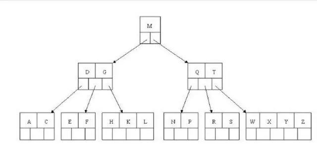

            + 过程 查找E
              1. 和 根节点M 比较， E < M, 搜索左侧分支
              2. 和 一级节点 D|G 比较， D < E < M, 搜索中间节点
              3. 和 二级节点 E|F 比较， E = E， 返回 E 的关键字和指针信息
              4. 通过指针信息找出记录的全行信息

      + B+树索引

        + B树 vs. B+树
          + 图例
            + [Diagram]
              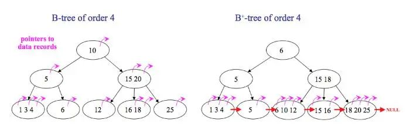
          + 区别
            + B树中无重复元素，B+树有
            + B树中间节点会存储数据指针信息，B+树只在叶子节点中才存储
            + B+树的每个叶子节点都有一个指针指向下一片叶子，把所有叶子链在一起
          + B+树优点
            + 中间节点不存储指针，同样的页可以保存更多的节点，树的总高度小，（数据量相同的情况下，B+树比B树更加矮胖，）效率更高。
            + B+树只在叶子才能获取数据，而B树可以在中间节点获取，所以B+树查询时间更稳定
            + B+树每个叶子都有指向下一叶子的指针，方便范围查询和全表查询；而B树须做中序遍历。

        + B+树
          + 结构

            + 示例
              + 图例
                + [Diagram]
                  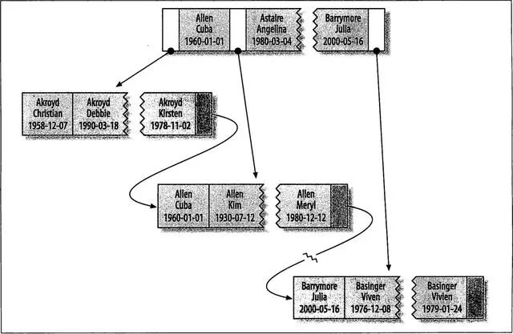

              + 表结构
                + [code]

                  ```sql
                  create table Student(
                    last_name varchar(50) not null,
                    first_name varchar(50) not null,
                    birth_date date not null,
                    gender int(2) not null,
                    key (last_name, first_name, birth_date)
                  );
                  ```

                  `Index{last_name, first_name, birth_date}`

              + 过程 

          + 查询效率 `O(log n)`
          + 特点 (i.e. B+树优点)
            + 所有的值都存储在叶子节点
            + 多路平衡树 一般只有3~4层
            + 叶子节点间使用指针相连，可高效遍历
            + 全值匹配 和索引中所有的列进行匹配，如上例中，查找{"name":"Cuba Allen", "BirthDate":"1960-Jan-01"}  
            + 匹配最左前缀，索引的第一列， 如上例中，查找{"last_name":"Allen"} 
            + 匹配列前缀，某列值开始的部分， 如上例中，查找{"last_name":"J*"}，即，以J开头为姓的人
            + 匹配范围值，如上例中，查找{"last_name":"Allen" ~ "Barrymore"}，即，姓在 Allen 和 Barrymore 之间的人
            + 精确匹配某一列，且范围匹配另一列，如上例中，查找{"last_name":"Allen", "last_name":"K*"}，即，姓为Allen，名以K开头的人
            + 只访问索引的查询，即覆盖索引。

          + 查询建议
            + 尽量从左到右依次使用联合索引的列匹配条件

          + 限制
            + 如果不是按照索引的最左列开始查找，无法使用索引。例如上面例子中的索引无法用于查找某个特定生日的人，因为生日不是最左数据列。也不能查找last_name以某个字母结尾的人。
            + 不能跳过索引的列。上述索引无法用于查找last_name为Smith并且某个特定生日的人。如果不指定first_name，则mysql只能使用索引的第一列。
            + 如果查询中有某个列的范围查询，则右边所有的列都无法使用索引优化查找。例如查询WHERE last_name=’Smith’ AND first_name LIKE ‘J%’ AND birthday=‘1996-05-19’，这个查询只能使用索引的前两列。

      + Hash索引
        + 说明
          哈希索引，只有精确匹配索引所有列的查询才有效。  
          对于每一行数据，存储引擎都会对所有的索引列计算一个哈希码。哈希索引将所有的哈希码存储在索引中，同时在哈希表中保存指向每个数据行的指针。  
          如果多个列的哈希值相同，索引会以链表的方式存放多个指针记录到同一个哈希条目中。
        + 特点
          因为索引自身只存储对应的哈希值，所以索引的结构十分紧凑，哈希索引查找的速度非常快。
        + 限制
          + 哈希索引不是按照索引顺序存储的，无法用于排序。
          + 不支持部分索引列匹配查找。
          + 不支持范围查找。

      + 聚集索引/主键索引

        + 说明
          + 每个存储引擎为InnoDB的表都有一个特殊的索引，即聚集索引。  
          + 聚集索引并非单独的索引类型，而是数据存储方式。  
          + 当数据表有聚集索引时，数据行实际上存放在叶子页中。  
          + 一个表不可能有两个地方存放数据，所以一个表只能有一个聚集索引。  
          + 存储引擎负责实现索引，所以不是所有的存储引擎都支持聚集索引。 InnoDB表中聚集索引的索引列就是主键，所以也叫主键索引

        + 结构

          + 图例

            + [Diagram]
              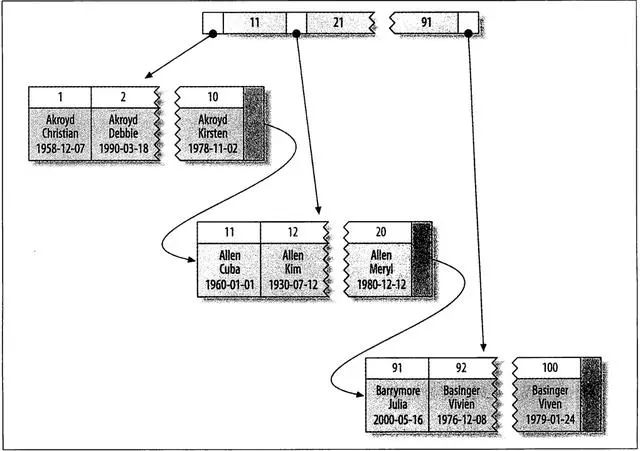

          + 表结构

            + [code]

              ```sql
              create table Student(
                id int(11) primary key auto_increment,
                last_name varchar(50) not null,
                first_name varchar(50) not null,
                birth_date not null
              );
              ```

      + 非聚簇索引/二级索引  
        + 说明
          + 对于InnoDB表，在非主键列的其他列上建的索引，即为二级索引。
          + 二级索引可以是 0..N 个
          + 二级索引的节点页只保存 {索引列的值(同聚集索引) + 对应主键值}

        + 结构

          + 表结构

            + 图例
              + [Diagram]
                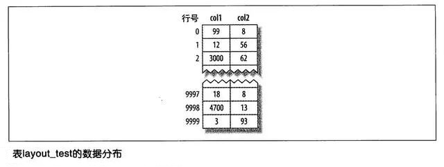

            + 表结构
              + [code]

                ```sql
                create table layout_test (
                  col1 int(11) primary key,
                  col2 int(11) not null,
                  key(col2)
                )
                ```

        + 比较
  
          + InnoDB vs. MyISAM
  
            + InnoDB
  
              + 主键索引
  
                + 图示
  
                  + [Diagram]
                    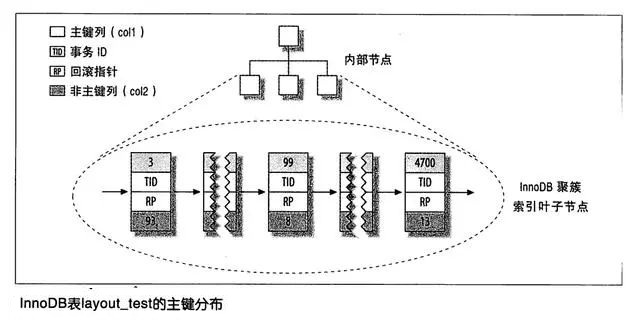
  
              + 二级索引
  
                + 图示
  
                  + [Diagram]
                    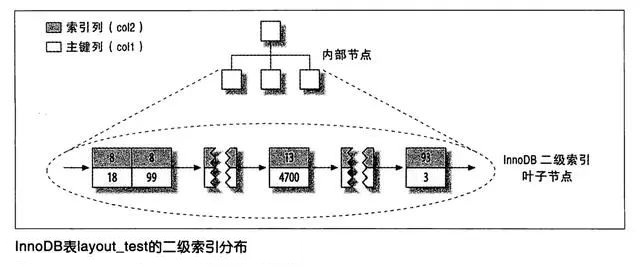
  
                + 说明
                  + 二级索引叶子节点保存了主键，类似指针而非通常保存的下一叶子的地址 
                    + 保存主键值而非指针，占用了更多空间 
                    + 减少了行移动和数据页分裂时的二级索引维护工作，因为是主键而非指针，无需修改
  
            + MyISAM

              + 主键索引
  
                + 图示
  
                  + [Diagram]
                    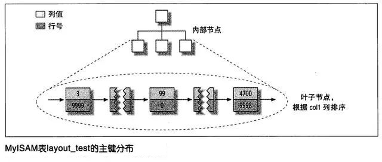
  
              + 二级索引
  
                + 图示
  
                  + [Diagram]
                    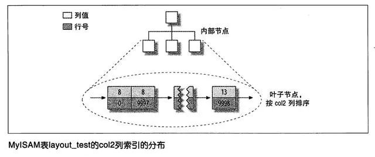
  
                + 说明
                  + 二级索引和主键索引无区别
  
            + 比较

              + 图示
    
                + [Diagram]
                  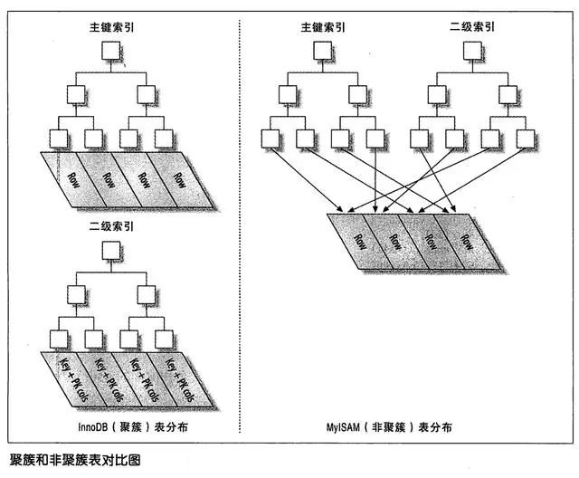
    
              + 聚集索引的优点：
    
                + 可以把相关数据保存在一起，例如实现电子邮箱时，根据用户ID来聚集数据，读取少数的数据页就能获取某个用户的全部邮件。
                + 聚集索引将索引和数据保存在同一个B树中，因此从聚集索引中获取数据比在非聚集索引中要快一些。
    
              + 聚集索引的缺点：
    
                + 插入速度严重依赖插入顺序。按照主键的顺序插入是加载数据到InnoDB表中速度最快的方式。
                  假如磁盘中的某一个已经存满了，但是新增的行要插入到这一页当中，存储引擎就会把该页分裂成两个页面来容纳该行，这就是一次页分裂操作。页分裂会导致表占用更多的磁盘空间。
                + 更新聚集索引列的代较很高，会强制InnoDB将每个被更新的行移动到新的位置。
                + 用二级索引访问数据需要两个索引查找，不是一次。因为要先从二级索引的叶子节点获得主键值，再根据这主键去聚集索引中查到对应的行，所以需要两次B树查找。

        + B+-Tree vs. Hash
          + 表格
            + [Table]

              | 特性 | B+树 | Hash表 |
              | :---- | :---- | :---- |
              | 查找 | O(log n) | O(1) |
              | 范围查询 | 支持 | 不支持 |
              | 顺序访问 | 支持 | 不支持 |
              | 磁盘IO  | 少   | 多，容易冲突 |

  + 冗余, redundancy, 存储多倍数据， 冗余降低了_性能_，但提高了_安全性_

  + Normal form - 范式
    + 示意图
      + [Diagram]
        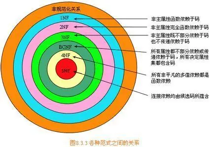

    + 码，足以区分实体(记录)的属性或属性集/组。
      一个元组(行)的所有属性必须能唯一标识元组。即，不能出现两个元组的属性完全相同。

      + 超码 superkey
        一个或多个属性，将这些属性组合在一起可以在一个关系(表)中唯一标识一个元组(行)。
      + 候选码 candidate key
        最小的超码  
      + 主码 primary key / 主码约束 primary key constraint
        数据库设计者选出的候选码  
      + 外码 foreign key / 外码约束 foreign key constraint / 被引用关系 referenced relation
        + 引用完整性 referential integrity constraint

    + 1NF - 第一范式
      + 定义: 所有域都是原子性的，即数据库表的每一列都是不可分割的原子数据项
      + 示例
        + 错误

          + [Table]

            | reader_id | name | Dept_id | Book | Borrowing_Date | Return_date |
            | :-------- | :---- | :---- | :---- | :------------: | :---------: |
            | 001       | Bob   | 100   | 101 DB Conceptions | 2021/08/20 |  |
            | 002       | Auth  | 200   | 102 C++ Programing | 2021/08/21 |  |

          + 说明
            Book字段可以拆分为 Book_ID 和 Book_Name

        + 纠正

          + [Table]

            | reader_id | name | Dept_id | Book_ID | Book_Name | Borrowing_Date | Return_date |
            | :-------- | :---- | :---- | :---- | :---- | :------------: | :---------: |
            | 001       | Bob   | 100   | 101 | DB Conceptions | 2021/08/20 |  |
            | 002       | Auth  | 200   | 102 | C++ Programing | 2021/08/21 |  |


    + 2NF - 第二范式
      + 定义: 在1NF的基础上，非码属性必须完全依赖于候选码（在1NF基础上消除非主属性对主码的部分函数依赖）
      + 要求: 数据库表中的每个实例或记录必须可以被唯一地区分。选取一个能区分每个实体的**属性**或**属性组**，作为实体的唯一标识。
      + 示例
        + 错误
        + 纠正

      + Problems

        + 数据冗余
        + 操作(更新、插入、删除)异常


    + 3NF - 第三范式
      + 定义: 在2NF基础上，任何非主属性不依赖于其它非主属性（在2NF基础上消除传递依赖）
      + 要求: 一个关系中不包含已在其它关系已包含的非主关键字信息。
      + 示例
        + 错误
        + 纠正


    + BCNF(Boyce-Codd Normal Form) - 巴斯-科德范式 / 修正第三方式
      + 定义: 在3NF基础上，任何主属性不能对主键子集依赖（在3NF基础上消除主属性对主码子集的依赖）
      + 说明: 任何决定因素都是超键
      + 示例
        + 错误
        + 纠正


    + 4NF - 第四范式
      + 定义
      + 示例
        + 错误
        + 纠正


    + 5NF - 第五范式
      + 定义
      + 示例
        + 错误
        + 纠正

+ 数据库操作 & SQL
  + SQL
    + DDL
    + DML
    + integrity
    + view definition
    + transaction control
    + embedded SQL & dynamic SQL
    + authorization

  + 数据类型
    + [学习笔记](./MySQL-data_type.md)

  + 数据库 + 数据表
    + Create -- 创建
    + Alter -- 修改
    + Drop -- 抛弃
    + Grant -- 授权

  + 数据 
    + Select -- Query 查询
    + Update -- 更新
    + Insert -- 插入
    + Delete -- 删除
    + Truncate -- 截断/删节

+ Trouble Shoot

  + MySql的锁

    + 类型，粒度

      + 全局锁
        + 全库只读 FTWRL -- Flush tables with read lock

          + 说明
            需要数据库逻辑备份、导出等操作时

          + 问题解决
            `mysqldump --single-transaction`  
            利用MVCC机制进行无锁备份
      + 表级锁
      + 行级锁(InnoDB)

    + 类型，模式

      + 乐观锁
      + 悲观锁

    + 类型，属性

      + 共享锁，
      + 排他锁

    + 类型，状态

      + 意向共享锁
      + 意向排他锁

    + 类型，算法

      + 间隙锁
      + 记录锁
      + 临键锁
      
        + MDL锁 meta data lock
          + 说明
            元数据，保存表结构信息的  
            CRUD(Select/Update)操作加MDL  
            Alter时排他。如有长查询，DDL等待  

          DDL

        + 表锁 Explicit

        + 意向锁 IS/IX (内部协调机制)

        + 自增锁 Auto inc


        + 记录所 Record
        + 间隙锁 Gap
        + 临键锁 Next Key
        + 插入意向锁 Insert intention

# 参考

+ [568数据](http://www.568sj.cn/)

  + [...]

    + [MySQL / DataType]()

      + [MySQL数据库数据类型详解与性能对比](http://www.568sj.cn/news/01121254636527947776.html)

+ [bilibili](https://www.bilibili.com/)

  + [77sindu](https://space.bilibili.com/3546955412146263?spm_id_from=333.788.upinfo.detail.click)

  + [徐庶]

    + [MySql / Lock]

      + [2026吃透数据库MySQL锁机制全套教程，2天学完mysql10种锁，让你面试少走99%的弯路！](https://www.bilibili.com/video/BV1k4Q4BgEzv/?spm_id_from=333.1391.0.0&vd_source=38fc599412349dcfe60484e3ff320c66)

+ [腾讯](https://cloud.tencent.com)

  + [码农架构](https://cloud.tencent.com/developer/user/5395074)

    + [MySQL / index]()

      + [MySQL索引的原理，B+树、聚集索引和二级索引的结构分析](https://cloud.tencent.com/developer/article/1735294)

