# 数据库基础

## 概述

+ 应用
  + 联机事务处理 online transaction processing
  + 数据分析 data analytics

+ 目的

  + 非数据库系统的问题

    + 数据冗余和不一致性 -- data redundancy and inconsistency
    + 数据访问困难 -- difficulty in accessing data
    + 数据孤立 -- data isolation
    + 完整性 和 一致性 -- integrity & consistency constraint
    + 原子性 -- atomicity
    + 并发访问异常 -- concurrent-access anomaly
    + 安全性 -- security 

+ 数据库类型

  + 关系数据库
    + 产品
      MySQL, Oracle, DB2, MS SQLServer, SyBase, etc.

    + 数据表/关系

    + 行/元组

    + 列/属性

  + 非关系型数据库， NoSql(Not Only SQL)

    + 产品
      Redis, MongoDB, Memcached, HBase, etc.

## 概念

### 数据视图

+ 数据模型 -- data model
  + 关系模型 -- relational model
  + 实体-联系模型 -- entity-relationship model, ER
  + 半结构化数据模型 -- semi-structured data model
  + 基于对象数据模型 -- object-based data model
+ 关系数据模型
+ 数据抽象 -- data abstraction
  + 物理层 -- physical level
    数据是怎样存储的，详细描述复杂的底层数据结构。
  + 逻辑层 -- logical level
    描述存储了什么样的数据，以及这些数据的关系。  
    具有物理独立性。  
  + 视图层 -- view level
    描述数据库的某个部分。  

### 数据库语言

+ 数据库定义语言 -- data-definition language, DDL
  + 数据存储和定义 -- data storage and definition
    + 域约束 -- domain constratint, 如 字段数据类型 等
    + 引用完整性 -- referential integrity  
    + 授权 -- authorization
      + 读权限 -- read authorization
      + 插入权限 -- insert authorization
      + 更新权限 -- update authorization
      + 删除权限 -- delete authorization
      + 数据字段 和 元数据 -- data dictionary & metadata

+ 数据库操纵语言 -- data-manipulation language, DML
  + 过程化DML -- procedural DML
  + 声明式DML -- declarative DML
  + 关系查询语言 -- query language
    + 命令式查询语言 imperative query language
    + 函数式查询语言 functional query language
      + 关系代数 relational-algebra
        + 选择 select
          + 代数表示
            + [diagram]
              
          + SQL
            + [code]

              ```sql
              select * 
              from instructor 
              where dept_name = 'Physics'
                and salary > 9000;
              ```

        + 投影 project
          + 代数表示
            + [diagram]
              
          + SQL
            + [code]

              ```sql
              select ID, name, salary
              from instructor 
              where dept_name = 'Physics'
                and salary > 9000;
              ```

        + 笛卡尔积 Cartesian-product
          + 代数表示
            + [diagram]
              
          + SQL
            + [code]

              ```sql
              select *
              from instructor, teaches
              where instructor.ID = teaches.ID;
              ```

        + 连接 Join
          + 代数表示
            + [diagram]
              
          + SQL
            + [code]

              ```sql
              select *
              from instructor join teaches
              on instructor.ID = teaches.ID;
              ```

        + 集合
          + 合 union
            + 代数表示
              + [diagram]
                + 
            + SQL
              + [code]

                ```sql
                select * from section where semester='Fall' and year=2017
                union all
                select * from section where semester='Spring' and year=2018;
                ```

          + 交 intersection
            + 代数表示
              + [diagram]
                + 
            + SQL
              + [code]

                ```sql
                ```

          + 差 set-difference
            + 代数表示
              + [diagram]
                + 
            + SQL
              + [code]

                ```sql
                ```

        + 赋值
          + 代数表示 `<-`
        + 更名
          + 代数表示
            + [diagram]
              + 
              + 以x命名的表达式E的结果
        + 聚集
        + 等价查询

    + 声明式查询语言 declarative query language


### 实例(database instance) 和 模式(database schema)

+ 数据库模式， 数据库的逻辑设计
  + 模式图 schema diagram
  + Schema 是一个命名空间，包含一组数据库对象（如表、视图、索引、序列、函数等），用于逻辑分组和隔离。不同 Schema 可以包含同名对象，避免命名冲突。
  + Schema 与 Database 的关系‌

    + Database‌ 是最高层级的‌物理/逻辑容器‌，具有独立的存储、用户权限、配置（如字符集、排序规则）等。
    + Schema‌ 是 Database 内部的‌逻辑组织单元‌，一个 Database 可包含多个 Schema。  
    + **?** 二者关系类似于“公司（Database）→ 部门（Schema）”。
    + 数据库产品差异

      + [table]

        | Database Product | Schema & Database | Notes  |
        | :--------------- | :---------------- | :----- |
        | PostgreSQL       | Schema 是 Database 的子集 | 一个 Database 可有多个 Schema；默认有 public Schema；跨 Schema 查询需指定 schema.table |
        | MySql            | ~~Schema ≈ Database~~ **?** | ~~在 MySQL 中，SCHEMA 和 DATABASE 是同义词，可互换使用；CREATE SCHEMA mydb 等同于 CREATE DATABASE mydb~~ |
        |                  | Schema ≈ DataTable      | 在 MySQL 中，SCHEMA 和 Table 是同义词，可互换使用；CREATE SCHEMA mytable 等同于 CREATE TABLE mytable。 参考 DBSC7 |
        | Oracle           | Schema ≈ 用户      | 每个用户拥有一个同名 Schema；Schema 是用户拥有的所有对象的集合；创建用户即隐式创建 Schema |
        | SQL Server‌       | Schema 是 Database 的子集 | Schema 独立于用户，可由多个用户共享；需显式创建（CREATE SCHEMA）‌|

+ 数据库实例， 给定时刻数据库中数据的一个快照

### 关系数据库

#### 定义 & 概念

+ Database -- 关联表(database tables)的集合
+ Data, 对客观事物进行描述并可以鉴别的符号(抽象)。
+ RDBMS (Relational Database Management System), 关系数据库管理系统
  + 图示

    + [diagram]
      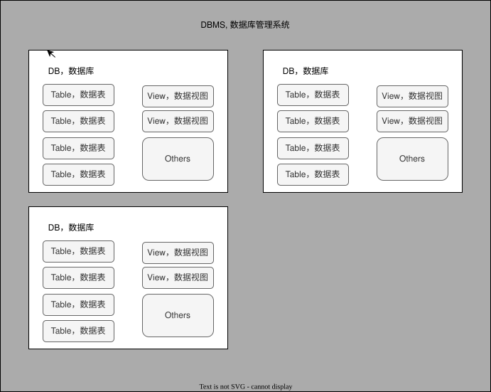
  
+ DBAS (Database Application System) 数据库应用程序/系统
+ DBA (Database Administrator) 数据库管理员
  + 职责
    + 模式定义 -- schema definition
    + 存储结构和存取方法定义 -- storage structure and access-method definition
    + 模式及物理组织修改 -- schema and physical-organization modification
    + 数据访问授权 -- granting of authorization for data access
    + 日常维护 -- routine maintenance

+ 数据表, Database Table, 数据的矩阵

  + 表头, header, 列的名称

  + 行 / 元组, row, 一组相关的数据

  + 列, column, 包含相同类型(非特指物理类型/数据类型，也包含其逻辑类型/属性)的数据

+ 冗余, redundancy, 存储多倍数据， 冗余降低了_性能_，但提高了_安全性_
  
+ SQL -- Structured Query Language
  + DDL, Data-Definition Language 数据定义语言
    + 每个关系/表的模式
    + 每个属性/列的取值类型
    + 完整性约束
    + 为每个关系维护的索引集合
    + 每个关系的安全性和权限信息
    + 每个关系在磁盘上的物理存储结构

  + DML, Data-Manipulation Language 数据操纵语言
  + integrity, 完整性
  + view definition, 视图定义
  + transaction control, 事务控制
  + embedded SQL & dynamic SQL, 嵌入式SQL 和 动态SQL
  + authorization, 授权

#### 数据库范式

##### Normal form - 范式

+ 示意图
  + [diagram]
    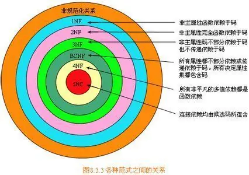

+ 码，足以区分实体(记录)的属性或属性集/组。
  一个元组(行)的所有属性必须能唯一标识元组。即，不能出现两个元组的属性完全相同。

  + 超码 superkey
    一个或多个属性，将这些属性组合在一起可以在一个关系(表)中唯一标识一个元组(行)。

  + 候选码 candidate key
    最小的超码  

  + 主码 primary key / 主码约束 primary key constraint
    数据库设计者选出的候选码  
    
  + 外码 foreign key / 外码约束 foreign key constraint / 被引用关系 referenced relation
    + 引用完整性 referential integrity constraint

##### 1NF - 第一范式
+ 定义: 所有域都是原子性的，即数据库表的每一列都是不可分割的原子数据项
+ 示例
  + 错误
    + [Table]

      | reader_id | name | Dept_id | Book | Borrowing_Date | Return_date |
      | :-------- | :---- | :---- | :---- | :------------: | :---------: |
      | 001       | Bob   | 100   | 101 DB Conceptions | 2021/08/20 |  |
      | 002       | Auth  | 200   | 102 C++ Programming | 2021/08/21 |  |

    + 说明
      Book字段可以拆分为 Book_ID 和 Book_Name
  + 纠正
    + [Table]

      | reader_id | name | Dept_id | Book_ID | Book_Name | Borrowing_Date | Return_date |
      | :-------- | :---- | :---- | :---- | :---- | :------------: | :---------: |
      | 001       | Bob   | 100   | 101 | DB Conceptions | 2021/08/20 |  |
      | 002       | Auth  | 200   | 102 | C++ Programming | 2021/08/21 |  |

##### 2NF - 第二范式
+ 定义: 在1NF的基础上，非码属性必须完全依赖于候选码（在1NF基础上消除非主属性对主码的部分函依赖）
+ 要求: 数据库表中的每个实例或记录必须可以被唯一地区分。选取一个能区分每个实体的**属性**或*属性组**，作为实体的唯一标识
+ 示例
  + 错误
  + 纠正
+ Problems
  + 数据冗余
  + 操作(更新、插入、删除)异常

##### 3NF - 第三范式
+ 定义: 在2NF基础上，任何非主属性不依赖于其它非主属性（在2NF基础上消除传递依赖）
+ 要求: 一个关系中不包含已在其它关系已包含的非主关键字信息。
+ 示例
  + 错误
  + 纠正

##### BCNF
Boyce-Codd Normal Form -- 巴斯-科德范式 / 修正第三方式

+ 定义: 在3NF基础上，任何主属性不能对主键子集依赖（在3NF基础上消除主属性对主码子集的依赖）
+ 说明: 任何决定因素都是超键
+ 示例
  + 错误
  + 纠正

##### 4NF - 第四范式
+ 定义
+ 示例
  + 错误
  + 纠正

##### 5NF - 第五范式
+ 定义
+ 示例
  + 错误
  + 纠正

#### 数据库引擎

+ 存储管理器 -- storage manager
  + 组成
    + 权限即完整性管理器 -- authorization and integrity manager
    + 事务管理器 -- transaction manager
    + 文件管理器 -- file manager
    + 缓冲区管理器 -- buffer manager
  + 数据结构
    + 数据文件 -- data file
    + 数据字典 -- data dictionary
      存储数据结构的元数据，尤其是数据库模式
    + 索引 -- index
  

+ 查询处理器 -- query processor
  + DDL解释器 -- DDL interpreter
  + DML编译器 -- DML compiler
    + 查询优化 -- query optimization
  + 查询执行引擎 -- query evaluation engine

+ 事务管理
  + 事务，原子性和一致性的单元，即一组操作要么全部执行，要么全部不执行
  + 恢复管理器
  + 并发控制器

# MySql

## MySql Server 结构

+ 图示
  + [diagram]
    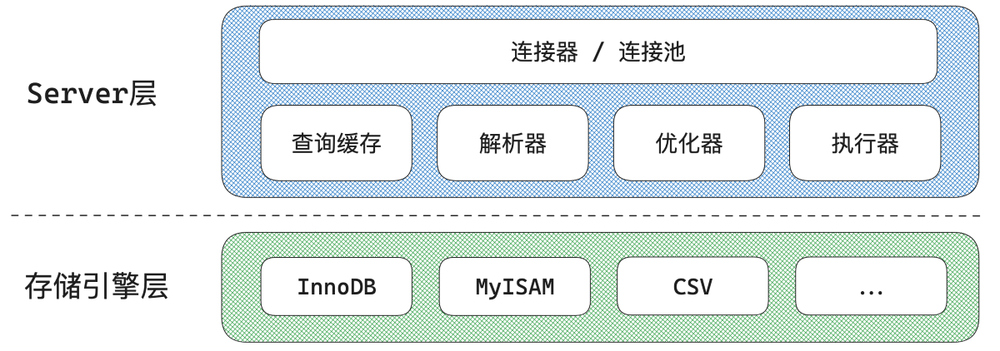
  + [diagram]
    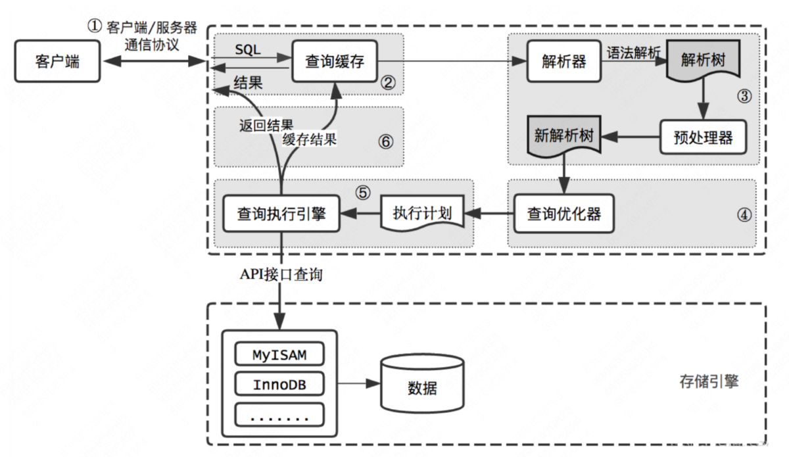

+ 连接层/连接器

+ Server层
  + 缓存

  + 解析器
    解析编译执行程序
    + 语法树

      + 图示

        + [diagram]
          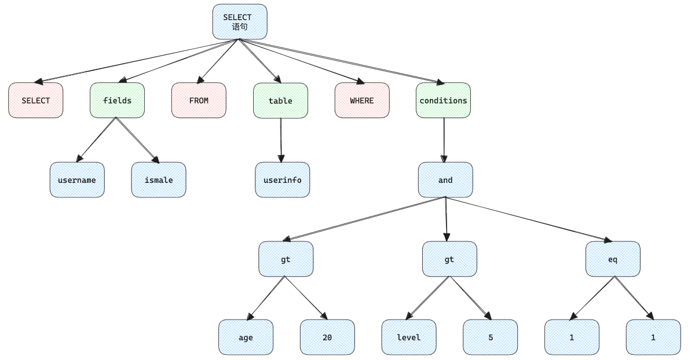

  + 优化器

  + 执行器

+ 存储引擎
  负责组织在磁盘中的数据，提供磁盘的数据读写接口
  + InnoDB
    + 结构
      + 图示
        + [diagram]
          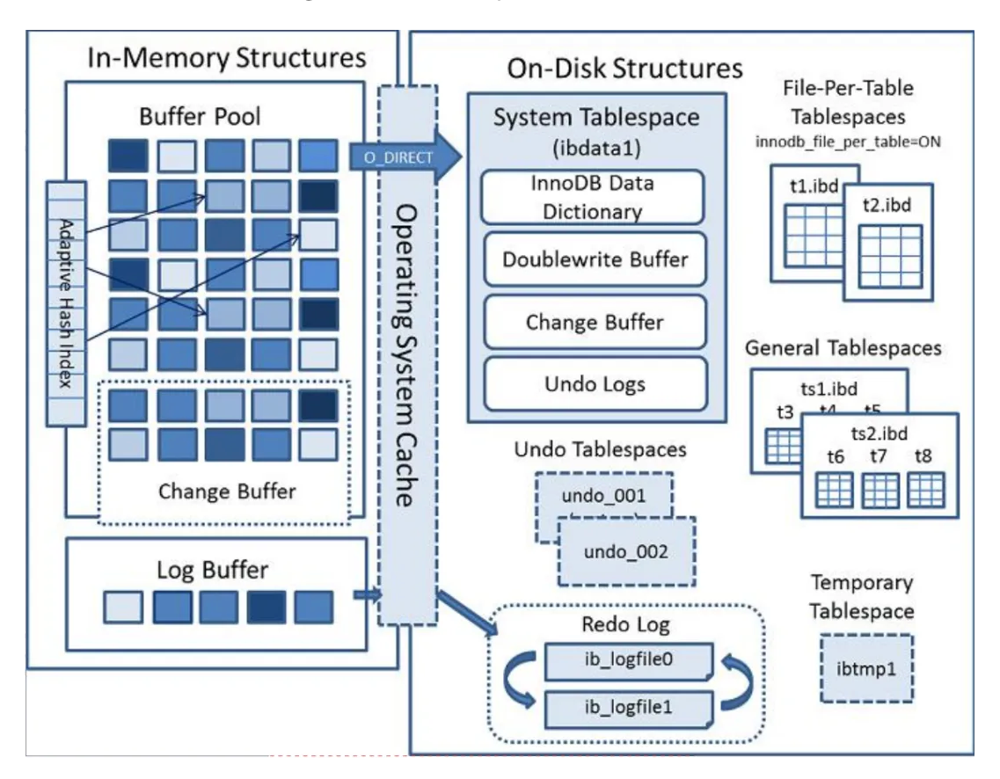

    + BufferPool 缓冲池
      + 说明
        + 缓存的是页面信息
          + 数据页
          + 索引页
        + InnoDB用LRU算法管理缓冲池（链表实现，非传统，分为Young, Old），经过淘汰的就是热点数据
        + 大小
          + 默认: 128M
          + 查询语句
            + [operating]

              ```cmd
              mysql> SHOW VARIABLES LIKE '%innodb_buffer_pool%';
              +-------------------------------------+----------------+
              | Variable_name                       | Value          |
              +-------------------------------------+----------------+
              | innodb_buffer_pool_chunk_size       | 134217728      |
              | innodb_buffer_pool_dump_at_shutdown | ON             |
              | innodb_buffer_pool_dump_now         | OFF            |
              | innodb_buffer_pool_dump_pct         | 25             |
              | innodb_buffer_pool_filename         | ib_buffer_pool |
              | innodb_buffer_pool_in_core_file     | OFF            |
              | innodb_buffer_pool_instances        | 1              |
              | innodb_buffer_pool_load_abort       | OFF            |
              | innodb_buffer_pool_load_at_startup  | ON             |
              | innodb_buffer_pool_load_now         | OFF            |
              | innodb_buffer_pool_size             | 134217728      |
              +-------------------------------------+----------------+
              11 rows in set (0.01 sec)
              
              mysql>
              ```

        + 超限

      + 状态查询
        + [operating]

          ```cmd
          mysql> SHOW STATUS LIKE '%innodb_buffer_pool%';
          +-------------------------------------------+--------------------------------------------------+
          | Variable_name                             | Value                                            |
          +-------------------------------------------+--------------------------------------------------+
          | Innodb_buffer_pool_dump_status            | Dumping of buffer pool not started               |
          | Innodb_buffer_pool_load_status            | Buffer pool(s) load completed at 260423  8:08:30 |
          | Innodb_buffer_pool_resize_status          |                                                  |
          | Innodb_buffer_pool_resize_status_code     | 0                                                |
          | Innodb_buffer_pool_resize_status_progress | 0                                                |
          | Innodb_buffer_pool_pages_data             | 964                                              |
          | Innodb_buffer_pool_bytes_data             | 15794176                                         |
          | Innodb_buffer_pool_pages_dirty            | 0                                                |
          | Innodb_buffer_pool_bytes_dirty            | 0                                                |
          | Innodb_buffer_pool_pages_flushed          | 196                                              |
          | Innodb_buffer_pool_pages_free             | 7228                                             |
          | Innodb_buffer_pool_pages_misc             | 0                                                |
          | Innodb_buffer_pool_pages_total            | 8192                                             |
          | Innodb_buffer_pool_read_ahead_rnd         | 0                                                |
          | Innodb_buffer_pool_read_ahead             | 0                                                |
          | Innodb_buffer_pool_read_ahead_evicted     | 0                                                |
          | Innodb_buffer_pool_read_requests          | 15670                                            |
          | Innodb_buffer_pool_reads                  | 822                                              |
          | Innodb_buffer_pool_wait_free              | 0                                                |
          | Innodb_buffer_pool_write_requests         | 1933                                             |
          +-------------------------------------------+--------------------------------------------------+
          20 rows in set (0.00 sec)
          
          mysql>
          ```

      + ChangeBuffer
        + 说明
          暂存修改记录
        + 查询
          + [operating]

            ```cmd
            mysql> SHOW STATUS LIKE 'innodb_change_buffer_max_size';
            Empty set (0.00 sec)
            
            mysql>
            ```

    + LogBuffer
      + 说明
        + InnoDB机制
          + WAL -- Write-Ahead Logging，先写日志，后写磁盘
          + Update过程
            + 准备
              + 连接数据库
              + 确认为更新语句
                + 优化器决定要使用的索引
                + 执行器准备
            + 事务开始
              + 从 BufferPool 或 DataFile 中查询，并将该记录的数据页，返回给Server的执行器
            + 修改数据
            + 查询记录原值到 Undo Log
            + 更新记录新值到 Redo Log
            + 调用引擎接口，修改记录数据页到 buffer pool
            + 事务提交
        + 查询
          + [operating]

            ```cmd
            mysql> SHOW VARIABLES LIKE 'innodb_log%';
            +------------------------------------+----------+
            | Variable_name                      | Value    |
            +------------------------------------+----------+
            | innodb_log_buffer_size             | 67108864 |
            | innodb_log_checksums               | ON       |
            | innodb_log_compressed_pages        | ON       |
            | innodb_log_file_size               | 50331648 |
            | innodb_log_files_in_group          | 2        |
            | innodb_log_group_home_dir          | ./       |
            | innodb_log_spin_cpu_abs_lwm        | 80       |
            | innodb_log_spin_cpu_pct_hwm        | 50       |
            | innodb_log_wait_for_flush_spin_hwm | 400      |
            | innodb_log_write_ahead_size        | 8192     |
            | innodb_log_writer_threads          | ON       |
            +------------------------------------+----------+
            11 rows in set (0.00 sec)
            
            mysql>
            ```

        + 重做日志
          + 文件路径: "/var/lib/mysql/ib_logfile?"
          + 空间大小: 48M

      + 图示
        + [diagram]
          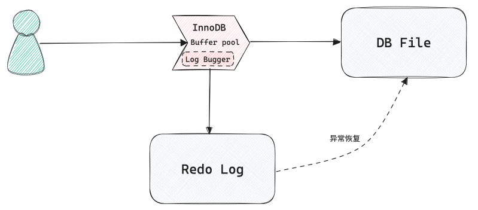

## 键 和 索引

### 主键, PK(Primary Key)

#### Problems/Questions

##### 自增主键问题

+ 描述: 为什么**不**推荐使用数据库自增主键，也不推荐UUID，雪花算法简论

+ 解释/解决
  + 自增主键问题
    + 在分库分表时会有问题
      + 单表时，可以有独立(唯一)ID
      + 横向分表时，每个逻辑子表都有一个自增主键，不能保证唯一
        + 使用步长增加ID，在扩容时会有问题
          ==> UUID
  + UUID
    + InnoDB的索引结构
      + B+-Tree 索引即数据，数据即索引。主键索引树的叶子节点，会保存完整的行数据
        + UUID负面影响
          + UUID较长，占用空间更大大，Page(内存磁盘交换使用，空间固定)占用更多，索引树高度高，遍历次数越多，遍历Page更多，IO更多，影响IO性能
          + UUID是无序的，非趋势递增；但主键是有序的，需要排序。插入数据时，需要树的分裂与合并。
            ==> 雪花算法
  + 雪花算法
    + 组成 (64位二进制 转化为 十进制ID)
      + 1 bit Sign
      + 41 bit timestamp
      + 10 bit MachineID
      + 12 bit SequenceID
    + Problems
      + 时间回拨问题
        + 问题
          + 不再趋势递增
          + 时间戳重复
        + 解决
          + 抛出异常，牺牲可用性
          + 等待时间恢复，(回拨时间跨度大?须:需) 设置等待时间
          + 备用方式生成
      + 机器码问题
        + 原因: 机器集群
        + 解决
          + 配置文件管理
          + 服务注册组件，使用服务ID
      + 序列号一直为0的问题
        + 原因: 同一机器同一时间并发，序列号才递增。大部分场景，不会触发这一机制。
        + 问题: 分库分表时，因取模，导致数据偏移(末尾为0，取模后为偶数，导致奇数表中    无数据)，数据不均匀/数据倾斜
        + 解决：
          + 当序列号为0时，使用时间戳的最后一位

### 外键, FK(Foregin Key)

### 复合键

### 索引, Index

#### 分类

+ 分类 1， 索引性质
  + 主键索引
    + 说明
      + 唯一且非空，一个表只能有一个
  + 唯一索引
    + 说明
      + 值不能重复
      + 可以为空
  + 普通索引
  + 联合索引
    + 说明
      + 多列组合的索引
      + 注意列的顺序
  + 全文索引
    + 说明
      + 针对长文本字段
  + 空间索引
    + 说明
      + 专门为空间数据做区域距离查询准备
+ 分类 2， 数据结构角度
  + B+树索引
    + 说明
      + 默认
      + 适用: 范围查询、排序、聚合；
  + 哈希索引
    + 说明
      + 适用: 等值查询; **不**支持范围查询；
  + 倒排索引
    + 说明
      + 适用: 全文搜索，先分词再查找；
  + R树索引
    + 说明
      + 适用: 多维空间数据专用；
+ 分类 3， 从InnoDB的B+树实现
  + 聚簇索引
    + 说明
      + 主键索引，叶子节点直接存完整数据行
  + 非聚簇索引
    + 说明
      + 叶子节点只保存索引列和主键值，要查全行，得先回表到聚簇索引再取一次
+ ~~二叉树~~
  + 缺点
    + 如果插入顺序不理想，树容易长歪
+ ~~B树索引~~
  + B树
  + B树索引
    + 说明
      所有的值是按顺序存储的，并且每个叶子到根的距离相同；  
      B树索引，存储引擎不再需要进行全表扫描来获取数据
    + 示例
      + 图例
        + [diagram]
          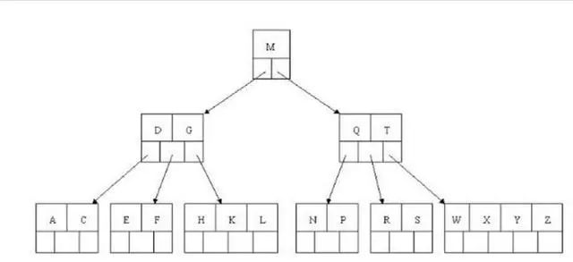
      + 过程 查找E
        1. 和 根节点M 比较， E < M, 搜索左侧分支
        2. 和 一级节点 D|G 比较， D < E < M, 搜索中间节点
        3. 和 二级节点 E|F 比较， E = E， 返回 E 的关键字和指针信息
        4. 通过指针信息找出记录的全行信息
+ B+树索引
  + B树 vs. B+树
    + 图例
      + [diagram]
        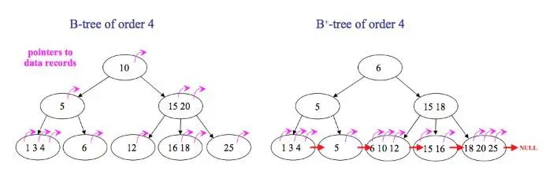
    + 区别
      + B树中无重复元素，B+树有
      + B树中间节点会存储数据指针信息，B+树只在叶子节点中才存储
      + B+树的每个叶子节点都有一个指针指向下一片叶子，把所有叶子链在一起
    + B+树优点
      + 中间节点不存储指针，同样的页可以保存更多的节点，树的总高度小，（数据量相同的情况下，B+树比B树更加矮胖，）效率更高。
      + B+树只在叶子才能获取数据，而B树可以在中间节点获取，所以B+树查询时间更稳定
      + B+树每个叶子都有指向下一叶子的指针，方便范围查询和全表查询；而B树须做中序遍历。
  + B+树
    + 结构
      + 示例
        + 图例
          + [diagram]
            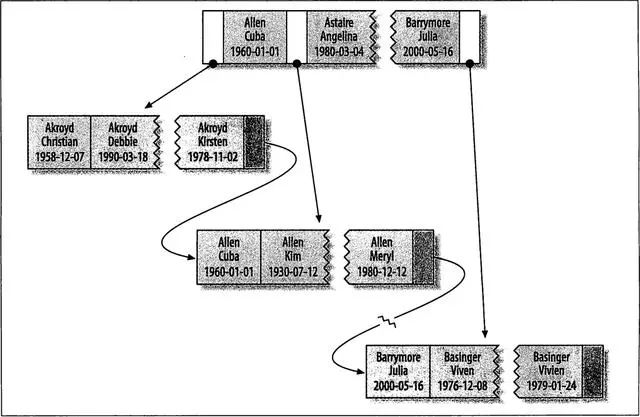
        + 表结构
          + [code]
            ```sql
            create table Student(
              last_name varchar(50) not null,
              first_name varchar(50) not null,
              birth_date date not null,
              gender int(2) not null,
              key (last_name, first_name, birth_date)
            );
            ```
            `Index{last_name, first_name, birth_date}`
        + 过程 
    + 查询效率 `O(log n)`
    + 特点 (i.e. B+树优点)
      + 所有的值都存储在叶子节点
      + 多路平衡树 一般只有3~4层
      + 叶子节点间使用指针相连，可高效遍历
      + 全值匹配 和索引中所有的列进行匹配，如上例中，查找{"name":"Cuba Allen", "BirthDate":"1960-Jan-01"}  
      + 匹配最左前缀，索引的第一列， 如上例中，查找{"last_name":"Allen"} 
      + 匹配列前缀，某列值开始的部分， 如上例中，查找{"last_name":"J*"}，即，以J开头为姓的人
      + 匹配范围值，如上例中，查找{"last_name":"Allen" ~ "Barrymore"}，即，姓在 Allen 和 Barrymore 之间的人
      + 精确匹配某一列，且范围匹配另一列，如上例中，查找{"last_name":"Allen", "last_name":"K*"}，即，姓为Allen，名以K开头的人
      + 只访问索引的查询，即覆盖索引。
    + 查询建议
      + 尽量从左到右依次使用联合索引的列匹配条件
    + 限制
      + 如果不是按照索引的最左列开始查找，无法使用索引。例如上面例子中的索引无法用于查找某个特定生日的人，因为生日不是最左数据列。也不能查找last_name以某个字母结尾的人。
      + 不能跳过索引的列。上述索引无法用于查找last_name为Smith并且某个特定生日的人。如果不指定first_name，则mysql只能使用索引的第一列。
      + 如果查询中有某个列的范围查询，则右边所有的列都无法使用索引优化查找。例如查询WHERE last_name=’Smith’ AND first_name LIKE ‘J%’ AND birthday=‘1996-05-19’，这个查询只能使用索引的前两列。
+ Hash索引
  + 说明
    哈希索引，只有精确匹配索引所有列的查询才有效。  
    对于每一行数据，存储引擎都会对所有的索引列计算一个哈希码。哈希索引将所有的哈希码存储在索引中，同时在哈希表中保存指向每个数据行的指针。  
    如果多个列的哈希值相同，索引会以链表的方式存放多个指针记录到同一个哈希条目中。
  + 特点
    因为索引自身只存储对应的哈希值，所以索引的结构十分紧凑，哈希索引查找的速度非常快。
  + 限制
    + 哈希索引不是按照索引顺序存储的，无法用于排序。
    + 不支持部分索引列匹配查找。
    + 不支持范围查找。
+ 聚集索引/主键索引
  + 说明
    + 每个存储引擎为InnoDB的表都有一个特殊的索引，即聚集索引。  
    + 聚集索引并非单独的索引类型，而是数据存储方式。  
    + 当数据表有聚集索引时，数据行实际上存放在叶子页中。  
    + 一个表不可能有两个地方存放数据，所以一个表只能有一个聚集索引。  
    + 存储引擎负责实现索引，所以不是所有的存储引擎都支持聚集索引。 InnoDB表中聚集索引的索引列就是主键，所以也叫主键索引
  + 结构
    + 图例
      + [diagram]
        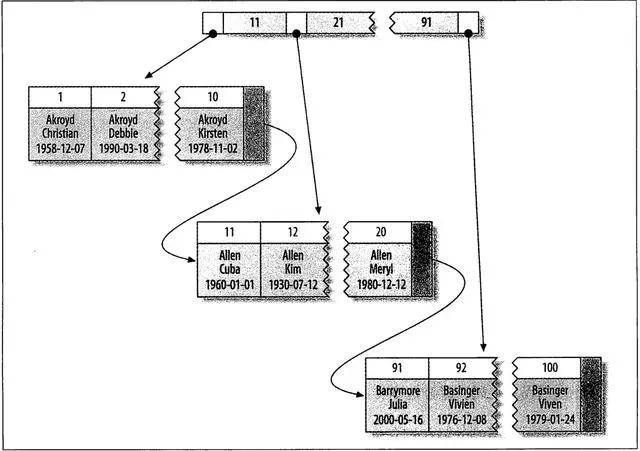
    + 表结构
      + [code]
        ```sql
        create table Student(
          id int(11) primary key auto_increment,
          last_name varchar(50) not null,
          first_name varchar(50) not null,
          birth_date not null
        );
        ```
+ 非聚簇索引/二级索引  
  + 说明
    + 对于InnoDB表，在非主键列的其他列上建的索引，即为二级索引。
    + 二级索引可以是 0..N 个
    + 二级索引的节点页只保存 {索引列的值(同聚集索引) + 对应主键值}
  + 结构
    + 表结构
      + 图例
        + [diagram]
          
      + 表结构
        + [code]
          ```sql
          create table layout_test (
            col1 int(11) primary key,
            col2 int(11) not null,
            key(col2)
          )
          ```
  + 比较
    + InnoDB vs. MyISAM
      + InnoDB
        + 主键索引
          + 图示
            + [diagram]
              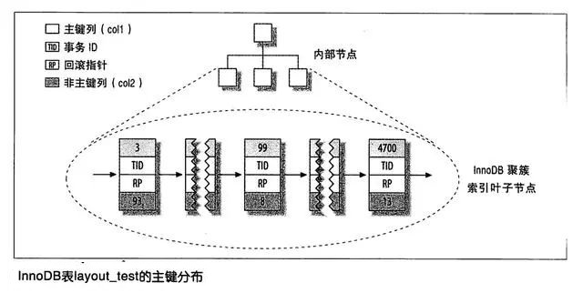
        + 二级索引
          + 图示
            + [diagram]
              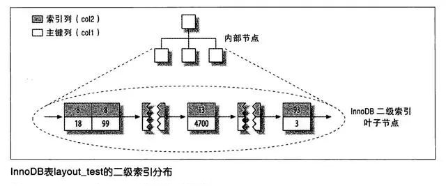
          + 说明
            + 二级索引叶子节点保存了主键，类似指针而非通常保存的下一叶子的地址 
              + 保存主键值而非指针，占用了更多空间 
              + 减少了行移动和数据页分裂时的二级索引维护工作，因为是主键而非指针，无需修改
      + MyISAM
        + 主键索引
          + 图示
            + [diagram]
              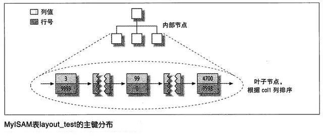
        + 二级索引
          + 图示
            + [diagram]
              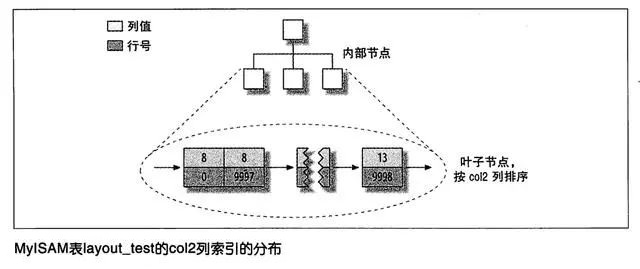
          + 说明
            + 二级索引和主键索引无区别
      + 比较
        + 图示
          + [diagram]
            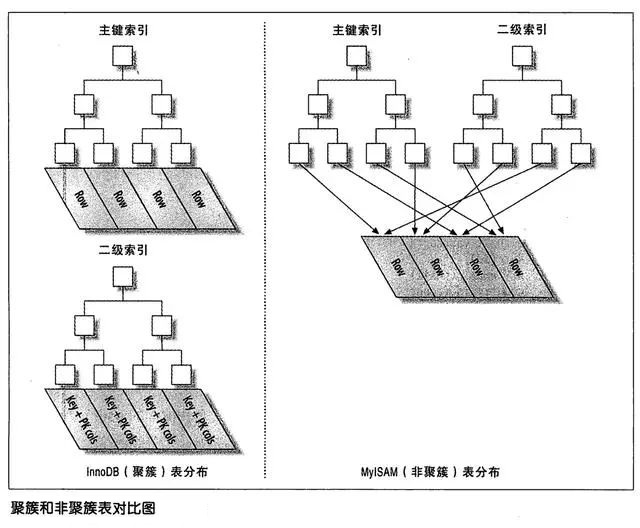
        + 聚集索引的优点：
          + 可以把相关数据保存在一起，例如实现电子邮箱时，根据用户ID来聚集数据，读取少数的数据页就能获取某个用户的全部邮件。
          + 聚集索引将索引和数据保存在同一个B树中，因此从聚集索引中获取数据比在非聚集索引中要快一些。
        + 聚集索引的缺点：
          + 插入速度严重依赖插入顺序。按照主键的顺序插入是加载数据到InnoDB表中速度最快的方式。
            假如磁盘中的某一个已经存满了，但是新增的行要插入到这一页当中，存储引擎就会把该页分裂成两个页面来容纳该行，这就是一次页分裂操作。页分裂会导致表占用更多的磁盘空间。
          + 更新聚集索引列的代较很高，会强制InnoDB将每个被更新的行移动到新的位置。
          + 用二级索引访问数据需要两个索引查找，不是一次。因为要先从二级索引的叶子节点获得主键值，再根据这主键去聚集索引中查到对应的行，所以需要两次B树查找。

  + B+-Tree vs. Hash
    + 表格
      + [Table]

        | 特性 | B+树 | Hash表 |
        | :---- | :---- | :---- |
        | 查找 | O(log n) | O(1) |
        | 范围查询 | 支持 | 不支持 |
        | 顺序访问 | 支持 | 不支持 |
        | 磁盘IO  | 少   | 多，容易冲突 |

  + 覆盖索引
    + 说明
      查询只需访问索引，无需访问数据行


## 数据库操作

### 数据类型

+ [学习笔记](./MySql-data_type.md)

### 函数 和 计算

### 完整性约束

+ 非空约束
  + 要求: 数据表指定字段 不能为空
  + 关键字/语句/表达式: 
    + `NOT NULL,` 或 `NOT NULL DEFAULT 缺省值,` 
  + 示例 1

    + [operating]

      ```cmd
      mysql> USE douma
      Reading table information for completion of table and column names
      You can turn off this feature to get a quicker startup with -A
      
      Database changed
      mysql> CREATE TABLE member (
      ,
          name VARCHAR(20) NOT NULL
      );
          ->     member_id INT UNSIGNED,
          ->     name VARCHAR(20) NOT NULL
          -> );
      Query OK, 0 rows affected (0.04 sec)
      
      mysql> SHOW TABLES;
      +-----------------+
      | Tables_in_douma |
      +-----------------+
      | member          |
      | person          |
      | person2         |
      | person3         |
      +-----------------+
      4 rows in set (0.00 sec)
      
      mysql> INSERT INTO member (member_id, name) VALUES(1, 'douma');
      Query OK, 1 row affected (0.02 sec)
      
      mysql> INSERT INTO member (member_id, name) VALUES(2, '');
      Query OK, 1 row affected (0.02 sec)
      
      mysql> INSERT INTO member (member_id, name) VALUES(3, NULL);
      ERROR 1048 (23000): Column 'name' cannot be null
      mysql> INSERT INTO member (member_id)       VALUES(4);
      ERROR 1364 (HY000): Field 'name' doesn't have a default value
      mysql>
      ```

  + 示例 2

    + [operating]

      ```cmd
      mysql> USE douma
      Reading table information for completion of table and column names
      You can turn off this feature to get a quicker startup with -A
      
      Database changed
      mysql> CREATE TABLE member2 (
          ->     member_id INT UNSIGNED,
          ->     name VARCHAR(20) NOT NULL DEFAULT 'Tester'
          -> );
      Query OK, 0 rows affected (0.04 sec)
      
      mysql> SHOW TABLES;
      +-----------------+
      | Tables_in_douma |
      +-----------------+
      | member          |
      | member2         |
      | person          |
      | person2         |
      | person3         |
      +-----------------+
      5 rows in set (0.00 sec)
      
      mysql> INSERT INTO member2 (member_id, name) VALUES(1, 'douma');
      Query OK, 1 row affected (0.02 sec)
      
      mysql> INSERT INTO member2 (member_id, name) VALUES(2, '');
      Query OK, 1 row affected (0.01 sec)
      
      mysql> INSERT INTO member2 (member_id, name) VALUES(3, NULL);
      ERROR 1048 (23000): Column 'name' cannot be null
      mysql> INSERT INTO member2 (member_id)       VALUES(4);
      Query OK, 1 row affected (0.02 sec)
      
      mysql>
      ```

+ 唯一约束

  + 要求: 数据表中所有记录的指定字段不能重复
    + `NULL`可以重复
    + `''`不可以重复
  + 关键字/语句/表达式: 
    + `UNIQUE,`
  + 示例 1

    + [operating]

      ```cmd
      mysql> USE douma
      Reading table information for completion of table and column names
      You can turn off this feature to get a quicker startup with -A
      
      Database changed
      mysql> DROP TABLE IF EXISTS member3;
      Query OK, 0 rows affected (0.03 sec)
      
      mysql> CREATE TABLE member3 (
          ->     member_id INT UNSIGNED,
          ->     name VARCHAR(20) NOT NULL DEFAULT 'Tester',
          ->     email VARCHAR(30) UNIQUE
          -> );
      Query OK, 0 rows affected (0.04 sec)
      
      mysql> SHOW TABLES;
      +-----------------+
      | Tables_in_douma |
      +-----------------+
      | member          |
      | member2         |
      | member3         |
      | person          |
      | person2         |
      | person3         |
      +-----------------+
      6 rows in set (0.00 sec)
      
      mysql> INSERT INTO member3 (member_id, name, email) VALUES(1, 'douma', 'douma_ok@163.com');
      Query OK, 1 row affected (0.02 sec)
      
      mysql> INSERT INTO member3 (member_id, name, email) VALUES(2, 'jeffy', 'douma_ok@163.com');
      ERROR 1062 (23000): Duplicate entry 'douma_ok@163.com' for key 'member3.email'
      mysql> INSERT INTO member3 (member_id, name) VALUES(3, 'bob');
      Query OK, 1 row affected (0.02 sec)
      
      mysql> INSERT INTO member3 (member_id, name) VALUES(3, 'auth');
      Query OK, 1 row affected (0.01 sec)
      
      mysql> INSERT INTO member3 (member_id, name, email) VALUES(2, 'john', '');
      Query OK, 1 row affected (0.01 sec)
      
      mysql> INSERT INTO member3 (member_id, name, email) VALUES(4, 'joy', '');
      ERROR 1062 (23000): Duplicate entry '' for key 'member3.email'
      mysql> SELECT * FROM member3;
      +-----------+-------+------------------+
      | member_id | name  | email            |
      +-----------+-------+------------------+
      |         1 | douma | douma_ok@163.com |
      |         3 | bob   | NULL             |
      |         3 | auth  | NULL             |
      |         2 | john  |                  |
      +-----------+-------+------------------+
      4 rows in set (0.00 sec)
      
      mysql>
      ```

+ 主键约束

  + 要求：非空且唯一
  + 关键字/语句/表达式: 
    + `PRIMARY KEY,`
    + `PRIMARY KEY (...),`

  + 注意:
    + 主键不要使用自增(`AUTO_INCREMENT,`)
  + 示例 1

    + [operating]

      ```cmd
      mysql> USE douma;
      Database changed
      mysql> DROP TABLE IF EXISTS member4;
      Query OK, 0 rows affected, 1 warning (0.01 sec)
      
      mysql> CREATE TABLE member4 (
          ->     member_id INT UNSIGNED PRIMARY KEY,
          ->     name VARCHAR(20) NOT NULL DEFAULT 'Tester',
          ->     email VARCHAR(30) UNIQUE
          -> );
      Query OK, 0 rows affected (0.04 sec)
      
      mysql> INSERT INTO member4 (member_id, name, email) VALUES(1, 'douma', 'douma_ok@163.com');
      Query OK, 1 row affected (0.00 sec)
      
      mysql> INSERT INTO member4 (member_id, name, email) VALUES(2, 'jeffy', 'jeffy_ok@163.com');
      Query OK, 1 row affected (0.00 sec)
      
      mysql> INSERT INTO member4 (member_id, name, email) VALUES(2, 'john', 'john_ok@163.com');
      ERROR 1062 (23000): Duplicate entry '2' for key 'member4.PRIMARY'
      mysql> INSERT INTO member4 (name, email) VALUES('kathy', '');
      ERROR 1364 (HY000): Field 'member_id' doesn't have a default value
      mysql>
      ```

  + 示例 2

    + [code]

      ```sql
      USE dbsc7;
      create table if not exists classroom
          (building       varchar(15),
           room_number    varchar(7),
           capacity       numeric(4,0),
           primary key (building, room_number)
          );
      insert into classroom values('Lamberton', 134, 10);
      insert into classroom values('Chandler', 375, 10);
      insert into classroom values('Fairchild', 145, 27);
      insert into classroom values('Nassau', 45, 92);
      insert into classroom values('Grace', 40, 34);
      insert into classroom values('Whitman', 134, 120);
      insert into classroom values('Lamberton', 143, 10);
      insert into classroom values('Taylor', 812, 115);
      insert into classroom values('Saucon', 113, 109);
      insert into classroom values('Painter', 86, 97);
      insert into classroom values('Alumni', 547, 26);
      insert into classroom values('Alumni', 143, 47);
      insert into classroom values('Drown', 757, 18);
      insert into classroom values('Saucon', 180, 15);
      insert into classroom values('Whitman', 434, 32);
      insert into classroom values('Saucon', 844, 24);
      insert into classroom values('Bronfman', 700, 12);
      insert into classroom values('Polya', 808, 28);
      insert into classroom values('Gates', 707, 65);
      insert into classroom values('Gates', 314, 10);
      insert into classroom values('Main', 45, 30);
      insert into classroom values('Taylor', 183, 71);
      insert into classroom values('Power', 972, 10);
      insert into classroom values('Garfield', 119, 59);
      insert into classroom values('Rathbone', 261, 60);
      insert into classroom values('Stabler', 105, 113);
      insert into classroom values('Power', 717, 12);
      insert into classroom values('Main', 425, 22);
      insert into classroom values('Lambeau', 348, 51);
      insert into classroom values('Chandler', 804, 11);
      ```

+ 检查约束

  + 要求: 对指定字段进行检查
  + 关键字/语句/表达式
    + `CHECK(...),`
    + `ENUM(...),`
  
  + 示例 1

    + [operating]

      ```cmd
      mysql> USE douma;
      Database changed
      mysql> DROP TABLE IF EXISTS member5;
      Query OK, 0 rows affected (0.03 sec)
      
      mysql> CREATE TABLE member5 (
          ->     member_id INT UNSIGNED PRIMARY KEY,
          ->     name VARCHAR(20) NOT NULL DEFAULT 'Tester',
          ->     email VARCHAR(30) UNIQUE,
          ->     age SMALLINT UNSIGNED CHECK(age > 0 AND age < 200),
          ->     gender ENUM('MALE','FEMALE','OTHERS')
          -> );
      Query OK, 0 rows affected (0.06 sec)
      
      mysql> INSERT INTO member5 (member_id, name, email, age, gender) VALUES(1, 'douma', 'douma_ok@163.com', 29,'MALE');
      Query OK, 1 row affected (0.01 sec)
      
      mysql> INSERT INTO member5 (member_id, name, email, age, gender) VALUES(2, 'jeffy', 'jeffy_ok@163.com', 248,'FEMALE');
      ERROR 3819 (HY000): Check constraint 'member5_chk_1' is violated.
      mysql> INSERT INTO member5 (member_id, name, email) VALUES(3, 'john', 'john_ok@163.com');
      Query OK, 1 row affected (0.01 sec)
      
      mysql> INSERT INTO member5 (member_id, name, email, age, gender) VALUES(4, 'auth', 'auth_ok@163.com', 33, 'Nan');
      ERROR 1265 (01000): Data truncated for column 'gender' at row 1
      mysql> SELECT * FROM member5;
      +-----------+-------+------------------+------+--------+
      | member_id | name  | email            | age  | gender |
      +-----------+-------+------------------+------+--------+
      |         1 | douma | douma_ok@163.com |   29 | MALE   |
      |         3 | john  | john_ok@163.com  | NULL | NULL   |
      +-----------+-------+------------------+------+--------+
      2 rows in set (0.00 sec)
      
      mysql>
      ```

  + 示例 2

    + [code]

      ```sql
      USE dbsc7;
      create table if not exists section
          (course_id      varchar(8), 
           sec_id         varchar(8),
           semester       varchar(6)
              check (semester in ('Fall', 'Winter', 'Spring', 'Summer')), 
           year           numeric(4,0) check (year > 1701 and year < 2100), 
           building       varchar(15),
           room_number    varchar(7),
           time_slot_id   varchar(4),
           primary key (course_id, sec_id, semester, year),
           foreign key (course_id) references course (course_id)
              on delete cascade,
           foreign key (building, room_number) references classroom (building, room_number)
              on delete set null
          );
      ```

+ 外键约束

  + 要求

  + 关键字/语句/表达式

  + 示例 1

    + [code]

      ```sql
      USE douma;
      
      DROP TABLE IF EXISTS book;
      DROP TABLE IF EXISTS student;
      
      
      
      CREATE TABLE student (
          sid INT UNSIGNED,
          name VARCHAR(40) NOT NULL,
          PRIMARY KEY(sid)
      );
      
      
      CREATE TABLE book (
          bid INT UNSIGNED,
          title VARCHAR(100) NOT NULL,
          sid INT UNSIGNED,
          CONSTRAINT fk_sid FOREIGN KEY (sid) REFERENCES student(sid)
      );
      
      
      INSERT INTO student VALUES (1,'ZhangSan');
      INSERT INTO student VALUES (2,'LiSi');
      
      INSERT INTO book VALUES (10,'高性能MySQL', 1);
      INSERT INTO book VALUES (11,'MySQL技术内幕：InnoDB存储引擎', 1);
      INSERT INTO book VALUES (12,'SQL必知必会', 2);
      INSERT INTO book VALUES (13,'深入理解MySQ核心技术', 2);
      ```

    + [operating]

      ```cmd
      mysql> USE douma;
      Database changed
      mysql> INSERT INTO book VALUES (20,'MySql Action', 9);
      ERROR 1452 (23000): Cannot add or update a child row: a foreign key constraint fails (`douma`.`book`, CONSTRAINT `fk_sid` FOREIGN KEY (`sid`) REFERENCES `student` (`sid`))
      mysql>
      ```

    + 注意:
      + DROP TABLE时，应先drop table book，因为student中sid是book的外键

  + 示例 2

    + [code]

      ```sql
      USE dbsc7;
      create table if not exists course
          (course_id      varchar(8), 
           title          varchar(50), 
           dept_name      varchar(20),
           credits        numeric(2,0) check (credits > 0),
           primary key (course_id),
           foreign key (dept_name) references department (dept_name)
              on delete set null
          );
      ```

  + 限制
    + 必须是有唯一约束(UNIQU)或主键约束(Primary Key)的字段才能作为另一张表的外键

      + 示例

        + [operating]

          ```cdm
          mysql> USE douma;
          Database changed
          mysql> CREATE TABLE book2 (
              ->     bid INT UNSIGNED,
              ->     title VARCHAR(100) NOT NULL,
              ->     sid INT UNSIGNED,
              ->     sname VARCHAR(40),
              ->     CONSTRAINT fk_sname FOREIGN KEY (sname) REFERENCES student(name)
              -> );
          ERROR 6125 (HY000): Failed to add the foreign key constraint. Missing unique key for constraint 'fk_sname' in the referenced table 'student'
          mysql>
          ```

    + 先删除子表，再删除父表
      包括 DROP操作 和 DELETE操作
      _子表 REFERENCES 父表; 子表无数据涉及父表除外_

      + 示例 1

        + [operating]

          ```cmd
          mysql> USE douma;
          Database changed
          mysql> DELETE FROM student WHERE sid = 1;
          ERROR 1451 (23000): Cannot delete or update a parent row: a foreign key constraint fails (`douma`.`book`, CONSTRAINT `fk_sid` FOREIGN KEY (`sid`) REFERENCES `student` (`sid`))
          mysql>
          ```
  
      + 示例 2

        + [operating]

          ```cmd
          mysql> USE douma;
          Database changed
          mysql> INSERT INTO student VALUES (12,'WangWu');
          Query OK, 1 row affected (0.00 sec)
          
          mysql> COMMIT;
          Query OK, 0 rows affected (0.00 sec)
          
          mysql> SELECT * FROM student FOR UPDATE;
          +-----+----------+
          | sid | name     |
          +-----+----------+
          |   1 | ZhangSan |
          |   2 | LiSi     |
          |  12 | WangWu   |
          +-----+----------+
          3 rows in set (0.00 sec)
          
          mysql> DELETE FROM student WHERE sid = 12;
          OM student FOR UPDATE;Query OK, 1 row affected (0.02 sec)
          
          mysql>
          mysql> SELECT * FROM student FOR UPDATE;
          +-----+----------+
          | sid | name     |
          +-----+----------+
          |   1 | ZhangSan |
          |   2 | LiSi     |
          +-----+----------+
          2 rows in set (0.00 sec)
          
          mysql>
          ```

### 数据库 + 数据表 + 视图 + 存储过程

+ Create -- 创建
  + 数据库
    + [code]

      ```sql
      CREATE DATABASE 数据库名;
      ```

+ Alter -- 修改
+ Drop -- 抛弃
  + 数据库
    + [code]

      ```sql
      DROP DATABASE 数据库名;
      ```

+ Grant -- 授权
+ 退出当前数据库
  + [operating]

    ```cmd
    mysql> select database();
    +------------+
    | database() |
    +------------+
    | douma      |
    +------------+
    1 row in set (0.00 sec)
    
    mysql> USE mysql;
    Reading table information for completion of table and column names
    You can turn off this feature to get a quicker startup with -A
    
    Database changed
    mysql> select database();
    +------------+
    | database() |
    +------------+
    | mysql      |
    +------------+
    1 row in set (0.00 sec)
    
    mysql> 
    ```

### 数据 
+ Select -- Query 查询
  + 单表查询
    + 默认, all, distinct
      + 说明
        + 默认是显示全部，all则显式指明显示全部
        + distinct是去重，作用于整个select列表
          + distinct vs. group by
            + distinct
              + **专门**用于去除重复的记录行
              + 作用于**整个select列表**
              + 查完计算（基本不计算），处理速度快，资源消耗低，
              + 有更好的自动优化
              + 大多数情况下，distinct是特殊的group by

            + group by
              + 主要作用为分组统计，对每组应用聚合函数，去重是副业
              + 边查边计算（按指定列分组，每组返回一行数据，需要更多计算），资源消耗高

            + 小于100k行，效率相差不大
            + 大于100k行，group by更优，因为 distinct 需要全表扫描
            + 去除字段有索引时，性能接近
            + 去除字段无索引时，distinct更优
            + 多列去重，建议使用group by


      + 表格

        + [table]

          | dept_name   | select dept_name | select all dept_name | select distinct dept_name |
          | :---------- | :--------------: | :------------------: | :-----------------------: |
          | Accounting  | [X]              | [X]                  | [X]                       |
          | Accounting  | [X]              | [X]                  |                           |
          | Accounting  | [X]              | [X]                  |                           |
          | Accounting  | [X]              | [X]                  |                           |
          | Astronomy   | [X]              | [X]                  | [X]                       |
          | Athletics   | [X]              | [X]                  | [X]                       |
          | Athletics   | [X]              | [X]                  |                           |
          | Athletics   | [X]              | [X]                  |                           |
          | Athletics   | [X]              | [X]                  |                           |
          | Athletics   | [X]              | [X]                  |                           |
          | Biology     | [X]              | [X]                  | [X]                       |
          | Biology     | [X]              | [X]                  |                           |
          | Comp. Sci.  | [X]              | [X]                  | [X]                       |
          | Comp. Sci.  | [X]              | [X]                  |                           |
          | Cybernetics | [X]              | [X]                  | [X]                       |
          | Cybernetics | [X]              | [X]                  |                           |
          | Cybernetics | [X]              | [X]                  |                           |
          | Cybernetics | [X]              | [X]                  |                           |
          | Elec. Eng.  | [X]              | [X]                  | [X]                       |
          | Elec. Eng.  | [X]              | [X]                  |                           |
          | Elec. Eng.  | [X]              | [X]                  |                           |
          | Elec. Eng.  | [X]              | [X]                  |                           |
          | English     | [X]              | [X]                  | [X]                       |
          | English     | [X]              | [X]                  |                           |
          | English     | [X]              | [X]                  |                           |
          | English     | [X]              | [X]                  |                           |
          | Finance     | [X]              | [X]                  | [X]                       |
          | Geology     | [X]              | [X]                  | [X]                       |
          | Languages   | [X]              | [X]                  | [X]                       |
          | Languages   | [X]              | [X]                  |                           |
          | Languages   | [X]              | [X]                  |                           |
          | Marketing   | [X]              | [X]                  | [X]                       |
          | Marketing   | [X]              | [X]                  |                           |
          | Marketing   | [X]              | [X]                  |                           |
          | Marketing   | [X]              | [X]                  |                           |
          | Mech. Eng.  | [X]              | [X]                  | [X]                       |
          | Mech. Eng.  | [X]              | [X]                  |                           |
          | Physics     | [X]              | [X]                  | [X]                       |
          | Physics     | [X]              | [X]                  |                           |
          | Pol. Sci.   | [X]              | [X]                  | [X]                       |
          | Pol. Sci.   | [X]              | [X]                  |                           |
          | Pol. Sci.   | [X]              | [X]                  |                           |
          | Psychology  | [X]              | [X]                  | [X]                       |
          | Psychology  | [X]              | [X]                  |                           |
          | Statistics  | [X]              | [X]                  | [X]                       |
          | Statistics  | [X]              | [X]                  |                           |
          | Statistics  | [X]              | [X]                  |                           |
          | Statistics  | [X]              | [X]                  |                           |
          | Statistics  | [X]              | [X]                  |                           |
          | Statistics  | [X]              | [X]                  |                           |

+ Update -- 更新
+ Insert -- 插入
+ Delete -- 删除
+ Truncate -- 截断/删节

### 导入导出

### 备份恢复

#### 备份

##### 类型

+ 静态转储 / 冷备份

+ 动态转储 / 热备份

+ 完全备份

+ 差量备份
  + 备份上一次**完全备份**之后变化的数据

+ 增量备份
  + 备份上一次**备份**之后变化的数据

## 主题

### 锁

#### 说明

+ 围绕 高并发 + 一致性

#### 类型

+ 类型，粒度
  + 全局锁
    + 全库只读 FTWRL -- Flush tables with read lock
      + 说明
        需要数据库逻辑备份、导出等操作时
      + 问题解决
        `mysqldump --single-transaction`  
        利用MVCC机制进行无锁备份
  + 表级锁
  + 行级锁(InnoDB)
    + 区别于 

+ 类型，模式
  + 乐观锁
  + 悲观锁

+ 类型，属性
  + 共享锁，
  + 排他锁

+ 类型，状态
  + 意向共享锁
  + 意向排他锁

+ 类型，算法
  + 记录锁 （属于 行锁）
  + 间隙锁 （属于 行锁）
  + 临键锁 （属于 行锁）
  
    + MDL锁 meta data lock
      + 说明
        元数据，保存表结构信息的  
        CRUD(Select/Update)操作加MDL  
        Alter时排他。如有长查询，DDL等待  
        DDL
    + 表锁 Explicit
    + 意向锁 IS/IX (内部协调机制)
    + 自增锁 Auto inc
    + 记录所 Record
    + 间隙锁 Gap
    + 临键锁 Next Key
    + 插入意向锁 Insert intention

#### MVCC -- Multi-Version Concurrency Control

## 数据库实例

### 检查

#### 服务

##### 状态
+ [operating]
  
  ```cmd
  [root@ThinkPadT14P-23 Workspace]# systemctl status mysqld
  ● mysqld.service - MySQL Server
     Loaded: loaded (/usr/lib/systemd/system/mysqld.service; enabled; vendor preset: disabled)
     Active: active (running) since Thu 2026-04-23 01:00:08 CST; 11min ago
       Docs: man:mysqld(8)
             http://dev.mysql.com/doc/refman/en/using-systemd.html
    Process: 53 ExecStartPre=/usr/bin/mysqld_pre_systemd (code=exited, status=0/SUCCESS)
   Main PID: 125 (mysqld)
     Status: "Server is operational"
      Tasks: 44 (limit: 26213)
     Memory: 443.3M
     CGroup: /system.slice/mysqld.service
             └─125 /usr/sbin/mysqld
  
  Apr 23 01:00:07 ThinkPadT14P-23 systemd[1]: Starting MySQL Server...
  Apr 23 01:00:08 ThinkPadT14P-23 systemd[1]: Started MySQL Server.
  [root@ThinkPadT14P-23 Workspace]#
  ```

##### 配置


#### 连接

+ [operating]
 
  ```cmd
  [root@ThinkPadT14P-23 Workspace]# mysql -h localhost -P 3306 -u root -p -e "SHOW VARIABLES LIKE 'version';"
  Enter password:
  +---------------+-------+
  | Variable_name | Value |
  +---------------+-------+
  | version       | 8.4.9 |
  +---------------+-------+
  [root@ThinkPadT14P-23 Workspace]#
  ```

### 物理存储

#### 说明

#### 数据文件

+ [operating]
  ```cmd
  [root@ThinkPadT14P-23 Workspace]# mysql -h localhost -P 3306 -u root -p -e "select @@datadir;"
  Enter password:
  +-----------------+
  | @@datadir       |
  +-----------------+
  | /var/lib/mysql/ |
  +-----------------+
  [root@ThinkPadT14P-23 Workspace]#
  ```

+ [operating]

  ```cmd
  [root@ThinkPadT14P-23 Workspace]# ll /var/lib/mysql/
  total 99412
  -rw-r----- 1 mysql mysql       56 Apr 23 00:50  auto.cnf
  -rw-r----- 1 mysql mysql      503 Apr 23 00:57  binlog.000001
  -rw-r----- 1 mysql mysql      158 Apr 23 01:00  binlog.000002
  -rw-r----- 1 mysql mysql       32 Apr 23 01:00  binlog.index
  -rw------- 1 mysql mysql     1680 Apr 23 00:50  ca-key.pem
  -rw-r--r-- 1 mysql mysql     1108 Apr 23 00:50  ca.pem
  -rw-r--r-- 1 mysql mysql     1108 Apr 23 00:50  client-cert.pem
  -rw------- 1 mysql mysql     1680 Apr 23 00:50  client-key.pem
  -rw-r----- 1 mysql mysql  4194304 Apr 23 01:16 '#ib_16384_0.dblwr'
  -rw-r----- 1 mysql mysql 12582912 Apr 23 00:50 '#ib_16384_1.dblwr'
  -rw-r----- 1 mysql mysql     3582 Apr 23 00:57  ib_buffer_pool
  -rw-r----- 1 mysql mysql 12582912 Apr 23 01:16  ibdata1
  -rw-r----- 1 mysql mysql 12582912 Apr 23 01:00  ibtmp1
  drwxr-x--- 2 mysql mysql     4096 Apr 23 01:00 '#innodb_redo'
  drwxr-x--- 2 mysql mysql     4096 Apr 23 01:00 '#innodb_temp'
  drwxr-x--- 2 mysql mysql     4096 Apr 23 00:50  mysql
  -rw-r----- 1 mysql mysql 26214400 Apr 23 01:16  mysql.ibd
  srwxrwxrwx 1 mysql mysql        0 Apr 23 01:00  mysql.sock
  -rw------- 1 mysql mysql        4 Apr 23 01:00  mysql.sock.lock
  -rw-r----- 1 mysql mysql      124 Apr 23 00:50  mysql_upgrade_history
  drwxr-x--- 2 mysql mysql     4096 Apr 23 00:50  performance_schema
  -rw------- 1 mysql mysql     1680 Apr 23 00:50  private_key.pem
  -rw-r--r-- 1 mysql mysql      452 Apr 23 00:50  public_key.pem
  -rw-r--r-- 1 mysql mysql     1108 Apr 23 00:50  server-cert.pem
  -rw------- 1 mysql mysql     1680 Apr 23 00:50  server-key.pem
  drwxr-x--- 2 mysql mysql     4096 Apr 23 00:50  sys
  -rw-r----- 1 mysql mysql 16777216 Apr 23 01:16  undo_001
  -rw-r----- 1 mysql mysql 16777216 Apr 23 01:16  undo_002
  [root@ThinkPadT14P-23 Workspace]#
  ```

### 启动 / 停止

+ 启动

  + [code]

    ```cmd
    systemctl start mysqld
    ```

+ 停止

  + [code]

    ```cmd
    systemctl stop mysqld
    ```

+ 重启

  + [code]

    ```cmd
    systemctl restart mysqld
    ```

+ 开机启动

  + [code]

    ```cmd
    systemctl enable mysqld
    ```

### 数据库操作
#### Schema / Database

##### 检索

+ [operating]

  ```cmd
  [root@ThinkPadT14P-23 Workspace]# mysql -h localhost -P 3306 -u root -p -e "SHOW DATABASES;"
  Enter password:
  +--------------------+
  | Database           |
  +--------------------+
  | information_schema |
  | mysql              |
  | performance_schema |
  | sys                |
  +--------------------+
  [root@ThinkPadT14P-23 Workspace]#
  ```

+ 说明
  + 通常情况下，一个database/schema 在 "/var/lib/mysql" 下对应一个同名目录
  + {database:information_schema} 在 "/var/lib/mysql" 下**无**对应目录

##### 创建


#### User / Role

##### 检索

+ [operating]

  ```cmd
  mysql> SELECT user, host, Select_priv, Insert_priv, Update_priv, Delete_priv FROM mysql.user;
  +------------------+-----------+-------------+-------------+-------------+-------------+
  | user             | host      | Select_priv | Insert_priv | Update_priv | Delete_priv |
  +------------------+-----------+-------------+-------------+-------------+-------------+
  | mysql.infoschema | localhost | Y           | N           | N           | N           |
  | mysql.session    | localhost | N           | N           | N           | N           |
  | mysql.sys        | localhost | N           | N           | N           | N           |
  | root             | localhost | Y           | Y           | Y           | Y           |
  +------------------+-----------+-------------+-------------+-------------+-------------+
  4 rows in set (0.01 sec)
  
  mysql>
  ```

+ [code]

  ```sql
  SHOW grants;
  ```


##### 添加用户

##### 修改密码

+ [operating]
  
  ```cmd
  [root@ThinkPadT14P-23 Workspace]# mysql -u root -p
  ...
  mysql> ALTER USER 'root'@'localhost' IDENTIFIED BY 'LiHaobo#1119';
  Query OK, 0 rows affected (0.02 sec)
  
  mysql>quit
  [root@ThinkPadT14P-23 Workspace]# 
  ```

### 故障解决
#### 启动


# 分布式数据库

# 云数据库

# 附录

## 标签

+ [table] 表格

+ [diagram] 图片

+ [operating] 操作
  
+ [code] 代码
  + 与 [operating] 的区别

    + [table]

      | Example    | operating                               | code                      |
      | :--------- | :-------------------------------------- | :------------------------ |
      | 01         | `C:\Workspace>wsl --import AlmaLinux8`  | `wsl --import AlmaLinux8` |
      |            | 附带屏幕输出                              | 不附带屏幕输出               |
      | 02         | `[root@ThinkPadT14P-23 Workspace]# rpm --upgrade` | `rpm --upgrade` |
      |            | 屏幕输出: "rpm: no packages given for install "     |                |

## 操作系统

### wsl

#### AlmaLinux 8

+ 步骤
  
  + 在线安装
    + [operating]

      ```cmd
      C:\Workspace>wsl --list --online
      The following is a list of valid distributions that can be installed.
      Install using 'wsl.exe --install <Distro>'.
      
      NAME                            FRIENDLY NAME
      AlmaLinux-8                     AlmaLinux OS 8
      AlmaLinux-9                     AlmaLinux OS 9
      AlmaLinux-Kitten-10             AlmaLinux OS Kitten 10
      AlmaLinux-10                    AlmaLinux OS 10
      Debian                          Debian GNU/Linux
      FedoraLinux-43                  Fedora Linux 43
      FedoraLinux-42                  Fedora Linux 42
      SUSE-Linux-Enterprise-15-SP7    SUSE Linux Enterprise 15 SP7
      SUSE-Linux-Enterprise-16.0      SUSE Linux Enterprise 16.0
      Ubuntu                          Ubuntu
      Ubuntu-24.04                    Ubuntu 24.04 LTS
      Ubuntu-22.04                    Ubuntu 22.04 LTS
      Ubuntu-20.04                    Ubuntu 20.04 LTS
      archlinux                       Arch Linux
      eLxr                            eLxr 12.12.0.0 GNU/Linux
      kali-linux                      Kali Linux Rolling
      openSUSE-Tumbleweed             openSUSE Tumbleweed
      openSUSE-Leap-16.0              openSUSE Leap 16.0
      OracleLinux_7_9                 Oracle Linux 7.9
      OracleLinux_8_10                Oracle Linux 8.10
      OracleLinux_9_5                 Oracle Linux 9.5
      openSUSE-Leap-15.6              openSUSE Leap 15.6
      SUSE-Linux-Enterprise-15-SP6    SUSE Linux Enterprise 15 SP6
      
      C:\Workspace>wsl --install AlmaLinux-8
      Downloading: AlmaLinux OS 8
      Installing: AlmaLinux OS 8
      Distribution successfully installed. It can be launched via 'wsl.exe -d AlmaLinux-8'
      Launching AlmaLinux-8...
      Please create a default UNIX user account. The username does not need to match your       Windows username.
      For more information visit: https://aka.ms/wslusers
      Enter new UNIX username: edgar
      Changing password for user edgar.
      New password:
      Retype new password:
      passwd: all authentication tokens updated successfully.
      [edgar@ThinkPadT14P-23 ~]$ sudo  shutdown -h 3
      
      We trust you have received the usual lecture from the local System
      Administrator. It usually boils down to these three things:
      
          #1) Respect the privacy of others.
          #2) Think before you type.
          #3) With great power comes great responsibility.
      
      [sudo] password for edgar:
      Shutdown scheduled for Wed 2026-04-22 18:01:35 CST, use 'shutdown -c' to cancel.
      [edgar@ThinkPadT14P-23 ~]$
      ```

  + 导出，注销，切换目录导入

    + [operating]

      ```cmd
      C:\Workspace>wsl  -l -v
        NAME           STATE           VERSION
      * AlmaLinux-8    Stopped         2
      
      C:\Workspace>wsl --export AlmaLinux-8 C:\Workspace\VirtualMachine\AlmaLinux8_260422_0000.tar
      Export in progress, this may take a few minutes. (315 MB)
      
      The operation completed successfully.
      
      C:\Workspace>wsl --unregister AlmaLinux-8
      Unregistering.
      The operation completed successfully.
      
      
      C:\Workspace>wsl --import AlmaLinux8 C:\Workspace\VirtualMachine\Alamlinux\AlamLinux8       C:\Workspace\VirtualMachine\AlmaLinux8_260422_0000.tar
      The operation completed successfully.
      
      C:\Workspace>dir  C:\Workspace\VirtualMachine\Alamlinux\AlamLinux8
       Volume in drive C has no label.
       Volume Serial Number is A60C-E80B
      
       Directory of C:\Workspace\VirtualMachine\Alamlinux\AlamLinux8
      
      04/22/2026  06:14 PM    <DIR>          .
      04/22/2026  05:39 PM    <DIR>          ..
      04/22/2026  06:14 PM       448,790,528 ext4.vhdx
      04/22/2026  06:14 PM           169,435 shortcut.ico
                     2 File(s)    448,959,963 bytes
                     2 Dir(s)  222,712,008,704 bytes free
      
      C:\Workspace>
      ```

    + 备份点

      + 操作系统初始安装完成

  + 维护
    + 20260422
      + 升级
        + [operating]

          ```cmd
          [root@ThinkPadT14P-23 Workspace]# dnf update
          Last metadata expiration check: 0:18:27 ago on Wed 22 Apr 2026 07:01:39 PM CST.
          Dependencies resolved.
          ================================================================================================================================================================
           Package                                   Architecture                 Version                                           Repository                       Size
          ================================================================================================================================================================
          Upgrading:
           coreutils                                 x86_64                       8.30-17.el8_10                                    baseos                          1.2 M
           coreutils-common                          x86_64                       8.30-17.el8_10                                    baseos                          2.0 M
           curl                                      x86_64                       7.61.1-34.el8_10.11                               baseos                          354 k
           glibc                                     x86_64                       2.28-251.el8_10.31                                baseos                          2.2 M
           glibc-common                              x86_64                       2.28-251.el8_10.31                                baseos                          1.0 M
           glibc-gconv-extra                         x86_64                       2.28-251.el8_10.31                                baseos                          1.6 M
           glibc-langpack-en                         x86_64                       2.28-251.el8_10.31                                baseos                          833 k
           gnutls                                    x86_64                       3.6.16-8.el8_10.5                                 baseos                          1.0 M
           grub2-common                              noarch                       1:2.02-170.el8_10.1.alma.1                        baseos                          897 k
           grub2-tools                               x86_64                       1:2.02-170.el8_10.1.alma.1                        baseos                          2.0 M
           grub2-tools-minimal                       x86_64                       1:2.02-170.el8_10.1.alma.1                        baseos                          216 k
           kpartx                                    x86_64                       0.8.4-43.el8_10                                   baseos                          119 k
           libarchive                                x86_64                       3.3.3-7.el8_10                                    baseos                          359 k
           libcurl                                   x86_64                       7.61.1-34.el8_10.11                               baseos                          307 k
           libnghttp2                                x86_64                       1.33.0-6.el8_10.2                                 baseos                           77 k
           openssh                                   x86_64                       8.0p1-28.el8_10                                   baseos                          525 k
           openssh-clients                           x86_64                       8.0p1-28.el8_10                                   baseos                          646 k
           platform-python                           x86_64                       3.6.8-75.el8_10.alma.1                            baseos                           88 k
           python3-libs                              x86_64                       3.6.8-75.el8_10.alma.1                            baseos                          7.9 M
           sed                                       x86_64                       4.5-5.el8_10                                      baseos                          298 k
           tzdata                                    noarch                       2026a-1.el8                                       baseos                          549 k
           vim-common                                x86_64                       2:8.0.1763-22.el8_10.1                            appstream                       6.3 M
           vim-enhanced                              x86_64                       2:8.0.1763-22.el8_10.1                            appstream                       1.4 M
           vim-filesystem                            noarch                       2:8.0.1763-22.el8_10.1                            appstream                        50 k
           vim-minimal                               x86_64                       2:8.0.1763-22.el8_10.1                            baseos                          575 k
          Installing dependencies:
           freetype                                  x86_64                       2.9.1-10.el8_10                                   baseos                          393 k
           grub2-tools-efi                           x86_64                       1:2.02-170.el8_10.1.alma.1                        baseos                          487 k
           grub2-tools-extra                         x86_64                       1:2.02-170.el8_10.1.alma.1                        baseos                          1.1 M
           libpng                                    x86_64                       2:1.6.34-10.el8_10                                baseos                          126 k
          
          Transaction Summary
          ================================================================================================================================================================
          Install   4 Packages
          Upgrade  25 Packages
          
          Total download size: 34 M
          Is this ok [y/N]: y
          ...
          Upgraded:
            coreutils-8.30-17.el8_10.x86_64                   coreutils-common-8.30-17.el8_10.x86_64                    curl-7.61.1-34.el8_10.11.x86_64
            glibc-2.28-251.el8_10.31.x86_64                   glibc-common-2.28-251.el8_10.31.x86_64                    glibc-gconv-extra-2.28-251.el8_10.31.x86_64
            glibc-langpack-en-2.28-251.el8_10.31.x86_64       gnutls-3.6.16-8.el8_10.5.x86_64                           grub2-common-1:2.02-170.el8_10.1.alma.1.noarch
            grub2-tools-1:2.02-170.el8_10.1.alma.1.x86_64     grub2-tools-minimal-1:2.02-170.el8_10.1.alma.1.x86_64     kpartx-0.8.4-43.el8_10.x86_64
            libarchive-3.3.3-7.el8_10.x86_64                  libcurl-7.61.1-34.el8_10.11.x86_64                        libnghttp2-1.33.0-6.el8_10.2.x86_64
            openssh-8.0p1-28.el8_10.x86_64                    openssh-clients-8.0p1-28.el8_10.x86_64                    platform-python-3.6.8-75.el8_10.alma.1.x86_64
            python3-libs-3.6.8-75.el8_10.alma.1.x86_64        sed-4.5-5.el8_10.x86_64                                   tzdata-2026a-1.el8.noarch
            vim-common-2:8.0.1763-22.el8_10.1.x86_64          vim-enhanced-2:8.0.1763-22.el8_10.1.x86_64                vim-filesystem-2:8.0.1763-22.el8_10.1.noarch
            vim-minimal-2:8.0.1763-22.el8_10.1.x86_64
          Installed:
            freetype-2.9.1-10.el8_10.x86_64          grub2-tools-efi-1:2.02-170.el8_10.1.alma.1.x86_64         grub2-tools-extra-1:2.02-170.el8_10.1.alma.1.x86_64
            libpng-2:1.6.34-10.el8_10.x86_64
          
          Complete!
          [root@ThinkPadT14P-23 Workspace]#

          C:\Workspace>wsl --export AlmaLinux8 C:\Workspace\VirtualMachine\AlmaLinux8_260423_0001.tar
          Export in progress, this may take a few minutes. (510 MB)
          
          The operation completed successfully.
          
          C:\Workspace>
          ```

      + 备份点

        + 操作系统更新至最新

      + 检查是否安装 MySql

        + rpm

          + [operating]

            ```cmd
            [root@ThinkPadT14P-23 Workspace]# rpm -qa | grep mysql
            [root@ThinkPadT14P-23 Workspace]# 
            ```

        + dnf

          + [operating]

            ```cmd
            [root@ThinkPadT14P-23 Workspace]# dnf list installed | grep mysql
            [root@ThinkPadT14P-23 Workspace]#
            ```

      + 安装 MySql

        + ~~安装MySql仓库~~

          + [operating]

            ```cmd
            [root@ThinkPadT14P-23 Workspace]# ll /home/edgar/Downloads/
            total 20
            -rw-r--r-- 1 root root    15292 Apr 22 22:02 mysql84-community-release-el8-3.noarch.rpm
            -rw-r--r-- 1 root root       25 Apr 22 22:04 mysql84-community-release-el8-3.noarch.rpm:Zone.Identifier
            -rw-r--r-- 1 root root 13399940 Apr 22 22:30 mysql-community-client-8.4.9-1.el8.x86_64.rpm
            -rw-r--r-- 1 root root       25 Apr 22 22:30 mysql-community-client-8.4.9-1.el8.x86_64.rpm:Zone.Identifier
            -rw-r--r-- 1 root root  2693072 Apr 22 22:34 mysql-community-client-plugins-8.4.9-1.el8.x86_64.rpm
            -rw-r--r-- 1 root root       25 Apr 22 22:39 mysql-community-client-plugins-8.4.9-1.el8.x86_64.rpm:Zone.Identifier            -rw-r--r-- 1 root root   712024 Apr 22 22:24 mysql-community-common-8.4.9-1.el8.x86_64.rpm
            -rw-r--r-- 1 root root       25 Apr 22 22:25 mysql-community-common-8.4.9-1.el8.x86_64.rpm:Zone.Identifier
            -rw-r--r-- 1 root root  2371172 Apr 22 22:25 mysql-community-icu-data-files-8.4.9-1.el8.x86_64.rpm
            -rw-r--r-- 1 root root       25 Apr 22 22:25 mysql-community-icu-data-files-8.4.9-1.el8.x86_64.rpm:Zone.Identifier
            -rw-r--r-- 1 root root  1530620 Apr 22 22:46 mysql-community-libs-8.4.9-1.el8.x86_64.rpm
            -rw-r--r-- 1 root root       25 Apr 22 22:46 mysql-community-libs-8.4.9-1.el8.x86_64.rpm:Zone.Identifier
            -rw-r--r-- 1 root root  1556620 Apr 22 22:43 mysql-community-libs-compat-8.4.9-1.el8.x86_64.rpm
            -rw-r--r-- 1 root root       25 Apr 22 22:43 mysql-community-libs-compat-8.4.9-1.el8.x86_64.rpm:Zone.Identifier
            -rw-r--r-- 1 root root 59300752 Apr 22 22:19 mysql-community-server-8.4.9-1.el8.x86_64.rpm
            -rw-r--r-- 1 root root       25 Apr 22 22:20 mysql-community-server-8.4.9-1.el8.x86_64.rpm:Zone.Identifier
            [root@ThinkPadT14P-23 Workspace]# dnf install /home/edgar/Downloads/mysql84-community-release-el8-3.noarch.rpm
            Last metadata expiration check: 3:05:58 ago on Wed 22 Apr 2026 07:01:39 PM CST.
            Dependencies resolved.
            ================================================================================================================================================================
             Package                                            Architecture                    Version                         Repository                             Size
            ================================================================================================================================================================
            Installing:
             mysql84-community-release                          noarch                          el8-3                           @commandline                           15 k
            
            Transaction Summary
            ================================================================================================================================================================
            Install  1 Package
            
            Total size: 15 k
            Installed size: 20 k
            Is this ok [y/N]: y
            Downloading Packages:
            Running transaction check
            Transaction check succeeded.
            Running transaction test
            Transaction test succeeded.
            Running transaction
              Preparing        :                                                                                                                                        1/1
              Installing       : mysql84-community-release-el8-3.noarch                                                                                                 1/1
              Running scriptlet: mysql84-community-release-el8-3.noarch                                                                                                 1/1
               Warning: native mysql package from platform vendor seems to be enabled.
                Please consider to disable this before installing packages from repo.mysql.com.
                Run: yum module -y disable mysql
            
              Verifying        : mysql84-community-release-el8-3.noarch                                                                                                 1/1
            
            Installed:
              mysql84-community-release-el8-3.noarch
            
            Complete!
            [root@ThinkPadT14P-23 Workspace]#
            ```

        + 安装 MySql
          + installation package list
            1. "mysql-community-common-8.4.9-1.el8.x86_64.rpm"
            2. "mysql-community-icu-data-files-8.4.9-1.el8.x86_64.rpm"
            3. "mysql-community-client-plugins-8.4.9-1.el8.x86_64.rpm"
            4. "mysql-community-libs-8.4.9-1.el8.x86_64.rpm"
            5. "mysql-community-client-8.4.9-1.el8.x86_64.rpm"
            6. "mysql-community-server-8.4.9-1.el8.x86_64.rpm"

          + common package

            + [operating]

              ```cmd
              [root@ThinkPadT14P-23 Workspace]# 
              
              Last metadata expiration check: 0:15:25 ago on Wed 22 Apr 2026 10:11:03 PM CST.
              Dependencies resolved.
              ================================================================================================================================================================
               Package                                        Architecture                   Version                               Repository                            Size
              ================================================================================================================================================================
              Installing:
               mysql-community-common                         x86_64                         8.4.9-1.el8                           @commandline                         695 k
              
              Transaction Summary
              ================================================================================================================================================================
              Install  1 Package
              
              Total size: 695 k
              Installed size: 11 M
              Is this ok [y/N]: y
              Downloading Packages:
              Running transaction check
              Transaction check succeeded.
              Running transaction test
              Transaction test succeeded.
              Running transaction
                Preparing        :                                                                                                                                        1/1
                Installing       : mysql-community-common-8.4.9-1.el8.x86_64                                                                                              1/1
                Verifying        : mysql-community-common-8.4.9-1.el8.x86_64                                                                                              1/1
              
              Installed:
                mysql-community-common-8.4.9-1.el8.x86_64
              
              Complete!
              [root@ThinkPadT14P-23 Workspace]#
              ```

          + ICU-Data Package
            + [operating]

              ```cmd
              [root@ThinkPadT14P-23 Workspace]# dnf install /home/edgar/Downloads/mysql-community-icu-data-files-8.4.9-1.el8.x86_64.rpm
              Last metadata expiration check: 0:17:18 ago on Wed 22 Apr 2026 10:11:03 PM CST.
              Dependencies resolved.
              ================================================================================================================================================================
               Package                                              Architecture                 Version                             Repository                          Size
              ================================================================================================================================================================
              Installing:
               mysql-community-icu-data-files                       x86_64                       8.4.9-1.el8                         @commandline                       2.3 M
              
              Transaction Summary
              ================================================================================================================================================================
              Install  1 Package
              
              Total size: 2.3 M
              Installed size: 4.3 M
              Is this ok [y/N]: y
              Downloading Packages:
              Running transaction check
              Transaction check succeeded.
              Running transaction test
              Transaction test succeeded.
              Running transaction
                Preparing        :                                                                                                                                        1/1
                Installing       : mysql-community-icu-data-files-8.4.9-1.el8.x86_64                                                                                      1/1
                Running scriptlet: mysql-community-icu-data-files-8.4.9-1.el8.x86_64                                                                                      1/1
                Verifying        : mysql-community-icu-data-files-8.4.9-1.el8.x86_64                                                                                      1/1
              
              Installed:
                mysql-community-icu-data-files-8.4.9-1.el8.x86_64
              
              Complete!
              [root@ThinkPadT14P-23 Workspace]#
              ```

          + client-plus & lib & client

            + [operating]

              ```cmd
              [root@ThinkPadT14P-23 Workspace]# dnf install /home/edgar/Downloads/mysql-community-client-plugins-8.4.9-1.el8.x86_64.rpm
              Last metadata expiration check: 0:29:49 ago on Wed 22 Apr 2026 10:11:03 PM CST.
              Dependencies resolved.
              ================================================================================================================================================================
               Package                                              Architecture                 Version                             Repository                          Size
              ================================================================================================================================================================
              Installing:
               mysql-community-client-plugins                       x86_64                       8.4.9-1.el8                         @commandline                       2.6 M
              
              Transaction Summary
              ================================================================================================================================================================
              Install  1 Package
              
              Total size: 2.6 M
              Installed size: 14 M
              Is this ok [y/N]: y
              Downloading Packages:
              Running transaction check
              Transaction check succeeded.
              Running transaction test
              Transaction test succeeded.
              Running transaction
                Preparing        :                                                                                                                                        1/1
                Installing       : mysql-community-client-plugins-8.4.9-1.el8.x86_64                                                                                      1/1
                Running scriptlet: mysql-community-client-plugins-8.4.9-1.el8.x86_64                                                                                      1/1
                Verifying        : mysql-community-client-plugins-8.4.9-1.el8.x86_64                                                                                      1/1
              
              Installed:
                mysql-community-client-plugins-8.4.9-1.el8.x86_64
              
              Complete!
              [root@ThinkPadT14P-23 Workspace]# dnf install /home/edgar/Downloads/mysql-community-libs-8.4.9-1.el8.x86_64.rpm
              Last metadata expiration check: 0:36:32 ago on Wed 22 Apr 2026 10:11:03 PM CST.
              Dependencies resolved.
              ================================================================================================================================================================
               Package                                       Architecture                    Version                              Repository                             Size
              ================================================================================================================================================================
              Installing:
               mysql-community-libs                          x86_64                          8.4.9-1.el8                          @commandline                          1.5 M
              
              Transaction Summary
              ================================================================================================================================================================
              Install  1 Package
              
              Total size: 1.5 M
              Installed size: 7.5 M
              Is this ok [y/N]: y
              Downloading Packages:
              Running transaction check
              Transaction check succeeded.
              Running transaction test
              Transaction test succeeded.
              Running transaction
                Preparing        :                                                                                                                                        1/1
                Installing       : mysql-community-libs-8.4.9-1.el8.x86_64                                                                                                1/1
                Running scriptlet: mysql-community-libs-8.4.9-1.el8.x86_64                                                                                                1/1
                Verifying        : mysql-community-libs-8.4.9-1.el8.x86_64                                                                                                1/1
              
              Installed:
                mysql-community-libs-8.4.9-1.el8.x86_64
              
              Complete!
              [root@ThinkPadT14P-23 Workspace]# dnf install /home/edgar/Downloads/mysql-community-client-8.4.9-1.el8.x86_64.rpm
              Last metadata expiration check: 0:40:00 ago on Wed 22 Apr 2026 10:11:03 PM CST.
              Dependencies resolved.
              ================================================================================================================================================================
               Package                                        Architecture                   Version                               Repository                            Size
              ================================================================================================================================================================
              Installing:
               mysql-community-client                         x86_64                         8.4.9-1.el8                           @commandline                          13 M
              
              Transaction Summary
              ================================================================================================================================================================
              Install  1 Package
              
              Total size: 13 M
              Installed size: 65 M
              Is this ok [y/N]: y
              Downloading Packages:
              Running transaction check
              Transaction check succeeded.
              Running transaction test
              Transaction test succeeded.
              Running transaction
                Preparing        :                                                                                                                                        1/1
                Installing       : mysql-community-client-8.4.9-1.el8.x86_64                                                                                              1/1
                Running scriptlet: mysql-community-client-8.4.9-1.el8.x86_64                                                                                              1/1
                Verifying        : mysql-community-client-8.4.9-1.el8.x86_64                                                                                              1/1
              
              Installed:
                mysql-community-client-8.4.9-1.el8.x86_64
              
              Complete!
              [root@ThinkPadT14P-23 Workspace]#
              ```

          + Server

            + [operating]

              ```cmd
              [root@ThinkPadT14P-23 Workspace]# dnf install /home/edgar/Downloads/mysql-community-server-8.4.9-1.el8.x86_64.rpm
              Last metadata expiration check: 0:41:19 ago on Wed 22 Apr 2026 10:11:03 PM CST.
              Dependencies resolved.
              ================================================================================================================================================================
               Package                                 Architecture            Version                                                    Repository                     Size
              ================================================================================================================================================================
              Installing:
               mysql-community-server                  x86_64                  8.4.9-1.el8                                                @commandline                   57 M
              Installing dependencies:
               libaio                                  x86_64                  0.3.112-1.el8                                              baseos                         32 k
               net-tools                               x86_64                  2.0-0.52.20160912git.el8                                   baseos                        321 k
               numactl-libs                            x86_64                  2.0.16-4.el8                                               baseos                         36 k
               perl-Carp                               noarch                  1.42-396.el8                                               baseos                         30 k
               perl-Data-Dumper                        x86_64                  2.167-399.el8                                              baseos                         58 k
               perl-Digest                             noarch                  1.17-395.el8                                               baseos                         27 k
               perl-Digest-MD5                         x86_64                  2.55-396.el8                                               baseos                         37 k
               perl-Encode                             x86_64                  4:2.97-3.el8                                               baseos                        1.5 M
               perl-Errno                              x86_64                  1.28-423.el8_10                                            baseos                         76 k
               perl-Exporter                           noarch                  5.72-396.el8                                               baseos                         34 k
               perl-File-Path                          noarch                  2.15-2.el8                                                 baseos                         38 k
               perl-File-Temp                          noarch                  0.230.600-1.el8                                            baseos                         62 k
               perl-Getopt-Long                        noarch                  1:2.50-4.el8                                               baseos                         63 k
               perl-HTTP-Tiny                          noarch                  0.074-3.el8                                                baseos                         58 k
               perl-IO                                 x86_64                  1.38-423.el8_10                                            baseos                        141 k
               perl-IO-Socket-IP                       noarch                  0.39-5.el8                                                 baseos                         47 k
               perl-IO-Socket-SSL                      noarch                  2.066-4.module_el8.6.0+2811+fe6c84b0                       appstream                     297 k
               perl-MIME-Base64                        x86_64                  3.15-396.el8                                               baseos                         30 k
               perl-Mozilla-CA                         noarch                  20160104-7.module_el8.5.0+2812+ed912d05                    appstream                      14 k
               perl-Net-SSLeay                         x86_64                  1.88-2.module_el8.6.0+2811+fe6c84b0                        appstream                     378 k
               perl-PathTools                          x86_64                  3.74-1.el8                                                 baseos                         90 k
               perl-Pod-Escapes                        noarch                  1:1.07-395.el8                                             baseos                         20 k
               perl-Pod-Perldoc                        noarch                  3.28-396.el8                                               baseos                         86 k
               perl-Pod-Simple                         noarch                  1:3.35-395.el8                                             baseos                        213 k
               perl-Pod-Usage                          noarch                  4:1.69-395.el8                                             baseos                         34 k
               perl-Scalar-List-Utils                  x86_64                  3:1.49-2.el8                                               baseos                         68 k
               perl-Socket                             x86_64                  4:2.027-3.el8                                              baseos                         59 k
               perl-Storable                           x86_64                  1:3.11-3.el8                                               baseos                         98 k
               perl-Term-ANSIColor                     noarch                  4.06-396.el8                                               baseos                         46 k
               perl-Term-Cap                           noarch                  1.17-395.el8                                               baseos                         23 k
               perl-Text-ParseWords                    noarch                  3.30-395.el8                                               baseos                         18 k
               perl-Text-Tabs+Wrap                     noarch                  2013.0523-395.el8                                          baseos                         24 k
               perl-Time-Local                         noarch                  1:1.280-1.el8                                              baseos                         33 k
               perl-URI                                noarch                  1.73-3.el8                                                 baseos                        116 k
               perl-Unicode-Normalize                  x86_64                  1.25-396.el8                                               baseos                         82 k
               perl-constant                           noarch                  1.33-396.el8                                               baseos                         25 k
               perl-interpreter                        x86_64                  4:5.26.3-423.el8_10                                        baseos                        6.3 M
               perl-libnet                             noarch                  3.11-3.el8                                                 baseos                        121 k
               perl-libs                               x86_64                  4:5.26.3-423.el8_10                                        baseos                        1.6 M
               perl-macros                             x86_64                  4:5.26.3-423.el8_10                                        baseos                         72 k
               perl-parent                             noarch                  1:0.237-1.el8                                              baseos                         20 k
               perl-podlators                          noarch                  4.11-1.el8                                                 baseos                        118 k
               perl-threads                            x86_64                  1:2.21-2.el8                                               baseos                         61 k
               perl-threads-shared                     x86_64                  1.58-2.el8                                                 baseos                         47 k
              Enabling module streams:
               perl                                                            5.26
               perl-IO-Socket-SSL                                              2.066
               perl-libwww-perl                                                6.34
              
              Transaction Summary
              ================================================================================================================================================================
              Install  45 Packages
              
              Total size: 69 M
              Total download size: 13 M
              Installed size: 276 M
              Is this ok [y/N]: y
              Downloading Packages:
              ...
              Installed:
                libaio-0.3.112-1.el8.x86_64                                                  mysql-community-server-8.4.9-1.el8.x86_64
                net-tools-2.0-0.52.20160912git.el8.x86_64                                    numactl-libs-2.0.16-4.el8.x86_64
                perl-Carp-1.42-396.el8.noarch                                                perl-Data-Dumper-2.167-399.el8.x86_64
                perl-Digest-1.17-395.el8.noarch                                              perl-Digest-MD5-2.55-396.el8.x86_64
                perl-Encode-4:2.97-3.el8.x86_64                                              perl-Errno-1.28-423.el8_10.x86_64
                perl-Exporter-5.72-396.el8.noarch                                            perl-File-Path-2.15-2.el8.noarch
                perl-File-Temp-0.230.600-1.el8.noarch                                        perl-Getopt-Long-1:2.50-4.el8.noarch
                perl-HTTP-Tiny-0.074-3.el8.noarch                                            perl-IO-1.38-423.el8_10.x86_64
                perl-IO-Socket-IP-0.39-5.el8.noarch                                          perl-IO-Socket-SSL-2.066-4.module_el8.6.0+2811+fe6c84b0.noarch
                perl-MIME-Base64-3.15-396.el8.x86_64                                         perl-Mozilla-CA-20160104-7.module_el8.5.0+2812+ed912d05.noarch
                perl-Net-SSLeay-1.88-2.module_el8.6.0+2811+fe6c84b0.x86_64                   perl-PathTools-3.74-1.el8.x86_64
                perl-Pod-Escapes-1:1.07-395.el8.noarch                                       perl-Pod-Perldoc-3.28-396.el8.noarch
                perl-Pod-Simple-1:3.35-395.el8.noarch                                        perl-Pod-Usage-4:1.69-395.el8.noarch
                perl-Scalar-List-Utils-3:1.49-2.el8.x86_64                                   perl-Socket-4:2.027-3.el8.x86_64
                perl-Storable-1:3.11-3.el8.x86_64                                            perl-Term-ANSIColor-4.06-396.el8.noarch
                perl-Term-Cap-1.17-395.el8.noarch                                            perl-Text-ParseWords-3.30-395.el8.noarch
                perl-Text-Tabs+Wrap-2013.0523-395.el8.noarch                                 perl-Time-Local-1:1.280-1.el8.noarch
                perl-URI-1.73-3.el8.noarch                                                   perl-Unicode-Normalize-1.25-396.el8.x86_64
                perl-constant-1.33-396.el8.noarch                                            perl-interpreter-4:5.26.3-423.el8_10.x86_64
                perl-libnet-3.11-3.el8.noarch                                                perl-libs-4:5.26.3-423.el8_10.x86_64
                perl-macros-4:5.26.3-423.el8_10.x86_64                                       perl-parent-1:0.237-1.el8.noarch
                perl-podlators-4.11-1.el8.noarch                                             perl-threads-1:2.21-2.el8.x86_64
                perl-threads-shared-1.58-2.el8.x86_64
              
              Complete!
              [root@ThinkPadT14P-23 Workspace]#

              C:\Workspace>wsl --export AlmaLinux8 C:\Workspace\VirtualMachine\AlmaLinux8_260423_0002.tar
              Export in progress, this may take a few minutes. (972 MB)
              
              The operation completed successfully.
              
              C:\Workspace>
              ```
          
          + 备份点

            + MySql软件安装完成


        + 初次运行

          + 启动服务

            + [operating]
  
              ```cmd
              [root@ThinkPadT14P-23 Workspace]# systemctl status mysqld
              ● mysqld.service - MySQL Server
                 Loaded: loaded (/usr/lib/systemd/system/mysqld.service; enabled; vendor preset: disabled)
                 Active: inactive (dead)
                   Docs: man:mysqld(8)
                         http://dev.mysql.com/doc/refman/en/using-systemd.html
              [root@ThinkPadT14P-23 Workspace]# systemctl start mysqld
              [root@ThinkPadT14P-23 Workspace]# systemctl status mysqld
              ● mysqld.service - MySQL Server
                 Loaded: loaded (/usr/lib/systemd/system/mysqld.service; enabled; vendor preset: disabled)
                 Active: active (running) since Wed 2026-04-22 23:10:26 CST; 14s ago
                   Docs: man:mysqld(8)
                         http://dev.mysql.com/doc/refman/en/using-systemd.html
                Process: 5597 ExecStartPre=/usr/bin/mysqld_pre_systemd (code=exited, status=0/SUCCESS)
               Main PID: 5671 (mysqld)
                 Status: "Server is operational"
                  Tasks: 44 (limit: 101192)
                 Memory: 474.8M
                 CGroup: /system.slice/mysqld.service
                         └─5671 /usr/sbin/mysqld
              
              Apr 22 23:10:20 ThinkPadT14P-23 systemd[1]: Starting MySQL Server...
              Apr 22 23:10:26 ThinkPadT14P-23 systemd[1]: Started MySQL Server.
              [root@ThinkPadT14P-23 Workspace]#
              ```

          + 获取初始密码

            + [operating]

              ```cmd
              [root@ThinkPadT14P-23 Workspace]# grep 'temporary password' /var/log/mysqld.log
              2026-04-22T15:10:22.894790Z 6 [Note] [MY-010454] [Server] A temporary password is generated for root@localhost: HrEdKjq1_erP
              [root@ThinkPadT14P-23 Workspace]# mysql -h localhost -P 3306 -u root -p
              Enter password:
              Welcome to the MySQL monitor.  Commands end with ; or \g.
              Your MySQL connection id is 10
              Server version: 8.4.9
              
              Copyright (c) 2000, 2026, Oracle and/or its affiliates.
              
              Oracle is a registered trademark of Oracle Corporation and/or its
              affiliates. Other names may be trademarks of their respective
              owners.
              
              Type 'help;' or '\h' for help. Type '\c' to clear the current input statement.
              
              mysql> quit
              [root@ThinkPadT14P-23 Workspace]# 
              ```

          + 修改密码

            + [operating]

              ```cmd
              [root@ThinkPadT14P-23 Workspace]# mysql -u root -p
              ...
              mysql> ALTER USER 'root'@'localhost' IDENTIFIED BY 'LiHaobo#1119';
              Query OK, 0 rows affected (0.02 sec)
              
              mysql>quit
              [root@ThinkPadT14P-23 Workspace]# 
              ```

          + 密码策略降级

            + [operating]

              ```cmd
              [root@ThinkPadT14P-23 Workspace]# mysql -h localhost -P 3306 -u root -p
              Enter password:
              ...
              mysql> SET GLOBAL validate_password.policy = LOW;
              Query OK, 0 rows affected (0.00 sec)
              
              mysql> SET GLOBAL validate_password.length = 1;
              Query OK, 0 rows affected (0.00 sec)
              
              mysql> quit
              [root@ThinkPadT14P-23 Workspace]#
              ```


        + ~~设置为开机启动~~

          + [operating]

            ```cmd
            [root@ThinkPadT14P-23 Workspace]# systemctl enable mysqld
            [root@ThinkPadT14P-23 Workspace]#
            ```

        + 备份WSL

          + [operating]

            ```cmd
            C:\Workspace>wsl --export AlmaLinux8 C:\Workspace\VirtualMachine\AlmaLinux8_260423_0003.tar
            Export in progress, this may take a few minutes. (1064 MB)
            
            The operation completed successfully.
            
            C:\Workspace>
            ```

          + 备份点
            + MySql服务测试完成

      + 升级

        + [operating]

          ```cmd
          [root@ThinkPadT14P-23 Workspace]# dnf update
          Last metadata expiration check: 0:28:13 ago on Thu 23 Apr 2026 12:32:06 AM CST.
          Dependencies resolved.
          Nothing to do.
          Complete!
          [root@ThinkPadT14P-23 Workspace]#
          ```

    + 20260423

      + MySql创建练习库
        + ref: [【MySQL】十小时吃透MySQL全面知识体系，SQL基础+简单查询+复杂查询，从原理到实操一套全搞定！](https://www.bilibili.com/video/BV1C2QjB2EVg/?spm_id_from=333.788.videopod.episodes&vd_source=38fc599412349dcfe60484e3ff320c66&p=7)

        + 创建数据库

          + [code]

            ```sql
            CREATE DATABASE douma;
            ```

        + 创建数据表

          + 切换数据库

            + [code]

              ```sql
              USE douma;
              ```

          + 创建数据表

            + [code]

              ```sql
              CREATE TABLE person (
                id_card VARCHAR(20),
                name    VARCHAR(20),
                year_birth  INT,
                month_birth INT,
                day_birth   INT,
                gender  VARCHAR(6),
                email   VARCHAR(60)
              );
              ```

          + 插入数据

            + [code]

              ```sql
              INSERT INTO person (id_card, name, year_birth, month_birth, day_birth, gender, email) VALUES ('362329198006201234', 'Douma', 1980, 6, 20, 'MALE', 'douma_twq@163.com');
              ```

            + [code]

              ```sql
              INSERT INTO person (id_card, name, year_birth, month_birth, day_birth, gender, email) VALUES ('362329198003201234', 'Jane', 1980, 3, 20, 'MALE', 'Jane_twq@163.com');
              INSERT INTO person (id_card, name, year_birth, month_birth, day_birth, gender, email) VALUES ('362329198007203573', 'George', 1980, 7, 20, 'MALE', 'George_twq@163.com');
              INSERT INTO person (id_card, name, year_birth, month_birth, day_birth, gender, email) VALUES ('362329198008202664', 'Bob', 1980, 8, 20, 'MALE', 'Bob_twq@163.com');
              INSERT INTO person (id_card, name, year_birth, month_birth, day_birth, gender, email) VALUES ('362329198009203215', 'Tom', 1980, 9, 20, 'MALE', 'Tom_twq@163.com');
              INSERT INTO person (id_card, name, year_birth, month_birth, day_birth, gender, email) VALUES ('362329198010201234', 'Jeffy', 1980,10, 20, 'MALE', 'Jeffy_twq@163.com');
              INSERT INTO person (id_card, name, year_birth, month_birth, day_birth, gender, email) VALUES ('362329198011201234', 'Kathy', 1980,11, 20, 'MALE', 'Kathy_twq@163.com');
              INSERT INTO person (id_card, name, year_birth, month_birth, day_birth, gender, email) VALUES ('362329198012201234', 'Echo', 1980,12, 20, 'MALE', 'Echo_twq@163.com');
              INSERT INTO person (id_card, name, year_birth, month_birth, day_birth, gender, email) VALUES ('362329198001201234', 'LiLei', 1980, 1, 20, 'MALE', 'LiLei_twq@163.com');
              INSERT INTO person (id_card, name, year_birth, month_birth, day_birth, gender, email) VALUES ('362329198002201234', 'WangMeimei', 1980, 2, 20, 'MALE', 'WangMeimei_twq@163.com');
              ```

          + 创建数据表

            + [code]

              ```sql
              CREATE TABLE person2 (
                id_card CHAR(18),
                name    VARCHAR(20),
                year_birth  SMALLINT,
                month_birth TINYINT,
                day_birth   TINYINT,
                gender  VARCHAR(6),
                email   VARCHAR(60),
                price   DECIMAL(15,2)
              );
              ```

          + 插入数据

            + [code]

              ```sql
              INSERT INTO person2 (id_card, name, year_birth, month_birth, day_birth, gender, email) VALUES ('362329198006201234', 'Douma', 1980, 6, 20, 'MALE', 'douma_twq@163.com');
              INSERT INTO person2 (id_card, name, year_birth, month_birth, day_birth, gender, email) VALUES ('362329198003201234', 'Jane', 1980, 3, 20, 'MALE', 'Jane_twq@163.com');
              INSERT INTO person2 (id_card, name, year_birth, month_birth, day_birth, gender, email) VALUES ('362329198007203573', 'George', 1980, 7, 20, 'MALE', 'George_twq@163.com');
              INSERT INTO person2 (id_card, name, year_birth, month_birth, day_birth, gender, email) VALUES ('362329198008202664', 'Bob', 1980, 8, 20, 'MALE', 'Bob_twq@163.com');
              INSERT INTO person2 (id_card, name, year_birth, month_birth, day_birth, gender, email) VALUES ('362329198009203215', 'Tom', 1980, 9, 20, 'MALE', 'Tom_twq@163.com');
              INSERT INTO person2 (id_card, name, year_birth, month_birth, day_birth, gender, email) VALUES ('362329198010201234', 'Jeffy', 1980,10, 20, 'MALE', 'Jeffy_twq@163.com');
              INSERT INTO person2 (id_card, name, year_birth, month_birth, day_birth, gender, email) VALUES ('362329198011201234', 'Kathy', 1980,11, 20, 'MALE', 'Kathy_twq@163.com');
              INSERT INTO person2 (id_card, name, year_birth, month_birth, day_birth, gender, email) VALUES ('362329198012201234', 'Echo', 1980,12, 20, 'MALE', 'Echo_twq@163.com');
              INSERT INTO person2 (id_card, name, year_birth, month_birth, day_birth, gender, email) VALUES ('362329198001201234', 'LiLei', 1980, 1, 20, 'MALE', 'LiLei_twq@163.com');
              INSERT INTO person2 (id_card, name, year_birth, month_birth, day_birth, gender, email) VALUES ('362329198002201234', 'WangMeimei', 1980, 2, 20, 'MALE', 'WangMeimei_twq@163.com');
              ```

              ```sql
              update person2 set price = 150000 where id_card = '362329198006201234';
              update person2 set price = 150000 where id_card = '362329198003201234';
              update person2 set price = 150000 where id_card = '362329198007203573';
              update person2 set price = 150000 where id_card = '362329198008202664';
              update person2 set price = 150000 where id_card = '362329198009203215';
              update person2 set price = 150000 where id_card = '362329198010201234';
              update person2 set price = 150000 where id_card = '362329198011201234';
              update person2 set price = 150000 where id_card = '362329198012201234';
              update person2 set price = 150000 where id_card = '362329198001201234';
              update person2 set price = 150000 where id_card = '362329198002201234';
              ```

          + 创建数据表

            + [code]

              ```sql
              CREATE TABLE person3 (
                id_card CHAR(18),
                name    VARCHAR(20),
                birthday DATE,
                gender  VARCHAR(6),
                email   VARCHAR(60),
                price   DECIMAL(15,2)
              );
              ```

          + 插入数据

            + [code]

              ```sql
              INSERT INTO person3 (id_card, name, birthday, gender, email, price) VALUES ('362329198006201234', 'Douma', '1980-06-20', 'MALE', 'douma_twq@163.com',200000.56);
              ```

          + 切换到系统库 并创建 dbsc7 数据库 (i.e. database of book named 'Database System Conceptions Editio 7th')

            + [code]

              ```sql
              SELECT database();

              USE mysql

              mysql> CREATE database dbsc7;

              mysql>
              ```

          + 创建 DataTable of DBSC7，并插入数据

            + [code]

              ```sql
              SELECT database();

              USE dbsc7;

              SHOW tables;

              source /mnt/c/Workspace/Data/MySQL/scripts/MySQL8/DBSC7/DDL+drop.sql;
              source /mnt/c/Workspace/Data/MySQL/scripts/MySQL8/DBSC7/largeRelationsInsertFile.sql;
              ```

            + 检查

              + [operating]

                ```cmd
                mysql> select database();
                +------------+
                | database() |
                +------------+
                | dbsc7      |
                +------------+
                1 row in set (0.00 sec)
                
                mysql> SHOW tables;
                +-----------------+
                | Tables_in_dbsc7 |
                +-----------------+
                | advisor         |
                | classroom       |
                | course          |
                | department      |
                | instructor      |
                | prereq          |
                | section         |
                | student         |
                | takes           |
                | teaches         |
                | time_slot       |
                +-----------------+
                11 rows in set (0.00 sec)
                
                mysql> select count(*) from advisor;
                +----------+
                | count(*) |
                +----------+
                |     2000 |
                +----------+
                1 row in set (0.00 sec)
                
                mysql> select count(*) from classroom;
                +----------+
                | count(*) |
                +----------+
                |       30 |
                +----------+
                1 row in set (0.01 sec)
                
                mysql> select count(*) from course;
                +----------+
                | count(*) |
                +----------+
                |      200 |
                +----------+
                1 row in set (0.01 sec)
                
                mysql> select count(*) from department;
                +----------+
                | count(*) |
                +----------+
                |       20 |
                +----------+
                1 row in set (0.00 sec)
                
                mysql> select count(*) from instructor;
                +----------+
                | count(*) |
                +----------+
                |       50 |
                +----------+
                1 row in set (0.00 sec)
                
                mysql> select count(*) from prereq;
                +----------+
                | count(*) |
                +----------+
                |      100 |
                +----------+
                1 row in set (0.00 sec)
                
                mysql> select count(*) from section;
                +----------+
                | count(*) |
                +----------+
                |      100 |
                +----------+
                1 row in set (0.00 sec)
                
                mysql> select count(*) from student;
                +----------+
                | count(*) |
                +----------+
                |     2000 |
                +----------+
                1 row in set (0.00 sec)
                
                mysql> select count(*) from takes;
                +----------+
                | count(*) |
                +----------+
                |    30000 |
                +----------+
                1 row in set (0.01 sec)
                
                mysql> select count(*) from teaches;
                +----------+
                | count(*) |
                +----------+
                |      100 |
                +----------+
                1 row in set (0.00 sec)
                
                mysql> select count(*) from time_slot;
                +----------+
                | count(*) |
                +----------+
                |       20 |
                +----------+
                1 row in set (0.00 sec)
                
                mysql>
                ```

    + 20260424

      + 备份WSL

        + [operating]

          ```cmd
          C:\Workspace>wsl --export AlmaLinux8 C:\Workspace\VirtualMachine\AlmaLinux8_260424_0004.tar
          Export in progress, this may take a few minutes. (1083 MB)
          
          The operation completed successfully.
          
          C:\Workspace>
          ```

        + 备份点

          + 《Database System Conception Ed7》数据库构建完成 

## Database:dbsc7说明

### 数据表

+ "advisor" 师生指导
  + **s_ID** 
    + 学生ID
    + `--> student.ID`
  + i_ID 
    + 导师ID
    + `--> instructor.ID`

+ "classroom" 教室 (**实体集**/**Entity-Set**)

  + **building**   
    + 建筑物名称 
  + **room_number** 
    + 房间编号
  + capacity 
    + 教室容纳人数   

+ "course" (**实体集**/**Entity-Set**)

  + **course_id** 课程
    + 课程编号
  + title     
    + 课程名称
  + dept_name 
    + 主讲院系名称
    + `--> department.dept_name`
  + credits   

+ "department" 院系

  + **dept_name**
    + 院系名称
    + `<-- course.dept_name`
  + building 
    + 院系主楼
  + budget   
    + 预算

+ "instructor" 导师/教师 (**实体集**/**Entity-Set**)

  + **ID**
    + 导师ID       
  + name    
    + 导师姓名 
  + dept_name
    + 所属院系
    + `--> department.dept_name`
  + salary   
    + 薪水

+ "prereq" 前提/前置课程

  + **course_id**
    + 课程ID
    + `--> course.course_id`

  + **prereq_id**
    + 前直课程ID
    + `--> course.course_id`

+ "section" 课程安排 (**实体集**/**Entity-Set**)

  + **course_id**
    + 课程ID
    + `--> course.course_id`
  + **sec_id**   
  + **semester** 
  + **year**        
  + building 
    + 授课主楼
    + `classroom.building`   
  + room_number 
    + 授课教室
    + `classroom.room_number`
  + time_slot_id
    + 时间安排

+ "student" (**实体集**/**Entity-Set**)

  + **ID**
    + 学生ID       
  + name    
    + 学生姓名 
  + dept_name
    + 所属院系
    + `--> department.dept_name`
  + tot_cred 
    + 累计学分

+ "takes"

  + **ID**       
  + **course_id**
  + **sec_id**   
  + **semester** 
  + **year**     
  + grade    

+ "teaches" 排课计划

  + **ID**  
    + 
    + `--> instructor.ID`     
  + **course_id**
    + 
    + `--> section.course_id`
  + **sec_id**   
    + 
    + `--> section.sec_id`
  + **semester** 
    + 
    + `--> section.semester`
  + **year**     
    + 
    + `--> section.year`

+ "time_slot" 课时安排

  + **time_slot_id**
  + **day**         
  + **start_hr**    
  + **start_min**   
  + end_hr      
  + end_min     

### 数据库图展

#### ER图例 1

+ [diagram]

  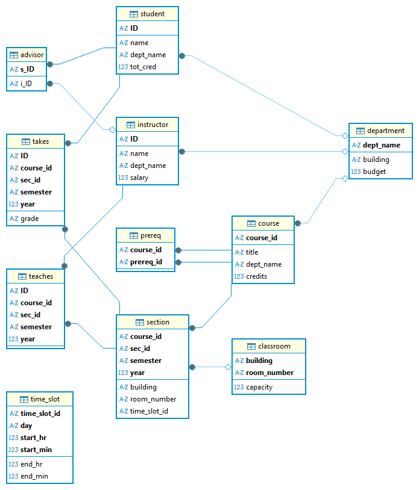

## 参考

### [568数据](http://www.568sj.cn/)

#### [...]()

##### [MySQL / DataType]()

+ [MySQL数据库数据类型详解与性能对比](http://www.568sj.cn/news/01121254636527947776.html)

### [百度云]()

#### [很菜不狗]()

##### [Database / 分布式]()

+ [分布式数据库DDB：架构解析、核心优势与实践指南](https://cloud.baidu.com/article/3555621)

### [bilibili](https://www.bilibili.com/)

#### [77sindu](https://space.bilibili.com/3546955412146263?spm_id_from=333.788.upinfo.detail.click)

#### [徐庶]()

##### [MySql / Lock]()

+ [2026吃透数据库MySQL锁机制全套教程，2天学完mysql10种锁，让你面试少走99%的弯路！](https://www.bilibili.com/video/BV1k4Q4BgEzv/?spm_id_from=333.1391.0.0&vd_source=38fc599412349dcfe60484e3ff320c66)

### [腾讯](https://cloud.tencent.com)

#### [BookSea]()

##### [Database / 锁]()

+ [六个案例搞懂间隙锁](https://cloud.tencent.com/developer/article/2380139)

##### [MySQL / MVCC]()

+ [全网最详细MVCC讲解，一篇看懂](https://cloud.tencent.com/developer/article/2378614)

##### [Database / 分布式]()

+ [分库分表核心理念](https://cloud.tencent.com/developer/article/2450714)

#### [捡田螺的小男孩]()

##### [MySQL / MVCC]()

+ [看一遍就理解：MVCC原理详解](https://cloud.tencent.com/developer/article/1890727)

#### [码农架构](https://cloud.tencent.com/developer/user/5395074)

##### [MySQL / index]()

+ [MySQL索引的原理，B+树、聚集索引和二级索引的结构分析](https://cloud.tencent.com/developer/article/1735294)

### [知乎]()

#### [神州数码AI实践工]()

##### [Database / 分布式]()

+ [什么是分布式数据库？我不信，看完这篇你还不懂!!](https://zhuanlan.zhihu.com/p/503180808)

#### [汉松]()

##### [Database / 分布式]()
    
+ [分布式系统：Lamport 逻辑时钟](https://zhuanlan.zhihu.com/p/56146800)

+ [分布式系统：向量时钟](https://zhuanlan.zhihu.com/p/56886156)
