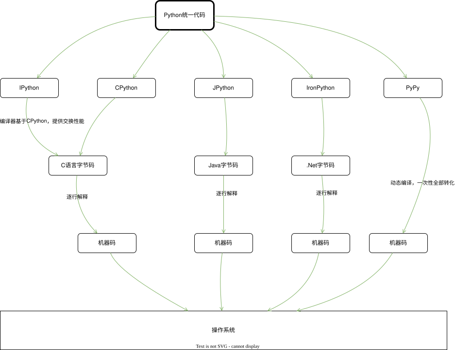
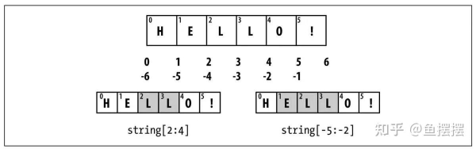
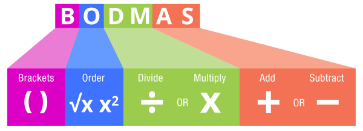
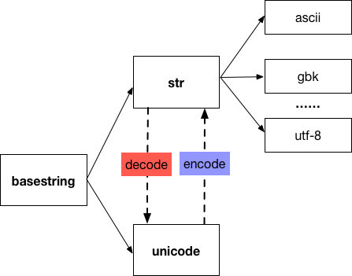

# Python 学习

## Overview

### 相关概念

### Python 解释器 interpreter

+ 解释器，代码与机器的计算机硬件之间的**软件逻辑层**

+ Python环境
  + Python解释器
  + 支持库

+ Python运行
  + 将 每一条 源代码 编译成 字节码
  + PVM(Python Virtual Machine)
    + Psyco 实时编译器 (已停止维护)
    + PyPy 实时编译器
    + Shedskin C++转换器

+ 冻结二进制文件
  + 第三方工具
  + 字节码+PVM混合在一起的独立组件

+ Python 种类

  + 综述

    + 图示

      + [diagram]

        

    + 字节码 vs. 机器码

  + CPython 官方标准实现
    + 类型：C语言解释器
    + 特点
      + 源代码 ==> 字节码，编译器逐行运行
      + 全局解释锁(GIL)限制多线程并行性能

  + IPython
  
  + PyPy 高性能JIT实现
    + 类型：即时编译解释器
    + 特点
      + JIT(Just-In-Time),
      + 动态优化代码
      + 兼容**大部分**CPython和库
      + 默认支持 无栈(Stackless)模式，适合高并发
      + 场景： 计算密集型任务(如，科学计算， 长时间运行)

  + Jython(曾用名：JPython) Java平台
    + 类型：JVM解释器
    + 特点
      + 源代码 ==> Java字节码，运行在JVM上
      + 可直接调用Java类库，实现Python与Java的互操作
      + 无GIL，但性能通常低于CPython
      + 场景： Java生态集成

  + IronPython

### Python 环境

#### summary

+ 安装解释器

+ 运行
  + 终端，PATH含有python可执行文件的路径
    + 适用于小规模测试
  + 直接代码文件
    + "python 代码文件"
  + IDE

+ 配置说明

#### 开发环境

#### 生产环境

## 基础

### 关键字

+ 列表

  + "False"

  + "None"

  + "True"

  + "and"

  + "as"

  + "assert"

  + "async"

  + "await"

  + "break"

  + "class"

  + "continue"

  + "def"

  + "del"

  + "elif"

  + "else"

  + "except"

  + "finally"

  + "for"

  + "from"

  + "global"

  + "if"

  + "import"

  + "in"

  + "is"

  + "lambda"

  + "nonlocal"

  + "not"

  + "or"

  + "pass"

  + "raise"

  + "return"

  + "try"

  + "while"

  + "with"

  + "yield"

+ Soft keywords

  + [官方文档](https://docs.python.org/3.13/reference/lexical_analysis.html#other-tokens)

    + [code]

      ```text
      Added in version 3.10.
      
      Some identifiers are only reserved under specific contexts. These are known as soft       keywords. The identifiers match, case, type and _ can syntactically act as keywords in       certain contexts, but this distinction is done at the parser level, not when tokenizing.
      
      As soft keywords, their use in the grammar is possible while still preserving compatibility       with existing code that uses these names as identifier names.
      
      match, case, and _ are used in the match statement. type is used in the type statement.
      
      Changed in version 3.12: type is now a soft keyword.
      ```

  + [百度百科](https://baike.baidu.com/item/%E8%BD%AF%E5%85%B3%E9%94%AE%E5%AD%97/61987673)

    + [code]

      ```text
      仅在特定上下文中被保留的标志符
      软关键字（Soft Keywords）是编程语言中仅在特定上下文中被保留的标识符，属于计算机语言学科范畴。这类标识符在Python、Scala等语言中以保留语义的方式存在，但其保留性仅限特定语法环境而非全局生效。
      在Python3.10.7版本中，match、case和_等软关键字仅在模式匹配语句上下文具备关键字语义。这种区分通过解析器层级实现，而非在形符化阶段处理，从而保持与使用这些标识符作为变量名的既有代码的兼容性      
      ```

### 变量

#### 命名规则

+ **只能** 字母、数字、下划线 开始
+ **禁止** 数字 开始
+ **禁止** 关键字 内置函数名
+ _建议_ 具有描述性
+ 变量名 要有唯一性

+ 推荐规则

  + 驼峰
    + "CamelCase"
    + 类名, 接口名, 组件名 "UpperCamelCase" / "PascalCase"
    + 变量, 属性, 方法, 函数 "lowerCamelCase"

  + 蛇形命名 
    + "snake_case"

+ 举例说明

  | 变量名 | 是否正确 | 解释 |
  | :---- | :---: | :---- |
  | name@ | 否    |       |
  | a_    | 可    |       |
  | _     | 可    | 不建议，无描述性      |
  | 3n    | 否    |       |
  | 2$t   | 否    |       |
  | __    | 可    | 不建议，无描述性      | 

#### 变量是对象

+ 变量名指向的是数据/对象，而非变量。
  值拷贝，**非**引用拷贝

  + 示例

    + [operating]

      ```python
      >>> age1 = 18
      >>> age2 = age1
      >>> age1 = 20
      >>> age3 = age2
      >>> print(age1, age2, age3)
      20 18 18
      >>>
      ```


### 数据类型 i.e. 内置对象

+ 数字

  + 算术运算符

    + `+`
    + `-`
    + `*`
    + `/`
    + `//`
    + `**`
    + `%`
  
+ 字符串
  + 字符的集合, Collection/Sequence of characters
  + string with double quotes, `""`

  + string with single quotes, `''`

  + Multiline strings

    ```python
    """ 
    """
    ```

  + 字符串拼接, string concatenation
    + `+`

  + 字符串重复, string Multiplication
    + `*`

  + 转义字符, Escape Sequence Characters
    + `\`
    + `\\`
    + `\n`, new line

  + raw string
    + ex.
      + [operating]

        ```cmd
        [edgar@ThinkPadT14P-23 chapter02]$ python
        Python 3.13.13 (main, Apr 26 2026, 22:45:29) [GCC 8.5.0 20210514 (Red Hat 8.5.0-28)] on linux
        Type "help", "copyright", "credits" or "license" for more information.
        >>> print(r"\n\\\'")
        \n\\\'
        >>>
        ```

  + 序列操作
    + 图示

      + [diagram]
        

    + 正向索引

      + 示例

        + [operating]

          ```cmd
          >>> S="HELLO!"
          >>> len(S)
          6
          >>> S[0]
          'H'
          >>> S[4]
          'O'
          >>>          >>>
          ```

    + 反向索引
  
      + 示例

        + [operating]

          ```cmd
          >>> S="HELLO!"
          >>> len(S)
          6
          >>> S[-1]
          '!'
          >>> S[len(S)-1]
          '!'
          >>> S[-5]
          'E'
          >>>
          ```

    + 分片 slice，**半闭半开区间**

      + 示例

        + [operating]

          ```cmd
          >>> S="HELLO!"
          >>> len(S)
          6
          >>> S[2:4]
          'LL'
          >>> S[-5:-2]
          'ELL'
          >>> S[2:]
          'LLO!'
          >>> S[:-2]
          'HELL'
          >>> S[:]
          'HELLO!'
          >>>
          ```

  + 不可改变性，但可以重新赋值

    + 示例

      + [operating]

        ```cmd
        >>> S="HELLO!"
        >>> len(S)
        6
        >>> S[:2]
        'HE'
        >>> S=S[:2]+"l"+S[3:]
        >>> print(S)
        HElLO!
        >>>
        ```
  + 类型特定方法
    + .find()

    + .replace()

    + .split()

    + .upper()

    + .isalpha()

    + .rstrip()

    + 格式化

    + 模式匹配

  + `print()` 函数

+ 布尔类型, Boolean
  + `True`
  + `False`

+ 列表, list
  + 序列 Sequence
  + `[]`

+ 元组, tuple
  + 序列 Sequence
  + `()`

+ 字典, dict
  + 序列 Sequence
  + `{key1:value1, key2:value2, ...}`

+ 集合, set
  + 序列 Sequence
  + `{}` / `set()`

+ 其他类型

+ 编程单元类型

  + 常量/常量表达式

  + 表达式

  + 函数

  + 模块

  + 类

+ 与实现相关的类型
  + 编译的代码堆栈跟踪

### 变量 Variables

+ Variable, 被标识的内存

+ Python中只能通过赋值的方式创建变量，无法声明或定义


### 运算, 表达式

#### 数学计算

#### 字符处理

#### 比较运算

#### 逻辑运算

#### 优先级

+ BODMAS

  + 图示

    + [diagram]

      

### 流程控制

#### 条件控制

#### 循环控制

#### 异常处理

##### summary

+ 错误类型
+ 异常捕获
+ 异常抛出

### 语句, 内置函数, 自定义函数, 函数式编程

#### 内置函数

+ `abs()`

+ `alter()`

+ `all()`

+ `anext()`

+ `any()`

+ `ascii()`

+ `bin()`

+ `bool()`

+ `breakpoint()`

+ `bytearray()`

+ `bytes()`

+ `callable()`

+ `chr()`

+ `classmethod()`

+ `compile()`

+ `complex()`

+ `delattr()`

+ `dict()`

+ `dir()`

+ `divmod()`

+ `enumerate()`

+ `eval()`

+ `exec()`

+ `filter()`

+ `float()`

+ `format()`

+ `frozenset()`

+ `getattr()`

+ `globals()`

+ `hasattr()`

+ `hash()`

+ `help()`

+ `hex()`

+ `id()`

+ `input()`

+ `int()`

+ `isinstance()`

+ `issubclass()`

+ `iter()`

+ `len()`

+ `list()`

+ `locals()`

+ `map()`

+ `max()`

+ `memoryview()`

+ `min()`

+ `next()`

+ `object()`

+ `oct()`

+ `open()`

+ `ord()`

+ `pow()`

+ `print()`

+ `property()`

+ `range()`

+ `repr()`

+ `reversed()`

+ `round()`

+ `set()`

+ `setattr()`

+ `slice()`

+ `sorted()`

+ `staticmethod()`

+ `str()`

+ `sum()`

+ `super()`

+ `tuple()`

+ `type()`

+ `vars()`

+ `zip()`

+ `__import__()`

#### summary

+ 函数定义
+ 函数调用
+ 参数传递

### 面向对象编程 - 一切皆对象

#### summary

+ 程序员视角

  + 程序是由模块构成的
  + 模块包含语句
  + 语句包含表达式
  + 表达式建立并处理对象

+ 类 & 对象
  + 动态语言和静态语言
    Python面向对象更加彻底
  + 函数 和 类 是对象，属于python的顶层对象
    + 类 是 模板对象
    + 将 函数、类 赋值给变量
    + 函数、类 可以添加到集合对象中
    + 函数、类 可以作为参数传递给函数
    + 函数、类 可以作为函数的返回值

  + 模块 是对象


+ 继承 & 多态

+ 封装 & 访问控制

+ 猴子补丁

+ 

### 模块 & 包

#### summary

+ 模块导入
+ 包导入
+ 模块搜索路径

## 专题

### 安装工具

### 虚拟环境

### Python标准库

+ ConfigParser

+ math

+ random

+ re

### 第三方库


#### 数学计算

##### summary

+ cmath

#### 文件操作

##### summary

+ os
+ shutil

#### 日期时间

##### summary

+ datetime

#### 网络

##### summary

+ socket

+ requests

#### 并发

#### 爬虫

#### 金融

#### 科学计算

#### 图形处理

#### 数据分析 和 可视化

##### summary

+ NumPy
+ Pandas
+ Matplotlib
+ Seaborn

#### 机器学习 和 人工智能

##### summary

+ Scikit-learn

+ 数据预处理

+ 机器学习算法

#### Web编程

##### summary

+ Django
  + MTV

+ Flask

#### 数据库

#### 大数据

#### 算法

#### 系统运维

## 附录

### 交互式

### IDE

#### PyCharm

+ File

  + Setting
    + Python
      + Interpreter
        + packages
          + "cfg"
          + "pygame":{"version":"2.6.1"}
    + Editor
      + General
        + [content]
          + Mouse Control
            + [X] Change font size with Ctrl+Mouse Wheel in:
              + [X] Active Editor

      + Color Scheme
        + [content]
          + Schema: VSCode light Modern
        + Color Scheme Font
          + [V] Use color schema font instead of the default
            + Font: Intel One Mono
            + Size: 13, Line height: 1.2
    + Plugins
      + activate-power-mode-x
      + CodeGlance Pro 缩略图
      + Inspection Lens 错误提示
      + Rainbow Brackets 括号成对提示
        
#### Jupyter

#### Anaconda

### 参考

#### internet

##### 官方网站

+ [python.org](https://www.python.org/)

  + [Documentation CN](https://docs.python.org/zh-cn/3.13/index.html)

  + [Documentation EN](https://www.python.org/doc/)

  + [Community](https://www.python.org/community/)

##### 学习网站

+ [百度](http://www.baidu.com)
  + [百度文库](http://wenku.baidu.com)
    + [Python / 基础]()
      + [~~(完整版)python教案~~](https://wenku.baidu.com/view/15e225620a75f46527d3240c844769eae109a357.html?fr=aladdin664466&ind=1&word=Python&aigcsid=0&qtype=0&lcid=1&queryKey=Python&verifyType=&_wkts_=1777200435716&bdQuery=python&chatType=chat)

+ [bilibili]()

  + [python入门特训营]

    + [Python / 基础]()

      + [【97全集】（2025最新）Python高级核心技术全套课程](https://www.bilibili.com/video/BV172nxzzEZT/?spm_id_from=333.337.search-card.all.click&vd_source=38fc599412349dcfe60484e3ff320c66)

+ [C语言中文网](https://c.biancheng.net/)

  + [Python教程](https://c.biancheng.net/python/)

    + [Python / 基础](https://c.biancheng.net/python/)

+ [CSDN](https://www.csdn.net/)
  + [呆呆敲代码的小Y]()
    + [Python / 基础]()
      + [全网最详细的Python入门基础教程，Python最全教程（非常详细，整理而来）](https://xiaoy.blog.csdn.net/article/details/117248277)

### 系统维护

#### "wsl -d AlmaLinux8" ref to : [数据库学习笔记](./Database-Overview-2604.md)

### Tips

+ 字符集相关

  + 图示

    + [diagram]
      

  + 文件首定义
    + [code]

      ```python
      # -*- coding: utf-8 -*-
      ```

+ 编程建议

  + 源文件末尾加空行

### 项目练习

