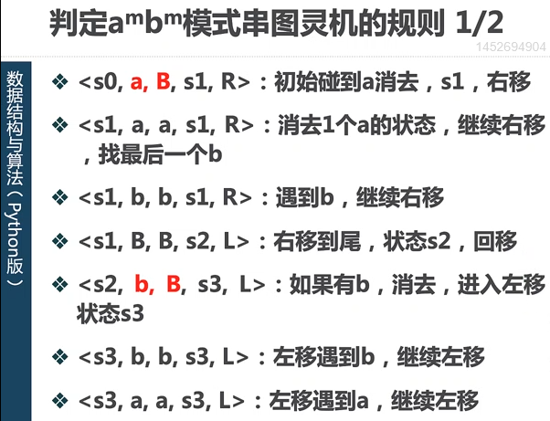
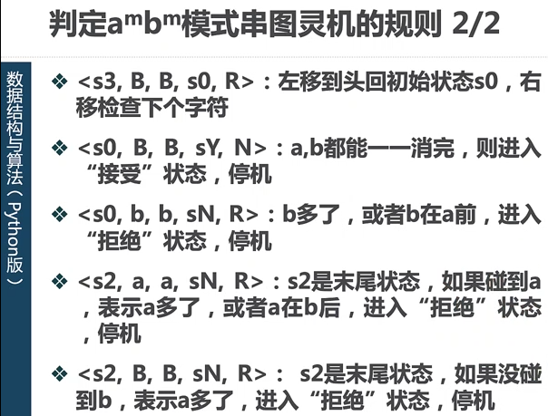
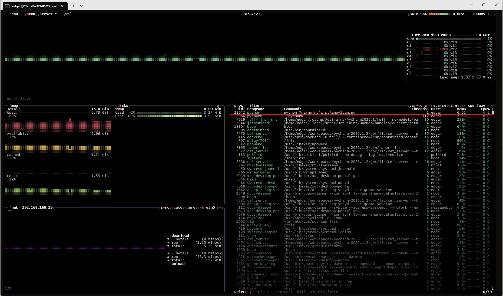

# 数据结构与算法 python版

[中国大学 MOOC / 工学 / 计算机类 / 数据结构于算法-python版](https://higher.smartedu.cn/course/6990e47c95df98bb2711480a)


## 基础

### 计算模型

#### 前情提要

+ Tips: _有穷观点的能行方法_  
  + 理论提出: 希尔伯特
  + 说明
    + 由有限数量的明确有限指令构成
    + 指令执行在有限步骤后终止
    + 指令每次执行都能得到唯一结果
    + 原则上可以由人类笔算
    + 每条指令可以机械的被精确执行，无需智慧和灵感

+ Tips: 计算的数学模型
  + 说明
    + 哥德尔 和 克莱尼 的 _递归函数模型_
    + 丘奇 的 _Lambda演算模型_
    + 博斯特 的 _Post机模型_
    + 图灵 的 _图灵机模型_

  + 说明(结论)
    + 上述 “有穷观点的能行方法” 的计算模型是等价的
    + 希尔伯特 的 _有穷观点的能行方法_ 是无法实现的
    + _有穷观点的能行方法_ 是计算理论的基础

#### 图灵机

+ 基本思想
  用机器模拟人类笔算(数学运算)的过程，但比数值计算更简单

+ 基本要素
  + 纸带
    + 无限长，分格(每格记录一个符号或空)
    + 符号序列
  + 读写头
    + 可左右移动
    + 增、减、改 符号
    + 读取符号
  + 状态寄存器
    + 有限状态集中的一个状态

+ 基本规则
  + 某个**当前状态**，读入某个**当前符号**时
    + **改写符号**
    + **移动读写头**
    + 改变状态(**下一状态**)
  + 规则 5元组
    + 当前状态
    + 当前读入字符
    + 改写字符
    + 读写头移动方向
    + 改写目标状态

+ 基本过程
  + 在纸带上 **添加** 或 **擦除** 某个 **符号**
  + 焦点 从纸带的一个位置转向另一个位置
  + 每个阶段，要决定下一个动作依赖于
    + 此时焦点的位置上的**符号**
    + 此时的**状态**

+ 示例 1
  + 问题描述  
    判定  :左半部全是a，右半部全是b，且 a、b 数量相等的字符串  
    如，ab、aabb、 aaaabbbb，进入接受状态  
    如，b、ba、abb，则进入拒绝状态  

  + 思路
    读写头从开始位置左右移动，将 a 和 b 一一对应消除  
    如果最后剩下空白(Blank)，接受  
    否则，拒绝  
    ..  
    初始状态S0，读写头 位于第一个字符处  
    S1状态是读写头右移  
    S2状态是字符串最右边  
    S3状态是读写头左移  
    _SY状态是接受状态_  
    _SN状态是拒绝状态_  

  + 数据定义

  + 规则履行演算
    + [diagram]  
        
        
    + `<S0, a, B, S1, R>`, 初始碰到a，消去，右移。  
      + S0, "数据结构状态位"S0  
      + a, 读到a  
      + B, 消除a，即，"数据结构字符位"改写字符为B  
      + S1, 进入右移状态S1  
      + R, 读写头右移  

    + `<S1, a, a, S1, R>`, 消去一个啊，继续右移，直到最后一个b  
      + S1, S1状态  
      + a, 读到a  
      + a, (改写字符) 数据结构中字符位(value=a)不变  
      + S1, 进入右移状态S1  
      + R, 读写头右移  

    + `<S1, b, b, S1, R>`, 遇到b，继续右移  
      + 

    + `<S1, B, B, S2, L>`, 右移到尾，状态S2，回移/左移  

    + `<S2, b, B, S3, L>`, 如果读入字符为b， 消去， 进入左移状态S3  

    + `<S3, b, b, S3, L>`, 如果读入字符为b， 继续左移  

    + `<S3, a, a, S3, L>`, 如果读入字符为a， 继续左移  

    + `<S3, B, B, S0, R>`, 左移到头，回到初始状态S0，右移检查下一个字符  

    + `<S0, B, B, SY, N>`, a,b对都能一一消除，进入接受状态，停机  

    + `<S0, b, b, SN, R>`, b多了，或者b在a前，进入拒绝状态，停机  

    + `<S2, a, a, SN, R>`, S2是末尾状态，如果碰到a，表示a多了，或者a在b后，进入拒绝状态，停机  

    + `<S2, B, B, SN, R>`, S2是末尾状态，如果没碰到b，表示a多了，进入拒绝状态，停机

    + 状态转换

      + [table]

        | current_status | reading_sign   | new_sign    | new_status | move_directory |
        | :------------: | :------------: | :---------: | :--------: | :------------- |
        | Data.State     |                | Data.Symbol |            |                |
        | --             | -              | -           | --         | -              |
        | S0             | a              | B           | S1         | R              |
        | S1             | a              | a           | S1         | R              |
        | S1             | b              | b           | S1         | R              |
        | S1             | B              | B           | S2         | L              |
        | S2             | b              | B           | S3         | L              |
        | S3             | b              | b           | S3         | L              |
        | S3             | a              | a           | S3         | L              |
        | S3             | B              | B           | S0         | R              |
        | S0             | B              | B           | SY         | N              |
        | S0             | b              | b           | SN         | R              |
        | S2             | a              | a           | SN         | R              |
        | S2             | B              | B           | SM         | R              |

      + [diagram]

#### 算法和计算复杂度

##### 计算复杂性

##### 抽象和实现

##### 运行时间数量级，时间复杂度

+ 大$O$表示法
  + 上限中最小的

  + 常见大O数量级函数
  
    | f(n)                 | name    |
    | :------------------- | :------ |
    | $ 1 $                | 常数     |
    | $ \log(n) $          | 对数     |
    | $ n $                | 线性     |
    | $ n \times \log(n) $ | 对数线性  |
    | $ n ^ 2 $            | 平方     |
    | $ n ^ 3 $            | 立方     |
    | $ 2 ^ n $            | 指数     |

+ 大$\Omega$表示法
  + 下限中最大的

+ 大$\Theta$表示法
  + 上下限相同

##### 示例： "变位词"判断

变位词，两个词之间存在组成字母的重新排列关系，如, 'heart' vs 'earth', 以及 'python' vs 'typhon'

##### Python数据结构类型的时间复杂度

+ 简表

  + [table]

    | type  | list                   | dict            |
    | :---- | :--------------------- | :-------------- |
    | 索引   | 自然数 i                | 不可变类型值key   |
    | 添加   | append, extend, insert | b[k] = v        |
    | 删除   | pop, remove            | pop             |
    | 更新   | a[i] = v               | b[k] = v        |
    | 正查   | a[i], a[i:j]           | b[k] copy       |
    | 反查   | index[v], count[v]     | None            |
    | 其他   | reverse, sort          | has_key, update |

  + 反查，由值找索引

+ list

  + 按索引取值和赋值

    + 取值 `val_x = a[i]`，执行时间 `O(1)`
    + 赋值 `a[i] = val`，执行时间 `O(1)`

  + 列表扩展

    + 添加元素，`lst_x.append(val)`，执行时间 `O(1)`
    + 附加子列表，`lst_x = lst_x + sublist`, 执行时间`O(n+k)`, n 为 lst_x的长度，k 为 sublist的长度

  + 示例，生成 前n个整数列表的方法

    + 使用 $+$ (列表连接) 操作

      + [code]

        ```python
        def test1():
          lst_x = []
          for i in range(1000):
            lst_x += [i]
        ```

    + 使用 列表的`.append()`方法

      + [code]

        ```python
        def test2():
          lst_y = []
          for i in range(1000):
            lst_y.append(i)
        ```

    + 使用列表推到式

      + [code]

        ```python
        def test3():
          lst_z = [ i for i in range(1000) ]
        ```

    + 使用range函数转换成列表

      + [code]

        ```python
        def test4():
          lst_w = list(range(1000))
        ```

    + [operating]

      ```python
      ┌──(edgar㉿ThinkPadT14P-23)-[~]
      └─$ cd /home/edgar/workspaces/PythonWrkspces/Exercises26/BasicPython
      
      ┌──(edgar㉿ThinkPadT14P-23)-[~/workspaces/PythonWrkspces/Exercises26/BasicPython]
      └─$ source .venv/bin/activate
      
      ┌──(.venv)(edgar㉿ThinkPadT14P-23)-[~/workspaces/PythonWrkspces/Exercises26/BasicPython]
      └─$ cd PythonList/
      
      ┌──(.venv)(edgar㉿ThinkPadT14P-23)-[~/workspaces/PythonWrkspces/Exercises26/BasicPython/PythonList]
      └─$ ll
      total 16
      -rw-r--r-- 1 edgar edgar 817 May 31 23:28 PrgmngPython4_P20_ex01.py
      -rw-r--r-- 1 edgar edgar 674 Jun  1 09:21 PrgmngPython4_P23_ex01.py
      -rw-r--r-- 1 edgar edgar 412 May 31 23:28 README.md
      -rw-r--r-- 1 edgar edgar 714 Jun  1 22:49 Trainning4ListAppend.py
      
      ┌──(.venv)(edgar㉿ThinkPadT14P-23)-[~/workspaces/PythonWrkspces/Exercises26/BasicPython/PythonList]
      └─$ cat Trainning4ListAppend.py
      # -*- coding: utf-8 -*-
      
      def test1():
        lst_x = []
        for i in range(1000):
          lst_x += [i]
      
      def test2():
        lst_y = []
        for i in range(1000):
          lst_y.append(i)
      
      def test3():
        lst_z = [ i for i in range(1000) ]
      
      def test4():
        lst_w = list(range(1000))
      
      from timeit import Timer
      
      t1 = Timer("test1()","from __main__ import test1")
      print("concat %f seconds\n" % (t1.timeit(number=1000)))                        # repeat call test1 function 1000 times
      
      t2 = Timer("test2()","from __main__ import test2")
      print("append %f seconds\n" % (t2.timeit(number=1000)))
      
      t3 = Timer("test3()","from __main__ import test3")
      print("comprehension %f seconds\n" % (t3.timeit(number=1000)))
      
      t4 = Timer("test4()","from __main__ import test4")
      print("list range %f seconds\n" % (t4.timeit(number=1000)))
      
      ┌──(.venv)(edgar㉿ThinkPadT14P-23)-[~/workspaces/PythonWrkspces/Exercises26/BasicPython/PythonList]
      └─$ python Trainning4ListAppend.py
      concat 0.032453 seconds
      
      concat 0.011249 seconds
      
      concat 0.009758 seconds
      
      concat 0.008060 seconds
      
      
      ┌──(.venv)(edgar㉿ThinkPadT14P-23)-[~/workspaces/PythonWrkspces/Exercises26/BasicPython/PythonList]
      └─$
      ```

      + 使用 列表推导式 和 range函数转换成列表 最快
      + 使用 操作符 $+$ 最慢

  + 基本操作的大$O$数量级
    + [table]

      | operation        | Big-O Efficiency        |
      | :--------------- | :---------------------- |
      | Index []         | $O(1)$                  |
      | Index assignment | $O(1)$                  |
      | append           | $O(1)$                  |
      | pop()            | $O(1)$                  |
      | pop(i)           | $O(n)$                  |
      | insert(i, item)  | $O(n)$                  |
      | del operator     | $O(n)$                  |
      | iteration        | $O(n)$                  |
      | contains (in)    | $O(n)$                  |
      | get slice [x:y]  | $O(k)$                  |
      | del slice        | $O(n)$                  |
      | set slice        | $O(n+k)$                |
      | reverse          | $O(n)$                  |
      | concatenate      | $O(k)$                  |
      | sort             | $O(n \times \log(n) )$  |
      | multiply         | $O(n \times k)$         |

  + pop操作讨论
    + pop(i)
      + 说明
        + 移除中间元素后，须将其后元素 copy/附加 到新的尾部
        + 此种数据结构设计，使得索引的读写更加快速
        + 大量的删除，可以采用类似垃圾回收的操作

    + pop()
      + 说明
        + 耗费资源不随 List 的容量发生变化

    + 示例

      + [diagram]

        

      + [operating]

        ```python
        ┌──(edgar㉿ThinkPadT14P-23)-[~]
        └─$ cd /home/edgar/workspaces/PythonWrkspces/Exercises26/BasicPython/
        
        ┌──(edgar㉿ThinkPadT14P-23)-[~/workspaces/PythonWrkspces/Exercises26/BasicPython]
        └─$ source .venv/bin/activate
        
        ┌──(.venv)(edgar㉿ThinkPadT14P-23)-[~/workspaces/PythonWrkspces/Exercises26/BasicPython]
        └─$ cd PythonList
        
        ┌──(.venv)(edgar㉿ThinkPadT14P-23)-[~/workspaces/PythonWrkspces/Exercises26/BasicPython/PythonList]
        └─$ cat Trainning4ListRemovItem.py
        # -*- coding: utf-8 -*_
        
        import timeit
        
        lst_x = list(range(2000000))
        lst_y = list(range(2000000))
        
        poptail = timeit.Timer("lst_x.pop()", "from __main__ import lst_x")
        print("pop list's tail, i.e. pop() :", poptail.timeit(number=1000))
        
        pophead = timeit.Timer("lst_y.pop(0)",  "from __main__ import lst_y")
        print("pop list's head, i.e. pop(0):", pophead.timeit(number=1000))
        
        poptail = timeit.Timer("lst_u.pop()", "from __main__ import lst_u")
        pophead = timeit.Timer("lst_v.pop(0)",  "from __main__ import lst_v")
        
        print("pop tail         pop head          i     lst_u[0]  lst_u[-1] lst_v[0] lst_v[-1]")
        for i in range(1000000, 100000001, 5000000):                                   # start: 1,000,000; to: 100,000,001, step: 5,000,000
            lst_u = list(range(i))
            print_poptail = poptail.timeit(number=1000)
            lst_v = list(range(i))
            print_pophead = pophead.timeit(number=1000)
        
            print ("%15.10f, %15.10f, %10d, %10d, %10d, %10d, %10d" %(print_poptail, print_pophead, i, lst_u[0], lst_u[-1], lst_v[0], lst_v[-1]))
        
        ┌──(.venv)(edgar㉿ThinkPadT14P-23)-[~/workspaces/PythonWrkspces/Exercises26/BasicPython/PythonList]
        └─$ python Trainning4ListRemovItem.py
        pop list's tail, i.e. pop() : 1.4010998711455613e-05
        pop list's head, i.e. pop(0): 0.49119960100142634
        pop tail         pop head         i            lst_u[0]   lst_u[-1]    lst_v[0]   lst_v[-1]
           0.0000155130,    0.2065022720,    1000000,          0,     998999,       1000,     999999
           0.0000131900,    2.5962890160,    6000000,          0,    5998999,       1000,    5999999
           0.0000192310,    4.9345222550,   11000000,          0,   10998999,       1000,   10999999
           0.0000158050,    7.0417468030,   16000000,          0,   15998999,       1000,   15999999
           0.0000199680,    9.6883094150,   21000000,          0,   20998999,       1000,   20999999
           0.0000223420,   11.4675238910,   26000000,          0,   25998999,       1000,   25999999
           0.0000172200,   13.9399268710,   31000000,          0,   30998999,       1000,   30999999
           0.0000129320,   16.1197386310,   36000000,          0,   35998999,       1000,   35999999
           0.0000589760,   18.2878318150,   41000000,          0,   40998999,       1000,   40999999
           0.0000145490,   20.5561134240,   46000000,          0,   45998999,       1000,   45999999
           0.0000224350,   22.6830362680,   51000000,          0,   50998999,       1000,   50999999
           0.0000148940,   25.0429900010,   56000000,          0,   55998999,       1000,   55999999
           0.0000176750,   27.0923537670,   61000000,          0,   60998999,       1000,   60999999
           0.0000204210,   29.4846245650,   66000000,          0,   65998999,       1000,   65999999
           0.0000171120,   31.5674656020,   71000000,          0,   70998999,       1000,   70999999
           0.0000142330,   33.6616881650,   76000000,          0,   75998999,       1000,   75999999
           0.0000203840,   36.1033388350,   81000000,          0,   80998999,       1000,   80999999
           0.0000173620,   38.8509047470,   86000000,          0,   85998999,       1000,   85999999
           0.0000188000,   41.8448245850,   91000000,          0,   90998999,       1000,   90999999
           0.0000420060,   45.4036040450,   96000000,          0,   95998999,       1000,   95999999
        
        ┌──(.venv)(edgar㉿ThinkPadT14P-23)-[~/workspaces/PythonWrkspces/Exercises26/BasicPython/PythonList]
        └─$
        ```

+ dict

  + 按关键码(key) 读写 数据项(value)
    + 取值, `get`, 执行时间 $O(1)$
    + 赋值, `set`, 执行时间 $O(1)$
    + 判断 key 是否存在, `in`, 执行时间 $O(1)$

  + 基本操作的大$O$数量级
    + [table]

      | operation        | Big-O Efficiency        |
      | :--------------- | :---------------------- |
      | copy             | $O(n)$                  |
      | get              | $O(1)$                  |
      | set              | $O(1)$                  |
      | delete           | $O(1)$                  |
      | in               | $O(1)$                  |
      | iteration        | $O(n)$                  |

    + list.in vs dict.in

      + [operating]

        ```python
        ┌──(.venv)(edgar㉿ThinkPadT14P-23)-[~/workspaces/PythonWrkspces/Exercises26/BasicPython]
        └─$ cd PythonDict
        
        ┌──(.venv)(edgar㉿ThinkPadT14P-23)-[~/workspaces/PythonWrkspces/Exercises26/BasicPython/PythonDict]
        └─$ ll
        total 12
        -rw-r--r-- 1 edgar edgar 235 May 31 23:26 PrgmngPython4_P24_ex01.py
        -rw-r--r-- 1 edgar edgar 381 Jun  2 15:52 README.md
        -rw-r--r-- 1 edgar edgar 527 Jun  2 19:42 Trainning4DictFind.py
        
        ┌──(.venv)(edgar㉿ThinkPadT14P-23)-[~/workspaces/PythonWrkspces/Exercises26/BasicPython/PythonDict]
        └─$ cat Trainning4DictFind.py
        # -*- coding: utf-8 -*-
        
        """
        there is not operator/function/method named find, it means contains
        """
        
        import timeit
        import random
        
        for i in range(10000, 1000001, 50000):                                   # start: 1,000,000; to: 100,        000,001, step: 5,000,000
            t = timeit.Timer("random.randrange(%d) in x" % i, "from __main__ import random,x")
            x = list(range(i))
            lst_time = t.timeit(number=1000)
            x ={j:None for j in range(i)}
            d_time = t.timeit(number=1000)
            print("%6d,%10.6f,%10.6f" % (i, lst_time, d_time))
        ┌──(.venv)(edgar㉿ThinkPadT14P-23)-[~/workspaces/PythonWrkspces/Exercises26/BasicPython/PythonDict]
        └─$ python Trainning4DictFind.py
         10000,  0.019206,  0.000237
         60000,  0.101312,  0.000250
        110000,  0.208372,  0.000285
        160000,  0.300222,  0.000290
        210000,  0.362746,  0.000317
        260000,  0.507054,  0.000357
        310000,  0.601750,  0.000412
        360000,  0.723004,  0.000430
        410000,  0.801378,  0.000668
        460000,  0.951743,  0.000558
        510000,  1.053660,  0.000438
        560000,  1.223373,  0.000511
        610000,  1.349482,  0.000607
        660000,  1.431615,  0.001092
        710000,  1.604267,  0.000572
        760000,  1.625104,  0.000711
        810000,  1.776195,  0.000614
        860000,  2.018406,  0.000654
        910000,  2.116714,  0.000608
        960000,  2.332013,  0.000695
        
        ┌──(.venv)(edgar㉿ThinkPadT14P-23)-[~/workspaces/PythonWrkspces/Exercises26/BasicPython/PythonDict]
        └─$
        ```

+ 性能参考

  + [online: python.org/TimeComplexity](https://wiki.python.org/moin/TimeComplexity)
  + [local: python.org/TimeComplexity](ref_docs/Python_org-TimeComplexity.pdf)

+ 操作性能比较

  + [table]

    |       | List   | Dict  | Set   | Tuple |
    | :---- | :----- | :---- | :---- | :---- |
    | 访问   | $O(1)$ | $O(1)$ | $O(1)$ | $O(1)$ |
    | 插头   | $O(n)$ | $O(1)$ | $O(1)$ | 不支持 |
    | 插中   | $O(n)$ | $O(1)$ | $O(1)$ | 不支持 |
    | 插尾   | $O(1)$ | $O(1)$ | $O(1)$ | 不支持 |
    | 去头   | $O(n)$ | $O(1)$ | $O(1)$ | 不支持 |
    | 去中   | $O(n)$ | $O(1)$ | $O(1)$ | 不支持 |
    | 去尾   | $O(1)$ | $O(1)$ | $O(1)$ | 不支持 |
    | 包含   | $O(n)$ | $O(1)$ | $O(1)$ | $O(n)$ |
    | 并集   | $O()$ | $O()$ | $O(n)$ | $O()$ |
    | 交集   | $O()$ | $O()$ | $O(n)$ | $O()$ |
    | 差集   | $O()$ | $O()$ | $O(n)$ | $O()$ |

  + [table]

    |         | List          | Dict         | Set           | Tuple         |
    | :------ | ------------: | -----------: | ------------: | ------------: |
    | 内存占用 | 152 Bytes     |   480 Bytes  | **_736_ Bytes** | **120 Bytes** |
    | 访问速度 | 3.821 ms      | **2.018 ms** | **_4.512_ ms**  |    2.154 ms   |
    | 增加速度 | **5.217 ms**  | **4.762 ms** | 4.893 ms      |               |
    | 删除速度 | **_18.642_ ms** | **4.985 ms** | 5.128 ms      |               |

  + 最佳实践
    + **列表**，
      + 有序
      + 可变
      + 允许重复元素
      + 增删效率慢
    + **字典**，
      + 键唯一
      + 访问速度快
      + 增删效率快
    + **集合**，
      + 无序
      + 可变
      + 不允许重复元素
      + 访问最慢
      + 增删效率中
      + 去重效率高
      + 关系运算效率高
    + **元组**，
      + 有序
      + 不可变
      + 允许重复元素
      + 更适合整体处理
      + 元组 内存占用比 列表 低21%，
      + 访问速度快

### 数据结构 和 数据运算

#### 数据结构概述

+ 线性结构 Linear Structure

  + 说明
    数据项间只存在先后的次序结构

  + 细分类型

    + 栈 Stack

      + LIFO / FILO

    + 队列 Queue

      + LILO / FIFO / First-Come, First-Served

    + 双端队列 Deque

    + 列表 List

+ 非线性结构

  + 细分类型

    + 树

    + 图

#### 线性结构

##### 栈 Stack

+ 抽象数据类型.方法

  + Stack(), 创建空栈
  + push(item), 压栈，将元素item置入栈顶
  + pop(), 弹栈，返回栈顶元素，并移除
  + peek(), 窥栈，返回栈顶元素，但不移除
  + isEmpty(), 判断栈是否为空
  + size(), 返回栈的容量

+ 思路

  + 以 列表 [] 作为基础容器
  + `list[0]` 栈底, stack base
  + `list[-1]` 栈顶, stack top, 便于append和pop
  + 注意，尽量不要反向使用列表(i.e., list[-1] 栈顶， list[0]栈顶)，因为pop(0),

+ 实现

  + [code]

    ```python
    01:  class Stack:
    02:    def __init__(self):
    03:      self.items = []
    04: 
    05:    def isEmpty(self):
    06:      return self.items == []     
    07: 
    08:    def push(self, item):
    09:      self.items.append(item)
    10: 
    11:    def pop(self):
    12:      return self.items.pop()
    13: 
    14:    def peek(self):
    15:      return self.items[len(self.items)-1]    # is it better that `return self.items[-1]`
    16: 
    17:    def size(self):
    18:      return len(self.items)
    ```

    + 技巧

      + line 06, 可简化为 `return not self.items`
      + line 15, 可简化为 `return self.items[-1]`

+ 栈的应用

  + 算术表达式，算术优先级判断

    + 示例，算术表达式，括号匹配

      + [code]

        ```python
        01:  def par_checker(symbolString):
        02:      s = Stack.Stack()
        03:      balanced = True
        04:      index = 0
        05:      while index < len(symbolString) and balanced:
        06:          symbol = symbolString[index]
        07:          if symbol in "([{<":
        08:              s.push(symbol)
        09:          else:
        10:              if s.isEmpty():
        11:                  balanced = False
        12:              else:
        13:                  top = s.pop()
        14:                  if not matches(top, symbol):
        15:                      balanced = False
        16:          index += 1
        17:      if balanced and s.isEmpty():
        18:          return True
        19:      else:
        20:          return False
        21:  
        22:  def matches(open, close):
        23:      opens = "([{<"
        24:      closers = ")]}>"
        25:      return opens.index(open) == closers.index(close)
        26:  
        27:  print(par_checker("((()))"))
        28:  print(par_checker("(())"))
        29:  print(par_checker("((()(()))))"))
        30:  print(par_checker("(({}([]){)})"))
        ```

      + 技巧

        + line 25，利用index来匹配括号类型

  + 十进制 二进制 转换

  + 中缀表达式优先级

    + 中缀表达式，如，$ a + b $  
      + 操作符优先级
      + 全括号表达式，如， $ ( a + b ) $
    + 前缀表达式，如，$ + \ a \ b $  
    + 后缀表达式，如，$ \ a \ b \ + $
    + 示例

      + [table]

        | 普通表达式             | 中缀表达式             | 全括号表达式                | 前缀表达式               | 后缀表达式           |
        | :------------------- | :------------------- | :------------------------ | :--------------------- | :----------------- |
        | $ a + b $            | $ a + b $            | $ ( a + b ) $             | $ +\ a\ b $            | $ a\ b\ + $        |
        | $ a + b \times c $   | $ a + b \times c $   | $ (a + ( b \times c ) ) $ | $ + \ a \times\ b\ c $ | $ abc \times +$  _或_ $ b\ c\ \times a\ + $ |
        | $ (a + b) \times c $ | $ (a + b) \times c $ | $ ((a + b) \times c ) $   |                        | $ a b + c \times $ _或_ $ c\ a\ b\ + \ \times $ |
        |                      | $ a\ +\ b\ \times\ c\ +\ d $ |                   | $ +\ +\ a\ \times\ b\ c\ d $ | $ a\ b\ c\ \times\ +\ d\ + $ |
        |                      | $ (\ a\ +\ b\ )\ \times\ (c\ +\ d) $ |           | $ \times\ +\ a\ b\ +\ c\ d $ | $ a\ b\ +\ c\ d\ +\ \times $ |
        |                      | $ a\ \times\ b\ +\ c\ \times\ d $    |           | $ +\ \times\ a\ b\ \times\ c\ d $ | $ a\ b\ \times\ c\ d\ \times\ + $ |
        |                      | $ a\ +\ b\ +\ c\ +\ d $  |  | $ +\ +\ +\ a\ b\ c\ d $ | $ a\ b\ +\ c\ +\ d\ + $ |

    + 中缀转后缀
      + 从左到右扫描终止表达式中的每个字符，采用一个栈暂存未处理的操作符
      + 栈顶的操作符就是最近暂存进去的，当遇到一个新的操作符，就需要跟栈顶的操作符比较优先级，再处理。
      + 程序所需数据类型定义
        + op_stack，操作符栈
        + postfix_list，后缀表达式
        + token，最小词法单位

    + 处理流程示例

      + 中缀表达式 $ A\ *\ B\ +\ C\ *\ D $
      + 流程简示
        + 0, 初始化  
          + postfix_list: $ \begin{bmatrix} \end{bmatrix}  $
          + op_stack: $ \begin{vmatrix} \end{vmatrix} $

        + 1, 读入 "A",  
          + 动作
            + "A" **入表**。即，输出  
          + postfix_list: $ \begin{bmatrix} A \end{bmatrix} $
          + op_stack: $ \begin{vmatrix} \end{vmatrix} $

        + 2, 读入 "*",  
          + 动作
            + 观察栈顶为 空，"\*" **压栈**  
          + postfix_list: $ \begin{bmatrix} A \end{bmatrix} $
          + op_stack: $ \begin{vmatrix} * \end{vmatrix} $

        + 3, 读入 "B",  
          + 动作
            + "B" **入表**。即，输出
          + postfix_list: $ \begin{bmatrix} A\ B \end{bmatrix} $
          + op_stack: $ \begin{vmatrix} * \end{vmatrix} $

        + 4, 读入 "+"，
          + 动作
            + 观察栈顶为 "\*", 自身优先级低；  
              "\*" **弹栈**，**入表**;  
            + "\+" **压栈**
          + postfix_list: $ \begin{bmatrix} A\ B\ * \end{bmatrix} $
          + op_stack: $ \begin{vmatrix} + \end{vmatrix} $

        + 5, 读入 "C",
          + 动作  
            + "C" **入表**
          + postfix_list: $ \begin{bmatrix} A\ B\ *\ C \end{bmatrix} $
          + op_stack: $ \begin{vmatrix} + \end{vmatrix} $

        + 6, 读入 "*"
          + 动作  
            + 观察栈顶为 "+", 自身优先级高；  
              "\*" **压栈**
          + postfix_list: $ \begin{bmatrix} A\ B\ *\ C \end{bmatrix} $
          + op_stack: $ \begin{vmatrix} * \\ + \end{vmatrix} $

        + 7, 读入 "D"
          + 动作
            + "D" **入表**
          + postfix_list: $ \begin{bmatrix} A\ B\ *\ C\ D \end{bmatrix} $
          + op_stack: $ \begin{vmatrix} * \\ + \end{vmatrix} $

        + 8, 读 结束
          + 动作  
            + **弹栈** + **入表**， 直至栈空
          + postfix_list: $ \begin{bmatrix} A\ B\ *\ C\ D\ *\ + \end{bmatrix} $
          + op_stack: $ \begin{vmatrix} \end{vmatrix} $

  + 中缀表达式求值

##### 队列 Queue

+ 抽象数据类型.方法
  + Queue()
  + enqueue(item)
  + dequeue()
  + isEmpty()
  + size()

##### 双端队列 Dequeue

+ 抽象数据类型.方法
  + Dequeue
  + addFront(item)
  + addRear(item)
  + removeFront()
  + removeRear()
  + isEmpty()
  + size()

##### 优先队列

+ 二叉堆

##### 无序表 - 单链表

##### 无序表 - 双链表

##### 有序表 

##### ~~栈 和 队列~~

##### 串

##### 数据和广义表

#### 非线性结构

##### 树

+ 思路

  + 以 列表 [] 作为基础容器
  + `list[0]` 本节点
  + `list[n]` 第n子节点

+ 实现

  + 嵌套列表法

  + 链表实现

+ 应用

  + 表达式解析

+ 树的遍历

  + 前序遍历

  + 中序遍历

  + 后序遍历

##### 堆

+ 二叉堆

##### 图

### 数据处理基本技术

#### 递归

##### 递归三定律，分治策略

+ 基本结束条件

+ 状态演进

+ 调用自身

##### 递归调用

+ 递归深度限制

  + "RecursionError: maximum recursion depth execcded while ..."

    + 限制设定

      + [operating]

        ```python
        ┌──(Test)(edgar㉿ThinkPadT14P-23)-[~/workspaces/PythonWrkspces/Exercises26/venvTest]
        └─$ python
        Python 3.13.12 (main, Feb  4 2026, 15:06:39) [GCC 15.2.0] on linux
        Type "help", "copyright", "credits" or "license" for more information.
        >>> import sys
        >>> sys.getrecursionlimit()
        1000
        >>> sys.setrecursionlimit(3000)
        >>> sys.getrecursionlimit()
        3000
        >>>
        ```

##### 示例 递归可视化

+ 应用包/模块
  + turtle module (built-in)
    + turtle简述
      模拟海龟在沙滩上爬行而留下的足迹

    + 主要属性
    + 主要方法
      + forward(n), 爬行
      + backward(n),
      + left(a),
      + right(a),
      + penup(),
      + pendown(),
      + pensize(s),
      + pencolor(c)，

    + 螺旋线

    + 分形树，自相似递归

      + 说明
        + 分形 Fractal
        + 一个粗糙或零碎的几何图形，可以分成数个部分，且每一部分都(至少近似地)是整体缩小后地形状，即具有自相似地性质
        + 自然界中地存在，海岸线，山脉，闪电，云朵，雪花，树，etc

    + 谢尔宾斯基三角形 Sierpinski Triangle

      + 说明
        + 分形
        + 真正的谢尔宾斯基三角形是不可见的，其面积为零，其周长无穷大。介于 一维 和 二维 之间 (近似1.585维)
        + 谢尔宾斯基三角形 和 谢尔宾斯基金字塔

    + 汉诺塔 Tower of Hanoi

    + 迷宫探索

##### 递归调用的问题

+ 重复计算问题

  + 记录中间步骤

##### 优化算法和贪心策略

+ 优化问题描述

+ 贪心策略

  + 说明
    + 试图解决问题的尽量大的一部分

+ 贪心策略失效问题

+ 动态规划

#### 查找

##### 顺序查找

##### 二分查找

#### 排序

##### 冒泡排序

##### 选择排序

##### 插入排序

##### 谢尔排序

+ Shell Sort

##### 归并排序

+ Merge Sort

##### 快速排序

+ Quick Sort

##### 散列 hash

+ Hash table

+ hash solt

+ 要求

  + 压缩性
  + 易计算
  + 抗修改
  + 抗冲突

+ 近似完美散列函数
  + MD5
  + SHA
  + hashlib in Python

    + 示例

      + [code]

        ```python
        ┌──(edgar㉿ThinkPadT14P-23)-[~/workspaces/PythonWrkspces/Exercises26/venvTest]
        └─$ source bin/activate
        
        ┌──(Test)(edgar㉿ThinkPadT14P-23)-[~/workspaces/PythonWrkspces/Exercises26/venvTest]
        └─$ python
        Python 3.13.12 (main, Feb  4 2026, 15:06:39) [GCC 15.2.0] on linux
        Type "help", "copyright", "credits" or "license" for more information.
        >>> import hashlib
        >>> text = "Hello, Python"
        >>> encoded_text = text.encode("utf-8")
        >>> hashlib.md5(encoded_text).hexdigest()
        'b14116c1129c4ea326be06eefb11add6'
        >>> hashlib.sha1(encoded_text).hexdigest()
        '0a86b69e6eebf370228e0328090b5f8738029ff0'
        >>>
        ```

+ 冲突解决
  + 开放定址法
    + 线性探测
      + 聚集趋势，连锁式影响附近的散列槽
    + 跳跃探测

=== === ===


### 数据运算 (Create, Read, Update, Delete)

#### 检索

#### 插入

#### 删除

#### 更新
