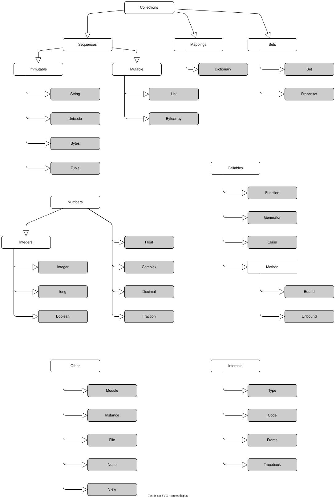

## Python Overview

### Python 解释器 interpreter

+ 解释器，代码与机器的计算机硬件之间的**软件逻辑层**

+ Python环境
  + Python解释器
  + 支持库

+ Python运行
  + 将 每一条 源代码 编译成 字节码
  + PVM(Python Virtual Machine)
    + Psyco 实时编译器 (已停止维护)
    + PyPy 实时编译器
    + Shedskin C++转换器

+ 冻结二进制文件
  + 第三方工具
  + 字节码+PVM混合在一起的独立组件

+ Python 种类

  + 综述

    + 图示

      + [diagram]  
        

    + 字节码 vs. 机器码

  + CPython 官方标准实现
    + 类型：C语言解释器
    + 特点
      + 源代码 ==> 字节码，编译器逐行运行
      + 全局解释锁(GIL)限制多线程并行性能

  + IPython
  
  + PyPy 高性能JIT实现
    + 类型：即时编译解释器
    + 特点
      + JIT(Just-In-Time),
      + 动态优化代码
      + 兼容**大部分**CPython和库
      + 默认支持 无栈(Stackless)模式，适合高并发
      + 场景： 计算密集型任务(如，科学计算， 长时间运行)

  + Jython(曾用名：JPython) Java平台
    + 类型：JVM解释器
    + 特点
      + 源代码 ==> Java字节码，运行在JVM上
      + 可直接调用Java类库，实现Python与Java的互操作
      + 无GIL，但性能通常低于CPython
      + 场景： Java生态集成

  + IronPython

### 虚拟环境

#### venv

+ 说明

  + 目录结构示例 windows

    + 项目名称
      + [D] .idea
      + [D] .venv
        + [D] Include
          + [D] site
            + [D] python*version*
              + [D] pygame

        + [D] Lib
          + [D]site-packages
            + [D] __pycache__
            + [D] pip
            + [D] pip-26.1.dist-info
            + [D] pygame
            + [D] pygame-2.6.1.dist-info
            + [f] _virtualenv.pth
            + [f] _virtualenv.py

        + [D] Scripts
          + [f] activate
          + [f] activate.bat
          + [f] activate.fish
          + [f] activate.nu
          + [f] activate.ps1
          + [f] activate_this.py
          + [f] deactivate.bat
          + [f] pip.exe
          + [f] pip3.13.exe
          + [f] pip3.exe
          + [f] pydoc.bat
          + [f] python.exe
          + [f] python3
          + [f] python3.exe
          + [f] pythonw.exe
          + [f] venvalauncher.exe

+ 操作

  + 创建

    `python -m venv 虚拟环境名`

  + 激活

    + windows 
      `虚拟环境名\Scripts\activate`

    + Linux
      `source 虚拟环境名/bin/activate`

  + 安装包

    `pip install 包名`

  + 退出

    `deactivate`

  + 删除

    删除文件夹/目录即可

#### anaconda

+ conda操作

  + 检索环境，罗列所有环境

    `conda env list`

  + 创建

    + `conda create --name 虚拟环境名 python=版本`

    + `conda create --prefix 环境路径/虚拟环境名 python=版本`  **慎用**

  + 激活

    `conda activate 虚拟环境名`

  + 退出

    `conda deactivate`

  + 删除

    `conda remove --name 虚拟环境名 --all`

#### pipenv

#### virtualenv

### 开发环境

### 生产环境

## Python语言基础

### 关键字

+ 列表

  + "False"

  + "None"

  + "True"

  + "and"

  + "as"

  + "assert"

  + "async"

  + "await"

  + "break"

  + "class"

  + "continue"

  + "def"

  + "del"

  + "elif"

  + "else"

  + "except"

  + "finally"

  + "for"

  + "from"

  + "global"

  + "if"

  + "import"

  + "in"

  + "is"

  + "lambda"

  + "nonlocal"

  + "not"

  + "or"

  + "pass"

  + "raise"

  + "return"

  + "try"

  + "while"

  + "with"

  + "yield"

+ Soft keywords

  + [python.org python3.13参考](https://docs.python.org/3.13/reference/lexical_analysis.html#other-tokens)

    + [quote]


      > Added in version 3.10.
      >
      > Some identifiers are only reserved under specific contexts. These are known as soft  keywords. The identifiers match, case, type and _ can syntactically act as keywords in certain contexts, but this distinction is done at the parser level, not when tokenizing.
      >
      > As soft keywords, their use in the grammar is possible while still preserving compatibility with existing code that uses these names as identifier names.
      >
      > match, case, and _ are used in the match statement. type is used in the type statement.
      >
      > Changed in version 3.12: type is now a soft keyword.

  + [百度百科](https://baike.baidu.com/item/%E8%BD%AF%E5%85%B3%E9%94%AE%E5%AD%97/61987673)

    + [quote]

      > 仅在特定上下文中被保留的标志符
      >
      > 软关键字（Soft Keywords）是编程语言中仅在特定上下文中被保留的标识符，属于计算机语言学科范畴。这类标识符在Python、Scala等语言中以保留语义的方式存在，但其保留性仅限特定语法环境而非全局生效。
      >
      > 在Python3.10.7版本中，match、case和_等软关键字仅在模式匹配语句上下文具备关键字语义。这种区分通过解析器层级实现，而非在形符化阶段处理，从而保持与使用这些标识符作为变量名的既有代码的兼容性

### 内置常量

+ False / True

  > 给 False / True 赋值是非法的并会引发 SyntaxError

  **真正的常数**

+ None

  > 常用于表示无值的对象，例如未向某个函数传入默认参数时。给 None 赋值是非法的并会引发 SyntaxError。  
  > None 是 NoneType 类型的唯一实例。

  **真正的常数**

+ NotImplemented

+ Ellipsis
  
  > 与 ... 相同，常用于表示某些东西被省略的对象。可以给 Ellipsis 赋值，但是给 ... 赋值会引发 SyntaxError。  
  > Ellipsis 是 types.EllipsisType 类型的唯一实例。

+ \_\_debug\_\_

  > 如果 Python 没有以 -O 选项启动，则此常量为真值。 另请参见 assert 语句。


  **真正的常数**

### 基本类型 / 内置类型

#### 类型图示

+ 图示
  + [diagram]  
    

+ 分类: 基本数据类型(标量类型) & 组合数据类型(容器类型)
  + 基本数据类型(标量类型)，只能存储单个值
    + 数值类型 numbers
      + int
      + float
      + complex
      + bool

    + 字符串类型
      + str

    + 空类型
      + ~~null~~ 
      + None

  + 组合数据类型(容器类型)，可以存储多个值/对象

#### NoneType

+ 说明
  + 表示 "空" 或 "无"
  + 不是 0 / 空字符串 / 空列表 / etc.

+ 应用场景
  + 初始化变量
  + 函数返回默认值

+ 示例
  + [operating]

    ```python
    >>> type(None)
    <class 'NoneType'>
    >>>
    ```

  + [operating]

    ```python
    >>> result = None
    >>> result
    >>> type(result)
    <class 'NoneType'>
    >>>
    ```

#### int

#### bool `True` / `False`

+ 说明
  + 非零数字、非空对象 均为True
  + 数0、空对象、特殊对象None 均为False
  + 比较 和 相等测试 会递归地应用在数据结构中
  + 比较 和 相等测试 会返回 True 或 False
  + 布尔 and 和 or 运算符会返回 True 或 False的操作对象

+ 示例

  + [operating]

    ```python
    ┌──(Test)(edgar㉿ThinkPadT14P-23)-[~/workspaces/PythonWrkspces/Exercises26/venvTest]
    └─$ python
    Python 3.13.12 (main, Feb  4 2026, 15:06:39) [GCC 15.2.0] on linux
    Type "help", "copyright", "credits" or "license" for more information.
    >>> 2 - False
    2
    >>> 2 + True
    3
    >>>    
    ```

  + [operating]

    ```python
    >>> bool(None)  # 特殊对象None
    False
    >>> bool(0.0)   # 数值0 为 False
    False
    >>> bool(0.1)   # 非零数字 为 True
    True
    >>> bool(0)     # 数值0 为 False
    False
    >>> bool(2)     # 非零数字 为 True
    True
    >>> bool(1)     
    True
    >>> bool('')    # 空对象 为 False
    False
    >>> bool(' ')
    True
    >>> bool([])    # 空对象 为 False
    False
    >>> bool({})    # 空对象 为 False
    False
    >>> bool(())    # 空对象 为 False
    False
    >>>
    ```

#### float

#### complex

+ 示例
  + [operating]

    ```python
    >>> type((1.5+12j))
    <class 'complex'>
    >>> comp_a = complex(1,2)
    >>> comp_a
    (1+2j)
    >>> comp_a.conjugate()
    (1-2j)
    >>>
    ```

#### str

+ 说明
  + Sequence of characters， 字符序列
  + Immutable， 不可修改

+ 定义方式
  + 双引号定义, string with double quotes, `""`
  + 单引号定义，string with single quotes, `''`
  + 多行定义，Multiline strings
  
      ```python
      """ 
      """
      ```

+ 字符串操作

  + 字符串拼接, string concatenation
    + `+`
      + 示例
        + [operating]

          ```python
          >>> str_a = "hello"
          >>> str_b = "python"
          >>> print(str_a + ", " + str_b)
          hello, python
          >>>
          ```

  + 字符串重复, string Multiplication
    + `*`
      + 示例
        + [operating]

          ```python
          >>> str_a = "hello"
          >>> print( (str_a + " ") * 2)
          hello hello
          >>>
          ```

  + 转义字符, Escape Sequence Characters
    + `\`
    + `\\`
    + `\n`, 新行
    + `\b`, 回退

  + 原文定义，raw string
    + 说明
      不再处理`\`而进行转义
    + 示例
      + [operating]
  
        ```cmd
        [edgar@ThinkPadT14P-23 chapter02]$ python
        Python 3.13.13 (main, Apr 26 2026, 22:45:29) [GCC 8.5.0 20210514 (Red Hat 8.5.0-28)] on linux
        Type "help", "copyright", "credits" or "license" for more information.
        >>> print(r"\n  \\\'")
        \n\\\'
        >>>
        ```
  
  + 序列操作
    + 图示
      + [diagram]  
        

    + 字串长度
      + 示例
        + [operating]

          ```python
          >>> str_a = "hello"
          >>> str_b = "python"
          >>> print(len(str_a + ", " + str_b))
          13
          >>>
          ```

    + 正向索引
      + 示例
        + [operating]
  
          ```cmd
          >>> S="HELLO!"
          >>> len(S)
          6
          >>> S[0]
          'H'
          >>> S[4]
          'O'
          >>>          
          ```
  
    + 反向索引
  
      + 示例
        + [operating]
  
          ```cmd
          >>> S="HELLO!"
          >>> len(S)
          6
          >>> S[-1]
          '!'
          >>> S[len(S)-1]
          '!'
          >>> S[-5]
          'E'
          >>>
          ```
  
    + 分片 slice，**半闭半开区间**
      + 示例
        + [operating]
  
          ```cmd
          >>> S="HELLO!"
          >>> len(S)
          6
          >>> S[2:4]
          'LL'
          >>> S[-5:-2]
          'ELL'
          >>> S[2:]
          'LLO!'
          >>> S[:-2]
          'HELL'
          >>> S[:]
          'HELLO!'
          >>>
          ```
  
  + 不可改变性，但可以重新赋值
    + 示例
      + [operating]
  
        ```cmd
        >>> S="HELLO!"
        >>> len(S)
        6
        >>> S[:2]
        'HE'
        >>> S=S[:2]+"l"+S[3:]
        >>> print(S)
        HElLO!
        >>>
        ```
  
  + 类型特定方法
    + .find()
      + 示例
        + [operating]

          ```python
          >>> "I Love the job".find("ov")
          3
          >>>
          ```

    + .replace()

      + 示例
        + [operating]

          ```python
          >>> "I Love the job".replace("Love", "love")
          'I love the job'
          >>>
          ```

    + .split()

      + 示例
        + [operating]

          ```python
          >>> "I Love the job".split(" ")
          ['I', 'Love', 'the', 'job']
          >>>
          ```

    + .upper() & .lower()

      + 示例

        + [operating]

          ```python
          >>> "I Love the job".upper()
          'I LOVE THE JOB'
          >>> "I Love the job".lower()
          'i love the job'
          >>>
          ```

    + .isalpha()

      + 说明

        > 如果字符串中的所有字符均为字母类并且至少有一个字符则返回 True，否则返回 False。  
        > 字母类字符是指在 Unicode 字符数据库中被定义为 "Letter" 的字符，即通用类别属性为 "Lm", "Lt", "Lu", "Ll" 或 "Lo" 之一的字符。  
        > 请注意这不同于 Unicode 标准 4.10 'Letters, Alphabetic, and Ideographic' 中定义的 Alphabetic 属性。
      + 示例
        + [operating]
  
          ```python
          >>> "I Love the job".isalpha()
          False
          >>> "Hello".isalpha()
          True
          >>> 'µ'.isalpha()    # 非 ASCII 字符也可能为字母类
          True
          >>>
          ```

    + .strip() & .rstrip() & .strip()

      + 示例
        + [operating]

          ```python
          >>> "  I Love the job  ".rstrip()
          '  I Love the job'
          >>> "  I Love the job  ".lstrip()
          'I Love the job  '
          >>> "  I Love the job  ".strip()
          'I Love the job'
          >>>
          ```

    + 格式化

      + 说明

        + [operating]

          ```python
          ```

    + 模式匹配
  
  + `print()` 函数
  
#### list

+ 说明
  + Sequence, 序列
  + Mutable, 可修改
  + 可重复

+ 定义方式
  + `[]` / `list()`

+ 使用场景
  + 有序的批量数据
  + 需要频繁修改的批量数据

+ 示例
  + [operating]

    ```python
    >>> list_a = [ 1, "a", 2, 3, 4, "b", 1, 2, 3, 4 ]
    >>> list_a[5]
    'b'
    >>>
    ```

+ 列表操作

  + 初始化

    + [operating]

      ```python
      >>> lst_1 = []
      >>> lst_1.append("hello")
      >>> lst_1
      ['hello']
      >>> lst_2 = ["hello","the","world"]
      >>> lst_2.append("!")
      >>> lst_2
      ['hello', 'the', 'world', '!']
      >>>
      ```

  + 长度、正反索引、切片
    + 示例
      + [operating]
  
        ```python
        >>> lst_2
        ['hello', 'the', 'world', '!']
        >>> len(lst_2)
        4
        >>> lst_2[1]
        'the'
        >>> lst_2[-2]
        'world'
        >>> lst_2[1:3]
        ['the', 'world']
        >>>
        ```

  + 特定操作

    + .sort()

    + .reverse()

    + 示例
      + [operating]

        ```python
        >>> lst_2
        ['hello', 'the', 'world', '!']
        >>> lst_2.sort()
        >>> lst_2
        ['!', 'hello', 'the', 'world']
        >>> lst_2.reverse()
        >>> lst_2
        ['world', 'the', 'hello', '!']
        >>>
        ```

  + 列表解析 list comprehension expression

    + 提供处理像矩阵结构的工具
    + 源自集合的概念
    + 通过对序列中的每一项运行一个表达式来**创建**一个新列表的方法，每次一个，从左至右

    + 示例

      + 数据

        $$
        M = 
          \begin{vmatrix}
           1 & 2 & 3 \\
           4 & 5 & 6 \\
           7 & 8 & 9
          \end{vmatrix}
        $$

      + [operating]

        ```python
        >>> M = [[1,2,3],[4,5,6],[7,8,9]]
        >>> M
        [[1, 2, 3], [4, 5, 6], [7, 8, 9]]
        >>> col2 = [ row[1] for row in M ]    # 获取第2列
        >>> col2
        [2, 5, 8]
        >>> [ row[2] + 1 for row in M ]    # 第3列数值 + 1
        [4, 7, 10]
        >>> [ row[2] for row in M if row[2] % 2 == 0 ]    # 若第3列数值为偶数，则取出
        [6]
        >>> [ row[1] for row in M if row[1] % 2 == 0 ]    # 若第2列数值为偶数，则取出
        [2, 8]
        >>>
        ```

#### tuple

+ 说明
  + Sequence, 序列
  + Immutable, 不可修改
  + 可重复

+ 定义方式
  + `()`

+ 场景

#### dict

+ 说明
  + 映射 Map（无序，Python3.6-;  有序, Python3.7+）
  + Key不可修改，Value可修改
  + 键唯一

+ 定义方式
  + `{key1:value1, key2:value2, ...}`

+ 场景

+ 示例，键的循环

  + [operating]

    ```python
    >>> D = {'a':1, 'b':2, 'c':3 }
    >>> Ks = list(D.keys())
    >>> Ks
    ['a', 'b', 'c']
    >>> Ks.sort()
    >>> for key in Ks: print(key, "=>", D[key])
    ...
    a => 1
    b => 2
    c => 3
    >>>
    ```

#### set

+ 说明
  + 集合 Set（无序
  + 可变
  + 唯一 (自动去重)

+ 定义方式
  + `{}` / `set()`

+ 场景

#### file

#### 其他类型

+ 说明
  + 类型
  + None
  + ~~bool~~
    + bool类型属于int类型

      + 示例

        + [operating]

          ```python
          ┌──(Test)(edgar㉿ThinkPadT14P-23)-[~/workspaces/PythonWrkspces/Exercises26/venvTest]
          └─$ python
          Python 3.13.12 (main, Feb  4 2026, 15:06:39) [GCC 15.2.0] on linux
          Type "help", "copyright", "credits" or "license" for more information.
          >>> 2 - False
          2
          >>> 2 + True
          3
          >>>
          ```

#### 编程单元类型

+ 说明
  函数、模块、类

#### 与实现相关的类型

+ 说明
  编译的代码堆栈跟踪

#### **内置类型陷阱**

+ 赋值生成引用，而非拷贝

  + 示例

    + [operating]

      ```python
      >>> L = [3, 9, 5]
      >>> M = ['X',L,'Y']
      >>> M
      ['X', [3, 9, 5], 'Y']
      >>> L[1] = 4
      >>> M
      ['X', [3, 4, 5], 'Y']
      >>>
      ```

+ 不可变类型不可在远处改变

+ 嵌套问题

  + 示例
    + [operating]

      ```python
      >>> L = [3,4,5]
      >>> X = L * 4
      >>> Y = [L] * 4
      >>> X
      [3, 4, 5, 3, 4, 5, 3, 4, 5, 3, 4, 5]
      >>> Y
      [[3, 4, 5], [3, 4, 5], [3, 4, 5], [3, 4, 5]]
      >>>
      >>> L[1] = 9
      >>> X
      [3, 4, 5, 3, 4, 5, 3, 4, 5, 3, 4, 5]
      >>> Y
      [[3, 9, 5], [3, 9, 5], [3, 9, 5], [3, 9, 5]]
      >>>
      ```

+ 循环数据结构

  + 循环数据结构，即复合对象/类型包含指向自身的引用

    + 示例

      + [operating]

        ```python
        >>> L = [ 'grail' ]
        >>> L.append(L)
        >>> L
        ['grail', [...]]
        >>>
        ```

  + 注意无限循环


### 运算、运算优先级

#### 算术运算符

+ `+`
+ `-`
+ `*`
+ `/`
+ `//`, 整除
+ `**`, 幂运算
+ `%`, 取余，模运算

+ 类型转换
  + 显式转换
  + 隐式转换

#### 字串相关

#### 比较运算

+ `==` 相等 / 等于
+ `!=` 不等于
+ `>` 大于
+ `>=` 大于等于 / 不小于
+ `<` 小于
+ `<=` 小于等于 / 不大于

#### 逻辑运算

+ `not`
+ `and`
+ `or`

+ 说明
  Python逻辑运算采用了短路设计

+ 示例
  + [operating]

    ```python
    >>> a = 1
    >>> b = 0
    >>> def f1():
    ...     print('function 1')
    ...     return True
    ...
    >>> ( a > b ) or f1()
    True
    >>> ( a < b ) or f1()
    function 1
    True
    >>> ( a < 1 ) and f1()
    False
    >>> ( a > 1 ) and f1()
    False
    >>>
    ```

#### 位运算

+ `~` 位反
  + 说明
    + [diagram]  
      

+ `&` 位与

+ `|` 位或

+ `^` 位异或

+ `>>` 右移
  + 说明
    高位 用 符号位 补位

+ `<<` 左移
  + 说明
    低位 用 0 补位

#### 赋值运算符

+ `=`

  + 示例

    + [operating]

      ```python
      >>> a = 10
      >>> b = 15
      >>> print("a =", a, ", b=", b)
      a = 10 , b= 15
      >>> a, b = b, a
      >>> print("a =", a, ", b=", b)
      a = 15 , b= 10
      >>>      
      ```

+ `+=`

+ `-=`

+ `*=`

+ `/=`

+ `%=`

+ `//=`

+ `**=`

#### 成员运算符

+ `in`

+ `not in`

+ 示例
  + [operating]

    ```python
    >>> 5 in [1, 2, 5]
    True
    >>> 3 in [1, 2, 5]
    False
    >>> 3 not in [1, 2, 5]
    True
    >>> 3 not in [1, 2, 3]
    False
    >>>
    ```

  + [operating]

    ```python
    >>> "ea" in "speak"
    True
    >>>
    ```

#### 身份运算符

+ `is`

+ `is not`

+ `is` vs. `==` 和 `is not` vs. `!=`

  + `is` / `is not` 判断对象是否为同一个
  + `==` / `!=` 判断对象的值是否相等

+ 示例
  + [operating] 1

    ```python
    >>> a = [1]
    >>> b = [1]
    >>> id(a)
    126155726327872
    >>> id(b)
    126155726330048
    >>> a == b
    True
    >>> a is b
    False
    >>>
    ```
  
  + [operating] 2

    ```python
    >>> a = 10
    >>> b = 10
    >>> id(a)
    10841416
    >>> id(b)
    10841416
    >>> a is b
    True
    >>> a = 12
    >>> id(a)
    10841480
    >>> id(b)
    10841416
    >>> a is b
    False
    >>> a is not b
    True
    >>>
    ```

+ 说明

  + 小整数对象创建采用池优化策略。 operating 2
  + 其他容器类对象，则会创建新对象。 operating 1

#### 优先级

+ BODMAS

  + 图示

    + [diagram]  
      

  + 列表

    + [table]

      | priority | operator                                | Notes           |
      | :------- | :-------------------------------------- | :-------------- |
      | 1        | `()`                                    |                 |
      | 2        | `**`                                    | 幂              |
      | 3        | `~`                                     | 位反             |
      | 4        | `+` , `-`                               | 正负             |
      | 5        | `*`, `/` , `%`, `//`                    | 乘、除、模、地板除  |
      | 6        | `+` , `-`                               | 加、减            |
      | 7        | `<<`, `>>`                              | 移位/位移         |
      | 8        | `&`                                     | 位与             |
      | 9        | `^`                                     | 位异或            |
      | 10       | `\|`                                    | 位或             |
      | 11       | `<`, `<=`, `>`, `>=`, `<>`, `\|=`, `==` | 比较             |
      | 12       | `not`                                   | 逻辑非            |
      | 13       | `and`, `or`                             | 逻辑与， 逻辑或    |
      | 14       |                                         | 赋值运算          |


### 内置函数列表

[python.org python3.13参考](https://docs.python.org/zh-cn/3.13/library/functions.html)

+ `abs()`

+ `aiter()`
  + 说明
    + 起始版本，Python3.10
    + 终止版本

+ `all()`
  + 说明
    + 判断可迭代对象中的所有元素是否都为True
    + 起始版本
    + 终止版本

+ `anext()`
  + 说明
    + 起始版本，Python3.10
    + 终止版本

+ `any()`
  + 说明
    + 判断可迭代对象中的所有元素是否都为False
      至少有一个为True时，返回True

    + 起始版本
    + 终止版本

+ `ascii()`

+ `bin()`

+ `bool()`

+ `breakpoint()`

+ `bytearray()`

+ `bytes()`

+ `callable()`

+ `chr()`

+ `classmethod()`

+ `compile()`

+ `complex()`

+ `delattr()`

+ `dict()`

+ `dir()`

+ `divmod()`

+ `enumerate()`

  + 说明
    + 起始版本
    + 终止版本

  + [operating]

    ```python
    >>> S = "splitSting"
    >>> offset = 0
    >>> for item in S:
    ...     print(item, "appears at offset", offset)
    ...     offset += 1
    ...
    s appears at offset 0
    p appears at offset 1
    l appears at offset 2
    i appears at offset 3
    t appears at offset 4
    S appears at offset 5
    t appears at offset 6
    i appears at offset 7
    n appears at offset 8
    g appears at offset 9
    >>>
    >>> for (offset, item) in enumerate(S):
    ...     print(item, "appears at offset", offset)
    ...
    s appears at offset 0
    p appears at offset 1
    l appears at offset 2
    i appears at offset 3
    t appears at offset 4
    S appears at offset 5
    t appears at offset 6
    i appears at offset 7
    n appears at offset 8
    g appears at offset 9
    >>>
    >>> E = enumerate(S)
    >>> E
    <enumerate object at 0x7d3fe0e60860>
    >>> print(type(E))
    <class 'enumerate'>
    >>> next(E)
    (0, 's')
    >>> next(E)
    (1, 'p')
    >>> next(E)
    (2, 'l')
    >>> next(E)
    (3, 'i')
    >>> next(E)
    (4, 't')
    >>> next(E)
    (5, 'S')
    >>> next(E)
    (6, 't')
    >>> next(E)
    (7, 'i')
    >>> next(E)
    (8, 'n')
    >>> next(E)
    (9, 'g')
    >>> next(E)
    Traceback (most recent call last):
      File "<python-input-19>", line 1, in <module>
        next(E)
        ~~~~^^^
    StopIteration
    >>>
    >>> [str(i) + " - " + c for (i, c) in enumerate(S)]
    ['0 - s', '1 - p', '2 - l', '3 - i', '4 - t', '5 - S', '6 - t', '7 - i', '8 - n', '9 - g']
    >>>    ```

+ `eval()`

+ `exec()`

+ `filter()`

+ `float()`

+ `format()`

  + 语法 help(format)

    + [help-text]

      > Help on built-in function format in module builtins:
      >
      > format(value, format_spec='', /)
      >     Return type(value).\_\_format\_\_(value, format_spec)
      >
      >     Many built-in types implement format_spec according to the
      >     Format Specification Mini-language. See help('FORMATTING').
      > 
      >     If type(value) does not supply a method named __format__
      >     and format_spec is empty, then str(value) is returned.
      >     See also help('SPECIALMETHODS').

+ `frozenset()`

+ `getattr()`

+ `globals()`

+ `hasattr()`

+ `hash()`

+ `help()`

+ `hex()`

+ `id()`

  + 语法 help(id)

    + [help-text]

      > Help on built-in function id in module builtins:  
      > 
      > id(obj, /)  
      >     Return the identity of an object.  
      > 
      >     This is guaranteed to be unique among simultaneously existing objects.  
      >     (CPython uses the object's memory address.)  

  + 示例

    + [operating]

      ```python
      >>> a = 10
      >>> print(id(a))
      10841416
      >>>
      ```

+ `input()`

  + 语法 help(input)

    + [help-text]

      > Help on method input in module _pyrepl.readline:  
      > 
      > input(prompt: 'object' = '') -> 'str' method of _pyrepl.readline._ReadlineWrapper instance  

    + parameters
      + "prompt"
        提示信息
      + ”object"
        字符串

  + 示例
    + [operating]

      ```python
      >>> a = input()
      100
      >>> print(type(a))
      <class 'str'>
      >>> a = int(input())
      100
      >>> print(type(a))
      <class 'int'>
      >>>
      ```

  + 示例，文件替代console

    + [operating]

      ```python
      ┌──(Test)(edgar㉿ThinkPadT14P-23)-[~/workspaces/PythonWrkspces/Exercises26/venvTest/model1]
      └─$ echo 3 >> ../etc/inputfile.txt
      
      ┌──(Test)(edgar㉿ThinkPadT14P-23)-[~/workspaces/PythonWrkspces/Exercises26/venvTest/model1]
      └─$ echo 4 >> ../etc/inputfile.txt
      
      ┌──(Test)(edgar㉿ThinkPadT14P-23)-[~/workspaces/PythonWrkspces/Exercises26/venvTest/model1]
      └─$ cat ../etc/inputfile.txt
      3
      4
      
      ┌──(Test)(edgar㉿ThinkPadT14P-23)-[~/workspaces/PythonWrkspces/Exercises26/venvTest/model1]
      └─$ cat ioput_text.py
      a = int(input())
      b = int(input())
      s = a * b
      print(s)
      
      ┌──(Test)(edgar㉿ThinkPadT14P-23)-[~/workspaces/PythonWrkspces/Exercises26/venvTest/model1]
      └─$ python ioput_text.py < ../etc/inputfile.txt
      12
      
      ┌──(Test)(edgar㉿ThinkPadT14P-23)-[~/workspaces/PythonWrkspces/Exercises26/venvTest/model1]
      └─$
      ```

      + `>`, overwrite
      + `>>`, append

+ `int()`

+ `isinstance()`

+ `issubclass()`

+ `iter()`

+ `len()`

+ `list()`

+ `locals()`

+ `map()`

+ `max()`

+ `memoryview()`

+ `min()`

+ `next()`

+ `object()`

+ `oct()`

+ `open()`
  + 语法 help(open)

    + [help-text]

      ```sh
      ...  
      Help on built-in function open in module _io:
      
      open(  
          file,  
          mode='r',  
          buffering=-1,  
          encoding=None,  
          errors=None,  
          newline=None,  
          closefd=True,  
          opener=None  
      )  
          Open file and return a stream.  Raise OSError upon failure.  
          ========= ===============================================================  
          Character Meaning  
          --------- ---------------------------------------------------------------  
          'r'       open for reading (default)  
          'w'       open for writing, truncating the file first  
          'x'       create a new file and open it for writing  
          'a'       open for writing, appending to the end of the file if it exists  
          'b'       binary mode  
          't'       text mode (default)  
          '+'       open a disk file for updating (reading and writing)  
          ========= ===============================================================  
      ```  

  + 示例

    + [operating]

      ```python
      >>> f = open("etc/log1.log","a")
      >>> print("hello, python spring", file=f)
      >>>
      >>> with open("etc/log2.log", "a") as f2:
      ...     print("hi, python print", file=f2)
      ...
      >>> quit()
      
      ┌──(edgar㉿ThinkPadT14P-23)-[~/workspaces/PythonWrkspces/Exercises26]
      └─$ cat etc/log1.log
      hello, python spring
      
      ┌──(edgar㉿ThinkPadT14P-23)-[~/workspaces/PythonWrkspces/Exercises26]
      └─$ cat etc/log2.log
      hi, python print
      
      ┌──(edgar㉿ThinkPadT14P-23)-[~/workspaces/PythonWrkspces/Exercises26]
      └─$
      ```  

      + with 方式，会自动关闭文件。**建议使用该方式**

+ `ord()`

+ `pow()`

  + 等价于 "**"

  + 示例

    + [operating]

      ```python
      >>> pow(2,8)
      256
      >>> 2**8
      256
      >>>
      ```

+ `print()`

  + 语法 help(print)

    + [help-text]

      ```python
      >>> 
      Help on built-in function print in module builtins:
      
      print(*args, sep=' ', end='\n', file=None, flush=False)
          Prints the values to a stream, or to sys.stdout by default.
      
          sep
            string inserted between values, default a space.
          end
            string appended after the last value, default a newline.
          file
            a file-like object (stream); defaults to the current sys.stdout.
          flush
            whether to forcibly flush the stream.
      
      >>>
      ```

    + parameters

      + "objects"
        输出一个或多个对象，输出多个对象需要 "sep" 分隔
      + "sep"
        输出多个对象时使用"sep"指定的分隔符分隔，默认为一个空格
      + "end"
        输出结束后以"end"指定的字符结尾，默认为换行符("\n")
      + "file"
        要写入的文件对象，默认为终端输出("sys.stdout")
      + "flush"
        输出是否被立刻刷新。立刻刷新("True")，默认为缓存("False")

  + 示例

    + [operating]

      ```python
      >>> print("1+1=",1+1)
      1+1= 2
      >>>
      ```

    + [operating]

      ```python
      >>> print("1+1=",1+1, sep="", end="\n")
      1+1=2
      >>> print("1+1",1+1, sep="=", end="\n")
      1+1=2
      >>> print("1+1",1+1, sep=" = ", end="\n")
      1+1 = 2
      >>>
      ```

  + 示例

    + [operating]

      ```python
      >>> print("abcd""efg")
      abcdefg
      >>>
      ```

  + 示例

    + [operating]

      ```python
      >>> text = "%s: %-.4f, %05d" % ("Result", 3.1415926, 42)
      >>> print(text, type(text))
      Result: 3.1416, 00042 <class 'str'>
      >>>
      ```

      + 格式化字符

        + "%c", character
        + "%s", string
        + "%d", Decimal integers
          + "%d", 普通整数
          + "%5d", 5字符长度整数，空格 左 补齐
          + "%05d", 5字符长度整数，0 左 补齐
          + "%-5d", 5字符长度整数，空格 右 补齐
        + "%f", float

  + 示例

    + [operating]

      ```python
      >>> name, age = "Bob Lee", 18
      >>> print(f"name is {name}, aga is {age}")
      name is Bob Lee, aga is 18
      >>>
      ```

      + f表达式

  + 示例

    + [operating]

      ```python
      >>> print("My name is {}, I am {} years old.".format("Bob",18))
      My name is Bob, I am 18 years old.
      >>>
      ```

+ `property()`

+ `range()`
  + 说明
    + 半闭半开区间
    + 步长
  + 示例
    + [operating]

      ```python
      >>> rt = range(0,20,2)
      >>> rt
      range(0, 20, 2)
      >>> for r in rt:
      ...     print(r)
      ...
      0
      2
      4
      6
      8
      10
      12
      14
      16
      18
      >>>
      ```
  
    + [operating]
  
      ```python
      >>> rt = range(0,20,2)
      >>> for i in range(0,len(rt)):
      ...     print( rt[i] )
      ...
      0
      2
      4
      6
      8
      10
      12
      14
      16
      18
      >>>
      ```

+ `repr()`

+ `reversed()`

+ `round()`

+ `set()`

+ `setattr()`

+ `slice()`

+ `sorted()`

+ `staticmethod()`

+ `str()`

+ `sum()`
  + 说明
    `sum(iterable[,start=0])`
  + parameters
    + iterable, 可迭代的对象
    + start, 求和的初始值。默认为 0

+ `super()`

+ `tuple()`

+ `type()`

+ `vars()`

+ `zip()`

+ `__import__()`

### 流程控制

#### 顺序处理

#### 分支选择

+ if

+ if ... else

+ if ... elif ... else

+ 三元表达式
  + 示例

    + [operating]

      ```python
      >>> a = "t" if True else "f"
      >>> print(a)
      t
      >>> a = "t" if False else "f"
      >>> print(a)
      f
      >>> ["f","t"][bool("")]
      'f'
      >>> ["f","t"][bool("True")]
      't'
      >>>
      ```

#### 循环迭代

+ for  

+ while  

+ continue  

+ break  

+ else  

+ pass  

### 内置异常  

#### 异常的层次结构

```text
BaseException
 ├── BaseExceptionGroup
 ├── GeneratorExit
 ├── KeyboardInterrupt
 ├── SystemExit
 └── Exception
      ├── ArithmeticError
      │    ├── FloatingPointError
      │    ├── OverflowError
      │    └── ZeroDivisionError
      ├── AssertionError
      ├── AttributeError
      ├── BufferError
      ├── EOFError
      ├── ExceptionGroup [BaseExceptionGroup]
      ├── ImportError
      │    └── ModuleNotFoundError
      ├── LookupError
      │    ├── IndexError
      │    └── KeyError
      ├── MemoryError
      ├── NameError
      │    └── UnboundLocalError
      ├── OSError
      │    ├── BlockingIOError
      │    ├── ChildProcessError
      │    ├── ConnectionError
      │    │    ├── BrokenPipeError
      │    │    ├── ConnectionAbortedError
      │    │    ├── ConnectionRefusedError
      │    │    └── ConnectionResetError
      │    ├── FileExistsError
      │    ├── FileNotFoundError
      │    ├── InterruptedError
      │    ├── IsADirectoryError
      │    ├── NotADirectoryError
      │    ├── PermissionError
      │    ├── ProcessLookupError
      │    └── TimeoutError
      ├── ReferenceError
      ├── RuntimeError
      │    ├── NotImplementedError
      │    ├── PythonFinalizationError
      │    └── RecursionError
      ├── StopAsyncIteration
      ├── StopIteration
      ├── SyntaxError
      │    └── IndentationError
      │         └── TabError
      ├── SystemError
      ├── TypeError
      ├── ValueError
      │    └── UnicodeError
      │         ├── UnicodeDecodeError
      │         ├── UnicodeEncodeError
      │         └── UnicodeTranslateError
      └── Warning
           ├── BytesWarning
           ├── DeprecationWarning
           ├── EncodingWarning
           ├── FutureWarning
           ├── ImportWarning
           ├── PendingDeprecationWarning
           ├── ResourceWarning
           ├── RuntimeWarning
           ├── SyntaxWarning
           ├── UnicodeWarning
           └── UserWarning
```

#### 常见异常

+ exception **AssertionError**

+ exception **AttributeError**

+ exception **EOFError**

+ ~~exception **FloatingPointError**~~

+ exception **GeneratorExit**

+ exception **ImportError**

+ exception **ModuleNotFoundError**

+ exception **IndexError**

+ exception **KeyError**

+ exception **KeyboardInterrupt**

+ exception **MemoryError**

+ exception **NameError**

+ exception **NotImplementedError**

+ exception **OSError**

+ exception **OverflowError**

+ exception **PythonFinalizationError**

+ exception **RecursionError**

+ exception **ReferenceError**

+ exception **RuntimeError**

+ exception **StopIteration**

+ exception **StopAsyncIteration**

+ exception **SyntaxError**

+ exception **IndentationError**

+ exception **TabError**

+ exception **SystemError**

+ exception **SystemExit**

+ exception **TypeError**

+ exception **UnboundLocalError**

+ exception **UnicodeError**

+ exception **UnicodeEncodeError**

+ exception **UnicodeDecodeError**

+ exception **UnicodeTranslateError**

+ exception **ValueError**

+ exception **ZeroDivisionError**

#### 异常上下文

#### 内置异常衍生类异常

#### 基类异常

#### OS异常

+ OSError = EnvironmentError = IOError = WindowsError

+ exception **BlockingIOError**

+ exception **ChildProcessError**

+ exception **ConnectionError**

+ exception **BrokenPipeError**

+ exception **ConnectionAbortedError**

+ exception **ConnectionRefusedError**

+ exception **ConnectionResetError**

+ exception **FileExistsError**

+ exception **FileNotFoundError**

+ exception **InterruptedError**

+ exception **IsADirectoryError**

+ exception **NotADirectoryError**

+ exception **PermissionError**

+ exception **ProcessLookupError**

+ exception **TimeoutError**

#### 警告

#### 异常组

### 迭代器、生成器 和 专门容器

#### 迭代器

+ 迭代协议
  在内存中物理存储的序列，或一个在迭代操作情况下每次产生一个元素的对象

#### 生成器

#### 专门容器

### Python标准库(内置库)

#### math

+ [python.org python3.13参考](https://docs.python.org/zh-cn/3.13/library/math.html)

+ 常量
  + math.pi
  + math.e
  + math.tau
  + math.inf
  + math.nan

+ 函数

  + 数论函数
  + 浮点算术
  + 浮点操作函数
  + 幂、指、对数
  + 加总、乘积
  + 角度、弧度
  + 三角
  + 双曲
  + 特殊

#### operator

#### os

#### random 伪随机

+ [python.org python3.13参考](https://docs.python.org/zh-cn/3.13/library/random.html)

#### shutil

#### sys

#### ~~telnetlib~~

#### tkinter

### Python第三方库

#### wxPython

#### PyQT

## Python OOP
