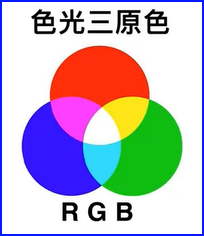

# Python项目实践 PyGame

## HelloWorld

## FireworkShow

## 附录

### PyCharm配置

+ File

  + Setting
    + Python
      + Interpreter
        + packages
          + "pygame":{"version":"2.6.1"}
    + Editor
      + General
        + [content]
          + Mouse Control
            + [X] Change font size with Ctrl+Mouse Wheel in:
              + [X] Active Editor

      + Color Scheme
        + [content]
          + Schema: VSCode light Modern
        + Color Scheme Font
          + [V] Use color schema font instead of the default
            + Font: Intel One Mono
            + Size: 13, Line height: 1.2

### PyGame 常用类/子模块

+ pygame.cdrom
  + 用于访问和控制计算上的CD和DVD驱动器的模块，特别是用于播放音频CD

+ pygame.cursors
  + 用于处理光标资源

+ pygame.color
  + pygame.color使用RGBA
    + RGBA 
      + Red红
        + 饱和度: 0 ~ 255
      + Green绿
        + 饱和度: 0 ~ 255
      + Blue蓝
        + 饱和度: 0 ~ 255
      + Alpha
        + 透明度: 0 ~ 255
        + 类型
          + 像素透明度 pixel alphas
          + 颜色透明度 colorkey
          + 图像透明度 surface alphas
      + 示意

        + [diagram]
          

        + [table]

          | color  | R     | G     | B     |
          | :----- | ----: | ----: | ----: |
          | WHITE  | 255   | 255   | 255   |
          | RED    | 255   | 0     | 0     |
          | YELLOW | 255   | 255   | 0     |
          | GREEN  | 0     | 255   | 0     |
          | BLUE   | 0     | 0     | 255   |
          | BLACK  | 0     | 0     | 0     | 

  + 属性
    + THECOLORS
      + 数据类型: 字典
      + Key-Values
        [PyGame THECOLORS' key-values](./Python-PyGame-THECOLORS.json)

  + 类

    + Color
      + 数据类型: 类

  + 示例
    + [code]

      ```python
      import pygame.color
      
      from pygame.color import THECOLORS
      
      print("------ 1. THECOLORS 字典取值 ------")
      print(THECOLORS)
      print(type(THECOLORS))
      print(THECOLORS['red'])
      print(THECOLORS.get('red'))
      print(type(THECOLORS['green']))
      print("\n")
      
      print("------ 2. Color类/对象 构造函数取值 ------")
      
      myColor = pygame.color.Color(255, 0, 0)
      print(myColor)
      print(type(myColor))
      myColor = pygame.color.Color(255, 0, 0, 255)
      print(myColor)
      print(type(myColor))
      myColor = pygame.color.Color("red")
      print(myColor)
      print(type(myColor))
      myColor = pygame.color.Color("#FF0000")
      print(myColor)
      print(type(myColor))
      myColor = pygame.color.Color("#FF0000FF")
      print(myColor)
      print(type(myColor))
      myColor = pygame.color.Color("0xFF0000")
      print(myColor)
      print(type(myColor))
      myColor = pygame.color.Color("0xFF0000FF")
      print(myColor)
      print(type(myColor))          
      ```


+ pygame.display
  + 控制显示窗口或屏幕
  + 属性
  + 方法
    + blit()
      + Parameters
        1. text, 显示文字
        2. dest, 显示位置

    + fill(), 填充背景色
      + Parameters
        1. color, 填充颜色

    + flip()
      + 说明
        +将完整的待显示的Surface对象更新到屏幕上

    + get_surface()
      + 说明
        获取当前显示的窗口surface对象

    + iconify()
      + 说明
        + 最小化显示Surface对象

    + list_modes()
      + 说明
        + 获取可用全屏模式分辨率的列表

    + mode_ok()
      + 说明
        返回显示模式的最佳颜色深度

    + set_caption(), 设置窗体名称
      + Parameters
        1. text, 窗体名称

    + set_mode(), 设置模式
      + 说明
        + 初始化显示窗体
      + Parameters
        1. size, 元组类型, 窗体大小
        2. flags, 显示模式
           + 0, 默认模式
        3. depth, 颜色深度，像素颜色包含的位数
      + return
        + 对象

    + update(), 更新
      + 说明
        + 更新部分屏幕区域显示


  + 示例 (代码节选)
    + [code]

      ```python
      screen = pygame.display.set_mode((1024, 768), 0, 32 )
      pygame.display.set_caption("Hello World")

      ...
      screen.fill((127, 102, 173))
      screen.blit(text, (100, 100))
      ```

+ pygame.draw
  + 允许开发者绘制简单的几何图形，如线条、矩形、圆形、多边形等

+ pygame.event
  + 用于处理事件和事件队列，如键盘按键、鼠标移动和点击、窗口事件
  + 属性
    + type, pygame.locals 内置的常量
      + QUIT, 退出

  + 方法
    + get()

  + 示例

    + [code]

      ```python
      for event in pygame.event.get():
          ...
      ```

+ pygame.font
  + 允许开发者加载系统字体或自定义字体
  + 属性
  + 方法
    + SysFont()
      + Parameters
        1. name, 系统字体名称
           + None, 系统默认字体
           + "Arial"
           + "Blackadder ITC"
        2. size, 字体大小
    + render()
      + Parameters
        1. text, 显示文字
        2. antialias,
           + true, 抗锯齿算法,平衡边缘
        3. color, RGB

  + 示例
    + [code]

      ```python
      font = pygame.font.SysFont("Arial", 20)
      text = font.render("Hello PyGame World!", True, (255, 255, 255))
      ```

+ pygame.image
  + 用于加载和处理图片，如把图片加载到游戏窗口中，作为游戏背景

+ pygame.key
  + 用于处理键盘事件和按键状态

+ pygame.mouse
  + 用于捕获鼠标状态、位置、以及控制鼠标的可见性和光标图像等

+ pygame.surface
  + 用于表示一个可见的图像区域，可以进行绘制、变换和操作; 可视为画布

+ pygame.rect
  + 用于存储和操作矩形区域
  + 属性
    + up
    + left
    + width
    + height
  + 方法

+ pygame.sprite
  + 拥有独立属性和行为的动画角色
  + 用于游戏对象的管理和碰撞检测

+ pygame.time
  + 用于管理游戏的时间和帧率，如当前时间、设置延迟、使用计时器
  + 属性
  + 方法
    + Clock()
      + 说明

+ pygame.math
  + 用于管理向量(大小 + 方向)
  + 属性
  + 类
    + Vector2 `pygame.math.Vector2`
      + 属性
      + 方法
        + length()
        + magnitude_squared()
        + [operator] `+`
        + [operator] `-`
        + [operator] `*`
        + [operator] `/`
        + dot(...), 标量积，只有数值，没有方法
          + 说明
            两个向量的实部、虚部分别相乘，然后相加
          + 示例
            + [code]

              ```python
              # -*- coding: utf-8 -*-
              
              import pygame
              
              Vector2 = pygame.math.Vector2
              
              v1 = Vector2(3,4)
              v2 = Vector2(100,200)
              
              print(v1.dot(v2))    # 1100.0 = 3 * 100 + 4 * 200 <==> v1 * v2
              ```

        + rotate(), 向量旋转
          + 说明
            + 顺时针旋转，用负数； 逆时针旋转，用正数
          + 示例
            + [code]

              ```python
              # -*- coding: utf-8 -*-
              
              import pygame
              
              Vector2 = pygame.math.Vector2
              
              v1 = Vector2(3,4)
              v2 = Vector2(100,200)
              
              v3 = v1.rotate(-90)
              v4 = v1.rotate(180)
              print(v3, v4)        # [4, -3] [-3, -4]
              ```

        + scale_to_length(), 缩放
          + 说明
            针对向量的长度进行
          + 示例
            + [code]

              ```python
              # -*- coding: utf-8 -*-
              
              import pygame
              
              Vector2 = pygame.math.Vector2
              
              v1 = Vector2(3,4)
              print(v1.length())   # 5.0
              v1.scale_to_length(500)
              print(v1)            # [300, 400] <== [x,y] * (500 / v1.length() ) <==> v1 * 100
              ```

  + 方法

+ pygame.transform
  + 对图像进行翻转、缩放和过滤等操作

+ pygame.mixer_music
  + 用于播放背景音乐，允许加载和播放MP3和wav格式的音乐文件，同时还提供了一些控制播放的功能，如暂停、停止、设置音量等

+ pygame.mixer
  + 用于处理音频的加载、播放、混音和特效等

+ pygame.locals
  + 定义的常量

### 基本流程

+ 导入模块
  + [code]

    ```python
    import pygame
    import sys
    from pygame.locals import *
    ```

+ 创建窗体
  + [code]

    ```python
    screen = pygame.display.set_mode((1024, 768), 0, 32 )
    ```

+ 创建事件管理模块
  + [code]

    ```python
    clock = pygame.time.Clock()
    ```

+ 循环 `while 状态boolean值:`

  + 清屏
    + [code]

      ```python
      screen.fill(,,)
      ```

  + 绘制
    + ...
    + 事件处理
      + [code]

        ```python
        for event in pygame.event.get():
            if event.type == QUIT:
                pygame.quit()
                sys.exit()
            elif event.type == ...:
                ...
        ```
    + ...
  + 刷新
    + 局部 update() / 全部 flip() 

### 参考

+ [bilibili]()

  + [小美好小快乐]()

    + [Pygame游戏开发从入门到精通：从基础语法到项目实战_Python游戏_Python项目_Python实战_](https://www.bilibili.com/video/BV17BRUYCE8p/?spm_id_from=333.788.player.switch&vd_source=38fc599412349dcfe60484e3ff320c66&p=7)