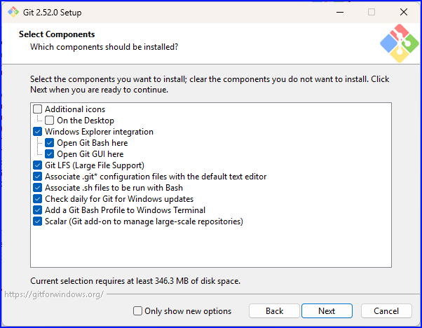
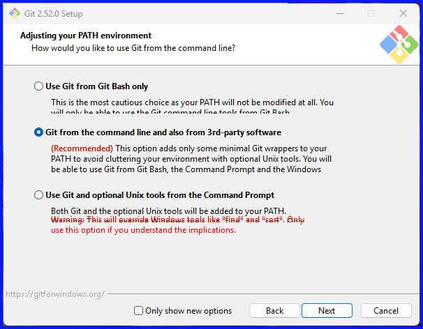
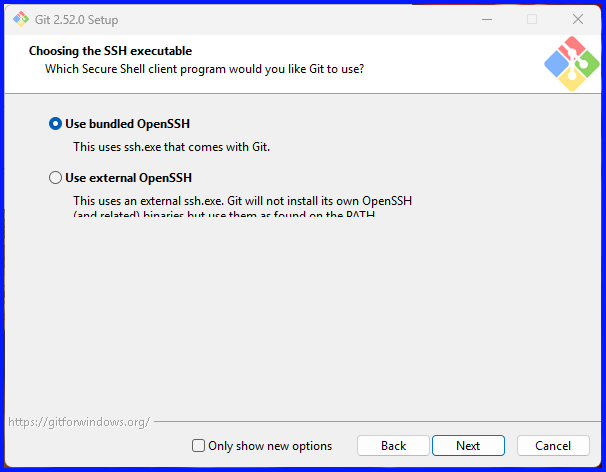
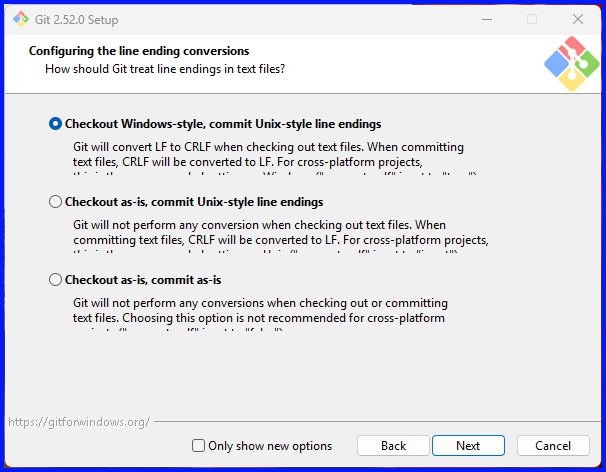
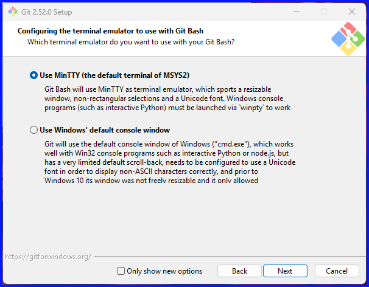
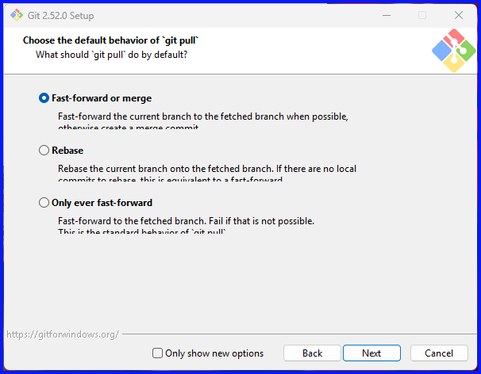
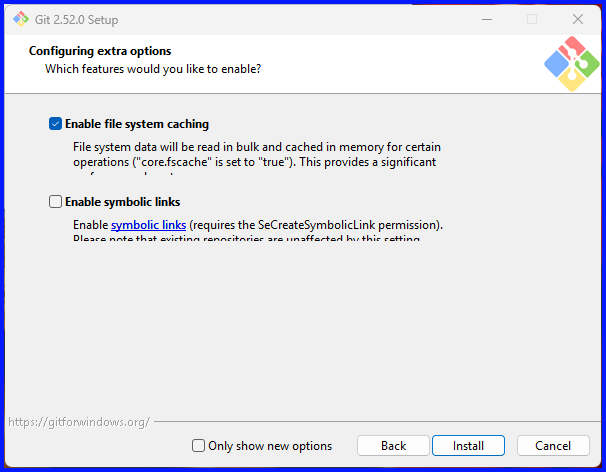
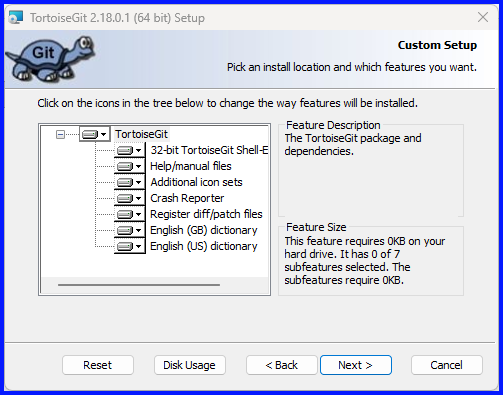
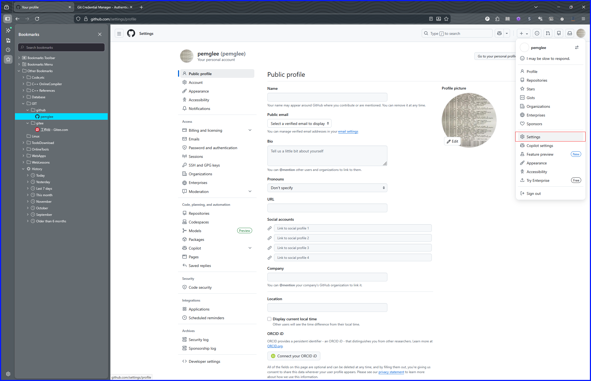

# Git

## Tools installation

### git

#### install

1. start "Git-2.52.0-64-bit.exe"
   

2. set default editor
   

3. set initial branch in new repositories
   

4. set environment PATH
   

5. set SSH executable
   

6. choosing HTTPS transport backend
   

7. configuring the line ending conversions
   

8. confiuring the terminal
   

9. choose behavior of `git pull`
   

10. choose a credential helper
   

11. Configuring extra options
   

#### config

#### Learning Notes

+ 本地仓库 & 远端仓库
  本地仓库, Local Repository, 如 “C:\Workspace\workspaces\GitWrkspces\github\SummitSource”
  远端仓库, Remote Repository, 如 “https://github.com/pemglee”

### TortoiseGit

#### install

+ "TortoiseGit-2.18.0.1-64bit"
  Components
  

#### config

## github

公开仓库 vs 私有仓库

### Settings

+ (Common Conf)
+ Access
  + Password and authentication
    + Sign in methods
    + Two-factor authentication (双重验证)
      1. [[Enable tow-factor authentication]]
      2. (iphone)Microsfot Authenticator 
         1. add personal account
         2. Scan the OR Code
         3. (web-browser)saved the [safe-code.txt](./etc/github-recovery-codes.txt)

### shortcut-keys

+ `/`
+ `t`
+ `l`
+ `?`
  快捷键查看
+ `.`
  启用 "vscode"

### 功能

#### github页面功能

+ [github explore](https://github.com/explore)
+ [github search](https://github.com/search)
+ [github stars](https://github.com/stars)

#### github desktop, TortoiseGit

#### Fork

#### release

"PackageName"\_"Version"\_"OS"\_"CPUFrame".zip
"packageName"\_"Version"\_"OS"\_"CPUFrame".tar.??

#### docker

## Gitee
